<div align="center">

# 📡 **Kansas Frontier Matrix — Security Telemetry Reports**
`docs/reports/security/telemetry/README.md`

**Purpose:**  
Repository of **runtime telemetry, environmental metrics, anomaly detection summaries, and energy compliance logs** that support Kansas Frontier Matrix (KFM)’s FAIR+CARE and ISO 50001/14064 certification.  
Ensures verifiable monitoring of security, energy efficiency, and AI focus-mode behaviors under the Master Coder Protocol (MCP).

[](../../../../README.md)
[](../../../../LICENSE)
[](../../../standards/faircare.md)
[](../../../../releases/v10.0.0/manifest.zip)

</div>

---

## 📘 Overview
This directory stores **security telemetry outputs and AI operational metrics** generated by automated pipelines and Focus Mode instrumentation.  
All logs are timestamped, validated against schema definitions, and included in the official governance ledger for transparency and accountability.

---

## 🗂️ Directory Layout
```
docs/reports/security/telemetry/
 ├── energy/                     # Energy and carbon tracking reports (ISO 50001, ISO 14064)
 ├── focus-mode/                 # AI Focus Mode telemetry summaries and ethical audit traces
 ├── ai-governance/              # Model drift, explainability, and fairness audits
 ├── system-metrics/             # CPU, memory, and container health snapshots (from Prometheus)
 ├── network/                    # Connection and data transfer integrity logs
 ├── lca/                        # Life-cycle assessment data for energy and environmental impact
 └── README.md                   # This index file
```

---

## ⚙️ Telemetry Pipeline Integration
| Component | Description | Source Workflow |
|------------|--------------|----------------|
| **Energy Metrics Collector** | Tracks power usage, CO₂ equivalent emissions, and renewable energy offsets. | `focus-telemetry-validate.yml` |
| **AI Focus Mode Logs** | Captures reasoning traces, explainability summaries, and ethical audit metadata for each Focus Mode session. | `ai-focus-audit.yml` |
| **System Monitoring** | Collects system performance and anomaly data via Prometheus exporters. | `telemetry-monitor.yml` |
| **Network Integrity Validator** | Records HTTPS/TLS checks, latency, and packet integrity between API and frontend. | `net-integrity.yml` |
| **Lifecycle Assessment (LCA)** | Aggregates total resource impact over build–deploy–operate lifecycle. | `sustainability-lca.yml` |

All telemetry data are hashed and cross-linked with the governance ledger and STAC/DCAT metadata catalogs for provenance.

---

## 🧩 Telemetry Data Flow (Mermaid)

```mermaid
flowchart TD
    A["KFM Runtime & Focus Mode"] --> B["Telemetry Collectors (Energy, AI, Network)"]
    B --> C["Prometheus + Trivy Metrics Aggregator"]
    C --> D["JSON Reports (ISO 50001 / FAIR+CARE Schema)"]
    D --> E["docs/reports/security/telemetry/"]
    E --> F["Governance Ledger · Diamond⁹ Ω Attestation"]
```


---

## 📊 Report Types and Examples
| Report Name | Description | Format | Frequency |
|--------------|-------------|---------|------------|
| `focus-telemetry-<timestamp>.json` | Focus Mode AI runtime traces and summaries. | JSON | Per session |
| `energy-metrics-<month>.csv` | Monthly power use and renewable offset report. | CSV | Monthly |
| `ai-drift-report-<date>.json` | Model drift analysis and fairness compliance audit. | JSON | Quarterly |
| `network-latency-summary.json` | Secure transmission latency and TLS certificate audit. | JSON | Weekly |
| `lca-assessment-<year>.pdf` | Annual life-cycle assessment of KFM infrastructure. | PDF | Yearly |

---

## ⚖️ FAIR+CARE & ISO Compliance Mapping
| Standard / Principle | Metric Source | Verification Method |
|----------------------|----------------|---------------------|
| **FAIR Principle – Accessible** | All telemetry files are versioned and linked in the manifest. | STAC/DCAT cross-index |
| **CARE – Responsibility** | AI model logs include ethical filters and anonymization. | FAIR+CARE validator |
| **ISO 50001** | Energy management system metrics. | Power usage and offset audit. |
| **ISO 14064** | Greenhouse gas emission logs. | Lifecycle (LCA) assessments. |
| **MCP-DL v6.3** | Documentation-first verification of telemetry pipeline. | Schema + CI workflow checks. |

---

## 🧾 Validation & Governance
Telemetry validation occurs through continuous integration workflows. Each commit triggers:
- **Schema Validation:** JSON Schema and SPDX verification.  
- **Checksum Validation:** SHA-256 digest comparison against SBOM.  
- **Governance Ledger Update:** New reports appended to FAIR+CARE audit chain.  
- **Energy Trace Export:** Synced to sustainability index for ISO 14064 compliance.

---

## 🕰️ Version History
| Version | Date | Author | Summary |
|----------|------|---------|---------|
| v10.0.0 | 2025-11-09 | FAIR+CARE Council / Sustainability Team | Initial v10 release; added real-time Focus Mode telemetry and ISO 50001 alignment. |
| v9.7.0 | 2025-05-12 | DevSecOps + AI Ethics | Integrated AI explainability and energy audit metrics. |
| v9.5.0 | 2025-02-01 | Infrastructure Team | Introduced automated Prometheus telemetry collection. |

---

<div align="center">

© 2025 Kansas Frontier Matrix · Master Coder Protocol v6.3 · FAIR+CARE Certified · Diamond⁹ Ω / Crown∞Ω Ultimate Certified  
[Back to Security Reports](../README.md) · [Governance Charter](../../../standards/governance/ROOT-GOVERNANCE.md)

</div>

