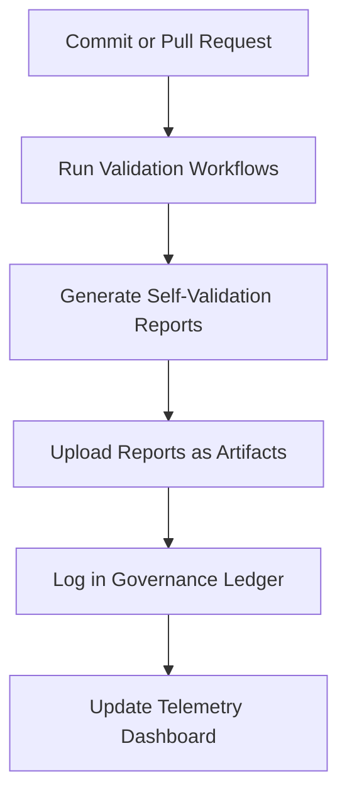

<div align="center">

# ✅ **Kansas Frontier Matrix — Reports: Self-Validation Directory Index**
`docs/reports/self-validation/README.md`

**Purpose:** Provide a hierarchical index and explanation for all **self-validation reports** generated by Kansas Frontier Matrix (KFM) continuous integration (CI/CD) and local validation pipelines.  
These reports ensure **data integrity**, **documentation consistency**, and **FAIR+CARE compliance** across all validated layers of the KFM ecosystem.

[](../../README.md)
[](../../../LICENSE)
[](../../standards/faircare.md)
[]()

</div>

---

## 📘 Overview

The **self-validation report suite** contains automated output from KFM’s validation workflows and FAIR+CARE audits.  
All reports here are machine-generated during repository builds or validation runs using:

- `.github/workflows/stac-validate.yml`
- `.github/workflows/faircare-validate.yml`
- `.github/workflows/docs-lint.yml`
- `.github/workflows/telemetry-export.yml`

Every validation result is timestamped, traceable, and cross-linked to both the **Governance Ledger** (`reports/audit/`) and **Telemetry System** (`releases/v9.7.0/focus-telemetry.json`).

---

## 🗂️ Directory Layout

```
docs/reports/self-validation/
├── README.md                         # This index file
│
├── stac/                             # STAC & DCAT schema validation logs
│   ├── _summary.json
│   ├── pystac_results.json
│   └── stac_validator_results.ndjson
│
├── fair/                             # FAIR+CARE compliance validation outputs
│   ├── faircare_results.ndjson
│   └── faircare_summary.json
│
├── docs/                             # Documentation linting & structure validation
│   ├── lint_summary.json
│   └── violations.ndjson
│
├── experiments/                      # Experiment reproducibility validation
│   ├── experiment_summary.json
│   └── results.ndjson
│
└── sop/                              # SOP reproducibility & governance validation
    ├── sop_validation_summary.json
    └── sop_results.ndjson
```

---

## 🧾 Report Categories

| Directory | Validation Scope | Primary Workflow | Output Summary |
|------------|------------------|------------------|----------------|
| **stac/** | STAC 1.0.0 / DCAT 3.0 metadata schema validation for datasets. | `stac-validate.yml` | `_summary.json` and NDJSON logs |
| **fair/** | FAIR+CARE audit of dataset manifests and ethical governance checks. | `faircare-validate.yml` | `faircare_summary.json` |
| **docs/** | Markdown, YAML, and JSON structural and semantic linting. | `docs-lint.yml` | `lint_summary.json` |
| **experiments/** | Validation of experiment reproducibility and telemetry references. | `faircare-validate.yml` / `make validate-experiments` | `experiment_summary.json` |
| **sop/** | Validation of procedural documents (Standard Operating Procedures). | `docs-lint.yml` / `faircare-validate.yml` | `sop_validation_summary.json` |

---

## 🧮 Validation Lifecycle

All validation reports follow a structured lifecycle through CI/CD:



**Telemetry Output:** `releases/v9.7.0/focus-telemetry.json`  
**Governance Audit Output:** `reports/audit/github-workflows-ledger.json`

---

## ⚙️ Report Metadata Schema

Each report includes standardized fields for consistency and machine interpretation.

| Field | Description | Example |
|--------|-------------|----------|
| `workflow` | Name of workflow or validator executed. | `"stac-validate.yml"` |
| `version` | KFM version during execution. | `"v9.7.0"` |
| `timestamp` | UTC timestamp when report was generated. | `"2025-11-05T18:45:00Z"` |
| `files_validated` | Number of documents or datasets tested. | `243` |
| `passed` | Count of successful validations. | `238` |
| `failed` | Count of validation errors or schema issues. | `5` |
| `telemetry_ref` | Path to telemetry snapshot. | `"releases/v9.7.0/focus-telemetry.json"` |
| `governance_ref` | Path to relevant governance documentation. | `"docs/standards/governance/ROOT-GOVERNANCE.md"` |

---

## 🧩 Integration with Governance & Telemetry

| System | Function | Data Flow |
|---------|-----------|------------|
| **Governance Ledger** | Records validation run IDs and summaries. | `reports/audit/github-workflows-ledger.json` |
| **FAIR+CARE Audit** | Confirms ethical compliance and data integrity. | `reports/fair/faircare_summary.json` |
| **Telemetry Dashboard** | Displays CI success metrics and validation rates. | `docs/reports/telemetry/governance_scorecard.json` |
| **Release Manifest** | Captures SBOM references and data lineage. | `releases/v9.7.0/manifest.zip` |

**Governance Ledger Example:**
```json
{
  "event": "self_validation",
  "workflow": "stac-validate.yml",
  "datasets_validated": 243,
  "passed": 238,
  "failed": 5,
  "timestamp": "2025-11-05T18:30:00Z"
}
```

---

## ⚖️ FAIR+CARE Compliance Alignment

| Principle | Validation Context | Example Implementation |
|------------|--------------------|-------------------------|
| **Findable** | Metadata includes unique dataset IDs and manifest paths. | STAC / DCAT identifiers |
| **Accessible** | All reports are public and machine-readable (JSON/NDJSON). | `docs/reports/self-validation/` |
| **Interoperable** | Schema compatible with FAIR, STAC, and DCAT standards. | JSON Schema 2020-12 |
| **Reusable** | Reports stored with provenance and version history. | Commit SHA and timestamps |
| **CARE** | Includes governance references and cultural oversight logs. | CARE review metadata in FAIR reports |

---

## 🧠 Use Cases

| Use Case | Description |
|-----------|-------------|
| **Reproducibility Verification** | Validate historical experiment outcomes and data processing consistency. |
| **Governance Auditing** | Provide transparency for ethical and technical decision-making. |
| **Telemetry Analytics** | Aggregate validation statistics across releases. |
| **FAIR+CARE Certification** | Prove datasets and models meet ethical and open-data standards. |

---

## 🧾 Example Aggregated Summary (Telemetry Snapshot)

```json
{
  "validation_summary": {
    "stac": { "validated": 243, "passed": 238, "failed": 5 },
    "faircare": { "validated": 243, "passed": 238, "failed": 5 },
    "docs": { "validated": 87, "violations": 0 },
    "experiments": { "validated": 7, "passed": 6, "failed": 1 },
    "sop": { "validated": 12, "passed": 12, "failed": 0 }
  },
  "timestamp": "2025-11-05T20:10:00Z",
  "version": "v9.7.0",
  "telemetry_ref": "releases/v9.7.0/focus-telemetry.json"
}
```

---

## 🧮 Data Retention Policy

| Policy Item | Specification |
|--------------|----------------|
| **Retention Duration** | Permanent archival per release. |
| **File Format** | JSON / NDJSON (UTF-8 encoded). |
| **Checksum Verification** | All reports include SHA-256 checksum via manifest. |
| **Access Level** | Public under CC-BY 4.0 license. |
| **Governance Review** | FAIR+CARE Council reviews reports quarterly. |

---

## 🕰️ Version History

| Version | Date | Author | Summary |
|----------|------|---------|----------|
| v9.7.0 | 2025-11-05 | A. Barta | Created comprehensive self-validation report index for FAIR+CARE audit linkage. |
| v9.5.0 | 2025-10-20 | A. Barta | Added telemetry integration and schema cross-reference. |
| v9.0.0 | 2025-06-01 | KFM Core Team | Established self-validation reporting directory. |

---

<div align="center">

**© 2025 Kansas Frontier Matrix — CC-BY 4.0**  
Generated under **Master Coder Protocol v6.3** · FAIR+CARE Certified · Diamond⁹ Ω / Crown∞Ω Ultimate Certified  
[Back to Reports Index](../README.md) · [Governance Charter](../../standards/governance/ROOT-GOVERNANCE.md)

</div>
