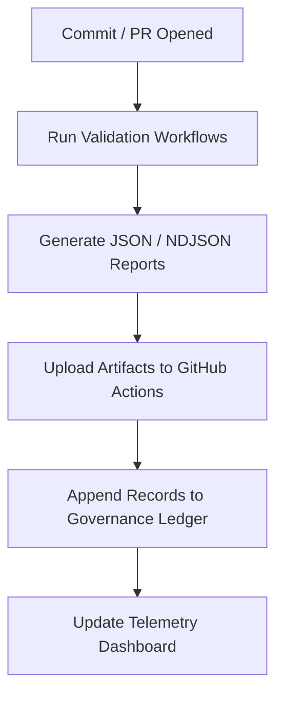

<div align="center">

# ✅ **Kansas Frontier Matrix — Self-Validation Reports Index**
`docs/reports/self-validation/README.md`

**Purpose:** Provide a centralized, hierarchical reference for all automated **self-validation reports** produced by Kansas Frontier Matrix (KFM) pipelines.  
These reports verify **data integrity**, **metadata compliance**, and **FAIR+CARE governance standards** across every validated workflow layer under the **Master Coder Protocol (MCP v6.3)**.

[](../../README.md)
[](../../../LICENSE)
[](../../standards/faircare.md)
[]()

</div>

---

## 📘 Overview

The **self-validation report suite** provides a complete record of automated integrity checks run during CI/CD pipelines and local governance validations.  
These workflows continuously ensure:
- Compliance with FAIR+CARE data ethics  
- Consistency of Markdown, YAML, and JSON schemas  
- STAC/DCAT metadata validity  
- Reproducibility of experiments and procedures  

Generated automatically by:
- `stac-validate.yml`
- `faircare-validate.yml`
- `docs-lint.yml`
- `telemetry-export.yml`

All results are **traceable**, **versioned**, and cross-linked to the **Governance Ledger** (`reports/audit/`) and **Telemetry System** (`releases/v9.7.0/focus-telemetry.json`).

---

## 🗂️ Directory Layout

```
docs/reports/self-validation/
├── README.md                         # This index file
│
├── stac/                             # STAC & DCAT schema validation reports
│   ├── _summary.json
│   ├── pystac_results.json
│   └── stac_validator_results.ndjson
│
├── fair/                             # FAIR+CARE compliance validation outputs
│   ├── faircare_results.ndjson
│   └── faircare_summary.json
│
├── docs/                             # Documentation linting & accessibility reports
│   ├── lint_summary.json
│   └── violations.ndjson
│
├── experiments/                      # Experiment reproducibility validation
│   ├── experiment_summary.json
│   └── results.ndjson
│
└── sop/                              # SOP reproducibility & governance validation
    ├── sop_validation_summary.json
    └── sop_results.ndjson
```

---

## 🧩 Report Categories

| Directory | Validation Scope | Primary Workflow | Output Summary |
|------------|------------------|------------------|----------------|
| **stac/** | STAC 1.0.0 / DCAT 3.0 metadata schema validation for datasets. | `stac-validate.yml` | `_summary.json`, `stac_validator_results.ndjson` |
| **fair/** | FAIR+CARE ethical compliance for dataset manifests. | `faircare-validate.yml` | `faircare_summary.json` |
| **docs/** | Markdown/YAML/JSON structural and accessibility validation. | `docs-lint.yml` | `lint_summary.json` |
| **experiments/** | Reproducibility validation for experiments and AI processes. | `faircare-validate.yml` / `make validate-experiments` | `experiment_summary.json` |
| **sop/** | Validation of Standard Operating Procedures. | `docs-lint.yml` / `faircare-validate.yml` | `sop_validation_summary.json` |

---

## ⚙️ Validation Workflow Lifecycle



**Telemetry Output:** `releases/v9.7.0/focus-telemetry.json`  
**Governance Ledger:** `reports/audit/github-workflows-ledger.json`

---

## 🧾 Metadata Schema (Standardized Fields)

Each report includes consistent fields for versioning, governance, and validation traceability.

| Field | Description | Example |
|--------|-------------|----------|
| `workflow` | Workflow or validation job name. | `"faircare-validate.yml"` |
| `version` | KFM release version. | `"v9.7.0"` |
| `timestamp` | UTC date and time of execution. | `"2025-11-05T18:45:00Z"` |
| `files_validated` | Count of records analyzed. | `243` |
| `passed` | Validation successes. | `238` |
| `failed` | Validation failures. | `5` |
| `telemetry_ref` | Link to telemetry JSON. | `"releases/v9.7.0/focus-telemetry.json"` |
| `governance_ref` | Reference to governance charter. | `"docs/standards/governance/ROOT-GOVERNANCE.md"` |

---

## 🧮 Governance & Telemetry Integration

| System | Function | Output Location |
|---------|-----------|----------------|
| **Governance Ledger** | Logs workflow execution, validation counts, and outcomes. | `reports/audit/github-workflows-ledger.json` |
| **FAIR+CARE Audit** | Verifies ethical and technical compliance of data. | `reports/fair/faircare_summary.json` |
| **Telemetry Dashboard** | Aggregates metrics for compliance visualization. | `docs/reports/telemetry/governance_scorecard.json` |
| **Release Manifest** | Documents version, checksum, and provenance. | `releases/v9.7.0/manifest.zip` |

**Example Ledger Entry:**
```json
{
  "event": "self_validation",
  "workflow": "faircare-validate.yml",
  "files_validated": 243,
  "passed": 238,
  "failed": 5,
  "timestamp": "2025-11-05T18:30:00Z",
  "telemetry_ref": "releases/v9.7.0/focus-telemetry.json"
}
```

---

## ⚖️ FAIR+CARE Compliance Alignment

| Principle | Implementation | Example |
|------------|----------------|----------|
| **Findable** | Metadata indexed with UUIDs and manifest references. | STAC/DCAT identifiers |
| **Accessible** | Public JSON/NDJSON artifacts accessible under CC-BY 4.0. | `docs/reports/self-validation/` |
| **Interoperable** | Validation schemas mapped to FAIR, STAC, and DCAT standards. | JSON Schema 2020-12 |
| **Reusable** | Versioned and checksum-tracked artifacts stored by release. | Manifest & SBOM references |
| **CARE** | CARE metadata reviewed and governance-linked. | `reports/audit/governance-ledger.json` |

---

## 🧾 Example Aggregated Telemetry Snapshot

```json
{
  "validation_summary": {
    "stac": { "validated": 243, "passed": 238, "failed": 5 },
    "faircare": { "validated": 243, "passed": 238, "failed": 5 },
    "docs": { "validated": 87, "violations": 0 },
    "experiments": { "validated": 7, "passed": 6, "failed": 1 },
    "sop": { "validated": 12, "passed": 12, "failed": 0 }
  },
  "version": "v9.7.0",
  "timestamp": "2025-11-05T20:10:00Z",
  "telemetry_ref": "releases/v9.7.0/focus-telemetry.json"
}
```

---

## 🧩 Data Retention & Audit Policy

| Policy Item | Specification |
|--------------|----------------|
| **Retention Period** | Permanent (per release). |
| **Format** | JSON / NDJSON (UTF-8 encoded). |
| **Checksum Verification** | SHA-256 logged in `sbom.spdx.json`. |
| **Access Level** | Public (CC-BY 4.0 license). |
| **Governance Oversight** | Quarterly FAIR+CARE Council review. |

---

## 🧠 Use Cases

| Use Case | Description |
|-----------|-------------|
| **Reproducibility Verification** | Confirms experiment reproducibility and procedural consistency. |
| **Governance Auditing** | Enables ethical and technical transparency across workflows. |
| **Telemetry Analytics** | Aggregates multi-domain validation performance metrics. |
| **FAIR+CARE Certification** | Provides verifiable evidence for open science compliance. |

---

## 🕰️ Version History

| Version | Date | Author | Summary |
|----------|------|---------|----------|
| v9.7.0 | 2025-11-05 | A. Barta | Aligned index structure with FAIR+CARE, telemetry, and governance schema updates. |
| v9.5.0 | 2025-10-20 | A. Barta | Added metadata schema and example ledger entries. |
| v9.0.0 | 2025-06-01 | KFM Core Team | Established foundational self-validation report directory. |

---

<div align="center">

**© 2025 Kansas Frontier Matrix — CC-BY 4.0**  
Validated under **Master Coder Protocol v6.3** · FAIR+CARE Certified · Diamond⁹ Ω / Crown∞Ω Ultimate Certified  
[Back to Reports Index](../README.md) · [Governance Charter](../../standards/governance/ROOT-GOVERNANCE.md)

</div>
