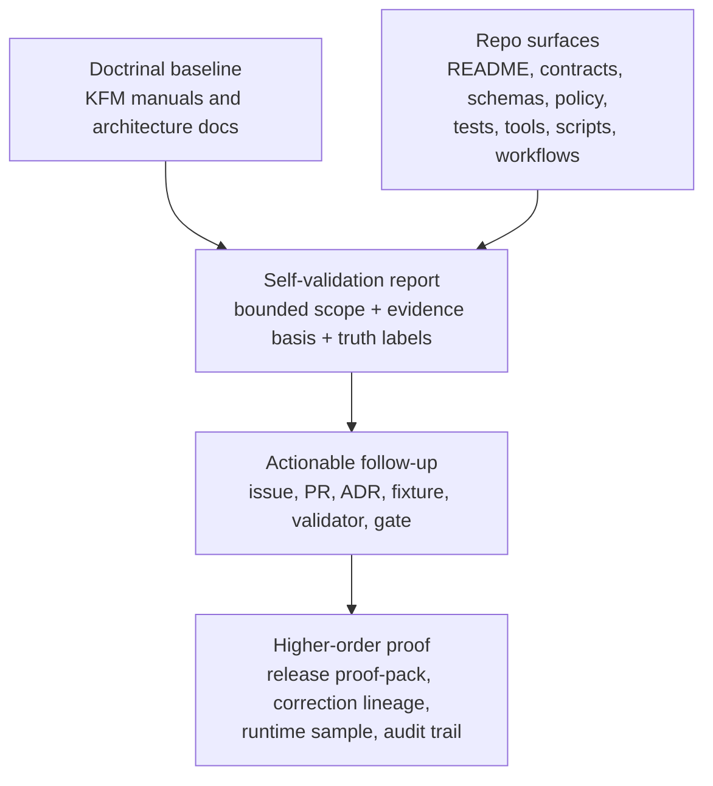

<!-- [KFM_META_BLOCK_V2]
doc_id: kfm://doc/<uuid-NEEDS_VERIFICATION>
title: Self-Validation Reports
type: standard
version: v1
status: draft
owners: <NEEDS_VERIFICATION>
created: YYYY-MM-DD
updated: YYYY-MM-DD
policy_label: <NEEDS_VERIFICATION>
related: [<../../../README.md NEEDS_VERIFICATION>, <../../../contracts/README.md NEEDS_VERIFICATION>, <../../../schemas/README.md NEEDS_VERIFICATION>, <../../../policy/README.md NEEDS_VERIFICATION>, <../../../tests/README.md NEEDS_VERIFICATION>, <../../../tools/README.md NEEDS_VERIFICATION>, <../../../scripts/README.md NEEDS_VERIFICATION>, <../../../.github/workflows/README.md NEEDS_VERIFICATION>, <../readme-structure-reconciliation.md NEEDS_VERIFICATION>]
tags: [kfm, reports, validation, self-validation]
notes: [Target path is confirmed by task request; owners, dates, policy label, and adjacent links still require direct repo verification.]
[/KFM_META_BLOCK_V2] -->

# Self-Validation Reports

Human-reviewable, citation-backed reports for checking KFM claims against visible doctrine, repo surfaces, and implementation evidence.

> **Status:** Experimental *(NEEDS VERIFICATION)*
>
> **Owners:** TODO / NEEDS VERIFICATION
>
>    
>
> **Quick jumps:** [Scope](#scope) · [Repo fit](#repo-fit) · [Inputs](#inputs) · [Exclusions](#exclusions) · [Directory tree](#directory-tree) · [Quickstart](#quickstart) · [Usage](#usage) · [Diagram](#diagram) · [Reference matrix](#reference-matrix) · [Task list](#task-list) · [FAQ](#faq)

## Scope

This directory is for **self-validation artifacts**: reports that compare KFM doctrine, repo-visible documentation surfaces, and actual implementation evidence without smoothing gaps into confident prose.

In KFM, verification is cross-cutting, negative outcomes are first-class, and evidence should remain one hop away from consequential claims. This README therefore treats self-validation as a **review artifact layer**, not as a substitute for contracts, tests, workflow gates, or release proof objects.

A good report here answers questions like these:

- Is a claim **CONFIRMED**, **INFERRED**, **PROPOSED**, **UNKNOWN**, or **NEEDS VERIFICATION**?
- Is a behavior **implemented**, **documented only**, or **described but not yet machine-enforced**?
- Did a change improve trust posture, or only improve prose?
- Are repo surfaces drifting from doctrine, from each other, or from actual proof objects?

> [!IMPORTANT]
> A self-validation report is successful even when its conclusion is “missing,” “partial,” “doc-only,” “stale,” or “not yet proven.” In KFM, visible uncertainty is better than persuasive overclaim.

[Back to top](#self-validation-reports)

## Repo fit

| Aspect | Detail |
|---|---|
| Path | `docs/reports/self-validation/` |
| Role in repo | Report surface for evidence-backed self-checks, reconciliation notes, drift findings, and follow-up validation work |
| Upstream inputs | [`../../../README.md`](../../../README.md), [`../../../contracts/README.md`](../../../contracts/README.md), [`../../../schemas/README.md`](../../../schemas/README.md), [`../../../policy/README.md`](../../../policy/README.md), [`../../../tests/README.md`](../../../tests/README.md), [`../../../tools/README.md`](../../../tools/README.md), [`../../../scripts/README.md`](../../../scripts/README.md), [`../../../.github/workflows/README.md`](../../../.github/workflows/README.md), [`../../../.github/PULL_REQUEST_TEMPLATE.md`](../../../.github/PULL_REQUEST_TEMPLATE.md), [`../../../.github/CODEOWNERS`](../../../.github/CODEOWNERS), [`../readme-structure-reconciliation.md`](../readme-structure-reconciliation.md) |
| Downstream consumers | Maintainer review, PR follow-up, contract/schema cleanup, fixture/test work, workflow/gate hardening, later release-proof or correction work |
| Typical outcome | “Here is what is actually evidenced, what remains unproven, what drift exists, and what should happen next.” |

> [!NOTE]
> The adjacent links above are the **intended repo fit** for this directory. Reconfirm them in-repo when this file is committed. In particular, any report that cites `../readme-structure-reconciliation.md` should treat it as an input to verify, not as self-authenticating truth.

[Back to top](#self-validation-reports)

## Inputs

The following belong here when they are part of a bounded, reviewable validation report:

- Markdown reports that compare doctrine to repo surfaces or repo surfaces to executable proof.
- Drift notes covering `contracts/` versus `schemas/`, policy vocabulary coverage, or “documented vs enforced” mismatches.
- Validation summaries for first-wave trust artifacts such as `SourceDescriptor`, `ValidationReport`, `DatasetVersion`, `DecisionEnvelope`, `EvidenceBundle`, `RuntimeResponseEnvelope`, `CorrectionNotice`, or release-proof-related checks.
- Evidence-backed reviews of trust-visible surfaces such as **Map Explorer**, **Timeline**, **Dossier**, **Story surface**, **Evidence Drawer**, **Focus Mode**, **Compare**, **Export**, or **Review / Stewardship**.
- Gate or harness summaries that clearly link to their actual source of truth instead of duplicating it.
- Small supporting attachments that only make sense together with a report, such as screenshots, generated diffs, text snapshots, or compact JSON excerpts.

## Exclusions

The following do **not** belong here as canonical content:

- Canonical contract definitions or schema files. Put them in [`../../../contracts/`](../../../contracts/) and/or [`../../../schemas/`](../../../schemas/), then report on them here.
- Executable policy bundles, vocab registries, or policy runtime configuration. Put them in [`../../../policy/`](../../../policy/).
- Runnable tests, fixtures, or evaluation harnesses. Put them in [`../../../tests/`](../../../tests/).
- Validator entrypoints and operational helper scripts. Put them in [`../../../tools/`](../../../tools/) or [`../../../scripts/`](../../../scripts/).
- Merge-blocking workflow YAML and CI orchestration. Put them in [`../../../.github/workflows/`](../../../.github/workflows/).
- Canonical release manifests, proof packs, or correction notices as authoritative system artifacts. Link to them here; do not fork them here.

> [!WARNING]
> Do not let this directory become a shadow registry for schemas, policies, fixtures, or proof packs. KFM favors canonical surfaces plus auditable links, not convenient duplication.

[Back to top](#self-validation-reports)

## Directory tree

Only `README.md` is confirmed by the current task. Everything else below is a **PROPOSED** starter layout, shown here so the directory can grow without becoming shapeless.

```text
docs/reports/self-validation/
├── README.md
├── YYYY-MM-DD-<scope>-self-validation.md     # PROPOSED report naming pattern
├── evidence/                                 # PROPOSED; report-local support files only
│   └── <supporting-artifact>
└── archive/                                  # PROPOSED; optional, for closed reports only
    └── <older-report>.md
```

## Quickstart

1. Pick a **bounded scope**.
   - Example: “contract starter wave,” “workflow gate reality,” “Focus negative-path behavior,” or “README drift vs repo.”
2. Name the report so its purpose is obvious.
   - A safe starter pattern is `YYYY-MM-DD-<scope>-self-validation.md` *(PROPOSED naming rule)*.
3. Record the **evidence basis first**.
   - List the repo surfaces, doctrine documents, PRs, or generated artifacts actually inspected.
4. Separate findings by truth posture.
   - Use **CONFIRMED**, **INFERRED**, **PROPOSED**, **UNKNOWN**, and **NEEDS VERIFICATION** explicitly.
5. Convert every meaningful gap into a next action.
   - Missing validator, stale README, unresolved schema home, absent fixtures, unproven gate, etc.
6. Link outward instead of copying canonical content.
   - A self-validation report should point to the contract, test, workflow, or proof artifact that matters.
7. End with a clear result.
   - “Safe to merge,” “needs follow-up,” “doc-only,” “blocked by missing proof,” or similar.

### Minimal starter flow

```text
doctrine / repo surface / proof object
            ↓
      self-validation report
            ↓
      issue / PR / ADR / repair
```

[Back to top](#self-validation-reports)

## Usage

### What a strong report contains

| Section | Why it exists |
|---|---|
| Goal / scope | Prevents a report from turning into a vague repo tour |
| Evidence basis | Makes the review inspectable and reproducible |
| Confirmed findings | Separates hard evidence from conjecture |
| Inferred structure | Allows conservative completion without pretending it is mounted reality |
| Proposed follow-up | Turns diagnosis into reversible next work |
| Unknowns / needs verification | Preserves the trust posture |
| Drift or contradiction notes | Captures where doctrine, docs, and proof disagree |
| Exit state | States whether the result is acceptable, blocked, partial, or awaiting evidence |

### Suggested report skeleton

```markdown
# YYYY-MM-DD — <scope> self-validation

## Goal
What exact claim, directory, contract family, gate, or surface is being checked?

## Evidence basis
What files, docs, PRs, screenshots, logs, or artifacts were actually inspected?

## CONFIRMED
What is directly supported?

## INFERRED
What small structural completion is strongly implied but not directly proven?

## PROPOSED
What follow-up or fix is recommended?

## UNKNOWN / NEEDS VERIFICATION
What could not be supported strongly enough?

## Drift / contradictions
Where do doctrine, docs, repo structure, or proof objects disagree?

## Next actions
What should change next, by whom, and in what order?
```

> [!TIP]
> Prefer narrow reports over omnibus reports. “Workflow gates for contract starter wave” is a healthier scope than “entire repo validation status.”

### Truth-label rules for this directory

| Label | Use it when | Do not use it for |
|---|---|---|
| **CONFIRMED** | Directly evidenced from inspected materials | Educated guesses |
| **INFERRED** | Small, conservative structural completion strongly implied by repeated project patterns | Speculative design jumps |
| **PROPOSED** | Recommended next move or starter shape | Current implementation claims |
| **UNKNOWN** | No strong current evidence was found | Soft disagreement |
| **NEEDS VERIFICATION** | A claim might be true, but the report did not prove it | Cosmetic uncertainty |

### What this directory is especially good at

- Checking whether **repo README surfaces** still match doctrine.
- Calling out **doc-only** workflow or policy claims.
- Tracking **schema-home drift** between `contracts/` and `schemas/`.
- Distinguishing **runtime proof** from **design intent**.
- Capturing whether a trust-visible surface claim has actual evidence behind it.
- Converting vague “we should validate this” language into a concrete checklist.

[Back to top](#self-validation-reports)

## Diagram


```mermaid
flowchart TD
    A[Doctrinal baseline<br/>KFM manuals and architecture docs]
    B[Repo surfaces<br/>README, contracts, schemas, policy,<br/>tests, tools, scripts, workflows]
    C[Self-validation report<br/>bounded scope + evidence basis + truth labels]
    D[Actionable follow-up<br/>issue, PR, ADR, fixture, validator, gate]
    E[Higher-order proof<br/>release proof-pack, correction lineage,<br/>runtime sample, audit trail]

    A --> C
    B --> C
    C --> D
    D --> E
```

## Reference matrix

| Validation focus | Canonical surfaces to inspect first | Typical report outcome | Keep the authoritative artifact here? |
|---|---|---|---|
| Contract starter wave | `contracts/`, `schemas/`, `policy/`, `tests/` | “Schema home unresolved,” “fixtures absent,” “wave partially defined,” etc. | **No** |
| Validator + merge gate | `tools/`, `scripts/`, `.github/workflows/` | “Validator documented,” “workflow missing,” “merge-blocking unproven,” etc. | **No** |
| Trust-visible shell claims | UI/shell docs, screenshots, runtime samples | “Evidence Drawer linked,” “Focus negative path missing,” “state chips visible,” etc. | **No** |
| Correction lineage | release docs, correction docs, published surface evidence | “Supersession visible,” “withdrawal path missing,” “proof pack absent,” etc. | **No** |
| README / documentation drift | root and package READMEs, reconciliation notes | “README aligns,” “section drift,” “stale links,” “claim exceeds evidence,” etc. | **No** |
| Thin-slice readiness | domain docs, contracts, tests, workflows, release evidence | “Hydrology-first ready,” “blocked on validator,” “blocked on policy bundle,” etc. | **No** |

### High-value questions this directory should help answer

| Question | Why it matters in KFM |
|---|---|
| Is this claim merely documented, or actually enforced? | KFM rejects trust theater |
| Is the evidence path visible and reconstructable? | Evidence must remain operational at point of use |
| Are negative outcomes represented honestly? | Abstain/deny/error/hold are valid states, not embarrassment |
| Is a report linking to canonical sources, or silently duplicating them? | Avoid shadow truth surfaces |
| Has correction lineage stayed visible after change? | Trust depends on repair, not only on first publication |

[Back to top](#self-validation-reports)

## Task list

### Definition of done for a single self-validation report

- [ ] Scope is bounded to one claim family, surface, gate, or repo seam.
- [ ] Evidence basis is listed before conclusions.
- [ ] Every meaningful claim is labeled **CONFIRMED**, **INFERRED**, **PROPOSED**, **UNKNOWN**, or **NEEDS VERIFICATION**.
- [ ] Canonical links point outward to the real contract, policy, test, workflow, or proof surface.
- [ ] Drift between `contracts/` and `schemas/` is called out explicitly when relevant.
- [ ] Reports do not claim CI enforcement, merge blocking, or runtime behavior without proof.
- [ ] Unknowns are converted into concrete next checks.
- [ ] Findings are written so they can survive code review and later correction.

### Review checks for maintainers

- [ ] Does the report say what it checked?
- [ ] Does it separate repo evidence from doctrine?
- [ ] Does it avoid inventing implementation?
- [ ] Does it point to the next responsible surface?
- [ ] Does it reduce ambiguity for the next PR?

> [!CAUTION]
> A report that sounds polished but cannot reconstruct its evidence path is not finished.

[Back to top](#self-validation-reports)

## FAQ

### Is this directory a replacement for tests or CI?

No. It is a **review surface**. Tests, fixtures, validators, and workflow gates live in their canonical homes. A report here may summarize them, but it should not impersonate them.

### Can a self-validation report say that a feature is “working”?

Only when the report cites evidence that actually proves the behavior. Otherwise say **UNKNOWN**, **NEEDS VERIFICATION**, or “documented only.”

### Should this directory hold release proof packs?

No. It can hold human-readable notes *about* release proof, but authoritative release artifacts should stay in their canonical release or operations surfaces.

### What is the difference between a reconciliation note and a self-validation report?

A reconciliation note mainly repairs structure or cross-linking. A self-validation report asks whether a claim, path, gate, or surface is actually supported by evidence.

### Can a report here cover UI, policy, data, and workflows at once?

It can, but only if the scope remains coherent. In most cases, smaller reports are easier to review and less likely to hide overclaim.

[Back to top](#self-validation-reports)

## Appendix

<details>
<summary><strong>PROPOSED filename guidance</strong></summary>

Use filename patterns that make sorting and grep easy:

- `YYYY-MM-DD-<scope>-self-validation.md`
- `YYYY-MM-DD-<scope>-drift-note.md`
- `YYYY-MM-DD-<scope>-evidence-check.md`

Good `<scope>` values are short and concrete:

- `contract-starter-wave`
- `workflow-gates`
- `focus-negative-paths`
- `readme-drift`
- `correction-lineage`

</details>

<details>
<summary><strong>Starter prompts for report authors</strong></summary>

Use one or more of these prompts when opening a new report:

- “Which exact claim am I testing?”
- “What materials did I inspect, and what did I *not* inspect?”
- “Which parts are directly evidenced?”
- “Which parts are only inferred from doctrine?”
- “What would need to exist for this claim to become CONFIRMED?”
- “What canonical surface should own the actual fix?”
- “If this finding is wrong, what evidence would overturn it?”

</details>

<details>
<summary><strong>Safe authoring rules</strong></summary>

1. Link to canonical artifacts instead of retyping them.
2. Keep screenshots or generated files adjacent only when the Markdown explains why they matter.
3. Prefer reversible, additive fixes.
4. Treat stale, generalized, denied, withdrawn, partial, or doc-only findings as legitimate outcomes.
5. Update this README when the directory gains a stable naming convention or a confirmed owner.

</details>

[Back to top](#self-validation-reports)
