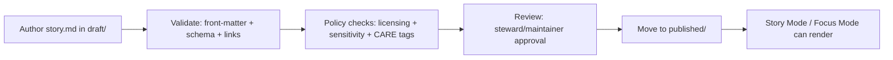

# Story Nodes (`docs/reports/story_nodes/`)


Story Nodes are **governed, machine-ingestible narratives** that bind:

- **claims** ↔ **citations** ↔ **provenance**
- **map/timeline states** ↔ **datasets/assets**
- **human-readable storytelling** ↔ **API-resolvable evidence objects**

This folder is the canonical home for Story Node content and supporting assets.

> **Source of truth rule**
> If this README conflicts with a governed template or schema, **the template/schema wins**.
> - Story Node template: `docs/templates/TEMPLATE__STORY_NODE_V3.md`
> - Story Node schema: `schemas/storynodes/`


---

## 📘 Overview

### Purpose

- Provide a **consistent home + workflow** for Story Nodes (draft → review → published).
- Ensure Story Nodes remain **evidence-first**: every material claim is traceable to resolvable sources.
- Make Story Nodes **safe to render** in Story Mode / Focus Mode without violating sensitivity rules.

### Scope

| In scope | Out of scope |
|---|---|
| Story Node Markdown (`story.md`) | Raw datasets (`data/raw/`) |
| Story Node assets (images/media used in stories) | Working/processed pipeline outputs (unless referenced as evidence) |
| Templates and example snippets for authors | Application code, services, UI implementation |
| Publishing workflow (draft → published) | Data ingestion / ETL runbooks (see `docs/standards/` and `docs/patterns/`) |

### Audience

- **Authors / curators** writing Story Nodes
- **Reviewers / stewards** validating evidence, licensing, CARE/FAIR, and sensitivity
- **Engineers** implementing schema validation, rendering, and evidence resolver contracts

### Definitions

- **Story Node**: a governed narrative artifact intended for UI playback (map/timeline + narrative rail) and retrieval.
- **Evidence object**: a resolvable reference to a cataloged artifact (STAC/DCAT/PROV/doc/graph).
- **Evidence bundle**: a digest-addressed grouping of catalogs + assets supporting a story or claim.
- **Trust membrane**: the enforced boundary where UI and external clients access data **only via** the governed API + policy layer.

### Key artifacts

- **Template**: `docs/templates/TEMPLATE__STORY_NODE_V3.md`
- **Repository standards**: `docs/standards/` (Markdown protocol, repo structure, STAC/DCAT/PROV profiles)
- **Governance policies**: `docs/governance/` (ethics, sovereignty, review gates)
- **Schemas**: `schemas/storynodes/` (Story Node metadata/content schema)

### Definition of Done (DoD) for a Story Node change

- [ ] Story Node uses the **v3 template** (or is migrated to it)
- [ ] YAML front-matter is **present + schema-valid**
- [ ] Every non-trivial claim has **one or more citations**
- [ ] Every citation has a **resolvable reference** (or expected 403/404)
- [ ] Sensitivity rules are respected (no restricted coordinate leakage)
- [ ] Licensing/attribution for included assets is captured
- [ ] Links pass validation (no broken internal refs)
- [ ] Draft/published placement follows workflow rules below
- [ ] CI gates pass (markdown, schema, policy, security scans)


---

## 🗂️ Directory Layout

### This folder

```text
docs/reports/story_nodes/
├── README.md
├── templates/
│   ├── README.md               # optional: local guidance + examples
│   └── ...                     # optional: story-node-specific snippets
├── draft/
│   └── <story_slug>/
│       ├── story.md            # draft narrative (v3)
│       └── assets/             # draft assets (keep small; see notes)
└── published/
    └── <story_slug>/
        ├── story.md            # published narrative (v3)
        └── assets/             # published assets (immutable once released)
```

### Naming conventions

- `<story_slug>`: **kebab-case**, stable, filesystem-safe  
  Example: `bleeding-kansas-1856-lawrence`
- `story.md`: the canonical filename for the narrative document in both `draft/` and `published/`.
- `assets/`: keep a **flat or shallow** layout (avoid deep nesting unless needed).

> **Tip:** Prefer stable slugs over dates. If you need versions, version in front-matter and/or releases,
> not in file paths (unless a governance policy requires path versioning).


---

## 🔁 Workflow

### Draft → Published (high-level)



### Publishing rules

- **Draft** is for works-in-progress. Drafts may contain placeholders, but:
  - placeholders must be clearly marked,
  - sensitive data must still be handled correctly.
- **Published** content is assumed renderable by default, and should be treated as **immutable** except via:
  - an explicit revision process (PR with justification),
  - changelog entry (where required),
  - review gate pass.

> If a story must be retracted or superseded, prefer **publish a new revision** and mark the old one as
> superseded/retracted in front-matter rather than deleting history.

<details>
<summary><strong>Suggested PR checklist (copy/paste)</strong></summary>

- [ ] Story Node front-matter complete (status, version, dates, governance fields)
- [ ] Citations resolvable via evidence resolver contract
- [ ] No sensitive location leak (coords, inferable geometry, high-resolution tiles)
- [ ] Rights/license/attribution captured for story assets
- [ ] Any AI-generated content is explicitly labeled and opt-in (if applicable)
- [ ] CI green (markdown lint, schemas, policy, secret scan)

</details>


---

## 🧱 Story Node v3 essentials

### Minimal skeleton (illustrative)

> Use the canonical template in `docs/templates/TEMPLATE__STORY_NODE_V3.md`.  
> The snippet below is **illustrative** and must conform to `schemas/storynodes/` in CI.

```markdown
---
title: "TITLE"
story_id: "kfm:story:<slug-or-uuid>"
version: "v0.1.0"
status: "draft" # draft|published|superseded|retracted
created: "YYYY-MM-DD"
updated: "YYYY-MM-DD"
summary: "1–2 sentences."

# Evidence bindings (examples)
datasets:
  - dataset_id: "kfm:dataset:<id>"
    dcat_ref: "dcat://..."
    stac_ref: "stac://..."

citations:
  - citation_id: "C1"
    title: "Source title"
    ref: "doc://... or stac://... or dcat://... or prov://..."
    notes: "Optional locator: page/section/time."
---

# Narrative

## Claims
- **Claim:** ...
  - **Citations:** C1, C2

## Provenance & methods
Describe how evidence was selected and any transformations (link to PROV where relevant).

## Sensitivity & ethics
Document any redactions/generalizations, CARE labels, and review triggers.
```

### Fact vs interpretation

When writing a Story Node, keep a hard separation between:

- **Observed / sourced facts** (must have citations)
- **Interpretation** (must cite the underlying facts and label uncertainty)
- **Speculation / counterfactuals** (must be explicitly labeled and constrained)


---

## 🔎 Citations, evidence refs, and resolvability

### Evidence resolver contract (runtime expectation)

Story Nodes are not “just docs.” Their citations must be resolvable through the governed API.

**Reference schemes (minimum set):**

| Scheme | Points to | Example |
|---|---|---|
| `prov://` | lineage bundle / run receipt | `prov://kfm/run/<id>` |
| `stac://` | STAC collection/item/asset | `stac://kfm/collection/<id>/item/<id>` |
| `dcat://` | DCAT dataset/distribution | `dcat://kfm/dataset/<id>` |
| `doc://` | governed document | `doc://kfm/docs/<path-or-id>` |
| `graph://` | graph entity | `graph://kfm/entity/<id>` |

**Resolver endpoint (illustrative):**

```http
GET /api/v1/evidence/resolve?ref=<scheme://...>
```

Expected resolver output (conceptually):

- Human-readable evidence view (for UI drawers)
- Machine-readable metadata (for validation + rendering)
- Access decision + required redactions (policy enforcement)

### Bounded resolution

Keep citations **cheap to resolve**:

- Prefer catalog IDs + resolver refs over raw URLs.
- Avoid “citation chains” that require many hops.
- If an evidence object is restricted, the correct behavior is a **policy-aware 403/withheld response** (not a workaround).


---

## 🛡️ Sensitivity, sovereignty, and licensing

### Non-negotiables

- **No sensitive location leaks:** if a location is restricted, Story Nodes must not publish precise coordinates
  or enough detail to trivially infer them.
- **AI contributions must be opt-in and labeled:** any AI-generated narrative shown in UX must be user-triggered,
  clearly marked, and respect all sensitivity rules.
- **Licensing is enforceable metadata:** rights/permissions must be captured per asset and respected in UI/export.

### Governance review triggers (examples)

| Trigger | Why it matters | Typical action |
|---|---|---|
| `care_label != Public` | community-controlled or restricted material | steward review required |
| `sensitivity != public` | embargoed/PII/high-risk content | policy + legal review |
| New third-party media added | attribution/permission risk | add license + provenance record |
| Mentions living persons | privacy risk | generalize/redact per policy |

> **When in doubt:** generalize/redact and mark the Story Node for governance review rather than publishing.


---

## ✅ Validation & CI expectations

CI is expected to fail a change if a Story Node breaks governance guarantees. Minimum gates include:

- **Markdown protocol checks:** valid YAML front-matter + required sections
- **Link/reference validation:** no broken internal links or unresolved reference tags
- **Story Node schema validation:** Story Node metadata/content validates against `schemas/storynodes/`
- **Graph integrity tests:** changes do not violate ontology/constraint expectations
- **Security & governance scans:** secrets, PII, sensitive content, classification consistency

> Story Nodes are “production artifacts.” Treat documentation PRs as production changes when they affect
> what the system can show to users.


---

## 🔗 Related docs

- `docs/templates/TEMPLATE__STORY_NODE_V3.md`
- `docs/templates/TEMPLATE__KFM_UNIVERSAL_DOC.md`
- `docs/standards/KFM_MARKDOWN_WORK_PROTOCOL.md`
- `docs/governance/ROOT_GOVERNANCE.md`
- `docs/governance/ETHICS.md`
- `docs/governance/SOVEREIGNTY.md`
- `docs/governance/REVIEW_GATES.md`
- `schemas/storynodes/`


---

## 🧰 FAQ

### “Can I publish a Story Node without citations if it’s ‘common knowledge’?”
No. In KFM, “common knowledge” is not an acceptable substitute for provenance in published narratives.

### “Where do I put big media files?”
Prefer object storage and reference them via governed assets/citations. Keep repository assets small and well-attributed.

### “What if sources disagree?”
That’s allowed, but you must:
- cite the disagreeing sources,
- summarize the disagreement,
- clearly label interpretation vs sourced facts,
- avoid false certainty.