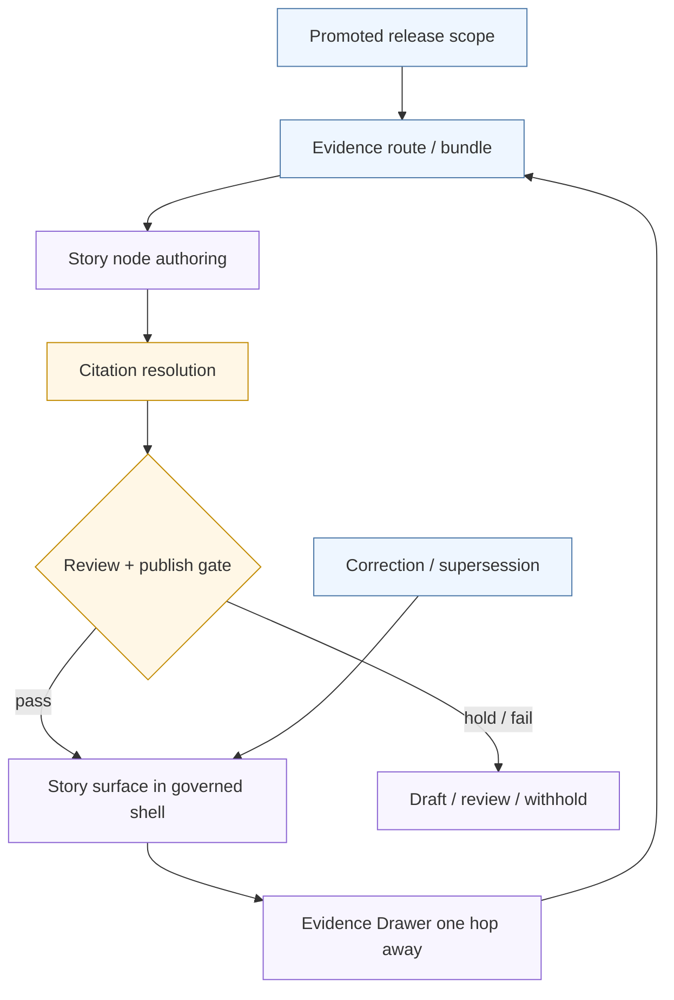

<!-- [KFM_META_BLOCK_V2]
doc_id: kfm://doc/UUID-NEEDS-VERIFICATION
title: Story Nodes
type: standard
version: v1
status: review
owners: @bartytime4life
created: YYYY-MM-DD
updated: YYYY-MM-DD
policy_label: public
related: [../../../README.md, ../../README.md, ../README.md, ../readme-structure-reconciliation.md, ../../standards/README.md, ../../governance/README.md, ../../../.github/CODEOWNERS]
tags: [kfm, docs, reports, story-nodes, narrative]
notes: [Public main confirms docs/reports/story_nodes/ as a README-only story directory and confirms /docs/ ownership in CODEOWNERS; doc_id and git-derived file dates still need verification before merge.]
[/KFM_META_BLOCK_V2] -->

# Story Nodes

Governed report-surface home for human-authored narrative units that stay downstream of evidence, policy, review, and correction.

> **Status:** experimental  
> **Owners:** @bartytime4life (`/.github/CODEOWNERS` currently assigns `/docs/` to this owner on public `main`; no narrower `/docs/reports/story_nodes/` rule is visible)  
>       
> **Quick jumps:** [Scope](#scope) · [Repo fit](#repo-fit) · [Accepted inputs](#accepted-inputs) · [Exclusions](#exclusions) · [Current verified snapshot](#current-verified-snapshot) · [Directory tree](#directory-tree) · [Quickstart](#quickstart) · [Usage](#usage) · [Diagram](#diagram) · [Reference tables](#reference-tables) · [Task list](#task-list) · [FAQ](#faq) · [Appendix](#appendix)

> [!IMPORTANT]
> `docs/reports/story_nodes/` is a governed documentation surface, not the canonical home of story truth, not the runtime story API, and not a shortcut around publish gates. In KFM, story-shaped materials remain downstream of promoted release scope, evidence resolution, policy review, and correction visibility.

> [!NOTE]
> Public `main` confirms this directory exists and currently contains `README.md` only. Mounted-checkout parity, git-derived file dates, and any runtime Story Node implementation still need verification.

> [!NOTE]
> Status markers used here: **CONFIRMED**, **INFERRED**, **PROPOSED**, **UNKNOWN**, **NEEDS VERIFICATION**.

## Scope

`docs/reports/story_nodes/` is the report-facing lane for story-shaped documentation artifacts in KFM.

Its job is to keep narrative material legible and reviewable **without** letting narrative prose turn into a second truth path. In broader KFM doctrine, the **story surface** is human-authored narrative publication in the same governed shell, and it is expected to keep evidence-linked excerpts, dates, perspective labels, and review or correction state visible. Broader KFM planning material also treats **Story Nodes** as narrative markdown bundled with map-state and citation context, with publication gated on review state and resolvable citations. Exact repo-local file conventions for that packet remain **NEEDS VERIFICATION**.

### Working terms

| Term | Status | Meaning here |
|---|---|---|
| Story surface | CONFIRMED | Human-authored narrative publication inside the governed shell. |
| Story Node | CONFIRMED doctrine / NEEDS VERIFICATION repo shape | A story-shaped unit that couples narrative with evidence and map/context state. |
| `docs/reports/story_nodes/` | CONFIRMED on public `main` | README-only story directory beneath `docs/reports/`; any runtime or schema depth remains separate and unverified. |

[Back to top](#story-nodes)

## Repo fit

| Item | Value |
|---|---|
| Path | `docs/reports/story_nodes/README.md` |
| Path status | **CONFIRMED on public `main`**; mounted-checkout parity still **NEEDS VERIFICATION** |
| Local role | Directory contract for story-shaped report artifacts under `docs/reports/` |
| Parent reports surface | [`../README.md`](../README.md) |
| Docs hub / root | [`../../README.md`](../../README.md) · [`../../../README.md`](../../../README.md) |
| Cross-cutting doctrine | [`../../standards/README.md`](../../standards/README.md) · [`../../governance/README.md`](../../governance/README.md) |
| Adjacent governed boundaries | [`../../../contracts/README.md`](../../../contracts/README.md) · [`../../../schemas/README.md`](../../../schemas/README.md) · [`../../../policy/README.md`](../../../policy/README.md) · [`../../../tests/README.md`](../../../tests/README.md) · [`../../../data/`](../../../data/) |
| Neighboring report families on public `main` | [`../audits/`](../audits/) · [`../releases/`](../releases/) · [`../self-validation/`](../self-validation/) · [`../telemetry/`](../telemetry/) · [`../validation/`](../validation/) |
| Structural caution | [`../readme-structure-reconciliation.md`](../readme-structure-reconciliation.md) is useful as a scaffold snapshot, not proof of implementation completeness |
| Current owner signal | [`../../../.github/CODEOWNERS`](../../../.github/CODEOWNERS) routes `/docs/` to `@bartytime4life`; no narrower `/docs/reports/story_nodes/` rule is visible on public `main` |

## Accepted inputs

What belongs here:

| Input class | Belongs here? | Minimum expectation |
|---|---|---|
| Human-authored story markdown | Yes | Time-explicit, evidence-linked, release-scoped, and correction-aware |
| Story landing pages or node indexes | Yes | Human-readable navigation only; no hidden runtime logic |
| Review-facing publish or correction summaries for a story | Yes | Must point back to release scope, evidence route, and decision context |
| Small public-safe figures, tables, and screenshots used inside a story | Yes | Must remain traceable to released scope or a clearly marked derivative |
| Documentation-facing companion context files | Yes, cautiously | Only when public-safe, clearly derivative, and subordinate to the owning contract/runtime surfaces |

### Minimum story-node burden

A story-node artifact should make the following easy to inspect:

- the story’s **time basis**
- the **release scope** or dataset-version basis
- the **evidence route** or citation path
- the current **surface state** (`Draft`, `Review`, `Published`, `Superseded`, `Withdrawn`, or `Correction-pending`)
- any **generalization, uncertainty, or modeled-status caveat**

## Exclusions

What does **not** belong here:

| Does not belong here | Put it here instead | Why |
|---|---|---|
| Canonical source data, receipts, manifests, catalog closure, EvidenceBundles | `../../../data/` and the governing artifact homes | Story reports are downstream surfaces, not authoritative stores |
| Story schemas, OpenAPI surfaces, runtime envelopes, DTOs | `../../../contracts/` and `../../../schemas/` | Machine-checked interfaces must stay machine-checkable |
| Policy bundles, reason codes, obligation vocabularies, publish rules | `../../../policy/` | Story prose must not replace enforcement |
| Runtime story routes, renderers, workers, or API code | Owning app/package surfaces | This README is not the implementation boundary |
| Secrets, signed URLs, internal endpoints, privileged reviewer data | Never in docs | These are not valid report payloads |
| Precise restricted locations or unresolved sensitive material | Governed redaction/generalization lane | Story readability must not bypass public-safety rules |
| Free-form AI narrative without resolvable citations | Not here | KFM story surfaces remain evidence-bounded |

> [!CAUTION]
> If a file here cannot point back to admissible evidence, promoted scope, and visible state, it does not belong in this directory yet.

[Back to top](#story-nodes)

## Current verified snapshot

| Surface / signal | Status | Notes |
|---|---|---|
| `docs/reports/story_nodes/` | CONFIRMED on public `main` | The directory is present under `docs/reports/`. |
| `docs/reports/story_nodes/README.md` | CONFIRMED on public `main` | This README is the current directory contract and the only file visible in this directory. |
| Neighboring report families | CONFIRMED on public `main` | `audits/`, `releases/`, `self-validation/`, `telemetry/`, and `validation/` are present beside `story_nodes/`. |
| `docs/reports/readme-structure-reconciliation.md` | CONFIRMED on public `main` | Useful as structural context only; it explicitly warns that scaffolded paths are not proof of implementation, wiring, or merge enforcement. |
| `.github/CODEOWNERS` | CONFIRMED on public `main` | Routes `/docs/` to `@bartytime4life`; no narrower story-node rule is visible in the public file. |
| Story Node publish workflow / story API / story schema | INFERRED doctrine, repo implementation UNKNOWN | Broader KFM materials describe Story Nodes and story routes, but current public repo evidence did not confirm live implementation at matching repo paths. |
| Mounted local checkout parity | NEEDS VERIFICATION | This revision used public GitHub plus the attached corpus, not a mounted local checkout. |

## Directory tree

### Current public `main` view

```text
docs/reports/story_nodes/
└── README.md
```

### Growth rule

Add child artifacts here only when they are genuinely **story-facing** and **human-readable**. If a new file is mostly contract, mostly policy, mostly runtime, or mostly canonical data, it belongs elsewhere.

### Illustrative future footprint (PROPOSED, not current repo fact)

```text
docs/reports/story_nodes/
├── README.md
├── <story-slug>.md
└── <story-slug>.attachments/
    ├── preview.png
    └── notes.md
```

Use the smallest possible footprint first. KFM should bias toward a small, legible directory rather than a sprawling narrative dump.

## Quickstart

### Add the first substantive story node safely

1. Confirm the subject is actually allowed on a public or public-safe docs surface.
2. Create a human-readable markdown file for the story unit.
3. Make the time basis explicit near the top.
4. Link the story to promoted release scope or other admissible evidence.
5. Keep perspective labels and caveats visible.
6. Do not merge story prose that cannot resolve its citations or that hides correction state.

### Illustrative starter template (PROPOSED)

```md
# <Story title>

- Story state: Draft
- Release scope: <release-id or published scope>
- Time basis: <year / range / as-of>
- Perspective: <editorial / documentary / analytic>
- Evidence route: <bundle ref / dossier ref / release ref>
- Correction state: none

## Narrative
<Keep consequential claims short, dated, and traceable.>

## Evidence
- <citation or evidence route>
- <citation or evidence route>

## Caveats
<Generalized / modeled / partial / stale-visible, if relevant>
```

### Companion files

If a story needs companion files, keep them **public-safe** and **obviously derivative**. Exact sidecar naming conventions remain **NEEDS VERIFICATION** in the live repo.

[Back to top](#story-nodes)

## Usage

### How this directory should be used

| Artifact class | Primary use | Minimum linkage | Must not do |
|---|---|---|---|
| Story node markdown | Human-readable narrative unit | Time basis + release scope + evidence route + surface state | Pretend prose is authoritative without evidence |
| Story index / landing page | Navigation across story nodes | Links to node files and any correction/supersession state | Become a hidden CMS or runtime route registry |
| Publish / review summary | Human-readable stewardship context | Decision, review, or release linkage | Replace the authoritative review record |
| Correction notice for a story | Reader-facing lineage and repair context | Affected story + replacement / supersession linkage | Hide that a story changed meaning |

### Story Nodes are not the same as Focus Mode or dossier

| Surface | Primary job | What must stay visible |
|---|---|---|
| Story surface / Story Node | Human-authored narrative publication | Evidence-linked excerpts, dates, perspective labels, review/correction state |
| Dossier | Durable place- or feature-centered object | Identity, dependencies, service or hazard context, evidence links |
| Focus Mode | Governed Q&A and bounded synthesis | Scoped retrieval, citation verification, audit linkage, answer/abstain/deny/error outcome |

### Story-state vocabulary

| State | Reader-facing meaning | Typical consequence |
|---|---|---|
| Draft | Not yet publication-stable | Keep review needs explicit |
| Review | Under active stewardship or quality check | Link to validator, reviewer, or decision context |
| Published | Intended for normal downstream consumption | Preserve release basis and correction path |
| Superseded | Newer authoritative scope exists | Point to replacement |
| Withdrawn | No longer safe or valid for use | Keep reason visible |
| Correction-pending | Known issue exists but repair is not complete | Avoid false finality |

## Diagram


```mermaid
flowchart TD
    A[Promoted release scope] --> B[Evidence route / bundle]
    B --> C[Story node authoring]
    C --> D[Citation resolution]
    D --> E{Review + publish gate}
    E -->|pass| F[Story surface in governed shell]
    E -->|hold / fail| G[Draft / review / withhold]
    F --> H[Evidence Drawer one hop away]
    H --> B
    I[Correction / supersession] --> F

    classDef source fill:#eef6ff,stroke:#4c78a8,stroke-width:1px;
    classDef story fill:#f8f5ff,stroke:#8a63d2,stroke-width:1px;
    classDef gate fill:#fff7e6,stroke:#c28a00,stroke-width:1px;
    class A,B,I source;
    class C,F,H,G story;
    class D,E gate;
```

## Reference tables

### Story-node readiness at a glance

| Question | Good answer |
|---|---|
| Can a reviewer tell what release or evidence basis this story depends on? | Yes |
| Are dates, perspective, and caveats visible near the top? | Yes |
| Can a reader drill from story prose to evidence without leaving the governed context? | Yes |
| Is correction or supersession visible if meaning changed? | Yes |
| Would removing the story leave canonical truth intact? | Yes — because the story is downstream, not sovereign |

### Boundary checks

| Check | Expected result |
|---|---|
| No uncited consequential claims | Required |
| No secrets / signed URLs / privileged endpoints | Required |
| No policy bundle or schema logic committed as story prose | Required |
| No unresolved sensitive coordinates | Required |
| No overclaiming of live runtime behavior | Required |

## Task list

- [ ] The directory contract says what belongs here and what does not.
- [ ] Story nodes remain downstream of evidence, policy, review, and release scope.
- [ ] Every substantive story file makes time basis, release scope, and evidence route visible.
- [ ] Review, correction, supersession, or withdrawal state is visible when relevant.
- [ ] Machine-readable contracts, policies, and tests stay in their owning directories.
- [ ] AI-assisted prose, if any, remains citation-resolvable and reviewable.
- [ ] Sensitive locations, secrets, and privileged endpoints are excluded.
- [ ] Current public-main facts and mounted-checkout unknowns stay visibly separated.
- [ ] Mermaid, links, tables, and code fences render cleanly in GitHub.
- [ ] Placeholder values in the KFM meta block are resolved before merge.

## FAQ

### Are Story Nodes authoritative in KFM?

No. Story nodes are governed report surfaces. Authoritative truth still lives in the governed evidence path, contract layer, policy layer, release layer, and evidence-resolution path.

### Do Story Nodes replace Focus Mode or dossier pages?

No. Story nodes are human-authored narrative units. Dossiers remain durable place/feature objects, and Focus Mode remains governed Q&A.

### Can Story Nodes include AI-assisted writing?

Yes, but only when it remains downstream of admissible evidence, resolvable citations, review state, and policy-safe release scope. AI prose must not become a second truth path.

### Should machine-readable story schemas live here?

No. Keep schemas, route contracts, and runtime envelopes in their machine-readable homes. This directory may reference them, but should not replace them.

### Can this directory hold raw exports or large evidence dumps?

No. Large or canonical payloads belong in governed data locations. Story nodes may reference them, summarize them, or embed small public-safe derivatives.

[Back to top](#story-nodes)

## Appendix

<details>
<summary>Evidence posture and open verification items</summary>

### What is strong enough to treat as current

- The path `docs/reports/story_nodes/` exists on the public `main` branch.
- The directory currently contains `README.md` only.
- The parent `docs/reports/` surface currently includes `audits/`, `releases/`, `self-validation/`, `story_nodes/`, `telemetry/`, `validation/`, `README.md`, and `readme-structure-reconciliation.md`.
- `.github/CODEOWNERS` currently routes `/docs/` to `@bartytime4life`; no narrower rule for `story_nodes/` is visible on public `main`.
- Broader KFM doctrine clearly distinguishes story surfaces from dossiers and Focus Mode.
- Broader KFM doctrine ties story surfaces to evidence-linked excerpts, dates, perspective labels, and correction state.
- `docs/reports/readme-structure-reconciliation.md` is useful as structural context but explicitly warns that scaffolded paths are not proof of implementation, wiring, or merge enforcement.

### What still needs verification before merge

- Final `doc_id` value in the KFM meta block
- Original `created` / `updated` dates for this file
- Whether the repo wants a narrower `story_nodes/` owner than the current `/docs/` fallback
- Exact story-sidecar filenames or companion-packet conventions
- Any live runtime route, schema, or publish workflow already implemented for Story Nodes
- Whether sibling report-family READMEs should cross-link back to this directory in the same PR
- Whether the parent `docs/reports/README.md` should be updated in the same change stream to reflect the now-visible public `main` directory layout

</details>

<details>
<summary>Illustrative companion packet (PROPOSED only)</summary>

The broader KFM planning corpus describes Story Nodes as narrative markdown plus map-state and citation context. If this repo later chooses to keep a public-safe companion packet beside story markdown, a minimal **illustrative** shape could look like this:

```jsonc
{
  "story_slug": "<story-slug>",
  "story_state": "Draft",
  "time_basis": "<year-or-range>",
  "release_scope": "<release-id>",
  "evidence_refs": ["<ref-1>", "<ref-2>"],
  "map_context": {
    "view": "<named-view-or-bookmark>",
    "timeline": "<as-of or range>",
    "layers": ["<layer-id>"]
  }
}
```

This example is intentionally **not** a confirmed schema. If a real machine-readable story packet becomes part of KFM, its authoritative definition should live in `contracts/` or `schemas/`, not in this README.

</details>
