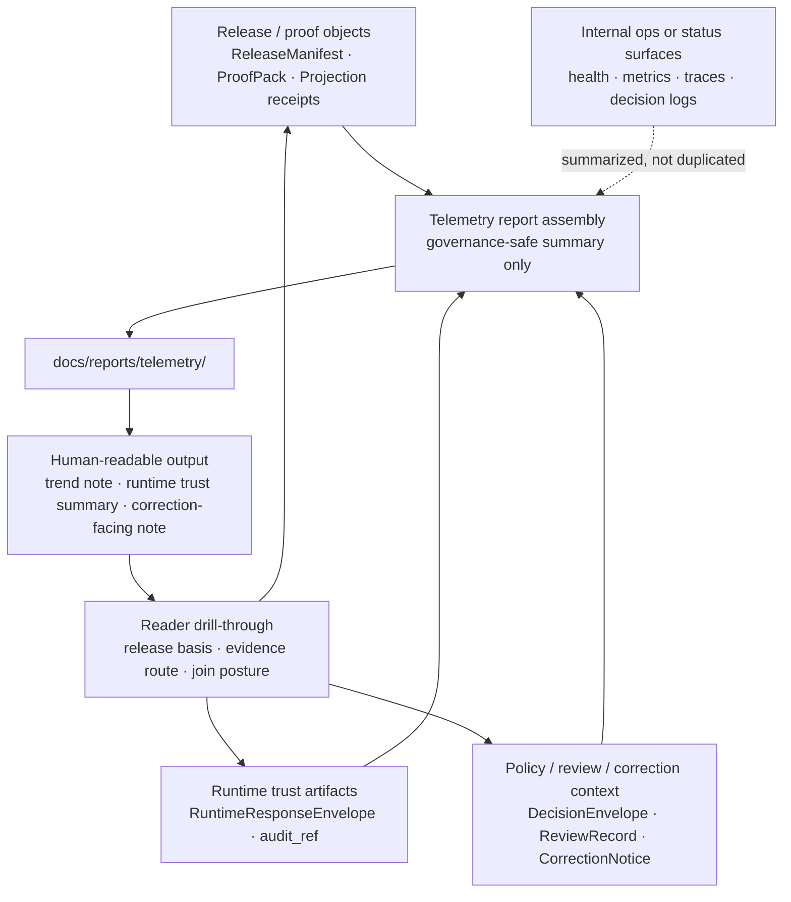

<!-- [KFM_META_BLOCK_V2]
doc_id: kfm://doc/<NEEDS_VERIFICATION__uuid>
title: telemetry
type: standard
version: v1
status: draft
owners: @bartytime4life
created: NEEDS_VERIFICATION__YYYY-MM-DD
updated: NEEDS_VERIFICATION__YYYY-MM-DD
policy_label: NEEDS_VERIFICATION__public_or_restricted
related: [../README.md, ../../README.md, ../readme-structure-reconciliation.md, ../../../.github/workflows/README.md, ../../../contracts/README.md, ../../../schemas/README.md, ../../../policy/README.md, ../../../tests/README.md]
tags: [kfm, telemetry, reports, observability]
notes: [Public main confirms docs/reports/telemetry/ as a README-only directory; doc_id, created, updated, and policy_label remain unresolved on direct public evidence and should be verified before merge.]
[/KFM_META_BLOCK_V2] -->

# telemetry

Governed index for report-facing telemetry rollups, trend summaries, and audit-linked observability notes in Kansas Frontier Matrix.

> **Status:** experimental  
> **Doc status:** draft  
> **Owners:** `@bartytime4life`  
>      
> **Quick jumps:** [Scope](#scope) · [Repo fit](#repo-fit) · [Current verified snapshot](#current-verified-snapshot) · [Directory tree](#directory-tree) · [Quickstart](#quickstart) · [Usage](#usage) · [Diagram](#diagram) · [Reference tables](#reference-tables) · [Task list](#task-list--definition-of-done) · [FAQ](#faq) · [Appendix](#appendix)  
> **Repo fit:** `docs/reports/telemetry/README.md` → upstream: [`../README.md`](../README.md) · [`../../README.md`](../../README.md) · [`../../../.github/workflows/README.md`](../../../.github/workflows/README.md) · downstream: telemetry rollups, trust summaries, and release-linked trend notes that live under `docs/reports/telemetry/`  
> **Related:** [`../readme-structure-reconciliation.md`](../readme-structure-reconciliation.md) *(structural alignment snapshot only; not proof of implemented telemetry machinery)*  
>
> [!IMPORTANT]
> This directory is for governed, human-readable telemetry reporting. It is **not** the authoritative home for raw logs, traces, metrics, policy decision streams, machine-enforced contracts, or internal operational endpoints.

Status markers used in this README: **CONFIRMED** · **INFERRED** · **PROPOSED** · **UNKNOWN** · **NEEDS VERIFICATION**

## Scope

`docs/reports/telemetry/` is the report-facing home for telemetry-shaped documentation artifacts that are safe to read, easy to review, and still anchored to release scope, evidence route, policy state, and correction state.

In KFM terms, telemetry here is a **downstream explanatory surface**. It may summarize runtime trust behavior, freshness drift, correction activity, release-linked operational trends, or other governance-safe observability signals. It must **not** quietly become a second truth surface, a hidden operational console, or a substitute for proof-bearing release and runtime artifacts.

Use this directory when telemetry needs to be explained to humans in Git-tracked Markdown. Do not use it to stash raw event streams, secret-bearing diagnostics, or undocumented “temporary” observability dumps.

## Repo fit

| Item | Value |
|---|---|
| Path | `docs/reports/telemetry/README.md` |
| Local role | Directory contract for telemetry-shaped report surfaces |
| Upstream docs | [`../README.md`](../README.md), [`../../README.md`](../../README.md), [`../../../.github/workflows/README.md`](../../../.github/workflows/README.md) |
| Related reconciliation artifact | [`../readme-structure-reconciliation.md`](../readme-structure-reconciliation.md) *(structural alignment only; do not treat scaffolded paths as implemented behavior)* |
| Adjacent governed boundaries | [`../../../contracts/README.md`](../../../contracts/README.md), [`../../../schemas/README.md`](../../../schemas/README.md), [`../../../policy/README.md`](../../../policy/README.md), [`../../../tests/README.md`](../../../tests/README.md) |
| Current public sibling report families | `audits/`, `releases/`, `self-validation/`, `story_nodes/`, `telemetry/`, `validation/` |
| Primary readers | Maintainers, release reviewers, stewardship readers, and operators who need docs-facing summaries rather than raw telemetry streams |
| Core operating rule | Telemetry in this directory stays **derived**, **release-aware**, **drill-through friendly**, and **safe to expose in documentation** |

## Accepted inputs

Accepted inputs are intentionally narrow.

| Belongs here | Why it belongs here | Must make explicit |
|---|---|---|
| Human-readable telemetry landing pages and family indexes | Helps readers find the right summary surface quickly | Scope, audience, and report class |
| Governance-safe trend summaries | Lets maintainers see drift, freshness, or quality movement over time without exposing raw operational data | Time basis, release basis, and derived status |
| Release-linked telemetry notes | Keeps rollout or publication behavior explainable in repo-native form | Release linkage, correction linkage, and evidence route |
| Docs-facing runtime trust summaries | Explains answer / abstain / deny / error patterns, stale-visible behavior, or surface-state shifts | Join posture, policy posture, and negative-state handling |
| Compact charts, tables, or screenshots that support a Markdown report | Breaks up dense text and improves reviewability | What the graphic summarizes and what it omits |
| Small companion artifacts that are clearly non-authoritative | Useful when a report needs lightweight machine-readable support | Derived marker, schema/home reference, and owning report |

## Exclusions

| Does **not** belong here | Put it here instead | Why |
|---|---|---|
| Raw logs, spans, traces, metrics dumps, or stream captures | Owning runtime / ops / observability surface | This directory is a report surface, not a raw signal store |
| Policy bundles, reason registries, or executable authorization logic | [`../../../policy/README.md`](../../../policy/README.md) | Telemetry reports may summarize policy outcomes, but they do not define policy |
| Source-of-truth schemas, runtime envelopes, or API payload definitions | [`../../../contracts/README.md`](../../../contracts/README.md) and [`../../../schemas/README.md`](../../../schemas/README.md) | Reports consume those contracts; they do not replace them |
| Fixtures, harnesses, workflow logic, or automated checks | [`../../../tests/README.md`](../../../tests/README.md) and [`../../../.github/workflows/README.md`](../../../.github/workflows/README.md) | Test and CI surfaces need their own review path |
| Canonical release manifests, proof packs, or correction notices | Their owning governed artifact home | Reports may link to them, summarize them, or explain them, but should not become the canonical copy |
| Secrets, tokens, private endpoints, hostnames, or internal-only debugging data | Never commit them to docs | Documentation is the wrong disclosure surface |
| Free-form AI summaries with no evidence route | Nowhere in KFM docs without evidence linkage | Fluency is not enough |

## Current verified snapshot

| Path or signal | Status | Notes |
|---|---|---|
| `docs/reports/telemetry/README.md` | **CONFIRMED** | Public `main` inspection showed the directory with `README.md` only |
| `../README.md` | **CONFIRMED** | Parent reports README exists and keeps telemetry positioned as one report family inside a broader reports surface |
| `../readme-structure-reconciliation.md` | **CONFIRMED** | Related structure report exists, but it explicitly treats scaffolded paths as **not** equivalent to implemented behavior or current parity |
| Current public sibling report families | **CONFIRMED** | Public `docs/reports/` currently includes `audits/`, `releases/`, `self-validation/`, `story_nodes/`, `telemetry/`, and `validation/` |
| Additional child files under `docs/reports/telemetry/` | **UNKNOWN** | No extra mounted child inventory was verified here beyond `README.md` |
| Report-specific workflow automation | **UNKNOWN** | Public `.github/workflows/` inspection showed `README.md` only |
| Authoritative telemetry schema home | **NEEDS VERIFICATION** | Public `schemas/` now exposes multiple subtrees, but this revision still does not prove a telemetry-specific schema home or mounted telemetry schema files |
| Executable telemetry policy/runtime bundle inventory | **NEEDS VERIFICATION** | Public `policy/` now exposes bundle-, fixture-, runtime-, and test-shaped subtrees, but this revision does not prove telemetry-specific policy/runtime assets or runnable enforcement for this directory |

> [!WARNING]
> The current public `main` inspection that grounded this revision showed `docs/reports/telemetry/` as a README-only directory. This file therefore defines the directory contract without claiming that a live telemetry pipeline, mounted child inventory, or release automation already exists.

> [!NOTE]
> [`../readme-structure-reconciliation.md`](../readme-structure-reconciliation.md) is useful for structural orientation, but it explicitly warns that scaffolded paths are **not** proof of implementation, wiring, merge enforcement, or live parity. Treat direct tree inspection as the stronger signal.

## Directory tree

Current repo-grounded view:

```text
docs/reports/telemetry/
└── README.md  # current directory contract on public main at review time
```

No additional child paths are asserted here as current repo fact.

## Quickstart

Read the local contract first, then step outward to the parent reports surface, the related reconciliation report, the workflow boundary, and adjacent contract/policy/test surfaces.

```bash
# from repo root

sed -n '1,260p' docs/reports/telemetry/README.md
sed -n '1,260p' docs/reports/README.md
sed -n '1,260p' docs/reports/readme-structure-reconciliation.md
sed -n '1,260p' docs/README.md

find docs/reports/telemetry -maxdepth 3 -type f | sort
find docs/reports -maxdepth 2 -type d | sort

sed -n '1,220p' .github/workflows/README.md
sed -n '1,220p' contracts/README.md
sed -n '1,220p' schemas/README.md
sed -n '1,220p' policy/README.md
sed -n '1,220p' tests/README.md
```

For a wider inventory sweep:

```bash
# narrow search to report-facing trust and telemetry vocabulary
rg -n "telemetry|audit_ref|EvidenceBundle|RuntimeResponseEnvelope|DecisionEnvelope|ReleaseManifest|CorrectionNotice|stale-visible|abstain|deny|error" \
  docs/reports docs contracts schemas policy tests .github
```

## Usage

### Add a telemetry report without creating a second truth surface

1. Start from a governed source.
   Examples include a released proof object, a runtime envelope sample, a correction event, a release-linked validation summary, or another already-governed artifact.

2. Make the report’s framing explicit.
   State what time window it covers, which release scope it reflects, what audience it serves, and whether it is public-safe, steward-only, or still awaiting review.

3. Summarize joins, not just symptoms.
   A useful telemetry report should explain how the reader can move from the Markdown surface back to the governing objects that support it.

4. Keep negative states visible.
   Do not collapse abstained, denied, stale-visible, partial, superseded, withdrawn, or errored conditions into a cheerful “green” summary.

5. Strip operational exposure.
   Remove secrets, host details, token-bearing examples, raw traces, and any data that would turn a human-readable summary into an internal console dump.

6. Update this README when a new recurring report class becomes stable.
   If the directory grows beyond a one-off document, the directory contract should grow with it.

### Recommended minimum trust block inside any consequential telemetry report

Use a compact block like this near the top of the report body:

> **Scope:** what the report covers and what it intentionally omits  
> **Time basis:** observation window, build window, or report-as-of date  
> **Release basis:** release ID, proof object, or promoted scope reference  
> **Evidence route:** which governed artifacts the report summarizes  
> **Join posture:** `audit_ref`, request ID, release ID, or another documented reconstruction path  
> **Sensitivity posture:** public-safe, generalized, steward-only, or review-pending  
> **Derived status:** derived explanatory report, not source-of-truth telemetry  
> **Correction path:** how the reader should interpret supersession, withdrawal, or replacement

### Practical writing rules

- Prefer **few, meaningful numbers** over dense metric walls.
- Prefer **trend explanation** over raw event chronology.
- Prefer **release-aware freshness language** over vague “current” wording.
- Prefer **named trust states** over euphemisms.
- Prefer **links to owning contracts and tests** over duplicated technical prose.

## Diagram



## Reference tables

### Telemetry report classes at a glance

| Report class | Status | Primary use | Minimum linkage | Must **not** do |
|---|---|---|---|---|
| Runtime trust summary | **PROPOSED** | Explain reader-visible answer / abstain / deny / error behavior, stale-visible outcomes, or trust-state shifts | Runtime basis, release basis, join posture, policy posture | Replace canonical runtime payloads |
| Release observability summary | **PROPOSED** | Explain rollout, release, proof, or rebuild behavior in docs-facing form | Release reference, proof object or build receipt, time basis | Claim release success without proof linkage |
| Drift / freshness note | **PROPOSED** | Summarize freshness, lag, stale visibility, or rebuild timing | Freshness basis, stale policy, release linkage | Become an alerting backend or raw incident stream |
| Correction / incident note | **PROPOSED** | Explain a post-release issue in a lineage-preserving way | Correction path, affected release, replacement or withdrawal reference | Hide supersession or erase historical context |
| Docs-facing trend note | **PROPOSED** | Provide maintainers with compact, readable trend snapshots | Time basis, evidence route, derived marker | Smuggle raw operational telemetry into docs |

### Minimum trust cues for consequential telemetry reports

| Cue | Why it matters |
|---|---|
| Time basis | Telemetry without an explicit time window invites false “current” claims |
| Release basis | KFM surfaces are release-aware, not merely query-aware |
| Evidence route | Readers need to know what governed artifacts the report summarizes |
| Join posture | Reconstruction should be possible from documented keys such as `audit_ref` or release ID |
| Sensitivity posture | Telemetry can expose more than intended if visibility rules are implicit |
| Derived marker | Reports here are explanatory derivatives, not sovereign truth |
| Correction path | Telemetry summaries must remain lineage-preserving under change |

### Conservative growth rule

| Add a recurring child report class only when… | Why |
|---|---|
| The reader need is stable and repeatable | Prevents clutter and directory sprawl |
| The report class has a clear trust contract | Keeps the folder from drifting into generic observability prose |
| It does not duplicate `contracts/`, `schemas/`, `policy/`, `tests/`, or workflow surfaces | Preserves repo boundary discipline |
| The file class can state its time basis, release basis, and evidence route | Maintains KFM explainability |
| Negative states remain visible | Avoids telemetry optimism theater |

## Task list / definition of done

- [ ] Title, purpose line, top impact block, owners, badges, and quick jumps all render cleanly
- [ ] This README states what belongs here and what does not
- [ ] The current README-only public-tree posture stays explicit unless reverified
- [ ] No workflow automation is claimed without direct verification
- [ ] No telemetry report in this folder is allowed to masquerade as a source-of-truth store
- [ ] Consequential telemetry reports include time basis, release basis, evidence route, join posture, sensitivity posture, and correction path
- [ ] Raw logs, traces, metrics dumps, secrets, and private endpoints stay out of `docs/reports/telemetry/`
- [ ] New stable child file classes trigger an update to this directory README
- [ ] Mermaid, tables, and code fences remain valid in GitHub rendering
- [ ] `doc_id`, `created`, `updated`, and `policy_label` placeholders are resolved before publication if maintainers can verify them

## FAQ

### Is a telemetry report in this directory authoritative?

No. It is downstream, explanatory, and derived. The governing artifacts remain the owning contracts, release/proof objects, runtime envelopes, policy decisions, and correction records.

### Can raw traces, spans, or metric dumps live here?

No. Summaries may live here. Raw operational telemetry should remain in the owning runtime or ops surface.

### What should every consequential telemetry report show?

At minimum: time basis, release basis, evidence route, join posture, sensitivity posture, derived marker, and correction path.

### Does the current public repository prove telemetry automation already exists?

No. This revision was grounded against a public `main` inspection that showed `.github/workflows/` as `README.md` only and `docs/reports/telemetry/` as README-only at review time.

### Can AI-assisted prose appear in telemetry reports?

Only as a downstream aid. It must remain bounded by evidence route, release scope, policy posture, and correction visibility.

## Appendix

<details>
<summary>Illustrative filename patterns and design notes (PROPOSED, not asserted repo fact)</summary>

These patterns are examples only. They are here to make naming discussion easier during review. They are **not** current mounted path claims.

### Illustrative filename patterns

- `release-<release-id>.md`
- `runtime-<surface-class>-<yyyy-mm-dd>.md`
- `freshness-<lane>-<yyyy-mm-dd>.md`
- `correction-<yyyy-mm-dd>.md`
- `quality-trends-<yyyy-qn>.md`

### Design notes

- Keep this directory small until a stable telemetry report family actually exists.
- Prefer one well-linked report over five shallow fragments.
- If a report needs its own fixtures, schemas, or automated checks, link outward to the owning surface instead of rebuilding that machinery here.
- When in doubt, document the **join path** first and the pretty chart second.

### Reader checklist for new telemetry docs

Before merging a new telemetry report, ask:

1. Does the report say what it summarizes?
2. Can a reviewer reconstruct it from release- and audit-linked artifacts?
3. Does it preserve negative states?
4. Does it avoid raw operational exposure?
5. Does it belong in `docs/reports/telemetry/`, or is it really a contract, policy, test, or ops artifact?

</details>

[Back to top](#telemetry)
