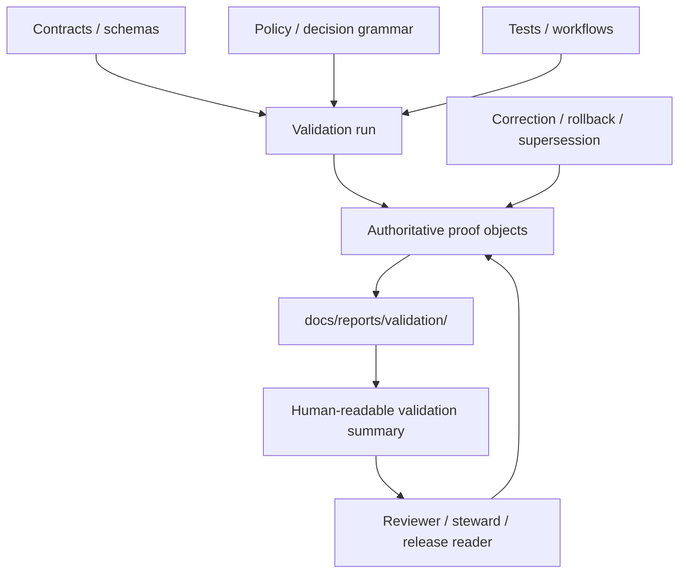

<!-- [KFM_META_BLOCK_V2]
doc_id: kfm://doc/<uuid>
title: validation
type: standard
version: v1
status: draft
owners: @bartytime4life
created: YYYY-MM-DD
updated: YYYY-MM-DD
policy_label: public
related: [../README.md, ../../README.md, ../readme-structure-reconciliation.md, ../../../tests/README.md, ../../../contracts/README.md, ../../../policy/README.md, ../../../schemas/README.md, ../../../.github/workflows/README.md, ../../../.github/CODEOWNERS]
tags: [kfm, reports, validation]
notes: [doc_id and dates need assignment from live git history before merge]
[/KFM_META_BLOCK_V2] -->

# validation

Governed landing page for human-readable validation summaries, evidence-linked check results, and review-facing validation report surfaces in Kansas Frontier Matrix (KFM).

> Status: `experimental`  
> Owners: `@bartytime4life` via [`../../../.github/CODEOWNERS`](../../../.github/CODEOWNERS)  
> Path: `docs/reports/validation/README.md`  
> Repo fit: validation-report lane inside [`../`](../); downstream of governed proof objects, tests, policy, and release/correction evidence  
>       
> Quick jumps: [Scope](#scope) · [Repo fit](#repo-fit) · [Accepted inputs](#accepted-inputs) · [Exclusions](#exclusions) · [Current verified snapshot](#current-verified-snapshot) · [Directory tree](#directory-tree) · [Quickstart](#quickstart) · [Usage](#usage) · [Diagram](#diagram) · [Reference tables](#reference-tables) · [Task list](#task-list) · [FAQ](#faq) · [Appendix](#appendix)

> [!IMPORTANT]
> `docs/reports/validation/` is a governed documentation surface. It may summarize what was checked, what failed, what was denied, and what changed, but it does **not** replace authoritative proof objects such as `ValidationReport`, `IngestReceipt`, `DatasetVersion`, `CatalogClosure`, `ReleaseManifest`, `ReleaseProofPack`, `EvidenceBundle`, `RuntimeResponseEnvelope`, or `CorrectionNotice`.

> [!WARNING]
> Current public `main` inspection shows this directory containing `README.md` only. Do not write as if lane-specific validation reports, merge-blocking workflow YAML, mounted policy bundles, or a populated schema registry already exist unless the active branch proves them directly.

> [!NOTE]
> Current public `main` also shows `docs/reports/` containing sibling families `audits/`, `releases/`, `self-validation/`, `story_nodes/`, `telemetry/`, and `validation/`. Use those lane boundaries instead of routing every review-facing artifact into one generic reports bucket.

Status markers used in this README: **CONFIRMED** · **INFERRED** · **PROPOSED** · **UNKNOWN** · **NEEDS VERIFICATION**

---

## Scope

`docs/reports/validation/` is where validation becomes legible to humans without pretending that prose is the same thing as proof.

This lane is for documentation-facing validation material such as:

- landing pages and indexes for validation report families
- docs-safe summaries of source-admission, canonical, catalog/review, delivery, runtime, release, rollback, or correction checks
- reviewer-facing tables, figures, and small visuals derived from authoritative proof objects
- public-safe summaries of what passed, failed, was denied, stayed inconclusive, or needs correction
- recurring domain validation digests when there is a real reader need
- navigation surfaces that help a reviewer drill through to the owning proof-bearing object

This lane is **not** a second truth path, a raw artifact store, a fixture bucket, a workflow surface, or a quiet substitute for contracts, policy, tests, or release evidence.

### Evidence labels used here

| Label | Meaning in this README |
|---|---|
| `CONFIRMED` | Directly visible in current public repo surfaces or repeatedly established in controlling KFM doctrine |
| `INFERRED` | Strongly implied by adjacent repo surfaces or repeated doctrine, but not proven by a mounted checkout |
| `PROPOSED` | A repo-native organization or authoring pattern recommended here, not yet asserted as current implementation reality |
| `UNKNOWN` | Not supported strongly enough to state as current repo or runtime fact |
| `NEEDS VERIFICATION` | A detail that should be checked on the active branch before merge |

## Repo fit

| Field | Value |
|---|---|
| Path | `docs/reports/validation/README.md` |
| Local role | Directory contract and landing page for human-readable validation summaries |
| Upstream links | [`../README.md`](../README.md) · [`../../README.md`](../../README.md) · [`../readme-structure-reconciliation.md`](../readme-structure-reconciliation.md) |
| Sibling report families | [`../audits/`](../audits/) · [`../releases/`](../releases/) · [`../self-validation/`](../self-validation/) · [`../story_nodes/`](../story_nodes/) · [`../telemetry/`](../telemetry/) |
| Adjacent governed boundaries | [`../../../tests/README.md`](../../../tests/README.md) · [`../../../contracts/README.md`](../../../contracts/README.md) · [`../../../policy/README.md`](../../../policy/README.md) · [`../../../schemas/README.md`](../../../schemas/README.md) · [`../../../.github/workflows/README.md`](../../../.github/workflows/README.md) |
| Downstream readers | Reviewers, stewards, release reviewers, domain maintainers, and readers who need validation context without opening raw proof objects first |

KFM treats verification as cross-cutting, named proof objects as trust-bearing, and negative outcomes as first-class. This directory exists so those outcomes can be explained to humans without severing drill-through back to their authoritative basis.

## Accepted inputs

Content that belongs here includes:

- directory-level README files and family indexes
- human-readable summaries of validation runs that already have an authoritative machine-readable basis elsewhere
- public-safe pass/fail/inconclusive/denied/error digests for source admission, canonicalization, policy review, runtime trust, release readiness, or correction drills
- lightweight charts, tables, screenshots, or figures that help a reviewer understand validation state
- lane-specific validation digests when multiple files over time justify a stable family
- release-facing or correction-facing report text that remains explicitly downstream of evidence, policy, and review state

## Exclusions

| Does **not** belong here | Put it here instead | Why |
|---|---|---|
| Raw machine-readable validation artifacts, large JSON payloads, checksums, or run outputs | Canonical artifact home under `data/` or the owning execution surface | Reports may summarize proof, but they must not quietly become the proof |
| Contracts, schemas, DTO shapes, endpoint envelopes | [`../../../contracts/`](../../../contracts/) and/or [`../../../schemas/`](../../../schemas/) | Machine-checked interfaces belong in contract-bearing lanes |
| Policy bundles, reason/obligation registries, executable policy rules | [`../../../policy/`](../../../policy/) | Governance must stay reviewable and enforceable outside prose |
| Fixtures, test harnesses, validator code, reproducibility helpers | [`../../../tests/`](../../../tests/) · [`../../../tools/`](../../../tools/) · [`../../../scripts/`](../../../scripts/) | Validation execution is not authored here |
| Workflow YAML, GitHub Actions logic, release automation | [`../../../.github/workflows/`](../../../.github/workflows/) | Automation belongs in the gatehouse, not in report prose |
| Comparative doctrine/repo/implementation writeups | [`../self-validation/`](../self-validation/) | That lane is for self-inspection across evidence surfaces, not validation-run reporting |
| Cross-cutting audit narratives or control-review packages | [`../audits/`](../audits/) | Audit packages should stay distinguishable from run/report summaries |
| Release-centered proof or rollout narratives | [`../releases/`](../releases/) | Keep release storytelling and release validation adjacent, not collapsed into one lane |
| Secrets, tokens, signed URLs, internal-only endpoints | **Not in docs** | These are never acceptable report payloads |
| Precise restricted coordinates or other sensitive location detail | Governed redaction/generalization path | Validation summaries must preserve policy-safe visibility |
| Free-form AI narrative with no evidence route | **Not here** | Validation surfaces must stay bounded and drill-through capable |

## Current verified snapshot

| Path / signal | Status | Notes |
|---|---|---|
| `docs/reports/` child families | `CONFIRMED` | Public `main` shows `audits/`, `releases/`, `self-validation/`, `story_nodes/`, `telemetry/`, `validation/`, plus `README.md` and `readme-structure-reconciliation.md` |
| `docs/reports/validation/README.md` | `CONFIRMED` | Current directory contract; public `main` shows this file only |
| Additional child reports under `docs/reports/validation/` | `UNKNOWN / NEEDS VERIFICATION` | No additional files were visible in current public tree inspection |
| `tests/` families | `CONFIRMED` | Public tree shows `accessibility/`, `contracts/`, `e2e/`, `integration/`, `policy/`, `reproducibility/`, and `unit/` |
| `tests/e2e/` families | `CONFIRMED` | Public tree shows `correction/`, `release_assembly/`, and `runtime_proof/` |
| `.github/workflows/README.md` | `CONFIRMED` | Current public `main` describes `.github/workflows/` as `README.md` only |
| `contracts/README.md` | `CONFIRMED` | Contracts lane is publicly visible as a README-only surface on current `main` |
| `schemas/README.md` | `CONFIRMED` | Schemas lane is publicly visible as a README-only surface; schema-home authority remains unresolved relative to `contracts/` |
| `policy/README.md` | `CONFIRMED / NEEDS VERIFICATION` | Documentary policy surface is visible; mounted `.rego` bundles or policy tests are not confirmed by this inspection |
| `../../../.github/CODEOWNERS` | `CONFIRMED` | `/docs/` is currently owned by `@bartytime4life` |
| `../readme-structure-reconciliation.md` | `CONFIRMED` | Treat as scaffold/reconciliation history unless re-synchronized with the live tree |

[Back to top](#validation)

## Directory tree

### Current public-main view of `docs/reports/`

```text
docs/reports/
├── audits/
├── releases/
├── self-validation/
├── story_nodes/
├── telemetry/
├── validation/
├── README.md
└── readme-structure-reconciliation.md
```

### Current public-main view of this lane

```text
docs/reports/validation/
└── README.md  # current directory contract; no additional validation report files are visible on public main
```

### Conservative expansion footprint

Add the following only when the repo actually materializes the need.

```text
docs/reports/validation/
├── README.md
├── source-intake/   # PROPOSED / admissibility, fetch integrity, quarantine-routing summaries
├── canonical/       # PROPOSED / dataset-version, support/time, and deterministic-identity summaries
├── catalog-review/  # PROPOSED / catalog closure, rights/sensitivity, review, and release-readiness summaries
├── delivery/        # PROPOSED / export, tile, search, or projection freshness/release-linkage summaries
├── runtime/         # PROPOSED / evidence-resolution, citation-negative, and finite-outcome summaries
├── correction/      # PROPOSED / rollback, supersession, withdrawal, and visible-correction summaries
└── domains/         # PROPOSED / lane-specific digests such as hydrology-first validation
```

Guidance:

- Add a subfamily only when it will hold multiple files over time.
- Keep this lane human-readable and downstream of authoritative artifact homes.
- Avoid duplicating subsystem names when the clearer home is elsewhere.
- If older reconciliation prose and the live branch disagree, verified inventory wins.

## Quickstart

```bash
# inspect this directory contract
sed -n '1,320p' docs/reports/validation/README.md

# inspect the parent reports lane and adjacent report families
sed -n '1,260p' docs/reports/README.md
sed -n '1,260p' docs/reports/self-validation/README.md

# verify current tree shape locally
find docs/reports -maxdepth 2 -mindepth 1 | sort
find docs/reports/validation -maxdepth 3 -type f | sort

# inspect adjacent trust-bearing boundaries
sed -n '1,260p' tests/README.md
sed -n '1,220p' .github/workflows/README.md
sed -n '1,220p' contracts/README.md
sed -n '1,220p' policy/README.md
sed -n '1,220p' schemas/README.md

# search for validation-bearing proof objects and negative outcomes
rg -n "ValidationReport|IngestReceipt|DatasetVersion|CatalogClosure|ReleaseManifest|ReleaseProofPack|EvidenceBundle|RuntimeResponseEnvelope|CorrectionNotice|ABSTAIN|DENY|ERROR|stale-visible|withdrawn|superseded" \
  docs/reports tests contracts policy schemas .github
```

## Usage

### Add a human-readable validation summary without creating a second truth path

1. Start from an already governed basis: a source-admission check, validation run, release proof, runtime audit, correction event, or another inspectable proof object.
2. Make the report’s **validation basis**, **time basis**, and **release basis** explicit.
3. Point readers to the authoritative machine-readable object or execution surface.
4. Keep pass/fail/inconclusive/denied/error states visible instead of smoothing them into a single “healthy” badge.
5. Preserve sensitivity, generalization, withholding, stale-state, and correction-path cues where they matter.
6. Update this README if the change introduces a stable new validation family rather than a one-off file.

### Recommended minimum trust block inside any consequential validation report

> [!NOTE]
> **Minimum trust block**
> - **Validation basis:** source-intake / canonical / catalog-review / delivery / runtime / correction
> - **Time basis:** valid time / as-of time / publication time / correction time
> - **Release basis:** release ID, manifest, proof pack, or explicit review-only basis
> - **Authoritative artifacts:** `ValidationReport`, `IngestReceipt`, `DatasetVersion`, `CatalogClosure`, `ReleaseManifest`, `ReleaseProofPack`, `EvidenceBundle`, `RuntimeResponseEnvelope`, `CorrectionNotice`
> - **Outcome:** pass / fail / inconclusive / denied / error
> - **Sensitivity posture:** public-safe / generalized / restricted / withheld
> - **Correction path:** superseded-by / withdrawn / correction-pending / replacement report

### Illustrative skeleton for a report in this lane

```md
# <validation summary title>

> Validation basis: runtime
> Time basis: as-of 2026-03-30T00:00:00Z
> Release basis: <release id or review-only scope>
> Outcome: fail
> Authoritative artifacts: ValidationReport, RuntimeResponseEnvelope
> Correction path: correction-pending

## What was checked

State the governed check surface in plain language.

## Outcome

Keep failure, denial, abstention, inconclusive state, or correction status visible.

## Evidence route

Link the owning proof object, release object, or review surface.
```

### When to create a new subfamily

Create a new child family only when **all** of the following are true:

- the family will hold multiple files over time
- the reader need is stable, not one-off
- the content is clearly human-readable report material
- the authoritative object already lives elsewhere
- this README is updated in the same change

## Diagram



## Reference tables

### Validation classes at a glance

| Validation class | Primary use | Minimum linkage | Must not do |
|---|---|---|---|
| Source / intake summary | Explain admissibility, fetch integrity, quarantine routing, or ingest checks | `SourceDescriptor` + `IngestReceipt` + validation basis | Pretend admission succeeded without receipts or hide quarantine |
| Canonical / identity summary | Explain schema, support/time, deterministic identity, or canonical write checks | `DatasetVersion` + validation basis + time/support note | Quietly replace the machine-readable canonical check surface |
| Catalog / review / release summary | Explain catalog closure, rights/sensitivity review, or release readiness | `CatalogClosure` + `DecisionEnvelope` / `ReviewRecord` + `ReleaseManifest` or proof pack | Present publication as complete without gate-bearing objects |
| Runtime trust summary | Explain evidence resolution, citation checks, finite outcomes, or trust-surface behavior | `EvidenceBundle` + `RuntimeResponseEnvelope` + audit/run reference | Let smooth prose stand in for an unreconstructable runtime path |
| Correction / rollback summary | Explain supersession, withdrawal, replacement, or visible correction | `CorrectionNotice` + rollback note + replacement reference | Hide the correction path or leave old reports looking final |
| Domain validation digest | Explain lane-specific checks such as hydrology-first validation | Released domain scope + validation route + caveat state | Turn a digest into a second source catalog or a substitute for proofs |

### Route this report here

| If the document is mainly about… | Prefer this lane | Why |
|---|---|---|
| Human-readable explanation of what a validation surface checked | `docs/reports/validation/` | This lane explains validation without taking custody of the proof object |
| Comparative doctrine / repo / implementation alignment | `docs/reports/self-validation/` | Self-validation is the repo-facing comparison lane |
| Cross-cutting audit, control review, or governance inspection | `docs/reports/audits/` | Keep audit packages distinct from validation-run summaries |
| Release narrative, release-facing proof summary, or rollout package | `docs/reports/releases/` | Release reporting should stay visibly tied to the release lane |
| Telemetry rollup or operational signal narrative | `docs/reports/telemetry/` | Telemetry reporting is not the same thing as validation explanation |

### Outcome cues worth preserving

| Outcome cue | Reader meaning | Typical consequence |
|---|---|---|
| `pass` | Check completed and met the stated gate or expectation | Safe to summarize downstream, with evidence route preserved |
| `fail` | Check completed and violated a stated rule or expectation | Keep violation visible; do not soften into generic warning text |
| `inconclusive` / `abstain` | Scope, evidence, or comparability was insufficient for a stronger result | Preserve uncertainty instead of manufacturing certainty |
| `denied` / `blocked` | Policy or trust boundary prevented the action or publication | Make the reason visible; do not disguise policy as technical failure |
| `error` | Tooling, environment, or execution failed | Distinguish execution failure from policy denial or validation failure |
| `review` | Active stewardship or quality check is still underway | Link reviewer or gate context |
| `published` | Intended for normal downstream reading | Preserve release basis and correction path |
| `superseded` | A newer authoritative validation summary exists | Point clearly to the replacement |
| `withdrawn` | The report is no longer safe or valid for use | Keep reason visible |
| `correction-pending` | A known issue exists, but the replacement is not complete | Avoid false finality |

## Task list

- [ ] The file states what belongs here and what does not.
- [ ] Current public-tree reality is kept explicit instead of implied.
- [ ] Every consequential validation report includes a validation basis, time basis, and authoritative artifact linkage.
- [ ] Negative outcomes remain visible instead of being polished away.
- [ ] Sensitive coordinates, secrets, tokens, and signed URLs stay out of docs.
- [ ] New subfamilies are introduced only for repeated need and update this README in the same change.
- [ ] Reports stay downstream of contracts, policy, tests, workflows, release evidence, and correction lineage.
- [ ] No report claims a live merge gate, mounted schema inventory, or policy-runtime behavior unless separately verified.
- [ ] Superseded, withdrawn, stale-visible, generalized, denied, and abstained states remain explicit when they apply.

## FAQ

### Are validation reports authoritative in KFM?

No. They are governed documentation surfaces. Authoritative truth still lives in the governed evidence path, contract layer, policy layer, release layer, and evidence-resolution path.

### Can this directory store JSON validation artifacts, fixtures, or validator code?

No. Keep machine-readable proof objects and execution surfaces in their owning lanes. This directory is for human-readable interpretation and navigation only.

### Can failed, denied, or inconclusive validation be published here?

Yes, when the summary is policy-safe and evidence-linked. In KFM, negative outcomes are not embarrassing edge cases; they are part of honest governed behavior.

### Does this README prove merge gates or schema inventory already exist?

No. This README explicitly avoids making that claim. Verify the active branch, workflow files, and authoritative schema home before treating enforcement as live reality.

### When should I use `self-validation/` instead?

Use `self-validation/` when the reader question is primarily *how doctrine, repo surfaces, and implementation evidence line up* rather than *what a validation surface or proof object checked*.

### Where should lane-specific validation digests go?

Under `domains/` only when there is a stable recurring need and the digest is clearly downstream of authoritative proof objects.

## Appendix

<details>
<summary><strong>Evidence basis and revision guardrails</strong></summary>

This README is intentionally narrow about what it treats as current fact.

It is anchored to current public `main` inspection of:

- `docs/reports/`
- `docs/reports/validation/`
- `docs/reports/self-validation/`
- `docs/reports/readme-structure-reconciliation.md`
- `docs/README.md`
- `tests/README.md`
- `tests/e2e/`
- `contracts/README.md`
- `policy/README.md`
- `schemas/README.md`
- `.github/workflows/README.md`
- `.github/CODEOWNERS`
- `.github/PULL_REQUEST_TEMPLATE.md`

It also preserves the KFM doctrinal posture that validation is cross-cutting, proof-bearing objects remain stronger than prose, and negative outcomes are first-class rather than embarrassing edge cases.

Practical reading rule:

1. Verified live-tree inventory beats older reconciliation prose.
2. Human-readable validation reports stay downstream of authoritative objects.
3. Unknown workflow, schema-home, and runtime details stay visible until directly re-verified.
4. If this lane gains stable child families, update **Current verified snapshot** and **Directory tree** in the same change.

</details>

[Back to top](#validation)
