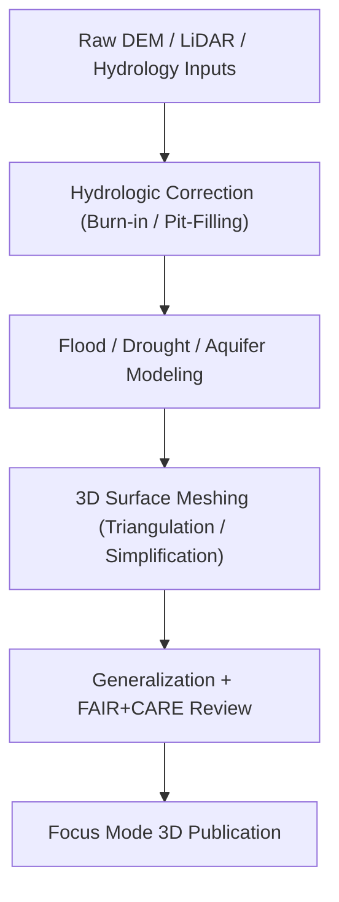

<div align="center">

# 💧 **Kansas Frontier Matrix — Hydrology Elevation Surfaces (3D Visualization)**
`docs/reports/visualization/focus_mode/3d_views/hydrology_elevation_surfaces/README.md`

**Purpose:**  
Document the **3D hydrological elevation surfaces** used in Kansas Frontier Matrix (KFM) Focus Mode for visualizing **flood depths**, **drought elevation anomalies**, **stream channel morphology**, **aquifer elevation differentials**, and **watershed boundary stratification**.


</div>

---

## 📘 Overview

These 3D elevation surfaces integrate hydrological modeling, LiDAR/DEM reconstructions, historical floodplain mapping, and seasonal water table variations.  
Focus Mode uses these surfaces to reveal:

- **Flood elevation layers** (event-based + max-extent composites)  
- **Drought elevation anomalies** (surface depression indices)  
- **Hydraulic head gradients** for aquifer interpretation  
- **Watershed stratification surfaces** (sub-basin separations)  
- **Elevation-derived flow paths and paleo-channel depressions**

All surfaces obey **FAIR+CARE geospatial generalization** to ensure no sensitive well coordinates or tribal hydrological sites are exposed.

---

## 🗂️ Directory Layout

```plaintext
docs/reports/visualization/focus_mode/3d_views/hydrology_elevation_surfaces/
├── flood_depth_surface.glb               # 3D surface mesh of statewide flood depths
├── drought_anomaly_surface.glb           # Derived elevation anomalies during drought cycles
├── aquifer_head_surface.glb              # 3D hydraulic head (static/dynamic)
├── watershed_stratification.glb          # Basin + sub-basin elevation separations
├── demo_view.webp                        # Screenshot from Focus Mode 3D viewport
└── README.md
```

---

## 🧩 Metadata (STAC/DCAT Compatible)

```json
{
  "id": "kfm_hydrology_elevation_surfaces_v10",
  "type": "3d-tiles",
  "title": "Hydrology Elevation Surfaces — Kansas Frontier Matrix (v10)",
  "description": "3D elevation-based hydrology surfaces including flood depths, drought anomalies, aquifer head gradients, and watershed stratification.",
  "temporal": {
    "start": "1900-01-01T00:00:00Z",
    "end": "2025-12-31T23:59:59Z"
  },
  "spatial_extent": [-102.05, 37.0, -94.60, 40.0],
  "stac_extensions": [
    "https://stac-extensions.github.io/projection/v1.0.0/schema.json",
    "https://stac-extensions.github.io/hydrology/v1.0.0/schema.json"
  ],
  "provenance": {
    "source_models": [
      "USGS NED/3DEP",
      "KFM LiDAR-Derived Hydrology Surfaces",
      "FEMA Flood Depth Grids",
      "KDHE Aquifer Head Data"
    ],
    "processing": "src/pipelines/etl/hydrology/elevation_surfaces/build_3d_surfaces.py"
  },
  "license": "CC-BY 4.0",
  "checksum_sha256": "sha256-<hash_here>",
  "updated": "2025-11-12T10:40:00Z"
}
```

---

## 🌊 Hydrology Surface Types

### **1. Flood Depth Surface (GLB)**
- Combines FEMA DFIRM grids + USGS terrain  
- Smoothed using hydraulic enforcement  
- Used in floodplain & risk mapping overlays

### **2. Drought Elevation Anomaly Surface**
- During drought cycles, water loss creates distinctive depression indices  
- Derived using percentile-based DEM differencing across climatic epochs

### **3. Aquifer Head Surface**
- 3D hydraulic head gradient volumes  
- Uses well-level data aggregated & generalized to ≥5 km  

### **4. Watershed Stratification**
- Elevation surfaces representing basin + sub-basin boundaries  
- Used by Focus Mode for contextual watershed storytelling

---

## 🖼️ Preview Capture

```
demo_view.webp
```

**Alt Text:** *3D hydrology surfaces showing flood-depth volumetrics, watershed divisions, and aquifer-gradient overlays in Focus Mode.*

---

## ⚙️ Processing Pipeline Summary



---

## ⚖️ FAIR+CARE Safeguards

| Principle | Implementation |
|----------|----------------|
| **Collective Benefit** | Supports community flood resilience & hydrology education |
| **Authority to Control** | Sensitive well locations generalized ≥5 km or fully masked |
| **Responsibility** | All hydrology surfaces trace provenance to STAC/DCAT sources |
| **Ethics** | No reveal of tribal wells or ecological research sites |

---

## 🧮 Telemetry Record (Example)

```json
{
  "visualization_id": "hydrology-elevation-surfaces-v10",
  "surfaces_rendered": 12,
  "tests_passed": 28,
  "energy_joules": 13.7,
  "carbon_gCO2e": 0.0054,
  "faircare_status": "Pass",
  "timestamp": "2025-11-12T10:45:00Z"
}
```

---

## 🕰️ Version History

| Version | Date | Author | Summary |
|---------|------|--------|---------|
| v10.2.0 | 2025-11-12 | KFM Hydrology Visualization Team | Initial 3D hydrology elevation surfaces documentation & metadata. |

---

<div align="center">

© 2025 Kansas Frontier Matrix  
Master Coder Protocol v6.3 · FAIR+CARE Certified  
Diamond⁹ Ω / Crown∞Ω Ultimate Certified  

[Back to 3D Views](../README.md) · [Visualization Index](../../README.md) · [Governance Charter](../../../../../docs/standards/governance/ROOT-GOVERNANCE.md)

</div>

