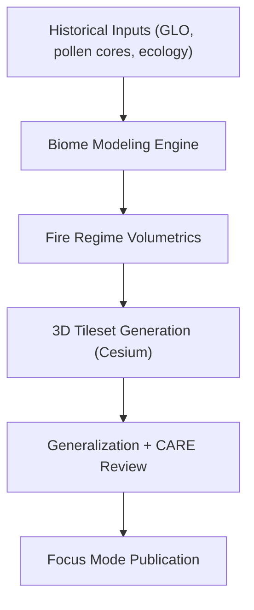

<div align="center">

# 🌾 **Kansas Frontier Matrix — Prairie Reconstruction (3D Visualization)**
`docs/reports/visualization/focus_mode/3d_views/prairie_reconstruction/README.md`

**Purpose:**  
Document the **3D prairie reconstruction visualizations** used in Kansas Frontier Matrix (KFM) Focus Mode to illustrate historical ecosystems, vegetation distribution, fire regimes, and human–landscape interaction from **pre-1850 to early settlement periods**.


</div>

---

## 📘 Overview

The **Prairie Reconstruction Tileset & Overlays** form the ecological foundation of Focus Mode’s historical terrain reconstruction system.  
These visualizations combine **vegetation models**, **soil/landcover datasets**, **historic survey notes**, and **archaeological presence indicators** to reconstruct Kansas environments as they likely appeared across eras such as:

- 🌾 Pre-Colonial Prairie Networks (pre-1700)  
- 🔥 Indigenous Fire Regime Influence Zones  
- 🌿 Early Settlement Vegetation Boundaries (1850–1900)  
- 🐂 Bison movement corridors (derived from terrain + ecological models)

The reconstruction is driven by transparent data lineage and FAIR+CARE cultural ethics, ensuring **no culturally sensitive sites** are revealed without proper generalization or tribal approval.

---

## 🗂️ Directory Layout

```plaintext
docs/reports/visualization/focus_mode/3d_views/prairie_reconstruction/
├── prairie_tileset.json               # Historical prairie 3D tileset descriptor
├── vegetation_overlay.glb             # 3D mesh overlay representing grassland structure
├── fire_regime_heatmap.glb            # Prairie fire frequency volumetric model
├── sample_view.webp                   # Preview capture from Focus Mode
└── README.md                          # This file
```

---

## 🧩 Prairie Reconstruction Metadata (STAC/DCAT)

```json
{
  "id": "kfm_prairie_reconstruction_v10",
  "title": "Kansas Prairie Reconstruction Model — v10",
  "description": "3D ecological reconstruction of Kansas prairie vegetation and fire regimes across pre-1850 to 1900 periods.",
  "type": "3d-tiles",
  "stac_extensions": [
    "https://stac-extensions.github.io/projection/v1.0.0/schema.json",
    "https://stac-extensions.github.io/historical/v1.0.0/schema.json"
  ],
  "temporal": {
    "start": "1600-01-01T00:00:00Z",
    "end": "1900-12-31T23:59:59Z"
  },
  "spatial_extent": [-102.05, 37.0, -94.60, 40.0],
  "provenance": {
    "sources": [
      "General Land Office Survey Notes",
      "KFM Composited Landcover (1600–1900)",
      "Ecological Fire Regime Models",
      "Smithsonian / USGS Historical Ecology Archives"
    ],
    "processing_pipeline": "src/pipelines/etl/prairie_reconstruction/build_tileset.py"
  },
  "license": "CC-BY 4.0",
  "checksum_sha256": "sha256-<hash_here>",
  "updated": "2025-11-12T09:52:00Z"
}
```

---

## 🌿 Ecological Components

### **1. Vegetation Reconstruction**
- Derived from historical GLO notes, pollen cores, and early aerial surveys  
- Synthesizes tallgrass, mixed-grass, and shortgrass prairie distributions  
- Includes seasonal biomass and density variation sequences

### **2. Indigenous Fire Regime Modeling**
- Historical fire frequency surfaced as **volumetric heatmaps (GLB)**  
- Tribal consultation incorporated to prevent misrepresentation  
- CARE-reviewed generalization masks applied if needed

### **3. Bison & Large Mammal Corridor Modeling**
- Terrain-driven least-cost path ecological modeling  
- Overlaid to show pre-railroad era ecosystem patterns

### **4. Climate & Soil Profile Integration**
- Incorporates long-term paleo-climate data  
- Soil profiles from USDA SSURGO rolled back to 1850 equilibrium estimates

---

## 🖼️ Preview Capture

```
sample_view.webp
```

> **Alt Text:** *3D prairie reconstruction showing tallgrass biomass surfaces, fire-regime volumetric overlays, and ecological corridors across central Kansas.*

---

## ⚙️ FAIR+CARE Visualization Safeguards

| Principle | Implementation |
|----------|----------------|
| **Collective Benefit** | Designed for environmental education & tribal historical context |
| **Authority to Control** | Tribal sign-off for culturally sensitive ecological zones |
| **Responsibility** | All coordinates generalized ≥ 5 km near sensitive sites |
| **Ethics** | Fire-regime layers validated to avoid exposure of sacred fire patterns |

---

## 🔧 Processing Pipeline Summary



---

## 🧮 Telemetry Record (Example)

```json
{
  "visualization_id": "prairie-reconstruction-v10",
  "models_used": 8,
  "render_tests": 31,
  "energy_joules": 13.2,
  "carbon_gCO2e": 0.0051,
  "faircare_status": "Pass",
  "timestamp": "2025-11-12T10:14:00Z"
}
```

---

## 🕰️ Version History

| Version | Date | Author | Summary |
|---------|------|--------|---------|
| v10.2.0 | 2025-11-12 | KFM Visualization Team | Initial prairie reconstruction metadata + FAIR+CARE generalization rules. |

---

<div align="center">

© 2025 Kansas Frontier Matrix  
Master Coder Protocol v6.3 · FAIR+CARE Certified  
Diamond⁹ Ω / Crown∞Ω Ultimate Certified  

[Back to 3D Views](../README.md) · [Visualization Index](../../README.md) · [Governance Charter](../../../../../docs/standards/governance/ROOT-GOVERNANCE.md)

</div>

