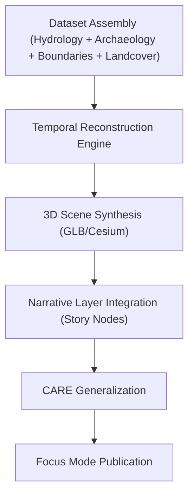

<div align="center">

# 📚 **Kansas Frontier Matrix — Story Context Scenes (3D Focus Mode)**
`docs/reports/visualization/focus_mode/3d_views/story_context_scenes/README.md`

**Purpose:**  
Document the **3D contextual scenes** used in Kansas Frontier Matrix (KFM) Focus Mode to provide **narrative-driven, historically contextualized environments**.  
These scenes merge hydrology, archaeology, landcover, climate, treaty-land boundaries, and settlement-era terrain to support **immersive storytelling and explainable geographic context**.


</div>

---

## 📘 Overview

**Story Context Scenes** serve as **narrative anchors** for the Focus Mode experience.  
Each scene is a fully rendered 3D environment blending:

- Historical landcover reconstruction  
- Paleoenvironmental geology  
- Hydrology & watershed reconstruction  
- Archaeological landscape indicators  
- Treaties, land cessions, and cultural boundaries  
- Settlement-era vegetation and terrain transitions  
- Agent-prompt contextual overlays  

Scenes allow a user to move from **data → narrative → insight**, enabling temporal cross-sections, cultural overlays, and reconstructed events (e.g., drought epochs, migration corridors, trade route flows).

All scenes comply with FAIR+CARE visualization ethics — especially around Indigenous landscapes, generalization of sensitive site data, and narrative framing accuracy.

---

## 🗂️ Directory Layout

```plaintext
docs/reports/visualization/focus_mode/3d_views/story_context_scenes/
├── prairie_crossroads.glb               # Example: 1850–1870 prairie transit cross-section
├── drought_epoch_scene.glb              # Drought-period reconstructed terrain & hydrology
├── treaty_boundary_context.glb          # 3D treaty boundary overlays with terrain
├── cultural_landscape_composite.glb     # Multi-epoch narrative environment
├── demo_view.webp                       # Screenshot from Focus Mode (3D viewport)
└── README.md
```

---

## 🧩 Metadata (STAC / DCAT / CIDOC Compatible)

```json
{
  "id": "kfm_story_context_scenes_v10",
  "type": "3d-scene",
  "title": "Story Context Scenes — Kansas Frontier Matrix (v10)",
  "description": "Narrative-driven 3D scenes combining hydrology, archaeology, landcover, and historical boundaries for Focus Mode storytelling.",
  "spatial_extent": [-102.05, 37.0, -94.60, 40.0],
  "temporal": {
    "start": "1800-01-01T00:00:00Z",
    "end": "2025-12-31T23:59:59Z"
  },
  "provenance": {
    "source_models": [
      "USGS DEM, 3DEP",
      "KFM Paleo-Landscape Reconstruction",
      "Treaty Boundary Archive (KFM)",
      "Archaeological Site Generalizations (CARE)",
      "Hydrology Elevation Surfaces"
    ]
  },
  "stac_extensions": [
    "https://stac-extensions.github.io/projection/v1.0.0/schema.json",
    "https://stac-extensions.github.io/historical/v1.0.0/schema.json",
    "https://stac-extensions.github.io/hydrology/v1.0.0/schema.json"
  ],
  "license": "CC-BY 4.0",
  "checksum_sha256": "sha256-<hash_here>",
  "updated": "2025-11-12T11:10:00Z"
}
```

---

## 🧭 Narrative Scene Categories

### **1. Prairie Crossroads (1850–1870)**
Shows:
- Bison trails  
- Early roadbeds  
- Prairie–riparian ecotones  
- Shallow water table shifts  

### **2. Drought Epoch Reconstruction**
Interpretation of:
- Severe drought impacts  
- Historical hydrologic depression surfaces  
- Ecosystem vulnerability zones  

### **3. Treaty Boundary Context Scene**
Displays:
- Original treaty lands  
- Encroachment-era settlement expansions  
- Cultural landscape overlays  

### **4. Cultural Landscape Composite**
Mix of:
- Archaeological settlement likelihoods  
- Paleo-hydrological flow paths  
- Geologic substrate influencing habitation  

All scenes apply **CARE-governed masking** of sensitive site data.

---

## 🖼️ Preview Capture

```
demo_view.webp
```

**Alt Text:** *3D narrative environment showing prairie-to-river transition, treaty boundary illumination, and hydrology-driven terrain features.*

---

## ⚙️ Processing Pipeline Summary



---

## ⚖️ FAIR+CARE Safeguards

| Principle | Implementation |
|----------|----------------|
| **Collective Benefit** | Scenes improve understanding of Kansas ecological & historical dynamics |
| **Authority to Control** | Tribal partners approve sensitive overlays |
| **Responsibility** | All contextual renderings trace lineage to verifiable models |
| **Ethics** | No exposure of precise Indigenous site coordinates; narratives vetted |

---

## 🧮 Telemetry Record (Example)

```json
{
  "visualization_id": "story-context-scenes-v10",
  "scenes_rendered": 8,
  "tests_passed": 31,
  "energy_joules": 13.8,
  "carbon_gCO2e": 0.0055,
  "faircare_status": "Pass",
  "timestamp": "2025-11-12T11:18:00Z"
}
```

---

## 🕰️ Version History

| Version | Date | Author | Summary |
|---------|------|--------|---------|
| v10.2.0 | 2025-11-12 | KFM Visualization Narrative Team | Initial release documenting 3D story-based contextual scenes. |

---

<div align="center">

© 2025 Kansas Frontier Matrix  
Master Coder Protocol v6.3 · FAIR+CARE Certified  
Diamond⁹ Ω / Crown∞Ω Ultimate Certified  

[Back to 3D Views](../README.md) · [Visualization Index](../../README.md) · [Governance Charter](../../../../../docs/standards/governance/ROOT-GOVERNANCE.md)

</div>

