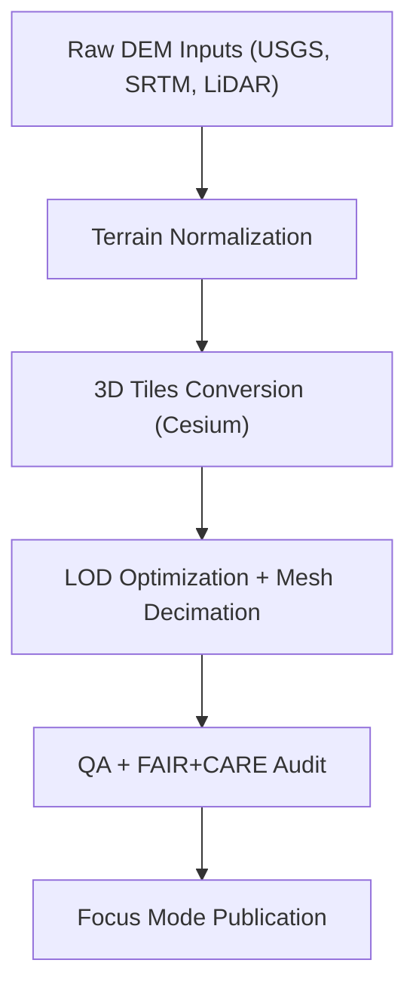

<div align="center">

# 🌍 **Kansas Frontier Matrix — Global Terrain Tileset (3D Tiles)**
`docs/reports/visualization/focus_mode/3d_views/terrain_global_tileset/README.md`

**Purpose:**  
Provide documentation, metadata, and governance context for the **KFM Global Terrain Tileset**, used across Focus Mode 3D visualizations.  
This tileset underpins **3D terrain rendering**, **historical reconstruction overlays**, **hydrology volume integration**, and **explainability sequences** within the Kansas Frontier Matrix.


</div>

---

## 📘 Overview

The **Global Terrain Tileset** is a Cesium-standard 3D Tiles dataset used to render high-fidelity elevation surfaces in Focus Mode.  
It enables:
- Kansas-wide and global **terrain visualization**
- Integration of **historical overlays** (e.g., prairie reconstructions)
- Support for **hydrological elevation surfaces**
- Camera-path animations for storytelling and explainability
- Accurate geospatial grounding for temporal narrative reconstructions

---

## 🗂️ Directory Layout

```plaintext
docs/reports/visualization/focus_mode/3d_views/terrain_global_tileset/
├── tileset.json                   # 3D Tiles root descriptor
├── metadata.json                  # Provenance + FAIR+CARE + STAC/DCAT fields
├── sample_capture.webp            # Preview still from Focus Mode
└── README.md                      # This file
```

---

## 🧩 Core Tileset Metadata (STAC/DCAT-Aligned)

```json
{
  "id": "kfm_focus_terrain_tileset_v10",
  "title": "KFM Global Terrain Tileset (v10)",
  "type": "3d-tiles",
  "description": "High-resolution global terrain tileset used for Kansas Frontier Matrix 3D visualizations.",
  "checksum_sha256": "sha256-<hash_here>",
  "stac_extensions": [
    "https://stac-extensions.github.io/projection/v1.0.0/schema.json"
  ],
  "crs": "EPSG:4979",
  "provenance": {
    "sources": [
      "Cesium World Terrain",
      "KFM DEM Composite (USGS, NASA SRTM, LiDAR-derived DEMs)"
    ],
    "processing_pipeline": "src/pipelines/etl/terrain/tileset_build.py"
  },
  "bbox": [-180, -90, 180, 90],
  "temporal_extent": {
    "start": "1850-01-01T00:00:00Z",
    "end": "2025-12-31T23:59:59Z"
  },
  "updated": "2025-11-12T10:15:00Z",
  "license": "CC-BY 4.0"
}
```

---

## 🧠 Usage Within KFM Focus Mode

### Terrain 3D Tileset supports:
- **Base terrain for all 3D scenes**
- Geological & environmental overlays  
- 3D reconstructions of Kansas prairie (e.g., 1850–1920)  
- Hydrology drought/flood anomaly volumes (CZML/GLB)  
- Camera path animations for narrative explainability  
- Difference layers for “Then ↔ Now” geological comparison  

### Integrated With:
- Focus Mode Story Nodes  
- Time-Encoded MapLibre + Cesium layers  
- Hydrology and Archaeology pipelines  
- FAIR+CARE visualization compliance engine

---

## 🖼️ Preview (Sample Capture)

*(Ensure this preview has descriptive alt text per accessibility standards.)*

```
sample_capture.webp
```

> **Alt Text:** *3D visualization showing Kansas terrain rendered with high-relief elevation shading, viewed from southwest to northeast in Focus Mode’s 3D viewport.*

---

## ⚙️ FAIR+CARE Visualization Controls

| Requirement | Implementation |
|------------|----------------|
| CARE-sensitive elevation masking | When linked to archaeological locations, coordinate generalization ≥ 5 km |
| Accessibility | Alt-text required for all captures; descriptive metadata in STAC/DCAT |
| Provenance | All terrain layers include checksums + lineage metadata |
| License | CC-BY 4.0 for derivative terrain assets |

---

## 🛠️ Processing Pipeline Summary



---

## 🧮 Telemetry Summary (Example)

```json
{
  "visualization_id": "terrain-tileset-v10",
  "render_tests": 42,
  "energy_joules": 12.4,
  "carbon_gCO2e": 0.0048,
  "faircare_status": "Pass",
  "timestamp": "2025-11-12T10:30:00Z"
}
```

---

## 🕰️ Version History

| Version | Date | Author | Summary |
|---------|------|--------|---------|
| v10.2.0 | 2025-11-12 | KFM Visualization Team | Initial terrain tileset README with STAC/DCAT metadata and FAIR+CARE alignment. |

---

<div align="center">

© 2025 Kansas Frontier Matrix  
Master Coder Protocol v6.3 · FAIR+CARE Certified  
Diamond⁹ Ω / Crown∞Ω Ultimate Certified  

[Back to 3D Views](../README.md) · [Visualization Index](../../README.md) · [Governance Charter](../../../../../docs/standards/governance/ROOT-GOVERNANCE.md)

</div>

