<div align="center">

# ✅ Kansas-Frontier-Matrix — Checks & Reproducibility

**Mission:** Ensure all datasets, pipelines, and outputs are **validated, traceable, and reproducible**  
under the **Master Coder Protocol (MCP)** principles.  

[](../.github/workflows/site.yml)  
[](../.github/workflows/tests.yml)  
[](../.github/workflows/stac-validate.yml)  
[](../.github/workflows/stac-badges.yml)  

[](../.github/workflows/codeql.yml)  
[](../.github/workflows/trivy.yml)  
[](../.github/workflows/ossf-scorecard.yml)  

  
  
  

</div>

---

## 🔎 Validation

Run validation **before committing** or opening a PR:

```bash
# Validate STAC catalog (all collections/items)
make stac-validate

# Or directly with KGT validator
kgt validate-stac stac/items --no-strict

# Strict mode with jsonschema (CI or pre-commit)
jsonschema -i stac/items/<item>.json schemas/stac-item.json
````

---

## 🧾 Provenance

Every derived artifact must carry provenance metadata:

* Stamp a `_meta.json` for processed outputs (origin, command, timestamp, hash)
* Add `checksum:sha256` to COG assets when files exist
* Record environment + git SHA (`provenance/git_sha.txt`)
* Maintain **lineage tables** in experiment/SOP docs

**Example `_meta.json`:**

```json
{
  "origin": "data/raw/usgs_topo_1894.tif",
  "command": "gdal_translate -of COG ...",
  "timestamp": "2025-10-01T21:00:00Z",
  "checksum:sha256": "f6b2a34d..."
}
```

---

## 🤖 CI/CD Notes

* **Validate STAC** in **all PRs** (via `stac-validate.yml`)
* **Publish web/** viewer artifacts on `main` (via `site.yml`)
* Run **CodeQL + Trivy** for pipeline and container security
* Upload **checksums & reports** as CI artifacts for auditability

---

## 📈 Scaling Strategy

* Start **small**: process one county or sample dataset
* Validate pipeline, schemas, and viewer integration
* Once reproducible, **scale to statewide datasets**
* Always checkpoint with **provenance + checksums**

---

## 🔄 Lifecycle (Mermaid)

```mermaid
flowchart TD
  A["Raw Sources\n(data/sources/*.json)"] --> B["Make Targets\nfetch · cogs · terrain"]
  B --> C["Processed Outputs\n(data/cogs · data/processed)"]
  C --> D["Stamp _meta.json\norigin · command · timestamp · hash"]
  C --> E["STAC Catalog\ncollections · items · assets"]
  D --> F["Validate\nstac-validate · jsonschema"]
  E --> F
  F --> G["CI/CD\nbadges · reports · artifacts"]
```



<!-- END OF MERMAID -->

---

## ✅ Checklist

* [ ] All new STAC items validated (`make stac-validate`)
* [ ] COGs stamped with `checksum:sha256`
* [ ] `_meta.json` added for processed outputs
* [ ] CI workflows green (STAC, site, security scans)
* [ ] Provenance recorded (git SHA, env, artifact hashes)

---

## ✅ Summary

The **Checks & Reproducibility** guide ensures every contribution is:

* **Validated** (STAC/schema compliant)
* **Traceable** (provenance + hashes)
* **Auditable** (CI/CD enforced)
* **Scalable** (start small, scale reliably)

🔐 This enforces **mission-grade reproducibility** across the Kansas-Frontier-Matrix.
