<div align="center">

# 📦 Kansas-Frontier-Matrix — Requirements

**Mission:** Define **core and optional dependencies** for reproducible builds,  
ensuring all contributors run with the same geospatial + validation stack.  

[](https://www.python.org/)  
[](https://pypi.org/)  
[](../.pre-commit-config.yaml)  
  

</div>

---

## 🎯 Purpose

This file specifies the **Python packages** required for core geospatial workflows and STAC validation.  
Dependencies are split into **core (always needed)** and **optional (recommended)**.  

- Core dependencies are installed via `pip install -r requirements.txt`  
- Optional dependencies can be installed manually or via `requirements-dev.txt`  

---

## 📂 Installation

```bash
# Install core requirements
pip install -r requirements.txt

# Install optional (recommended) extras
pip install -r requirements-dev.txt
````

---

## 🧩 Core Requirements

| Package     | Purpose                                              |
| ----------- | ---------------------------------------------------- |
| `rasterio`  | Read/write raster data (GeoTIFF/COG)                 |
| `rio-cogeo` | Cloud-optimized GeoTIFF conversion                   |
| `pyproj`    | Coordinate Reference Systems (CRS) & transformations |
| `shapely`   | Geometric operations on vector features              |
| `pystac`    | Build, read, and validate STAC catalogs              |
| `Pillow`    | Image manipulation (thumbnails, previews)            |

---

## 💡 Optional (Recommended)

| Package      | Purpose                                            |
| ------------ | -------------------------------------------------- |
| `jsonschema` | JSON Schema validation (STAC, configs, provenance) |
| `jinja2`     | Template rendering for configs and docs            |

---

## 🔄 Dependency Lifecycle

```mermaid
flowchart TD
  A["requirements.txt\n(core)"] --> B["pip install"]
  C["requirements-dev.txt\n(optional)"] --> B
  B --> D["Core Tools\nrasterio · rio-cogeo · pyproj · shapely · pystac · Pillow"]
  B --> E["Optional Tools\njsonschema · jinja2"]
  D --> F["Make Targets\nfetch · cogs · terrain · stac"]
  E --> F
  F --> G["CI/CD\nvalidation · site builds · reproducibility"]
```



<!-- END OF MERMAID -->

---

## ✅ Checklist

* [ ] Installed `pip install -r requirements.txt` successfully
* [ ] Verified `python -m rasterio` runs without errors
* [ ] Installed optional packages (`jsonschema`, `jinja2`) if validating configs
* [ ] CI workflows green for validation + site build

---

## 📚 References

* [Rasterio](https://rasterio.readthedocs.io/)
* [rio-cogeo](https://cogeotiff.github.io/rio-cogeo/)
* [pyproj](https://pyproj4.github.io/pyproj/stable/)
* [Shapely](https://shapely.readthedocs.io/)
* [pystac](https://pystac.readthedocs.io/)
* [Pillow](https://pillow.readthedocs.io/en/stable/)
* [jsonschema](https://python-jsonschema.readthedocs.io/)
* [jinja2](https://jinja.palletsprojects.com/)

---

✅ With these requirements, all contributors run the **same toolchain** → ensuring Kansas-Frontier-Matrix is **reproducible, auditable, and MCP-compliant**.
