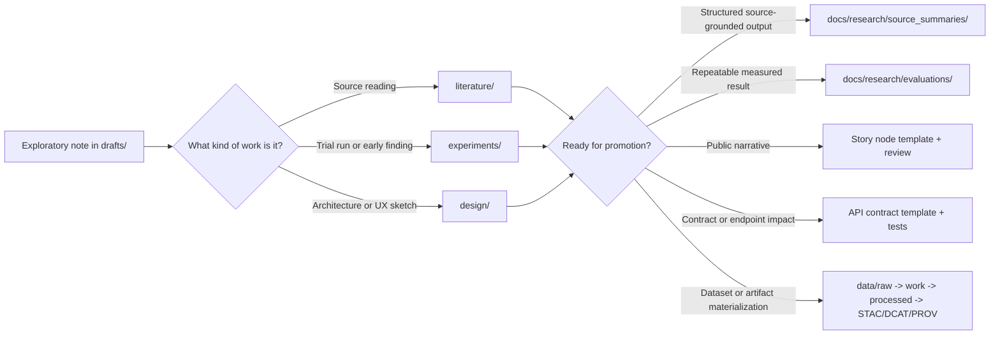

<!-- [KFM_META_BLOCK_V2]
doc_id: kfm://doc/NEEDS-VERIFICATION
title: KFM Research Drafts
type: standard
version: v1
status: draft
owners: NEEDS VERIFICATION
created: YYYY-MM-DD
updated: YYYY-MM-DD
policy_label: public
related: [../README.md, ./literature/README.md, ../source_summaries/README.md, ../evaluations/README.md, ../../templates/TEMPLATE__KFM_UNIVERSAL_DOC.md, ../../templates/TEMPLATE__STORY_NODE_V3.md, ../../templates/TEMPLATE__API_CONTRACT_EXTENSION.md]
tags: [kfm, research, drafts]
notes: [Owners, dates, exact adjacent inventory, and stable doc ID need mounted-repo verification.]
[/KFM_META_BLOCK_V2] -->

# KFM Research Drafts

Staging area for early, non-canonical research notes, experiment sketches, and design probes before promotion into governed KFM artifacts.

> [!NOTE]
> **Status:** experimental  
> **Owners:** NEEDS VERIFICATION  
>     
> **Quick jumps:** [Scope](#scope) · [Repo fit](#repo-fit) · [Accepted inputs](#accepted-inputs) · [Exclusions](#exclusions) · [Directory tree](#directory-tree) · [Quickstart](#quickstart) · [Usage](#usage) · [Diagram](#diagram) · [Tables](#tables) · [Task list](#task-list--definition-of-done) · [FAQ](#faq) · [Appendix](#appendix)  
> **Repo fit:** `docs/research/drafts/` → upstream: [`../README.md`](../README.md) · adjacent/downstream: [`./literature/README.md`](./literature/README.md), [`../source_summaries/README.md`](../source_summaries/README.md), [`../evaluations/README.md`](../evaluations/README.md), [`../../templates/`](../../templates/)  
> **Accepted inputs:** literature notes, experiment logs, design sketches, evidence triage, verification backlogs  
> **Exclusions:** governed policy, public story content, raw/derived datasets, secrets, precise sensitive locations

> [!IMPORTANT]
> Drafts are **not authoritative system documentation**. They must not be used on their own as the basis for Focus Mode output, public-facing UI narrative, API contracts, or governance requirements.

> [!WARNING]
> Current-session verification was **PDF-only**. The intent, routing, and naming conventions below are grounded in attached KFM materials, but the exact mounted file inventory beyond this README remains **NEEDS VERIFICATION** until the repo tree is directly inspected.

> [!NOTE]
> AI may help summarize or structure draft material, but it must not generate policy, infer sensitive locations, or present speculation as established fact. Any AI-derived material headed toward user-facing use still needs provenance and review.

## Scope

This directory exists so KFM can explore ideas without pretending they are already release-ready. Use it as the staging area for working notes, open questions, early experiment writeups, and design sketches that may later mature into governed documents, repeatable evaluations, implementation work, or public narrative.

Drafts belong here when they are still being shaped, challenged, cross-checked, or routed. They do **not** skip the KFM truth path. Promotion is still required before any draft becomes a governed doc, dataset, story node, contract change, or outward-facing endpoint.

The canonical ordering still applies here: **ETL → STAC/DCAT/PROV → Graph → APIs → UI → Story Nodes → Focus Mode**. Drafts may inform any of those layers, but they do not bypass them.

## Repo fit

| Path | Role | Relationship | Status |
| --- | --- | --- | --- |
| `docs/research/drafts/README.md` | this file | directory README and routing surface | **CONFIRMED** |
| `docs/research/README.md` | research hub | upstream entry point for research lanes | **INFERRED** |
| `docs/research/drafts/literature/README.md` | literature lane | subordinate draft lane for source-reading notes | **INFERRED** |
| `docs/research/source_summaries/README.md` | structured source summaries | common promotion target for source-grounded outputs | **INFERRED** |
| `docs/research/evaluations/README.md` | governed evaluation summaries | use when a draft becomes repeatable, measured, and provenance-linked | **INFERRED** |
| `docs/templates/TEMPLATE__KFM_UNIVERSAL_DOC.md` | governed doc template | use when a draft graduates into a maintained standard doc | **INFERRED** |
| `docs/templates/TEMPLATE__STORY_NODE_V3.md` | narrative template | required when draft material becomes public story content | **INFERRED** |
| `docs/templates/TEMPLATE__API_CONTRACT_EXTENSION.md` | API contract template | required when a draft implies contract or endpoint change | **INFERRED** |
| `data/raw/` → `data/work/` → `data/processed/` → `data/stac/` | data lifecycle | draft notes may reference these stages, but datasets do not live in `docs/` | **CONFIRMED doctrine / NEEDS VERIFICATION paths** |
| `mcp/` | experiments / runs / model-adjacent artifacts | heavy run artifacts and model cards belong here when applicable | **INFERRED** |

### Current evidence boundary

**CONFIRMED:** attached KFM materials treat drafts as early-stage, non-canonical working documents and keep them distinct from governed docs, public narrative, contract surfaces, and data artifacts.  
**UNKNOWN / NEEDS VERIFICATION:** exact owners, dates, adjacent file inventory, and mounted repo presence of every path above.

## Accepted inputs

Place material here when it is exploratory, reviewable, and still on its way to a stronger artifact:

- literature notes, book/article summaries, and source annotations
- hypotheses, research questions, and “what to verify next” notes
- experiment plans, early results, and sketch logs that are not yet governed evaluations
- design sketches for ETL, catalogs, graph, APIs, UI, story, or Focus behavior
- evidence triage notes and routing decisions
- short references to external or local source assets, when licensing and permissions are respected

## Exclusions

Do **not** place the following here:

- final governance policies or standards
- public story nodes or Focus-ready narrative prose
- API or contract changes without the matching governed contract docs and tests
- raw or derived datasets, tiles, large result bundles, or catalog artifacts
- secrets, credentials, tokens, or private operational details
- precise sensitive locations that should be generalized, withheld, or reviewed first
- mature, repeatable evaluation dossiers that belong in `docs/research/evaluations/`
- production-facing how-to docs or runbooks owned by pipeline or ops lanes

## Directory tree

The tree below reflects the strongest directly surfaced draft conventions. Treat it as the **expected local shape**, not as proof that every leaf already exists in the mounted repo.

```text
docs/
└── research/
    ├── README.md
    ├── drafts/
    │   ├── README.md
    │   ├── literature/
    │   │   ├── README.md
    │   │   ├── by_topic/
    │   │   │   └── YYYY-MM-DD__topic__notes.md
    │   │   ├── by_source/
    │   │   │   └── <citekey>__<short-title>__notes.md
    │   │   └── literature_log.md
    │   ├── experiments/
    │   │   └── YYYY-MM-DD__experiment__log.md
    │   ├── design/
    │   │   └── YYYY-MM-DD__proposal__sketch.md
    │   └── assets/
    │       ├── figures/
    │       └── snippets/
    ├── evaluations/
    │   └── README.md
    └── source_summaries/
        ├── README.md
        └── _attachments/
            └── README.md
```

## Quickstart

Create the narrowest draft you can, as close as possible to the material it is actually about.

1. Choose the right lane:
   - `literature/` for source-reading notes
   - `experiments/` for trial runs or early findings
   - `design/` for architecture or UX sketches
   - `assets/` for figures and snippets that support a draft

2. Use a dated, descriptive filename:

```bash
mkdir -p docs/research/drafts/design
touch docs/research/drafts/design/2026-04-11__hydrology-proof-slice__sketch.md
```

3. Start with a small, honest shape:
   - one-line purpose
   - status labels (`CONFIRMED`, `INFERRED`, `PROPOSED`, `UNKNOWN`, `NEEDS VERIFICATION`)
   - source list or identifiers
   - KFM relevance
   - next promotion target, if known

## Usage

### Add a draft leaf

1. Keep the file centered on one topic, source family, experiment, or proposal.
2. Separate sourced claims from your interpretation.
3. State which KFM lane or pipeline stage the note informs.
4. Mark unresolved points explicitly instead of smoothing them away.
5. Add routing context when the work should later move elsewhere.

### Promote a draft

Promotion is required when draft content stops being exploratory and starts carrying operational consequence.

- If it becomes a governed documentation surface, move it through the universal doc template.
- If it becomes public narrative, route it through the story node template and review path.
- If it changes an API or contract, pair it with the API contract extension and tests.
- If it becomes a repeatable benchmark or measured result, promote it into `docs/research/evaluations/`.
- If it materializes into datasets or build artifacts, move the outputs into the data lifecycle and catalog them through STAC/DCAT/PROV.

### Update this README

Update this file when one of the following changes:

- the draft lane gains or loses a stable subdirectory
- naming conventions are standardized or revised
- promotion destinations or governing templates change
- sensitivity, sovereignty, or AI-handling rules change
- the mounted repo confirms or disproves the provisional inventory above

## Diagram



## Tables

### Promotion routing matrix

| Draft signal | Promote to | What must come with it |
| --- | --- | --- |
| Source-grounded summary that should be reused | `docs/research/source_summaries/` | source identifier, neutral summary, provenance-aware notes |
| Repeatable evaluation or benchmark | `docs/research/evaluations/` | run IDs, metrics, limitations, repro steps |
| Public-facing story or dossier content | story node template / governed narrative doc | citations, review path, sensitivity handling |
| Contract or endpoint implication | API contract extension + tests | schema/examples/tests, downstream impact notes |
| Dataset or asset output | `data/` lifecycle + `STAC/DCAT/PROV` | descriptors, receipts, validation, release linkage |
| Repo-wide doctrine or operating guidance | governed doc template | ownership, review, stable contract language |

### Status vocabulary used in this directory

| Label | Use here |
| --- | --- |
| **CONFIRMED** | Directly supported by visible project evidence or attached KFM doctrine |
| **INFERRED** | Small structural completion strongly implied by the attached materials |
| **PROPOSED** | Recommended next move or local convention that fits KFM doctrine |
| **UNKNOWN** | Not verified strongly enough in the current session |
| **NEEDS VERIFICATION** | Review flag for mounted repo state, ownership, dates, or file inventory |

## Task list / Definition of done

### For this README

- [ ] clearly distinguishes drafts from governed docs
- [ ] states path, upstream/downstream routing, accepted inputs, and exclusions
- [ ] preserves promotion as a governed transition rather than an informal copy step
- [ ] carries sensitivity and sovereignty reminders
- [ ] keeps workspace uncertainty visible where the repo was not directly mounted

### For a new draft leaf

- [ ] source or topic is clearly identifiable
- [ ] key claims are separated from interpretation
- [ ] KFM relevance is explicit
- [ ] open questions and verification gaps are named honestly
- [ ] sensitive detail is generalized, withheld, or flagged for review when needed
- [ ] next destination is clear if promotion is likely

## FAQ

### Is a draft authoritative?

No. A draft may inform later work, but it is not a governed truth surface by itself.

### Can I put experiment results here?

Yes, when they are still exploratory. Once the work becomes repeatable, measured, and decision-bearing, move or mirror the summary into `docs/research/evaluations/`.

### Can a draft feed Focus Mode or public UI content directly?

No. Public-facing use requires promotion, provenance, policy checks, and the correct governed template path.

### Can I reference a source without storing the attachment locally?

Yes. DOI, ISBN, URL, or another stable source identifier is enough for a draft note. If a local attachment is stored, licensing and permissions should be recorded.

## Appendix

<details>
<summary><strong>Sample draft skeleton</strong></summary>

```md
# YYYY-MM-DD__topic__notes

One-line purpose.

## Status
- CONFIRMED:
- INFERRED:
- PROPOSED:
- UNKNOWN:
- NEEDS VERIFICATION:

## Sources
- DOI / ISBN / URL / repo path / document ID

## What this says
- Neutral summary of the source or draft idea

## Why it matters to KFM
- Lane:
- Pipeline stage(s):
- Possible promotion target:

## Open questions
- What still needs checking?
```

</details>

<details>
<summary><strong>Naming patterns</strong></summary>

| Lane | Recommended pattern |
| --- | --- |
| Literature | `YYYY-MM-DD__topic__notes.md` or `<citekey>__<short-title>__notes.md` |
| Experiments | `YYYY-MM-DD__experiment__log.md` |
| Design | `YYYY-MM-DD__proposal__sketch.md` |
| Assets | keep supporting files under `assets/figures/` or `assets/snippets/` and reference them from a markdown leaf |

</details>

[Back to top](#kfm-research-drafts)
