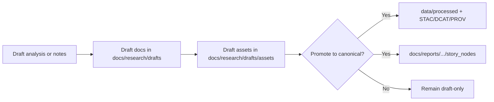

<!-- [KFM_META_BLOCK_V2]
doc_id: kfm://doc/NEEDS-VERIFICATION
title: Research Draft Assets
type: standard
version: v1
status: draft
owners: NEEDS VERIFICATION
created: YYYY-MM-DD
updated: YYYY-MM-DD
policy_label: public
related: [../README.md, ../literature/README.md, ../../../templates/TEMPLATE__STORY_NODE_V3.md, ../../../templates/TEMPLATE__API_CONTRACT_EXTENSION.md, ../../../governance/ROOT_GOVERNANCE.md]
tags: [kfm, research, drafts, assets]
notes: [Replace placeholders after mounted repo verification; current session verified draft-lane doctrine and adjacent README patterns from the PDF-visible corpus, not a live subtree inventory.]
[/KFM_META_BLOCK_V2] -->

# Research Draft Assets

Directory README for non-canonical images, diagrams, screenshots, and small visual exports referenced by KFM research drafts.

> [!NOTE]
> **Status:** experimental  
> **Owners:** NEEDS VERIFICATION  
>     
> **Quick jumps:** [Scope](#scope) · [Repo fit](#repo-fit) · [Accepted inputs](#accepted-inputs) · [Exclusions](#exclusions) · [Current verified snapshot](#current-verified-snapshot) · [Directory tree](#directory-tree) · [Quickstart](#quickstart) · [Usage](#usage) · [Diagram](#diagram) · [Tables](#tables) · [Task list](#task-list--definition-of-done) · [FAQ](#faq) · [Appendix](#appendix)  
> **Repo fit:** `docs/research/drafts/assets/` → upstream: [`../README.md`](../README.md), [`../literature/README.md`](../literature/README.md) · downstream: `docs/reports/<…>/story_nodes/` for governed narrative assets, `data/raw/ → data/work/ → data/processed/ → data/stac/` for canonical data/evidence products

> [!IMPORTANT]
> This directory is a **draft-support lane**, not an authoritative data store. Files here can help people understand work-in-progress, but they do **not** replace governed datasets, STAC/DCAT/PROV records, Story Nodes, or contract-bearing documentation.

> [!WARNING]
> Current-session evidence for this file came from the attached corpus and scaffold-style repo docs surfaced through that corpus. Exact mounted subtree contents, owners, CI enforcement, and local inventory beyond what is listed below remain **NEEDS VERIFICATION**.

## Scope

This directory exists so draft Markdown can keep its small supporting visuals nearby without confusing those visuals with canonical data outputs.

Use this lane for assets that are primarily **documentation aids** during exploratory work:

- figures that help reviewers follow a draft argument
- screenshots that show a draft UI state, map state, or export example
- Mermaid render exports or similar diagram outputs
- small, non-sensitive illustrative tables or image exports that remain subordinate to the draft text

Use a governed location instead when the file becomes part of a released narrative, a durable evidence object, or a canonical data product.

## Repo fit

| Path | Role | Relationship |
| --- | --- | --- |
| `docs/research/drafts/README.md` | draft-lane hub | higher-level rules for exploratory work |
| `docs/research/drafts/literature/README.md` | sibling draft lane | example of source-aware draft handling |
| `docs/research/drafts/assets/README.md` | this file | rules for draft-support visuals and small exports |
| `docs/templates/TEMPLATE__STORY_NODE_V3.md` | governed narrative template | use when a draft asset becomes story-facing |
| `docs/templates/TEMPLATE__API_CONTRACT_EXTENSION.md` | governed contract template | use when a draft crosses into API/contract change territory |
| `docs/reports/<…>/story_nodes/` | governed narrative destination | promote finalized story-facing assets here |
| `data/raw/ → data/work/ → data/processed/ → data/stac/` | canonical data lifecycle | promote durable evidence/data products here instead |

## Accepted inputs

Place files here when they are primarily **draft-support assets**:

| Input type | Typical formats | Notes |
| --- | --- | --- |
| Draft figure | PNG, SVG, PDF | Use for explanatory visuals embedded in draft Markdown |
| Diagram export | SVG, PNG, PDF | Prefer SVG when practical for diffability |
| Screenshot | PNG, JPG | Redact incidental names, emails, tokens, and sensitive map locations before commit |
| Small illustrative export | CSV, PNG, PDF | Keep only if the file is explanatory and not the canonical data product |

## Exclusions

Do **not** place the following here:

- raw or processed datasets → move into `data/raw/`, `data/work/`, or `data/processed/`
- anything that requires STAC/DCAT/PROV publication to be trusted → promote the underlying asset/data into the canonical data lanes
- finalized story-facing assets intended for governed reports or Story Nodes → route to `docs/reports/<…>/story_nodes/`
- endpoint or contract proposals that should become governed docs → use [`../../../templates/TEMPLATE__API_CONTRACT_EXTENSION.md`](../../../templates/TEMPLATE__API_CONTRACT_EXTENSION.md)
- sensitive or restricted material, including precise sensitive locations, credentials, tokens, or personal data
- large binaries that would bloat Git history without strong draft-only justification
- copied exports that imply KFM has already promoted or published the underlying evidence when it has not

## Status vocabulary used in this directory

| Label | Use here |
| --- | --- |
| **CONFIRMED** | Directly supported by the visible project corpus or cited repo-facing draft material |
| **INFERRED** | Small structural completion that fits adjacent KFM draft-lane conventions but is not directly mounted in this session |
| **PROPOSED** | Recommended folder behavior, naming, or promotion step |
| **UNKNOWN** | Not verified strongly enough in the current session |
| **NEEDS VERIFICATION** | A visible review flag for metadata, ownership, local inventory, CI behavior, or path assumptions |

## Current verified snapshot

The current session could verify this lane’s **role** and a scaffold-style baseline for this file from the project corpus. It could **not** directly inspect a mounted subtree to prove exact live inventory.

| Item | Verified state | Notes |
| --- | --- | --- |
| `docs/research/drafts/assets/README.md` | **CONFIRMED (corpus-visible)** | the lane and a draft baseline for this file were surfaced in the attached corpus |
| `docs/research/drafts/README.md` | **CONFIRMED (corpus-visible)** | higher-level draft conventions were surfaced in the same corpus |
| `docs/research/drafts/literature/README.md` | **CONFIRMED (corpus-visible)** | sibling draft lane and promotion boundary were surfaced |
| `docs/research/drafts/assets/images/` | **NEEDS VERIFICATION** | shown as an optional layout, not directly mounted here |
| `docs/research/drafts/assets/diagrams/` | **NEEDS VERIFICATION** | shown as an optional layout, not directly mounted here |
| `docs/research/drafts/assets/figures/` | **NEEDS VERIFICATION** | shown as an optional layout, not directly mounted here |
| `docs/research/drafts/assets/exports/` | **NEEDS VERIFICATION** | shown as an optional layout, not directly mounted here |

## Directory tree

```text
docs/
└── research/
    └── drafts/
        ├── README.md
        ├── literature/
        │   └── README.md
        └── assets/
            ├── README.md
            ├── images/        (optional / NEEDS VERIFICATION)
            ├── diagrams/      (optional / NEEDS VERIFICATION)
            ├── figures/       (optional / NEEDS VERIFICATION)
            └── exports/       (optional / NEEDS VERIFICATION)
```

## Quickstart

Add only small, non-sensitive draft-support files here, then reference them with a **relative path from the draft that uses them**.

Illustrative examples:

```md
<!-- From docs/research/drafts/<draft>.md -->

```

```md
<!-- From docs/research/drafts/literature/<note>.md -->

```

Keep a short nearby note in the draft when context matters:

```md
*Draft asset note:* illustrative screenshot only; not a canonical evidence object.
Promote the underlying data or finalized figure before story-facing or public use.
```

## Usage

### Add or update an asset

1. Put the file in the narrowest sensible subfolder under `assets/`.
2. Prefer stable, descriptive filenames over vague names like `image1.png`.
3. Redact incidental PII, credentials, and sensitive coordinates before commit.
4. Reference the file from the draft with a relative path.
5. If the asset depends on an external source, record attribution in nearby draft text.
6. If the asset starts carrying durable evidentiary weight, **promote** it instead of leaving it here indefinitely.

### Promote an asset when it stops being draft-only

Promote out of this folder when any of the following becomes true:

- the asset is reused in a governed report or Story Node
- the asset is cited as durable evidence rather than as draft illustration
- the asset depends on an underlying dataset that needs STAC/DCAT/PROV treatment
- the asset is intended to appear in a public-facing UI or Focus Mode narrative

Typical promotion paths:

- story-facing narrative asset → `docs/reports/<…>/story_nodes/`
- underlying data/evidence product → `data/processed/` plus `data/stac/` and related provenance/catalog records
- contract-bearing behavior proposal → governed docs/templates under `docs/templates/` and subsystem docs

### Update this README

Update this file when any of the following changes:

- the verified local inventory of this subtree is directly inspected and differs from the snapshot above
- owners, dates, or doc identifiers are resolved
- the asset subfolder pattern becomes stable and enforced
- adjacent draft lanes or promotion destinations change
- CI starts enforcing file size, attribution stubs, or promotion checks for this lane

## Diagram



## Tables

### Asset handling matrix

| Asset kind | Good fit here? | Promote when | Notes |
| --- | --- | --- | --- |
| Draft figure | Yes | it becomes story-facing or evidentiary | keep the draft role explicit |
| Diagram export | Yes | it becomes part of a governed design/story surface | prefer SVG when practical |
| Screenshot | Yes, if redacted | it becomes part of released UI/story documentation | remove tokens, emails, names, and sensitive map detail |
| Small illustrative table export | Sometimes | the table becomes canonical data or evidence | keep only small explanatory exports here |
| Raw or processed dataset | No | immediately | use canonical data lanes |
| Sensitive or restricted visual | No | do not commit here | route through the correct restricted process |

### Optional subfolder guidance

| Subfolder | Best use | Status in this session |
| --- | --- | --- |
| `images/` | generic still images or screenshots | optional / NEEDS VERIFICATION |
| `diagrams/` | Mermaid render exports or design diagrams | optional / NEEDS VERIFICATION |
| `figures/` | charts, plates, and explanatory draft visuals | optional / NEEDS VERIFICATION |
| `exports/` | small draft-only exports that support a specific note | optional / NEEDS VERIFICATION |

### Naming guidance

| Guidance | Rationale |
| --- | --- |
| Prefer descriptive slugs | makes links and reviews easier to read |
| Keep names stable once referenced | reduces broken links in active drafts |
| Prefer SVG for diagrams, PNG for screenshots | balances diffability and fidelity |
| Avoid generic filenames like `final.png` | preserves meaning in Git history |

## Task list & definition of done

### For this README

- [ ] Meta block placeholders replaced after mounted repo verification
- [x] Draft-support purpose clearly separated from canonical data/evidence lanes
- [x] Repo fit, accepted inputs, and exclusions stated
- [x] Promotion boundary to Story Nodes and canonical data lanes stated
- [x] At least one Mermaid diagram included
- [x] Current uncertainty made visible rather than smoothed over

### For assets committed into this folder

- [ ] File is genuinely draft-support, not canonical data
- [ ] Relative links from the draft resolve
- [ ] No secrets, credentials, or incidental PII remain in the file
- [ ] Sensitive locations are generalized or omitted
- [ ] External source attribution is present nearby when needed
- [ ] Promotion has been considered if the asset is reused outside draft-only work

## FAQ

### Can I keep raw or processed datasets here?

No. This folder is for draft-support assets, not for canonical data products. Put datasets into the `data/` lifecycle instead.

### Do assets here get STAC/DCAT/PROV metadata by default?

No. Draft assets here are not cataloged by default. Promotion is required before an asset or its underlying data should be treated as a durable evidence object.

### Can a screenshot from a prototype UI live here?

Yes, if it is small, draft-only, and redacted appropriately. If it becomes part of released story/public material, promote it out of this lane.

### What if I am not sure whether a visual includes sensitive information?

Treat it as sensitive, do not guess, and request review before committing or promoting it.

### Can I commit externally sourced images here?

Only when rights/permissions allow it and the draft records the needed attribution nearby. If rights are unclear, do not commit the file.

## Appendix

<details>
<summary><strong>Illustrative filename patterns (PROPOSED, not verified as enforced)</strong></summary>

Use these only as starter patterns until the mounted repo confirms a stricter convention:

```text
<draft-slug>__figure-01.png
<draft-slug>__diagram-01.svg
<draft-slug>__screen-01.png
<draft-slug>__export-01.csv
```

These patterns are intentionally simple: draft slug first, asset role second, sequence last.
</details>

<details>
<summary><strong>Illustrative nearby attribution note</strong></summary>

Illustrative example only:

```md
*Figure source:* exported from local draft analysis on YYYY-MM-DD.
External reference used in the underlying draft discussion: <citation or URL>.
Rights/permissions checked before commit: YES / NO / NEEDS VERIFICATION.
```
</details>

<details>
<summary><strong>Promotion triggers to watch for</strong></summary>

Promote an asset out of this lane when it becomes:

- part of a governed Story Node
- a durable evidence figure in a report
- a public-facing UI illustration
- inseparable from a canonical dataset that now needs STAC/DCAT/PROV treatment
- an artifact that reviewers must trust independently of the draft text
</details>

[Back to top](#research-draft-assets)
