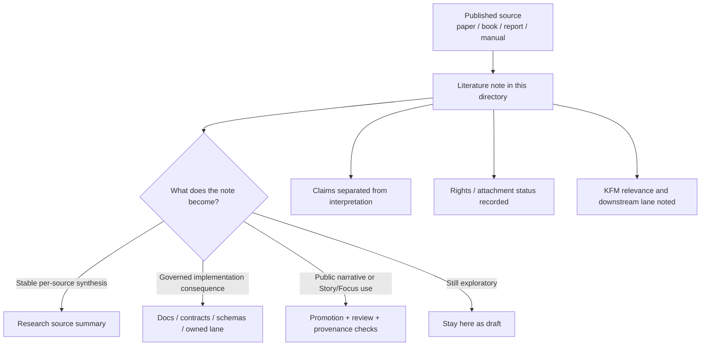

<!-- [KFM_META_BLOCK_V2]
doc_id: kfm://doc/NEEDS-VERIFICATION
title: Research Drafts — Literature
type: standard
version: v1
status: draft
owners: NEEDS VERIFICATION
created: YYYY-MM-DD
updated: YYYY-MM-DD
policy_label: NEEDS VERIFICATION
related: [../../../README.md, ../../README.md, ../README.md, ../../source_summaries/README.md, ../../source_summaries/_attachments/README.md, ../../../templates/]
tags: [kfm, research, drafts, literature]
notes: [Replaces the current placeholder README. Owners, dates, policy label, and any inventory beyond the verified public snapshot still need mounted-repo verification.]
[/KFM_META_BLOCK_V2] -->

# Research Drafts — Literature

Working literature-note lane for KFM research that captures what a source says, what it supports, and what still needs promotion before it can affect governed behavior.

> [!NOTE]
> **Status:** experimental  
> **Owners:** NEEDS VERIFICATION  
>      
> **Quick jumps:** [Scope](#scope) · [Repo fit](#repo-fit) · [Accepted inputs](#accepted-inputs) · [Exclusions](#exclusions) · [Verified snapshot](#current-verified-snapshot) · [Quickstart](#quickstart) · [Usage](#usage) · [Diagram](#diagram) · [Definition of done](#task-list--definition-of-done) · [FAQ](#faq)  
> **Repo fit:** `docs/research/drafts/literature/README.md` → upstream: [`../../README.md`](../../README.md), [`../README.md`](../README.md), [`../../../README.md`](../../../README.md) · adjacent: [`../../source_summaries/README.md`](../../source_summaries/README.md), [`../../source_summaries/_attachments/README.md`](../../source_summaries/_attachments/README.md), [`../../../templates/`](../../../templates/) · downstream: governed docs, contracts, schemas, and approved narrative paths after promotion

> [!IMPORTANT]
> This directory is a **working research lane**, not a public narrative surface and not a substitute for governed contracts, schemas, receipts, or release artifacts.

> [!WARNING]
> Current public-repo verification shows this lane is still **scaffold-heavy**. Treat any file inventory, ownership claim, automation detail, or child-lane convention beyond the verified snapshot below as **NEEDS VERIFICATION** until a mounted checkout is inspected directly.

## Scope

This directory holds **literature-grounded draft notes** that help KFM contributors move from source reading to research synthesis without collapsing exploratory work into governed truth too early.

Use this lane to answer questions like:

- What does this paper, book, report, or manual actually say?
- Which claim is **source-stated** versus **our interpretation**?
- Which KFM area does the source inform: data, metadata, graph, API, UI, Story, Focus, or review?
- What should be routed onward to a source summary, design note, contract, or promoted artifact?

This README should optimize for **traceable reading discipline**:
capture the source cleanly, separate claims from interpretation, and make promotion boundaries obvious.

## Repo fit

| Path | Role | Relationship |
| --- | --- | --- |
| [`../../../README.md`](../../../README.md) | docs subtree hub | broader documentation context |
| [`../../README.md`](../../README.md) | research subtree hub | parent guidance for exploratory, non-governed research work |
| [`../README.md`](../README.md) | drafts hub | sibling draft-lane conventions |
| [`../../source_summaries/README.md`](../../source_summaries/README.md) | structured per-source summary lane | use when a source needs a more stable, reusable summary |
| [`../../source_summaries/_attachments/README.md`](../../source_summaries/_attachments/README.md) | attachment handling lane | use when local source files are retained with permission |
| [`../../../templates/`](../../../templates/) | governed templates subtree | use when a draft graduates into a governed document class |

## Accepted inputs

Place material here when it is primarily **literature-note work**:

- paper, book, article, report, thesis, manual, or dossier reading notes
- short neutral summaries of what a source says
- extracted claims, caveats, methods, definitions, and terminology
- notes on how a source might inform KFM pipeline stages, shell behavior, metadata, graph structure, or evidence posture
- clearly labeled questions, hypotheses, tensions, or follow-up reading prompts
- pointers to related source summaries or locally stored attachments

## Exclusions

Do **not** place the following here:

- public-facing narrative prose intended for Focus Mode or Story publication
- authoritative governance, policy, or rights decisions
- API contracts, schema definitions, or release manifests
- raw datasets, processed datasets, or derived catalog artifacts
- implementation runbooks owned by another lane
- copied source-text dumps when a short summary and citation will do
- speculative local impact claims presented as established fact
- sensitive-location inference, hidden coordinates, secrets, or credentials

## Status vocabulary used in this lane

| Label | Meaning here |
| --- | --- |
| **CONFIRMED** | Directly verified in visible repository evidence or directly stated in the cited source |
| **INFERRED** | Conservative completion that fits visible evidence but is not yet directly verified |
| **PROPOSED** | Recommended structure, convention, or next step for this lane |
| **UNKNOWN** | Not verified strongly enough in the current session |
| **NEEDS VERIFICATION** | Review flag for ownership, metadata, inventory, or behavior that should be checked before commit |

## Current verified snapshot

The current public snapshot for this lane is small and should stay visible:

- `docs/research/` exists as an exploratory, non-normative subtree.
- `docs/research/drafts/` exists and currently contains `assets/`, `literature/`, and a placeholder `README.md`.
- `docs/research/drafts/literature/README.md` currently exists but is only a placeholder.
- `docs/research/source_summaries/` exists and is the closest adjacent stable lane for per-source structured summaries.

That means this README should prioritize **structure, routing, and local conventions** over claims about mature implementation.

## Directory tree

### Current verified snapshot

```text
docs/
└── research/
    ├── README.md
    ├── drafts/
    │   ├── README.md
    │   ├── assets/
    │   └── literature/
    │       └── README.md
    └── source_summaries/
        ├── README.md
        └── _attachments/
            └── README.md
```

<details>
<summary><strong>PROPOSED future expansion</strong></summary>

The structure below is useful, but it is not treated as current repo fact until verified.

```text
docs/
└── research/
    └── drafts/
        └── literature/
            ├── README.md
            ├── by_topic/
            │   ├── README.md
            │   └── <topic>__notes.md
            ├── by_source/
            │   ├── README.md
            │   └── <citekey>__<short-title>__notes.md
            └── literature_log.md
```

</details>

## Quickstart

### Add a new literature note

1. Create or update a draft note in this directory using a narrow, source-first shape.
2. Record the source identity before adding interpretation.
3. Separate **what the source says** from **what KFM might do with it**.
4. State why the note matters to KFM and which lane it may later inform.
5. Route stable, reusable per-source synthesis to [`../../source_summaries/README.md`](../../source_summaries/README.md) when appropriate.
6. Do not imply promotion. Promotion is a separate review step.

### Minimal starter note

```md
# <citekey> — <short title>

One-line purpose for why this source was read.

## Source identity
- Title:
- Author(s):
- Year:
- DOI / ISBN / URL:
- Access / attachment status:
- Rights / reuse notes:

## Neutral summary
Two to six sentences describing the source on its own terms.

## Key claims
- **CONFIRMED:** ...
- **CONFIRMED:** ...

## KFM relevance
- Informs:
- Possible downstream lane(s):
- Why it matters:

## Interpretation / open questions
- **INFERRED:** ...
- **PROPOSED:** ...
- **UNKNOWN:** ...
- **NEEDS VERIFICATION:** ...

## Promotion notes
- Should this become a source summary?
- Should any claim move into a governed doc later?
- What evidence would still be needed first?
```

## Usage

### Choose the right note shape

| Situation | Best fit |
| --- | --- |
| You just read one source and need a fast, neutral capture | one literature note in this lane |
| You need a reusable per-source summary for broader cross-linking | route to `../../source_summaries/` |
| The work is becoming contract, schema, or API behavior | move into the lane that owns that governed artifact |
| The work is becoming public narrative or Story/Focus content | do not keep it here; route into the promoted narrative path after review |
| The work mainly describes local files or datasets | place it under the owning data or implementation lane instead |

### Keep claim layers separate

A literature note should usually distinguish four layers:

| Layer | What belongs there |
| --- | --- |
| **Source identity** | who/what/when/where of the source |
| **Neutral summary** | what the source argues or documents |
| **KFM relevance** | why the source matters to this project |
| **Interpretation / next steps** | your synthesis, questions, and proposed follow-on work |

### Promotion boundary

This lane does **not** directly produce outward truth.

Promotion is required before draft material becomes any of the following:

- a governed doc
- a contract or schema change
- a dataset-facing interpretation
- a user-facing narrative path
- a public endpoint, export, or Story/Focus surface

Until promotion happens, treat notes here as **research scaffolding**, not authoritative repo behavior.

## Diagram



## Recommended minimum fields for each literature note

| Field | Why it matters |
| --- | --- |
| Source title + author + year | keeps the note identifiable |
| DOI / ISBN / URL | enables retrieval and review |
| Attachment / rights status | avoids reuse ambiguity |
| Neutral summary | prevents the note from becoming opinion-only |
| Key claims | isolates source-grounded statements |
| KFM relevance | shows why the note exists in this repo |
| Interpretation / open questions | keeps synthesis visible but bounded |
| Promotion notes | makes the next routing decision explicit |

## Routing matrix

| If the note mainly does this… | Keep here? | Route elsewhere? |
| --- | --- | --- |
| captures source reading in progress | Yes | No |
| stabilizes one source into a reusable summary | Maybe briefly | Yes → `../../source_summaries/` |
| defines repo policy or governance | No | Yes → governing lane |
| changes an API or schema | No | Yes → owning contract/schema lane |
| becomes user-facing narrative | No | Yes → promoted path after review |
| describes dataset packaging or catalog emission | No | Yes → owning data/catalog lane |

## Task list & definition of done

### Checklist for each literature note

- [ ] Source is identifiable with bibliographic detail and a stable reference
- [ ] A short neutral summary is included
- [ ] Key claims are separated from interpretation
- [ ] Relevance to KFM is stated
- [ ] Attachment or rights status is recorded when local files are involved
- [ ] No secrets, credentials, or sensitive-location inference is included
- [ ] Any next step is labeled **INFERRED**, **PROPOSED**, **UNKNOWN**, or **NEEDS VERIFICATION** when appropriate

### Definition of done

A literature note is complete when a reviewer can answer three questions quickly:

1. **What source is this note about?**
2. **What does the source itself support?**
3. **What, if anything, should move onward into a more governed lane?**

If those answers are still blurry, the note is not done.

## FAQ

### Is content here authoritative?

No. This lane is exploratory unless and until material is promoted into a governed document class.

### Can this directory feed Focus Mode directly?

No. Drafts do not surface directly as Focus Mode truth. Any outward use needs promotion, provenance, and review.

### Should I store full PDFs or attachments here?

Not by default. Use the adjacent attachment lane only when local retention is allowed and recorded.

### Can I include my own interpretation?

Yes, but keep it clearly separated from source-grounded claims.

### What if I am unsure whether something belongs here?

Prefer the smallest safe draft note here first, then route it onward once the ownership boundary is clearer.

## Appendix

<details>
<summary><strong>Starter naming patterns (PROPOSED)</strong></summary>

| Pattern | Use case |
| --- | --- |
| `<citekey>__<short-title>__notes.md` | one note per source |
| `<topic>__notes.md` | one note synthesizing several sources around a topic |
| `literature_log.md` | rolling register of what has been read and what still needs follow-up |

These are useful conventions, but they remain **PROPOSED** until the mounted repo confirms a settled naming rule.

</details>

<details>
<summary><strong>Review prompts for maintainers</strong></summary>

Use these prompts when reviewing a literature note:

- Did the author distinguish source claims from local interpretation?
- Is the note narrow enough to remain a draft rather than a pseudo-spec?
- Is the next routing destination clear?
- Is rights/attachment status explicit?
- Would a future reviewer be able to reconstruct the reading trail without asking for context?

</details>

[Back to top](#research-drafts--literature)
