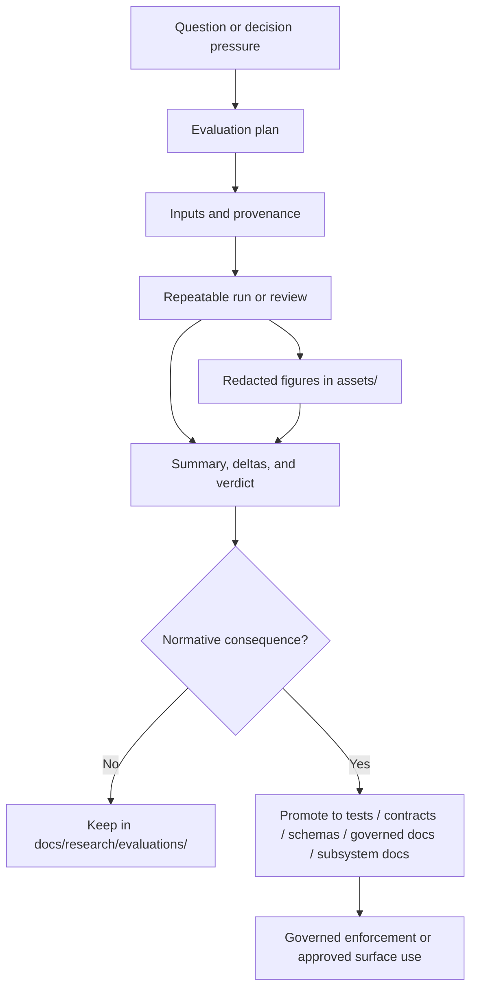

<a id="top"></a>

# KFM Research — Evaluations README

Repeatable evaluation lane for benchmarks, QA summaries, result deltas, and reproducible comparison notes that inform Kansas Frontier Matrix without becoming governed truth by default.

> Status: experimental  
> Owners: `NEEDS VERIFICATION`  
> Source posture: directory README aligned to the current branch-visible `docs/research/README.md` and March 2026 KFM doctrine  
> Repo role: subtree README for `docs/research/evaluations/`  
> Quick jumps: [Scope](#scope) · [Repo fit](#repo-fit) · [Accepted inputs](#accepted-inputs) · [Exclusions](#exclusions) · [Directory tree](#directory-tree) · [Quickstart](#quickstart) · [Usage](#usage) · [Diagram](#diagram) · [Evaluation packet](#evaluation-packet) · [Task list and definition of done](#task-list-and-definition-of-done) · [FAQ](#faq) · [Appendix](#appendix)

[](#scope)
[](#usage)
[](#scope)
[](#usage)

> [!IMPORTANT]
> `docs/research/evaluations/` is evidence-led but non-normative. Material here may support go/no-go judgment, benchmarking, regression review, or trust-surface QA, but it does **not** become KFM policy, contract law, runtime truth, or public narrative until it is promoted into the appropriate governed destination.

## Scope

`docs/research/evaluations/` is the repeatable-measurement lane inside `docs/research/`.

Use it when the work is provenance-linked, rerunnable, and meant to support a judgment call: keep, change, promote, block, rollback, or investigate further. This lane exists so KFM can compare behavior without quietly turning provisional findings into governed truth.

In KFM, evaluation is broader than “did a model score well?” A strong evaluation here can cover:

- benchmark deltas
- UI and shell QA
- citation-negative or evidence-path failures
- stale-scope or partial-coverage behavior
- corroboration-conflict handling
- finite `ANSWER` / `ABSTAIN` / `DENY` / `ERROR` outcomes
- release-readiness or rollback-facing checks

### What makes an evaluation belong here

An evaluation belongs in this lane when most of the following are true:

- the question is explicit
- the subject under test is named
- the method can be rerun or rechecked
- the inputs are identifiable
- the outputs can be compared across runs, versions, releases, or options
- the note ends with a verdict or next action
- the work is still exploratory or documentary rather than already enforced elsewhere

## Repo fit

This README should make the lane legible without pretending the lane is more mature than the visible branch proves.

| Item | Value |
|---|---|
| Path | `docs/research/evaluations/README.md` |
| Upstream | [`../README.md`](../README.md) · [`../../README.md`](../../README.md) |
| Adjacent lane | [`../source_summaries/README.md`](../source_summaries/README.md) |
| Downstream | [`./assets/README.md`](./assets/README.md) |
| Promotion destinations | [`../../../tests/`](../../../tests/) · [`../../../contracts/`](../../../contracts/) · [`../../../schemas/`](../../../schemas/) · [`../../../policy/`](../../../policy/) · governed docs under [`../../`](../../) · owning subsystem docs or code surface |
| Current branch-visible structure | `README.md` plus `assets/README.md` |
| Why this lane exists | Keep repeatable evaluation work separate from drafts, source summaries, and governed production surfaces |

## Accepted inputs

Put material here when it is evaluation-shaped rather than purely speculative.

Accepted here:

- benchmark notes with pinned inputs and run conditions
- QA summaries for map, dossier, compare, export, review, or adjacent trust surfaces
- regression writeups with before/after deltas
- trust-behavior evaluations for abstention, denial, stale-state, conflict, or evidence reconstruction
- comparison matrices for tools, approaches, or implementation options
- reproducible evaluation notes tied to releases, candidate builds, datasets, fixtures, or known source sets
- redacted charts, screenshots, and small static figures stored under [`./assets/`](./assets/README.md)
- “what changed, what did not, what to do next” writeups that stay explicit about limits

## Exclusions

Do **not** use this lane as the authoritative home for any of the following:

- machine-enforced schemas, route contracts, DTO definitions, or controlled vocabularies  
  → keep in [`../../../contracts/`](../../../contracts/) and [`../../../schemas/`](../../../schemas/)
- policy bundles, decision tests, or deny-by-default enforcement logic  
  → keep in [`../../../policy/`](../../../policy/)
- canonical data artifacts, source descriptors, receipts, manifests, or release outputs  
  → keep under [`../../../data/`](../../../data/) or the owning artifact home
- runtime code, UI implementation, workers, or service logic  
  → keep in the owning code surface
- production runbooks or operator procedures  
  → keep under governed docs or runbook destinations
- raw datasets, large copyrighted copies, or bulk attachments  
  → keep those out of this docs lane
- free-form brainstorming without a repeatable method  
  → use a research draft or design spike instead
- secrets, credentials, tokens, private communications, or precise sensitive locations  
  → never store those here

## Evidence labels

Use the same truth-discipline tone that appears elsewhere in KFM’s README family.

| Label | Use in this lane |
|---|---|
| `CONFIRMED` | Directly measured, directly quoted, or directly supported by the cited project/source evidence |
| `INFERRED` | Reasoned interpretation drawn from the recorded evidence |
| `PROPOSED` | Recommended next step, improvement, or follow-on action |
| `UNKNOWN` | Not established strongly enough to present as current reality |
| `NEEDS VERIFICATION` | Exact repo detail, owner, threshold, environment, or linkage should be checked before relying on it |

## Directory tree

Current branch-visible structure for this lane:

```text
docs/research/evaluations/
├── README.md
└── assets/
    └── README.md
```

> [!NOTE]
> Keep this lane shallow until repeated need proves otherwise. Add structure because it improves repeatability or discoverability, not because it looks tidy in the abstract.

## Quickstart

1. Create or update an evaluation note in `docs/research/evaluations/`.
2. State the question first: what is being compared, verified, or challenged?
3. Name the subject under test: release, build, route family, surface, dataset, component, or workflow.
4. Record inputs, method, environment, and comparison basis clearly enough that someone else can rerun or review the work.
5. Put only small, redacted supporting figures in [`./assets/`](./assets/README.md).
6. End with a verdict: keep, change, promote, block, rollback, or re-run.
7. If the result becomes normative, promote the rule, test, contract, schema, or subsystem behavior to its governed home.

## Usage

### Choose the right evaluation family

| Evaluation family | Best for | Typical outputs | Do not confuse it with |
|---|---|---|---|
| Benchmark / performance | Throughput, latency, memory, tile load, build time, ingest cost, render cost | delta table, chart, short verdict, rerun conditions | architecture doctrine or performance folklore |
| Behavior / QA | Surface correctness, regressions, export behavior, comparison flow, drawer behavior | pass/fail matrix, screenshots, case notes | production how-to docs |
| Trust / negative-path | citation-negative cases, stale scope, partial coverage, corroboration conflict, abstain / deny / error behavior | outcome matrix, evidence-path notes, failure classification | model leaderboard summaries |
| Comparison / trade study | Option A vs option B, tool choices, workflow choices, implementation alternatives | decision matrix, rationale, next-action recommendation | final standards or ADR text |
| Release-readiness / go-no-go | pre-publish, pre-merge, pre-rollout, correction or rollback confidence | gate summary, risk note, release-facing recommendation | actual release manifest or proof pack |

### Keep the note reproducible

A good evaluation note should make it obvious how the result was reached.

Record at least:

- the decision pressure or question
- the subject under test
- the comparison basis
- the input sources or fixtures
- the method or procedure
- the results
- the interpretation
- the verdict
- the next action or promotion target

### Promote when the outcome becomes normative

Exploratory evaluation can live here. Required behavior cannot stay here forever.

| If the evaluation result becomes… | Promote it to… |
|---|---|
| an executable invariant or regression rule | [`../../../tests/`](../../../tests/) and the owning subsystem |
| a schema or contract obligation | [`../../../contracts/`](../../../contracts/) and/or [`../../../schemas/`](../../../schemas/) |
| a policy or review rule | [`../../../policy/`](../../../policy/) plus the governed documentation surface |
| a UI or product requirement | the owning subsystem docs and implementation review |
| a release or rollback requirement | governed docs / runbooks / release-facing evidence |
| a public narrative or runtime trust claim | the approved governed destination before any outward use |

### Use `./assets/` intentionally

`./assets/` is for static supporting visuals that make the evaluation easier to inspect:

- charts
- screenshots
- small exported tables
- redacted diagrams
- figure variants used by the evaluation note

Keep assets named, scoped, and easy to delete or replace when the evaluation changes.

## Diagram



[Back to top](#top)

## Evaluation packet

Use this as a **starter packet** for a good evaluation note. It is guidance for this lane, not a machine-enforced schema.

| Packet element | Minimum contents | Why KFM cares |
|---|---|---|
| Goal | What decision, risk, or comparison this note addresses | Prevents shapeless “research for research’s sake” |
| Subject under test | Component, surface, route family, release, dataset, or workflow | Keeps the note tied to something inspectable |
| Inputs | Versions, builds, datasets, fixtures, documents, screenshots, or source refs | Makes reruns and audits possible |
| Method | Steps, environment, assumptions, and comparison basis | Lets others check the conclusion |
| Results | Numbers, deltas, failures, screenshots, or case outcomes | Keeps the note grounded |
| Interpretation | What the results mean and what they do **not** mean | Separates observation from inference |
| Verdict | keep / change / promote / block / rollback / re-run | Supports go/no-go judgment |
| Sensitivity notes | redaction, rights, withholding, or exposure concerns | Prevents accidental disclosure |
| Promotion target | tests, contracts, schemas, governed docs, subsystem docs, or none | Makes the next step explicit |

## Task list and definition of done

Use this checklist when opening or reviewing an evaluation note.

- [ ] The question or decision pressure is explicit.
- [ ] The subject under test is named.
- [ ] Inputs and sources are identifiable.
- [ ] The method is rerunnable or reviewable.
- [ ] Results are recorded as observations, not just impressions.
- [ ] Interpretation is clearly separated from the measured or observed result.
- [ ] Supporting figures are stored in `./assets/` only when they add real inspection value.
- [ ] Secrets, credentials, copyrighted bulk copies, or precise sensitive locations are absent.
- [ ] The note ends with a verdict or next action.
- [ ] A promotion destination is named if the result becomes normative.

A note in this lane is “done enough” when it is reproducible, bounded, inspectable, and honest about its uncertainty.

## FAQ

### Is `docs/research/evaluations/` authoritative?

No. This lane is intentionally non-normative until promotion.

### Where do raw datasets go?

Not here. Keep raw or derived data artifacts under the owning `data/` path or the correct artifact surface.

### What belongs in `./assets/`?

Small, static, review-friendly support files: charts, screenshots, figure exports, or redacted visual comparisons.

### Can an evaluation note directly define Focus Mode, Story, or API behavior?

No. It can inform those decisions, but the actual rule must be promoted first.

### When should an evaluation become a test?

When the result stops being merely informative and becomes a required invariant, regression guard, or must-pass behavior.

### Can I paste long copyrighted excerpts into an evaluation?

No. Summarize, cite, and keep only the minimum lawful excerpt needed for review.

[Back to top](#top)

## Appendix

<details>
<summary><strong>Starter evaluation note skeleton (PROPOSED)</strong></summary>

```md
# <evaluation title>

<one-line purpose>

## Goal
What decision, risk, or comparison is this note meant to support?

## Status
- CONFIRMED:
- INFERRED:
- PROPOSED:
- UNKNOWN / NEEDS VERIFICATION:

## Subject under test
Name the surface, release, component, dataset, route family, or workflow.

## Inputs
List source documents, fixtures, datasets, screenshots, commits, builds, or environment notes.

## Method
Describe the steps clearly enough to rerun or review.

## Results
Record numbers, observations, deltas, pass/fail cases, or screenshots.

## Interpretation
Explain what the results mean and what they do not establish.

## Verdict
Choose one:
- keep
- change
- promote
- block
- rollback
- re-run

## Sensitivity and rights notes
State any redaction, withholding, or exposure concerns.

## Promotion target
If this becomes normative, where should it move?
```

</details>

<details>
<summary><strong>Suggested naming and asset guidance (PROPOSED)</strong></summary>

Use stable, readable names that keep the lane scannable.

```text
docs/research/evaluations/
├── <topic>-evaluation.md
├── <surface>-qa-summary.md
├── <release>-go-no-go.md
└── assets/
    ├── <topic>-chart-01.png
    ├── <topic>-delta-table-01.png
    └── <surface>-qa-01.png
```

Prefer concise, descriptive slugs over deep subfolder nesting. If the lane eventually needs more structure, add it because repeated use proves the need.

</details>

[Back to top](#top)