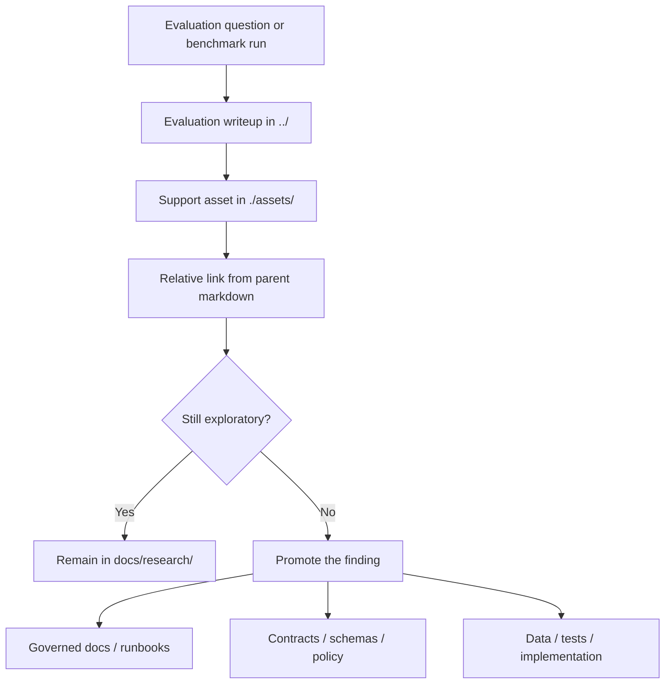

<!-- [KFM_META_BLOCK_V2]
doc_id: kfm://doc/NEEDS-VERIFICATION
title: KFM Research Evaluation Assets
type: standard
version: v1
status: published
owners: @bartytime4life
created: 2025-12-20
updated: 2026-03-25
policy_label: public
related: [docs/research/README.md, docs/research/evaluations/README.md, docs/README.md, .github/CODEOWNERS]
tags: [kfm, research, evaluations, assets]
notes: [doc_id still needs registry verification; created/updated verified from public GitHub history; lifecycle label should be reconciled with any internal document registry if one exists]
[/KFM_META_BLOCK_V2] -->

# KFM Research Evaluation Assets

Support lane for figures, screenshots, and other local files referenced by evaluation notes in `docs/research/evaluations/`.

> **Status:** experimental  
> **Owners:** `@bartytime4life`  
> **Source posture:** current public branch-visible directory README aligned to `docs/research/README.md`, `docs/research/evaluations/README.md`, and March 2026 KFM doctrine  
> **Repo role:** support-lane README for `docs/research/evaluations/assets/`  
>       
> **Quick jumps:** [Scope](#scope) · [Evidence labels](#evidence-labels-used-in-this-readme) · [Repo fit](#repo-fit) · [Accepted inputs](#accepted-inputs) · [Exclusions](#exclusions) · [Directory tree](#directory-tree) · [Quickstart](#quickstart) · [Usage](#usage) · [Diagram](#diagram) · [Tables](#tables) · [Task list / definition of done](#task-list--definition-of-done) · [FAQ](#faq) · [Appendix](#appendix)

> [!IMPORTANT]
> `docs/research/` is an **experimental, non-normative** workspace until material is reviewed and promoted.
> Files in `docs/research/evaluations/assets/` may support an evaluation, but they do **not** become governed policy, canonical data, schema truth, release evidence, or runtime truth merely by existing here.

## Scope

`docs/research/evaluations/assets/` is the local support lane for static files used by markdown in `../`.

Its job is to keep evaluation-support media close to the writeups they explain, while keeping governed data, contracts, policy, and production procedures in their owning lanes.

## Evidence labels used in this README

| Label | Meaning here |
|---|---|
| **CONFIRMED** | Directly supported by the current public repo tree, adjacent research READMEs, or attached KFM doctrine |
| **INFERRED** | Conservative interpretation that follows from those sources without asserting hidden implementation |
| **PROPOSED** | Working guidance for this lane that fits KFM doctrine but is not claimed as machine-enforced behavior |
| **UNKNOWN** | Not supported strongly enough to present as current repo or platform fact |
| **NEEDS VERIFICATION** | Internal registry values, ownership metadata beyond public files, or private platform settings that were not directly confirmed |

### Current branch signal

| Signal | Status | What it means |
|---|---|---|
| Path exists on the public `main` branch | **CONFIRMED** | this is a live repo path, not a hypothetical lane |
| Current visible child inventory | **CONFIRMED** | `README.md` is the only currently visible file in this directory |
| Parent lane role | **CONFIRMED** | `docs/research/evaluations/` is the repeatable-measurement lane inside the broader research subtree |
| Promotion boundary | **CONFIRMED** | research content remains non-normative until promoted |

> [!NOTE]
> The current branch still shows this directory as scaffold-level.
> This README turns the lane into a usable directory contract without pretending an asset inventory already exists.

## Repo fit

This file is the directory README for the evaluation-assets lane.

| Item | Value |
|---|---|
| Path | `docs/research/evaluations/assets/README.md` |
| Directory role | store local support files referenced by evaluation markdown in `../` |
| Upstream | [`../README.md`](../README.md) · [`../../README.md`](../../README.md) · [`../../../README.md`](../../../README.md) · [`../../../../README.md`](../../../../README.md) |
| Related governed lanes | [`../../../../data/`](../../../../data/) · [`../../../../contracts/`](../../../../contracts/) · [`../../../../schemas/`](../../../../schemas/) · [`../../../../policy/`](../../../../policy/) · [`../../../runbooks/`](../../../runbooks/) |
| Downstream | local asset files that are directly referenced from evaluation notes |
| Current branch signal | scaffold directory with `README.md` currently visible; local asset inventory beyond this file is still empty or not yet added |
| Why this lane exists | keep evaluation prose in `../` and supporting media here, instead of blending both into one flat folder or misfiling assets as data |

## Accepted inputs

Put these here when they are **support files** for evaluation markdown and not the primary governed artifact:

- rendered charts, plots, and comparison figures
- screenshots, cropped UI captures, redacted diffs, and visual QA snapshots
- local map images, legends, or small figure panels used to explain an evaluation result
- small static appendix files that are purely evaluation-supporting and have clear rights/sensitivity posture
- lightweight exported tables or rubric images when the parent evaluation needs a fixed visual artifact

> [!TIP]
> Keep the **judgment, interpretation, method, and provenance narrative** in the parent evaluation markdown.
> Keep only the support file itself here.

## Exclusions

These do **not** belong in this directory:

| Keep out of `./assets/` | Why | Put it here instead |
|---|---|---|
| raw datasets, canonical records, catalog artifacts, receipts, or manifests | this lane is docs support, not governed data storage | [`../../../../data/`](../../../../data/) |
| schemas, OpenAPI files, JSON contracts, vocabularies | machine-readable truth should not be hidden in docs assets | [`../../../../contracts/`](../../../../contracts/) or [`../../../../schemas/`](../../../../schemas/) |
| policy bundles, rule files, fixtures, decision-code registries | policy must stay explicit and testable in its own lane | [`../../../../policy/`](../../../../policy/) |
| notebooks, scripts, or reproducibility code | code belongs with code, not static doc assets | code / tooling lanes, or the parent evaluation writeup when only short inline snippets are needed |
| release evidence, proof packs, rollback artifacts | release-bearing evidence should not be parked in research docs | governed release / evidence destinations |
| secrets, credentials, private communications, or restricted location disclosures | KFM fails closed on trust and sensitivity | secure secret management, quarantine, or redacted/generalized handling |
| large copyrighted source copies or primary-source dumps | research assets should not become an informal mirror of material with unresolved rights | structured summary in `../../source_summaries/` or a governed data lane after review |
| public-facing story content or Focus Mode truth on its own | research remains non-normative until promoted | governed docs, approved story paths, or other promoted surfaces |

## Directory tree

```text
docs/research/evaluations/
├── README.md
└── assets/
    ├── README.md
    └── <evaluation-support files live here>
```

A good rule of thumb:

- **parent directory (`../`)** = the evaluation writeup
- **this directory (`./`)** = the files that the writeup points at
- **governed top-level lanes** = anything that changes contracts, data truth, policy, or release state

## Quickstart

1. Create or update the evaluation markdown in `../`.
2. Add only the local support files that the evaluation actually references.
3. Link assets with repo-relative paths from the parent markdown.
4. Keep method, provenance, and caveats in the evaluation note, not buried in filenames.
5. Promote the finding before treating it as governed system behavior.

### Minimal working pattern

```bash
# from repo root
mkdir -p docs/research/evaluations/assets

# add a support file
cp /path/to/local-output.png docs/research/evaluations/assets/<asset-name>.png

# then reference it from a markdown file in docs/research/evaluations/
```

```md


_Figure: explain what this asset shows, which evaluation it supports, and any caveat a reviewer needs._
```

## Usage

### Keep ownership obvious

A reader should be able to answer three questions quickly:

1. **Which evaluation note owns this asset?**
2. **What does the asset support?**
3. **Would anything important be lost if the asset were removed?**

If the answer to the third question is “yes, because the asset is actually the main evidence, dataset, or contract,” it probably belongs somewhere else.

### Keep assets subordinate to the writeup

**CONFIRMED boundary:** evaluation notes live in `docs/research/evaluations/`; research material remains non-normative until promoted.

**PROPOSED working convention:** keep each asset set tightly scoped to the evaluation that cites it.
Do not turn this directory into a generic image dump, scratch space, or quasi-dataset mirror.

### Prefer stable, review-friendly files

When there is a choice:

- prefer files that render well in GitHub
- prefer names that stay understandable in diffs and review threads
- prefer redacted or generalized visuals over precise sensitive captures
- prefer one clear figure over many near-duplicates
- prefer linking from the parent evaluation note over explaining the asset only in this README

[Back to top](#kfm-research-evaluation-assets)

## Diagram



## Tables

### Placement matrix

| Artifact type | Belongs here? | Typical examples | Better destination when it becomes primary |
|---|---|---|---|
| support figure | **Yes** | chart, plot, panel figure, rendered map image | parent evaluation note still owns the interpretation |
| screenshot / QA capture | **Yes** | UI capture, diff snapshot, annotated review image | governed UI docs or issue-tracking context if it stops being evaluation-local |
| small static appendix file | **Sometimes** | public-safe PDF appendix, rubric sheet, supporting handout | governed docs or data lane if it becomes reusable beyond one evaluation |
| dataset or extract | **No** | CSV, GeoJSON, raster, catalog item | `data/` |
| schema / contract | **No** | JSON Schema, OpenAPI, vocab registry | `contracts/` / `schemas/` |
| policy artifact | **No** | `.rego`, fixtures, reason-code files | `policy/` |
| release or proof object | **No** | manifest, receipt, attestation, correction record | governed release / evidence destinations |

### Review matrix

| Check | Why it matters |
|---|---|
| asset is referenced by a parent evaluation note | prevents orphaned files |
| alt text / caption exists in the parent markdown | keeps the asset interpretable |
| no secrets or sensitive exact-location leakage | preserves KFM trust posture |
| rights and reuse posture are clear enough for the repo | avoids quiet copyright drift |
| file is support material, not hidden canonical data | keeps lane boundaries legible |
| duplication is minimal | reduces review noise and repo bloat |

## Task list / definition of done

An asset addition to this directory is in good shape when:

- [ ] the parent evaluation note exists or is part of the same change
- [ ] the asset is referenced with a working relative path
- [ ] the parent note explains what the asset shows and why it matters
- [ ] the asset does not smuggle in raw governed data, policy, or contract truth
- [ ] rights, sensitivity, and redaction concerns were checked
- [ ] the asset does not expose secrets, tokens, or precise restricted-site details
- [ ] filenames are understandable enough for review
- [ ] near-duplicate or obsolete support files were removed
- [ ] promotion was considered if the result is starting to define system behavior

[Back to top](#kfm-research-evaluation-assets)

## FAQ

### Is this where the actual evaluation writeup belongs?

No.
Keep the evaluation markdown in `../`.
This directory is only for support files that the evaluation note points to.

### Can I put raw CSV, GeoJSON, raster exports, or STAC/DCAT/PROV files here?

No.
Those are governed data or catalog surfaces, not local docs assets.

### Can these assets be treated as Focus Mode or public-story truth directly?

No.
Research remains exploratory until promoted.
A useful image here can support a later governed artifact, but it should not become runtime truth on its own.

### What if an asset includes a sensitive location or restricted detail?

Do not commit it in a public-safe form without generalization, redaction, or a different handling lane.
When unsure, fail closed and escalate the question before merge.

## Appendix

<details>
<summary><strong>PROPOSED naming and hygiene conventions</strong></summary>

Use these as working guidance unless a narrower lane-specific rule is introduced later:

- prefer lowercase names with hyphens
- make the filename describe the evaluation topic and artifact role, not just `image1` or `final-final`
- keep one parent evaluation note responsible for the assets it cites
- avoid silently reusing the same file for different claims without updating captions
- remove orphaned support files when the parent evaluation changes or disappears
- prefer SVG for vector-friendly charts when practical
- prefer PNG or WebP for screenshots and raster figures
- keep large primary-source attachments out of this lane unless rights and scope are clearly settled

Illustrative patterns:

```text
<evaluation-slug>-figure-01.svg
<evaluation-slug>-latency-comparison.png
<evaluation-slug>-ui-review-capture.webp
<evaluation-slug>-appendix-a.pdf
```

</details>

[Back to top](#kfm-research-evaluation-assets)
