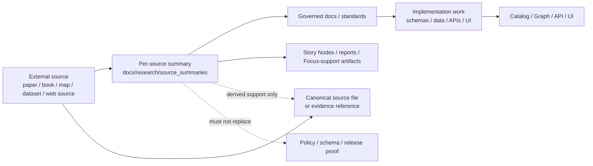

<!-- [KFM_META_BLOCK_V2]
doc_id: kfm://doc/NEEDS-VERIFICATION
title: Research Source Summaries
type: standard
version: v1
status: draft
owners: NEEDS VERIFICATION
created: YYYY-MM-DD
updated: YYYY-MM-DD
policy_label: NEEDS VERIFICATION
related: [NEEDS VERIFICATION]
tags: [kfm, research, source-summaries]
notes: [Root README path supplied by request; attached source-summary drafts support a by_type subtree and child guides, but repo-local existence, owners, dates, and adjacent canonical paths require direct repo verification.]
[/KFM_META_BLOCK_V2] -->

# Research Source Summaries

Derived, evidence-linked working summaries for external sources used in KFM research, design, and implementation planning.

> [!IMPORTANT]
> **Status:** experimental  
> **Owners:** NEEDS VERIFICATION  
> **Badges:**  
> 
> 
> 
>   
> **Quick jumps:** [Scope](#scope) · [Repo fit](#repo-fit) · [Inputs](#inputs) · [Exclusions](#exclusions) · [Directory tree](#directory-tree) · [Quickstart](#quickstart) · [Usage](#usage) · [Diagram](#diagram) · [Tables](#tables) · [Task list](#task-list) · [FAQ](#faq) · [Appendix](#appendix)

> [!NOTE]
> This README is intentionally source-bounded. The target path `docs/research/source_summaries/README.md` was supplied in the request, but the mounted repo tree was not directly visible in this session. The strongest structural cue in the attached corpus is a `by_type/` subtree with child guides for source kinds such as books, maps, and web. Treat those paths as **INFERRED / NEEDS VERIFICATION** until checked in the repo.
>
> Attached March 2026 KFM doctrine also warns against hardening older file references into project fact without direct repo verification. Any neighboring path mentioned below is therefore a reviewable candidate, not a settled repo claim.

---

## Scope

This area is for **human-readable, per-source Markdown summaries**.

Its job is to help maintainers answer five practical questions quickly:

1. What is this source?
2. Why does it matter to KFM?
3. What does it establish?
4. What does it **not** establish?
5. Where should a reviewer go next?

These summaries are **research artifacts**. They do not directly change runtime behavior, but they can justify and motivate later changes to governed docs, schemas, pipelines, ontology, APIs, UI patterns, and story work.

### Root README vs. child guides

When the stronger `by_type/` pattern is present, this area should behave as a small hierarchy:

| Layer | Role | Typical content |
| --- | --- | --- |
| **This README** | Area charter | Scope, boundaries, review rules, maintenance expectations |
| **`by_type/README.md`** | Organizational guide | Default conventions shared across source types |
| **Type README** | Source-kind specifics | Extra rules for books, maps, web, papers, datasets, standards, and related source families |
| **Leaf summary file** | One source at a time | Citation, takeaways, KFM relevance, constraints, caveats, and links |

### Directory truth posture

| Label | Use inside this area | Do not use it for |
| --- | --- | --- |
| **CONFIRMED** | Claims directly supported by the summarized source or directly verified project evidence | Guessing current repo shape, runtime behavior, or enforcement |
| **INFERRED** | Small, bounded synthesis that connects a source to KFM doctrine or uses an attached draft pattern to suggest structure | Presenting unverified file paths as settled repo fact |
| **PROPOSED** | Recommended organization, follow-on work, or adoption guidance | Smuggling target-state design in as current implementation |
| **UNKNOWN** | Gaps the current session did not verify | Quietly flattening uncertainty |
| **NEEDS VERIFICATION** | Repo-local owners, dates, adjacent docs, path existence, automation, and current canonical filenames | Cosmetic TODO noise with no review value |

### What “good” looks like here

A strong source summary is:

- small enough to scan quickly
- specific enough to reuse
- honest about limits
- explicit about rights, caveats, and uncertainty
- easy to trace back to the upstream source
- clear about which part of KFM it informs

[Back to top](#research-source-summaries)

---

## Repo fit

| Field | Current draft |
| --- | --- |
| **Path** | `docs/research/source_summaries/README.md` |
| **Role** | Root charter and maintenance guide for source-summary docs |
| **Upstream** | **NEEDS VERIFICATION** — likely a research index under `docs/research/` |
| **Downstream** | **INFERRED / NEEDS VERIFICATION** — likely `by_type/` guides, per-source leaf summaries, Story Node/report consumers, and governed docs that reuse extracted constraints |
| **Boundary** | Derived research layer only; this area must not become the canonical home for source binaries, policy, schemas, release manifests, or runtime truth |

### Likely adjacent artifacts to verify

These are the strongest neighboring candidates visible in the attached corpus, but they should be linked only after repo inspection confirms them.

| Candidate path | Why it likely matters | Status |
| --- | --- | --- |
| `docs/research/source_summaries/by_type/README.md` | Parent organizational guide for type-based source-summary structure | **INFERRED / NEEDS VERIFICATION** |
| `docs/templates/TEMPLATE__KFM_UNIVERSAL_DOC.md` | Default governed template referenced by attached source-summary drafts | **INFERRED / NEEDS VERIFICATION** |
| `docs/templates/TEMPLATE__STORY_NODE_V3.md` | Narrative template referenced when a source feeds story work | **INFERRED / NEEDS VERIFICATION** |
| `docs/templates/TEMPLATE__API_CONTRACT_EXTENSION.md` | Referenced in attached drafts when extracted constraints imply API/contract work | **INFERRED / NEEDS VERIFICATION** |
| `docs/reports/story_nodes/` | Likely downstream home for narrative consumers of some summaries | **INFERRED / NEEDS VERIFICATION** |
| Current canonical master/guide path | Attached draft materials reference older `MASTER_GUIDE_v12` paths; current canonical equivalent requires repo check | **NEEDS VERIFICATION** |

> [!NOTE]
> Attached source-summary drafts reference older guide/template paths. Until the repo is inspected directly, do not treat those older references as the current canonical doc map.

[Back to top](#research-source-summaries)

---

## Inputs

### Accepted inputs

| Input | Required | Notes |
| --- | --- | --- |
| One Markdown file per source or source edition | Yes | Prefer one source, one edition, one summary |
| Exact source identity | Yes | Title, author/editor/org, year/edition, and access note |
| Citation or identifier | Yes | DOI, URL, ISBN, archive ID, or in-repo source location when applicable |
| Source type | Yes | Book, map, paper, dataset, web source, standard, archive, talk, etc. |
| Key takeaways | Yes | Compact, source-grounded bullets or short paragraphs |
| KFM relevance | Yes | Which lane, pipeline stage, component, or design pressure it informs |
| Claims / constraints | Yes | Extract reusable requirements, cautions, assumptions, or limitations clearly |
| What the source does **not** establish | Yes | Make limits visible rather than implied |
| Rights / reuse / sensitivity note | Recommended | Especially important for maps, archival scans, oral histories, and sensitive locations |
| Open questions | Recommended | Preserve unresolved issues instead of smoothing them over |

### Minimum per-source snapshot

| Field | Why it matters |
| --- | --- |
| Source type | Prevents mixing books, maps, papers, sites, standards, and datasets without context |
| Edition / date | Prevents silent version drift |
| Creator / steward | Clarifies provenance and citation |
| Access note | Helps a reviewer find the source again |
| KFM lanes / components | Makes reuse easier across Catalog / Graph / API / UI / Story |
| Rights / sensitivity posture | Prevents accidental over-sharing or misuse |
| Truth posture | Keeps certainty proportionate to evidence |

### Preferred section set for a leaf summary

| Section | Purpose | Required |
| --- | --- | --- |
| `Citation / Snapshot` | Fast source identity and access metadata | Yes |
| `Key takeaways` | Compact extracted value | Yes |
| `KFM relevance` | Connects the source to actual KFM work | Yes |
| `Claims / constraints` | Pulls reusable implications into view | Yes |
| `What this source does not establish` | Keeps limits visible | Yes |
| `Rights, caveats, and sensitivity` | Prevents governance drift | Yes |
| `Open questions` | Preserves follow-up work | Recommended |
| `Links` | DOI/URL, in-repo source path if present, related docs | Yes |

[Back to top](#research-source-summaries)

---

## Exclusions

This area should **not** become the dumping ground for every research artifact.

| Not here | Put it where it belongs instead | Why |
| --- | --- | --- |
| Raw source files (PDFs, scans, datasets, media) | Source storage / evidence references / canonical data lanes | A summary is not the source |
| STAC / DCAT / PROV artifacts | Authoritative catalog / provenance homes | Machine-checkable metadata must stay stronger than prose |
| Policy bundles, decision envelopes, obligation/reason registries | Authoritative policy home | Policy meaning must remain executable and reviewable |
| JSON Schemas / API contracts | Contract/schema home | Summary prose must not compete with validation artifacts |
| Release manifests, proof packs, correction notices | Release / correction / runbook homes | Publication governance must stay operational |
| Story Nodes or Focus narratives | Story/report homes | Narrative work is downstream, not the summary itself |
| Broad multi-source synthesis docs | Dossiers / ADRs / architecture docs | This area is **per-source**, not cross-source doctrine |
| Unsourced notes or impressionistic takeaways | Drafts / scratch notes, or discard | KFM prefers cite-or-abstain over unsupported prose |

> [!WARNING]
> If a summary starts behaving like canonical metadata, policy, release state, or runtime truth, move that content out. This area is for **navigation and interpretation**, not sovereign truth.

[Back to top](#research-source-summaries)

---

## Directory tree

**Preferred shape — source-supported, repo-local existence NEEDS VERIFICATION**

```text
docs/
└── research/
    └── source_summaries/
        ├── README.md
        └── by_type/
            ├── README.md
            ├── books/
            │   ├── README.md
            │   └── <year>-<first-author-lastname>-<short-title>.md
            ├── maps/
            │   ├── README.md
            │   └── <year>-<first-author-lastname>-<short-title>.md
            ├── web/
            │   ├── README.md
            │   └── <year>-<first-author-lastname>-<short-title>.md
            ├── papers/
            │   └── <year>-<first-author-lastname>-<short-title>.md
            └── <other-type>/
                └── <year>-<first-author-lastname>-<short-title>.md
```

### Source-type folders

| Type folder | Use for | Current evidence status |
| --- | --- | --- |
| `books/` | Monographs, edited volumes, manuals treated primarily as books | Source-supported |
| `maps/` | Historic maps, atlas plates, scanned sheets, georeferenced map products | Source-supported |
| `web/` | Websites, web documentation, online references | Source-supported |
| `papers/` | Journal and conference papers | **INFERRED** from parent draft examples |
| `datasets/` | Dataset-level external sources described as research references rather than stored data | **INFERRED** from parent draft scope |
| `standards/` | Specs, standards, and formal reference materials | **INFERRED** from parent draft scope |

### Naming guidance

| Pattern | Use when |
| --- | --- |
| `<year>-<first-author-lastname>-<short-title>.md` | Default slug pattern for a single source |
| `<year>-<org>-<short-title>.md` | More natural than author-lastname for organizational sources |
| `<year>-<maker>-<map-title>.md` | Acceptable for map/cartographic sources when creator naming reads better |
| Avoid | `notes.md`, `random.md`, `summary-final-final.md`, and slugs with no date or creator cue |

[Back to top](#research-source-summaries)

---

## Quickstart

1. Pick the correct source-type folder under `by_type/` when that subtree exists.
2. Create **one summary file per source** using a stable slug.
3. Record the exact citation, identifier, and access note first.
4. Add key takeaways, KFM relevance, and extracted claims / constraints.
5. Separate what the source supports from what it does **not** support.
6. Add rights, caveats, and sensitivity notes before calling the file done.
7. If the source affects story or Focus work, make sure the downstream narrative references the source directly or through an evidence-bearing artifact.

### Quick review rule

Before you commit a new summary, ask:

- Can a reader tell **which exact source** this file refers to?
- Can they tell **why KFM cares**?
- Can they see **where certainty stops**?
- Could they find the upstream source again without guesswork?

[Back to top](#research-source-summaries)

---

## Usage

### How this area should be used

Use source summaries to:

- orient a maintainer before they open a long source
- reduce duplicate re-reading of the same external material
- keep reusable facts, caveats, and terminology close at hand
- support later synthesis without flattening uncertainty

Do **not** use source summaries to:

- claim current implementation
- replace source-specific citation work
- launder speculation into doctrine
- hide rights or sensitivity issues behind polished prose

### Research-artifact rule

Source summaries are part of the **research and rationale layer**. They can motivate later changes to governed docs, schemas, pipelines, ontology, APIs, UI patterns, and story work, but they are not themselves the stronger authority for those artifacts.

### AI support and guardrails

AI assistance is useful here only when it stays subordinate to source truth.

| Allowed | Not allowed |
| --- | --- |
| Summarization | Policy generation |
| Structure extraction | Inferring sensitive locations |
| Translation | Fabricating missing geospatial metadata |
| Keyword indexing | Inventing unsupported claims or identifiers |

### One source, one file, one center of gravity

Prefer this rule unless there is a strong reason not to:

- one file per source
- one source edition per file
- one primary name for that source
- one clearly stated scope

That keeps search, review, and later refactoring sane.

[Back to top](#research-source-summaries)

---

## Diagram



### Reading the diagram

The summary sits in a useful but subordinate position:

- it helps people navigate evidence
- it may feed later design and story work
- it must **not** bypass canonical evidence, machine-readable metadata, policy, or release logic

[Back to top](#research-source-summaries)

---

## Tables

### Area responsibility matrix

| Layer | Main job | Truth status |
| --- | --- | --- |
| Root README | Set area boundaries and maintenance rules | Derived guidance |
| `by_type/README.md` | Provide default organization and cross-type conventions | Derived guidance |
| Type README | Adapt rules to a source family | Derived guidance |
| Leaf summary | Capture one external source and its KFM relevance | Derived, evidence-linked |
| STAC / DCAT / PROV / schemas / manifests | Carry authoritative machine-readable truth | Stronger than summaries |

### Summary maturity levels

| Maturity | Meaning | Expected bar |
| --- | --- | --- |
| `seed` | Source identity and purpose captured | Enough to prevent rediscovery work |
| `working` | Key takeaways, caveats, and KFM relevance captured | Reusable by maintainers |
| `reviewed` | Checked for drift, duplication, and unsupported claims | Safe to cite from adjacent docs |
| `stale` | Source or summary likely needs re-checking | Visible, but not silently trusted |

### Suggested registry row for this area

| Source | Type | Edition / date | KFM relevance | Summary file | Status |
| --- | --- | --- | --- | --- | --- |
| `<source title>` | book / map / paper / web / dataset | `YYYY` | Catalog / Graph / API / UI / Story / lane | `<slug>.md` | seed / working / reviewed / stale |

[Back to top](#research-source-summaries)

---

## Task list

### Definition of done for one new summary

- [ ] Exact source identity is captured
- [ ] Citation or identifier is present
- [ ] Key takeaways are source-grounded
- [ ] KFM relevance is explicit
- [ ] Claims / constraints are separated from summary prose
- [ ] Limits are visible under “does not establish” or equivalent
- [ ] Rights, caveats, and sensitivity notes are not buried
- [ ] The file uses a stable slug and does not duplicate an existing summary
- [ ] Story/Focus references are added only when provenance remains clear

### Review gates for this root README

- [ ] Replace placeholder owners
- [ ] Confirm path existence in the mounted repo
- [ ] Confirm whether the `by_type/` subtree already exists
- [ ] Reconcile older guide/template references with current canonical repo paths
- [ ] Convert likely adjacent artifacts into real relative links only after verification
- [ ] Confirm whether this area is already indexed from `docs/research/`

[Back to top](#research-source-summaries)

---

## FAQ

### Are source summaries authoritative?

No. They are **derived navigation aids** and research artifacts. The source itself remains stronger than the summary, and canonical KFM artifacts remain stronger than both when publication, policy, schemas, or runtime behavior are involved.

### Should one summary cover multiple sources?

Usually no. The default is **one source, one file**. Comparative or synthesis work belongs in a differently named document with an explicitly broader role.

### Where do books that contain maps belong?

Treat the **primary artifact** as the deciding factor. If the source is mainly a book, place the summary under `books/` and reference any important map assets inside the summary. If the source itself is a map product, place it under `maps/`.

### Can AI draft a source summary?

Yes, as a bounded helper. Human review is still required, and unsupported claims must remain visible rather than polished into false certainty.

### Should summaries quote long passages?

No. Quote sparingly. Prefer compact paraphrase, precise citation, and clear traceability.

[Back to top](#research-source-summaries)

---

## Appendix

<details>
<summary><strong>Starter template for a leaf source summary</strong></summary>

```md
# <Source title>

One-line purpose.

## Citation / Snapshot

| Field | Value |
| --- | --- |
| Source type | book / map / paper / site / dataset / standard |
| Creator / steward | |
| Edition / date | |
| Identifier | DOI / ISBN / URL / archive ID / repo-local source path |
| Access note | local file / external site / archive / upload |
| KFM relevance | Catalog / Graph / API / UI / Story / lane |
| Truth posture | CONFIRMED / INFERRED / PROPOSED / UNKNOWN / NEEDS VERIFICATION |

## Key takeaways

- 

## KFM relevance

- 

## Claims / constraints

- 

## What this source does not establish

- 

## Rights, caveats, and sensitivity

- 

## Open questions

- 

## Links

- Upstream source:
- Adjacent KFM docs:
```

</details>

<details>
<summary><strong>Verification backlog for repo cleanup</strong></summary>

1. Confirm whether `docs/research/source_summaries/README.md` already exists and whether this draft is a revision or a new file.
2. Confirm whether `by_type/README.md` and child guides for `books/`, `maps/`, and `web/` are present.
3. Check whether older `MASTER_GUIDE_v12` and template references from attached drafts still match the current repo’s canonical file map.
4. Replace placeholder owners, dates, and related-doc metadata.
5. Convert likely adjacent paths into real relative links only after the repo tree is visible.

</details>

---

[Back to top](#research-source-summaries)
