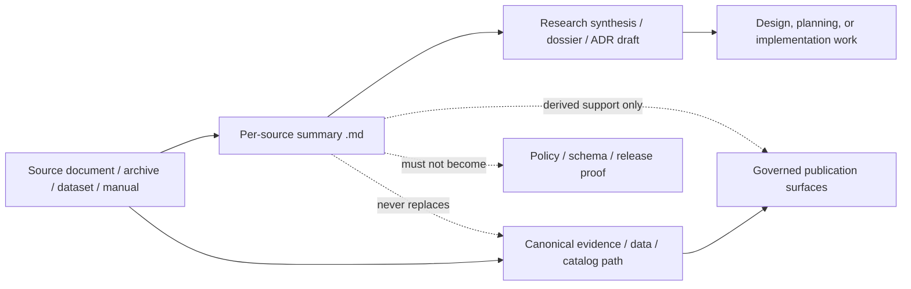

<!-- [KFM_META_BLOCK_V2]
doc_id: kfm://doc/NEEDS-VERIFICATION
title: Research Source Summaries
type: standard
version: v1
status: draft
owners: NEEDS VERIFICATION
created: YYYY-MM-DD
updated: YYYY-MM-DD
policy_label: NEEDS VERIFICATION
related: [NEEDS VERIFICATION]
tags: [kfm, research, source-summaries]
notes: [Target path supplied by request; repo-local owners, dates, related links, and exact neighboring docs require direct repo verification.]
[/KFM_META_BLOCK_V2] -->

# Research Source Summaries

Derived, evidence-linked working summaries for individual sources used in KFM research, design, and implementation planning.

> [!IMPORTANT]
> **Status:** experimental  
> **Owners:** NEEDS VERIFICATION  
> **Repo fit:** `docs/research/source_summaries/README.md`  
> **Badges:**  
> 
> 
> 
>   
> **Quick jumps:** [Scope](#scope) · [Repo fit](#repo-fit) · [Inputs](#inputs) · [Exclusions](#exclusions) · [Directory tree](#directory-tree) · [Quickstart](#quickstart) · [Usage](#usage) · [Diagram](#diagram) · [Task list](#task-list) · [FAQ](#faq) · [Appendix](#appendix)

> [!NOTE]
> This draft is intentionally source-bounded. The target path was provided in the request, but the mounted repo tree for this directory was not directly verified in this session. Keep placeholders visible until repo-local ownership, neighboring links, and file layout are confirmed.

---

## Scope

This directory is for **human-readable, per-source Markdown summaries**.

Its job is to help maintainers answer five practical questions quickly:

1. What is this source?
2. Why does it matter to KFM?
3. What does it establish?
4. What does it **not** establish?
5. Where should a reviewer go next?

These summaries are **derived working artifacts**. They support research, synthesis, design review, and implementation planning. They do **not** replace canonical source files, machine-checkable contracts, policy decisions, catalog metadata, or release proof.

### Directory truth posture

| Label | Use inside this directory | Do not use it for |
| --- | --- | --- |
| **CONFIRMED** | Claims directly supported by the summarized source or directly verified repo evidence | Smooth assumptions, guessed implementation, or optimistic paraphrase |
| **INFERRED** | Small, clearly bounded synthesis that connects the source to KFM doctrine | Inventing current repo state |
| **PROPOSED** | Adoption guidance, follow-on work, or recommended use in KFM | Backfilling missing evidence |
| **UNKNOWN** | Gaps that the source does not resolve | Hidden uncertainty |
| **NEEDS VERIFICATION** | Repo-local paths, owners, dates, adjacent docs, automation, or implementation details not directly checked | Cosmetic TODO noise |

### What “good” looks like here

A strong source summary is:

- small enough to scan quickly
- specific enough to reuse
- honest about limits
- explicit about rights, caveats, and uncertainty
- easy to trace back to the upstream source

[Back to top](#research-source-summaries)

---

## Repo fit

| Field | Current draft |
| --- | --- |
| **Path** | `docs/research/source_summaries/README.md` |
| **Role** | Directory charter and maintenance guide for per-source summaries |
| **Upstream links** | **NEEDS VERIFICATION** — add repo-relative links to the nearest research index, source register, evidence intake guide, or domain/source atlas entry |
| **Downstream links** | **NEEDS VERIFICATION** — add repo-relative links to dossiers, ADRs, runbooks, source atlases, or thin-slice packages that consume these summaries |
| **Boundary** | This directory belongs on the **derived documentation** side of the trust membrane; it must not become a second source of truth for catalog, policy, or release state |

### Intended relationship to adjacent work

- **Upstream:** source files, source inventories, evidence intake notes, atlas/domain references
- **Here:** compact human summaries of one source at a time
- **Downstream:** synthesis dossiers, architecture docs, ADRs, planning docs, and implementation notes that cite the summary *and* the underlying source where needed

[Back to top](#research-source-summaries)

---

## Inputs

### Accepted inputs

| Input | Required | Notes |
| --- | --- | --- |
| One Markdown file per source or source edition | Yes | Prefer one source, one edition, one summary |
| Source identity | Yes | Title, edition/date, author/org, access note |
| Summary of what the source covers | Yes | Concise, not promotional |
| KFM relevance | Yes | Name the lane, seam, workflow, or design pressure it informs |
| Caveats / limitations | Yes | Scope limits, rights limits, version drift, or quality issues |
| Traceability pointers | Yes | Link or reference the upstream source artifact where possible |
| Truth posture labels | Yes | Use `CONFIRMED`, `INFERRED`, `PROPOSED`, `UNKNOWN`, `NEEDS VERIFICATION` deliberately |
| Rights / reuse note | Recommended | Especially for books, archives, scans, oral histories, or screenshots |
| Structured facts worth reusing | Recommended | Terms, standards, models, constraints, key examples |
| Open questions | Recommended | Keep unresolved issues visible |

### Recommended minimum snapshot for each summary

| Field | Why it matters |
| --- | --- |
| Source type | Prevents mixing books, manuals, datasets, archives, papers, and websites |
| Edition / date | Prevents silent version drift |
| Domain lane(s) | Helps route the summary into KFM’s Kansas-first operating lanes |
| Spatial / temporal support | Keeps scale and time semantics visible |
| Trust posture | Prevents persuasive overclaiming |
| Reuse constraints | Helps avoid rights mistakes |

[Back to top](#research-source-summaries)

---

## Exclusions

This directory should **not** become the dumping ground for every research artifact.

| Not here | Put it where it belongs instead | Why |
| --- | --- | --- |
| Raw source files (PDFs, scans, datasets, media) | Source storage / evidence references / canonical data lanes | A summary is not the source |
| Machine-readable catalog artifacts | Authoritative STAC / DCAT / PROV homes | Catalog closure must stay machine-checkable |
| Policy bundles, reason codes, obligation codes | Authoritative policy home | Policy meaning must remain executable and reviewable |
| JSON Schemas / API contracts | Authoritative contract/schema home | Summary prose must not compete with validation artifacts |
| Release proof packs, correction notices, rollback records | Release / correction / runbook homes | Publication governance must remain operational |
| Broad multi-source synthesis docs | Research dossiers / ADRs / architecture docs | This directory is **per-source**, not cross-source doctrine |
| Unbounded AI notes or free-form “takeaways” with no traceability | Separate working notes, or do not keep them | KFM prefers cite-or-abstain over impressionistic summaries |

> [!WARNING]
> If a summary starts behaving like policy, schema, release state, or canonical metadata, move that content out. This directory is for **navigation and interpretation**, not sovereign truth.

[Back to top](#research-source-summaries)

---

## Directory tree

**Proposed minimal shape — update after repo inspection**

```text
docs/
└── research/
    └── source_summaries/
        ├── README.md
        ├── <source-slug>.md
        ├── <source-slug>__<edition-or-date>.md
        └── _template.md                # optional; NEEDS VERIFICATION
```

### Naming guidance

| Pattern | Use when |
| --- | --- |
| `<source-slug>.md` | The source has one stable, unambiguous edition in use |
| `<source-slug>__<edition-or-date>.md` | Different editions or snapshots may coexist |
| Avoid | `notes.md`, `random.md`, `summary-final-final.md` |

[Back to top](#research-source-summaries)

---

## Quickstart

1. Choose **one source**.
2. Create **one summary file**.
3. Fill the required snapshot fields first.
4. Separate **what the source says** from **what you think it implies**.
5. Record caveats, rights notes, and open questions before calling the file “done”.
6. Add or update the index entry in this README if this directory grows beyond a handful of files.

### Minimal starter scaffold

```md
# <Source title>

One-sentence purpose.

## Snapshot

| Field | Value |
| --- | --- |
| Source type | |
| Edition / date | |
| Author / steward | |
| Access note | |
| KFM lanes | |
| Trust posture | |

## What this source establishes

## What it does not establish

## Why it matters to KFM

## Caveats, rights, and reuse notes

## Open questions

## Links
```

### Quick review rule

Before you commit a summary, ask:

- Can a reader tell **which exact source** this file refers to?
- Can they tell **why KFM cares**?
- Can they see **where certainty stops**?
- Could they find the upstream source again without guesswork?

[Back to top](#research-source-summaries)

---

## Usage

### How this directory should be used

Use these summaries to:

- orient a maintainer before they open a long source
- reduce duplicate re-reading of the same book/manual/source
- keep reusable facts, caveats, and terminology close at hand
- support later synthesis without flattening uncertainty

Do **not** use these summaries to:

- claim current implementation
- replace source-specific citation work
- launder speculation into doctrine
- hide rights or sensitivity issues behind polished prose

### Recommended section shape for each source summary

| Section | Purpose | Required |
| --- | --- | --- |
| `Snapshot` | Fast identity and reuse metadata | Yes |
| `What this source establishes` | Source-grounded claims only | Yes |
| `What it does not establish` | Explicit limits | Yes |
| `Why it matters to KFM` | Connect the source to lanes, seams, or design decisions | Yes |
| `Reusable facts / patterns` | High-value extracted takeaways | Recommended |
| `Caveats, rights, and reuse notes` | Keep risk visible | Yes |
| `Open questions` | Preserve unresolved issues | Recommended |
| `Links` | Upstream pointer, adjacent docs, related artifacts | Yes |

### One source, one file, one center of gravity

Prefer this rule unless there is a strong reason not to:

- one file per source
- one source edition per file
- one primary name for that source
- one clearly stated scope

That keeps search, review, and later refactoring sane.

### Writing style inside summaries

- quote sparingly
- prefer compact paraphrase
- keep terminology stable
- identify edition/version drift early
- treat caveats as first-class content, not footnotes

[Back to top](#research-source-summaries)

---

## Diagram



### Reading the diagram

The summary sits in a useful but subordinate position:

- it helps people navigate evidence
- it may feed later synthesis
- it must **not** bypass canonical evidence, catalog, policy, or release logic

[Back to top](#research-source-summaries)

---

## Tables

### Summary maturity levels

| Maturity | Meaning | Expected quality bar |
| --- | --- | --- |
| `seed` | Bare minimum identity and purpose captured | Enough to prevent rediscovery work |
| `working` | Core claims, caveats, and KFM relevance captured | Reusable by maintainers |
| `reviewed` | Checked for drift, duplication, and unsupported claims | Suitable to cite from adjacent docs |
| `stale` | Source or summary likely needs re-checking | Keep visible; do not silently trust |

### Suggested index table for this directory

When this folder contains multiple summaries, maintain a compact registry like this:

| Source | Type | Edition / date | KFM lanes | Summary file | Status |
| --- | --- | --- | --- | --- | --- |
| `<source title>` | manual / book / paper / archive | `YYYY` | hydrology / archives / UI / etc. | `<file>.md` | seed / working / reviewed / stale |

### Review heuristics

| Check | Pass condition |
| --- | --- |
| Source identity | Exact source is unambiguous |
| Scope | Summary covers a bounded source, not a vague topic |
| Truth posture | Unsupported claims are visibly marked |
| KFM fit | Lane, seam, or workflow relevance is named |
| Rights / caveats | Reuse constraints are not buried |
| Duplication | No near-duplicate summary already exists |

[Back to top](#research-source-summaries)

---

## Task list

### Definition of done for one new summary

- [ ] Source title, edition/date, and steward/author are captured
- [ ] The summary clearly identifies what the source is about
- [ ] `What this source establishes` is separated from `What it does not establish`
- [ ] KFM relevance is stated in lane/seam terms
- [ ] Rights, caveats, and version concerns are visible
- [ ] The file does not claim mounted repo state without direct verification
- [ ] The file is named consistently and does not duplicate an existing summary
- [ ] The directory index row is added or updated when applicable

### Review gates for this README

- [ ] Replace placeholder owners
- [ ] Replace placeholder related links
- [ ] Verify whether `_template.md` or another local template already exists
- [ ] Align the directory tree with the real repo
- [ ] Confirm upstream/downstream relative links
- [ ] Confirm whether this directory is already indexed elsewhere in `docs/`

[Back to top](#research-source-summaries)

---

## FAQ

### Are source summaries authoritative?

No. They are **derived navigation aids**. The source remains stronger than the summary, and canonical KFM artifacts remain stronger than both when publication, policy, and runtime behavior are involved.

### Can one summary cover multiple sources?

Only if the file is explicitly framed as a **comparative** or **synthesis** document and named that way. This directory’s default mode is still **one source, one file**.

### Can AI draft a summary?

Yes, as a bounded helper. Human review is still required, and unsupported claims must remain visibly marked rather than polished into false confidence.

### Should every summary repeat long quotations?

No. Summaries should be readable. Quote only when wording itself matters; otherwise paraphrase cleanly and keep the traceability path obvious.

[Back to top](#research-source-summaries)

---

## Appendix

<details>
<summary><strong>Template for a new per-source summary</strong></summary>

```md
# <Source title>

One-line purpose.

## Snapshot

| Field | Value |
| --- | --- |
| Source type | book / manual / paper / site / archive / dataset |
| Edition / date | |
| Author / steward | |
| Access note | local PDF / external site / archive / upload |
| KFM lanes | |
| Spatial support | |
| Temporal support | |
| Trust posture | CONFIRMED / INFERRED / PROPOSED / UNKNOWN / NEEDS VERIFICATION |

## What this source establishes

- 

## What it does not establish

- 

## Why it matters to KFM

- 

## Reusable facts, patterns, or cautions

- 

## Caveats, rights, and reuse notes

- 

## Open questions

- 

## Links

- Upstream source:
- Adjacent KFM docs:
```

</details>

<details>
<summary><strong>Maintenance notes for future cleanup</strong></summary>

When the repo is directly visible, tighten this README in the following order:

1. verify neighboring docs and replace placeholder repo-fit links
2. confirm owners and dates for the meta block
3. add an index table if the directory already contains summaries
4. remove any speculative tree entries that do not exist
5. align naming guidance with actual local conventions if they differ

</details>

---

[Back to top](#research-source-summaries)
