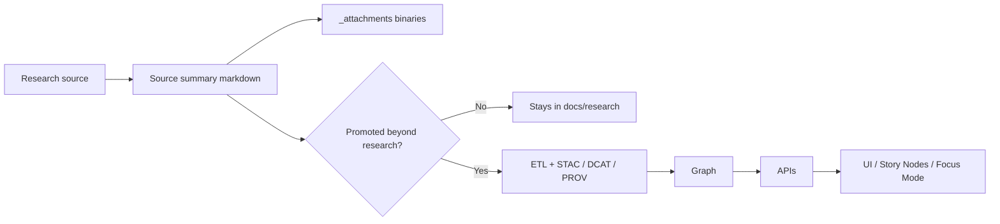

<!-- [KFM_META_BLOCK_V2]
doc_id: kfm://doc/NEEDS-VERIFICATION
title: Research Source Summaries Attachments
type: standard
version: v1
status: draft
owners: NEEDS VERIFICATION
created: YYYY-MM-DD
updated: YYYY-MM-DD
policy_label: public
related: [../../README.md, ../README.md, ../../../../data/]
tags: [kfm, research, source-summaries, attachments]
notes: [Target path and adjacent research-lane drafts are evidenced in current-session project materials; owners, dates, and full repo inventory still need mounted-repo verification.]
[/KFM_META_BLOCK_V2] -->

# Research Source Summaries Attachments

Binary support files for research source summaries, kept repo-local and explicitly separated from canonical KFM data assets.

> [!NOTE]
> **Status:** experimental  
> **Owners:** NEEDS VERIFICATION  
>     
> **Quick jumps:** [Scope](#scope) · [Repo fit](#repo-fit) · [Accepted inputs](#accepted-inputs) · [Exclusions](#exclusions) · [Directory tree](#directory-tree) · [Quickstart](#quickstart) · [Usage](#usage) · [Diagram](#diagram) · [Tables](#tables) · [Task list / definition of done](#task-list--definition-of-done) · [FAQ](#faq) · [Appendix](#appendix)  
> **Repo fit:** `docs/research/source_summaries/_attachments/` → upstream: [`../README.md`](../README.md), [`../../README.md`](../../README.md) · downstream: source summary leaves in [`../`](../) that reference local binaries; any later Story Node or Focus Mode use stays indirect and provenance-bound.

> [!IMPORTANT]
> This directory is a **documentation-support lane**, not a data lane. Keep raw sources, ETL inputs, canonical datasets, and publishable geospatial assets under `data/` and the governed catalog flow, not here.

> [!WARNING]
> Current-session evidence confirmed the target path and adjacent research-lane drafts, but did **not** directly expose a mounted repository tree for this folder. Treat owners, exact sibling inventory, CI enforcement, file-size/LFS rules, and any storage workflow beyond this contract as **NEEDS VERIFICATION**.

## Scope

This folder holds small binary attachments that are **directly referenced** by Markdown source summaries under `docs/research/source_summaries/`.

Its job is narrow and practical:

- keep summaries readable in GitHub and local Markdown renderers
- reduce link rot by storing supporting files in-repo
- preserve lightweight provenance, licensing, and sensitivity context close to the summary that cites the file

Source summaries themselves are a **research / curation workspace**, not authoritative Story Node content and not a substitute for governed data publication.

### Status vocabulary used here

| Label | Use in this README |
|---|---|
| **CONFIRMED** | Supported by visible project materials in the current session |
| **INFERRED** | Small structural completion that fits the adjacent KFM drafts but was not directly verified in a mounted repo |
| **PROPOSED** | Recommended convention or future improvement |
| **UNKNOWN** | Not verified strongly enough in the current session |
| **NEEDS VERIFICATION** | Review flag for inventory, ownership, enforcement, or repo-specific behavior |

## Repo fit

This folder sits inside the research/source-summary lane and should stay clearly separate from cataloged data, graph build artifacts, and runtime delivery surfaces.

| Path | Role | Relationship |
|---|---|---|
| [`../README.md`](../README.md) | Source summaries index | Parent lane for source-summary conventions and routing |
| [`../../README.md`](../../README.md) | Research hub | Broader research workspace; not a runtime contract surface |
| `../../../../data/` | Data roots | Use for raw/work/processed data and canonical assets |
| `../../../../data/stac/`, `../../../../data/catalog/dcat/`, `../../../../data/prov/` | Catalog closure | Use when an artifact becomes a governed dataset or distribution |
| `../../../../src/server/` | API membrane | UI should consume governed contracts here, not binaries from this folder |
| `../../../../web/` | UI surfaces | Story Nodes and Focus Mode should reference governed evidence, not `_attachments/` as a direct delivery lane |

If a source, figure, or attachment graduates beyond research support, route it through the canonical KFM flow instead of letting this directory become an unofficial publication endpoint.

## Accepted inputs

Place files here only when they are **small, documentation-facing, and directly referenced** by at least one source summary.

| Input | Typical format | Where it comes from | Minimum review |
|---|---|---|---|
| Figure, screenshot, map inset, cropped table image | `png`, `jpg`, `svg`, `webp` | Manual capture from a cited source | Visual review + licensing/permission check |
| Small supporting excerpt or appendix | `pdf` | Small source excerpt or support document | Visual review + licensing/permission check |
| Optional provenance / license sidecar | `md`, `json` | Authored in-repo | Completeness review |

## Exclusions

Do **not** put the following here:

- raw datasets, source dumps, ETL landing files, or imported corpora
- canonical data assets that belong under `data/` and should be represented through STAC/DCAT/PROV
- secrets, credentials, tokens, private personal information, or internal-only evidence
- precise sensitive locations, culturally restricted knowledge, or other material that requires controlled handling
- unreferenced binaries that no source summary actually links to
- implementation contracts, policy docs, or runtime assets whose real home is another docs or code lane

When in doubt, prefer the stricter interpretation: if it behaves like data, contract surface, or sensitive evidence, it probably does **not** belong here.

## Directory tree

Expected / intended shape for this sub-area:

```text
docs/
└── research/
    ├── README.md
    └── source_summaries/
        ├── README.md
        ├── _attachments/
        │   ├── README.md
        │   ├── <figure-or-screenshot>.<png|jpg|svg|webp>
        │   ├── <small-supporting-doc>.pdf
        │   └── <optional-sidecar>.<md|json>
        └── <source_summary>.md
```

> [!TIP]
> Adjacent drafts also suggest deeper summary subfolders such as `by_type/` and `by_domain/`. Those broader layouts are useful context, but they are **not required** for this folder contract.

## Quickstart

### Add a new attachment

1. Choose a **stable, readable filename**.
2. Put the file in `docs/research/source_summaries/_attachments/`.
3. Link it from at least one source summary.
4. Record provenance / licensing in the summary body or an optional sidecar.
5. Review for sensitivity before commit.

### Link from a source summary in `source_summaries/`

```md


[Supporting PDF excerpt](./_attachments/2026-example-appendix.pdf)
```

### Link from a deeper summary file

If the summary lives in a nested folder, adjust the relative path to match its depth.

```md
<!-- example: docs/research/source_summaries/by_type/web/2026-example.md -->

```

### Optional sidecar naming

```text
2026-example-watershed-inset.png
2026-example-watershed-inset.meta.md
```

## Usage

### Add or update an attachment

1. Use a filename that stays understandable outside its original PR context.
2. Keep the file narrowly scoped to what the summary actually needs.
3. Add or update the referencing summary in the same change.
4. Record provenance, retrieval context, and license/terms where a reviewer can see them.
5. If the file changes materially, prefer a **new versioned filename** over a silent overwrite.

### When to add a sidecar

A sidecar is recommended when any of the following are true:

- the source or license is not obvious from the filename alone
- the attachment was cropped, redacted, annotated, recompressed, or otherwise transformed
- one attachment is cited by multiple summaries
- a reviewer would reasonably ask “where did this come from?” or “what changed?”

### Promotion boundary

Attachments in this folder improve **research reviewability**. They do **not** automatically surface in Focus Mode, Story Nodes, or public export flows.

If the work becomes:

- a canonical data asset
- a publishable map/layer/package
- a governed narrative artifact
- a contract or standard with validation implications

then move it into the lane that owns that responsibility and add the formal metadata / validation that lane requires.

> [!IMPORTANT]
> `_attachments/` is not a shortcut around STAC, DCAT, PROV, review, or API boundaries.

### Sensitivity gate

Stop and escalate before commit if an attachment contains or implies:

- precise sensitive locations
- culturally restricted or community-sensitive material
- private personal information
- credentials, internal screenshots, or access-bearing details
- anything that would require redaction or generalization on public surfaces

The exact governed storage/review workflow for such cases is **NEEDS VERIFICATION** in the current session. The safe default is simple: **do not store it here**.

## Diagram



## Tables

### Routing matrix

| Asset or need | Keep in `_attachments/`? | Route instead |
|---|---|---|
| Cropped figure, screenshot, or map inset used by a summary | Yes | Link it from the summary and note provenance |
| Small supporting PDF excerpt | Yes | Keep it small and directly referenced |
| Raw source PDF, full corpus dump, or ETL input | No | `data/` or the appropriate source-intake lane |
| Canonical raster/vector/geospatial package | No | Governed data lane with STAC/DCAT/PROV |
| Sensitive or restricted evidence | No | Governed review / controlled handling workflow |
| Public-facing narrative or Story artifact | No | Story Node / governed docs lane |

### Metadata and standards alignment

| Concern | Rule here |
|---|---|
| **STAC** | Files in `_attachments/` are **not** assumed to be STAC assets |
| **DCAT** | This folder is usually **not** a dataset or distribution surface |
| **PROV** | Provenance should still be recorded in the summary or an optional sidecar |
| **Graph / APIs / UI** | This folder is support material, not a runtime contract boundary |
| **Story Nodes / Focus Mode** | Indirect only; promoted narrative should point back to governed evidence |
| **Versioning** | Prefer stable filenames; use a versioned filename for material file changes |

### Filename guidance

| Prefer | Avoid |
|---|---|
| `2026-usgs-waterwatch-figure-01.png` | `image1.png` |
| `2026-fema-nfhl-legend-excerpt-v2.pdf` | `final-final2.pdf` |
| `2026-epa-aqi-table.meta.md` | sidecar-less transformed files when provenance is non-obvious |

## Task list / definition of done

A contribution touching this folder is done when:

- [ ] every attachment added here is referenced by at least one source summary
- [ ] all relative links render correctly in GitHub/local Markdown
- [ ] provenance and license/terms are visible in the summary or a sidecar
- [ ] no secrets, credentials, PII, or sensitive-location inference are present
- [ ] the file is clearly documentation support, not a canonical data asset
- [ ] any material file change uses a versioned filename instead of a silent overwrite

This README itself should be updated when:

- [ ] sidecar metadata becomes mandatory by policy
- [ ] CI adds orphan-attachment detection or link enforcement
- [ ] repo file-size or LFS rules are confirmed
- [ ] adjacent research or governance docs change the routing boundary for this folder

[Back to top](#research-source-summaries-attachments)

## FAQ

### Can I store a raw dataset or imported source corpus here?

No. Put raw or canonical source material in the appropriate intake/data lane, not in `_attachments/`.

### Do attachments here automatically show up in Story Nodes or Focus Mode?

No. They support research summaries. Public-facing narrative or runtime use should happen only after promotion through the governed pipeline.

### Do I need a sidecar metadata file for every attachment?

Not currently as a confirmed repo-wide requirement. It is strongly recommended whenever provenance, license, or transformation history would otherwise be unclear.

### What about large PDFs, media files, or Git LFS?

Current repo size limits, LFS rules, and enforcement are **NEEDS VERIFICATION** in this session. Keep files small and purpose-specific unless a directly verified repo rule says otherwise.

### Can AI summarize or transform attachment contents?

AI-assisted summarization, structuring, translation, and indexing may be reasonable for research support. AI should **not** infer sensitive locations, generate policy, or turn unclear provenance into confident claims.

## Appendix

<details>
<summary><strong>Optional sidecar template</strong></summary>

```md
# <attachment-filename>.meta.md

- **Origin source:** <citation / URL / document ID>
- **Used by summary:** <relative path to source summary>
- **Retrieved:** YYYY-MM-DD
- **Transform notes:** cropped / redacted / annotated / recompressed / other
- **License or terms:** <license, permission note, or redistribution caveat>
- **Sensitivity note:** public / generalized / review required
```

</details>

<details>
<summary><strong>Open verification backlog</strong></summary>

The following remain **NEEDS VERIFICATION** before this README can be treated as fully repo-confirmed:

- named owners for this directory
- created / updated dates for the metadata block
- whether sidecars are optional or required by policy
- whether CI checks for orphan attachments or broken local links
- repo-specific file-size thresholds or Git LFS expectations
- exact workflow for attachments that require controlled or redacted handling

</details>

[Back to top](#research-source-summaries-attachments)
