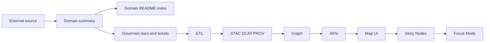

<!-- [KFM_META_BLOCK_V2]
doc_id: kfm://doc/NEEDS-VERIFICATION
title: Research Source Summaries — By Domain
type: standard
version: v1
status: draft
owners: NEEDS VERIFICATION
created: YYYY-MM-DD
updated: YYYY-MM-DD
policy_label: public
related: [../README.md, ../by_type/README.md, ../_attachments/README.md, ../../../MASTER_GUIDE_v12.md, ../../../templates/TEMPLATE__KFM_UNIVERSAL_DOC.md, ../../../templates/TEMPLATE__STORY_NODE_V3.md, ../../../templates/TEMPLATE__API_CONTRACT_EXTENSION.md, ../../../governance/ROOT_GOVERNANCE.md, ../../../governance/ETHICS.md, ../../../governance/SOVEREIGNTY.md]
tags: [kfm, research, source-summaries, by-domain, docs]
notes: [Owners, dates, and exact mounted-repo inventory still need direct verification in a live repo checkout.]
[/KFM_META_BLOCK_V2] -->

# Research Source Summaries — By Domain

Governed, domain-organized summaries of external sources that inform KFM decisions without bypassing provenance, catalogs, contracts, or review.

> [!NOTE]
> **Status:** experimental  
> **Owners:** NEEDS VERIFICATION  
>      
> **Quick jumps:** [Scope](#scope) · [Repo fit](#repo-fit) · [Accepted inputs](#accepted-inputs) · [Exclusions](#exclusions) · [Directory tree](#directory-tree) · [Quickstart](#quickstart) · [Usage](#usage) · [Diagram](#diagram) · [Tables](#tables) · [Task list / Definition of done](#task-list--definition-of-done) · [FAQ](#faq) · [Appendix](#appendix)  
> **Repo fit:** `docs/research/source_summaries/by_domain/` → upstream: [`../README.md`](../README.md), [`../by_type/README.md`](../by_type/README.md), [`../_attachments/README.md`](../_attachments/README.md), [`../../../MASTER_GUIDE_v12.md`](../../../MASTER_GUIDE_v12.md) · downstream: `./<domain_slug>/README.md`, `./<domain_slug>/<source_slug>.md`

> [!IMPORTANT]
> This directory is a **research-intake and indexing lane**. It is not the system of record for STAC/DCAT/PROV catalogs, graph assertions, API contracts, Story Nodes, or Focus Mode outputs.

> [!WARNING]
> Current-session evidence confirms draft conventions and neighboring documentation patterns for this area, but it does **not** directly verify the mounted repo inventory beneath `docs/research/source_summaries/by_domain/`. Treat active domain lists, area ownership, and any undocumented local variations as **NEEDS VERIFICATION** until the repo tree is inspected directly.

## Scope

This directory organizes external-source summaries by **domain** so contributors can keep related research close to the KFM subsystem it informs.

This area exists to:

- group source summaries by topical maintenance lane rather than by source format alone
- preserve a clean handoff from research notes into governed docs, implementation work, and review
- make provenance-first rationale easier to find without letting summaries silently become standards

This directory should help maintainers answer a practical question quickly: *which sources shaped this part of KFM, and what do they actually constrain?*

## Repo fit

| Path | Role | Relationship |
|---|---|---|
| `docs/research/source_summaries/by_domain/README.md` | this file | Root README for domain-organized source summaries |
| [`../README.md`](../README.md) | parent area index | Research source summaries area-wide contract and navigation |
| [`../by_type/README.md`](../by_type/README.md) | alternate browse surface | Parallel view organized by source type rather than domain |
| [`../_attachments/README.md`](../_attachments/README.md) | attachment rules | Governs small binary files referenced by source summaries |
| [`../../../templates/TEMPLATE__KFM_UNIVERSAL_DOC.md`](../../../templates/TEMPLATE__KFM_UNIVERSAL_DOC.md) | default authoring template | Use for most source summaries |
| [`../../../templates/TEMPLATE__STORY_NODE_V3.md`](../../../templates/TEMPLATE__STORY_NODE_V3.md) | narrative promotion template | Use only when the work is being promoted into a Story Node |
| [`../../../templates/TEMPLATE__API_CONTRACT_EXTENSION.md`](../../../templates/TEMPLATE__API_CONTRACT_EXTENSION.md) | contract extension template | Use when a source drives a contract change elsewhere |
| [`../../../governance/ROOT_GOVERNANCE.md`](../../../governance/ROOT_GOVERNANCE.md) | governance baseline | Review, policy, and publication constraints |
| [`../../../governance/ETHICS.md`](../../../governance/ETHICS.md) | ethics baseline | Handling constraints for public interpretation |
| [`../../../governance/SOVEREIGNTY.md`](../../../governance/SOVEREIGNTY.md) | sovereignty baseline | Cultural sensitivity and restricted-material handling |
| [`../../../MASTER_GUIDE_v12.md`](../../../MASTER_GUIDE_v12.md) | canonical ordering reference | Existing draft reference for KFM pipeline ordering; exact mounted path still needs verification |
| `./<domain_slug>/README.md` | domain index | Domain-local index of sources, gaps, and open questions |
| `./<domain_slug>/<source_slug>.md` | source summary leaf | One governed summary per source |

## Accepted inputs

Place material here when it is primarily a **domain-indexed research summary**.

Accepted inputs include:

- concise Markdown summaries of books, papers, datasets, standards, web sources, maps, or reports
- bibliographic references, DOI/URL/ISBN-style identifiers, and access notes
- “KFM implications” that map a source to ETL, catalogs, graph modeling, APIs, UI, Story Nodes, or Focus Mode
- action items, validation notes, and review questions that arise from a source
- relative links to small supporting attachments when those attachments are directly referenced and governance-safe

A strong summary in this area usually captures both **what the source says** and **what that means for KFM**.

## Exclusions

Do **not** place the following here:

- full source texts or large copyrighted dumps  
  → keep source storage outside this folder; use summaries plus identifiers instead
- new governance or policy authoring  
  → use `docs/governance/`
- authoritative API contracts, schema definitions, or runtime envelopes  
  → define those in the contract-owning docs and code
- public narrative text intended to ship through Story Nodes or Focus Mode  
  → promote into the proper narrative artifact with explicit provenance
- canonical datasets and pipeline outputs  
  → place those under `data/` and catalog them when appropriate
- speculative claims, precise sensitive locations, or identity inference  
  → do not publish; route to review instead
- invented STAC / DCAT / PROV / graph identifiers  
  → record a TODO or action item until a real identifier exists

## Directory tree

Expected structure for this area:

```text
docs/
└── research/
    └── source_summaries/
        ├── README.md
        ├── _attachments/
        │   └── README.md
        ├── by_type/
        │   └── README.md
        └── by_domain/
            ├── README.md
            └── <domain_slug>/
                ├── README.md
                ├── <source_slug>.md
                └── <source_slug>__notes.md   # optional; use only if the repo adopts it
```

Recommended domain slug style:

- use lowercase with underscores
- keep domains **coarse**
- prefer cross-linking over duplicate summaries

Examples:

- `geospatial`
- `data_engineering`
- `graph_ontology`
- `api_contracts`
- `ui_ux`
- `governance`

## Quickstart

### Create a new domain lane

```bash
mkdir -p docs/research/source_summaries/by_domain/<domain_slug>
touch docs/research/source_summaries/by_domain/<domain_slug>/README.md
touch docs/research/source_summaries/by_domain/<domain_slug>/<source_slug>.md
```

### Start a new source summary

Use the governed template that best matches the intended outcome:

- default summary: `../../../templates/TEMPLATE__KFM_UNIVERSAL_DOC.md`
- narrative promotion target: `../../../templates/TEMPLATE__STORY_NODE_V3.md`

Minimal per-source structure:

```md
# <Source title>

## Citation
- Authors / title / venue / publisher / year
- Stable identifier: DOI / URL / ISBN / archive ref

## What the source says
- Fact:
- Inference:
- Hypothesis:

## KFM relevance
- Which subsystem(s) this affects
- Which pipeline stage(s) this affects

## Risks / limitations
- What not to overclaim
- Rights / sensitivity / scope cautions

## Action items
- Tickets
- PRs
- Schema / docs / tests to update
```

### Update the domain index

Whenever you add a new leaf summary:

1. add it to `./<domain_slug>/README.md`
2. record status or review posture
3. cross-link to any governed follow-on doc, ticket, or artifact that now depends on it

## Usage

### Write for handoff, not just recollection

A source summary in this lane should be useful to at least one downstream maintainer. That usually means it answers:

- what the source contributes
- what it constrains
- what remains uncertain
- what work should happen next

### Keep fact, inference, and hypothesis separate

Within each source summary, label extracted material explicitly:

- **Fact** — directly supported by the source
- **Inference** — conclusion drawn from source statements
- **Hypothesis** — plausible but still unverified

This prevents “floating knowledge” from sliding downstream as if it were settled evidence.

### Keep provenance ahead of convenience

When identifiers exist, point to them:

- STAC collection / item IDs
- DCAT dataset IDs
- PROV activity / run IDs
- graph entity references

When identifiers do **not** exist yet, do not invent them. Record an action item instead.

### Keep Focus Mode downstream

Source summaries are **upstream rationale**. They do not surface directly in Focus Mode or Story Nodes unless the claims are re-linked through appropriate evidence artifacts and narrative rules.

### Keep UI and graph boundaries explicit

Research notes may influence graph modeling and UI decisions, but they do not authorize direct UI-to-graph coupling. KFM’s public and reviewer-facing surfaces still rely on governed contracts and API-mediated access.

## Diagram



## Tables

### Status vocabulary used in this area

| Label | Meaning here |
|---|---|
| **CONFIRMED** | Directly supported by the source or directly verified in current-session project evidence |
| **INFERRED** | Conservative structural completion or conclusion strongly implied by evidence |
| **PROPOSED** | Recommended pattern or next step not yet proven in mounted implementation |
| **UNKNOWN** | Not verified strongly enough in the current session |
| **NEEDS VERIFICATION** | Review flag for ownership, inventory, paths, behavior, or repo state |

### Summary content labels

| Label | When to use it |
|---|---|
| **Fact** | The source states it directly |
| **Inference** | You are drawing a conclusion from source statements |
| **Hypothesis** | The point is speculative and still needs validation |

### Minimum summary contract

| Field | Why it matters | Downstream impact |
|---|---|---|
| Citation | Preserves traceability | Review, Story Node provenance, future re-checks |
| Stable identifier | Reduces link rot and ambiguity | Catalog cross-links, repeatable review |
| What the source says | Captures source-bounded meaning | Decision-making and comparison work |
| KFM relevance | States why the summary exists | ETL, graph, API, UI, story planning |
| Risks / limitations | Prevents overclaiming | Public interpretation and implementation restraint |
| Action items | Turns research into reviewable next steps | Tickets, PRs, schema work, docs updates |
| Related artifacts / IDs | Connects research to governed objects when available | STAC / DCAT / PROV / graph linkage |

### Suggested domain buckets (examples, not fixed taxonomy)

| Domain slug | Use for | Typical follow-on lanes |
|---|---|---|
| `geospatial` | GIS, cartography, CRS, map delivery, PostGIS, packaging | ETL, catalogs, UI |
| `data_engineering` | orchestration, packaging, provenance, storage, CI/CD | ETL, catalogs, ops |
| `graph_ontology` | entities, relationships, provenance modeling, query semantics | graph, APIs |
| `api_contracts` | payloads, route semantics, redaction rules, envelopes | APIs, UI |
| `ui_ux` | map behavior, trust-visible states, Evidence Drawer, Focus constraints | UI, Story Nodes |
| `governance` | rights, review, correction, sensitivity, publication burden | docs, release review |

## Task list / Definition of done

Before considering this README or a new source summary “done,” check the following:

- [ ] title, path, and scope are clear
- [ ] the file is obviously a research-support lane, not a stealth standards doc
- [ ] no section implies direct UI access to Neo4j or other bypasses of governed contracts
- [ ] each source summary includes a citation and stable identifier
- [ ] fact / inference / hypothesis labeling is used where needed
- [ ] KFM relevance is stated explicitly
- [ ] sensitive-location inference is absent
- [ ] links resolve or are clearly marked as needing verification
- [ ] the relevant domain `README.md` index is updated
- [ ] invented catalog / graph IDs were avoided
- [ ] version history is updated when a summary meaningfully changes

### Review gates

If a summary would justify any of the following, route it for the appropriate review before treating it as settled:

- a new sensitive layer
- a new public-facing endpoint or surface
- a new Story Node claim
- a new Focus Mode behavior
- a new rights / redistribution assumption
- a new contract, schema, or pipeline requirement

[Back to top](#research-source-summaries--by-domain)

## FAQ

### Should I create a new domain or reuse an existing one?

Prefer a **coarse** domain first. If the source fits reasonably under an existing lane, reuse it and cross-link rather than fragmenting the tree.

### Is a source summary itself evidence?

It is an evidence-led **research artifact**, not a replacement for the source and not a replacement for KFM’s governed runtime evidence objects.

### Can I store the full PDF or book text here?

No, not by default. Keep this area summary-first. Use identifiers, short quotations where justified, and attachments only when they are small, directly referenced, and governance-safe.

### When should I reference STAC / DCAT / PROV?

Only when those identifiers already exist. If they do not, record a TODO or action item instead of inventing IDs.

### Can this README claim the current domain inventory?

Not safely in this session. The role and expected structure are evidence-backed, but the live subtree inventory remains **NEEDS VERIFICATION** until the mounted repo is inspected directly.

## Appendix

<details>
<summary><strong>Appendix — Open verification items</strong></summary>

The following items should be verified directly in the mounted repo before treating them as settled project facts:

- exact owners for this area
- created / updated dates for this README
- live inventory of `by_domain/*` folders
- whether `../../../MASTER_GUIDE_v12.md` is still the current canonical path
- whether `docs/glossary.md` exists at the expected location
- whether doc lint / link check commands are already wired in CI
- whether any domain README template already exists and should be linked here
- whether optional sidecar patterns such as `__notes.md` are actually in use

</details>

<details>
<summary><strong>Appendix — Domain README starter checklist</strong></summary>

Use this when creating `docs/research/source_summaries/by_domain/<domain_slug>/README.md`:

1. name the domain and describe what belongs there
2. list current source summaries in that domain
3. identify obvious gaps and open questions
4. link any governed downstream docs, tickets, or artifacts
5. note sensitivity, rights, or handling cautions specific to that domain
6. keep the index concise enough to remain useful during review

</details>

[Back to top](#research-source-summaries--by-domain)
