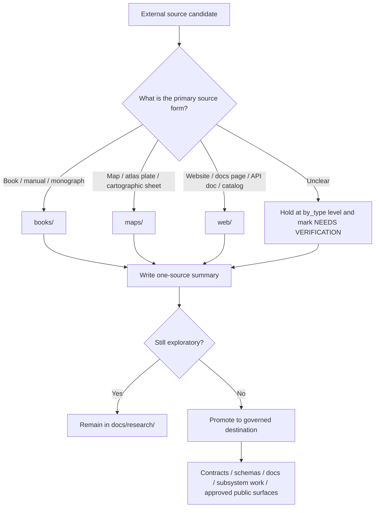

<!-- [KFM_META_BLOCK_V2]
doc_id: kfm://doc/NEEDS_VERIFICATION_UUID
title: KFM Source Summaries by Type
type: standard
version: v1
status: draft
owners: @bartytime4life
created: NEEDS_VERIFICATION_YYYY-MM-DD
updated: NEEDS_VERIFICATION_YYYY-MM-DD
policy_label: NEEDS_VERIFICATION_POLICY_LABEL
related: [docs/research/README.md, docs/research/source_summaries/README.md, docs/research/source_summaries/by_type/books/README.md, docs/research/source_summaries/by_type/maps/README.md, docs/research/source_summaries/by_type/web/README.md]
tags: [kfm, research, source-summaries, by-type]
notes: [owner confirmed via /docs CODEOWNERS coverage; doc_id and dates need verification; sibling lanes by_domain and _attachments are documented upstream but not confirmed in the current branch-visible by_type subtree]
[/KFM_META_BLOCK_V2] -->

# KFM Source Summaries by Type
Type-first routing guide for one-source research summaries that should stay exploratory until promoted.

> **Status:** experimental  
> **Owners:** `@bartytime4life`  
>      
> **Quick jumps:** [Scope](#scope) · [Repo fit](#repo-fit) · [Accepted inputs](#accepted-inputs) · [Exclusions](#exclusions) · [Directory tree](#directory-tree) · [Quickstart](#quickstart) · [Usage](#usage) · [Diagram](#diagram) · [Tables](#tables) · [Task list](#task-list--definition-of-done) · [FAQ](#faq) · [Appendix](#appendix)
>
> [!IMPORTANT]
> This lane inherits the `docs/research/` rule: content here is **non-normative until promoted**.  
> Summaries in this directory may inform later governed artifacts, but they do **not** define policy, contracts, schemas, release behavior, or public truth on their own.

## Scope

`by_type/` is the **source-medium routing lane** for `docs/research/source_summaries/`.

Use this directory when the organizing question is:

> “What kind of source is this?”

—not—

> “What domain is this about?”

This lane is for **one-source summaries** grouped by source form so contributors can find comparable materials quickly, apply medium-appropriate reading habits, and keep exploratory evidence legible without flattening it into doctrine.

> [!NOTE]
> **Current branch signal:** the visible child lanes at revision time are `books/`, `maps/`, and `web/`.  
> Recheck the live tree before assuming those are the only type lanes that exist.

## Repo fit

This README is the contract for the `by_type/` subtree.

Its job is to make the lane boundary explicit, route contributors into the right child directory, and prevent type-first summaries from being mistaken for domain-first research, raw attachments, or governed KFM artifacts.

| Item | Value |
|---|---|
| Path | `docs/research/source_summaries/by_type/README.md` |
| Parent lane | [`../README.md`](../README.md) |
| Upstream anchors | [`../../README.md`](../../README.md) · [`../../../README.md`](../../../README.md) · [`../../../../README.md`](../../../../README.md) |
| Downstream lanes | [`./books/README.md`](./books/README.md) · [`./maps/README.md`](./maps/README.md) · [`./web/README.md`](./web/README.md) |
| Documented sibling lanes | `../by_domain/README.md` · `../_attachments/README.md` — **NEEDS VERIFICATION** in the currently visible branch |
| Primary role | Type-first routing, lane explanation, and local summary discipline for source summaries |
| Promotion destinations | Governed docs, contracts, schemas, subsystem docs, tests, or approved narrative surfaces after review |

## Accepted inputs

Accepted here:

- one-source summaries of books, manuals, atlases, maps, web pages, API docs, catalogs, and similar external sources
- medium-specific reading notes that help future contributors find the right source class quickly
- summary files that clearly separate **fact**, **inference**, **hypothesis**, and **open verification**
- KFM relevance notes, rights/sensitivity notes, and “what this source is good for” guidance
- lightweight classification notes when a source is hard to place and still needs narrowing

## Exclusions

Do **not** use this lane as the canonical home for the following:

| Keep out of `by_type/` | Put it here instead |
|---|---|
| final governance rules, standards, or doctrine | governed destinations under [`../../../`](../../../) after promotion |
| machine-readable schemas, vocabularies, or API contracts | repo-level `schemas/`, `contracts/`, and related governed docs |
| cross-source trade studies or comparative evaluations | route through the parent research contract in [`../../README.md`](../../README.md) |
| raw attachments, copied PDFs, scans, or large copyrighted excerpts | use the documented attachment lane **when verified**, or keep attachment references at the parent summary lane |
| domain-first organization as the primary organizing frame | use the domain-oriented lane **when verified**, or keep the summary at the parent summary lane until routing is clear |
| uncited public-facing narrative, Story Node copy, or Focus Mode truth text | promote first; do not publish directly from research summaries |

## Directory tree

Confirmed branch-visible structure for this lane:

```text
docs/research/source_summaries/by_type/
├── README.md
├── books/
│   └── README.md
├── maps/
│   └── README.md
└── web/
    └── README.md
```

> [!TIP]
> Keep this tree shallow unless repeated use proves a stronger split is worth the maintenance cost.

## Quickstart

Start by re-checking the live tree before adding new summaries or widening the lane.

```bash
# from repo root
find docs/research/source_summaries/by_type -maxdepth 2 -type f | sort

# inspect the parent research contract
sed -n '1,220p' docs/research/README.md

# inspect the local lane contract
sed -n '1,220p' docs/research/source_summaries/by_type/README.md

# inspect current child lanes
sed -n '1,220p' docs/research/source_summaries/by_type/books/README.md
sed -n '1,220p' docs/research/source_summaries/by_type/maps/README.md
sed -n '1,220p' docs/research/source_summaries/by_type/web/README.md
```

Then:

1. Confirm the source is best organized by **type**, not by domain.
2. Pick the child lane that matches the source’s **primary form**.
3. Add or revise a one-source summary.
4. Keep the summary exploratory and evidence-linked.
5. Promote anything normative before it is treated as governed KFM behavior.

## Usage

### What this lane is for

Use `by_type/` when you want future readers to browse source summaries by **medium** or **artifact form** rather than subject-matter lane.

That is useful when reading behavior changes with the source itself:

- books and manuals often reward chapter-aware extraction
- maps and atlas plates need legend, projection, and representation notes
- web sources often need access-date, page-role, and drift-awareness notes

### Working rule

A summary here should still be **one-source first**.

Do not turn this lane into a blended literature review, doctrine rewrite, or cross-source synthesis dump. If you need to compare multiple sources, do that comparison elsewhere and link back to the individual source summaries.

> [!NOTE]
> **INFERRED routing rule:** classify by the source’s **primary form and review task**, not by where it was fetched.  
> A technical book downloaded as a PDF from the web still belongs in `books/` unless the web page itself is the source being summarized.

### Suggested working pattern

**PROPOSED working pattern:**

- keep lane conventions and index notes in each child `README.md`
- add individual source summary `.md` files beside that child README when summaries begin to accumulate
- keep filenames stable, readable, and source-led
- avoid creating new type lanes casually; widen only when repeated use justifies it

## Diagram



## Tables

### Current visible lanes (CONFIRMED)

| Lane | Current visible signal | Immediate purpose |
|---|---|---|
| `books/` | child README exists and is scaffold-level | local home for book/manual summaries |
| `maps/` | child README exists and is scaffold-level | local home for map/cartographic artifact summaries |
| `web/` | child README exists and is scaffold-level | local home for web-native source summaries |
| additional type lanes | **NEEDS VERIFICATION** | recheck the live tree before adding new lane assumptions |

### Recommended routing matrix (INFERRED)

| If the source is primarily a… | Route here | Notes |
|---|---|---|
| technical book, handbook, manual, monograph, long-form chaptered PDF, ebook | `books/` | use even when delivery happened via a website |
| standalone map, atlas plate, cartographic sheet, legend-led map artifact | `maps/` | use when the map artifact itself is the review object |
| website, documentation page, API reference, catalog page, blog post, web app page | `web/` | capture page role, access date, and drift risk |
| mixed or uncertain case | hold in `by_type/` and mark **NEEDS VERIFICATION** | resolve classification before promotion |

### Minimum summary record (PROPOSED)

| Field | Why it matters |
|---|---|
| source title | stable identification |
| source type | keeps routing explicit |
| author / organization | ownership and provenance |
| publication date / access date | freshness and drift awareness |
| one-paragraph summary | quick recall |
| why KFM cares | project relevance |
| key facts | source-grounded extraction |
| inference / cautions | keeps interpretation visible |
| rights / sensitivity notes | prevents careless reuse |
| next verification step | turns reading into forward motion |

## Task list / Definition of done

A summary in this lane is in good shape when:

- [ ] the source is intentionally routed by **type**
- [ ] the summary is **one-source focused**
- [ ] the title, source form, and authoring body are recorded where known
- [ ] key points are separated from interpretation
- [ ] rights, licensing, or sensitivity concerns are noted
- [ ] large copyrighted passages are **not** copied into the repo
- [ ] the summary does **not** imply KFM policy, contract, or runtime truth without promotion
- [ ] any uncertain classification is labeled **NEEDS VERIFICATION**
- [ ] the child lane README or local index remains readable after the addition

## FAQ

### Why organize by type when `docs/research/README.md` also documents domain-oriented routing?

Because the two cuts solve different discovery problems.

- **by type** answers: “what kind of source is this?”
- **by domain** answers: “what topic lane does this support?”

They are complementary, not interchangeable.

### Where should a PDF book found online go?

Use `books/` when the book itself is the source being summarized.

### Where should a scanned map page from a book go?

**INFERRED rule:** if the map page is the artifact you are actually analyzing as a map, use `maps/`. If you are summarizing the book as a whole, use `books/`.

### Can this lane define contracts, schemas, or public narrative?

No. This lane is exploratory until promoted.

### What should I do if `_attachments/` or `by_domain/` are documented upstream but not visible in my checkout?

Treat them as **NEEDS VERIFICATION**. Do not invent them silently in prose; verify the live tree first.

## Appendix

<details>
<summary><strong>Proposed starter stub for an individual source summary</strong></summary>

```markdown
# <Source title>
One-source research summary for KFM exploratory use.

- Source type: `book` | `map` | `web`
- Summary status: `draft`
- Author / organization: <name>
- Publication / access date: <date or NEEDS VERIFICATION>
- Why KFM cares: <one sentence>

## Summary
<short, source-grounded overview>

## Key facts
- <fact>
- <fact>

## Inference / cautions
- <inference>
- <needs verification>
- <rights or sensitivity note>

## Follow-up
- <what to verify next>
- <promotion target if this becomes normative>
```

</details>

<details>
<summary><strong>Classifier edge cases</strong></summary>

- A source’s **transport** is not its **type**.
- A web-hosted PDF can still be a `books/` source.
- A map embedded in a book can still belong in `maps/` when the map artifact is the real object of analysis.
- If the summary starts becoming multi-source, comparative, or normative, it has probably crossed out of this lane.

</details>

[Back to top](#kfm-source-summaries-by-type)
