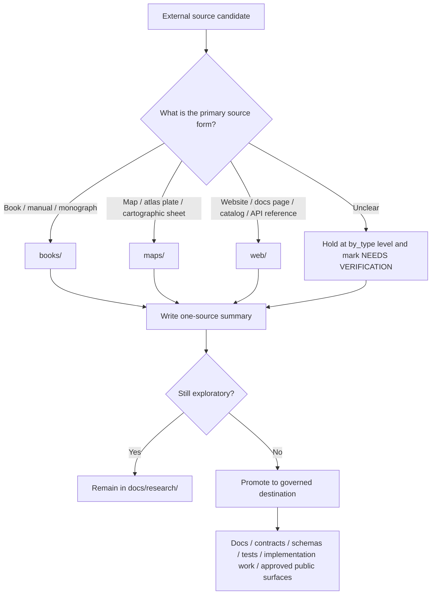

<!-- [KFM_META_BLOCK_V2]
doc_id: kfm://doc/NEEDS_VERIFICATION_UUID
title: KFM Source Summaries by Type
type: standard
version: v1
status: draft
owners: @bartytime4life
created: NEEDS_VERIFICATION_YYYY-MM-DD
updated: NEEDS_VERIFICATION_YYYY-MM-DD
policy_label: NEEDS_VERIFICATION_POLICY_LABEL
related: [docs/research/README.md, docs/research/source_summaries/README.md, docs/research/source_summaries/by_type/books/README.md, docs/research/source_summaries/by_type/maps/README.md, docs/research/source_summaries/by_type/web/README.md]
tags: [kfm, research, source-summaries, by-type]
notes: [owner preserved from supplied task block and not independently reverified in this run; doc_id, dates, and policy label need verification; workspace evidence in this run was PDF corpus only, so live repo tree and sibling lanes remain NEEDS VERIFICATION]
[/KFM_META_BLOCK_V2] -->

# KFM Source Summaries by Type

Type-first routing guide for one-source research summaries that should stay exploratory until promoted.

> **Status:** experimental  
> **Owners:** `@bartytime4life`  
>      
> **Quick jumps:** [Scope](#scope) · [Repo fit](#repo-fit) · [Accepted inputs](#accepted-inputs) · [Exclusions](#exclusions) · [Directory tree](#directory-tree) · [Quickstart](#quickstart) · [Usage](#usage) · [Diagram](#diagram) · [Tables](#tables) · [Task list](#task-list--definition-of-done) · [FAQ](#faq) · [Appendix](#appendix)

> [!IMPORTANT]
> This lane inherits the `docs/research/` posture: material here is **exploratory and non-normative until promoted**.  
> A summary in this subtree may inform later governed docs, contracts, schemas, tests, or public surfaces, but it does **not** define policy, runtime truth, or publication authority on its own.

## Scope

`by_type/` is the **source-medium routing lane** for `docs/research/source_summaries/`.

Use this lane when the organizing question is:

> “What kind of source is this?”

—not—

> “What domain is this about?”

This subtree exists to keep **one-source summaries** grouped by source form so contributors can find comparable materials quickly, apply medium-appropriate reading habits, and avoid flattening exploratory evidence into doctrine too early.

> [!NOTE]
> The strongest branch-visible signal available in the supplied baseline is a three-lane child split: `books/`, `maps/`, and `web/`.  
> Recheck the live tree before assuming those are the only type lanes that exist.

## Repo fit

This README is the local contract for the `by_type/` subtree.

Its job is to define the lane boundary, route contributors into the right child folder, and keep type-first summaries from being mistaken for domain-first research, raw attachments, or governed KFM artifacts.

| Item | Value |
|---|---|
| Path | `docs/research/source_summaries/by_type/README.md` |
| Parent lane | [`../README.md`](../README.md) |
| Upstream anchor | [`../../README.md`](../../README.md) |
| Downstream lanes | [`./books/README.md`](./books/README.md) · [`./maps/README.md`](./maps/README.md) · [`./web/README.md`](./web/README.md) |
| Documented sibling lanes | `../by_domain/README.md` · `../_attachments/README.md` — **NEEDS VERIFICATION** |
| Primary role | Type-first routing, lane explanation, and local discipline for source summaries |
| Typical output | One Markdown summary per source, kept evidence-led and promotion-safe |
| Promotion destinations | Governed docs, schemas, contracts, tests, implementation plans, or approved narrative surfaces after review |

## Accepted inputs

Accepted here:

- one-source summaries of books, manuals, atlases, maps, scanned sheets, georeferenced rasters, web pages, API docs, catalogs, and similar external sources
- medium-specific reading notes that help later contributors understand how a source should be interpreted
- summary files that clearly separate **fact**, **inference**, **constraint**, and **open verification**
- notes on KFM relevance, rights posture, sensitivity, and what the source is actually useful for
- provisional routing notes when a source is hard to classify and still needs narrowing

## Exclusions

Do **not** use this lane as the canonical home for the following:

| Keep out of `by_type/` | Put it here instead |
|---|---|
| final governance rules, standards, or doctrine | governed destinations under `docs/` after promotion |
| machine-readable schemas, vocabularies, or API contracts | `contracts/`, `schemas/`, and related governed docs |
| cross-source trade studies or blended literature reviews | the parent research lane or another explicitly comparative research doc |
| raw attachments, copied PDFs, scans, or large copyrighted excerpts | attachment handling lane **when verified**, or parent summary area |
| domain-first organization as the primary organizing frame | the domain-oriented lane **when verified**, or hold at parent level until routing is clear |
| uncited public-facing narrative, Story Node truth text, or Focus outputs | promote first; do not publish directly from exploratory summaries |

## Directory tree

Visible structure in the supplied baseline for this lane:

```text
docs/research/source_summaries/by_type/
├── README.md
├── books/
│   └── README.md
├── maps/
│   └── README.md
└── web/
    └── README.md
```

> [!TIP]
> Keep the subtree shallow unless repeated use proves a stronger split is worth the maintenance cost.

## Quickstart

Start by re-checking the live tree before adding new summaries or widening the lane.

```bash
# from repo root
find docs/research/source_summaries/by_type -maxdepth 2 -type f | sort

# inspect the parent research contract
sed -n '1,220p' docs/research/source_summaries/README.md

# inspect this lane contract
sed -n '1,260p' docs/research/source_summaries/by_type/README.md

# inspect visible child lanes
sed -n '1,220p' docs/research/source_summaries/by_type/books/README.md
sed -n '1,220p' docs/research/source_summaries/by_type/maps/README.md
sed -n '1,220p' docs/research/source_summaries/by_type/web/README.md
```

Then:

1. Confirm the source is best organized by **type**, not by domain.
2. Pick the child lane that matches the source’s **primary form**.
3. Add or revise a **one-source** summary.
4. Keep the summary exploratory, cited, and promotion-safe.
5. Promote anything normative before treating it as governed KFM behavior.

## Usage

### What this lane is for

Use `by_type/` when future readers will benefit from browsing by **medium** or **artifact form** rather than by topic lane.

That is especially useful when reading practice changes with the source itself:

- books and manuals reward chapter-aware extraction and bibliographic care
- maps and atlas plates need legend, scale, projection, extent, and georeferencing attention
- web-native sources need access-date, page-role, and drift-awareness notes

### Working rule

A summary here should remain **one-source first**.

Do not turn this lane into a doctrine rewrite, a mixed bibliography dump, or a comparative synthesis page. If you need cross-source comparison, do that somewhere else and link back to the individual source summaries.

> [!NOTE]
> **INFERRED routing rule:** classify by the source’s **primary form and review task**, not by where it was fetched.  
> A technical book downloaded as a PDF from the web still belongs in `books/` unless the web page itself is the source being summarized.

### Suggested local conventions

The following are useful **PROPOSED** conventions unless a stronger local pattern is already present:

- keep one summary file per source
- use source-led filenames that are readable in Git
- avoid creating new type folders casually
- include a short “KFM relevance” section so downstream readers can see why the source matters
- record rights and sensitivity notes explicitly instead of hiding them in prose

### Recommended filename pattern

**PROPOSED** filename pattern:

```text
<year>-<first-author-lastname>-<short-title>.md
```

Example:

```text
2023-smith-stac-best-practices.md
```

## Diagram



## Tables

### Current visible lanes

| Lane | Current visible signal | Immediate purpose |
|---|---|---|
| `books/` | child README documented in supplied baseline | local home for book/manual summaries |
| `maps/` | child README documented in supplied baseline | local home for map/cartographic artifact summaries |
| `web/` | child README documented in supplied baseline | local home for web-native source summaries |
| additional type lanes | **NEEDS VERIFICATION** | recheck the live tree before adding lane assumptions |

### Recommended routing matrix

| If the source is primarily a… | Route here | Notes |
|---|---|---|
| technical book, handbook, manual, monograph, long-form chaptered PDF, ebook | `books/` | use even when delivery happened via a website |
| standalone map, atlas plate, cartographic sheet, legend-led map artifact | `maps/` | use when the map artifact itself is the review object |
| website, documentation page, API reference, catalog page, blog post, web app page | `web/` | capture page role, access date, and drift risk |
| mixed or uncertain case | hold in `by_type/` and mark **NEEDS VERIFICATION** | resolve classification before promotion |

### Minimum summary record

| Field | Why it matters |
|---|---|
| full citation | stable identification and reuse |
| source type | keeps routing explicit |
| author / organization | provenance and stewardship context |
| publication date / access date | drift and freshness awareness |
| one-paragraph summary | quick recall |
| KFM relevance | shows why the source belongs in this repo |
| key takeaways | preserves useful extraction without overcopying |
| claims / constraints | surfaces material that may become requirements later |
| rights / sensitivity notes | prevents careless reuse or overexposure |
| next verification step | turns reading into forward motion |

## Task list / Definition of done

A summary in this lane is in good shape when:

- [ ] the source is intentionally routed by **type**
- [ ] the summary is **one-source focused**
- [ ] the citation, source form, and authoring body are recorded where known
- [ ] extracted facts are kept separate from interpretation or design consequences
- [ ] rights, licensing, sensitivity, or precision concerns are visible
- [ ] large copyrighted passages are **not** copied into the repo
- [ ] the summary does **not** imply KFM policy, contract, or runtime truth without promotion
- [ ] any uncertain classification is labeled **NEEDS VERIFICATION**
- [ ] any source used for later narrative work can still be traced back through this summary
- [ ] the child lane README or local index remains readable after the addition

## FAQ

### Why organize by type when other research cuts may exist?

Because the cuts solve different discovery problems.

- **by type** answers: “what kind of source is this?”
- **by domain** answers: “what topic lane does this support?”

They are complementary, not interchangeable.

### Where should a PDF book found online go?

Use `books/` when the **book itself** is the source being summarized.

### Where should a scanned map page from a book go?

If the **map artifact** is what you are actually analyzing as a map, use `maps/`. If you are summarizing the book as a whole, use `books/`.

### Can this lane define contracts, schemas, or public narrative?

No. This lane remains exploratory until promoted.

### What should I do if `_attachments/` or `by_domain/` are documented but not visible in my checkout?

Treat them as **NEEDS VERIFICATION**. Verify the live tree before naming them as settled repo structure.

### Can AI-generated text fill in missing metadata here?

Only in bounded ways. Summarization and structure extraction may help, but do **not** fabricate missing metadata or infer sensitive locations.

## Appendix

<details>
<summary><strong>Proposed starter stub for an individual source summary</strong></summary>

```markdown
# <Source title>
One-source research summary for KFM exploratory use.

- Source type: `book` | `map` | `web`
- Summary status: `draft`
- Author / organization: <name>
- Publication / access date: <date or NEEDS VERIFICATION>
- KFM relevance: <one sentence>

## Citation
<full citation>

## Summary
<short, source-grounded overview>

## Key takeaways
- <takeaway>
- <takeaway>

## Claims / constraints
- <claim or constraint extracted from source>
- <needs verification if applicable>

## Rights / sensitivity notes
- <copyright, licensing, sovereignty, exact-location, or reuse note>

## Follow-up
- <what to verify next>
- <promotion target if this becomes normative>
```

</details>

<details>
<summary><strong>Classifier edge cases</strong></summary>

- A source’s **transport** is not its **type**.
- A web-hosted PDF can still be a `books/` source.
- A map embedded in a book can still belong in `maps/` when the map artifact is the real object of analysis.
- If the summary becomes multi-source, comparative, or normative, it has probably crossed out of this lane.
- If the source contains culturally sensitive or exact-location content, summary convenience does **not** override precision controls.

</details>

<details>
<summary><strong>Review reminders before promotion</strong></summary>

- Does the summary contain a traceable citation?
- Does it stay within what the source actually supports?
- Does it expose rights or sensitivity issues clearly enough for later reviewers?
- Could a downstream reader tell whether this is still exploratory or ready to influence governed artifacts?
- Are there any path, template, or neighboring-doc references that still need live repo verification?

</details>

[Back to top](#kfm-source-summaries-by-type)
