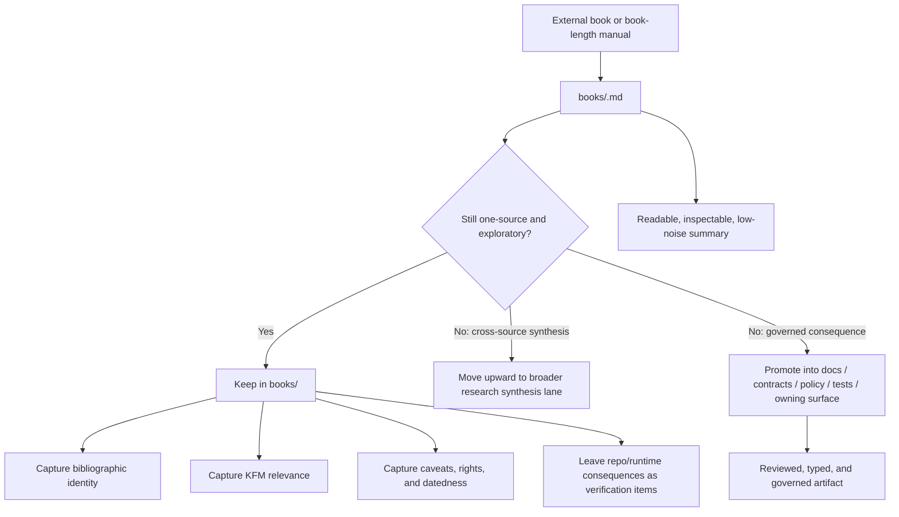

<!-- [KFM_META_BLOCK_V2]
doc_id: kfm://doc/<NEEDS_VERIFICATION_UUID>
title: KFM Research Source Summaries — Books
type: standard
version: v1
status: draft
owners: @bartytime4life
created: <NEEDS_VERIFICATION_YYYY-MM-DD>
updated: <NEEDS_VERIFICATION_YYYY-MM-DD>
policy_label: <NEEDS_VERIFICATION>
related: [docs/research/, docs/research/source_summaries/, docs/research/source_summaries/by_type/, docs/research/source_summaries/by_type/maps/, docs/research/source_summaries/by_type/web/]
tags: [kfm, research, source-summaries, books]
notes: [non-normative until promoted, replacing scaffold-only lane README, doc_id/created/updated/policy_label require verification]
[/KFM_META_BLOCK_V2] -->

<a id="top"></a>

# KFM Research Source Summaries — Books

Working lane for one-source summaries of external books that may inform KFM without becoming governed truth by default.

> **Status:** experimental  
> **Owners:** `@bartytime4life` *(broad `/docs/` ownership confirmed; narrower path ownership needs verification)*  
>      
> **Quick jumps:** [Scope](#scope) · [Repo fit](#repo-fit) · [Accepted inputs](#accepted-inputs) · [Exclusions](#exclusions) · [Directory tree](#directory-tree) · [Quickstart](#quickstart) · [Summary packet](#summary-packet) · [Promotion triggers](#promotion-triggers) · [Diagram](#diagram) · [Definition of done](#definition-of-done) · [FAQ](#faq)

> [!IMPORTANT]
> This lane is exploratory. Material here may sharpen KFM thinking, but it does **not** become policy, contract, schema, API behavior, UI truth, or runtime truth merely by being written here.

> [!NOTE]
> This README upgrades a scaffold lane. Keep the lane narrow, explicit, and easy to promote out of when a book summary starts carrying governed consequences.

## Scope

This directory is for **one-source summaries of external books**.

Use it when the source in hand is a book-length work and the output should remain a structured research artifact rather than a governed repo truth object. A good summary in this lane answers five questions quickly:

1. What does this book actually cover?
2. Why does it matter to KFM?
3. Which takeaways are strong enough to reuse?
4. Which takeaways are dated, local, vendor-shaped, or otherwise fragile?
5. What still needs direct repo, standards, or implementation verification before adoption?

Typical fit for this lane includes:

- GIS, cartography, geospatial engineering, and remote-sensing books
- web mapping, UI, accessibility, data-viz, and interaction-design books
- database, systems, runtime, security, and delivery books
- domain books that sharpen Kansas-relevant lanes such as water, hazards, transport, archives, ecology, or service geography

## Repo fit

| Field | Value |
| --- | --- |
| Path | `docs/research/source_summaries/by_type/books/README.md` |
| Upstream context | [`docs/research/`](../../../) · [`source_summaries/`](../../) · [`by_type/`](../) |
| Sibling lanes | [`maps/`](../maps/) · [`web/`](../web/) |
| Downstream / promotion rules | Start from [`docs/research/`](../../../) for research posture and promotion discipline; move governed outcomes into [`docs/`](../../../../), [`contracts/`](../../../../../contracts/), [`policy/`](../../../../../policy/), [`tests/`](../../../../../tests/), or the relevant code-owning surface after review |
| Current branch signal | This lane currently behaves like a narrow directory README surface, not a mature summary catalog |
| Role in repo | Holds **book-specific** source summaries so cross-source synthesis, evaluations, and governed consequences do not get silently mixed together |

## Accepted inputs

This lane accepts material that stays clearly inside the boundary of **one external book -> one summary artifact**.

| Accepted input | What belongs in the summary |
| --- | --- |
| Book-length technical source | Title, author/editor, edition/version, publisher/year, and access path or attachment pointer |
| Chapter or section synthesis | The strongest KFM-relevant takeaways, grouped by theme rather than copied chapter-by-chapter |
| KFM consequence notes | Which subsystem, lane, workflow, or design question the book may influence |
| Method and standards notes | Named methods, standards, interfaces, data models, or caution points the book introduces |
| Caveats and datedness | Edition age, deprecated APIs, platform bias, region-specific assumptions, or vendor lock-in |
| Rights / sensitivity note | Reuse limits, excerpt caution, or any domain sensitivity exposed by the source |
| Open verification items | What still needs direct repo evidence, current standards checking, or implementation confirmation |

## Exclusions

| Does **not** belong here | Where it goes instead |
| --- | --- |
| Web documentation, blog posts, API pages, or online product docs | [`../web/`](../web/) |
| Map sheets, atlases, cartographic plates, or map-image source summaries | [`../maps/`](../maps/) |
| Cross-source comparison, trade study, or merged synthesis across many books | [`../../`](../../) or the broader [`docs/research/`](../../../) lane |
| Governed policy, release rules, schema definitions, DTOs, or API contracts | The owning governed surface such as [`../../../../../policy/`](../../../../../policy/), [`../../../../../contracts/`](../../../../../contracts/), or implementation docs after review |
| Runtime code, ETL logic, workflow YAML, tests, fixtures, or manifests | The owning code / infra / test surface |
| Large copyrighted copies, long excerpt dumps, or “shadow books” pasted into Markdown | Keep only short justified excerpts, bibliographic identity, and summary notes |
| Repo claims that are not directly verified | Keep them out, or mark them explicitly as `UNKNOWN` / `NEEDS VERIFICATION` in a research note |

## Directory tree

### Current confirmed live tree

```text
docs/research/source_summaries/by_type/books/
└── README.md
```

<details>
<summary>Recommended growth pattern (PROPOSED)</summary>

```text
docs/research/source_summaries/by_type/books/
├── README.md
├── <book-slug>.md
├── <book-slug>.md
└── ...
```

Notes:

- Use one summary file per book.
- Do not assume a slug convention is already standardized here.
- If a local naming convention appears elsewhere in the repo later, follow that instead of forcing a new one.

</details>

## Quickstart

1. Confirm the source is genuinely **book-like** and the note will remain **single-source**.
2. Create or update one summary file for that book only.
3. Record bibliographic identity first, before interpretation.
4. Extract only the KFM-relevant takeaways.
5. Separate source-grounded statements from your own synthesis.
6. Capture caveats, datedness, and reuse limits early.
7. Name likely promotion targets if the summary starts implying governed behavior.
8. Keep the result readable enough that a maintainer can triage it in under a minute.

## Summary packet

Every per-book summary in this lane should aim to answer the following compact packet.

| Packet field | What to capture | Why it matters |
| --- | --- | --- |
| Bibliographic identity | Author/editor, title, edition, publisher, year, relevant chapters/pages | Prevents “mystery source” notes |
| Source posture | What the book is trying to do, and what it is **not** trying to do | Stops over-reading |
| Why it matters to KFM | Domain lane, subsystem, architecture question, or method it informs | Makes the summary actionable |
| Strongest takeaways | Concise, source-grounded claims worth keeping | Preserves high-signal material |
| Cautions / datedness | Deprecated tooling, version drift, regional assumptions, or weak fit | Prevents accidental adoption |
| Candidate entities / standards / methods | Named patterns, file formats, APIs, workflows, concepts, or source families | Helps later indexing and promotion |
| Promotion targets | Where a governed consequence would need to land | Keeps research from turning into shadow policy |
| Open verification steps | Repo evidence, standards check, or implementation review still needed | Keeps uncertainty visible |

### Writing rules

- **One book per file.**
- Prefer **theme clusters** over chapter-by-chapter paraphrase dumps.
- Keep quotes short and purposeful.
- Do not let a book summary quietly become a multi-source synthesis.
- Do not present repo behavior, route names, schemas, or runtime status as settled fact unless directly verified elsewhere.
- Call out deprecated or version-sensitive material early, not as a footnote at the end.
- Use KFM truth labels where they help:
  - `CONFIRMED` = grounded in the source being summarized
  - `INFERRED` = your synthesis from the source
  - `PROPOSED` = possible repo consequence or follow-on action
  - `UNKNOWN` / `NEEDS VERIFICATION` = not proven from repo or current standards

## Promotion triggers

A book summary should stay here only while it remains a research artifact. Promote or split work out when it crosses one of these lines.

| If the summary starts to... | It should move toward... |
| --- | --- |
| define KFM behavior, doctrine, or product rules | governed docs in [`../../../../`](../../../../) |
| imply a schema, DTO, contract family, or formal profile | [`../../../../../contracts/`](../../../../../contracts/) |
| imply policy classes, denial reasons, review obligations, or release conditions | [`../../../../../policy/`](../../../../../policy/) |
| require executable checks, fixtures, or negative-path proof | [`../../../../../tests/`](../../../../../tests/) |
| compare multiple sources instead of one | the broader [`../../`](../../) or [`../../../`](../../../) research surface |
| turn into implementation guidance for a specific subsystem | the owning code/documentation surface after review |

## Diagram



## Definition of done

- [ ] Source is actually a **book** and not a web page, map, or mixed-source note.
- [ ] Summary stays **single-source**.
- [ ] Bibliographic identity is present.
- [ ] KFM relevance is explicit.
- [ ] Strongest takeaways are separated from inference.
- [ ] Datedness, vendor lock, or deprecated material is called out.
- [ ] Rights / sensitivity note is present when needed.
- [ ] No long copyrighted copy is embedded.
- [ ] Promotion targets are named when the summary implies governed consequences.
- [ ] No unsupported repo or runtime claims are smuggled in as fact.

## FAQ

### Is a summary in `books/` authoritative for KFM?

No. It is research. It may inform later governed artifacts, but it does not define them here.

### What if I am comparing several books?

Do not force that into a one-book file. Move up to a broader research synthesis surface and link the source summaries back in.

### What if the source is a standards manual published as a book?

You can still summarize it here as an external book source. But any KFM contract, policy, or implementation consequence belongs in the owning governed surface after review.

### Can I paste large excerpts from the book into the summary?

No. Keep excerpts short, justified, and subordinate to the summary. This lane should not become a shadow copy of the source.

### What if the book suggests a real schema, policy, or runtime change?

Name the consequence, keep it `PROPOSED`, and promote it out. Do not leave governed behavior trapped inside a research summary.

## Appendix

<details>
<summary>Suggested lightweight per-book skeleton (PROPOSED)</summary>

```md
# <Book title>

- Source type: book
- Author/editor:
- Edition / version:
- Publisher / year:
- Access path or attachment pointer:
- Summary status: draft
- KFM relevance:

## What this source covers

## Strongest takeaways

## Caveats and datedness

## Candidate KFM consequences

## Open verification steps
```

### Suggested filename pattern

Use a simple, readable filename only if no stronger local convention exists yet.

Examples:

- `<author>-<short-title>.md`
- `<editor>-<short-title>.md`
- `<publisher-or-series>-<short-title>.md` *(only when author/editor naming is awkward)*

### Rights and reuse guardrail

This lane is for summaries, metadata, and justified short excerpts. It is not for parking large copyrighted source copies in Markdown.

### Practical review heuristic

If a maintainer cannot answer “Why is this book in the repo?” from the first screenful of the file, tighten the summary.

</details>

[Back to top](#top)