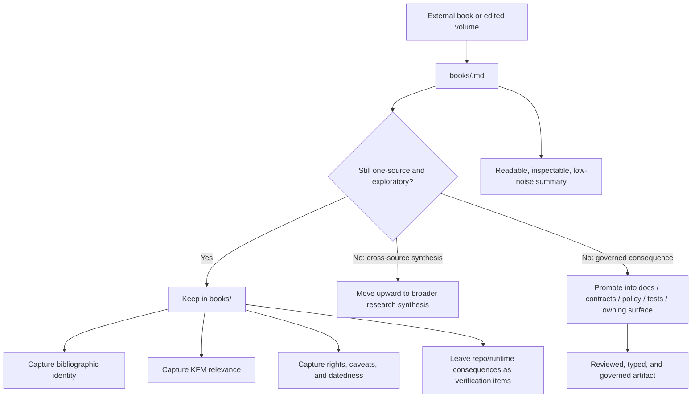

<!-- [KFM_META_BLOCK_V2]
doc_id: kfm://doc/<NEEDS_VERIFICATION_UUID>
title: KFM Research Source Summaries — Books
type: standard
version: v1
status: draft
owners: @bartytime4life
created: <NEEDS_VERIFICATION_YYYY-MM-DD>
updated: <NEEDS_VERIFICATION_YYYY-MM-DD>
policy_label: <NEEDS_VERIFICATION>
related: [docs/research/, docs/research/source_summaries/, docs/research/source_summaries/by_type/, docs/research/source_summaries/by_type/maps/, docs/research/source_summaries/by_type/web/]
tags: [kfm, research, source-summaries, books]
notes: [non-normative until promoted, replacing scaffold-only lane README, current-session workspace verification was PDF-only, doc_id/created/updated/policy_label require verification]
[/KFM_META_BLOCK_V2] -->

<a id="top"></a>

# KFM Research Source Summaries — Books

Working lane for one-source summaries of external books that may inform KFM without becoming governed truth by default.

> **Status:** experimental  
> **Owners:** `@bartytime4life` *(from the requested doc scaffold; narrower path ownership still needs direct repo verification)*  
>       
> **Quick jumps:** [Scope](#scope) · [Repo fit](#repo-fit) · [Accepted inputs](#accepted-inputs) · [Exclusions](#exclusions) · [Directory tree](#directory-tree) · [Quickstart](#quickstart) · [Usage](#usage) · [Current attached book candidates](#current-attached-book-candidates) · [Diagram](#diagram) · [Promotion triggers](#promotion-triggers) · [Task list](#task-list--definition-of-done) · [FAQ](#faq)

> [!IMPORTANT]
> Material in this lane is exploratory by default. A book summary may sharpen KFM thinking, but it does **not** become policy, contract, schema, API behavior, UI truth, or runtime truth merely by existing here.

> [!NOTE]
> This revision is grounded in the attached KFM corpus and the target path supplied for this task. Current-session workspace verification was **PDF-only**. Exact sibling file inventory under `books/` beyond this target README still needs direct repo verification.

## Scope

This directory is for **one-source summaries of external books**.

In KFM terms, a book summary is an **intake artifact**: it makes a book legible to later synthesis, cataloging, and promotion without letting a reading note masquerade as governed doctrine. Use this lane when the source in hand is genuinely book-length and the output should remain a structured research object.

A strong `books/` summary should answer five questions quickly:

1. What does this book actually cover?
2. Why does it matter to KFM?
3. Which takeaways are strong enough to keep?
4. Which takeaways are dated, regional, software-bound, vendor-shaped, or otherwise fragile?
5. What still needs direct repo, standards, or implementation verification before reuse?

Typical fit for this lane includes:

- GIS, cartography, geospatial engineering, and remote-sensing books
- web-mapping, interaction-design, and geospatial UX books
- urban planning, hazards, environment, land, and service-geography books
- systems or architecture books when they are true external books and the summary remains single-source

## Repo fit

| Field | Value |
| --- | --- |
| Path | `docs/research/source_summaries/by_type/books/README.md` |
| Upstream context | [`docs/research/`](../../../) · [`source_summaries/`](../../) · [`by_type/`](../) |
| Sibling lanes | [`maps/`](../maps/) · [`web/`](../web/) |
| Downstream / promotion targets | [`docs/`](../../../../) · [`contracts/`](../../../../../contracts/) · [`policy/`](../../../../../policy/) · [`tests/`](../../../../../tests/) after review |
| Evidence boundary for this revision | Attached KFM corpus + target path supplied in this task; exact local repo tree under `books/` remains **NEEDS VERIFICATION** |
| Role in repo | Keep **book-specific** summaries separate from cross-source synthesis, map-source summaries, web-source summaries, and governed artifacts |

## Accepted inputs

This lane accepts material that stays clearly inside the boundary of **one external book -> one summary artifact**.

| Accepted input | What belongs in the summary |
| --- | --- |
| Book-length technical or domain source | Title, author/editor, edition/version, publisher/year, and access path or attachment pointer |
| Chapter or section synthesis | Strongest KFM-relevant takeaways, grouped by theme rather than copied chapter-by-chapter |
| KFM consequence notes | Which subsystem, lane, workflow, or design question the book may influence |
| Methods / standards / concepts | Named methods, standards, interfaces, data models, or caution points the book introduces |
| Rights / reuse posture | License, excerpt caution, derivative restrictions, attribution duties, or all-rights-reserved status |
| Caveats and datedness | Edition age, deprecated APIs, region-specific assumptions, software lock-in, or discipline bias |
| Open verification items | What still needs direct repo evidence, current standards checking, or implementation confirmation |

## Exclusions

| Does **not** belong here | Where it goes instead |
| --- | --- |
| Web documentation, product docs, blogs, API pages, or online articles | [`../web/`](../web/) |
| Map sheets, atlases, plats, cartographic plates, or map-image source summaries where the **primary artifact is the map itself** | [`../maps/`](../maps/) |
| Cross-source comparisons, trade studies, or merged syntheses across multiple books | [`../../`](../../) or the broader [`docs/research/`](../../../) surface |
| Governed policy, release rules, DTOs, contracts, or formal schema definitions | The owning governed surface such as [`../../../../../policy/`](../../../../../policy/), [`../../../../../contracts/`](../../../../../contracts/), or implementation docs after review |
| Runtime code, workflow YAML, ETL logic, tests, fixtures, or manifests | The owning code / infra / test surface |
| Long copyrighted excerpts, OCR dumps, or “shadow books” pasted into Markdown | Keep only short justified excerpts, bibliographic identity, and summary notes |
| Compiled multi-source manuals or editorial synthesis packages that are **not** single-source external books | Another research lane or a more appropriate manuals / synthesis surface, with explicit exception handling if needed |

## Directory tree

### Confirmed minimum for this task

```text
docs/research/source_summaries/by_type/books/
└── README.md  # target file for this revision
```

<details>
<summary>Recommended growth pattern (PROPOSED)</summary>

```text
docs/research/source_summaries/by_type/books/
├── README.md
├── <book-slug>.md
├── <book-slug>.md
└── ...
```

Notes:

- Use one summary file per book.
- Do not assume a slug convention is already standardized here.
- If a stronger local naming convention is verified later, follow that instead of forcing a new one.

</details>

## Quickstart

1. Confirm the source is genuinely **book-like** and that the note will remain **single-source**.
2. Create or update one summary file for that book only.
3. Record bibliographic identity first, before interpretation.
4. Capture rights / reuse posture early, not at the end.
5. Extract only the KFM-relevant takeaways.
6. Separate source-grounded material from your own synthesis.
7. Name likely promotion targets if the summary starts implying governed behavior.
8. Keep the result readable enough that a maintainer can triage it in under a minute.

## Usage

### Per-book summary packet

Every per-book summary in this lane should aim to answer the following compact packet.

| Packet field | What to capture | Why it matters |
| --- | --- | --- |
| Bibliographic identity | Author/editor, title, edition, publisher, year, relevant chapters/pages | Prevents “mystery source” notes |
| Source posture | What the book is trying to do, and what it is **not** trying to do | Stops over-reading |
| Why it matters to KFM | Domain lane, subsystem, architecture question, or method it informs | Makes the summary actionable |
| Strongest takeaways | Concise, source-grounded claims worth keeping | Preserves high-signal material |
| Rights / reuse posture | License or rights status, excerpt limits, derivative restrictions, attribution duties | Keeps later reuse honest |
| Caveats / datedness | Deprecated tooling, old software versions, regional assumptions, or weak fit | Prevents accidental adoption |
| Candidate entities / standards / methods | Named patterns, file formats, APIs, workflows, concepts, or source families | Helps later indexing and promotion |
| Promotion targets | Where a governed consequence would need to land | Keeps research from turning into shadow policy |
| Open verification steps | Repo evidence, standards check, or implementation review still needed | Keeps uncertainty visible |

### Writing rules

- **One book per file.**
- Prefer **theme clusters** over chapter-by-chapter paraphrase dumps.
- Keep quotes short and purposeful.
- Call out **edition**, **software version**, and **publication year** early when they materially change fit.
- Do not let a book summary quietly become a multi-source synthesis.
- Do not present repo behavior, route names, schemas, or runtime status as settled fact unless directly verified elsewhere.
- Use KFM truth labels where they help:
  - `CONFIRMED` = directly grounded in the source being summarized
  - `INFERRED` = your synthesis from that source
  - `PROPOSED` = possible repo consequence or follow-on action
  - `UNKNOWN` / `NEEDS VERIFICATION` = not proven from repo or current standards

## Current attached book candidates

These are **current-session attached examples** that fit the `books/` lane. Their fit/caution notes below are working triage judgments and should be read as **INFERRED**, not as proof that corresponding summary files already exist under `books/`.

| Current-session attached book | Why it fits `books/` | Immediate caution to record in the summary |
| --- | --- | --- |
| *A Primer of GIS: Fundamental Geographic and Cartographic Concepts* | Foundational GIS/cartography reference with projections, coordinate systems, databases, remote sensing, and analysis | 2008 publication date; strong conceptual value, but technical examples and ecosystem assumptions may be dated |
| *GIS in Sustainable Urban Planning and Management: A Global Perspective* | Edited volume with applied urban planning, environmental quality, transport, resilience, and flood-related case studies | Edited volume; chapter relevance varies; reuse posture is more restrictive than plain CC BY |
| *Mapping Urban Spaces: Designing the European City* | Book-length design/theory source on urban space, mapping methods, and public-space interpretation | Strong regional framing around medium-sized European cities; design-theory emphasis may not transfer directly to Kansas lanes |
| *Earth, Space, and Environmental Science Explorations with ArcGIS Pro* (2nd ed.) | Applied instructional text spanning hazards, water, climate, field data, and GIS workflows | Explicit ArcGIS Pro 3.0 dependency; exercise-driven scope; software/version fit matters more than with general theory books |

## Diagram



## Promotion triggers

A book summary should stay here only while it remains a research artifact. Promote or split work out when it crosses one of these lines.

| If the summary starts to... | It should move toward... |
| --- | --- |
| define KFM behavior, doctrine, or product rules | governed docs in [`../../../../`](../../../../) |
| imply a schema, DTO, contract family, or formal profile | [`../../../../../contracts/`](../../../../../contracts/) |
| imply policy classes, denial reasons, review obligations, or release conditions | [`../../../../../policy/`](../../../../../policy/) |
| require executable checks, fixtures, or negative-path proof | [`../../../../../tests/`](../../../../../tests/) |
| compare multiple sources instead of one | the broader [`../../`](../../) or [`../../../`](../../../) research surface |
| turn into implementation guidance for a specific subsystem | the owning code/documentation surface after review |

## Task list / definition of done

- [ ] Source is actually a **book** and not a web page, map, or mixed-source note.
- [ ] Summary stays **single-source**.
- [ ] Bibliographic identity is present.
- [ ] KFM relevance is explicit.
- [ ] Strongest takeaways are separated from inference.
- [ ] Rights / reuse posture is recorded.
- [ ] Datedness, vendor lock, or deprecated material is called out.
- [ ] Promotion targets are named when the summary implies governed consequences.
- [ ] No long copyrighted copy is embedded.
- [ ] No unsupported repo or runtime claims are smuggled in as fact.

## FAQ

### Is a summary in `books/` authoritative for KFM?

No. It is research. It may inform later governed artifacts, but it does not define them here.

### Can edited volumes live in `books/`?

Yes, if the summary still stays **single-source** and is explicit about chapter-level fit, editor context, and reuse limits.

### What if I am comparing several books?

Do not force that into a one-book file. Move up to a broader research synthesis surface and link the source summaries back in.

### What if the source is a standards manual published as a book?

It can still be summarized here as an external book source. But any KFM contract, policy, or implementation consequence belongs in the owning governed surface after review.

### Can I paste large excerpts from the book into the summary?

No. Keep excerpts short, justified, and subordinate to the summary. This lane should not become a shadow copy of the source.

### What if the book suggests a real schema, policy, or runtime change?

Name the consequence, keep it `PROPOSED`, and promote it out. Do not leave governed behavior trapped inside a research summary.

## Appendix

<details>
<summary>Suggested lightweight per-book skeleton (PROPOSED)</summary>

```md
# <Book title>

- Source type: book
- Author/editor:
- Edition / version:
- Publisher / year:
- Rights / reuse posture:
- Access path or attachment pointer:
- Summary status: draft
- KFM relevance:

## What this source covers

## Strongest takeaways

## Caveats, rights, and datedness

## Candidate KFM consequences

## Open verification steps
```

### Suggested filename pattern

Use a simple, readable filename only if no stronger local convention exists yet.

Examples:

- `<author>-<short-title>.md`
- `<editor>-<short-title>.md`
- `<publisher-or-series>-<short-title>.md` *(only when author/editor naming is awkward)*

### Current-session edge cases worth routing carefully

- Compiled synthesis manuals built from **multiple** source books should not automatically be treated as `books/` summaries.
- Editorial improvement editions, architecture manuals, and corpus syntheses may be book-length, but they are not always the same thing as an external single-source book.
- If the primary artifact being analyzed is the **map inside the book**, summarize the book here and route the map itself to [`../maps/`](../maps/) when it becomes the main evidence object.

### Rights and reuse guardrail

This lane is for summaries, metadata, and justified short excerpts. It is not for parking large copyrighted source copies in Markdown.

### Practical review heuristic

If a maintainer cannot answer “Why is this book in the repo?” from the first screenful of the file, tighten the summary.

</details>

[Back to top](#top)
