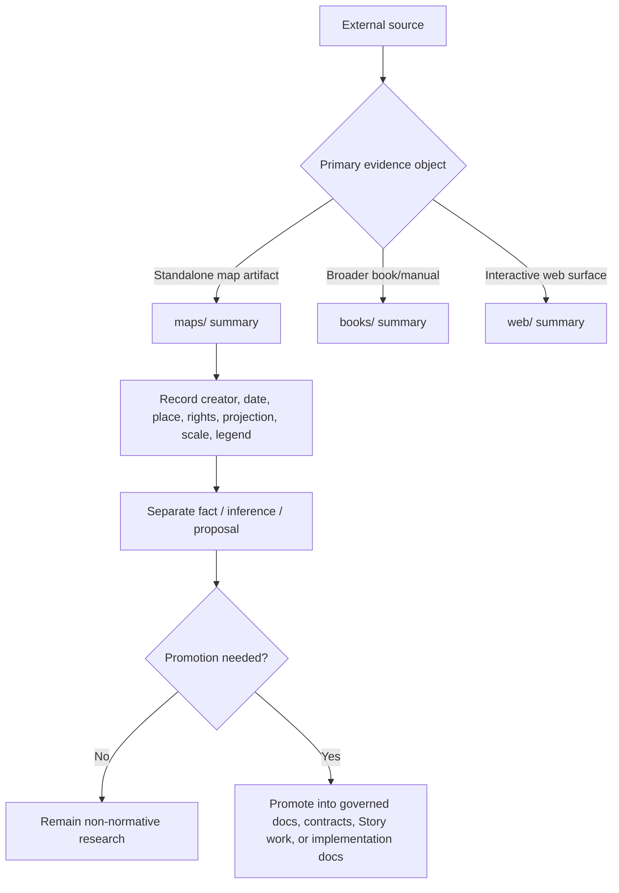

<!-- [KFM_META_BLOCK_V2]
doc_id: kfm://doc/NEEDS_VERIFICATION_UUID
title: maps
type: standard
version: v1
status: draft
owners: @bartytime4life
created: NEEDS_VERIFICATION_YYYY-MM-DD
updated: NEEDS_VERIFICATION_YYYY-MM-DD
policy_label: NEEDS_VERIFICATION
related: [../README.md, ../../README.md, ../../../README.md, ../../../../README.md, ../../../../../README.md, ../books/README.md, ../web/README.md]
tags: [kfm, research, source_summaries, maps]
notes: [Current branch-visible file was a scaffold before this revision; doc_id and historical created/updated dates need verification before commit.]
[/KFM_META_BLOCK_V2] -->

# maps

Structured summaries of map sources that inform KFM research without becoming governed truth by default.

> **Status:** experimental  
> **Owners:** `@bartytime4life`  
>       
> **Quick jumps:** [Scope](#scope) · [Repo fit](#repo-fit) · [Accepted inputs](#accepted-inputs) · [Exclusions](#exclusions) · [Directory tree](#directory-tree) · [Quickstart](#quickstart) · [Usage](#usage) · [Diagram](#diagram) · [Tables](#tables) · [Task list](#task-list--definition-of-done) · [FAQ](#faq) · [Appendix](#appendix)
>
> [!IMPORTANT]
> This lane is **non-normative until promoted**. A summary here may inform contracts, schemas, Story Nodes, UI behavior, or Focus Mode later, but it does **not** define them from this directory.
>
> [!NOTE]
> **Current branch signal (CONFIRMED):** this folder is currently visible as a scaffold directory with a single `README.md`. The per-source filename pattern documented below is therefore a **PROPOSED** working shape for future branch use.

## Scope

`maps/` is the by-type lane for one-source markdown summaries whose primary evidence object is a **map**.

Use it when the map itself is what needs to be inspected, described, compared, or routed into later KFM work: a standalone sheet, atlas plate, plat, thematic map, georeferenced scan, participatory sketch map, field map, or a documented snapshot of a web map whose visible cartographic state is itself the source-bearing artifact.

Keep this lane disciplined. It is for **structured source summaries**, not for raw imagery dumps, ad hoc screenshots with no provenance, or normative renderer/style law.

## Repo fit

| Item | Value |
|---|---|
| Path | `docs/research/source_summaries/by_type/maps/README.md` |
| Role | Directory README for map-source summaries inside the research subtree |
| Upstream | [`../README.md`](../README.md) · [`../../README.md`](../../README.md) · [`../../../README.md`](../../../README.md) · [`../../../../README.md`](../../../../README.md) · [`../../../../../README.md`](../../../../../README.md) |
| Adjacent by-type lanes | [`../books/README.md`](../books/README.md) · [`../web/README.md`](../web/README.md) |
| Current branch-visible contents | `README.md` |
| Recommended additions | **PROPOSED:** `./<source-slug>.md` per summarized map source |
| Promotion destinations | Governed docs, subsystem docs, Story work, implementation docs, schemas, or app/runtime surfaces after review |

Working routing rule:

- Choose `maps/` when the **map artifact** is what you are summarizing.
- Choose `books/` when the map is subordinate to a broader book source.
- Choose `web/` when the primary evidence is a live or documented web surface rather than a map artifact alone.

> [!NOTE]
> Everything below the confirmed path and sibling-lane structure is a **PROPOSED lane contract** built upward from the current repo shape and the research subtree’s operating rules.

## Accepted inputs

Accepted here:

- standalone map sheets
- atlas plates and map folios
- thematic maps and analytical map figures
- cadastral maps, plats, parcel or tenure maps
- historical scanned maps with source metadata
- documented web-map snapshots where the captured map state is the source
- participatory, sketch, or field maps with provenance and rights notes
- cartographic exemplars used to study projection, symbolization, annotation, legend design, or evidence cues

## Exclusions

Do **not** put these here:

- authoritative KFM policy, contract, or schema definitions
- production style registries, layer metadata contracts, or renderer rules
- raw datasets, tiles, rasters, or vector packages that belong under `data/`
- large copyrighted copies used as silent surrogates for summary writing
- uncited public claims intended for Story Nodes or Focus Mode
- implementation notes that belong first in subsystem docs, `apps/`, `packages/`, `tests/`, or governed runbooks
- precise sensitive locations, culturally sensitive directions, or exact-site disclosure that lacks a review posture

When in doubt, keep the **summary** here and move only the **promoted rule** elsewhere.

## Directory tree

```text
docs/research/source_summaries/by_type/maps/
├── README.md                      # lane contract (CONFIRMED)
└── <source-slug>.md               # one map-source summary (PROPOSED)
```

Recommended filename shape:

```text
<creator-or-institution>--<short-title>--<year>.md
```

Examples:

```text
usgs--kansas-topographic-sheet-abilene--1956.md
kdot--district-highway-map--2024.md
khs--sanborn-map-topeka-plate-12--1912.md
```

## Quickstart

1. Confirm that the **map** is the primary source object.
2. Create one summary file using the recommended per-source pattern.
3. Record the source facts first: creator, title, date or edition, place coverage, time coverage, and rights or reuse notes.
4. Add map-specific inspection notes: projection or CRS if known, scale/support/resolution if known, legend/symbolization observations, georeferencing status, and known limitations.
5. Separate **fact**, **inference**, and **proposal** before naming any KFM promotion target.

> [!TIP]
> If georeferencing, projection, scale, or rights status is unknown, say so explicitly. A clean uncertainty note is better than a confident fiction.

## Usage

### Choose the right by-type lane

| Primary evidence object | Use this lane | Typical result |
|---|---|---|
| Standalone map sheet, atlas plate, plat, or map figure | `maps/` | One-source map summary |
| Book or manual where maps are embedded within a broader text source | `books/` | Book summary with map references inside it |
| Live map site, API-driven web map, story map, or other interactive web surface | `web/` | Web-source summary focused on behavior, state, and access pattern |

### Minimum summary fields

| Field | Minimum expectation | Why it matters |
|---|---|---|
| Source slug | Stable kebab-case identifier | Keeps summaries linkable and reviewable |
| Source title | As shown on the source | Prevents drift |
| Creator / publisher | Person, institution, or unknown | Ownership and provenance |
| Date / edition | Exact if known; otherwise explicit approximation | Time meaning |
| Geographic coverage | Place, region, extent, or sheet footprint | Spatial scope |
| Temporal coverage | As-of date, publication date, historical period, or unknown | Interpretation boundary |
| Source class | Sheet, atlas plate, plat, sketch map, web-map snapshot, etc. | Routing and review |
| Projection / CRS / georeferencing | Record what is known; mark unknowns | Reuse and alignment |
| Scale / support / resolution | Numeric if known; otherwise qualitative note | Fitness for use |
| Legend / symbology notes | Short note on what the map emphasizes | Meaning and comparability |
| Rights / reuse posture | Public domain, licensed, restricted, unknown, etc. | Publication safety |
| KFM relevance | Which lane, question, or thin slice it may inform | Promotion routing |
| Sensitivity / precision notes | Exact locations, tenure, heritage, or cultural concerns | Review burden |
| Truth posture | Separate observed fact from inference and proposal | KFM discipline |

### Working summary shape

A good map summary usually answers five questions quickly:

1. What is this map?
2. Who made it, when, and for what audience?
3. What does it show well?
4. What does it omit, generalize, or distort?
5. What, if anything, should KFM do with it next?

### Map-specific review prompts

Use these prompts while writing:

- Is the source a **map artifact** or merely an illustration inside another source?
- Does the map expose or imply a projection, CRS, datum, georeferencing method, or scale?
- Does the symbolization make a persuasive claim that should be called out explicitly?
- Are there rights, licensing, cultural sensitivity, land-tenure, or exact-location concerns?
- Would KFM use this source as observational evidence, documentary context, design inspiration, or only as a comparative reference?

## Diagram



## Tables

### Working map-source classes

| Map source class | Typical use in this lane | Special watchpoints |
|---|---|---|
| Reference / topographic map | Orientation, basemap comparison, historical or steward context | Scale, edition date, projection, outdated names |
| Thematic / analytical map | Understand a claim made through symbolization | Classification choices, legend logic, omitted uncertainty |
| Cadastral / plat / parcel map | Land-tenure, legal description, parcel or plat context | Rights, identity resolution, review-bearing precision |
| Historical scan / atlas plate | Archival comparison, boundary history, settlement or infrastructure context | Georeferencing uncertainty, degraded legibility, reuse constraints |
| Web-map snapshot | Capture a specific visible map state for later evaluation | Date captured, zoom/extent, source credits, reproducibility |
| Participatory / sketch / field map | Community knowledge, field notes, route or place memory | Sensitivity, authorship, context loss, informal georeferencing |

### Promotion cues

| If the summary starts doing this... | It likely needs promotion |
|---|---|
| Defining renderer, style, or delivery rules | Move toward governed architecture or subsystem docs |
| Establishing a reusable contract or schema field | Move toward `contracts/` or `schemas/` after review |
| Supplying evidence for a public narrative or answer path | Move toward Story / Focus / governed evidence flow |
| Acting as the canonical statement of a Kansas domain fact | Move toward governed domain documentation or data artifacts |

## Task list & definition of done

A map-source summary in this lane is ready for review when:

- [ ] the source is clearly identified and the map is actually the primary evidence object
- [ ] creator, title, and date or edition are recorded, or explicit unknowns are stated
- [ ] geographic and temporal scope are named
- [ ] projection / CRS / georeferencing status is recorded if available
- [ ] scale / support / resolution is recorded if available
- [ ] rights / reuse posture is captured
- [ ] sensitivity, precision, or cultural/heritage concerns are called out
- [ ] observed facts are separated from inference and proposal
- [ ] a plausible KFM relevance note is included
- [ ] any normative consequence is labeled as a promotion target rather than declared here as settled system law

## FAQ

### When should I use `maps/` instead of `books/`?

Use `maps/` when the map itself is the thing you are interrogating. If the real source under review is a whole book or manual, summarize that in `books/` and point to the relevant map there.

### Do screenshots of web maps belong here?

Sometimes. If the captured map state is the source object you need to discuss, document the capture context carefully and summarize it here. If the real subject is the live web surface, interaction model, or service behavior, use `web/` instead.

### What if the source does not say which projection or CRS it uses?

Record `UNKNOWN` plainly. Do not infer a projection from appearance unless you label that statement as inference.

### Can historical maps be summarized here even if they are not georeferenced?

Yes. Georeferencing is useful, but not required. Historical, sketch, and atlas sources still belong here when their cartographic or documentary value matters.

### When does a summary stop being research and start being governed documentation?

When it begins to define KFM behavior, release-bearing policy, contract shape, renderer logic, or public truth claims. At that point, keep the research note, but promote the rule.

## Appendix

<details>
<summary>Minimal per-source summary template</summary>

```md
# <source title>

One-paragraph purpose statement for why this map matters to KFM.

## Source facts

| Field | Value |
|---|---|
| Source slug | `<source-slug>` |
| Creator / publisher | |
| Date / edition | |
| Source class | |
| Geographic coverage | |
| Temporal coverage | |
| Rights / reuse posture | |
| Projection / CRS / georeferencing | |
| Scale / support / resolution | |

## What the map shows

Brief factual summary of the map’s visible content, legend, labels, and emphasized relationships.

## Observations

- **CONFIRMED:** ...
- **CONFIRMED:** ...

## Inferences

- **INFERRED:** ...

## Risks / limits

- uncertainty
- outdated coverage
- rights or reuse constraints
- sensitivity or precision concerns

## KFM relevance

Which domain lane, thin slice, dossier, Story path, or design question this source could inform.

## Promotion note

- **PROPOSED destination:** ...
- **Do not promote yet because:** ...
```

</details>

<details>
<summary>Compact review prompts for map-heavy sources</summary>

- What is the map trying to persuade the reader to see first?
- Which symbols, labels, or class breaks carry the strongest claim?
- Is the map more trustworthy as observation, interpretation, advocacy, or design reference?
- Does the source expose enough metadata to reuse safely?
- What would be lost if the map were detached from its caption, legend, scale bar, or publication context?
- Would this source still be useful if KFM had to generalize or withhold exact locations?

</details>

[Back to top](#maps)