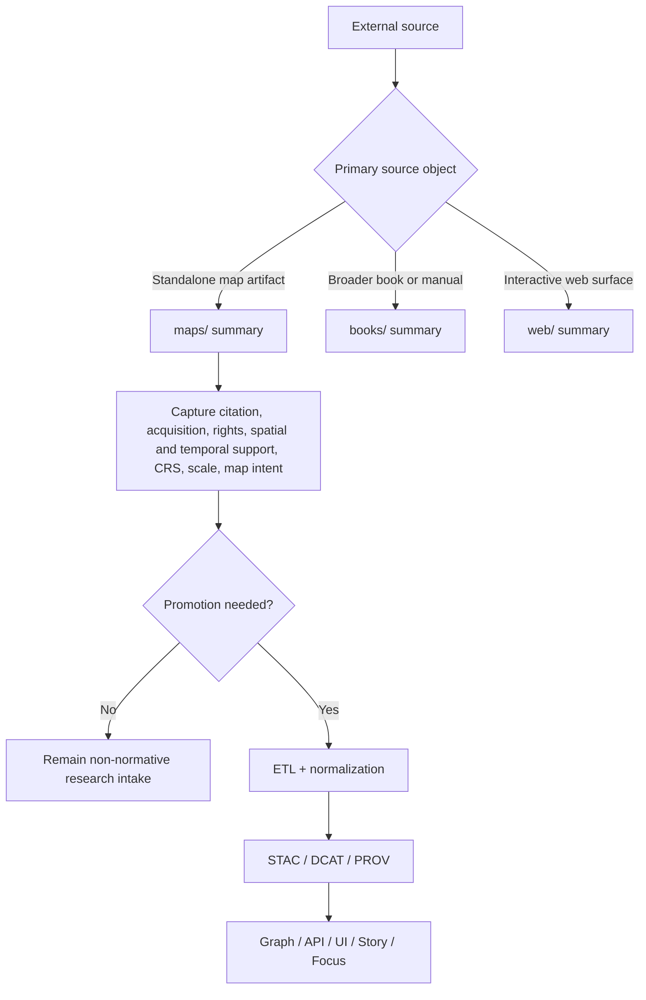

<!-- [KFM_META_BLOCK_V2]
doc_id: kfm://doc/NEEDS_VERIFICATION_UUID
title: maps
type: standard
version: v1
status: draft
owners: @bartytime4life
created: NEEDS_VERIFICATION_YYYY-MM-DD
updated: NEEDS_VERIFICATION_YYYY-MM-DD
policy_label: NEEDS_VERIFICATION
related: [../README.md, ../../README.md, ../../../README.md, ../../../../README.md, ../../../../../README.md, ../books/README.md, ../web/README.md]
tags: [kfm, research, source_summaries, maps]
notes: [Supplied file content was the immediate revision baseline; doc_id, historical dates, policy_label, and neighboring-link resolution need verification before commit because the mounted repo tree was not directly visible in this session.]
[/KFM_META_BLOCK_V2] -->

# maps

Structured summaries of map sources that inform KFM research and later governed work without becoming governed truth by default.

> **Status:** experimental  
> **Owners:** `@bartytime4life`  
>       
> **Repo fit:** Directory README for `docs/research/source_summaries/by_type/maps/` · Upstream: [`../README.md`](../README.md) · [`../../README.md`](../../README.md) · [`../../../README.md`](../../../README.md) · [`../../../../README.md`](../../../../README.md) · [`../../../../../README.md`](../../../../../README.md) · Adjacent lanes: [`../books/README.md`](../books/README.md) · [`../web/README.md`](../web/README.md)  
> **Quick jumps:** [Scope](#scope) · [Repo fit](#repo-fit) · [Accepted inputs](#accepted-inputs) · [Exclusions](#exclusions) · [Directory tree](#directory-tree) · [Quickstart](#quickstart) · [Usage](#usage) · [Diagram](#diagram) · [Tables](#tables) · [Task list](#task-list--definition-of-done) · [FAQ](#faq) · [Appendix](#appendix)
>
> [!IMPORTANT]
> This lane is **non-normative until promoted**. A summary here can influence ETL planning, catalog work, graph linkage, Story work, or Focus Mode later, but it does **not** define those governed surfaces from this directory.
>
> [!NOTE]
> Maps are both documentary sources and spatial artifacts. A useful summary therefore needs more than a bibliography entry: it should capture provenance, rights posture, spatial and temporal support, and enough cartographic detail to keep later reuse honest.

## Scope

`maps/` is the by-type lane for one-source Markdown summaries whose **primary evidence object is a map**.

Use it when the map itself is the thing under inspection: a standalone sheet, atlas plate, plat, georeferenced scan, thematic map PDF, vector map product, or a documented capture of a web-map state whose cartographic view is the source-bearing artifact.

Keep the lane disciplined. It exists to turn a map into a structured research intake record: what the map is, what it claims, what it can support, what it leaves ambiguous, and what burdens follow it downstream. It is not the place where renderer rules, public narrative claims, contracts, or canonical system behavior become settled law.

## Repo fit

| Item | Value |
|---|---|
| Path | `docs/research/source_summaries/by_type/maps/README.md` |
| Role | Directory README for map-type source summaries in the research subtree |
| Upstream | [`../README.md`](../README.md) · [`../../README.md`](../../README.md) · [`../../../README.md`](../../../README.md) · [`../../../../README.md`](../../../../README.md) · [`../../../../../README.md`](../../../../../README.md) |
| Adjacent lanes | [`../books/README.md`](../books/README.md) · [`../web/README.md`](../web/README.md) |
| Downstream use | May later inform ETL normalization, STAC/DCAT/PROV closure, graph linkage, API delivery, UI overlays, Story Nodes, or Focus Mode **after** review and promotion |
| Governing posture | Research intake only; promotion is required before this lane has runtime or publication effect |
| Working filename pattern | **PROPOSED:** one summary file per map source, using a stable slug |

## Accepted inputs

Accepted here:

- standalone map sheets and map PDFs
- atlas plates, folios, and plate-level extracts where the map is the primary source object
- cadastral maps, plats, parcel or tenure maps
- thematic or analytical maps
- historical scans and georeferenced rasters
- vector map products when the map artifact, not just the underlying dataset, is under review
- documented snapshots of web maps when the captured map state is itself the evidence-bearing object
- participatory, sketch, or field maps with provenance and rights notes

## Exclusions

Do **not** put these here:

- books, papers, or manuals where maps are only embedded illustrations — use [`../books/README.md`](../books/README.md) instead
- general websites, live map applications, or interaction behavior reviews — use [`../web/README.md`](../web/README.md) instead
- authoritative KFM policy, schema, or contract definitions
- production style registries, layer catalogs, or renderer rules
- raw datasets, tiles, rasters, or vector packages that belong under `data/`
- large copyrighted copies used as quiet substitutes for a real summary
- uncited public claims intended for Story Nodes or Focus Mode
- exact sensitive locations, culturally sensitive directions, or precise-site disclosure without review posture

When in doubt, keep the **summary** here and move only the **promoted rule** elsewhere.

## Directory tree

```text
docs/research/source_summaries/by_type/maps/
├── README.md                # lane contract / directory guidance
└── <source-slug>.md         # one map-source summary (PROPOSED working shape)
```

Recommended slug shape:

```text
<creator-or-institution>--<short-title>--<year>.md
```

Examples:

```text
usgs--kansas-topographic-sheet-abilene--1956.md
kdot--district-highway-map--2024.md
khs--sanborn-map-topeka-plate-12--1912.md
```

## Quickstart

1. Confirm that the **map** is the primary source object, not merely an illustration inside a broader source.
2. Create one summary file using a stable slug.
3. Record source facts first: citation, acquisition path, rights posture, and any repository or accession identifier.
4. Add map-specific inspection notes: map class, spatial coverage, temporal meaning, scale, CRS/projection/georeferencing status, legend/symbology cues, and known limitations.
5. Separate **CONFIRMED**, **INFERRED**, **PROPOSED**, **UNKNOWN**, and **NEEDS VERIFICATION** statements before naming any downstream KFM use.

> [!TIP]
> If CRS, georeferencing, scale, rights status, or depicted-time semantics are unclear, say so plainly. Clean uncertainty is better than a confident fiction.

## Usage

### Choose the right by-type lane

| Primary source object | Use this lane | Typical result |
|---|---|---|
| Standalone map sheet, atlas plate, plat, georeferenced scan, or thematic map artifact | `maps/` | One-source map summary |
| Book or manual with maps embedded in a broader textual source | `books/` | Book summary with map references inside it |
| Live map site, story map, API-driven map application, or other interactive web surface | `web/` | Web-source summary focused on behavior, state, and access pattern |

### Minimum summary fields

| Field | Minimum expectation | Why it matters |
|---|---|---|
| Source slug | Stable kebab-case identifier | Keeps summaries linkable and reviewable |
| Full citation / source title | Record exactly what the source calls itself | Prevents title drift |
| Acquisition / repository | Where the map was obtained; accession or catalog ID if known | Preserves provenance |
| Creator / publisher | Person, institution, or explicit unknown | Ownership and authority context |
| Date / edition / plate / sheet | Exact if known; otherwise explicit approximation | Time meaning and version control |
| Source class / source role | Sheet, atlas plate, plat, scan, vector map product, documented snapshot; note observational/interpreted/modeled/derived when known | Keeps source-role discipline visible |
| Geographic coverage | Place, extent, sheet footprint, or region | Spatial scope |
| Temporal coverage | Publication time, depicted time, survey time, or unknown | Interpretation boundary |
| Rights / reuse posture | Public domain, licensed, restricted, unclear, or unknown | Publication safety |
| CRS / projection / datum / georeferencing | Record what is known; mark unknowns explicitly | Reuse, alignment, and QA |
| Scale / support / resolution | Printed scale, scan quality, raster resolution, or qualitative note | Fitness for use |
| Legend / symbology / emphasis | Brief note on what the map foregrounds | Makes cartographic claims inspectable |
| Candidate KFM relevance | Which place, event, organization, question, or lane this may inform | Promotion routing |
| Sensitivity / precision note | Exact locations, cultural concerns, archival restrictions, privacy, or none known | Review burden |
| Truth posture | Keep observed fact separate from inference and proposal | KFM discipline |

### Working summary shape

A strong map summary usually answers five questions quickly:

1. **What is this map?**
2. **Who made it, when, and for what apparent audience or purpose?**
3. **What does it show especially well?**
4. **What does it omit, simplify, generalize, or distort?**
5. **What, if anything, should KFM do with it next?**

### Map-specific review prompts

Use these prompts while writing:

- Is the source a **map artifact** or merely a figure inside another source?
- Does the map expose or imply a projection, CRS, datum, georeferencing method, or scale?
- Are publication time and depicted time the same, or materially different?
- What symbols, labels, class breaks, or omissions carry the strongest claim?
- Are there rights, licensing, cultural sensitivity, land-tenure, or exact-location concerns?
- Should KFM use this as observational evidence, documentary context, design reference, or only comparative background?

## Diagram



## Tables

### Working map-source classes

| Map source class | Typical use in this lane | Special watchpoints |
|---|---|---|
| Reference / topographic map | Orientation, basemap comparison, steward context, boundary history | Edition date, scale, projection, outdated names |
| Thematic / analytical map | Understand a claim made through symbolization | Classification logic, legend choices, omitted uncertainty |
| Cadastral / plat / parcel map | Land-tenure, parcel, survey, or legal-description context | Precision burden, reuse rights, identity resolution |
| Historical scan / atlas plate | Archival comparison, settlement or infrastructure history | Georeferencing uncertainty, degraded legibility, reuse limits |
| Web-map snapshot | Capture a visible map state for later evaluation | Capture date, zoom/extent, source credits, reproducibility |
| Participatory / sketch / field map | Community knowledge, field notes, route or place memory | Sensitivity, authorship, context loss, informal georeferencing |

### Promotion cues

| If the summary starts doing this... | It likely needs promotion |
|---|---|
| Defining renderer, style, or delivery rules | Move toward governed architecture or subsystem docs |
| Establishing a reusable contract or schema field | Move toward `contracts/` or `schemas/` after review |
| Supplying evidence for a public narrative or answer path | Move toward Story / Focus / governed evidence flow |
| Acting as the canonical statement of a Kansas domain fact | Move toward governed domain documentation or data artifacts |
| Depending on georeferencing, reprojection, or resampling that materially changes support or accuracy | Move toward ETL + catalog + provenance artifacts, not just prose |

## Task list & definition of done

A map-source summary in this lane is ready for review when:

- [ ] the source is clearly identified and the map is actually the primary evidence object
- [ ] citation, acquisition path, and creator/publisher are recorded, or explicit unknowns are stated
- [ ] geographic and temporal scope are named
- [ ] rights / reuse posture is captured
- [ ] source class and any observational/interpreted/modeled/derived posture are visible
- [ ] projection / CRS / datum / georeferencing status is recorded if available
- [ ] scale / support / resolution is recorded if available
- [ ] known limitations, distortions, or legibility issues are called out
- [ ] sensitivity, precision, or cultural/heritage concerns are noted where relevant
- [ ] observed facts are separated from inference and proposal
- [ ] a plausible KFM relevance note is included
- [ ] any normative consequence is labeled as a promotion target rather than declared here as settled system law

## FAQ

### When should I use `maps/` instead of `books/`?

Use `maps/` when the map itself is the thing you are interrogating. If the real source under review is a whole book or manual, summarize that in `books/` and point to the map there.

### Do screenshots of web maps belong here?

Sometimes. If the captured cartographic state is the source object you need to discuss, document the capture context carefully and summarize it here. If the real subject is the live web surface, interaction model, or service behavior, use `web/` instead.

### What if the map does not state which projection or CRS it uses?

Record `UNKNOWN` plainly. Do not infer analytical correctness from visual alignment alone.

### Can historical maps be summarized here even if they are not georeferenced?

Yes. Georeferencing is useful, but not required. Historical, sketch, and atlas sources still belong here when their cartographic or documentary value matters.

### When does a summary stop being research and start being governed documentation?

When it begins to define KFM behavior, release-bearing policy, contract shape, renderer logic, or public truth claims. At that point, keep the research note, but promote the rule.

## Appendix

<details>
<summary>Minimal per-source summary template</summary>

```md
# <source title>

One-paragraph purpose statement for why this map matters to KFM.

## Source facts

| Field | Value |
|---|---|
| Source slug | `<source-slug>` |
| Full citation | |
| Acquisition / repository | |
| Creator / publisher | |
| Date / edition / plate / sheet | |
| Source class / source role | |
| Geographic coverage | |
| Temporal coverage | |
| Rights / reuse posture | |
| Projection / CRS / datum / georeferencing | |
| Scale / support / resolution | |

## What the map shows

Brief factual summary of the map’s visible content, legend, labels, and emphasized relationships.

## Observations

- **CONFIRMED:** ...
- **CONFIRMED:** ...

## Inferences

- **INFERRED:** ...

## Risks / limits

- uncertainty
- outdated or partial coverage
- rights or reuse constraints
- sensitivity or precision concerns
- georeferencing or transformation caveats

## KFM relevance

Which place, event, organization, dossier, Story path, or design question this source could inform.

## Promotion note

- **PROPOSED destination:** ...
- **Do not promote yet because:** ...
```

</details>

<details>
<summary>Compact review prompts for map-heavy sources</summary>

- What is the map trying to persuade the reader to see first?
- Which labels, symbols, or class breaks carry the strongest claim?
- Is the map most trustworthy as observation, interpretation, advocacy, or design reference?
- What metadata is missing that would block safe reuse?
- What would be lost if the map were detached from its caption, legend, scale bar, marginalia, or repository record?
- Would this source still be safe to use if KFM had to generalize or withhold exact locations?

</details>

[Back to top](#maps)
