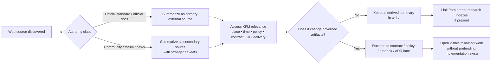

<!-- [KFM_META_BLOCK_V2]
doc_id: kfm://doc/<uuid-needs-verification>
title: Web Source Summaries
type: standard
version: v1
status: draft
owners: <owners-needs-verification>
created: 2026-03-25
updated: 2026-03-25
policy_label: <policy_label-needs-verification>
related: [<related-paths-needs-verification>]
tags: [kfm, research, web, source-summaries]
notes: [Source-bounded draft; owners, policy label, and live directory inventory need verification.]
[/KFM_META_BLOCK_V2] -->

# Web Source Summaries
Derived, reviewable summaries of web sources used in KFM research, standards checking, and implementation comparison.

> [!IMPORTANT]
> **Status:** draft  
> **Owners:** NEEDS VERIFICATION  
>       
> **Quick jump:** [Scope](#scope) · [Repo fit](#repo-fit) · [Inputs](#inputs) · [Exclusions](#exclusions) · [Quickstart](#quickstart) · [Diagram](#diagram) · [Tables](#tables) · [Task list](#task-list) · [Appendix](#appendix)

> [!WARNING]
> This directory is for **derived summaries**, not canonical truth objects. Web sources can inform KFM doctrine, contracts, policy, UI, and standards posture, but they do not outrank governed KFM doctrine, repo-verified implementation, or released evidence artifacts.

## Scope

This directory exists to hold concise, inspectable write-ups of **web sources** that matter to Kansas Frontier Matrix work: standards pages, official product documentation, government guidance, release notes, research project pages, and other externally hosted material that influences design, verification, delivery, or domain interpretation.

The role of a summary here is deliberately narrow:

- capture what the source says,
- record **when** it was consulted,
- state **why** it matters to KFM,
- separate **source-grounded claims** from **local interpretation**, and
- surface any required follow-on work instead of letting implications disappear into prose.

In KFM terms, this directory belongs to the **research / documentary / derived** side of the system. It supports decision-making and implementation review, but it is not a substitute for the governed truth path, a policy decision, a contract file, a release artifact, or an evidence bundle.

## Repo fit

| Relationship | Link | Status | Purpose |
|---|---|---:|---|
| Current file | `docs/research/source_summaries/by_type/web/README.md` | **CONFIRMED** | Requested target path for this draft |
| Parent directory (`by_type/`) | [`../`](../) | **INFERRED** | Higher-level grouping for source summaries by type |
| Summary root (`source_summaries/`) | [`../../`](../../) | **INFERRED** | Expected parent hub for cross-type source summaries |
| Child summaries in this directory | [`./`](./) | **PROPOSED** | Individual web-source summary files; live inventory was not visible in this session |

**Repo fit, operationally:** this README should behave like a directory contract. It should help contributors understand what belongs in the `web/` lane, how summaries should be structured, and what must be escalated into stronger KFM artifacts when a web source materially affects doctrine, contracts, policy, delivery, or UI behavior. That shape matches the repo's broader README-heavy documentation pattern reported elsewhere in project evidence, even though this session did not expose the live tree for direct re-verification.

## Inputs

Accepted inputs for this directory are external, web-hosted sources that are worth retaining as reviewable summaries.

| Accepted input class | Admit? | Required treatment |
|---|---|---|
| Official standards/specifications | **Yes** | Prefer primary sources; record retrieval date and exact standard/profile relevance |
| Official product docs, API references, changelogs, release notes | **Yes** | Mark vendor/product scope clearly; flag version sensitivity |
| Government or institutional guidance | **Yes** | Capture jurisdiction, applicability, and date sensitivity |
| Academic or lab project pages | **Yes, conditionally** | Record method/coverage caveats and whether the page is authoritative or descriptive |
| Official repo docs / release pages | **Yes** | Distinguish released behavior from roadmap or discussion-only material |
| Community docs, issue threads, forums, Q&A | **Conditionally** | Use only when primary docs are silent; label as secondary and caveated |
| News coverage | **Conditionally** | Use for time-sensitive ecosystem shifts; never treat as sole technical authority when primary sources exist |

Every admitted source summary should answer five questions:

1. What exactly is the source?
2. Why was it consulted?
3. What does it claim?
4. How strong is that source for the claim being made?
5. What KFM action, if any, follows from it?

## Exclusions

What does **not** belong here:

| Exclusion | Why it does not belong here | Goes instead |
|---|---|---|
| Raw source captures, full-page copies, PDFs, screenshots, OCR dumps | This lane is for summaries, not source custody or mirror storage | Evidence/capture storage location **NEEDS VERIFICATION** |
| Canonical schemas, contracts, policy bundles, fixtures, or proof packs | Those are governed artifacts, not documentary summaries | Canonical contract/policy/test surfaces, not this directory |
| Final publication decisions, approvals, or review records | Summaries may inform decisions but do not replace them | Review / release / correction artifacts |
| Unlabeled opinion, speculation, or “heard somewhere” notes | KFM requires visible evidence posture and bounded interpretation | Discard, or restate with explicit uncertainty |
| Long copied excerpts from copyrighted web pages | This directory should summarize, not duplicate | Replace with concise paraphrase and citation details |

A useful rule of thumb: if a file changes runtime behavior, governs publication, or must pass validation, it probably does **not** belong in `source_summaries/by_type/web/`.

## Directory tree

```text
docs/research/source_summaries/by_type/web/
├── README.md
└── <web-source-summary>.md    # PROPOSED summary file pattern; live inventory NEEDS VERIFICATION
```

## Quickstart

1. Create a new summary file in this directory.
2. Record the source identity first: title, publisher/owner, URL, retrieval date, and authority class.
3. State the KFM reason for consulting it: standards recheck, implementation comparison, ecosystem scan, policy clarification, accessibility guidance, domain background, or other bounded purpose.
4. Summarize the source in short sections, keeping source-grounded claims separate from local inference.
5. Mark time-sensitive material explicitly.
6. If the source implies a contract, policy, runbook, or UI change, link that implication directly instead of burying it.
7. Add the new file to any parent index pages **if those indexes exist**.

### Minimal starter skeleton

```md
# <Source title>
One-line reason this source matters to KFM.

## Source identity
- Publisher / owner:
- URL:
- Retrieved:
- Authority class:
- Source type:

## Why this was consulted

## Key takeaways

## KFM relevance

## Caveats / limits

## Follow-on work
```

## Usage

Use child summaries to answer a **specific** question, not to create generic literature notes. A good summary is scoped tightly enough that another maintainer can tell, in under a minute, whether the source is still relevant and whether anything in the repo or doctrine should change because of it.

### Per-summary minimum structure

| Section | Why it matters |
|---|---|
| Source identity | Makes the source traceable and re-checkable |
| Why this was consulted | Prevents “interesting but irrelevant” notes from accumulating |
| Key takeaways | Captures source-grounded substance without forcing the reader back out to the web |
| KFM relevance | Connects the source to a lane, subsystem, or decision surface |
| Caveats / limits | Keeps secondary, stale, or version-sensitive sources proportional |
| Follow-on work | Converts research into visible action or visible non-action |

### Recommended status language inside child summaries

| Label | Use when |
|---|---|
| **CONFIRMED** | The statement is directly supported by the cited source and fits the current summary scope |
| **INFERRED** | The source strongly implies the point, but does not state it outright |
| **PROPOSED** | The summary is recommending a KFM move based on the source |
| **UNKNOWN** | The source does not establish the answer strongly enough |
| **NEEDS VERIFICATION** | The point should not be treated as settled until a repo artifact, runtime behavior, or fresher primary source is checked |

## Diagram



## Tables

### Authority ranking for web-source summaries

| Rank | Source class | Default stance |
|---|---|---|
| 1 | Official standards, official government guidance, official vendor docs, official release notes | Preferred when available |
| 2 | Official repo docs / changelogs / issue notes from the maintaining organization | Strong, but still scope- and version-sensitive |
| 3 | Academic / lab / institutional project pages | Useful for method, context, and comparison |
| 4 | Community documentation, forums, issue discussions, Q&A | Secondary; use only when primary material is silent or incomplete |
| 5 | News coverage / commentary / blog analysis | Contextual only unless paired with stronger primary sources |

### Summary decision matrix

| Situation | Keep in this directory? | Extra rule |
|---|---|---|
| Source explains a standard or product behavior KFM depends on | **Yes** | Capture retrieval date and exact version/profile if available |
| Source is interesting background but has no clear KFM consequence | Usually **No** | Exclude or move to broader research notes if that lane exists |
| Source forces a contract/policy/UI change | **Yes**, as a summary | Also create visible follow-on work in the stronger artifact lane |
| Source is stale but historically important | **Yes, conditionally** | Mark it historical or superseded |
| Source contradicts KFM doctrine or another authoritative source | **Yes** | Record the contradiction plainly; do not flatten it away |

## Task list

A child summary in this directory is done only when the checklist below is true.

- [ ] Title, URL, publisher/owner, and retrieval date are recorded
- [ ] Authority class is stated explicitly
- [ ] The KFM reason for consulting the source is visible
- [ ] Key claims are separated from local interpretation
- [ ] Time-sensitive facts are marked as such
- [ ] Caveats / limits are present for secondary or volatile sources
- [ ] Any repo, contract, policy, UI, or runbook implication is called out explicitly
- [ ] The file avoids raw-source duplication and excessive quotation
- [ ] The summary remains readable in GitHub and easy to scan during review

## FAQ

### Are these summaries authoritative?

No. They are derived, documentary aids.

### Can community threads or issue comments be summarized here?

Yes, but only as **secondary** evidence, and only when primary documentation is missing, incomplete, or contradictory.

### Do web summaries replace repo verification?

No. If a question is about mounted implementation, repo artifacts and runtime proof outrank web summaries.

### What should happen when a web source goes stale?

Keep the summary only if the source still matters historically or comparatively; otherwise retire it from active use and mark it clearly as stale or superseded.

## Appendix

<details>
<summary><strong>Suggested child-summary template (PROPOSED)</strong></summary>

```md
<!-- [KFM_META_BLOCK_V2]
doc_id: kfm://doc/<uuid-needs-verification>
title: <Source title>
type: standard
version: v1
status: draft|review|published
owners: <owners-needs-verification>
created: YYYY-MM-DD
updated: YYYY-MM-DD
policy_label: <policy_label-needs-verification>
related: [docs/research/source_summaries/by_type/web/README.md, <other-related-paths-needs-verification>]
tags: [kfm, research, web, source-summary]
notes: [Include retrieval date and authority class in the body.]
[/KFM_META_BLOCK_V2] -->

# <Source title>
One-line purpose.

## Source identity
- Publisher / owner:
- URL:
- Retrieved:
- Authority class:
- Source type:
- Topic area:

## Why this was consulted

## Key takeaways

## KFM relevance

## Caveats / limits

## Follow-on work
```

</details>

[Back to top](#web-source-summaries)
