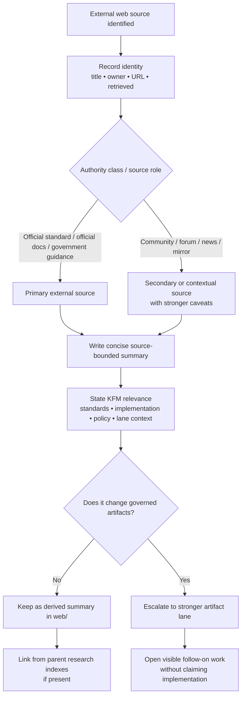

<!-- [KFM_META_BLOCK_V2]
doc_id: kfm://doc/<uuid-needs-verification>
title: Web Source Summaries
type: standard
version: v1
status: draft
owners: <owners-needs-verification>
created: 2026-03-25
updated: 2026-03-30
policy_label: <policy_label-needs-verification>
related: [<related-paths-needs-verification>]
tags: [kfm, research, web, source-summaries]
notes: [PDF-bounded revision; neighboring repo docs, owners, policy label, and live directory inventory need verification.]
[/KFM_META_BLOCK_V2] -->

# Web Source Summaries
Derived, reviewable summaries of external web sources consulted for KFM research, standards checks, and implementation comparison.

> [!IMPORTANT]
> **Status:** experimental · **Doc status:** draft  
> **Owners:** NEEDS VERIFICATION  
>       
> **Quick jump:** [Scope](#scope) · [Repo fit](#repo-fit) · [Inputs](#inputs) · [Exclusions](#exclusions) · [Quickstart](#quickstart) · [Usage](#usage) · [Diagram](#diagram) · [Tables](#tables) · [Task list](#task-list) · [Appendix](#appendix)

> [!WARNING]
> This directory is for **derived summaries**, not canonical truth objects, not release proof, and not source custody. A web source may inform KFM doctrine, standards posture, implementation choices, or lane-specific interpretation, but it does not outrank governed KFM doctrine, repo-verified implementation, or released evidence artifacts.

## Scope

This directory holds concise, inspectable write-ups of **externally hosted web sources** that matter to Kansas Frontier Matrix work: standards pages, official product documentation, government guidance, release notes, research project pages, and similarly bounded materials that influence design, verification, delivery, or domain interpretation.

In KFM terms, this lane belongs to the **derived / documentary / research** side of the system. Its job is to retain the reasoning value of a source without pretending that the source is now part of the canonical truth substrate.

A good summary here does five things well:

1. identifies the source precisely,
2. records when and why it was consulted,
3. separates source-grounded takeaways from local interpretation,
4. makes freshness and authority visible, and
5. surfaces any follow-on work instead of burying consequences in prose.

This lane is especially useful when a fact is **version-sensitive**, boundary-sensitive, or ecosystem-sensitive and needs a durable note about what an official or relevant external source said **at the time of consultation**.

## Repo fit

**Path:** `docs/research/source_summaries/by_type/web/README.md`  
**Upstream:** [`../`](../) · [`../../`](../../)  
**Downstream:** [`./`](./) child summary files

| Relationship | Link | Status | Purpose |
|---|---|---|---|
| Requested target file | `docs/research/source_summaries/by_type/web/README.md` | **CONFIRMED** as task target | Directory contract for web-source summaries |
| Parent grouping (`by_type/`) | [`../`](../) | **INFERRED** | Higher-level grouping for source summaries by type |
| Summary root (`source_summaries/`) | [`../../`](../../) | **INFERRED** | Expected parent hub for cross-type source-summary lanes |
| Child summary inventory | [`./`](./) | **NEEDS VERIFICATION** | Individual web-source summary files; live inventory was not visible in this session |

> [!NOTE]
> The links above assume the requested path layout. Neighboring directories and sibling README files were **not** directly reverified from a mounted repo tree in this session.

## Inputs

Accepted inputs are **external, web-hosted sources** worth retaining as reviewable summaries.

| Accepted input class | Admit? | Default stance | Required treatment |
|---|---:|---|---|
| Official standards / specifications | **Yes** | Preferred | Record exact standard/profile/version relevance and retrieval date |
| Official product docs, API references, changelogs, release notes | **Yes** | Preferred | Mark vendor/product scope clearly and flag version sensitivity |
| Government or institutional guidance | **Yes** | Strong | Capture jurisdiction, applicability, and effective / retrieval date |
| Official project / repo docs from the maintaining organization | **Yes** | Strong | Distinguish released behavior from roadmap, issue discussion, or preview content |
| Academic or lab project pages | **Yes, conditionally** | Useful but bounded | Record method, coverage, and whether the page is authoritative or descriptive |
| Community docs, issue threads, forums, Q&A | **Conditionally** | Secondary | Use only when primary docs are silent, incomplete, or contradictory |
| News coverage / commentary | **Conditionally** | Contextual only | Never treat as the sole technical authority when primary sources exist |
| Discovery mirrors / aggregator pages | **Conditionally** | Discovery-only | Prefer origin authority for normative claims whenever the origin can be reached |

### Minimum capture for every child summary

| Field | Required? | Why it matters |
|---|---:|---|
| Source title | **Yes** | Makes the summary re-checkable |
| Publisher / owner | **Yes** | Clarifies who is actually speaking |
| URL | **Yes** | Preserves retrieval traceability |
| Retrieved date | **Yes** | Makes freshness visible |
| Authority class | **Yes** | Helps the reader weight the source |
| KFM reason for consulting it | **Yes** | Prevents accumulation of “interesting but irrelevant” notes |
| Version / release / effective date | **When applicable** | Critical for standards pages, APIs, release notes, and volatile docs |
| KFM source role | **When meaningful** | Preserves KFM’s documentary / modeled / observational distinctions |
| Key takeaways | **Yes** | Captures what the source actually says |
| KFM consequence | **Yes** | Converts reading into visible action, non-action, or escalation |

## Exclusions

What does **not** belong here:

| Exclusion | Why it does not belong here | Goes instead |
|---|---|---|
| Raw page captures, screenshots, OCR dumps, full-page mirrors, or copied PDFs | This lane is for summaries, not source custody | Evidence/capture storage location **NEEDS VERIFICATION** |
| Canonical schemas, contracts, policy bundles, fixtures, or proof packs | Those are governed artifacts, not documentary summaries | Canonical contract / policy / test surfaces |
| Final publication approvals, release decisions, or correction records | Summaries may inform these, but do not replace them | Review / release / correction artifact lanes |
| Unlabeled speculation, hearsay, or unattributed notes | KFM requires visible evidence posture and bounded interpretation | Restate with explicit uncertainty or discard |
| Long copied excerpts from copyrighted sources | This directory should summarize, not duplicate | Replace with concise paraphrase plus source identity details |
| Sources with no visible KFM consequence | Background sprawl dilutes the lane | Exclude, or move to broader research notes **if such a lane exists** |

### Escalate instead of parking here

When a web source crosses from “useful note” into “system consequence,” this directory should no longer be the only place carrying that burden.

| If the web source becomes… | Escalate into… | Why |
|---|---|---|
| A recurring machine-consumed source or endpoint | **SourceDescriptor** lane | Intake contract, cadence, rights posture, and validation belong there |
| A policy-bearing decision input | **DecisionEnvelope** and/or **ReviewRecord** lane | Review-significant choices need machine-readable decision state |
| Support for an outward claim, export, story, or answer | **EvidenceBundle** path elsewhere | Trust surfaces need inspectable support packages, not just prose summaries |
| A release-significant change or correction trigger | **ReleaseManifest**, **ProjectionBuildReceipt**, and/or **CorrectionNotice** lane | Publication and correction require stronger artifacts than a research note |
| A recurring operational rule or standards profile | Standards profile / runbook / contract profile lane | Implementation behavior should not depend on remembering a note in `web/` |

## Directory tree

```text
docs/research/source_summaries/by_type/web/
├── README.md
└── <web-source-summary>.md    # filename pattern PROPOSED; live inventory NEEDS VERIFICATION
```

## Quickstart

1. Create a new summary file in this directory.
2. Record source identity first: title, owner, URL, retrieval date, and authority class.
3. State **why KFM consulted it**: standards recheck, implementation comparison, policy clarification, ecosystem verification, domain context, or another bounded purpose.
4. Summarize the source in short sections.
5. Keep **source-grounded takeaways** separate from **KFM interpretation**.
6. Mark time-sensitive or version-sensitive material explicitly.
7. If the source materially affects contracts, policy, release, correction, or runtime behavior, open visible follow-on work in the stronger artifact lane instead of leaving the consequence trapped here.

### Minimal starter skeleton

```md
# <Source title>
One-line reason this source matters to KFM.

## Source identity
- Publisher / owner:
- URL:
- Retrieved:
- Authority class:
- Source role (if meaningful):
- Source type:
- Version / effective date (if applicable):

## Why this was consulted

## What the source says

## KFM interpretation / relevance

## Caveats / limits

## Follow-on work
```

## Usage

Use child summaries to answer a **specific** question. They should not become generic clipping files, literature dumps, or silent substitutes for stronger KFM objects.

### Required split inside each child summary

| Section | What belongs there | What does **not** belong there |
|---|---|---|
| **What the source says** | Faithful paraphrase of the source’s own claims | Local design advice disguised as quotation |
| **KFM interpretation / relevance** | Local consequence, recommendation, or concern | Unsupported claims about current implementation |
| **Caveats / limits** | Freshness limits, authority limits, scope gaps, contradictions | Hand-waving away uncertainty |

### Status language inside child summaries

| Label | Use when |
|---|---|
| **CONFIRMED** | Directly supported by the cited source and within the summary’s scope |
| **INFERRED** | Strongly implied by the source, but not said outright |
| **PROPOSED** | The summary recommends a KFM move based on the source |
| **UNKNOWN** | The source does not establish the point strongly enough |
| **NEEDS VERIFICATION** | Treat as unsettled until a repo artifact, runtime behavior, or fresher primary source is checked |

### Freshness and authority handling

| Situation | Expected handling |
|---|---|
| Version-sensitive standard or product behavior | Prefer official docs and record version / retrieval date explicitly |
| Mirror or aggregator page | Use as discovery support; prefer origin authority for normative claims |
| Community issue thread or forum answer | Use only when primary docs are silent or contradictory; label clearly as secondary |
| Stale but historically important page | Keep only if historical context still matters; mark as historical or superseded |
| Source disappearance or URL drift | Keep the summary, but mark the source status and add a re-verification task |

## Diagram



## Tables

### Authority ranking for web-source summaries

| Rank | Source class | Default stance |
|---:|---|---|
| 1 | Official standards, official government guidance, official vendor docs, official release notes | Preferred when available |
| 2 | Official repo docs, changelogs, or issue notes from the maintaining organization | Strong, but still version- and scope-sensitive |
| 3 | Academic, lab, or institutional project pages | Useful for method, context, and comparison |
| 4 | Community documentation, forums, issue threads, Q&A | Secondary; use only when primary material is incomplete |
| 5 | News coverage, commentary, blog analysis | Contextual only unless paired with stronger primary sources |

### Summary decision matrix

| Situation | Keep in this directory? | Extra rule |
|---|---:|---|
| Source explains a standard or product behavior KFM depends on | **Yes** | Capture retrieval date and exact version/profile if available |
| Source is useful background but has no clear KFM consequence | Usually **No** | Exclude or move to broader research notes if that lane exists |
| Source forces a contract / policy / release / UI change | **Yes**, as a summary | Also create visible follow-on work in the stronger artifact lane |
| Source is stale but historically important | **Yes, conditionally** | Mark as historical or superseded |
| Source contradicts doctrine or another authoritative source | **Yes** | Record the contradiction plainly; do not flatten it away |
| Source is only a mirror / aggregator of another source | **Conditionally** | Prefer the origin authority for normative claims |

### Stronger-artifact escalation matrix

| Consequence type | Summary remains useful? | Stronger artifact usually needed |
|---|---:|---|
| Source onboarding / recurring fetch | **Yes** | SourceDescriptor |
| Rights or sensitivity decision | **Yes** | DecisionEnvelope / ReviewRecord |
| Public-safe release consequence | **Yes** | ReleaseManifest / CorrectionNotice |
| Runtime answer or outward claim support | **Yes** | EvidenceBundle / RuntimeResponseEnvelope context |
| Derived rebuild or stale projection consequence | **Yes** | ProjectionBuildReceipt / runbook update |

## Task list

A child summary in this directory is done only when the checklist below is true.

- [ ] Title, URL, publisher/owner, and retrieval date are recorded
- [ ] Authority class is stated explicitly
- [ ] Version or effective date is recorded when relevant
- [ ] The KFM reason for consulting the source is visible
- [ ] Source-grounded takeaways are separated from KFM interpretation
- [ ] Time-sensitive facts are marked as such
- [ ] Caveats / limits are present for secondary, volatile, or indirect sources
- [ ] Any contract, policy, release, correction, or UI implication is called out explicitly
- [ ] The file avoids raw-source duplication and excessive quotation
- [ ] The summary remains readable in GitHub and easy to scan during review

## FAQ

### Are these summaries authoritative?

No. They are derived, documentary aids.

### Do web summaries replace repo verification?

No. If the question is about mounted implementation, repo artifacts and runtime proof outrank web summaries.

### Can community threads or issue comments be summarized here?

Yes, but only as **secondary** evidence, and only when primary documentation is missing, incomplete, or contradictory.

### What should happen when a web source goes stale?

Keep the summary only if the source still matters historically, comparatively, or operationally. Otherwise mark it stale or superseded and stop treating it as active support.

### Can a summary be the only artifact for a source that changes KFM behavior?

No. The summary may explain the change, but the consequence belongs in stronger KFM artifacts such as source contracts, policy decisions, release objects, or evidence bundles.

## Appendix

<details>
<summary><strong>Suggested child-summary template (PROPOSED)</strong></summary>

```md
<!-- [KFM_META_BLOCK_V2]
doc_id: kfm://doc/<uuid-needs-verification>
title: <Source title>
type: standard
version: v1
status: draft|review|published
owners: <owners-needs-verification>
created: YYYY-MM-DD
updated: YYYY-MM-DD
policy_label: <policy_label-needs-verification>
related: [docs/research/source_summaries/by_type/web/README.md, <other-related-paths-needs-verification>]
tags: [kfm, research, web, source-summary]
notes: [Include retrieval date, authority class, and version sensitivity in the body.]
[/KFM_META_BLOCK_V2] -->

# <Source title>
One-line purpose.

## Source identity
- Publisher / owner:
- URL:
- Retrieved:
- Authority class:
- Source role (if meaningful):
- Source type:
- Version / effective date:
- Topic area:

## Why this was consulted

## What the source says

## KFM interpretation / relevance

## Caveats / limits

## Follow-on work
```

</details>

<details>
<summary><strong>Suggested filename pattern (PROPOSED)</strong></summary>

```text
YYYY-MM-DD_<short-source-slug>.md
```

Use a filename only when it helps directory scanning. Live filename conventions in the repo remain **NEEDS VERIFICATION**.

</details>

[Back to top](#web-source-summaries)
