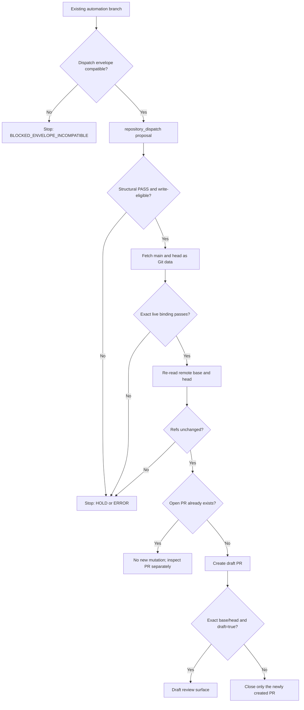

<!-- [KFM_META_BLOCK_V2]
doc_id: kfm://doc/automation-draft-pr-opener
title: Automation Draft PR Opener
type: runbook
version: v1.0
status: draft; repository-grounded; PROPOSED_INACTIVE; trusted-base; draft-only; non-publisher
owners:
  - "@bartytime4life — verified GitHub review route"
  - "NEEDS VERIFICATION — accountable automation and security reviewer"
created: 2026-08-09
updated: 2026-08-31
policy_label: repository-facing; automation; trusted-base; draft-pr; non-publisher
owning_root: docs/
responsibility: explain the bounded automation draft-PR opener without granting branch-write, merge, release, deployment, promotion, publication, or repository-administration authority
truth_posture: CONFIRMED current-repository bytes / PROPOSED_INACTIVE operational adoption / BLOCKED live dispatch envelope / UNKNOWN live run evidence / cite-or-abstain
canonical_relationship: same-path modernization of the tracked runbook; no sibling authority created
evidence_base_commit: 5d835798e09a4dd14735779cb44206a8a3e8b2d3
evidence_target_prior_blob: 6e6b0868b76eefa5596d0c3283d303caefc51e83
related:
  - README.md
  - automation-draft-pr-opener-validation-checklist.md
  - ../../contracts/governance/automation_pr_proposal.md
  - ../../schemas/contracts/v1/governance/automation_pr_proposal.schema.json
  - ../../tools/validators/governance/validate_automation_pr_proposal.py
  - ../../tools/validators/governance/validate_automation_pr_live_binding.py
  - ../../tests/validators/test_validate_automation_pr_live_binding.py
  - ../../.github/workflows/automation-draft-pr-opener.yml
  - ../../.github/workflows/automation-draft-pr-opener-test.yml
  - ../doctrine/directory-rules.md
  - ../adr/ADR-0029-adopt-directory-governance-standard-v2.md
notes:
  - "The prior tracked runbook was unversioned."
  - "Tracked implementation exists on current main, but no live repository-dispatch run was verified for this revision."
  - "Live repository dispatch is blocked: GitHub accepts at most 10 top-level client_payload properties, while the exact v1 proposal has 17."
  - "GitHub object state and exact refs outrank proposal text, PR prose, receipts, and this runbook for current operational state."
[/KFM_META_BLOCK_V2] -->

<a id="top"></a>

# Automation Draft PR Opener

> **Purpose:** open one draft pull request from an already-existing, tightly constrained `automation/` branch after deterministic proposal, ref, diff, mode, and digest checks. The opener cannot create or modify the branch or repository contents.

> [!IMPORTANT]
> **Current status is `PROPOSED_INACTIVE`.** The workflow, contract, schema, validators, fixtures, tests, checklist, and this runbook are tracked on current `main`, but tracked bytes do not prove operational adoption. Live dispatch is currently `BLOCKED_ENVELOPE_INCOMPATIBLE`: GitHub accepts at most 10 top-level `client_payload` properties, while the exact v1 proposal has 17 and the workflow validates `github.event.client_payload` directly. No live dispatch or live PR-creation run is claimed.

> [!WARNING]
> A valid proposal, declared policy `PASS`, receipt reference, green workflow, or draft PR is not evidence authority, policy approval, human review, merge authority, release, deployment, promotion, publication, or public-use authority.

> [!CAUTION]
> Do not place secrets, credentials, private review material, restricted payloads, sensitive locations, living-person data, DNA/genomic material, or hidden reasoning in a dispatch payload.

## At a glance

| Concern | Bounded behavior |
|---|---|
| Trigger | Intended `repository_dispatch` type `automation-pr-proposal-v1`; current direct payload is blocked by the 10-property platform limit |
| Trusted execution | Default-branch workflow and validators |
| Candidate | One existing `automation/` branch, fetched as Git data and never executed |
| Scope | One to eight added or modified `100644` blobs below `data/work/automation/` |
| Mutation | Open at most one **draft** PR for `head -> main` with immutable create inputs |
| Permissions | `contents: read`; `pull-requests: write` in the privileged job only |
| Ceiling | Draft review surface; never ready, approved, merged, released, deployed, promoted, or published |

## Status and evidence boundary

This edition is grounded in `main@5d835798e09a4dd14735779cb44206a8a3e8b2d3`.

| Surface | CONFIRMED current state | Limit |
|---|---|---|
| [Privileged workflow](../../.github/workflows/automation-draft-pr-opener.yml) | Dispatch, structural validation, live binding, ref recheck, draft creation, and fail-safe close are tracked | Presence does not prove activation, hosted success, or required-check coupling |
| [Read-only test workflow](../../.github/workflows/automation-draft-pr-opener-test.yml) | Path-binds this runbook and the implementation packet | Static and synthetic checks do not exercise live PR creation |
| [`AutomationPrProposal`](../../contracts/governance/automation_pr_proposal.md) | Remains `PROPOSED_INACTIVE` and fixture-first | Does not grant write authority or authenticate evidence, receipts, policy, or review |
| Schema and validators | Enforce bounded fields, paths, modes, SHAs, digests, and terminal flags | Structural `PASS` is not policy or human approval |
| Live dispatch/creation | `BLOCKED_ENVELOPE_INCOMPATIBLE`; no live run is claimed | The 17-field exact proposal cannot fit GitHub's 10-property `client_payload` limit, and changing its shape would fail current exact validation |

GitHub object state is authoritative for whether a PR exists, is draft, and has the expected base/head SHAs. Proposal text and PR-body prose are explanatory inputs only.

<a id="mutation-boundary"></a>

## Authority and non-effects

| Responsibility | Owning surface | Opener role |
|---|---|---|
| Proposal meaning | [Contract](../../contracts/governance/automation_pr_proposal.md) | Consume one exact v1 proposal |
| Machine shape | [Schema](../../schemas/contracts/v1/governance/automation_pr_proposal.schema.json) | Require the bounded field profile |
| Structural validation | [`validate_automation_pr_proposal.py`](../../tools/validators/governance/validate_automation_pr_proposal.py) | Require `outcome = PASS` and `write_eligible = true` |
| Ref/diff/blob binding | [`validate_automation_pr_live_binding.py`](../../tools/validators/governance/validate_automation_pr_live_binding.py) | Compare fetched refs and exact candidate bytes with the proposal |
| Proof | [Focused tests](../../tests/validators/test_validate_automation_pr_live_binding.py) and read-only workflow | Exercise positive and negative cases without live mutation |
| Policy, receipt, evidence, review | Their governed owners | Consume declarations/references; never authenticate them |
| Candidate branch/bytes | Separate authorized process | Never create, edit, push, rebase, delete, or force-update them |

<a id="what-the-opener-does-not-do"></a>

The opener does **not** execute candidate code; write repository contents; evaluate policy; resolve evidence; authenticate receipts; approve, request reviewers, ready, merge, or auto-merge; change lifecycle state; or release, deploy, promote, publish, activate sources, or authorize public use.

<a id="live-binding-gate"></a>

## Execution flow



The v1 profile is bound to `main`. Candidate refs are fetched as data and never executed.

<a id="required-proposal"></a>

## Required inputs

A separate authorized process must already have pushed a branch that:

- begins with `automation/` and matches the v1 branch-name profile;
- is based on the exact current `main` SHA declared in `base_sha`;
- changes one to eight unique paths, all `A` or `M` and all below `data/work/automation/`;
- stores every candidate as a non-executable `100644` blob; and
- binds every committed blob to a `sha256:<64 lowercase hexadecimal>` value.

The current workflow materializes `github.event.client_payload` directly, while the schema and validator require exactly one 17-field `kfm.automation.pr-proposal.v1` object. GitHub accepts at most 10 top-level `client_payload` properties, so the current proposal cannot be sent through the current dispatch envelope. Do not nest, split, rename, or omit fields: the validator requires the exact field set. Use the [schema](../../schemas/contracts/v1/governance/automation_pr_proposal.schema.json) and [valid shape fixture](../../fixtures/contracts/v1/governance/automation_pr_proposal/valid/valid_pass.json) only for offline validation until a reviewed successor updates the workflow, contract, schema, validator, fixtures, tests, and runbook together.

A receipt reference is lineage, not proof. The opener also does not authenticate a declared policy `PASS`.

## Operator procedure

### 1. Freeze exact state

Record current `main`, candidate head SHA, complete path set, blob modes/digests, open PRs for the head/base pair, and the authority that produced policy and receipt references. If either ref moves, regenerate the proposal rather than editing stale SHAs or digests in isolation.

### 2. Validate the proposal

```bash
python3 tools/validators/governance/validate_automation_pr_proposal.py \
  /path/to/automation-pr-proposal.json
```

Required result is semantically:

```json
{"outcome":"PASS","reason_codes":[],"write_eligible":true}
```

`HOLD` and `ERROR` do not proceed. The live validator later hashes committed head blobs, not uncommitted working-tree files.

### 3. Optionally reproduce live binding

```bash
git fetch --no-tags --depth=256 origin \
  +refs/heads/main:refs/remotes/origin/main \
  +refs/heads/<automation-branch>:refs/remotes/origin/<automation-branch>

python3 tools/validators/governance/validate_automation_pr_live_binding.py \
  /path/to/automation-pr-proposal.json \
  --repo-root . \
  --base-ref refs/remotes/origin/main \
  --head-ref refs/remotes/origin/<automation-branch>
```

Local `PASS` is preflight only. The privileged workflow repeats validation and re-reads remote refs immediately before mutation.

### 4. Hold live dispatch at the envelope boundary

Do not send the current v1 proposal through `repository_dispatch`. Its 17 required top-level properties exceed GitHub's 10-property `client_payload` limit, while the workflow validates `github.event.client_payload` directly. Nesting the proposal or changing its field set is not a compatible workaround.

Record `BLOCKED_ENVELOPE_INCOMPATIBLE` and route any successor design through accountable review. A successor must preserve the trusted-base, exact-binding, draft-only, non-publisher, and fail-safe boundaries and update the workflow, contract, schema, validator, fixtures, tests, checklist, and runbook as one dependency-closed change.

### 5. Verify run and PR state

Record the workflow run ID/SHA, actor, structural/live-binding results, ref recheck, and PR outcome. For a newly created PR, GitHub object state must show exact validated base/head SHAs and `draft = true`, with no later transition.

Creation is immutable: title/body/base/head are finalized before one `draft=true` create call. Do not perform post-create metadata updates in fallback mode.

Immediately verify the new PR through both connector readback and raw REST. After the first comment-only update (or next serialized observation), re-read the PR and inspect timeline events; any non-draft readback or `ready_for_review` event requires immediate closure without merge and specialization pause.

`AUTOMATION_DRAFT_PR_ALREADY_OPEN` creates nothing and does **not** prove the existing PR's SHAs or draft state. Inspect that PR separately.

## Finite outcomes and recovery

| Result | Recovery |
|---|---|
| New draft verified | Hand off exact run/base/head evidence for independent review |
| `AUTOMATION_DRAFT_PR_ALREADY_OPEN` | Inspect existing PR object state separately |
| `BLOCKED_ENVELOPE_INCOMPATIBLE` | Do not dispatch; design and review a dependency-closed successor envelope and all bound consumers |
| Structural `HOLD`/`ERROR` | Resolve owning policy or rebuild from current schema/exact bytes |
| Base/ancestry mismatch | Reconcile candidate with current `main`; regenerate proposal/digests |
| Path/type/mode/digest mismatch | Correct or replace candidate through its owner; do not weaken checks |
| `AUTOMATION_BASE_MOVED_BEFORE_PR_CREATE` | Reconcile with new `main`; issue a new proposal |
| `AUTOMATION_HEAD_MOVED_BEFORE_PR_CREATE` | Inspect mutation; issue a proposal from exact new head |
| `AUTOMATION_PR_POSTCREATE_BINDING_FAILED` | Confirm only the new PR was closed; investigate and re-propose |
| `AUTOMATION_PR_CONNECTOR_READBACK_FAILED` | Connector postcondition mismatched expected draft/base/head/open state; keep specialization paused until corrected |
| `AUTOMATION_PR_SECOND_READBACK_FAILED` | Second readback after comment-only update mismatched draft/base/head/open state; keep specialization paused until corrected |
| `AUTOMATION_PR_READY_EVENT_DETECTED` | `ready_for_review` surfaced in timeline; close without merge and keep specialization paused until corrected |

Never recover by broadening token permissions, executing candidate code, force-pushing shared history, changing `main`, weakening validators, or treating declarations as self-authenticating.

## Security and race boundary

```yaml
permissions:
  contents: read
  pull-requests: write
```

The dispatch payload and candidate refs/blobs are untrusted input. The candidate is inspected, never checked out or executed. Policy/receipt fields are declarations, and PR body/workflow summaries are review context, not evidence or approval.

GitHub PR creation has no atomic expected-head-SHA precondition. The workflow bounds the final race by validating fetched refs, re-reading remote refs immediately before creation, creating draft-only, re-reading the new PR, and closing only that newly created PR on a base/head/draft mismatch. This reduces but does not eliminate the race; the candidate branch remains untouched.

## Validation

Use the companion [validation checklist](automation-draft-pr-opener-validation-checklist.md). Focused no-network checks are:

```bash
ruby -e 'require "yaml"; ARGV.each { |path| YAML.parse_file(path) }' \
  .github/workflows/automation-draft-pr-opener.yml \
  .github/workflows/automation-draft-pr-opener-test.yml

python -m py_compile \
  tools/validators/governance/validate_automation_pr_proposal.py \
  tools/validators/governance/validate_automation_pr_live_binding.py \
  tests/validators/test_validate_automation_pr_live_binding.py

python -m unittest -q tests.validators.test_validate_automation_pr_live_binding
```

The read-only workflow also checks trigger/permission limits, both validators, immutable draft-only creation, connector+REST postcondition markers, second readback/timeline fail-safe markers, and absence of content write, ready/reviewer/merge actions, release, deployment, package, OIDC, issue, Actions-write, or Git-push markers.

For this Markdown, review the complete diff, one H1, heading order, compatibility anchors, tables, alerts, Mermaid, code fences, relative links, metadata block, final newline, and `git diff --check`. Report exact-head hosted checks as passing, failing, pending, skipped, inherited, unavailable, or not run.

A green focused workflow proves bounded tests and static guardrails at its exact SHA. It does not prove live dispatch, policy legitimacy, human review, required-check coupling, merge safety, release, deployment, promotion, publication, or operational maturity.

## Directory Rules basis

Accepted [`ADR-0029`](../adr/ADR-0029-adopt-directory-governance-standard-v2.md) adopts the canonical [Directory Rules](../doctrine/directory-rules.md). This same-path edit keeps operator guidance in `docs/runbooks/`, proposal meaning in `contracts/`, machine shape in `schemas/`, examples in `fixtures/`, reusable validation in `tools/`, proof in `tests/`, orchestration in `.github/`, and candidate bytes in `data/work/automation/`.

No new root, alias, generated/canonical pair, or parallel contract, schema, policy, registry, receipt, proof, release, lifecycle, or publication home is created.

## Open verification

| Item | State | First blocked transition |
|---|---|---|
| Accountable automation/security reviewer beyond the verified repository route | `NEEDS VERIFICATION` | Operational adoption |
| Live dispatch envelope for current workflow bytes | `BLOCKED_ENVELOPE_INCOMPATIBLE` | Dispatching or claiming runnable behavior |
| Live dispatch and PR creation after a compatible successor | `UNKNOWN` | Claiming demonstrated behavior |
| Required-check/ruleset coupling | `NEEDS VERIFICATION` | Treating tests as an enforced merge gate |
| Policy/receipt producer and authentication path | `NEEDS VERIFICATION` | Treating proposal `PASS` as governed closure |
| External dispatch clients | `UNKNOWN` | Breaking profile/invocation changes |

## Rollback

Before merge, close the documentation draft PR and abandon its feature branch. After an authorized merge, revert the single runbook commit or apply a reviewed same-path correction.

For implementation rollback, revert the opener/test workflows, validator/tests, contract reference, and runbook through a reviewed PR. Never delete, rewrite, or force-update the candidate branch as opener rollback; candidate cleanup is separate authority.

This runbook has no source-admission, lifecycle, release, deployment, promotion, publication, or settings effect.

[Back to top](#top)
