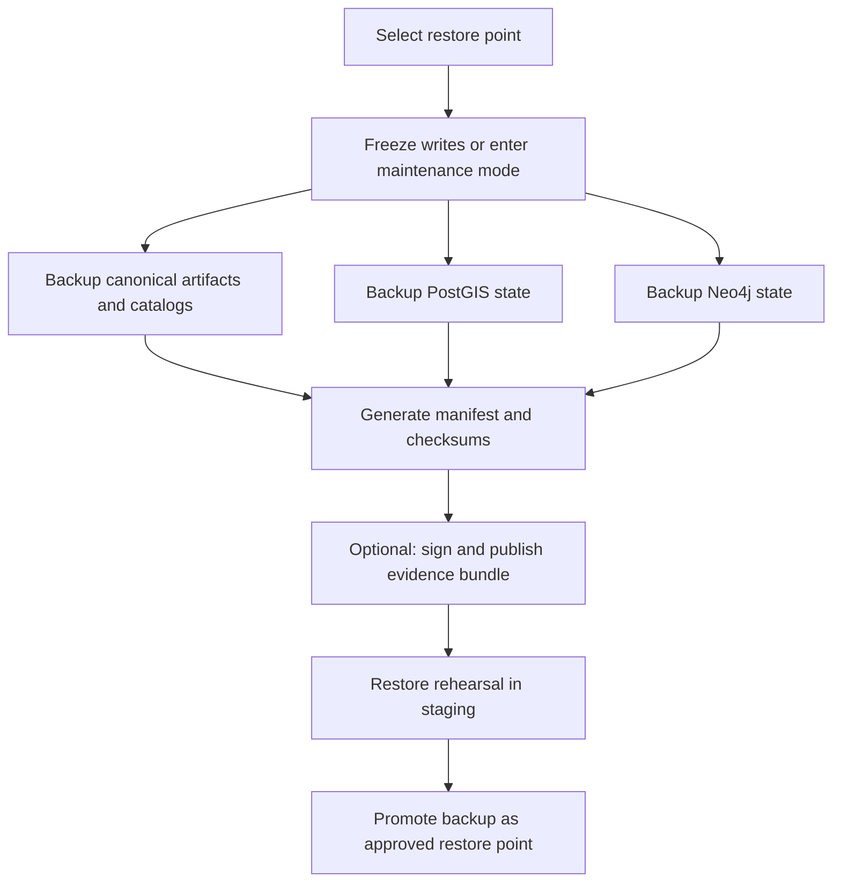

<!-- [KFM_META_BLOCK_V2]
doc_id: kfm://doc/6d31b7da-9c0d-4d30-b546-7b0c42bd59d1
title: Backup and Restore Runbook
type: standard
version: v1
status: draft
owners: TBD
created: 2026-03-04
updated: 2026-03-04
policy_label: restricted
related: [
  "docs/runbooks/templates/evidence-bundle-template.md",
  "docs/quality/promotion-readiness-checklist.md",
  "docs/architecture/neo4j/NEO4J_2025X_MIGRATION_PLAYBOOK.md"
]
tags: [kfm, runbook, backup, restore, dr, postgis, neo4j, provenance]
notes: [
  "This runbook is intentionally conservative. Confirm env-specific details before production use.",
  "Unless explicitly marked CONFIRMED, procedures are PROPOSED templates."
]
[/KFM_META_BLOCK_V2] -->

# Backup and Restore Runbook
One-line purpose: preserve and recover KFM’s governed truth surfaces (datasets + catalogs + provenance) and stateful services (PostGIS, Neo4j) without violating policy or provenance.

> **IMPACT**
>
>  <!-- TODO: set active/stable -->
>  <!-- TODO: replace with repo standard -->
>
> - **Status:** draft
> - **Owners:** **UNKNOWN** (set `CODEOWNERS` for `docs/runbooks/`)
> - **Applies to:** **PROPOSED** local dev (Docker Compose), **PROPOSED** self-managed prod, **UNKNOWN** managed DB tiers
> - **Last reviewed:** 2026-03-04
> - **Default posture:** **CONFIRMED** fail-closed / default-deny (restore must re-pass gates before serving users)
>
> **Quick nav:** [Scope](#scope) · [What to back up](#what-to-back-up) · [Backup procedures](#backup-procedures) · [Restore procedures](#restore-procedures) · [Verification gates](#verification-gates) · [Checklists](#checklists)

---

## Scope

- **CONFIRMED** KFM treats catalogs and provenance as contract surfaces between pipeline outputs and runtime (DCAT, STAC, PROV “catalog triplet”).:contentReference[oaicite:1]{index=1}
- **CONFIRMED** KFM’s “truth path” concept (RAW → WORK/QUARANTINE → PROCESSED → CATALOG/TRIPLET → PUBLISHED) is a hard mental model for promotion and governance; backup/restore should preserve the ability to re-validate that path after recovery.:contentReference[oaicite:2]{index=2}
- **PROPOSED** This runbook defines:
  - backup targets (canonical vs rebuildable)
  - consistent “restore points” (release/version boundaries)
  - step-by-step backup + restore templates
  - verification gates (checksums, catalogs, graph invariants)
  - rehearsal requirements

### Out of scope

- **PROPOSED** Live forensics, incident response, and legal hold procedures (use dedicated IR runbooks).
- **PROPOSED** Full re-processing/rebuilding of all datasets from upstream sources (covered by pipeline runbooks).
- **UNKNOWN** Vendor-managed backup retention tables (depends on chosen managed services/tier).

---

## Where it fits

- **CONFIRMED** Local dev stack is commonly described as Docker Compose with services such as PostGIS, Neo4j, API, and web; restore steps should be rehearsable in an isolated environment first.:contentReference[oaicite:3]{index=3}
- **PROPOSED** Related repo paths:
  - `docs/runbooks/templates/evidence-bundle-template.md`
  - `docs/architecture/neo4j/NEO4J_2025X_MIGRATION_PLAYBOOK.md`
  - `docs/quality/promotion-readiness-checklist.md`
  - `tools/validators/` (STAC/DCAT/PROV validators; link-checkers)
  - `releases/<dataset_id>/<version>/release.json` (release index, evidence digest, promotion decision):contentReference[oaicite:4]{index=4}

---

## Inputs

### Required inputs

- **UNKNOWN** Deployment mode: `local_compose | self_managed | managed`
- **UNKNOWN** Environment: `dev | staging | prod`
- **UNKNOWN** Storage locations:
  - Postgres endpoint or volume
  - Neo4j endpoint or volume
  - Object store path(s) for `data/` and published catalogs
- **UNKNOWN** Credentials:
  - DB creds (read for backup, admin for restore)
  - object store creds (read/write)
  - evidence/signing keys (if used; prefer keyless)
- **UNKNOWN** “Restore point” identifier:
  - preferred: a **release** with manifest + checksums + evidence digest

### Minimal verification steps to make UNKNOWN → CONFIRMED

1. **PROPOSED** Identify actual service names and endpoints:
   - `docker compose ps`
   - read `docker-compose*.yml`
2. **PROPOSED** Identify canonical data roots:
   - list `data/` and any configured bucket/prefix
3. **PROPOSED** Confirm whether Postgres + Neo4j are:
   - sources of truth vs rebuildable projections
4. **PROPOSED** Confirm retention + encryption expectations with governance/ops owners

---

## Conventions and evidence discipline

- **CONFIRMED** Restore rehearsal must be treated as mandatory when version lines, cluster config, or JVM baselines change; do not assume snapshot portability across major lines.:contentReference[oaicite:5]{index=5}
- **CONFIRMED** Minimum restore rehearsal checklist includes restoring into isolated staging and validating health + a deterministic query battery + graph invariants.:contentReference[oaicite:6]{index=6}
- **PROPOSED** In this runbook:
  - Anything marked **CONFIRMED** is grounded in KFM docs.
  - Anything marked **PROPOSED** is a recommended template.
  - Anything marked **UNKNOWN** requires the “verification steps” above.

---

## What to back up

### Core principle

- **CONFIRMED** Catalogs are first-class governed artifacts and should be included in inventories/checksums and referenced by provenance attestations where applicable.:contentReference[oaicite:7]{index=7}
- **PROPOSED** Backups should be shaped around **release boundaries**:
  - **release inventory** (manifest + checksums)
  - **run receipts / provenance** (what produced it)
  - **catalog triplet** (DCAT/STAC/PROV)
  - **evidence bundle** (attestations, SBOM, policy decisions):contentReference[oaicite:8]{index=8}

### Canonical vs rebuildable (classification)

| Component / Store | Classification | Why | Restore expectation |
|---|---:|---|---|
| `releases/**` + manifests + checksums | **PROPOSED canonical** | Defines restore point and audit trail | Must restore exactly |
| Catalog triplet (DCAT/STAC/PROV) | **CONFIRMED canonical surface** | Runtime contract surface:contentReference[oaicite:9]{index=9} | Must restore exactly |
| Object store artifacts (RAW/WORK/PROCESSED/PUBLISHED) | **UNKNOWN** | May be the system-of-record | Prefer restore exactly |
| PostGIS (PostgreSQL + PostGIS) | **UNKNOWN** | Could be derived from artifacts or contain curated truth | Restore or rebuild (must decide) |
| Neo4j graph | **UNKNOWN** | Often derived but may include curated edges | Restore or rebuild (must decide) |
| Search index (full text / vector) | **PROPOSED rebuildable** | Can usually be rebuilt from canonical docs/artifacts | Rebuild after restore |
| Caches/tiles | **PROPOSED rebuildable** | Derived accelerators | Rebuild after restore |
| Policies (OPA/Rego) in Git | **PROPOSED canonical** | Policy must match restored data | Restore by pinned commit |
| Secrets | **CONFIRMED not in repo** | Security baseline | Restore via secret manager, not backups |

---

## Backup design

### Backup artifact set (recommended)

- **PROPOSED** Each backup produces a **backup bundle** with:
  - `backup_manifest.json` (inventory + digests)
  - `checksums.txt` (sha256 list)
  - `backup_receipt.json` (who/when/what/why + tool versions)
  - optional `attestations/` (cosign/in-toto)
- **CONFIRMED** KFM patterns emphasize evidence bundles and run receipts as reproducible/auditable packets.:contentReference[oaicite:10]{index=10}

### Backup naming

- **PROPOSED**
  - `backups/<env>/<YYYY-MM-DD>/<restore_point_id>/...`
  - Include:
    - `kfm_commit_sha`
    - DB versions
    - image digests (if containerized)
    - dataset/release identifiers

---

## Architecture overview



---

## Backup procedures

### Preflight for any environment

1. **PROPOSED** Decide the restore point boundary:
   - preferred: use `releases/<dataset_id>/<version>/release.json` + its evidence digest:contentReference[oaicite:11]{index=11}
2. **PROPOSED** Record tool versions and runtime:
   - `psql --version`
   - `pg_dump --version`
   - `neo4j-admin --version`
   - container image digests (if used)
3. **PROPOSED** Record policy + code version:
   - `git rev-parse HEAD`
4. **PROPOSED** Ensure destination has enough space; backups fail-closed if partial.

---

### Local dev (Docker Compose) backup

> IMPORTANT: **PROPOSED** service names below are templates. Confirm with `docker compose ps` and your compose file.:contentReference[oaicite:12]{index=12}

#### 1) PostGIS logical backup (pg_dump)

```bash
set -euo pipefail

# PROPOSED: set these based on your .env / compose
export PGHOST="${PGHOST:-localhost}"
export PGPORT="${PGPORT:-5432}"
export PGUSER="${PGUSER:-kfm}"
export PGPASSWORD="${PGPASSWORD:-kfm}"
export PGDATABASE="${PGDATABASE:-kfm}"

OUT_DIR="backups/dev/$(date -u +%F)/postgres"
mkdir -p "$OUT_DIR"

pg_dump -Fc -v -f "$OUT_DIR/kfm.postgres.dump" "$PGDATABASE"
sha256sum "$OUT_DIR/kfm.postgres.dump" > "$OUT_DIR/checksums.txt"
```

- **PROPOSED** Rationale: `pg_dump` supports full DB, schema, or table backups; custom format works well with `pg_restore` for selective restore.:contentReference[oaicite:13]{index=13}

#### 2) Neo4j dump backup (offline or controlled)

```bash
set -euo pipefail

OUT_DIR="backups/dev/$(date -u +%F)/neo4j"
mkdir -p "$OUT_DIR"

# PROPOSED: prefer stopping writes or stopping the container for consistent dump
# docker compose stop neo4j

# PROPOSED: example command form; confirm exact syntax for your Neo4j line
# neo4j-admin database dump neo4j --to-path="$OUT_DIR"

# docker compose start neo4j
```

- **CONFIRMED** Do not assume a snapshot taken under one Neo4j line restores cleanly under a different line; rehearse restores on the exact version pair you run.:contentReference[oaicite:14]{index=14}

#### 3) Catalogs + artifacts backup (object store or repo-local data)

```bash
set -euo pipefail

OUT_DIR="backups/dev/$(date -u +%F)/artifacts"
mkdir -p "$OUT_DIR"

# PROPOSED: if your canonical artifacts live in repo-local `data/`
tar -czf "$OUT_DIR/data.tgz" data/
sha256sum "$OUT_DIR/data.tgz" > "$OUT_DIR/checksums.txt"
```

- **PROPOSED** If artifacts are in S3/MinIO, prefer versioned buckets + immutable paths and snapshot by prefix.

#### 4) Generate a backup manifest + receipt

```bash
set -euo pipefail

ROOT_OUT="backups/dev/$(date -u +%F)"
mkdir -p "$ROOT_OUT"

cat > "$ROOT_OUT/backup_manifest.json" <<'JSON'
{
  "type": "kfm.backup.manifest.v1",
  "env": "dev",
  "created_at": "REPLACE_UTC_TIMESTAMP",
  "kfm_commit_sha": "REPLACE_GIT_SHA",
  "restore_point": {
    "kind": "UNKNOWN",
    "id": "UNKNOWN"
  },
  "artifacts": [
    { "path": "postgres/kfm.postgres.dump", "sha256": "UNKNOWN" },
    { "path": "neo4j/NEO4J_DUMP_HERE", "sha256": "UNKNOWN" },
    { "path": "artifacts/data.tgz", "sha256": "UNKNOWN" }
  ]
}
JSON
```

- **PROPOSED** Replace `UNKNOWN` fields by computing digests and stamping timestamps.
- **PROPOSED** If you use cosign/in-toto, attach attestation bundle digests as in evidence bundle patterns.:contentReference[oaicite:15]{index=15}

---

### Self-managed production backup (template)

> CAUTION: **PROPOSED** production backup must be coordinated with ops and governance owners. Confirm downtime tolerance, cluster topology, storage class, and encryption requirements.

#### 1) Enter maintenance mode / freeze writes

- **PROPOSED** Block write paths:
  - pause pipelines
  - disable ingest webhooks
  - set API “read-only maintenance” flag
- **PROPOSED** Goal: consistent snapshot boundary across stores.

#### 2) Postgres production backup options

- **PROPOSED** Choose one:
  - logical `pg_dump` (simple; longer for large DBs)
  - physical base backup + WAL archiving (faster restore; more ops complexity)
  - volume snapshots (fast; depends on storage layer)

#### 3) Neo4j production backup options

- **PROPOSED** Choose one based on edition/topology:
  - offline `neo4j-admin database dump`
  - online backup tooling (enterprise features)
  - volume snapshots (only if you can guarantee consistency and quiescence)

#### 4) Catalogs/artifacts snapshot

- **CONFIRMED** Catalogs are contract outputs; include them in the backup inventory and integrity checks.:contentReference[oaicite:16]{index=16}

---

## Restore procedures

### Mandatory restore rehearsal policy

- **CONFIRMED** Restore rehearsals are mandatory when:
  - major Neo4j line changes
  - cluster config changes
  - JVM baseline changes:contentReference[oaicite:17]{index=17}
- **CONFIRMED** Minimum rehearsal includes:
  - restore into isolated staging
  - consistency checks
  - validate system DB health
  - run deterministic query battery
  - compare counts/hashes of critical entity sets (“graph invariants”):contentReference[oaicite:18]{index=18}

### Restore ordering (recommended)

1. **PROPOSED** Restore canonical artifacts + catalogs
2. **PROPOSED** Restore PostGIS
3. **PROPOSED** Restore Neo4j
4. **PROPOSED** Rebuild search indexes + caches
5. **PROPOSED** Start API layer
6. **PROPOSED** Re-enable UI traffic after gates pass

---

### Local dev (Docker Compose) restore

#### 0) Safety checks

- **PROPOSED** Restore into a clean environment:
  - `docker compose down -v` (destructive; removes volumes)
  - `docker compose up -d`
- **UNKNOWN** Whether volumes are safe to delete depends on your dev data needs.

#### 1) Restore Postgres (pg_restore)

```bash
set -euo pipefail

DUMP="backups/dev/2026-03-04/postgres/kfm.postgres.dump" # example
export PGHOST="${PGHOST:-localhost}"
export PGPORT="${PGPORT:-5432}"
export PGUSER="${PGUSER:-kfm}"
export PGPASSWORD="${PGPASSWORD:-kfm}"
export PGDATABASE="${PGDATABASE:-kfm}"

# PROPOSED: restore into an empty DB; use -c to clean objects if desired
pg_restore -v -d "$PGDATABASE" "$DUMP"
```

#### 2) Restore Neo4j (template)

```bash
set -euo pipefail

# PROPOSED: stop Neo4j container, load dump, restart
# docker compose stop neo4j
# neo4j-admin database load neo4j --from-path=backups/... --overwrite-destination=true
# docker compose start neo4j
```

#### 3) Rebuild search index (if present)

- **UNKNOWN** Search engine choice (Elasticsearch/OpenSearch/Meilisearch/etc.).
- **PROPOSED** Rebuild from canonical docs/artifacts after DBs are restored.

---

## Verification gates

### Gate A: Integrity (checksums + inventory)

- **CONFIRMED** Governed artifacts must be checksum-inventoried; catalogs must be included in the manifest inventory, and provenance attestations should reference checksums where applicable.:contentReference[oaicite:19]{index=19}
- **PROPOSED** Verify:
  - `sha256sum -c checksums.txt`
  - manifest lists every restored artifact

### Gate B: Catalog contract checks

- **CONFIRMED** DCAT/STAC/PROV have distinct responsibilities and must cross-link predictably.:contentReference[oaicite:20]{index=20}
- **PROPOSED**
  - run DCAT validator
  - run STAC validator
  - run PROV validation (if available)
  - run link-checker across triplet edges

### Gate C: Graph invariants (Neo4j)

- **CONFIRMED** Compare counts/hashes of critical entity sets and store invariants artifacts (example path provided).:contentReference[oaicite:21]{index=21}
- **PROPOSED** Maintain invariants file:
  - `data/graph/invariants/<env>/<date>/invariants.json`

Example invariants schema (template):

```json
{
  "type": "kfm.graph_invariants.v1",
  "neo4j_version": "UNKNOWN",
  "captured_at": "UNKNOWN",
  "counts": {
    "labels": { "Place": 0, "Event": 0 },
    "rels": { "MENTIONS": 0, "DERIVED_FROM": 0 }
  },
  "constraints_hash": "UNKNOWN",
  "indexes_hash": "UNKNOWN"
}
```

### Gate D: API readiness

- **PROPOSED** Smoke tests:
  - `/healthz` returns ok
  - core read paths succeed
  - policy enforcement is active (fail-closed)

---

## Checklists

### Backup definition of done

- [ ] **PROPOSED** Restore point selected and recorded (release/version boundary)
- [ ] **PROPOSED** Postgres backup created and checksum-verified
- [ ] **PROPOSED** Neo4j backup created and checksum-verified
- [ ] **PROPOSED** Catalog triplet included in inventory/checksums
- [ ] **PROPOSED** Backup manifest + receipt written
- [ ] **PROPOSED** (Optional) evidence bundle signed/published (cosign/in-toto)

### Restore rehearsal definition of done

- [ ] **CONFIRMED** Restored into isolated staging environment:contentReference[oaicite:22]{index=22}
- [ ] **CONFIRMED** System DB health validated:contentReference[oaicite:23]{index=23}
- [ ] **CONFIRMED** Deterministic query battery executed:contentReference[oaicite:24]{index=24}
- [ ] **CONFIRMED** Graph invariants compared and archived:contentReference[oaicite:25]{index=25}
- [ ] **PROPOSED** Catalog validators + link checks pass
- [ ] **PROPOSED** API smoke tests pass under policy enforcement

---

## Troubleshooting

- **PROPOSED** `pg_restore` fails due to version mismatch:
  - ensure `pg_dump`/`pg_restore` major versions are compatible (use client binaries matching server major).
- **PROPOSED** Neo4j restore fails after version upgrade:
  - restore into exact same Neo4j line first, then perform documented upgrade steps
  - rehearse per mandatory policy:contentReference[oaicite:26]{index=26}

---

## Appendix

### Example: “backup receipt” (minimal)

> NOTE: **PROPOSED** model after KFM’s preference for machine-verifiable run records / receipts and evidence bundles.

```json
{
  "type": "kfm.backup.receipt.v1",
  "env": "staging",
  "created_at": "2026-03-04T00:00:00Z",
  "operator": "UNKNOWN",
  "kfm_commit_sha": "UNKNOWN",
  "restore_point": { "kind": "release", "id": "UNKNOWN" },
  "tools": {
    "pg_dump": "UNKNOWN",
    "neo4j_admin": "UNKNOWN"
  },
  "artifacts": [
    { "path": "postgres/kfm.postgres.dump", "digest": "sha256:..." },
    { "path": "neo4j/neo4j.dump", "digest": "sha256:..." },
    { "path": "catalogs/catalog_triplet.tgz", "digest": "sha256:..." }
  ],
  "attestations": [
    { "type": "cosign", "bundle_digest": "sha256:..." }
  ]
}
```

---

Back to top: [↑](#backup-and-restore-runbook)
