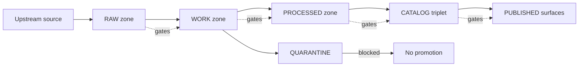

<!-- [KFM_META_BLOCK_V2]
doc_id: kfm://doc/7d2f9b8c-8e7e-44f2-a1cc-34b0f1bda8f0
title: Data Promotion Runbook
type: standard
version: v1
status: draft
owners: TBD
created: 2026-03-04
updated: 2026-03-04
policy_label: public
related: [kfm://doc/ROOT_GOVERNANCE, kfm://doc/ETHICS, kfm://doc/SOVEREIGNTY]
tags: [kfm, runbook, data-promotion, governance, evidence, catalogs]
notes: [Fail-closed promotion gates; truth path zones; PR-based promotion; steward sign-off]
[/KFM_META_BLOCK_V2] -->

# Data Promotion Runbook
Promote dataset versions through the KFM truth path (**RAW → WORK/QUARANTINE → PROCESSED → CATALOG/TRIPLET → PUBLISHED**) with **fail-closed** validation gates and auditable evidence.

> **Impact block**
>
> - **Status:** draft (**PROPOSED**)  
> - **Owners:** TBD (**UNKNOWN** → see “Verification checklist” to confirm CODEOWNERS/maintainers)  
> - **Last updated:** 2026-03-04 (**CONFIRMED**)  
> - **Primary outcome:** every PUBLISHED dataset version is traceable (catalog triplet + receipts + policy decision) (**CONFIRMED**)  
> - **Failure mode:** any missing/unverifiable artifact ⇒ **fail-closed** (no promotion) (**CONFIRMED**)  

## Quick navigation
- [Legend](#legend)
- [Scope](#scope)
- [Non-negotiable invariants](#non-negotiable-invariants)
- [Definitions](#definitions)
- [Promotion contract](#promotion-contract)
- [Promotion workflow overview](#promotion-workflow-overview)
- [Step-by-step procedure](#step-by-step-procedure)
- [Rollback and incidents](#rollback-and-incidents)
- [Troubleshooting](#troubleshooting)
- [Appendix](#appendix)

---

## Legend
This runbook uses explicit claim tags to enforce “cite-or-abstain” behavior.

- **CONFIRMED** — documented requirement/intent in KFM governance/blueprint materials.
- **PROPOSED** — recommended implementation/operational pattern; adopt if it matches repo reality.
- **UNKNOWN** — not verified in your current repo/runtime; includes the smallest steps to verify.

---

## Scope

- **CONFIRMED:** Data promotion is the act of moving from **Raw/Work** into **Processed + Catalog/Lineage**, and therefore into runtime surfaces.  
- **CONFIRMED:** Promotion to **PUBLISHED** is blocked unless **minimum gates** are met (automatable in CI; reviewed during steward sign-off).  
- **PROPOSED:** Promotion runs via a PR-based workflow: PR contains artifacts + receipts + catalogs; CI validates; steward approves; merge writes/updates release record.

### Where this fits in the repo
- **CONFIRMED:** This document lives under `docs/runbooks/` and is an operator-facing guide.  
- **UNKNOWN:** Exact file/directory layout of the “zones” in your current checkout.  
  - **Verify:** run `git rev-parse HEAD` and `tree -L 3` at repo root; confirm zone directories and tooling locations.

### Acceptable inputs
- **CONFIRMED:** A dataset must have: identity, license/rights metadata, sensitivity classification, validated catalogs (DCAT/STAC/PROV), run receipts/audit record, and a release record/manifest to be PUBLISHED.  
- **PROPOSED:** A dataset promotion PR includes:
  - processed artifacts (or pointers) + checksums
  - catalog triplet files
  - run receipt(s)
  - policy decision reference
  - QA report(s) and thresholds

### Exclusions
- **CONFIRMED:** Do **not** publish anything with unclear rights/sensitivity; quarantine instead.  
- **CONFIRMED:** UI/clients must **not** access storage directly; all access crosses a governed API/PEP policy boundary.  
- **PROPOSED:** Do not “hotfix” PUBLISHED by editing artifacts in place—supersede with a new version and new receipts.

[Back to top](#data-promotion-runbook)

---

## Non-negotiable invariants

- **CONFIRMED:** “Trust membrane”: clients never access storage directly; policy is enforced at the PEP/governed API before serving data.  
- **CONFIRMED:** Catalogs (DCAT/STAC/PROV) are not “nice-to-have metadata”; they are **contract surfaces** between pipeline outputs and runtime.  
- **CONFIRMED:** Promotion gates are intended to be automated and fail-closed.

[Back to top](#data-promotion-runbook)

---

## Definitions

### Truth path zones (what they mean)
- **CONFIRMED:** KFM lifecycle zones and typical contents:
  - **RAW:** immutable upstream acquisition + checksums; append-only.
  - **WORK/QUARANTINE:** intermediate transforms + QA; isolation for failures; rewrites allowed in WORK; QUARANTINE blocks promotion.
  - **PROCESSED:** publishable artifacts in standardized formats with stable IDs + checksums.
  - **CATALOG/TRIPLET:** cross-linked DCAT + STAC + PROV describing metadata, assets, and lineage.
  - **PUBLISHED:** governed runtime surfaces served via API/PEP and UI; policy enforced.

### “Fail-closed” (what it means operationally)
- **CONFIRMED:** If any required artifact is missing, invalid, or unverifiable, promotion must stop (deny) rather than proceed with best-effort inference.
- **PROPOSED:** Emit an `audit_event.json` (or equivalent) for failed attempts to make failures diagnosable and auditable.

### EvidenceRefs
- **CONFIRMED:** Evidence resolution must not require guessing; cross-links in triplet must resolve deterministically.
- **PROPOSED:** Standardize EvidenceRef schemes like `dcat://…`, `stac://…`, `prov://…` (and optionally `doc://…`, `graph://…`) so UI and Focus can cite-or-abstain.

[Back to top](#data-promotion-runbook)

---

## Promotion contract

### Minimum gates (operator view)
- **CONFIRMED:** Promotion to PUBLISHED is blocked unless minimum gates are met; the gate framing is designed for CI automation and steward sign-off.

#### Gate checklist (normalized)
This is a **normalized** view that maps multiple KFM documents into a single operator checklist.

1. **Identity & versioning**
   - **CONFIRMED:** dataset_id + dataset_version_id; deterministic spec_hash; content digests.
2. **Licensing & rights**
   - **CONFIRMED:** license/rights fields + snapshot of upstream terms.
3. **Sensitivity classification & redaction plan**
   - **CONFIRMED:** policy_label plus obligations (e.g., generalize geometry, remove fields) when needed.
4. **Catalog triplet validation**
   - **CONFIRMED:** DCAT/STAC/PROV validate and cross-link; EvidenceRefs resolve without guessing.
5. **QA & thresholds**
   - **CONFIRMED:** dataset-specific QA checks and thresholds exist and are met, else quarantine.
6. **Run receipt & audit record**
   - **CONFIRMED:** run receipt captures inputs, tooling, hashes, policy decisions; append-only audit record.
7. **Release record / manifest**
   - **CONFIRMED:** promotion is recorded as a release manifest referencing artifacts and digests.

> **UNKNOWN:** Your repo’s exact on-disk names for these gate artifacts and schemas.  
> **Verify:** search for `spec_hash`, `run_receipt`, `validate_dcat`, `validate_stac`, `prov`, `policy_label`, `release manifest`, and your `.github/workflows/*gate*`.

[Back to top](#data-promotion-runbook)

---

## Promotion workflow overview



- **CONFIRMED:** QUARANTINE blocks promotion.  
- **CONFIRMED:** Promotion gates apply at each transition; CATALOG triplet cross-links identifiers so EvidenceRefs resolve.  
- **PROPOSED:** Implement gates as CI-required checks on PRs; merges are blocked on any DENY.

[Back to top](#data-promotion-runbook)

---

## Step-by-step procedure

> **Operator rule (CONFIRMED):** If any step is **UNKNOWN** in your environment, stop and verify before proceeding.  
> **Operator rule (CONFIRMED):** Never “fix it live” in PUBLISHED; supersede with a new dataset version.

### 0) Preflight: verify repo reality
- **CONFIRMED:** Do not claim modules exist until verified in the live repo.  
- **PROPOSED:** Run:
  ```bash
  git rev-parse HEAD
  tree -L 3
  rg -n "spec_hash|run_receipt|policy_label|validate_dcat|validate_stac|prov|release" .
  rg -n "Promotion Contract|RAW|WORK|PROCESSED|CATALOG|PUBLISHED" docs/ data/ policy/ tools/
  ```
- **UNKNOWN → Verify:** Which workflows are required checks for merges?
  - **Verify:** inspect `.github/workflows/` and branch protections.

### 1) Source registry entry (required before RAW acquisition)
- **CONFIRMED:** Every source must have a registry entry with: authority, access method, cadence, license/terms snapshot, sensitivity classification, connector spec, limitations, and QA checks.
- **PROPOSED:** Ensure registry record includes:
  - `dataset_id`, title/description, publisher
  - upstream access info (url/type/cadence)
  - `license`/`rights` and a terms snapshot reference
  - `policy_label`
  - spec_ref + spec_hash reference (or a pointer to the spec that produces it)
- **UNKNOWN → Verify:** Where registry entries live (e.g., `data/registry/...`) and schema name.
  - **Verify:** locate `data/registry/.../README.md` and/or JSON Schemas.

### 2) RAW acquisition (append-only)
- **CONFIRMED:** RAW contains acquisition manifest, raw artifacts, checksums, minimal metadata (including license/terms snapshot), and is append-only (supersede; don’t edit).
- **PROPOSED:** For each acquisition:
  1. write/refresh a license/terms snapshot (file or URL + digest)
  2. store raw payloads
  3. compute checksums for every raw artifact
  4. write an acquisition manifest pointing to all raw files + digests + terms snapshot

### 3) WORK transforms + QA (or QUARANTINE)
- **CONFIRMED:** WORK contains normalized representations, QA reports, candidate redactions/generalizations, provisional entity resolution outputs.
- **CONFIRMED:** QUARANTINE is for failed validation, unclear licensing, sensitivity concerns, or upstream instability; quarantined items are not promoted.
- **PROPOSED:** Produce:
  - schema validation report(s)
  - spatial/temporal sanity checks
  - redaction/generalization candidate artifacts (if needed)
- **PROPOSED:** If *any* of these fail, quarantine the run and do not proceed.

### 4) PROCESSED artifacts (publishable)
- **CONFIRMED:** PROCESSED contains publishable artifacts in KFM-approved formats with checksums and derived runtime metadata.
- **PROPOSED:** Output at least:
  - final artifact(s) (e.g., GeoParquet/COG/PMTiles) + content digests
  - processed checksums list
  - derived extents/coverage metadata used by catalogs

### 5) Generate the catalog triplet (DCAT + STAC + PROV)
- **CONFIRMED:** Catalog triplet responsibilities:
  - DCAT: dataset-level metadata (license, publisher, distributions, coverage)
  - STAC: asset-level spatiotemporal metadata (collections, items, assets)
  - PROV: lineage (inputs/tools/params → outputs; activities/agents/entities)
- **CONFIRMED:** Triplet must be cross-linked so EvidenceRefs resolve without guessing.
- **PROPOSED:** Run validators in CI and locally (paths illustrative):
  ```bash
  # PSEUDOCODE — replace with your repo’s actual validators
  node tools/validators/validate_dcat.js catalog/dcat/*.jsonld
  node tools/validators/validate_stac.js catalog/stac/**/*.json
  node tools/validators/validate_prov.js catalog/prov/*.jsonld

  # Optional linkcheck for referential integrity
  python tools/linkcheck_catalogs.py catalog/
  ```
- **UNKNOWN → Verify:** Whether `tools/validators/validate_dcat.js` and `validate_stac.js` exist in your checkout.
  - **Verify:** `ls tools/validators` and read `tools/validators/*/README.md`.

### 6) Emit run receipt (run-level provenance)
- **CONFIRMED:** Run receipts capture: run_id, actor, operation, dataset_version_id, inputs + digests, outputs + digests, environment (container digest, git commit), validation status/report digest, policy decision reference, created_at.
- **PROPOSED:** Store receipts in an append-only location and link them from PROV and the release manifest.

### 7) Policy evaluation (allow/deny + obligations)
- **CONFIRMED:** Policy label is the primary classification input; policy evaluation returns allow/deny plus obligations (redaction/generalization).
- **PROPOSED:** Enforce policy both in CI and runtime using the same fixtures/outcomes (“policy-as-code alignment”).
- **PROPOSED:** For sensitive-location or restricted data:
  - default deny public exposure
  - publish generalized derivatives under a separate dataset version
  - ensure transformations are recorded in PROV

### 8) Release manifest / promotion record
- **CONFIRMED:** Promotion must be recorded as a release manifest referencing artifacts and digests (so PUBLISHED surfaces only serve promoted versions).
- **PROPOSED:** Write/update a `release.json` (or similar) with:
  - dataset_slug + dataset_version_id
  - spec_hash
  - released_at timestamp
  - artifact list (path, digest, media_type)
  - catalog list (path, digest)
  - QA summary + report digest
  - policy label + decision id
  - approvals (role/principal/time) where required

### 9) Publish to governed runtime surfaces
- **CONFIRMED:** PUBLISHED surfaces (API + UI) may only serve promoted dataset versions with processed artifacts, validated catalogs, run receipts, and policy label assignment.
- **PROPOSED:** After merging the promotion PR:
  - trigger index rebuilds (tiles/search/graph) from CATALOG + PROCESSED (rebuildable)
  - run contract tests ensuring `/datasets` and `/stac` return policy-filtered results including dataset_version_id + digests
  - smoke-test Evidence Drawer / citations (UI) against resolver

[Back to top](#data-promotion-runbook)

---

## Rollback and incidents

### When to rollback
- **CONFIRMED:** If policy/rights/sensitivity is unclear, do not publish; quarantine or revert promotion.
- **PROPOSED:** Rollback triggers include:
  - post-merge discovery of rights restriction
  - sensitive location leakage risk
  - evidence links broken in PUBLISHED surfaces

### How to rollback (fail-closed + reversible)
- **PROPOSED:** Roll back by **reverting the release manifest/promotion record** (remove the dataset version from the “promoted set”), not by deleting raw evidence.
- **PROPOSED:** Preserve:
  - receipts, manifests, checksums, policy decisions (audit trail)
  - the problematic version’s artifacts (restricted access) while removing it from public runtime
- **PROPOSED:** Open a revert PR and link the incident record; rotate secrets if any credential exposure occurred.

### Minimum audit artifact (recommended)
- **PROPOSED:** Write an `audit_event.json` describing:
  - what failed
  - which gate denied
  - who/what initiated
  - what was reverted
  - next required human decision

[Back to top](#data-promotion-runbook)

---

## Troubleshooting

| Symptom | Likely gate | Diagnosis | Fix (fail-closed) |
|---|---:|---|---|
| “Promotion blocked: license missing/unknown” | Licensing & rights | rights metadata absent or unparseable | Add license/rights + terms snapshot; if unclear → QUARANTINE |
| “Catalog validation fails” | Catalog triplet | schema invalid or missing required links | Fix DCAT/STAC/PROV; re-run validators; verify cross-links |
| “EvidenceRefs don’t resolve” | Catalog cross-links | broken hrefs, missing IDs, inconsistent dataset_version_id | Regenerate triplet; run linkcheck; block merge until fixed |
| “Policy denied: sensitive location” | Sensitivity | policy_label triggers deny; obligations absent | Apply redaction/generalization; publish generalized derivative; record in PROV |
| “Checksum mismatch” | Identity/Artifacts | digest computed over wrong bytes or artifact changed | Rebuild artifact; recompute digests; ensure immutability by digest |
| “QA thresholds not met” | QA | validation report shows failures | QUARANTINE; fix pipeline/spec; re-run |

> **CONFIRMED:** When in doubt, quarantine rather than publish.

[Back to top](#data-promotion-runbook)

---

## Appendix

### A) Run receipt template (example)
```json
{
  "run_id": "kfm://run/2026-02-20T12:00:00Z.abcd",
  "actor": { "principal": "svc:pipeline", "role": "pipeline" },
  "operation": "ingest+publish",
  "dataset_version_id": "2026-02.abcd1234",
  "inputs": [
    { "uri": "raw/source.csv", "digest": "sha256:1111" }
  ],
  "outputs": [
    { "uri": "processed/events.parquet", "digest": "sha256:2222" }
  ],
  "environment": {
    "container_digest": "sha256:img...",
    "git_commit": "deadbeef",
    "params_digest": "sha256:3333"
  },
  "validation": { "status": "pass", "report_digest": "sha256:7777" },
  "policy": { "decision_id": "kfm://policy_decision/xyz" },
  "created_at": "2026-02-20T12:05:00Z"
}
```

### B) Promotion manifest template (example)
```json
{
  "kfm_promotion_manifest_version": "v1",
  "dataset_slug": "example_dataset",
  "dataset_version_id": "2026-02.abcd1234",
  "spec_hash": "sha256:abcd1234",
  "released_at": "2026-02-20T13:00:00Z",
  "artifacts": [
    {
      "path": "events.parquet",
      "digest": "sha256:2222",
      "media_type": "application/x-parquet"
    }
  ],
  "catalogs": [
    { "path": "dcat.jsonld", "digest": "sha256:4444" },
    { "path": "stac/collection.json", "digest": "sha256:5555" }
  ],
  "qa": { "status": "pass", "report_digest": "sha256:7777" },
  "policy": { "policy_label": "public", "decision_id": "kfm://policy_decision/xyz" },
  "approvals": [
    { "role": "steward", "principal": "<id>", "approved_at": "2026-02-20T12:59:00Z" }
  ]
}
```

### C) Verification checklist (minimum)
- **CONFIRMED:** Capture repo commit hash and root directory tree.
- **CONFIRMED:** Confirm which work packages exist (spec_hash, OPA policies, validators, evidence resolver, dataset registry schema).
- **CONFIRMED:** Extract CI gate list from `.github/workflows` and document which checks are merge-blocking.
- **CONFIRMED:** Choose one MVP dataset and verify it can be promoted through all gates with receipts and catalogs.
- **CONFIRMED:** Validate UI cannot bypass PEP and that EvidenceRefs resolve end-to-end.

[Back to top](#data-promotion-runbook)
