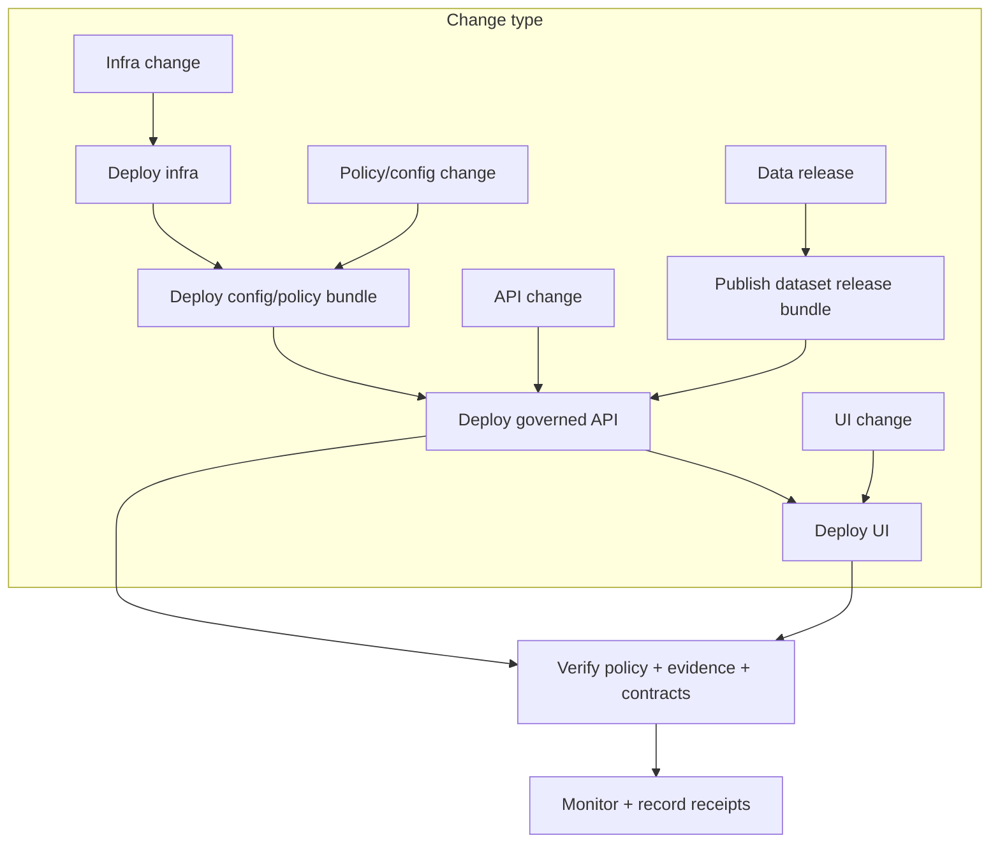

<!-- [KFM_META_BLOCK_V2]
doc_id: kfm://doc/2c8f3c0a-6b6c-4d29-9a9a-0b8f6b7f2c1e
title: DEPLOY
type: standard
version: v1
status: draft
owners: platform-infra; release-managers; kfm-governance
created: 2026-03-04
updated: 2026-03-04
policy_label: public
related:
  - docs/runbooks/README.md
  - docs/runbooks/api/rb-api-deploy.md
  - docs/runbooks/api/rb-api-rollback.md
  - docs/runbooks/ui/rb-ui-deploy.md
  - docs/runbooks/db-migrations.md
  - infra/README.md
  - infra/k8s/README.md
  - infra/helm/README.md
  - infra/gitops/README.md
  - configs/README.md
  - configs/env/README.md
  - scripts/release/README.md
tags: [kfm, runbook, deploy, ops]
notes:
  - Public-safe deployment index. Keep environment topology/credentials out of this file.
[/KFM_META_BLOCK_V2] -->

# DEPLOY
One-line purpose: A **public-safe deployment index** for Kansas Frontier Matrix (KFM): how to ship **infra + governed API + UI + data releases** without violating the **trust membrane**.

---

## Impact
- **Status:** `draft`
- **Owners:** `platform-infra` + `release-managers` + `kfm-governance` (resolve via `CODEOWNERS`)
- **Policy label:** `public` (no secrets; no internal endpoints; no restricted coordinates)
- **Scope:** “How to deploy” **across** components; links to component-specific runbooks
- **Non-goal:** This file is **not** the authoritative step-by-step for any single component (use the linked runbooks)

Badges (TODO wire to real workflows/environments):
- 
- 
- 
- 

Quick nav:
- [Truth tags and how to read this](#truth-tags-and-how-to-read-this)
- [Choose your deploy path](#choose-your-deploy-path)
- [System-level invariants](#system-level-invariants)
- [Golden workflow](#golden-workflow)
- [Verification checklist](#verification-checklist)
- [Rollback coordination](#rollback-coordination)
- [Receipts and audit trail](#receipts-and-audit-trail)
- [Troubleshooting map](#troubleshooting-map)
- [Appendix](#appendix)

---

## Truth tags and how to read this
This runbook uses explicit claim labels to stay fail-closed:

- **CONFIRMED (design):** Non-negotiable invariant (MUST hold).
- **CONFIRMED (repo):** Verified by in-repo artifact/path at current branch.
- **PROPOSED:** Recommended default pattern (adopt/verify before relying).
- **UNKNOWN:** Not verified; includes the smallest steps to confirm.

> IMPORTANT: If any step depends on a claim that is still **UNKNOWN**, stop and verify before touching long-lived environments.

---

## Choose your deploy path
Most “deployments” in KFM are one of these categories.

| You are deploying… | Start here | Then check |
|---|---|---|
| **Governed API (PEP)** | `docs/runbooks/api/rb-api-deploy.md` | `docs/runbooks/api/rb-api-rollback.md` |
| **UI surfaces (Map/Story/Focus + Evidence Drawer)** | `docs/runbooks/ui/rb-ui-deploy.md` | `docs/runbooks/ui/rb-ui-feature-flag.md` |
| **Infrastructure / cluster / GitOps state** | `infra/README.md` | `infra/k8s/README.md`, `infra/gitops/README.md`, `infra/helm/README.md` |
| **DB schema changes** | `docs/runbooks/db-migrations.md` | `migrations/` + app startup checks |
| **Dataset release (publish/promote)** | `scripts/release/README.md` | `docs/runbooks/pipelines/*`, `docs/runbooks/indexing/*` |
| **Index rebuilds / tiles / projections** | `docs/runbooks/indexing/README.md` | `docs/runbooks/indexing/rb-index-rebuild.md` |

Back to top ↑

---

## System-level invariants
### Trust membrane (CONFIRMED (design))
- **Clients/UIs MUST NOT** read from storage/DB directly.
- All reads/writes MUST cross **governed APIs** + **policy boundary** + **audit/evidence surfaces**.

### Fail-closed (CONFIRMED (design))
- If policy/evidence/citation resolution is unavailable or unauthorized, the system **must abstain / deny** (not “best-effort”).

### Published-only serving (CONFIRMED (design))
- Runtime services SHOULD serve only **promoted/published** dataset versions (those with catalogs + provenance + checksums + receipts).

### “Small, reversible, additive” change discipline (CONFIRMED (design))
- Prefer digest-pinned artifacts, reversible commits, and rollback-tested procedures.

Back to top ↑

---

## Deployment map


> PROPOSED: Default ordering shown above (infra → config/policy → API → UI; data releases feed API). If your environment differs, record the real order and update this file.

Back to top ↑

---

## Golden workflow
This is the **system-level** “happy path” that coordinates component runbooks.

### 0) Confirm what is being deployed (CONFIRMED (design))
Capture these **before** any apply:

- Git commit SHA(s)
- Immutable artifact references (image digests / bundle hashes)
- Environment target (`dev` / `stage` / `prod`) *(often PROPOSED until repo wiring is verified)*
- Rollback target(s) (previous digest / previous GitOps commit)
- Change record (PR link / ticket ID)

**Stop if anything is missing.**

---

### 1) Pre-deploy gates (CONFIRMED (design))
MUST be green **for touched components**:

- Unit + integration tests
- Contract checks (schemas/OpenAPI compatibility where applicable)
- Policy tests (fail-closed)
- Link/checksum validation for catalogs/evidence **if the release touches catalogs**
- Secret scanning (no plaintext secrets committed)

> PROPOSED: Treat gating as the minimum viable “Promotion Contract” for runtime deployments.

---

### 2) Choose the delivery mechanism (PROPOSED default)
**Preferred:** GitOps reconcile from `infra/` (auditable + reversible)  
**Fallback:** Controlled manual apply (documented, receipt required)

---

### 3) Apply in a safe order (PROPOSED default)
Use component runbooks for the actual “how”:

1. **Infra** (if changed): apply `infra/*` (k8s/helm/terraform/gitops)  
2. **Config/policy** (if changed): deploy config set + policy bundle (digest-pinned)  
3. **Governed API**: deploy API image digest + config refs  
4. **UI**: deploy UI artifact digest + API base URL wiring  
5. **Index/pipelines** (if required): run backfill/rebuild/promote workflows

---

### 4) Post-deploy verification (CONFIRMED (design))
Run the verification checklist below. If any **trust membrane invariant** fails, **rollback immediately**.

---

### 5) Record receipts (CONFIRMED (design))
Deployment without receipts is an outage waiting to happen.

- Record **what** changed (digests, SHAs, config_set_digest).
- Record **who/when/how** (actor principal, tool versions).
- Record **verification evidence** (screenshots/log excerpts allowed if policy-safe; never paste secrets/restricted coordinates).

Back to top ↑

---

## Verification checklist
These checks are intentionally **system-level**; component runbooks include deeper checks.

### Governed API checks (see `docs/runbooks/api/rb-api-deploy.md`)
- API is reachable and healthy (health endpoint or equivalent)
- Policy enforcement behaves correctly (public cannot access restricted)
- Evidence resolution works (EvidenceRefs resolve to bundles when allowed)
- Governed operations emit an `audit_ref` (or equivalent)

### UI checks (see `docs/runbooks/ui/rb-ui-deploy.md`)
- UI loads without console errors
- Map renders and at least one layer toggles
- Feature click opens Evidence Drawer
- Evidence Drawer shows **license + dataset version** and handles deny/abstain states explicitly

### Trust membrane spot-check (CONFIRMED (design))
- Network policies / security groups prevent UI pods from talking directly to DB/object storage
- Service accounts are least privilege

### Observability spot-check (PROPOSED baseline)
- Error rate stable (no new spikes)
- Latency within SLO (if defined)
- Audit logs present and do not leak sensitive details

Back to top ↑

---

## Rollback coordination
Rollback is a **primary operation**, not a hack.

### Rollback triggers (CONFIRMED (design))
Rollback immediately if any of these are true:
- Service crash-looping / cannot start
- Contract smoke tests fail in a client-breaking way
- Policy bypass suspected (restricted data exposed)
- Evidence resolution broken for allowed content
- Cross-user cache leakage suspected

### Which rollback runbook to use
- **Governed API rollback:** `docs/runbooks/api/rb-api-rollback.md`
- **UI rollback:** `docs/runbooks/ui/rb-ui-deploy.md` (Rollback section)
- **Infra rollback:** see `infra/README.md` + your GitOps controller procedure
- **Data release rollback/revocation:** see `scripts/release/README.md`

### Minimal rollback patterns (PROPOSED)
```bash
# GitOps (preferred): revert the commit that updated image digests/config refs
git revert <release-commit>
git push

# Kubernetes (fallback): undo deployment rollout
kubectl rollout undo deploy/<DEPLOYMENT> -n <NAMESPACE>

# Helm (fallback): roll back a release revision
helm rollback <RELEASE> <REVISION>
```

> IMPORTANT: Always capture before/after digests in the incident/change record.

Back to top ↑

---

## Receipts and audit trail
### What to record (CONFIRMED (design))
At minimum, your deploy record should contain:

- `env`: dev/stage/prod
- `git_commit`: SHA (and tags if used)
- `artifacts`: image digests / bundle hashes (API, UI, policy bundle)
- `config_set_digest`: digest of governed config set (if implemented)
- `actor`: who initiated and how (gitops|ci|manual)
- `tooling`: tool names + versions (kubectl/helm/terraform/argocd/flux/etc.)
- `verification`: what checks were run + outcomes
- `timestamps`: started/finished
- `audit_ref`: pointer to audit ledger entry (if used)

> PROPOSED: Store receipts alongside infra changes (or in a dedicated receipts store) and link them from PRs/releases.

Back to top ↑

---

## Troubleshooting map
Use this to route quickly; the linked runbooks carry the detailed steps.

| Symptom | Likely area | Jump to |
|---|---|---|
| UI loads but layers blank | tiles/index/policy/auth | `docs/runbooks/ui/README.md` + `docs/runbooks/indexing/README.md` |
| Evidence drawer empty | evidence resolver / catalog links | `docs/runbooks/ui/README.md` + API deploy verification |
| API 403 surprises | policy regression | `docs/runbooks/governance/` + API rollback triggers |
| “Latest data missing” | data not promoted/published | `scripts/release/README.md` + pipeline promote runbook |
| DB errors after deploy | migrations mismatch | `docs/runbooks/db-migrations.md` |

Back to top ↑

---

## Appendix
<details>
<summary>Minimum verification steps (convert UNKNOWN → CONFIRMED)</summary>

Run these in-repo before relying on any environment/tool assumption:

1. **Confirm deploy runbooks exist and match your scope**
   - `ls -la docs/runbooks/api docs/runbooks/ui`
2. **Confirm infra delivery method**
   - Inspect `infra/gitops/README.md` for intended controller
   - Search for Argo/Flux manifests or CI deploy jobs under `.github/workflows/`
3. **Confirm environment naming**
   - Check `infra/` overlays/values naming (dev/stage/prod vs other)
   - Align this document’s terminology to repo reality
4. **Confirm config injection model**
   - Review `configs/env/README.md` and example env files
   - Confirm where secrets are sourced (secret manager, external system)
5. **Confirm release tooling entrypoints**
   - `ls -1 scripts/release`
   - `./scripts/release/<entrypoint> --help` (if present)

If any step reveals mismatches, update this doc **in the same PR** that changes behavior.

</details>

---

### Back to top
↑ Back to top
