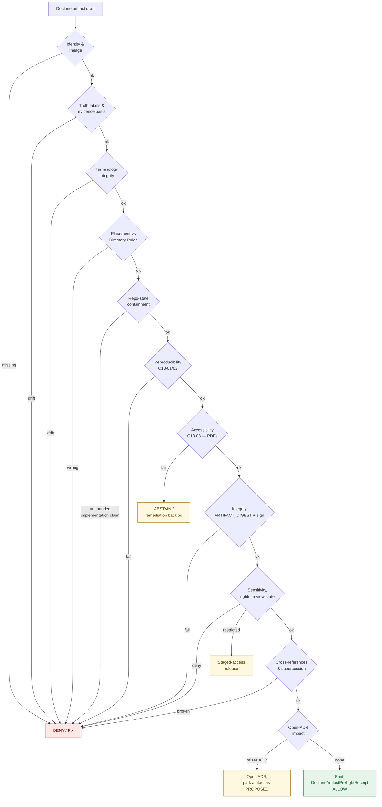

<!-- [KFM_META_BLOCK_V2]
doc_id: kfm://doc/runbook-doctrine-artifact-preflight
title: Doctrine Artifact Preflight Runbook
type: standard
version: v1
status: draft
owners: Docs steward + at least one subsystem owner (per Directory Rules §17)
created: 2026-05-12
updated: 2026-05-12
policy_label: public
related:
  - docs/doctrine/directory-rules.md
  - docs/registers/DRIFT_REGISTER.md
  - docs/registers/VERIFICATION_BACKLOG.md
  - docs/adr/ADR-0001-schema-home.md
  - docs/adr/ADR-S-02-doctrine-artifact-placement.md
  - docs/adr/ADR-S-13-drift-register-triage.md
  - docs/adr/ADR-S-15-doctrine-artifact-lifecycle.md
tags: [kfm, runbook, doctrine, preflight, governance, publication]
notes:
  - Path docs/runbooks/DOCTRINE_ARTIFACT_PREFLIGHT.md is PROPOSED until mounted-repo verified.
  - ADR-S-02 (doctrine artifact placement under docs/) and ADR-S-15 (doctrine artifact lifecycle) are PROPOSED in the open backlog.
  - All ADR identifiers and badge endpoints below are placeholders pending repo verification.
[/KFM_META_BLOCK_V2] -->

# 🛂 Doctrine Artifact Preflight Runbook

> **Pre-circulation governance check for KFM doctrine artifacts — Atlases, supplements, dossiers, encyclopedias, build manuals, ADRs, and doctrine docs — so that no doctrine artifact is treated as authoritative before its identity, evidence basis, terminology, placement, reproducibility, integrity, and supersession lineage are inspected.**

<!-- Badges: placeholders — replace targets after repo verification. -->


| Field | Value |
|---|---|
| **Document type** | Runbook (standard doc) |
| **Authority of these rules** | PROPOSED — depends on ADR-S-15 (doctrine artifact lifecycle) and ADR-S-02 (doctrine artifact placement) being accepted |
| **Authority of any specific path quoted here** | PROPOSED until verified against mounted-repo evidence |
| **Owner** | Docs steward |
| **Reviewers required for change** | Docs steward + at least one subsystem owner; ADR required when this runbook is promoted to canonical |
| **Lifecycle phase governed** | Pre-circulation / pre-citation of any doctrine artifact |
| **Companion registers** | `docs/registers/DRIFT_REGISTER.md`, `docs/registers/VERIFICATION_BACKLOG.md` |

---

## 📑 Quick jump

- [1. Scope](#1-scope)
- [2. Repo fit](#2-repo-fit)
- [3. Accepted inputs](#3-accepted-inputs)
- [4. Exclusions](#4-exclusions)
- [5. Preflight flow](#5-preflight-flow)
- [6. Gate matrix](#6-gate-matrix)
- [7. The eleven preflight steps](#7-the-eleven-preflight-steps)
- [8. Decision outcomes](#8-decision-outcomes)
- [9. Anti-patterns to deny on sight](#9-anti-patterns-to-deny-on-sight)
- [10. Preflight receipt and lineage](#10-preflight-receipt-and-lineage)
- [11. Maintenance CLI commands](#11-maintenance-cli-commands)
- [12. Quickstart — five-minute pass](#12-quickstart--five-minute-pass)
- [13. Task list — pin-to-PR checklist](#13-task-list--pin-to-pr-checklist)
- [14. FAQ](#14-faq)
- [15. Related docs](#15-related-docs)
- [16. Appendix](#16-appendix)

---

## 1. Scope

**A *doctrine artifact* is any document whose role is to establish, refine, register, or supersede KFM governance, architecture, terminology, policy posture, or release law** — not to *implement* it. Doctrine artifacts shape what gets built and what gets published; they do not by themselves constitute repo state.

In scope for this preflight:

| Artifact family | Examples |
|---|---|
| **Atlas** | Domains Culmination Atlas v1.0, v1.1; Master MapLibre Components-Functions-Features |
| **Supplement / addendum** | Atlas Chapter 24; Atlas Appendix G; pass-level update packets |
| **Dossier / idea index** | Pass 10 / Pass 18 idea indexes, category atlases, expansion dossiers |
| **Encyclopedia / spine** | KFM Encyclopedia (object/source/capability spine) |
| **Build manual** | Unified Implementation Architecture Build Manual |
| **ADR** | Records under `docs/adr/` |
| **Doctrine page** | Files under `docs/doctrine/` (e.g., `directory-rules.md`, `authority-ladder.md`, `truth-posture.md`, `trust-membrane.md`, `lifecycle-law.md`) |
| **Register / runbook / standard** | Files under `docs/registers/`, `docs/runbooks/`, `docs/standards/` whose primary effect is governance, not implementation |

> [!IMPORTANT]
> **Doctrine artifacts and implementation artifacts have different preflights.** Implementation artifacts (PMTiles, COGs, GeoParquet, layer manifests, release manifests) follow promotion gates A–G under `release/` and the artifact-governance checklist for tiles/COGs. This runbook governs the *doctrine* lane only.

[⬆ Back to top](#-quick-jump)

---

## 2. Repo fit

**Proposed home of this runbook:** `docs/runbooks/DOCTRINE_ARTIFACT_PREFLIGHT.md`

**Proposed home of doctrine artifacts** governed by this preflight:

```text
docs/
├── doctrine/              # core doctrine pages (CONFIRMED rule / PROPOSED presence)
├── atlases/               # ADR-S-02 OPEN: docs/dossiers/ vs docs/atlases/
├── dossiers/              # ADR-S-02 OPEN
├── adr/                   # accepted, proposed, superseded ADRs
├── registers/             # DRIFT_REGISTER, VERIFICATION_BACKLOG, ADR_INDEX
├── runbooks/              # this file lives here
├── standards/             # SIGNING, PROVENANCE, CANONICALIZATION, etc.
└── architecture/          # subsystem architecture pages
```

> [!NOTE]
> Per **Directory Rules §3**, `docs/` is the canonical responsibility root for human-facing doctrine, ADRs, runbooks, and registers. The specific sub-paths above are **PROPOSED** until verified against mounted-repo evidence; `docs/dossiers/` vs `docs/atlases/` is open per **ADR-S-02**.

**Upstream of this runbook:** Directory Rules (placement), Atlas / supplement supersession appendices (lineage), C13 reproducible documentation chain (build).

**Downstream of this runbook:** Drift Register (open conflicts), Verification Backlog (NEEDS VERIFICATION items), `docs/registers/ADR_INDEX` (proposed ADRs raised by preflight), supersession appendices of the artifacts it gates.

[⬆ Back to top](#-quick-jump)

---

## 3. Accepted inputs

A doctrine artifact MUST run through this preflight before any of the following:

1. **First circulation** outside its working PR (e.g., posted as an attachment, exported as a PDF, linked from a README).
2. **Promotion to canonical** (e.g., moving an Atlas from `working-drafts/` to `docs/atlases/`).
3. **Citation in another doctrine artifact** as `CONFIRMED doctrine`.
4. **Reference from machine-readable governance** (e.g., `control_plane/` indexes, ADR cross-links, register entries).
5. **Public or semi-public release**, including PDF builds intended to be downloaded, archived, or institutionally cited.
6. **Supersession** of a prior edition.

What counts as "the artifact" for the preflight:

| Component | Required |
|---|---|
| The source Markdown or LaTeX | ✅ |
| The KFM Meta Block v2 (or stated exception) | ✅ |
| Supersession header / appendix (when superseding prior edition) | ✅ |
| Citations and cross-references | ✅ |
| The built artifact bytes (PDF, HTML, exported zip) — when produced | ✅ |
| The ARTIFACT_DIGEST sidecar — when a PDF is produced | ✅ |
| Tool-versions pin (`tool-versions.yaml`) — when a build is involved | ✅ |
| Signing material — when the artifact will be referenced from receipts | ✅ |

[⬆ Back to top](#-quick-jump)

---

## 4. Exclusions

This preflight does **not** run on:

- **Lifecycle data artifacts** (RAW / WORK / QUARANTINE / PROCESSED / CATALOG / TRIPLET / PUBLISHED). Those follow data-lane promotion under `release/`.
- **Tile, COG, GeoParquet, and 3D-tileset releases.** Those follow the artifact-governance checklist (immutable inputs, CRS, sidecars, digest logs, license/attribution) and Promotion Gates A–G.
- **Code, schemas, contracts, policy bundles.** Schemas, contracts, and policy follow their own ADR-governed evolution (ADR-0001 schema home, policy-bundle promotion).
- **Personal notes, scratch dossiers, exploratory packets.** Per `docs/intake/` discipline, exploratory packets are quarantined from doctrine until promoted; promotion *is* a trigger for this preflight.
- **Routine typo or clarification edits** to already-published doctrine that do not change identity, terminology, or lineage. Such edits MAY skip preflight but MUST update the `updated:` field in the Meta Block.

> [!CAUTION]
> A doctrine artifact whose **content is correct but whose preflight has not been run** is still treated as **PROPOSED**. Correctness is not authority; preflight is what binds correctness to authority.

[⬆ Back to top](#-quick-jump)

---

## 5. Preflight flow



> [!NOTE]
> The diagram is **NEEDS VERIFICATION** in one respect: the existence and exact name of a `DoctrineArtifactPreflightReceipt` object family is **PROPOSED**. The doctrine of *emitting a receipt for every governance-significant action* is CONFIRMED across `RunReceipt`, `PromotionReceipt`, `AIReceipt`, and `ReleaseManifest`; the doctrine-preflight variant is the natural extension but has no schema home yet.

[⬆ Back to top](#-quick-jump)

---

## 6. Gate matrix

Each gate is **MUST**, **SHOULD**, or **MAY** in the RFC-2119 sense Directory Rules §2.2 already uses. The minimum-pass column says what evidence the gate accepts. The deny-on-fail column says what happens when the gate cannot be satisfied.

| # | Gate | Strength | Minimum pass | Deny-on-fail |
|---|---|---|---|---|
| 1 | **Identity & lineage** | MUST | Meta Block v2 present; `doc_id`, `version`, `status`, `owners`, `created`, `updated` populated; supersedes entry when a prior edition exists | DENY |
| 2 | **Truth labels & evidence basis** | MUST | CONFIRMED / PROPOSED / UNKNOWN / NEEDS VERIFICATION applied where confidence materially matters; no "memory as evidence"; no claim of compliance / enforcement / coverage without source-grounded support | DENY |
| 3 | **Terminology integrity** | MUST | KFM compound terms preserved exactly (e.g., `EvidenceBundle`, `EvidenceRef`, `RAW → WORK / QUARANTINE → PROCESSED → CATALOG / TRIPLET → PUBLISHED`, `ReleaseManifest`, `CorrectionNotice`, `RollbackCard`, `RuntimeResponseEnvelope`, `spec_hash`, `ARTIFACT_DIGEST`) | DENY |
| 4 | **Placement vs Directory Rules** | MUST | Path is justified by a Directory Rules section; ADR cited when §2.4 applies; per-root README aware | DENY or open drift entry |
| 5 | **Repo-state containment** | MUST | No "the repo contains X" / "the route exists" / "the tests cover" / "the policy denies" claim without mounted-repo evidence; otherwise labeled PROPOSED / UNKNOWN / NEEDS VERIFICATION | DENY |
| 6 | **Reproducibility (build only)** | MUST when artifact is built | Pandoc + XeLaTeX + Ghostscript + qpdf pinned in `tool-versions.yaml`; `SOURCE_DATE_EPOCH` set from commit time; Noto fonts embedded; `LC_ALL=C.UTF-8` (or equivalent) | DENY |
| 7 | **Accessibility (PDF/UA)** | SHOULD (PROPOSED MUST) | Tagged structure, alt-text on non-decorative images, table-header semantics; result recorded in ARTIFACT_DIGEST sidecar | ABSTAIN — log to remediation backlog |
| 8 | **Integrity** | MUST | `ARTIFACT_DIGEST` = SHA-256 of linearized PDF/A-2u, recorded in sidecar manifest; cosign-signed when artifact will be referenced from a receipt; provenance predicate emitted when SLSA target applies | DENY |
| 9 | **Sensitivity, rights, review state** | MUST | No T2–T4 content surfaced without staged access; rights/attribution clear; review record current; living-person / DNA / sensitive-geometry deny lanes respected | DENY or restrict |
| 10 | **Cross-references & supersession** | MUST | All citations resolve; supersession entry present when superseding; prior edition retained; lineage continuous | DENY |
| 11 | **Open-ADR impact** | MUST | Any Directory Rules §2.4 trigger results in a `PROPOSED` ADR — not a silent path bend | Park artifact as PROPOSED; open ADR |

> [!WARNING]
> A doctrine artifact that fails **any MUST gate** is not "almost done." It is **PROPOSED** and **must not** be cited as authority, treated as canonical, or used as a foundation for downstream doctrine until the failing gate clears.

[⬆ Back to top](#-quick-jump)

---

## 7. The eleven preflight steps

### 7.1 Identity & lineage

The artifact MUST carry a **KFM Meta Block v2** at the top of the file with at minimum: `doc_id`, `title`, `type`, `version`, `status`, `owners`, `created`, `updated`, `policy_label`, `related`, `tags`. If the artifact supersedes a prior edition, it MUST include a **supersession header** with the following fields, modeled on Atlas v1.0 → v1.1:

| Field | Value |
|---|---|
| **Prior edition** | Title, version, build date, page count or commit SHA |
| **Current edition** | Title, version |
| **Supersession mode** | Integrated extension / Replacement / Forking |
| **Supersession scope** | Edition identity only / Doctrinal substance / Both |
| **Reversibility** | Full / Partial / None |
| **Conflict posture** | Which edition wins on overlapping claims |

Prior editions are **retained, not deleted**. The supersession header is the lineage record.

### 7.2 Truth labels & evidence basis

Every material claim — particularly path claims, route claims, schema-home claims, policy-coverage claims, test-coverage claims, runtime claims, branch-state claims — MUST carry the narrowest truthful label among: **CONFIRMED**, **INFERRED**, **PROPOSED**, **UNKNOWN**, **NEEDS VERIFICATION**, or **EXTERNAL**. Memory is not evidence. Web-derived content used to satisfy a true external-tier gap MUST be cited inline and listed in the artifact's sources.

> [!TIP]
> A useful self-test: replace each declarative sentence with its label-explicit form. If the result reads "CONFIRMED that the repo contains `apps/governed-api/`," and the only basis is a prior plan or attached report, the original sentence was overclaiming.

### 7.3 Terminology integrity

Run a terminology pass against the **KFM terminology register** before signoff. Compound terms that are checked at minimum:

- `EvidenceBundle`, `EvidenceRef`
- `RAW → WORK / QUARANTINE → PROCESSED → CATALOG / TRIPLET → PUBLISHED`
- `ReleaseManifest`, `MapReleaseManifest`, `LayerManifest`, `TileArtifactManifest`
- `CorrectionNotice`, `RollbackCard`
- `RuntimeResponseEnvelope` (ANSWER / ABSTAIN / DENY / ERROR)
- `SourceDescriptor`, `SourceActivationDecision`, `PolicyDecision`, `PromotionReceipt`, `AIReceipt`, `RunReceipt`
- `spec_hash`, `ARTIFACT_DIGEST`, `SOURCE_DATE_EPOCH`
- `Promotion is a governed state transition, not a file move`
- `Watcher-as-non-publisher`
- `Cite-or-abstain`

External-research phrasing is **not** allowed to overwrite these terms with generic industry equivalents.

### 7.4 Placement vs Directory Rules

The artifact's path MUST be defensible by a specific Directory Rules section. The PR description SHOULD name that section (per Directory Rules §16). If the placement requires a §2.4 trigger — adding/removing/renaming a canonical root, promoting a compatibility root, changing the schema-home rule, splitting/merging a lifecycle phase, creating a parallel home, or bending a §3 invariant — an **ADR** is required before the artifact is treated as canonical.

### 7.5 Repo-state containment

This is the strictest gate for doctrine artifacts. Doctrine describes what *should* be true; it must not invent what *is* true.

- If the repo is **mounted in the preflight session**, repo-state claims MUST be checked directly.
- If the repo is **not mounted**, repo-state claims MUST be labeled **PROPOSED / UNKNOWN / NEEDS VERIFICATION**.
- An attached PDF, prior plan, generated tree, or external research result MUST NOT be promoted to "the repo contains X."
- "Not visible in this workspace" ≠ "not present in the repository."

### 7.6 Reproducibility (build only)

For any artifact that produces a build output (PDF, HTML bundle, exported zip):

- `tool-versions.yaml` MUST pin Pandoc, XeLaTeX, Ghostscript, and qpdf to specific versions, and the build MUST fail closed when discovered versions do not match the pin.
- `SOURCE_DATE_EPOCH` MUST be set from the git commit time so timestamps are stable.
- Fonts MUST be embedded (Noto family by default).
- Locale MUST be neutralized (`LC_ALL=C.UTF-8` or equivalent).
- Two clean runs on different machines, against the same source, MUST produce byte-identical output.

### 7.7 Accessibility (PDF/UA)

For PDF builds: tagged structure, alt-text on non-decorative images, and table-header markup SHOULD meet **PDF/UA** (ISO 14289). Status is **PROPOSED** until the build chain pins a preflight tool (e.g., verapdf). Until then, failures here ABSTAIN rather than DENY, and remediation items go on a public backlog rather than blocking circulation. As maturity rises, this gate is intended to become MUST.

### 7.8 Integrity — ARTIFACT_DIGEST and signing

For PDF builds:

- The published PDF MUST be linearized via qpdf and emitted as PDF/A-2u.
- The **ARTIFACT_DIGEST** = `SHA-256(linearized PDF/A-2u bytes)` MUST be computed **after** linearization and recorded in a sidecar manifest, in the catalog metadata, and in any receipt that cites the document.
- When the artifact will be referenced from a `RunReceipt`, `PromotionReceipt`, `ReleaseManifest`, or any other receipt class, the artifact and its receipt MUST be **cosign-signed** — keyless by default via Sigstore (OIDC + Fulcio + Rekor) or with a pinned key pair when offline operation is required. The bundle digest MUST be recorded inside the receipt as `{type:"cosign", bundle_digest:"sha256:..."}`.
- When SLSA alignment is the target, a SLSA-style in-toto provenance predicate MUST be emitted and cosign-attested alongside the signature.

> [!IMPORTANT]
> **A valid signature does NOT override missing evidence, unclear rights, unresolved provenance, sensitivity restrictions, or cultural review requirements.** Signing closes the integrity loop; it does not close the governance loop.

### 7.9 Sensitivity, rights, and review state

Before any non-internal circulation:

- **Rights** — license/attribution clear; SPDX in allowlist when applicable.
- **Sensitivity** — T0–T4 tier assigned per the sensitivity scheme (PROPOSED canonical per ADR-S-05); sensitive-lane content (archaeology coordinates, rare-species locations, infrastructure detail, living-person fields, DNA, person-parcel joins) defaults to **deny / restrict / generalize / quarantine** and is recorded.
- **Review state** — ReviewRecord present and within the review-cycle tolerance for the lane.
- **Living-person, DNA, archaeological-site, critical-infrastructure** content is **deny-by-default**.

If any of these is unclear, the gate output is **ABSTAIN** (route to steward review) — never silent ALLOW.

### 7.10 Cross-references and supersession

- Every `[CITATION]` token (e.g., `[DIRRULES]`, `[ENCY]`, `[DOC-DIR]`, `[BLD-GREEN]`, `[IMPL-PIPE]`, `[UIAI-MASTER]`) resolves to a known source.
- Every internal Markdown link resolves on GitHub (relative paths preferred; permalinks only for exact line pinning).
- Prior editions are listed in a **supersession appendix** with `superseded_by` links; the prior edition file is retained.
- The artifact's entry in `docs/registers/CANONICAL_LINEAGE_EXPLORATORY.md` (or equivalent register) is updated if one exists; otherwise the omission is logged.

### 7.11 Open-ADR impact

If the artifact raises any of the architectural questions on the Master Open-ADR Backlog (ADR-S-01 through ADR-S-15, or successors), the artifact is **parked as PROPOSED** and a corresponding ADR is opened *before* the artifact is treated as canonical. Doctrine artifacts must not silently resolve ADR-class questions in their prose.

[⬆ Back to top](#-quick-jump)

---

## 8. Decision outcomes

A preflight produces exactly one finite outcome:

| Outcome | Meaning | Required follow-up |
|---|---|---|
| **ALLOW** | All MUST gates passed; SHOULD gates passed or formally deferred | Emit DoctrineArtifactPreflightReceipt (PROPOSED object); circulate |
| **ABSTAIN** | At least one SHOULD gate failed or unclear; no MUST gate failed | Log remediation backlog entry; restricted-circulation only |
| **DENY** | At least one MUST gate failed | Do not circulate; do not cite as canonical; remediate and re-run |
| **ERROR** | Preflight could not complete (missing inputs, tool failure, etc.) | Diagnose; re-run; never silently promote from ERROR |

ALLOW is not retroactive. An artifact that previously cleared preflight but whose terminology, repo-state, or sensitivity context has since drifted MUST be re-run before being cited again as `CONFIRMED doctrine`.

[⬆ Back to top](#-quick-jump)

---

## 9. Anti-patterns to deny on sight

The following patterns SHOULD trigger immediate DENY at the corresponding gate. The register here merges placement anti-patterns (Directory Rules §13) with doctrine-specific failure modes.

| Anti-pattern | What goes wrong | Triggering gate |
|---|---|---|
| **"The repo contains X"** without mounted-repo verification | Doctrine smuggles in implementation claims that prior plans, attached PDFs, or external research cannot prove | Gate 5 (Repo-state containment) |
| **Terminology drift to generic phrasing** | `EvidenceBundle` becomes "data package"; `RAW → WORK / QUARANTINE → …` becomes "pipeline" | Gate 3 (Terminology integrity) |
| **Unsupported maturity claim** | "Compliance / enforced / integrated / automated / covered" without evidence | Gate 2 (Truth labels) |
| **Silent supersession** | New edition replaces a prior edition without retaining the prior or recording lineage | Gate 1 (Identity) + Gate 10 (Supersession) |
| **Doctrine declares an ADR-class decision in prose** | A path bend, parallel home, or invariant change appears as a sentence rather than as an accepted ADR | Gate 11 (Open-ADR impact) |
| **Two parallel doctrine homes** | The same doctrine is authored in both `docs/dossiers/` and `docs/atlases/` (or similar) without ADR | Gate 4 (Placement) |
| **Compatibility root used as authority** | Files that should be in `schemas/` or `policy/` end up in `jsonschema/` or `policies/` and harden into authority | Gate 4 (Placement) |
| **ARTIFACT_DIGEST recorded before linearization** | The digest will not match what consumers fetch | Gate 8 (Integrity) |
| **Receipt cites a moving PDF** | The PDF is not byte-reproducible because the toolchain is not pinned | Gate 6 (Reproducibility) + Gate 8 (Integrity) |
| **Sensitive content surfaced without staged access** | Living-person, DNA, archaeological coordinates, or critical-infrastructure detail in a public artifact | Gate 9 (Sensitivity) |
| **External research cited for KFM-specific repo-state claims** | Web results substituted for project knowledge or repo evidence | Gate 5 (Repo-state) + governing source hierarchy |
| **Fluent generation in place of evidence** | AI-generated language smoothing over evidence gaps | Gate 2 (Truth labels) + cite-or-abstain |

> [!CAUTION]
> When a doctrine artifact bends an invariant, the artifact MUST state the tradeoff clearly. Bending without acknowledgment is itself a denying condition.

[⬆ Back to top](#-quick-jump)

---

## 10. Preflight receipt and lineage

Every preflight run SHOULD emit a **DoctrineArtifactPreflightReceipt** (PROPOSED object family) that records:

| Field | Intent |
|---|---|
| `receipt_id` | UUID for the preflight run |
| `artifact_id` | Doctrine artifact identity (matches Meta Block `doc_id`) |
| `artifact_version` | Edition / version under preflight |
| `spec_hash` | Hash of the artifact source (and `ARTIFACT_DIGEST` of the built PDF, when applicable) |
| `gates` | Per-gate result: PASS / ABSTAIN / FAIL with reason code |
| `outcome` | ALLOW / ABSTAIN / DENY / ERROR |
| `reviewer` | Docs steward + subsystem owner |
| `evidence_refs` | Pointers to verifying evidence (Directory Rules section, ADR, repo SHA, prior edition) |
| `open_questions` | ADR-class questions raised, with proposed ADR titles |
| `superseded_by` / `supersedes` | Lineage links across editions |
| `created` | ISO-8601 timestamp |
| `signature` | cosign attestation (keyless or pinned-key) when integrity gate applies |

**Proposed home of preflight receipts:** `data/receipts/doctrine_preflight/` (PROPOSED — sibling of other receipt classes; subject to ADR-S-03 receipt-class home decision).

**Proposed schema home:** `schemas/contracts/v1/receipts/doctrine_preflight/` (PROPOSED — follows ADR-0001 schema-home convention; subject to verification).

> [!NOTE]
> Until an accepted ADR establishes the schema home and the receipt object family, preflight runs MAY record the outcome inline in the artifact's PR description and in `docs/registers/DRIFT_REGISTER.md` for failures, and SHOULD treat the receipt schema as PROPOSED.

[⬆ Back to top](#-quick-jump)

---

## 11. Maintenance CLI commands

The following commands are provided by `scripts/maintenance/` for CI and operator use.

### Single-command preflight

```bash
python scripts/maintenance/run_doctrine_artifact_preflight.py
```

For CI that must fail when artifacts are missing, use strict mode:

```bash
python scripts/maintenance/run_doctrine_artifact_preflight.py --strict
```

Expected behavior:
- Exit `0` when the preflight executes correctly and rendering succeeds.
- `check_returncode` in output indicates artifact state:
  - `0`: all required artifacts present and aligned.
  - `1`: one or more required artifacts missing and/or status mismatches.
- Exit `2` indicates malformed registry input or runner-level execution failure.

Use `--stable-filenames` when deterministic receipt names are required by downstream tooling.

### Targeted validation commands

Check registry/artifact alignment and write receipt:

```bash
python scripts/maintenance/check_required_doctrine_artifacts.py \
  --registry control_plane/document_registry_doctrine_required.yaml \
  --artifacts-dir docs/doctrine/artifacts \
  --output receipts/doctrine_artifacts/check_required_doctrine_artifacts.json
```

Render policy input from receipt:

```bash
python scripts/maintenance/render_doctrine_presence_input.py \
  receipts/doctrine_artifacts/check_required_doctrine_artifacts.json
```

Sync registry `status:` fields with disk state:

```bash
python scripts/maintenance/sync_doctrine_artifact_registry_status.py \
  --registry control_plane/document_registry_doctrine_required.yaml \
  --artifacts-dir docs/doctrine/artifacts \
  --output receipts/doctrine_artifacts/sync_doctrine_artifact_registry_status.json
```

CI drift-check mode (no mutation, fail if registry drift exists):

```bash
python scripts/maintenance/sync_doctrine_artifact_registry_status.py \
  --registry control_plane/document_registry_doctrine_required.yaml \
  --artifacts-dir docs/doctrine/artifacts \
  --dry-run --fail-on-change
```

### Failure interpretation
- `result: "error"` means malformed registry (e.g., duplicate filename, invalid status, missing `doc_id`).
- `result: "fail"` means registry is structurally valid but required artifacts are not yet in compliant state.

[⬆ Back to top](#-quick-jump)

---

## 12. Quickstart — five-minute pass

This is the fast path for an experienced reviewer. It is **not a substitute** for the full eleven steps; it is a triage pass that surfaces obvious denials early.

```text
1. Open the artifact. Confirm the KFM Meta Block v2 is present and populated.
2. Find one repo-state claim. Ask: "Is this CONFIRMED with mounted-repo evidence, or PROPOSED?"
3. Search the file for these tokens — each must appear with KFM casing:
     EvidenceBundle | RAW → WORK | ReleaseManifest | CorrectionNotice |
     RollbackCard  | spec_hash   | ARTIFACT_DIGEST  | cite-or-abstain
4. Check the path against Directory Rules §3-§5. If the path requires §2.4, an ADR must be linked.
5. If the artifact supersedes a prior edition, find the supersession header.
6. If a PDF is produced, confirm tool-versions.yaml pin + ARTIFACT_DIGEST sidecar.
7. If any sensitive lane is touched, confirm explicit deny / restrict / generalize / quarantine handling.
```

If any of the seven items fails, escalate to the full eleven-step preflight.

### Reference commands (illustrative — PROPOSED)

```bash
# Verify build determinism for a doctrine PDF (PROPOSED — toolchain must be available)
SOURCE_DATE_EPOCH=$(git log -1 --pretty=%ct) \
  LC_ALL=C.UTF-8 \
  pandoc --metadata=date:"$(date -u -d @$SOURCE_DATE_EPOCH +%Y-%m-%d)" \
         --pdf-engine=xelatex \
         doctrine.md -o doctrine.pdf

# Linearize and compute ARTIFACT_DIGEST (PROPOSED)
qpdf --linearize doctrine.pdf doctrine.linearized.pdf
sha256sum doctrine.linearized.pdf > doctrine.ARTIFACT_DIGEST

# Cosign keyless sign of the digest (PROPOSED)
COSIGN_EXPERIMENTAL=1 cosign sign-blob --yes doctrine.linearized.pdf \
  --output-signature doctrine.sig \
  --output-certificate doctrine.cert
```

> [!WARNING]
> Commands above are **illustrative**. Exact flags, tool versions, and CI wiring depend on `tool-versions.yaml`, the cosign verifier allowlist of OIDC issuers, and the chosen SLSA level — all of which remain PROPOSED until repo verification.

[⬆ Back to top](#-quick-jump)

---

## 13. Task list — pin-to-PR checklist

Copy this block into the PR description that proposes, revises, or supersedes a doctrine artifact.

```markdown
### Doctrine Artifact Preflight (docs/runbooks/DOCTRINE_ARTIFACT_PREFLIGHT.md)

- [ ] **Gate 1 — Identity & lineage.** KFM Meta Block v2 present and populated; supersession header included if applicable.
- [ ] **Gate 2 — Truth labels.** CONFIRMED / PROPOSED / UNKNOWN / NEEDS VERIFICATION applied where confidence matters; no "memory as evidence."
- [ ] **Gate 3 — Terminology integrity.** KFM compound terms preserved exactly; no generic-industry overwrite.
- [ ] **Gate 4 — Placement.** Path defensible by a named Directory Rules section; ADR cited when §2.4 applies.
- [ ] **Gate 5 — Repo-state containment.** No repo-state claim escapes its label; mounted-repo verification done or NEEDS VERIFICATION applied.
- [ ] **Gate 6 — Reproducibility.** `tool-versions.yaml` pin / `SOURCE_DATE_EPOCH` / embedded fonts / neutral locale — or N/A (no build).
- [ ] **Gate 7 — Accessibility.** PDF/UA preflight result recorded — or remediation backlog entry — or N/A (no PDF).
- [ ] **Gate 8 — Integrity.** `ARTIFACT_DIGEST` recorded in sidecar; cosign signature when receipt-referenced — or N/A.
- [ ] **Gate 9 — Sensitivity, rights, review state.** Tier assignment, rights/attribution, review record current; sensitive lanes deny-by-default.
- [ ] **Gate 10 — Cross-references & supersession.** Citations resolve; prior edition retained; supersession lineage continuous.
- [ ] **Gate 11 — Open-ADR impact.** Any §2.4-class question resolved by an ADR — not by prose.
- [ ] **Rule cited.** This PR description names the Directory Rules section that justifies the placement.
- [ ] **Reviewer separation.** Author ≠ approver when the artifact is materiality-significant.
```

[⬆ Back to top](#-quick-jump)

---

## 14. FAQ

**Is this runbook itself a doctrine artifact?**
Yes. It is intended to pass its own preflight. Its current `status:` is `draft`, its repo-state claims are labeled, its placement is PROPOSED, and the receipt object it proposes is itself PROPOSED. Promoting it to canonical will require ADR-S-15 to be accepted and the corresponding ADR for receipt-class home to be resolved.

**Why a separate preflight for doctrine? Doesn't the promotion gate already cover this?**
The promotion gate (A–G) governs **implementation artifacts** moving through the lifecycle. Doctrine artifacts shape what gets promoted but are not themselves PROMOTED in the lifecycle sense; they are CIRCULATED and CITED. A separate gate protects doctrine from being treated as repo-state and protects repo-state from being treated as doctrine.

**What if the repo is not mounted in the preflight session?**
Repo-state claims MUST be labeled `PROPOSED / UNKNOWN / NEEDS VERIFICATION`. The preflight does not pretend the repo is absent or empty; it labels what cannot be checked. See `<repository_preflight>` in the working-method governance for this stance.

**Can external research satisfy Gate 5 (Repo-state containment)?**
No. External research is permitted for version-sensitive standards, external tool behavior, security-relevant facts, or true gaps unresolved by project sources — and only with inline citation. It is **never** permitted as a substitute for mounted-repo evidence in repo-state claims.

**What is the difference between ABSTAIN and DENY?**
DENY blocks circulation. ABSTAIN routes to steward review and a remediation backlog entry; the artifact may circulate with restricted authority (e.g., "draft, accessibility-pending"). Until PDF/UA preflight is enforced, accessibility failures ABSTAIN rather than DENY.

**Is preflight the same as review?**
No. Preflight is the **machine-checkable + reviewer-glance** layer. **Review** is the steward-level read for substance, materiality, and judgment. Preflight clears the runway so review can focus on doctrine, not on terminology drift, missing meta blocks, or unbounded repo-state claims.

**Where do failures go?**
- MUST-gate failures → DENY → fix and re-run.
- SHOULD-gate failures → ABSTAIN → entry in `docs/registers/DRIFT_REGISTER.md` and/or `docs/registers/VERIFICATION_BACKLOG.md`.
- Open-ADR triggers → entry in the proposed ADR backlog; artifact parked as PROPOSED.

[⬆ Back to top](#-quick-jump)

---

## 15. Related docs

- `docs/doctrine/directory-rules.md` — placement authority, §§2.4, 3, 5, 13–16.
- `docs/doctrine/authority-ladder.md` — authority class taxonomy (PROPOSED home).
- `docs/doctrine/truth-posture.md` — cite-or-abstain (PROPOSED home).
- `docs/doctrine/trust-membrane.md` — public/internal boundary (PROPOSED home).
- `docs/doctrine/lifecycle-law.md` — `RAW → WORK / QUARANTINE → PROCESSED → CATALOG / TRIPLET → PUBLISHED` (PROPOSED home).
- `docs/registers/DRIFT_REGISTER.md` — open conflicts between repo and doctrine.
- `docs/registers/VERIFICATION_BACKLOG.md` — open NEEDS VERIFICATION items.
- `docs/standards/SIGNING.md` — cosign / Sigstore policy (PROPOSED home).
- `docs/standards/PROVENANCE.md` — SLSA / in-toto predicate policy (PROPOSED home).
- `docs/standards/CANONICALIZATION.md` — JCS vs URDNA2015 policy (PROPOSED home).
- `docs/adr/ADR-0001-schema-home.md` — schema-home convention (PROPOSED ID).
- `docs/adr/ADR-S-02-doctrine-artifact-placement.md` — `docs/dossiers/` vs `docs/atlases/` (PROPOSED).
- `docs/adr/ADR-S-03-receipt-class-home.md` — receipt schema layout (PROPOSED).
- `docs/adr/ADR-S-13-drift-register-triage.md` — drift triage cadence (PROPOSED).
- `docs/adr/ADR-S-15-doctrine-artifact-lifecycle.md` — Atlas / supplement lifecycle (PROPOSED — directly authorizes this runbook).
- `docs/runbooks/ui_VALIDATION.md`, `docs/runbooks/ui_LOCAL_DEV.md`, `docs/runbooks/ui_ROLLBACK.md` — sibling runbooks (PROPOSED).
- `docs/runbooks/governed_ai_VALIDATION.md`, `docs/runbooks/governed_ai_LOCAL_DEV.md`, `docs/runbooks/governed_ai_ROLLBACK.md` — sibling runbooks (PROPOSED).

> [!NOTE]
> All paths above are **PROPOSED** under Directory Rules until mounted-repo evidence confirms presence. Their inclusion here records the intended cross-link graph, not current repo state.

[⬆ Back to top](#-quick-jump)

---

## 16. Appendix

<details>
<summary><strong>A. C13 reproducible-documentation chain — at a glance</strong></summary>

| Element | Status | Purpose |
|---|---|---|
| Pandoc pin (e.g., 3.1.12.3) | CONFIRMED doctrine | Stable Markdown → intermediate conversion |
| XeLaTeX pin (named TeX Live release) | CONFIRMED doctrine | Stable glyph metrics |
| Ghostscript pin (named version) | CONFIRMED doctrine | Stable PDF object structure |
| qpdf pin (named version) + linearize | CONFIRMED doctrine | Streaming PDF/A-2u output |
| `tool-versions.yaml` | CONFIRMED doctrine | Build-time verifier; fail-closed on mismatch |
| `SOURCE_DATE_EPOCH` from git commit time | CONFIRMED doctrine | Deterministic timestamps |
| Embedded Noto font family | CONFIRMED doctrine | Eliminates system-font drift |
| `LC_ALL=C.UTF-8` (or equivalent) | CONFIRMED doctrine | Locale-neutral output |
| PDF/UA preflight (verapdf or equivalent) | PROPOSED | Accessibility conformance |
| `ARTIFACT_DIGEST = SHA-256(linearized PDF/A-2u)` | CONFIRMED doctrine | Citation anchor |
| cosign keyless signing (Sigstore + Fulcio + Rekor) | CONFIRMED doctrine | Signature on receipts and artifacts |
| SLSA in-toto provenance predicate | CONFIRMED doctrine | Supply-chain attestation |

</details>

<details>
<summary><strong>B. Atlas v1.0 → v1.1 supersession header — worked template</strong></summary>

```text
Prior edition:       <Title>, vX; PDF dated YYYY-MM-DD; <N> pages.
Current edition:     <Title>, vY (this document).
Supersession mode:   <Integrated extension | Replacement | Forking>
Supersession scope:  <Edition identity only | Doctrinal substance | Both>
Reversibility:       <Full | Partial | None>
Conflict posture:    <Which edition wins on overlapping claims, and why>
```

Modeled on the Atlas v1.0 → v1.1 lineage (Domains Culmination Atlas), where v1.0 is retained verbatim as the interior of v1.1, and v1.1 adds only front matter, Chapter 24, and Appendix G — yielding **full reversibility**.

</details>

<details>
<summary><strong>C. Open ADRs relevant to this runbook (PROPOSED)</strong></summary>

| ADR | Why it matters here |
|---|---|
| **ADR-0001** | Schema-home convention (default `schemas/contracts/v1/...`) — governs where the preflight-receipt schema lives. |
| **ADR-S-02** | Doctrine artifact placement under `docs/` — governs where this runbook and its sibling artifacts live. |
| **ADR-S-03** | Receipt class home — governs where `DoctrineArtifactPreflightReceipt` lives. |
| **ADR-S-05** | Sensitivity tier scheme T0–T4 — informs Gate 9. |
| **ADR-S-09** | Reviewer role separation — governs author ≠ approver thresholds. |
| **ADR-S-11** | Story / export receipt scope — informs whether a doctrine-export carries a preflight receipt. |
| **ADR-S-13** | Drift register triage — governs the routing of preflight failures. |
| **ADR-S-15** | Doctrine artifact lifecycle — directly authorizes this runbook; until accepted, this runbook is itself PROPOSED. |

</details>

<details>
<summary><strong>D. Glossary (relevant subset)</strong></summary>

| Term | Definition relevant to this runbook |
|---|---|
| **Doctrine artifact** | Document whose role is to establish or refine KFM governance, architecture, terminology, policy posture, or release law. |
| **Implementation artifact** | Built data product (tile, COG, GeoParquet, layer manifest, release manifest, etc.) governed by promotion gates A–G. |
| **Preflight** | Pre-circulation governance check; finite outcomes ALLOW / ABSTAIN / DENY / ERROR. |
| **Cite-or-abstain** | Default truth posture: a claim either cites resolvable evidence or abstains. |
| **EvidenceBundle / EvidenceRef** | Resolved evidence package, and pointer to it from a claim. EvidenceBundle outranks generated language. |
| **`ARTIFACT_DIGEST`** | SHA-256 of the linearized PDF/A-2u output of a published artifact; the citation anchor. |
| **Watcher-as-non-publisher** | Workers emit receipts and candidates only; they do not publish, mutate canonical records, or bypass review. |
| **Promotion** | A governed state transition between lifecycle phases. Not a file move. |
| **Supersession** | Replacement of a prior edition by a new one with explicit lineage retained. Atlases / supplements use the supersession-appendix pattern. |

</details>

<details>
<summary><strong>E. What this runbook does NOT do</strong></summary>

- It does not decide **whether** a doctrine artifact should exist.
- It does not replace **review** for substance, materiality, or judgment.
- It does not authorize **publication** by itself — publication still passes Gate 9 and the release authority's signoff.
- It does not certify any **repo state**. Every repo-state claim in this runbook is PROPOSED or NEEDS VERIFICATION until mounted-repo evidence confirms it.

</details>

[⬆ Back to top](#-quick-jump)

---

> **Related:** [`directory-rules.md`](../doctrine/directory-rules.md) · [`DRIFT_REGISTER.md`](../registers/DRIFT_REGISTER.md) · [`VERIFICATION_BACKLOG.md`](../registers/VERIFICATION_BACKLOG.md) · [`ADR-S-15`](../adr/ADR-S-15-doctrine-artifact-lifecycle.md)
> **Last updated:** 2026-05-12 · **Owner:** Docs steward · **Status:** draft · **Authority:** PROPOSED (pending ADR-S-15)
> [⬆ Back to top](#-quick-jump)
