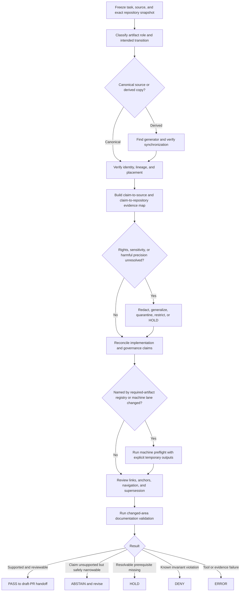

<!-- [KFM_META_BLOCK_V2]
doc_id: kfm://doc/runbook-doctrine-artifact-preflight
title: Doctrine Artifact Preflight Runbook
type: runbook; documentation-control-plane; doctrine-artifact-operator-guide
version: v2.0.0
status: current; repository-grounded; documentation-only; non-authoritative; promotion-sensitive
policy_label: public
owner: OWNER_TBD
review_route: current CODEOWNERS plus the affected documentation, doctrine, provenance, validation, rights, or release stewards; exact assignments remain NEEDS VERIFICATION
created: 2026-05-12
updated: 2026-08-29
current_path: docs/runbooks/DOCTRINE_ARTIFACT_PREFLIGHT.md
repository_snapshot: main@1b8efb6d34871abc98c62cb7793921672f334aa4
prior_blob: 9f6abffaf021b3e77e5b81ad17fa4354de0cecf1
supersedes: v1 in this same path; Git history retains the prior edition
truth_posture: CONFIRMED current repository paths, scripts, registries, schema, tests, workflow, and accepted Directory Rules at the pinned snapshot; PROPOSED process improvements are labeled; current execution, source authority, rights clearance, review acceptance, release, deployment, and publication remain separately governed
authority_boundary: This runbook explains preflight and handoff. It does not adopt doctrine, accept an ADR, admit a source, change policy, approve a review, promote lifecycle state, release, deploy, or publish.
related:
  - CONTRIBUTING.md
  - docs/README.md
  - docs/runbooks/README.md
  - docs/doctrine/README.md
  - docs/doctrine/directory-rules.md
  - docs/adr/ADR-0029-adopt-directory-governance-standard-v2.md
  - docs/registers/DRIFT_REGISTER.md
  - docs/registers/VERIFICATION_BACKLOG.md
  - control_plane/document_registry_doctrine_required.yaml
  - control_plane/doctrine_artifact_provenance_sources.yaml
  - scripts/maintenance/README.md
  - scripts/maintenance/run_doctrine_artifact_preflight.py
  - schemas/contracts/v1/source/doctrine_artifact_preflight_summary.schema.json
  - data/receipts/validation/doctrine_artifact_check/README.md
  - .github/workflows/promotion-gate.yml
[/KFM_META_BLOCK_V2] -->

<a id="top"></a>

# Doctrine Artifact Preflight Runbook

> **Purpose.** Determine whether a KFM doctrine or doctrine-adjacent artifact is identified, attributable, correctly placed, repository-grounded, rights- and sensitivity-aware, navigable, reproducible when derived, and safe to hand off for review.

> [!IMPORTANT]
> A preflight result is not doctrine adoption, source admission, review approval, merge authority, lifecycle promotion, release, deployment, or publication. The strongest normal outcome from this runbook is a reviewable artifact and an evidence-bounded handoff.

> [!WARNING]
> The current repository contains a machine-assisted doctrine-artifact prerequisite lane, but its registries remain `PROPOSED` and all listed source/provenance states are `needs_verification` at the pinned snapshot. A workflow can pass by proving that unresolved prerequisites fail closed; that is not proof that the artifacts themselves are present, authoritative, reviewed, or publishable.

## Current determination

| Surface | Pinned-snapshot result | Consequence |
|---|---|---|
| Runbook placement | `docs/runbooks/DOCTRINE_ARTIFACT_PREFLIGHT.md` is tracked under the established runbook root. | Same-path modernization is correctly placed; no new documentation home is created. |
| Directory authority | Accepted `ADR-0029` adopts `docs/doctrine/directory-rules.md` as the sole writable human Directory Rules authority. | Placement decisions must follow responsibility roots, not topic names. |
| Machine preflight | Required-artifact, provenance, alignment, readiness, rendering, summary-schema, strict-wrapper, and focused-test surfaces are tracked. | Operators may use the current lane, but must preserve its bounded meaning and inspect its write behavior. |
| Required-artifact registry | Three entries are marked `needs_verification`. | Do not change them to `present` merely to obtain a green result. |
| Provenance registry | All three source URLs and statuses remain `NEEDS_VERIFICATION` / `needs_verification`. | File presence cannot substitute for authoritative provenance. |
| Default artifact home | No tracked `docs/doctrine/artifacts/` path was returned at the pinned snapshot. | Do not manufacture placeholder files; use explicit inputs and report the hold. |
| Output placement | The orchestrator defaults to `receipts/doctrine_artifacts/`, while a governed validation-receipt lane is documented under `data/receipts/validation/doctrine_artifact_check/`. | Treat the destination as conflicted; use a temporary output directory unless a bounded change resolves the ownership. |
| Promotion workflow | The workflow proves missing prerequisites remain visible and fail closed. | Passing CI is not evidence that artifact admission or publication occurred. |
| Current execution state | Not established by source inspection. | Run the relevant command against the exact head and report the result; do not inherit an old pass claim. |

Re-check all snapshot-dependent statements before operational use. Repository evidence newer than this document outranks the pinned observations above.

<a id="-quick-jump"></a>

## Quick jump

- [1. Scope](#1-scope)
- [2. Repo fit](#2-repo-fit)
- [3. Accepted inputs](#3-accepted-inputs)
- [4. Exclusions](#4-exclusions)
- [5. Preflight flow](#5-preflight-flow)
- [6. Gate matrix](#6-gate-matrix)
- [7. The eleven preflight steps](#7-the-eleven-preflight-steps)
- [8. Decision outcomes](#8-decision-outcomes)
- [9. Anti-patterns to deny on sight](#9-anti-patterns-to-deny-on-sight)
- [10. Preflight receipt and lineage](#10-preflight-receipt-and-lineage)
- [11. Maintenance CLI commands](#11-maintenance-cli-commands)
- [12. Quickstart — five-minute pass](#12-quickstart--five-minute-pass)
- [13. Task list — pin-to-PR checklist](#13-task-list--pin-to-pr-checklist)
- [14. FAQ](#14-faq)
- [15. Related docs](#15-related-docs)
- [16. Appendix](#16-appendix)

---

## 1. Scope

A **doctrine artifact** is a human-readable source that proposes, records, explains, or supersedes KFM-wide or cross-cutting governance, terminology, architecture, trust boundaries, publication posture, or operating law.

Examples include:

- accepted or proposed doctrine pages and ADRs;
- architecture manuals, domain atlases, dossiers, encyclopedias, and commissioning plans;
- source-reconciliation reports and controlled research syntheses;
- generated PDF or HTML derivatives of an editable doctrine source;
- machine-registry entries that name required doctrine artifacts.

This runbook supports four profiles. Select the narrowest profile that matches the intended transition.

| Profile | Use it when | Minimum result |
|---|---|---|
| **Editorial documentation** | Updating an existing Markdown file without changing its authority or artifact identity. | Accurate Markdown, preserved links/anchors, focused validation, draft PR. |
| **Doctrine reconciliation** | Adding or materially revising governance, architecture, terminology, status, or supersession claims. | Source/evidence ledger, repository reconciliation, explicit unresolved conflicts, review handoff. |
| **Required-artifact machine preflight** | The artifact is named by `control_plane/document_registry_doctrine_required.yaml`, or the machine preflight lane itself changes. | Exact command inputs, structured result, strict/non-strict interpretation, no silent registry mutation. |
| **Adoption or publication transition** | The work would accept an ADR, declare doctrine authoritative, activate a source, release bytes, or publish a governed artifact. | Stop at reviewable repository state and use the separately authorized governing process. |

The full artifact-level preflight is not required for every typo. Every documentation change still requires truth, link, diff, and scope review.

### Audience

This runbook is for maintainers, documentation stewards, doctrine reviewers, source/provenance reviewers, validation maintainers, and contributors preparing a doctrine-related draft pull request.

### Operating rule

Start from exact current evidence. Preserve source lineage. Reconcile claims against the repository. Narrow unsupported language. Keep authority, implementation, validation, review, release, and publication as separate states.

[Back to top](#top)

---

## 2. Repo fit

Accepted Directory Rules place files by their **primary responsibility**.

| Responsibility | Current owning surface |
|---|---|
| Explain the operator procedure | `docs/runbooks/` |
| State human-readable doctrine | `docs/doctrine/` |
| Record an architectural decision | `docs/adr/` |
| Record open drift or verification work | `docs/registers/` |
| Index machine-readable required artifacts and provenance | `control_plane/` |
| Provide bounded operational helpers | `scripts/maintenance/` |
| Provide long-lived validators | `tools/validators/` |
| Define machine-checkable summary shape | `schemas/contracts/v1/source/` |
| Prove bounded behavior | `tests/` and relevant fixtures |
| Store governed validation receipts | `data/receipts/validation/` |
| Decide release, correction, withdrawal, or rollback state | `release/` |

This file belongs in `docs/runbooks/` because it explains how to perform and interpret the preflight. It is not the authority for doctrine content, registry state, schema shape, policy, validation behavior, or release.

### Current implementation boundary

The repository currently has two related but distinct surfaces:

1. **Human preflight** — the evidence, placement, rights, status, navigation, and handoff review described in this runbook.
2. **Machine-assisted prerequisite checks** — scripts, registries, schema, tests, and workflow jobs that inspect a bounded set of required doctrine artifacts.

Neither substitutes for the other. The machine lane can detect selected missing, malformed, misaligned, undersized, duplicate, or unready conditions. It cannot determine that a doctrine claim is true, that a source is authoritative for a claim, that rights permit public distribution, or that an artifact has been adopted.

### Placement decisions

A same-path editorial or structural rewrite does not require a new ADR. Consult accepted Directory Rules and open an ADR or migration record before:

- creating a new responsibility root or parallel doctrine home;
- moving canonical doctrine or machine registries;
- changing the canonical/generated relationship;
- changing the meaning of a lifecycle, receipt, proof, or release root;
- converting a research or intake source into authority;
- retiring a compatibility path with known consumers.

Record material unresolved placement conflicts in the drift or verification register rather than silently choosing a convenient path.

[Back to top](#top)

---

## 3. Accepted inputs

Build a preflight packet from the smallest set of inputs that can support the intended decision.

| Input | Required content |
|---|---|
| **Task contract** | Goal, exact repository, base branch and immutable commit, target path, writable scope, non-goals, validation, stop conditions, and delivery state. |
| **Artifact identity** | File name, stable document identifier when one exists, version/status, source format, content digest when material, and prior edition or supersession relationship. |
| **Source evidence** | Source title, author/steward where known, stable locator, page/section/line locator, date/version, rights or terms, and the exact claim the source can support. |
| **Repository evidence** | Current files, contracts, schemas, policy, scripts, tests, workflows, registries, receipts, release records, or runtime evidence needed to substantiate current-behavior claims. |
| **Authority evidence** | Accepted ADRs, adopted Directory Rules, current doctrine, and any path-scoped instructions. |
| **Rights and sensitivity assessment** | Distribution rights, attribution requirements, access class, living-person/private information, cultural or sovereignty concerns, and harmful-precision risk. |
| **Canonical/derived relationship** | Editable source, generator or export path, generated bytes, synchronization method, and rebuild or rollback procedure. |
| **Overlap evidence** | Open pull requests, active branches, migrations, or generated-output owners touching the same surface. |
| **Machine-lane inputs, when applicable** | Required-artifact registry, provenance registry, artifact directory, output directory, strictness profile, summary schema, and exact command version. |

### Source roles

Treat input sources according to their actual role:

- **Current repository evidence** supports claims about present implementation.
- **Accepted KFM doctrine and ADRs** support governing requirements.
- **Attached files and Drive documents** provide doctrine lineage, research, or candidate ideas until reconciled.
- **Notion** provides coordination and handoff state, not repository or doctrine authority.
- **External sources** support current facts, standards, rights, or source-system details only within their verified scope.
- **Generated language** may summarize or propose; it is not root evidence.

A source can be authoritative for one claim and contextual for another. Record that distinction instead of assigning a universal authority score.

### Copyright and sensitive-source boundary

Do not copy an entire copyrighted or access-restricted artifact into the public repository merely because it is useful. Prefer an authorized canonical link, a provenance record, a rights-cleared excerpt, or a source map that records identity and locators without reproducing protected content.

[Back to top](#top)

---

## 4. Exclusions

This runbook does not:

- validate lifecycle data under `data/raw/`, `data/work/`, `data/quarantine/`, `data/processed/`, `data/catalog/`, `data/triplets/`, or `data/published/`;
- replace source admission, evidence resolution, policy evaluation, review, promotion, release, correction, withdrawal, or rollback controls;
- make a PDF accessible, reproducible, signed, or rights-cleared merely by listing desired tooling;
- define a universal PDF/A, PDF/UA, signing, SLSA, or font toolchain that the repository has not adopted;
- prove runtime, deployment, branch-protection, public-client, or operational behavior from Markdown or fixture results;
- authorize registry mutation, artifact upload, deletion, movement, or supersession;
- permit sensitive, private, culturally restricted, or harmful-precision information to be exposed for convenience;
- require the full repository test suite for an ordinary Markdown-only edit;
- treat a successful machine check as proof of source authority or doctrine adoption.

### Work that uses another lane

| Work | Governing lane |
|---|---|
| Source intake or activation | Source registry, intake, rights, sensitivity, and policy controls |
| Contract or schema change | `contracts/`, `schemas/`, fixtures, validators, tests, and migration controls |
| Policy behavior | `policy/` plus its contracts, fixtures, and tests |
| Data or map artifact release | Lifecycle, proof, catalog, release, correction, and rollback controls |
| Generated documentation | Canonical source plus the repository-discovered generator |
| Exploratory research | `docs/intake/` or the established research/source-map lane |
| Release or publication | Separate review and release authority under `release/` |

When a doctrine review exposes an implementation gap, document the current state accurately. Do not change code, schema, policy, or release configuration merely to make the prose sound true.

[Back to top](#top)

---

## 5. Preflight flow


```mermaid
flowchart TD
    A[Freeze task, source, and exact repository snapshot] --> B[Classify artifact role and intended transition]
    B --> C{Canonical source or derived copy?}
    C -->|Derived| D[Find generator and verify synchronization]
    C -->|Canonical| E[Verify identity, lineage, and placement]
    D --> E
    E --> F[Build claim-to-source and claim-to-repository evidence map]
    F --> G{Rights, sensitivity, or harmful precision unresolved?}
    G -->|Yes| H[Redact, generalize, quarantine, restrict, or HOLD]
    G -->|No| I[Reconcile implementation and governance claims]
    H --> I
    I --> J{Named by required-artifact registry or machine lane changed?}
    J -->|Yes| K[Run machine preflight with explicit temporary outputs]
    J -->|No| L[Review links, anchors, navigation, and supersession]
    K --> L
    L --> M[Run changed-area documentation validation]
    M --> N{Result}
    N -->|Supported and reviewable| P[PASS to draft-PR handoff]
    N -->|Claim unsupported but safely narrowable| Q[ABSTAIN and revise]
    N -->|Resolvable prerequisite missing| R[HOLD]
    N -->|Known invariant violation| S[DENY]
    N -->|Tool or evidence failure| T[ERROR]
```

The flow is intentionally asymmetric: safe authoring may continue while a later adoption, release, or publication transition remains held.

[Back to top](#top)

---

## 6. Gate matrix

| # | Gate | Applies to | Minimum pass evidence | Failure posture |
|---:|---|---|---|---|
| 1 | **Task and snapshot identity** | All changes | Repository, immutable base, target path/blob, source locator, writable scope, and intended delivery are recorded. | `ERROR` if the target cannot be resolved; otherwise `HOLD`. |
| 2 | **Artifact role and authority** | All doctrine-related artifacts | The document is classified as research, proposal, runbook, doctrine, ADR, compatibility copy, generated derivative, or historical record; no state is implied by prose alone. | `ABSTAIN`, revise, or `HOLD`. |
| 3 | **Canonical/generated relationship** | Generated or mirrored artifacts | Canonical editable source and generator are known, or the derivative is explicitly held without hand-editing. | `HOLD`; do not create divergent writable copies. |
| 4 | **Directory placement** | New, moved, renamed, or authority-changing files | Accepted Directory Rules and relevant ADRs support the owning root; known consumers and rollback are identified. | `HOLD` or `DENY` for a parallel authority home. |
| 5 | **Evidence and provenance** | Material factual or governance claims | Each material claim has an appropriate source and locator; source limits and unresolved conflicts are visible. | `ABSTAIN`, narrow, or `HOLD`. |
| 6 | **Current implementation claims** | Claims about repository or runtime behavior | Current files, tests, workflows, logs, or generated artifacts support the claim at an exact snapshot. | `ABSTAIN` or rewrite as `PROPOSED` / `UNKNOWN`. |
| 7 | **Rights, privacy, sensitivity, and sovereignty** | Any artifact carrying protected or sensitive material | Distribution and attribution are allowed; exact locations and personal/cultural information are appropriately transformed or restricted. | `DENY`, restrict, generalize, quarantine, or `HOLD`. |
| 8 | **Lifecycle and authority separation** | All artifacts | Draft, review, merge, adoption, source activation, promotion, release, deployment, and publication remain distinct; receipts and rendered carriers are not treated as truth. | `DENY` or correct the claim. |
| 9 | **Machine prerequisite checks** | Registry-listed artifacts or changes to the preflight lane | Inputs, strictness, outputs, exit codes, summary shape, and current hold conditions are inspected at the exact head. | `HOLD`, `DENY`, or `ERROR` according to the command result. |
| 10 | **Navigation and lineage** | All material edits | Relative links, anchors, parent indexes, supersession, prior-edition retention, and known inbound references remain coherent. | Fix before handoff or `HOLD`. |
| 11 | **Validation, review handoff, and rollback** | All changes | Complete diff reviewed; focused checks run; failures attributed; draft PR, limitations, reviewer route, and revert path are explicit. | `HOLD` at the highest truthful delivery state. |

A gate passes only for the claim it checks. No gate compensates for unresolved rights, unsafe precision, missing evidence closure, direct public access to internal stores, or absent rollback for public state.

[Back to top](#top)

---

## 7. The eleven preflight steps

### 7.1 Task and snapshot identity

Before editing or evaluating an artifact:

1. Confirm the repository and current default branch.
2. Record the immutable base commit.
3. Fetch the complete target file and record its blob hash.
4. Record the source artifact identity, locator, version/date, and digest when material.
5. Search for path-scoped instructions.
6. Search open pull requests and active branches for overlap.
7. Define the writable path set, non-goals, validation, and terminal state.
8. Re-check the default-branch head immediately before the first write.

Useful local evidence:

```bash
git rev-parse --show-toplevel
git branch --show-current
git rev-parse HEAD
git status --short
git hash-object docs/runbooks/DOCTRINE_ARTIFACT_PREFLIGHT.md
git diff -- docs/runbooks/DOCTRINE_ARTIFACT_PREFLIGHT.md
```

For an external file, record a deterministic digest without making it repository authority:

```bash
python - <<'PY'
from hashlib import sha256
from pathlib import Path

path = Path("path/to/source-artifact")
print(sha256(path.read_bytes()).hexdigest())
PY
```

A prior task summary, issue comment, or memory is not an exact-current snapshot.

### 7.2 Artifact role and authority

Classify the artifact before evaluating its wording.

| Role | Safe interpretation |
|---|---|
| **Exploratory intake or source map** | Research and lineage; not KFM authority. |
| **Proposal or planning reference** | Candidate design; does not prove implementation or adoption. |
| **Runbook** | Human operating procedure; not policy, code, or release authority. |
| **Doctrine page** | Human governance statement; authority depends on accepted repository governance and supersession state. |
| **ADR** | Decision record; only its recorded accepted state and scope govern. |
| **Compatibility or mirror copy** | Read-only projection unless an accepted migration says otherwise. |
| **Generated derivative** | Rebuildable carrier of a canonical source; not independently editable. |
| **Historical or superseded artifact** | Retained lineage; not current authority unless explicitly reactivated. |

Do not upgrade a document from proposal to authority because it is polished, frequently cited, stored in Drive, converted to PDF, added to a registry, or repeatedly summarized.

Use `CONFIRMED`, `PROPOSED`, `UNKNOWN`, or `NEEDS VERIFICATION` where the distinction affects a decision. Avoid labeling routine prose sentence by sentence.

### 7.3 Canonical source and derived copies

For Markdown, PDF, HTML, slides, or other exports, determine:

- which file is the editable canonical source;
- whether the output is generated, mirrored, or independently authored;
- which command or workflow produces it;
- which fonts, templates, assets, and versions affect the output;
- how the output is checked for synchronization;
- how prior generated bytes are retained, corrected, or replaced.

Rules:

- Update the canonical source and regenerate when the generator is available.
- Do not hand-edit a derived file to conceal an unavailable generator.
- Do not create a second writable canonical copy in Drive, Notion, or another repository path.
- If the generator or source cannot be resolved, hold that derivative and continue any independent safe Markdown work.
- State the exact unverified toolchain instead of inventing a universal PDF/A, PDF/UA, signing, or supply-chain requirement.

A generated file can be byte-correct and still be unsupported, inaccessible, rights-restricted, or non-authoritative.

### 7.4 Directory placement

Read:

- [Directory Rules](../doctrine/directory-rules.md);
- [ADR-0029](../adr/ADR-0029-adopt-directory-governance-standard-v2.md);
- the nearest parent README;
- relevant drift and verification entries;
- any accepted ADR that governs the artifact family.

Apply primary-responsibility placement. Do not create parallel homes for:

- doctrine;
- contracts or schemas;
- policy;
- source registries;
- receipts or proofs;
- catalog or published data;
- release, correction, or rollback records.

For a new or moved path, record:

```text
owning responsibility:
Directory Rules basis:
accepted ADR basis:
known consumers:
compatibility impact:
migration step:
validation:
rollback:
```

If placement is unresolved but the work is otherwise safe, keep the artifact in its established path and label any proposed move separately.

### 7.5 Evidence and provenance

Build a claim-evidence map for every material assertion.

| Claim | Required support |
|---|---|
| A repository path or object exists | Exact repository file/tree evidence at a pinned commit |
| A command behaves a certain way | Current source code plus focused test or execution evidence |
| A workflow enforces a gate | Workflow source plus exact-head run evidence; branch rules separately verified |
| KFM requires a governance rule | Accepted ADR or current adopted doctrine |
| An external source is authoritative | Source-native identity, scope, terms, steward role, and claim fitness |
| A PDF or attachment says something | Stable file identity plus page/section locator |
| A generated artifact matches its source | Generator/input identity, output digest, and synchronization check |
| A public release occurred | Release record and public artifact evidence, not a PR or build alone |

Record what the source **cannot** prove. A registry row, digest, file presence, rendered page, map layer, AI summary, or successful schema check is not proof of substantive truth.

For connected sources:

- Drive material is read-only doctrine/research lineage unless repository governance adopts it.
- Notion records coordination, status, and handoff links.
- GitHub is current implementation authority for repository behavior.
- External web research must remain distinguishable from supplied-source content and repository evidence.

### 7.6 Current implementation claims

Inspect the implementation surfaces a claim names. Do not infer them from documentation alone.

Before stating that KFM “has,” “runs,” “enforces,” “publishes,” or “supports” something, check the applicable evidence:

- path and exact bytes;
- contract and schema;
- positive and negative fixtures;
- validator or policy source;
- focused tests;
- workflow callers;
- generated receipts or proofs;
- runtime or deployment evidence;
- public release records.

Use bounded wording:

| Evidence available | Safe wording |
|---|---|
| File only | “The repository tracks…” |
| Schema and fixtures | “The repository defines and fixture-tests the selected shape…” |
| Source plus focused tests | “The checked implementation passes the named focused test at this head…” |
| Workflow source only | “The workflow is configured to run…” |
| Exact workflow run | “The exact-head run completed with…” |
| No runtime probe | “Runtime behavior remains `UNKNOWN` / `NEEDS VERIFICATION`.” |

Do not call inherited or unrun checks passing. Do not call a docs-only PR implementation proof.

### 7.7 Rights, privacy, sensitivity, and sovereignty

Before adding or circulating an artifact, identify:

- copyright and redistribution terms;
- required attribution;
- personal, living-person, health, DNA, private-land, or confidential material;
- archaeology, sacred/cultural, Indigenous/community-controlled, rare-species, or exact-location sensitivity;
- critical-infrastructure or operational-security detail;
- source terms that prohibit republishing raw content;
- harmful precision introduced by maps, coordinates, imagery, or 3D assets.

Use the least-exposing safe result:

```text
retain privately -> quarantine -> redact -> generalize -> delay/stage access -> deny
```

Do not:

- upload uncertain or restricted bytes to make a presence check pass;
- hide sensitive features only with client styling;
- strip attribution or provenance during conversion;
- infer public permission from public discoverability;
- treat checksum verification as rights clearance.

Record each transformation, reason, responsible review route, and correction/rollback path.

### 7.8 Lifecycle and authority separation

Keep these transitions distinct:

```text
draft
-> branch
-> draft pull request
-> review
-> merge
-> governance adoption or source admission
-> lifecycle promotion
-> release
-> deployment
-> publication
-> correction / withdrawal / rollback
```

A later state does not follow automatically from an earlier one.

Specific boundaries:

- A merged Markdown file can remain a proposal.
- An accepted ADR does not prove implementation.
- A passing preflight does not admit a source.
- A receipt records a process observation; it is not a proof or release decision.
- A rendered PDF, map, tile, graph, index, or AI answer is a carrier, not sovereign truth.
- A public client must use governed APIs or released public-safe artifacts, not internal or unreleased stores.
- Watchers, checkers, and CI jobs may detect and report; they do not publish.

### 7.9 Required-artifact machine preflight

#### Current inputs

| Surface | Current path | Bounded role |
|---|---|---|
| Required artifact registry | `control_plane/document_registry_doctrine_required.yaml` | Names three required files and their declared presence state. |
| Provenance registry | `control_plane/doctrine_artifact_provenance_sources.yaml` | Records document IDs, source URLs, and provenance status. |
| Required artifact checker | `scripts/maintenance/check_required_doctrine_artifacts.py` | Checks presence, selected status mismatch, minimum size, and duplicate SHA-256 groups. |
| Provenance checker | `scripts/maintenance/check_doctrine_artifact_provenance.py` | Checks required fields, URL form/placeholders, and allowed status vocabulary. |
| Registry alignment checker | `scripts/maintenance/check_doctrine_registry_alignment.py` | Compares required and provenance registry identity. |
| Consumer readiness checker | `scripts/maintenance/check_normalized_summary_consumer_readiness.py` | Evaluates the tracked normalized-summary consumer-readiness register. |
| Presence renderer | `scripts/maintenance/render_doctrine_presence_input.py` | Converts checker output to the bounded policy-consumer input shape. |
| Orchestrator | `scripts/maintenance/run_doctrine_artifact_preflight.py` | Runs child checks, emits a combined summary, and validates it against the current summary schema. |
| Strict wrapper | `scripts/maintenance/enforce_doctrine_preflight_gates.sh` | Adds `--strict`, `--strict-provenance`, and `--require-consumer-readiness`. |
| Focused test wrapper | `scripts/maintenance/run_doctrine_artifact_test_suite.sh` | Runs summary validators and the bounded doctrine-artifact test set. |
| Summary schema | `schemas/contracts/v1/source/doctrine_artifact_preflight_summary.schema.json` | Machine-checkable combined-summary shape. |
| Promotion workflow | `.github/workflows/promotion-gate.yml` | Proves the missing prerequisite remains visible and fail-closed; it does not admit or publish artifacts. |

#### What the current checker proves

`check_required_doctrine_artifacts.py` reports:

- whether each registry-listed filename exists in the selected artifact directory;
- whether a declared `missing` or `present` state conflicts with observed presence;
- whether a present file is smaller than `10,000` bytes;
- whether two required files have the same SHA-256 digest;
- a structured `pass` or `fail` result.

It does **not** establish source authenticity, semantic correctness, ownership, rights, accessibility, citation quality, steward approval, adoption, release, or publication.

The `needs_verification` registry state is intentionally neutral in the current presence-mismatch logic. Do not interpret that as approval.

#### Safe exploratory run

Run from the repository root and keep outputs outside governed or compatibility roots while investigating:

```bash
tmp_dir="$(mktemp -d)"
readonly tmp_dir

python scripts/maintenance/run_doctrine_artifact_preflight.py \
  --output-dir "$tmp_dir" \
  --presence-output "$tmp_dir/doctrine-presence-input.json"

printf 'Preflight outputs: %s\n' "$tmp_dir"
find "$tmp_dir" -maxdepth 1 -type f -print
git status --short
```

The orchestrator writes JSON files into `--output-dir`. It invokes the provenance-status sync helper **without** `--write`, so that helper does not rewrite the provenance registry during this command. Review the emitted candidate-change payload; existence-based “changed” output is not provenance verification.

#### Strict run

Use the strict wrapper when evaluating readiness:

```bash
tmp_dir="$(mktemp -d)"
readonly tmp_dir

bash scripts/maintenance/enforce_doctrine_preflight_gates.sh \
  --output-dir "$tmp_dir" \
  --presence-output "$tmp_dir/doctrine-presence-input.json"
```

At the pinned snapshot, a strict provenance result is expected to remain held because the source URLs are `NEEDS_VERIFICATION`. Report that as a current prerequisite failure, not as a documentation regression.

#### Exit interpretation

| Exit | Meaning |
|---:|---|
| `0` | The selected command profile completed and its selected gates did not require failure. This is not adoption or publication. |
| `1` | A selected fail-closed condition is unresolved, such as required presence, provenance, alignment, or consumer readiness. |
| `2` | Execution, parsing, child-command, rendering, filesystem, or summary-schema error prevented a trustworthy result. |

Non-strict orchestration can emit a summary and return `0` even when a child check reports an ordinary `fail`. Always inspect child return codes and payloads.

#### Registry synchronization safety

The required-registry synchronizer writes by default. Run it as inspection unless the current task explicitly authorizes the registry update:

```bash
python scripts/maintenance/sync_doctrine_artifact_registry_status.py \
  --dry-run \
  --fail-on-change
```

Do not omit `--dry-run` casually.

The provenance synchronizer writes the registry only with `--write`:

```bash
python scripts/maintenance/sync_doctrine_artifact_provenance_status.py
```

Its current candidate status change is based on file existence. That is insufficient by itself for authoritative provenance. Review source identity, URL, rights, and steward evidence before any `--write` use.

#### Focused tests

When code, registries, schema, validators, fixtures, or workflow behavior in this lane changes, run the bounded suite:

```bash
bash scripts/maintenance/run_doctrine_artifact_test_suite.sh
```

The current wrapper invokes the orchestrator with its default output directory. Inspect `git status --short` and generated files afterward. Do not commit candidate outputs into `receipts/doctrine_artifacts/` merely because the test wrapper created them; the output-home conflict remains unresolved.

For a Markdown-only runbook edit, focused documentation validation and hosted exact-head checks are normally proportionate. The machine suite is optional unless the wording depends on a behavior that needs re-verification.

### 7.10 Navigation, references, and supersession

Review:

- one H1 and logical heading order;
- stable explicit anchors and known inbound references;
- relative links and reference definitions;
- code-fence and Mermaid closure;
- table structure and GitHub alert syntax;
- parent README and documentation map entries;
- canonical/compatibility links;
- supersedes/superseded-by metadata;
- prior-edition retention;
- generated and mirrored copies;
- links from machine registries or workflows.

When changing a heading with known inbound links, preserve an explicit compatibility anchor or update every verified consumer in the same review boundary.

Do not delete a historical artifact to make the current edition look canonical. Record supersession and keep lineage reconstructable.

### 7.11 Validation, handoff, and rollback

#### Markdown-only minimum

```bash
git diff --check
pre-commit run --files docs/runbooks/DOCTRINE_ARTIFACT_PREFLIGHT.md
```

The current pre-commit configuration provides repository-hygiene checks, not a dedicated Markdown linter. Manually inspect:

- the complete rendered and raw diff;
- heading hierarchy and anchors;
- tables, alerts, code fences, and Mermaid;
- every added relative path;
- exact names of commands, files, flags, and statuses;
- unsupported implementation or authority claims;
- unrelated formatting churn;
- final newline and trailing whitespace.

Allow relevant hosted documentation and repository checks to run against the exact head. Report `PENDING`, `SKIPPED`, `UNAVAILABLE`, inherited failures, and changed-area failures separately.

#### Handoff fields

A complete handoff records:

```text
result and delivery state:
repository and exact base:
branch and exact head:
changed paths:
source inputs and locators:
Directory Rules basis:
material corrections:
validation executed:
hosted checks:
known limitations and inherited failures:
review route:
non-effects:
rollback:
open verification:
```

#### Rollback

Before merge, close the draft PR or restore the prior blob in a transparent commit. After merge, revert the documentation commit or pull request; do not rewrite shared history.

If the change also altered registries or generated outputs, restore each owning surface through its accepted correction or migration path. Preserve failed outputs when they are required for audit rather than silently deleting them.

[Back to top](#top)

---

## 8. Decision outcomes

Use one primary outcome for the preflight and record supporting limitations separately.

| Outcome | Use when | Required action |
|---|---|---|
| `PASS` | The artifact is accurate enough for its declared role, reviewable, correctly placed, and supported by the selected evidence and checks. | Deliver to the authorized review state. Do not imply adoption, release, or publication. |
| `ABSTAIN` | A substantive claim lacks adequate support, but the artifact can be made safe by removing, narrowing, or explicitly qualifying it. | Revise the claim and record what evidence is missing. |
| `HOLD` | A checkable prerequisite—canonical source, provenance, rights, placement, review, generator, registry state, or output ownership—is unresolved. | Preserve the work in draft, identify the owner and exact clearing condition, and avoid the blocked transition. |
| `DENY` | The proposed artifact or transition would violate a known invariant, expose protected material, create a parallel authority home, fabricate evidence, or bypass a required control. | Do not perform the transition; remove or quarantine the unsafe material and record the reason. |
| `ERROR` | Tooling, parsing, filesystem, connector, or evidence access failed so the requested check could not be trusted. | Preserve diagnostics, distinguish the failure from a substantive deny, and retry only after the error is understood. |

### Outcome examples

| Observation | Outcome |
|---|---|
| Markdown links, claims, and placement are supported; exact-head docs checks pass. | `PASS` to draft-PR review. |
| A paragraph says a runtime route exists, but only a planning PDF supports it. | `ABSTAIN`; rewrite as a proposal or remove it. |
| The PDF generator is unavailable, while the canonical Markdown edit is safe. | `PASS` the Markdown edit; `HOLD` the derivative regeneration. |
| A required artifact is absent or its provenance URL is unresolved. | `HOLD`; do not add placeholder bytes. |
| A source contains private living-person data without authority to publish. | `DENY` public inclusion; quarantine or redact. |
| The preflight summary cannot be parsed or validated. | `ERROR`; do not infer pass or fail from partial output. |
| The promotion workflow proves the missing-artifact test is fail-closed. | `PASS` for that test claim only; artifact readiness remains `HOLD`. |

[Back to top](#top)

---

## 9. Anti-patterns to deny on sight

Deny or immediately correct these patterns:

1. **Placeholder artifact admission** — adding tiny, duplicated, empty, synthetic, or unrelated files under required names to satisfy presence.
2. **Presence equals provenance** — marking an artifact verified because a file exists.
3. **Registry laundering** — changing `missing` or `needs_verification` to `present` without canonical identity and source evidence.
4. **Workflow laundering** — claiming artifacts are ready because a workflow proved that missing inputs fail closed.
5. **Rendered-equals-canonical** — treating a PDF, screenshot, map, tile, or generated summary as independently authoritative.
6. **Hand-editing derivatives** — changing generated bytes without the canonical source and generator.
7. **Drive or Notion authority substitution** — treating a connected workspace copy as repository governance or implementation evidence.
8. **Documentation-made implementation** — changing prose to claim a route, schema, policy, source, or release exists when implementation evidence does not.
9. **Invented identities or approvals** — fabricating owners, reviewers, review dates, signatures, digests, or acceptance state.
10. **Rights by discoverability** — assuming a public URL permits redistribution.
11. **Client-side secrecy** — publishing sensitive coordinates or properties and hiding them only through style or UI.
12. **Receipt/proof/release collapse** — treating emitted JSON as evidence truth, policy approval, or a release decision.
13. **Output-root convenience** — committing generated files into an unresolved receipt or artifact home because it is the script default.
14. **Silent supersession** — overwriting or deleting prior doctrine without lineage and correction notes.
15. **Broad cleanup in a focused PR** — mixing unrelated reformatting, path moves, or governance changes into the preflight update.
16. **Inherited-pass claims** — reporting unrun, old-head, skipped, or unrelated checks as passing for the current change.

[Back to top](#top)

---

## 10. Preflight receipt and lineage

### Current repository truth

The repository tracks a machine-checkable combined preflight summary schema and scripts that emit receipt-shaped JSON. A separate accepted `DoctrineArtifactPreflightReceipt` authority was not established by the evidence reviewed for this revision.

Therefore:

- call the current JSON a **preflight summary**, **check output**, or **candidate validation receipt** according to its actual producer and schema;
- do not invent a new canonical object family in this runbook;
- do not infer governed receipt placement from the orchestrator's default directory;
- treat committed validation receipts as process memory, not proof or release state;
- preserve the output-home conflict until a responsible migration or ADR resolves it.

### Minimum human-readable preflight record

Record at least:

| Field | Meaning |
|---|---|
| `preflight_id` | Stable task-local identifier, not a new global schema claim |
| `executed_at` | UTC time of the review or command |
| `repository` | Repository identity |
| `base_commit` | Immutable base |
| `head_commit` | Exact reviewed head |
| `artifact` | Path or external source identity |
| `artifact_digest` | Digest when material and available |
| `profile` | Editorial, doctrine reconciliation, required-artifact machine preflight, or transition handoff |
| `sources` | Source IDs and locators |
| `result` | `PASS`, `ABSTAIN`, `HOLD`, `DENY`, or `ERROR` |
| `checks` | Executed checks and exact results |
| `limitations` | Unsupported claims, unavailable tools, inherited failures, or pending checks |
| `rights_sensitivity` | Bounded assessment and transforms |
| `review_route` | Required human or steward review |
| `non_effects` | States not changed |
| `rollback` | Revert, correction, or supersession path |

Illustrative task record—not a canonical schema:

```yaml
preflight_id: "task-local:doctrine-artifact-preflight-2026-08-29"
executed_at: "2026-08-29T00:00:00Z"
repository: "bartytime4life/Kansas-Frontier-Matrix"
base_commit: "<exact-base-sha>"
head_commit: "<exact-head-sha>"
artifact:
  path: "docs/runbooks/DOCTRINE_ARTIFACT_PREFLIGHT.md"
  role: "runbook"
profile: "editorial-documentation"
sources:
  - id: "repo-directory-rules"
    locator: "docs/doctrine/directory-rules.md"
result: "PASS"
checks:
  - name: "git-diff-check"
    result: "pass"
limitations:
  - "No deployment or publication behavior was exercised."
non_effects:
  - "no doctrine adoption"
  - "no source admission"
  - "no release or publication"
rollback: "Revert the documentation commit or pull request."
```

### Where to record state

- Put exact implementation and validation details in the pull-request body.
- Use Notion for coordination, reviewer handoff, and links back to exact GitHub evidence.
- Add to the drift or verification register only when the issue is material and not already tracked.
- Commit generated receipt output only when its owning root, retention, identity, and review requirements are established.
- Never store private reasoning or sensitive source payloads as a preflight record.

### Corrections

When a preflight record is wrong:

1. Preserve the incorrect record when audit obligations require it.
2. Identify the affected artifact, command, inputs, and downstream decisions.
3. Emit a correction or superseding record in the accepted home.
4. Invalidate derived summaries that relied on the bad result.
5. Correct the source, registry, or command.
6. Rerun at an exact head.
7. Link the corrected result and rollback target.

[Back to top](#top)

---

## 11. Maintenance CLI commands

Inspect `--help` and source before operational use. The table describes the pinned snapshot, not a permanent API guarantee.

| Command | Default behavior | Write risk | Safe use |
|---|---|---|---|
| `check_required_doctrine_artifacts.py` | Reads required registry and artifact directory; prints structured JSON. | Writes only when `--output` is supplied. | Use explicit registry/artifact paths and a temporary output. |
| `check_doctrine_artifact_provenance.py` | Checks provenance fields, URLs, placeholders, and status values. | Writes only when `--output` is supplied. | Treat a pass as registry-field validation, not source authentication. |
| `check_doctrine_registry_alignment.py` | Compares required and provenance registry entries. | Inspection only unless a future version changes. | Verify exact source before relying on this description. |
| `check_normalized_summary_consumer_readiness.py` | Checks tracked consumer-readiness state. | Inspection only unless a future version changes. | Use `--require-all-validated` for fail-closed readiness. |
| `render_doctrine_presence_input.py` | Renders checker output for the bounded consumer shape. | Stdout unless redirected. | Validate the source receipt first. |
| `run_doctrine_artifact_preflight.py` | Runs child checks, writes outputs, and validates the combined summary schema. | Creates `--output-dir`; may create `--presence-output`. | Use a temporary output directory and inspect all child return codes. |
| `enforce_doctrine_preflight_gates.sh` | Invokes the orchestrator with strict presence, provenance, and readiness flags. | Same output writes as the orchestrator. | Use for readiness evaluation, not routine editorial validation. |
| `sync_doctrine_artifact_registry_status.py` | Reconciles registry status with file presence. | **Writes the registry by default.** | Use `--dry-run --fail-on-change`; mutate only in an explicitly authorized, reviewed change. |
| `sync_doctrine_artifact_provenance_status.py` | Proposes existence-based provenance status changes and prints JSON. | Rewrites registry only with `--write`; optional output file. | Never treat existence alone as authoritative provenance. |
| `run_doctrine_artifact_test_suite.sh` | Runs bounded validators and tests. | Current orchestration can write default candidate outputs. | Inspect the working tree and do not commit unresolved output-root artifacts. |

### Command discovery

```bash
python scripts/maintenance/check_required_doctrine_artifacts.py --help
python scripts/maintenance/check_doctrine_artifact_provenance.py --help
python scripts/maintenance/run_doctrine_artifact_preflight.py --help
python scripts/maintenance/sync_doctrine_artifact_registry_status.py --help
python scripts/maintenance/sync_doctrine_artifact_provenance_status.py --help
```

### Focused command set

Editorial Markdown change:

```bash
git diff --check
pre-commit run --files docs/runbooks/DOCTRINE_ARTIFACT_PREFLIGHT.md
```

Machine-lane change:

```bash
bash scripts/maintenance/run_doctrine_artifact_test_suite.sh
```

Strict readiness evaluation with temporary outputs:

```bash
tmp_dir="$(mktemp -d)"
readonly tmp_dir

bash scripts/maintenance/enforce_doctrine_preflight_gates.sh \
  --output-dir "$tmp_dir"
```

Always inspect:

```bash
git status --short
git diff --stat
git diff
```

Do not run synchronization commands, move artifacts, or delete outputs solely to make a check green.

[Back to top](#top)

---

## 12. Quickstart — five-minute pass

### Ordinary Markdown or runbook update

1. **Pin the target.** Record repository, current `main`, target blob, branch, and writable path.
2. **Read the authority.** Read the complete target, parent README, Directory Rules, ADR-0029, and directly related implementation.
3. **Correct the truth boundary.** Remove stale paths, invented commands, unsupported maturity, false authority, and repeated boilerplate.
4. **Check the document.** Review headings, anchors, links, tables, code fences, examples, status labels, non-effects, and rollback.
5. **Validate and hand off.** Run focused hygiene checks, inspect the complete diff, push a dedicated branch, and open a draft PR.

### Registry-listed doctrine artifact

1. Complete the five steps above.
2. Verify canonical source identity, digest, rights, and provenance.
3. Run the non-strict orchestrator with a temporary output directory.
4. Inspect every child return code and payload.
5. Run the strict wrapper only when evaluating readiness.
6. Keep unresolved provenance or missing artifacts on `HOLD`.
7. Never substitute placeholder bytes or unreviewed status changes.

### Five-minute stop conditions

Stop or narrow the task when:

- the source cannot be identified;
- two materially different authority interpretations are equally supported;
- rights or sensitivity may be violated;
- the target is generated but its canonical source cannot be found;
- an overlapping branch owns the same artifact;
- a registry mutation would be required but is outside the task;
- output placement is unresolved and committing the output is unnecessary;
- the requested transition is adoption, release, deployment, or publication rather than reviewable authoring.

[Back to top](#top)

---

## 13. Task list — pin-to-PR checklist

### Before editing

- [ ] Repository, default branch, and exact base commit recorded.
- [ ] Target path and prior blob recorded.
- [ ] Complete target and parent README read.
- [ ] Path-scoped instructions searched.
- [ ] Directory Rules and relevant accepted ADRs read.
- [ ] Open pull requests and branches checked for overlap.
- [ ] Artifact role and intended transition classified.
- [ ] Writable scope, non-goals, validation, and rollback defined.

### Source and claim review

- [ ] Canonical source and any generated derivative identified.
- [ ] Stable source identity and locators recorded.
- [ ] Material claims mapped to appropriate sources.
- [ ] Current implementation claims checked against current repository evidence.
- [ ] Source limitations and unresolved conflicts stated.
- [ ] Rights, attribution, privacy, sovereignty, and harmful precision reviewed.
- [ ] No generated language, map, tile, graph, or summary is treated as root truth.

### Placement and lifecycle

- [ ] Primary responsibility and owning root are explicit.
- [ ] No parallel authority home is created.
- [ ] Existing IDs, anchors, lineage, and compatibility surfaces are preserved or migrated.
- [ ] Draft, review, merge, adoption, promotion, release, deployment, and publication remain distinct.
- [ ] Receipt, proof, catalog, and release object meanings remain separate.

### Machine preflight, when applicable

- [ ] Required and provenance registries inspected.
- [ ] Artifact directory passed explicitly or its default verified.
- [ ] Temporary output directory used for investigation.
- [ ] Child return codes and structured payloads reviewed.
- [ ] Strict/non-strict behavior distinguished.
- [ ] No registry write occurred unintentionally.
- [ ] Missing or unverified artifacts remain visible.
- [ ] Candidate outputs were not committed to an unresolved root.

### Validation and delivery

- [ ] Complete diff reviewed for unrelated churn and unintended deletion.
- [ ] `git diff --check` run.
- [ ] Current pre-commit hygiene run for changed files when available.
- [ ] Relevant focused tests run if machine behavior changed.
- [ ] Added links and paths verified.
- [ ] Hosted exact-head checks reviewed or reported pending/unavailable.
- [ ] Failures attributed as introduced, inherited, unrelated, skipped, or unavailable.
- [ ] Draft PR base, head, changed paths, and draft state verified.
- [ ] Review route, limitations, non-effects, and rollback recorded.
- [ ] No merge, adoption, activation, release, deployment, promotion, or publication implied.

[Back to top](#top)

---

## 14. FAQ

### Does `PASS` make a doctrine artifact authoritative?

No. `PASS` means the selected preflight found the artifact supportable for its declared role and delivery state. Authority still depends on the applicable accepted governance, review, ADR, or adoption process.

### Why can `promotion-gate` pass while doctrine artifacts remain unresolved?

The workflow's current doctrine prerequisite job tests that missing artifacts remain visible and fail closed. The job can pass because the negative behavior is correct. Its summary explicitly preserves the hold; it does not claim the artifacts are admitted.

### May I add placeholder PDFs to satisfy the required-artifact checker?

No. Placeholder, duplicated, undersized, renamed-unrelated, or synthetic bytes corrupt the evidence chain. Keep the check failing or held until canonical, rights-appropriate artifacts or approved provenance links are available.

### May I change `needs_verification` to `present` after seeing a file?

Not on presence alone. Verify canonical identity, source lineage, rights, digest, and the responsible review route. Use the registry synchronizer in `--dry-run` mode first and review the exact change.

### Why should outputs go to a temporary directory?

The current orchestrator default and the documented governed validation-receipt lane disagree. A temporary directory preserves reversibility and avoids turning an unresolved default into authority.

### Is PDF/A, PDF/UA, signing, or SLSA always required?

No universal repository requirement for every doctrine artifact was established in this revision. Apply the repository-discovered generator, accessibility, integrity, rights, and release requirements appropriate to the actual artifact and intended distribution. Record unknown tooling instead of inventing compliance.

### Do ordinary Markdown edits require the doctrine machine suite?

Usually not. Review the complete diff, run repository hygiene and relevant documentation checks, and let hosted exact-head checks run. Run the machine suite when the edit changes or depends on its behavior.

### Can Notion or Google Drive be the canonical copy?

They can hold coordination, research, lineage, or collaborative working material. Code-coupled documentation and current implementation claims remain grounded in GitHub. Keep one canonical editable copy and cross-link rather than maintaining divergent writable versions.

### Can AI prepare or summarize an artifact?

Yes, as an interpretive assistant. The result must retain source locators, truth boundaries, rights/sensitivity controls, review state, and cite-or-abstain behavior. Generated language cannot adopt doctrine or replace evidence.

### Who approves the artifact?

Use current CODEOWNERS and repository review routing, then include the relevant doctrine, provenance, rights, sensitivity, validation, or release steward for the consequence involved. Exact assignments remain `NEEDS VERIFICATION` where the repository does not establish them.

### What should happen to a superseded edition?

Retain it or its reconstructable Git history, mark the supersession relationship, update known navigation, and preserve correction lineage. Do not silently overwrite history.

### What should happen when a source is sensitive or redistribution rights are unclear?

Do not add the source bytes to a public path. Quarantine, redact, generalize, link to an authorized source, or hold the artifact until the responsible review is complete.

[Back to top](#top)

---

## 15. Related docs

### Governing documentation

- [Contributing to KFM](../../CONTRIBUTING.md)
- [Documentation root](../README.md)
- [Runbooks index](README.md)
- [Doctrine index](../doctrine/README.md)
- [Directory Rules](../doctrine/directory-rules.md)
- [ADR index](../adr/INDEX.md)
- [ADR-0029 — Adopt Directory Governance Standard v2](../adr/ADR-0029-adopt-directory-governance-standard-v2.md)
- [Drift Register](../registers/DRIFT_REGISTER.md)
- [Verification Backlog](../registers/VERIFICATION_BACKLOG.md)

### Machine preflight and evidence surfaces

- [Maintenance-script lane](../../scripts/maintenance/README.md)
- [Required doctrine-artifact registry](../../control_plane/document_registry_doctrine_required.yaml)
- [Doctrine-artifact provenance registry](../../control_plane/doctrine_artifact_provenance_sources.yaml)
- [Required-artifact checker](../../scripts/maintenance/check_required_doctrine_artifacts.py)
- [Preflight orchestrator](../../scripts/maintenance/run_doctrine_artifact_preflight.py)
- [Strict preflight wrapper](../../scripts/maintenance/enforce_doctrine_preflight_gates.sh)
- [Focused doctrine-artifact test wrapper](../../scripts/maintenance/run_doctrine_artifact_test_suite.sh)
- [Preflight summary schema](../../schemas/contracts/v1/source/doctrine_artifact_preflight_summary.schema.json)
- [Validation-receipt lane](../../data/receipts/validation/doctrine_artifact_check/README.md)
- [Promotion-gate workflow](../../.github/workflows/promotion-gate.yml)
- [Pre-commit configuration](../../.pre-commit-config.yaml)

These links establish navigation, not authority equivalence. Read each file's status and evidence boundary.

[Back to top](#top)

---

## 16. Appendix

### A. Claim-to-evidence worksheet

| Claim ID | Proposed wording | Claim class | Source and locator | Repository evidence | Rights/sensitivity | Status | Revision or clearing action |
|---|---|---|---|---|---|---|---|
| `C-001` |  | current behavior / governance / external fact / proposal |  |  |  | `CONFIRMED` / `PROPOSED` / `UNKNOWN` / `NEEDS VERIFICATION` |  |

### B. Artifact inventory worksheet

| Field | Value |
|---|---|
| Artifact path or external identity |  |
| Canonical source |  |
| Derived outputs |  |
| Generator or export command |  |
| Version/date |  |
| SHA-256 or repository blob |  |
| Prior edition |  |
| Supersedes / superseded by |  |
| Source role |  |
| Rights and attribution |  |
| Sensitivity and access class |  |
| Owning responsibility |  |
| Review route |  |
| Correction and rollback |  |

### C. Pull-request handoff template

```markdown
## Goal

Modernize or reconcile the named doctrine artifact without changing doctrine
adoption, source admission, policy, release, deployment, or publication state.

## Exact evidence boundary

- Base: `<branch>@<sha>`
- Target prior blob: `<sha>`
- Source artifacts and locators:
- Accepted Directory Rules / ADR basis:
- Overlap search:

## Changed paths

- `<path>`

## Material improvements

- ...

## Validation

- `git diff --check`: `<result>`
- changed-file pre-commit: `<result>`
- focused tests: `<result or not applicable>`
- hosted exact-head checks: `<result / pending / unavailable>`

## Limitations and open verification

- ...

## Non-effects

- no doctrine adoption
- no source activation
- no review approval or merge
- no promotion, release, deployment, or publication

## Rollback

Revert the documentation commit or pull request. Preserve source and correction
lineage; do not rewrite shared history.
```

### D. Machine-result interpretation worksheet

| Check | Return code | Structured result | Exact inputs | Output path | Interpretation | Follow-up |
|---|---:|---|---|---|---|---|
| Required artifacts |  |  |  |  |  |  |
| Provenance |  |  |  |  |  |  |
| Registry alignment |  |  |  |  |  |  |
| Consumer readiness |  |  |  |  |  |  |
| Presence renderer |  |  |  |  |  |  |
| Summary schema |  |  |  |  |  |  |

### E. Bounded glossary

| Term | Meaning here |
|---|---|
| **Doctrine artifact** | A human-readable source that proposes, records, explains, or supersedes KFM governance or architecture. |
| **Preflight** | Evidence-bounded review before a higher-consequence handoff; not the higher transition itself. |
| **Canonical source** | The accepted editable source from which derivatives are produced. |
| **Derived artifact** | A rebuildable PDF, HTML, map, index, or other carrier generated from governed inputs. |
| **Provenance** | Inspectable lineage connecting an artifact to source identity, transformations, time, and responsibility. |
| **Receipt** | Process memory showing what ran or was observed; not proof or release authority. |
| **Proof** | Evidence supporting a bounded closure claim; still distinct from policy and release decisions. |
| **Promotion** | A governed lifecycle transition, not a file move, commit, pull request, or merge. |
| **Harmful precision** | Spatial, temporal, personal, cultural, or infrastructure detail whose exposure can create material risk. |
| **Cite-or-abstain** | Support consequential claims with appropriate evidence or narrow, hold, deny, or abstain. |

---

**End state:** a doctrine artifact may leave this runbook as a reviewable, source-ledgered, repository-grounded draft with explicit limitations and rollback. It does not leave as automatically adopted doctrine or published truth.
