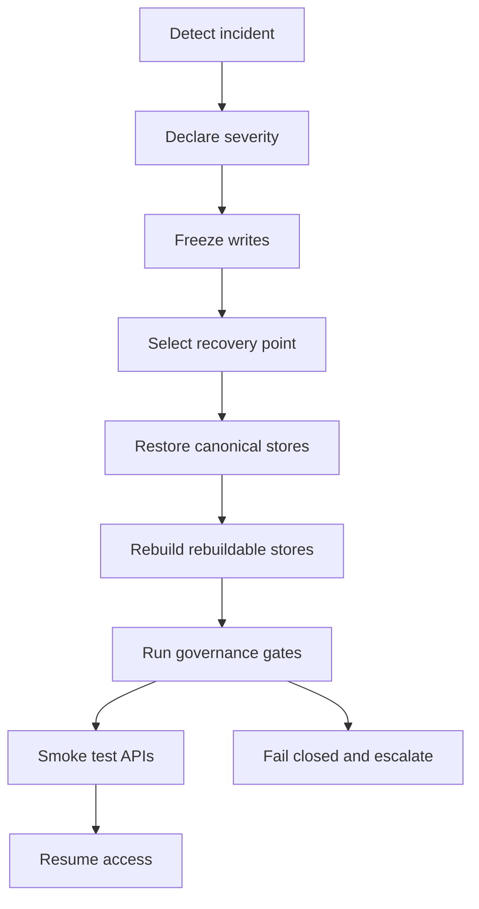

<!-- [KFM_META_BLOCK_V2]
doc_id: kfm://doc/7e1a3d6e-0d7e-4b55-ae3d-1c2f72a44f6d
title: Disaster Recovery and Rollback Runbook
type: standard
version: v1
status: draft
owners: kfm-ops
created: 2026-03-04
updated: 2026-03-04
policy_label: restricted
related: [docs/runbooks/, docs/standards/, policy/, data/]
tags: [kfm, runbook, dr, rollback, operations, governance]
notes: [Fail-closed, evidence-first; placeholders marked UNKNOWN must be filled before production use.]
[/KFM_META_BLOCK_V2] -->

# DR and Rollback
Disaster recovery and rollback runbook for KFM services, catalogs, and governed data promotion.

---

## Impact
**Status:** experimental (needs environment-specific values)  
**Owners:** `kfm-ops` (TODO: add on-call rotation link)  
**Last updated:** 2026-03-04  
**Applies to:** GOVERNED mode operations (production-like environments)

  

**Quick links**
- [When to use this](#when-to-use-this)
- [Recovery model](#recovery-model)
- [Backup inventory](#backup-inventory)
- [Full environment recovery](#full-environment-recovery)
- [Rollback](#rollback)
- [Post-restore validation gates](#post-restore-validation-gates)
- [Checklists](#checklists)

---

## When to use this
Use this runbook when you need to restore service availability or correct a bad change **without breaking governance**.

### Triggers
- **SEV-1:** Platform unavailable (API/UI down) or data access policy enforcement is broken.
- **SEV-2:** Partial outage (one datastore down) or incorrect results due to index/catalog drift.
- **SEV-2:** Accidental publish of wrong dataset version (bad artifacts, wrong license, missing provenance).
- **SEV-3:** Need to revert a code/config/policy change that passed CI but caused runtime issues.

### Non-goals
- This is **not** a guide for building new infrastructure from scratch.
- This is **not** an incident communications playbook (link your org’s incident SOP here). **UNKNOWN:** `docs/runbooks/INCIDENT_RESPONSE.md`
- This does **not** override policy: if access is restricted, recovery must preserve restrictions.

---

## Evidence discipline for this runbook
Every meaningful operational claim below is tagged:

- **CONFIRMED:** implied by KFM invariants and design posture.
- **PROPOSED:** a recommended default that must be implemented and tested to become CONFIRMED.
- **UNKNOWN:** missing repo/environment specifics; includes smallest steps to verify.

> IMPORTANT: Any section marked **UNKNOWN** MUST be resolved (values filled, drills executed) before relying on this in production.

---

## Recovery model

### System invariants
- **CONFIRMED:** All client access must traverse governed APIs and policy enforcement; no direct UI → DB access.
- **CONFIRMED:** Data follows a “truth path” lifecycle and must not be mutated in-place after publication.
- **CONFIRMED (concept):** Separate **canonical** stores from **rebuildable** stores; rebuildables can be regenerated deterministically.

### Data lifecycle zones
- **CONFIRMED (concept):** `RAW → WORK → PROCESSED → CATALOG → PUBLISHED`
- **CONFIRMED (posture):** Promote only when the “catalog triplet” (DCAT + STAC + PROV) and policy gates pass.

### What DR means in KFM
Disaster recovery is **not** just “restore DB and restart pods.” It is:

1) Restore **canonical evidence** (immutable artifacts + provenance + registry/specs).  
2) Rebuild or restore **catalogs** and **governed runtime surfaces**.  
3) Rebuild **rebuildable indexes** (tiles/search/embeddings) from canonical truth.  
4) Validate policy + contracts **fail-closed** before resuming access.

---

## Backup inventory

### Canonical vs rebuildable inventory
Use this table to decide what must be backed up versus what can be rebuilt.

| Surface | Canonical or Rebuildable | Backup requirement | Tag |
|---|---:|---|---|
| Git repo (code, policy, contracts, docs) | Canonical (source of truth) | Yes (remote + immutable tags) | PROPOSED |
| Dataset registry + specs (YAML/JSON) | Canonical | Yes | PROPOSED |
| RAW zone artifacts (immutable acquisitions) | Canonical | Yes (object storage versioned) | PROPOSED |
| Run receipts / audit ledger / provenance bundles | Canonical | Yes | PROPOSED |
| PROCESSED artifacts | Canonical if published; rebuildable if not published | Yes for published | PROPOSED |
| STAC/DCAT catalogs (file-based) | Rebuildable (if derivable) but often treated as release artifacts | Prefer rebuild + keep release snapshots | PROPOSED |
| PostGIS database | Canonical for curated/approved tables; rebuildable for derived indexes | Yes for canonical schemas/data | UNKNOWN |
| Neo4j graph | Canonical if it contains curated assertions not reproducible elsewhere | Yes if canonical | UNKNOWN |
| Search index (OpenSearch/Meilisearch/pgvector indexes) | Rebuildable | No (rebuild) | PROPOSED |
| Vector tiles / PMTiles | Rebuildable if generated from canonical data | No (rebuild) | PROPOSED |
| Caches (Redis/CDN) | Rebuildable | No | CONFIRMED |
| Secrets (Vault/KMS/Secrets Manager) | Canonical (but never in Git) | Yes (managed backup + escrow) | UNKNOWN |

**UNKNOWN → smallest verification steps**
1. Identify which data is **canonical** in PostGIS and Neo4j by enumerating:
   - curated/manual tables or nodes,
   - which pipelines can regenerate each table/index,
   - whether a rebuild is deterministic and verifiable (hashes match).
2. Produce an “Ops Inventory Sheet” and commit it:
   - `docs/runbooks/_inventories/DR_SURFACES.md` (PROPOSED path)

### Backup objectives
- **UNKNOWN:** RTO (target time to recover) = `__` hours  
- **UNKNOWN:** RPO (acceptable data loss) = `__` minutes/hours  
- **PROPOSED default:** RPO ≤ 24h for analytical environments; ≤ 1h for production.

**Verification step:** define RTO/RPO per environment in `configs/ops/dr.yml` (PROPOSED).

---

## Backup implementation plan

### Principles
- **CONFIRMED:** Backups must be encrypted, access-controlled, and audited.
- **PROPOSED:** Backups must be tested by restore drills; “untested backups” are treated as no backup.
- **PROPOSED:** Prefer immutable, content-addressed artifacts (digest-pinned) for published data.

### Schedule (fill in)
- **UNKNOWN:** Postgres/PostGIS backup cadence: `__`
- **UNKNOWN:** Neo4j backup cadence: `__`
- **UNKNOWN:** Object storage replication cadence: `__`
- **UNKNOWN:** Retention: `__` (days/weeks/months)
- **UNKNOWN:** Offsite copy: `__` (region/provider)

**Smallest step to confirm:** add actual schedules and retention to an ops config file and link it here.

---

## Full environment recovery

### High-level flow


### Step 0 — Preconditions (must be true)
- **UNKNOWN:** You can access the break-glass admin account (document where).
- **UNKNOWN:** You can access backup storage and restore keys (document where).
- **UNKNOWN:** You have IaC or deployment manifests to re-provision baseline infra.

**Verification steps**
1. Run a quarterly “table-top” drill (no changes) validating access to:
   - backup locations,
   - decryption keys,
   - deployment manifests,
   - on-call comms.

### Step 1 — Declare incident and freeze writes
**Goal:** Stop further mutation so the recovery point remains coherent.

Actions (PROPOSED)
1. Put platform into **degraded / read-only** mode at the API layer.
2. Disable promotions and background pipelines (ingest, index, tile generation).
3. If you run automated agents, flip the kill-switch.

**Kill-switch**
- **PROPOSED:** Central feature flag file (example): `ops/feature_flags/agents.yml` with `enabled: false`.
- **UNKNOWN:** Actual kill-switch location in this repo/environment.

> CAUTION: Do not bypass policy to “get data back quickly.” If policy is unavailable, default is **deny**.

### Step 2 — Choose recovery point (RPO)
- **PROPOSED:** Prefer the most recent backup that:
  - includes canonical stores,
  - has matching checksums/manifests,
  - passed last restore drill.

Record in an incident log:
- chosen timestamp / backup ID
- reason (corruption window, accidental publish time, outage time)

### Step 3 — Restore canonical stores
Perform restores in this order to preserve integrity:

1) **Secrets/config**
- **UNKNOWN:** Secret manager restore procedure (Vault snapshot, KMS restore, etc.)
- **Verification step:** document exact command/provider steps in this section.

2) **Object storage: RAW + published artifacts**
- **PROPOSED:** Ensure bucket/object versioning is enabled for canonical buckets.
- **PROPOSED:** Restore missing/deleted objects by version ID (or restore from replicated bucket).

3) **PostGIS**
- **PROPOSED:** Restore from last known-good snapshot (logical or physical).
- **UNKNOWN:** Actual DB name(s), roles, and backup method.

4) **Neo4j**
- **UNKNOWN:** Whether graph is canonical or rebuildable in your deployment.
- If canonical: restore from backups.
- If rebuildable: rebuild from canonical sources.

5) **Catalog snapshots (optional)**
- **PROPOSED:** Restore last published catalog release artifacts (STAC/DCAT/PROV) if you publish them as immutable release bundles.

### Step 4 — Rebuild rebuildable stores
- **PROPOSED:** Rebuild in deterministic order from canonical data:
  1. Catalog regeneration (if derived)
  2. Search index rebuild
  3. Tile/vector/PMTiles rebuild
  4. Embeddings/vector indexes rebuild (if applicable)

> IMPORTANT: Rebuild steps MUST emit run receipts and checksums. If receipts can’t be produced, do not publish.

### Step 5 — Governance gates (fail-closed)
Before allowing write access or public access:

- **PROPOSED:** Run contract tests (OpenAPI/JSON Schema)
- **PROPOSED:** Run STAC/DCAT/PROV validation
- **PROPOSED:** Run policy suite (OPA/Rego) in “strict” mode
- **PROPOSED:** Verify attestations/SBOM where applicable (cosign/in-toto)

If any gate fails: keep read-only, open an incident ticket, and fix via governed PRs.

### Step 6 — Smoke tests (minimal)
Minimum smoke tests to consider the platform “up”:

- `/health` endpoints return OK for API + policy enforcement.
- A known public dataset query returns:
  - data,
  - citations/evidence links,
  - correct redaction behavior.
- Map UI loads base map and at least one known-good layer (read-only).

**UNKNOWN:** actual endpoint paths and smoke test script locations.

---

## Rollback

Rollback is “undo a change” while preserving immutability and provenance.

### Rollback decision tree
- **Code rollback:** bad deployment, bad config, bad policy bundle.
- **Data rollback:** bad dataset version published, wrong license, missing provenance, corrupted artifacts.
- **Index rollback:** broken search/tiles/embeddings causing wrong or missing results.

### Code rollback (governed)
**PROPOSED steps**
1. Identify last known-good release reference:
   - git tag, container digest, manifest digest.
2. Redeploy that release (no ad-hoc hotfix on prod).
3. Verify policy gates and smoke tests.
4. Record a rollback receipt (who/what/why/when) and link to incident.

**UNKNOWN:** release/tag naming convention and deployment toolchain.

### Policy rollback (OPA/Rego)
- **PROPOSED:** Roll back policy changes via PR revert; never edit policies directly on servers.
- **PROPOSED:** Gate with strict checks (format + compile + tests).
- **UNKNOWN:** policy bundle build/publish process in this environment.

### Data rollback (dataset version)
**Goal:** Remove or supersede a bad published dataset version without mutating history.

**PROPOSED pattern**
1. Mark the bad DatasetVersion as `revoked` or `superseded` in the catalog metadata.
2. Re-point “current” pointers to the last known-good DatasetVersion.
3. Preserve the revoked artifacts (immutability) but block them via policy if needed.
4. Rebuild downstream indexes/tiles to reflect the corrected catalog.

**UNKNOWN → verification steps**
- Define the exact catalog fields used for:
  - `deprecated`, `revoked`, `superseded_by`, or equivalents.
- Add a policy rule that denies serving revoked versions to non-admin roles.

### Index rollback (rebuildable)
- **CONFIRMED (posture):** Prefer rebuild over restore for indexes.
- **PROPOSED:** Rebuild search/tiles from canonical datasets pinned by catalog version.

### Automation rollback (agents)
- **PROPOSED:** Flip the kill-switch and block executor writes.
- **PROPOSED:** Revert any agent-opened PRs via normal review process (no forced merges).

---

## Post-restore validation gates
These are “must pass” checks before resuming normal operations.

### Gates (minimum)
- **PROPOSED:** Catalog validation: STAC + DCAT + PROV are present and valid.
- **PROPOSED:** Promotion Contract gates pass for any newly promoted dataset.
- **PROPOSED:** Policy tests pass; if policy cannot load, platform remains deny-by-default.
- **PROPOSED:** Checksums/attestations verify for published artifacts.
- **PROPOSED:** Audit log/run receipts written for restore and rebuild runs.

### Evidence artifacts (store these)
- restore run receipt (timestamp, operator, backup IDs)
- validation reports (schema lint + policy output)
- rebuild run receipts (index rebuilds)
- post-restore smoke test output

---

## Checklists

### Incident start checklist
- [ ] Declare severity and start incident log.
- [ ] Freeze writes (promotion, pipelines, agents).
- [ ] Confirm policy enforcement is fail-closed.
- [ ] Select recovery point (RPO) and record it.

### Restore checklist
- [ ] Restore secrets/config (break-glass documented).
- [ ] Restore canonical object storage artifacts (RAW + published).
- [ ] Restore canonical databases (PostGIS, Neo4j as applicable).
- [ ] Rebuild rebuildable stores (indexes, tiles, caches).
- [ ] Run governance gates; fail closed on any error.
- [ ] Smoke tests pass.

### Resume checklist
- [ ] Re-enable pipelines progressively (one domain at a time).
- [ ] Keep heightened monitoring for 24h (PROPOSED).
- [ ] Publish incident postmortem with links to receipts (PROPOSED).

---

## Appendix A — Command reference (templates only)
> WARNING: These are **templates**. They are not guaranteed to match your environment.
> Replace placeholders and confirm with a test restore in a sandbox environment.

### Postgres logical backup (template)
```bash
# PROPOSED: logical backup with pg_dump (small to medium DBs)
pg_dump --format=custom --file "backup_$(date -u +%Y%m%dT%H%M%SZ).dump" \
  --no-owner --no-acl \
  --dbname "$DATABASE_URL"
```

### Postgres restore (template)
```bash
# PROPOSED: restore from pg_dump custom format
pg_restore --clean --if-exists --no-owner --no-acl \
  --dbname "$DATABASE_URL" \
  "backup_YYYYMMDDTHHMMSSZ.dump"
```

### Object storage restore (template)
```bash
# PROPOSED: restore object versions (provider-specific)
# Example placeholder: list versions, then restore by version-id
# TODO: replace with AWS CLI / MinIO / rclone procedure for your environment
echo "UNKNOWN: fill in provider-specific restore steps"
```

### Kubernetes rollout undo (template)
```bash
# PROPOSED: rollback last deployment revision
kubectl rollout undo deployment/kfm-api -n kfm
kubectl rollout status deployment/kfm-api -n kfm
```

---

## Appendix B — Run receipt template (minimal)
**PROPOSED:** Store a restore/rollback receipt as JSON (one line) and commit or archive it in an immutable log.

```json
{
  "type": "kfm.ops.receipt",
  "action": "restore|rollback|rebuild",
  "env": "prod|staging|dev",
  "timestamp": "2026-03-04T00:00:00Z",
  "operator": "oncall@example.org",
  "reason": "brief description",
  "recovery_point": {
    "backup_id": "provider-specific-id",
    "rpo_target": "PT1H"
  },
  "restored_surfaces": [
    {"surface": "object_store_raw", "ref": "bucket@version", "status": "ok"},
    {"surface": "postgis", "ref": "snapshot-id", "status": "ok"}
  ],
  "rebuilds": [
    {"surface": "search_index", "run_id": "rebuild-...", "status": "ok"}
  ],
  "validation": {
    "policy_gate": "pass|fail",
    "catalog_validation": "pass|fail",
    "smoke_tests": "pass|fail"
  },
  "audit": {
    "incident_id": "INC-0000",
    "ticket": "TODO"
  }
}
```

---

## Appendix C — Known UNKNOWNs to resolve before production use
- [ ] Where is the kill-switch/feature flag file in this repo?
- [ ] What is canonical in PostGIS vs rebuildable?
- [ ] Is Neo4j canonical (curated) or rebuildable?
- [ ] Exact backup cadence and retention by environment.
- [ ] Exact restore commands per provider (DB, object storage, secrets).
- [ ] Smoke test script paths and API endpoints.

---

## References
- See KFM governance and invariants documents for the “truth path,” trust membrane, and promotion gates.
- Link environment-specific DR details here once confirmed (IaC, provider runbooks, on-call docs).

---

[Back to top](#dr-and-rollback)
