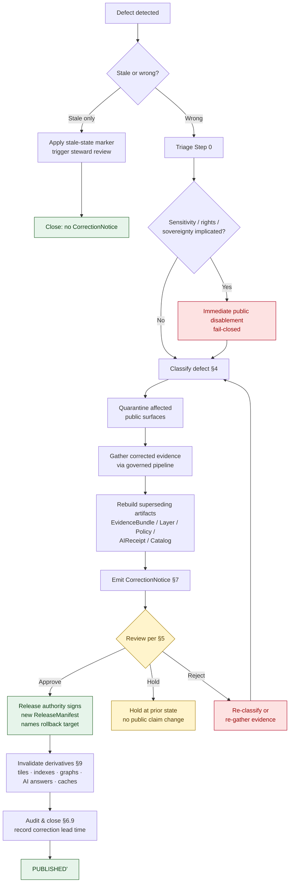

<!-- [KFM_META_BLOCK_V2]
doc_id: kfm://doc/runbook/evidence-correction
title: Evidence Correction Runbook
type: standard
version: v1
status: draft
owners: [docs-steward, correction-reviewer]  # NEEDS VERIFICATION — confirm against CODEOWNERS / governance register
created: 2026-05-12
updated: 2026-05-12
policy_label: public
related:
  - docs/runbooks/README.md
  - docs/runbooks/ROLLBACK.md                  # NEEDS VERIFICATION — exact filename
  - docs/governance/SEPARATION_OF_DUTIES.md    # NEEDS VERIFICATION
  - docs/doctrine/lifecycle-law.md
  - docs/doctrine/trust-membrane.md
  - docs/registers/DRIFT_REGISTER.md
  - contracts/correction/correction_notice.md  # NEEDS VERIFICATION
  - schemas/contracts/v1/correction/correction_notice.schema.json  # PROPOSED
  - release/                                   # release decisions & rollback targets
tags: [kfm, runbook, correction, evidence, governance, supersession, lifecycle]
notes:
  - Status PROPOSED until validators, schemas, CI gates, and CorrectionNotice schema land in repo evidence.
  - Doctrine is CONFIRMED from attached corpus; operational paths, validator IDs, and CI commands remain PROPOSED until mounted-repo inspection.
[/KFM_META_BLOCK_V2] -->

<a id="top"></a>

# Evidence Correction Runbook

> Governed procedure for correcting a **PUBLISHED** KFM claim, layer, catalog record, artifact, or AI answer when a defect is detected — without silently mutating the original release.

<p align="center">
  <b>Kansas Frontier Matrix — Evidence First · Cite or Abstain · Fail Closed · Reversible by Design</b>
</p>

<p align="center">
  
  
  
  
  
  
  
</p>

| Field | Value |
|---|---|
| **Status** | Draft (PROPOSED implementation; CONFIRMED doctrine) |
| **Owners** | Docs steward · Correction reviewer · Release authority *(roles per Atlas §24.7; concrete owners NEEDS VERIFICATION)* |
| **Last updated** | 2026-05-12 |
| **Authority** | Lifecycle law · Trust membrane · Directory Rules §6.1 (`docs/runbooks/`) |
| **Audience** | Stewards, reviewers, release authorities, defect detectors, on-call docs steward |

---

## Quick links

- [1 · Purpose & scope](#1--purpose--scope)
- [2 · When to use this runbook](#2--when-to-use-this-runbook)
- [3 · Stale vs. wrong — the critical distinction](#3--stale-vs-wrong--the-critical-distinction)
- [4 · Defect classification matrix](#4--defect-classification-matrix)
- [5 · Roles and separation of duties](#5--roles-and-separation-of-duties)
- [6 · The correction procedure (step by step)](#6--the-correction-procedure-step-by-step)
- [7 · CorrectionNotice contract](#7--correctionnotice-contract)
- [8 · Supersession lineage](#8--supersession-lineage)
- [9 · Derivative invalidation](#9--derivative-invalidation)
- [10 · Gate failures and reason codes](#10--gate-failures-and-reason-codes)
- [11 · End-to-end flow (diagram)](#11--end-to-end-flow-diagram)
- [12 · Worked examples (illustrative)](#12--worked-examples-illustrative)
- [13 · Health indicators](#13--health-indicators)
- [14 · Anti-patterns](#14--anti-patterns)
- [15 · Related docs](#15--related-docs)
- [16 · Appendix: checklists & references](#16--appendix-checklists--references)

---

## 1 · Purpose & scope

> [!IMPORTANT]
> **Correction is a publication requirement, not an afterthought.** A released claim, layer, catalog record, artifact, or AI answer must have a **visible correction path and a rollback target** before it is treated as safely publishable.
> — *CONFIRMED doctrine: BLD-GREEN §20; BLD-COMP §§21-22; IMPL-PIPE §21; Atlas §24.6.1.*

This runbook describes how KFM **corrects** a `PUBLISHED` claim when a defect is detected. It governs the lifecycle transition **`PUBLISHED → PUBLISHED'`** — the issuance of a *superseding* release.

It is the operational companion to:

- the **CorrectionNotice** object family (`contracts/correction/`, `schemas/contracts/v1/correction/`),
- the **ReleaseManifest** and **RollbackCard** objects in `release/`,
- the **review** flow that produces `ReviewRecord`s, and
- the separation-of-duties policy in Atlas §24.7.

### Out of scope

| Concern | Where to look |
|---|---|
| Hard rollback to a prior release (no superseding fix yet) | `docs/runbooks/ROLLBACK.md` *(NEEDS VERIFICATION — exact filename)* |
| Stale-state marking only (claim not wrong, just aged) | §3 below; UI stale-source badge guidance |
| Source-level admission / rights changes | `docs/sources/SOURCE_DESCRIPTOR_STANDARD.md` *(PROPOSED)* |
| Policy bundle change | ADR + `policy/<lane>/` |
| Schema migration | ADR-class change; `migrations/` |

[Back to top](#top)

---

## 2 · When to use this runbook

Use this runbook whenever **any** of the following is detected against content already in `PUBLISHED`:

- An **EvidenceBundle** referenced by a public claim no longer resolves, is wrong, or no longer supports the claim.
- A **source role** was mis-classified (e.g., a *modeled* output was treated as *observed*).
- **Rights** or **license** posture for a referenced source has changed.
- **Sensitivity** disclosure has occurred (e.g., a sensitive geometry leaked through a tile, popup, or AI text channel).
- A **geometry** or **temporal** error is present in a released artifact.
- A **PolicyDecision** referenced by the release was superseded or evaluated against an outdated bundle.
- A **validator** would now FAIL the release if re-run on current evidence.
- A **rendering** or **API** defect changes the public meaning of the claim.
- An **AI answer** was emitted in violation of cite-or-abstain or denied-class policy.
- A **catalog** closure (proof, manifest, digest) is no longer intact.

> [!TIP]
> If the published surface is *aged* but not *wrong*, you may not need a correction — you may only need a **stale marker**. See §3.

> [!CAUTION]
> If sensitivity, rights, sovereignty, living-person/DNA, archaeology, infrastructure, or precise location exposure is involved, **default to immediate public-surface disablement first** (fail-closed), then proceed with the correction. Never let polish or process lag protect a sensitive leak. *(CONFIRMED doctrine: Build Manual defect-class table; Atlas §24.5.)*

[Back to top](#top)

---

## 3 · Stale vs. wrong — the critical distinction

KFM separates these states deliberately. *(CONFIRMED doctrine: Atlas §24.8.)*

| State | Meaning | First action | Correction required? |
|---|---|---|---|
| **Stale** | Evidence, source freshness, dependent data, or context has aged past its declared tolerance. The claim **was** supportable. | Apply the appropriate **stale-state marker** in the Evidence Drawer; trigger steward review. | Only if review finds substance is also wrong. |
| **Wrong** | The substance of the claim is incorrect, no longer supported, or violates policy/rights/sensitivity. | Disable affected surface where required; open this runbook. | **Yes** — emit `CorrectionNotice` and supersede. |

### Stale-state markers (no `CorrectionNotice` required)

| Marker | Triggered by | Required action |
|---|---|---|
| Source freshness expired | `SourceDescriptor` cadence passed without new admission | Re-admit or supersede; mark dependent claims stale |
| Schema version drift | Schema upgraded past the published claim's schema version | Migrate, re-validate, re-release; or mark stale |
| Geography version drift | `GeographyVersion` replaced; published claim still bound to prior | Rebind & re-release; or mark stale |
| Time-scope outside support | Claim's temporal scope outside current data support window | Mark stale; do not silently refresh |
| Model version superseded | `ModelRunReceipt` references older model than current | Re-run; supersede; or mark stale |
| Review aged out | `ReviewRecord` older than review-cycle tolerance | Trigger steward review; potentially downgrade tier |
| Rights status changed | Rights change in `SourceDescriptor` | Re-evaluate tier; **emit `CorrectionNotice` if necessary** |
| Policy version changed | Policy referenced by `PolicyDecision` was superseded | Re-run gate; potentially supersede release |

> [!NOTE]
> "Rights status changed" and "policy version changed" sit on the boundary. If the change inverts the public posture of the claim (e.g., it is no longer releasable), treat it as **wrong** and proceed with full correction.

[Back to top](#top)

---

## 4 · Defect classification matrix

Classify the defect using the canonical class set. This decides correction posture **and** rollback posture. *(CONFIRMED doctrine: Build Manual defect-class table; BLD-GREEN §20; IMPL-PIPE §§21, 27; BLD-COMP §§21-23.)*

| Defect class | Correction posture | Rollback posture |
|---|---|---|
| **Evidence gap** | `ABSTAIN` on the claim, or withdraw the unsupported claim entirely | Restore prior evidence-supported release |
| **Source-role mis-classification** | Restore the correct source role; refuse upcast (e.g., modeled → observed) | Restore prior release if downstream cascaded |
| **Rights defect** | `DENY` public use; quarantine source / artifact | Withdraw affected artifacts |
| **Sensitivity leak** | Redact / generalize and notify stewards | **Immediate public disablement** |
| **Geometry defect** | Rebuild derivative layer and evidence payload | Restore previous digest-pinned artifact |
| **Temporal defect** | Correct `valid` / `source` / `retrieval` / `release` time | Mark stale until rebuilt |
| **Policy defect** | Re-run policy and `DecisionEnvelope` | Disable route / layer if gate failed |
| **Validation defect** | Re-run validators; emit corrected `ValidationReport` | Restore prior `ValidationReport`-pinned release |
| **Rendering defect** | Fix renderer / style / tile pipeline; re-publish layer | Restore prior `MapReleaseManifest` |
| **API defect** | Patch governed-API contract; re-emit `DecisionEnvelope` | Disable affected route; restore prior contract |
| **AI answer defect** | Invalidate `AIReceipt` and `RuntimeResponseEnvelope` | Remove answer; **preserve EvidenceBundle** |
| **Catalog defect** | Re-emit catalog closure after proof repair | Restore previous catalog state |

> [!IMPORTANT]
> Correction is a **state transition**, not a file edit. The original release record is **preserved**; a *superseding* release is issued. Silent mutation of a published artifact is a doctrine violation. *(CONFIRMED: Atlas §24.8.2 supersession lineage; Build Manual rollback model.)*

[Back to top](#top)

---

## 5 · Roles and separation of duties

*(CONFIRMED doctrine: Atlas §24.7.)*

| Role | Responsibility in correction |
|---|---|
| **Detector / author** | Files the defect; assembles initial evidence and proposed correction class |
| **Domain steward** | Confirms classification; owns the corrected EvidenceBundle and any contract/schema implications |
| **Sensitivity reviewer** | Required when the defect involves sensitivity, redaction, generalization, or tier reassignment |
| **Rights-holder representative** | Required when sovereignty, cultural heritage, or consent-based release is affected |
| **Correction reviewer** | Reviews the `CorrectionNotice` and `RollbackCard` before they amend a `PUBLISHED` claim |
| **Release authority** | Authorizes the superseding release; signs `ReleaseManifest`; names the rollback target |
| **AI surface steward** | Required when an `AIReceipt` is invalidated or Focus Mode template/policy binding changes |
| **Docs steward** | Confirms the public correction surface (UI banner, drawer note, manifest entry) and updates registers |

### Separation-of-duties matrix (correction-specific)

| Action | May author also approve? | Required separation |
|---|---|---|
| Routine correction (non-material) | Yes | Author + correction reviewer |
| Steward-significant correction | **No** | Author / detector + correction reviewer + release authority |
| Sensitive-lane correction (archaeology, fauna, flora, living-person/DNA, infrastructure) | **No** | Author + sensitivity reviewer + release authority + rights-holder rep |
| AI-answer correction (template / policy binding) | **No** | AI surface steward + docs steward |

> [!NOTE]
> **Maturity note.** Atlas §24.7 and Directory Rules §2 treat separation of duties as *maturity-dependent*. Early-stage doctrine work may be authored and approved by the same actor when materiality is low. As the public trust surface expands, separation MUST be enforced through tooling — not custom. This runbook documents the destination posture; current enforcement is `PROPOSED`.

[Back to top](#top)

---

## 6 · The correction procedure (step by step)

The procedure preserves the original release record, identifies the defect, classifies it, emits a `CorrectionNotice`, updates the relevant `EvidenceBundle` and `ReleaseManifest`, and **publishes a superseding release** rather than silently mutating the old one. *(CONFIRMED doctrine: BLD-GREEN §20; IMPL-PIPE §§21, 27; BLD-COMP §§21-23.)*

### Step 0 — Triage (within 1 working day of detection)

1. **Confirm the defect** against current `PUBLISHED` surfaces (Evidence Drawer, Focus Mode, layer manifest, governed-API response).
2. **Decide stale vs. wrong** using §3.
3. **Sensitivity check.** If sensitivity / rights / sovereignty / living-person / DNA / archaeology / infrastructure / precise location is implicated, **disable the affected public surface immediately** (fail-closed) before proceeding. Record the disablement.
4. **Open a tracking entry** in the correction queue (system of record `PROPOSED`; today, an issue or `docs/registers/DRIFT_REGISTER.md` entry).

> [!WARNING]
> Steps 1–3 happen **before** classification refinement. Sensitive leaks do not wait for a tidy classification.

### Step 1 — Classify

Pick exactly one primary defect class from the matrix in §4. If the defect spans classes, pick the **most release-blocking** class as primary and record the others as secondary.

### Step 2 — Quarantine affected public surfaces

Depending on class and severity:

- **Sensitivity / rights leak** → disable layer, popup field, Focus Mode template, or governed-API route.
- **Evidence gap / catalog defect** → `ABSTAIN` or `DENY` on the specific claim while leaving non-affected surfaces live.
- **AI answer defect** → invalidate `AIReceipt`; remove the answer from any cached surface; preserve the underlying `EvidenceBundle`.
- **Geometry / temporal / rendering defect** → mark layer stale; keep prior digest-pinned artifact live if safer than removal.

Record the quarantine action so it can be unwound by the superseding release.

### Step 3 — Gather corrected evidence

- Pull the **affected `EvidenceBundle`(s)** by `spec_hash` / `bundle_id`.
- Identify the **upstream `SourceDescriptor`** and confirm rights / sensitivity / cadence.
- If new evidence is needed, route through normal admission (`— → RAW → WORK → …`). The correction lane does **not** bypass the gates.
- If no replacement evidence is available, the correction posture becomes **`ABSTAIN` / withdraw** rather than re-state.

### Step 4 — Build the superseding artifacts

For each affected object class, produce the corrected artifact via the **same governed pipeline**:

| Class | Corrected artifact(s) |
|---|---|
| Evidence | New `EvidenceBundle` with fresh `spec_hash`; old bundle retained for audit |
| Geometry / layer | Rebuilt layer + `LayerManifest` + tile / COG / PMTiles artifacts with new digests |
| Policy | Re-evaluated `PolicyDecision`; new `DecisionEnvelope` |
| AI surface | Invalidated `AIReceipt`; corrected Focus Mode template / policy binding |
| Catalog | Re-emitted `CatalogRecord` after proof repair |

Each rebuild MUST emit its own `RunReceipt` and pass its lifecycle gates fail-closed. *(CONFIRMED doctrine: Atlas §24.6.1.)*

### Step 5 — Emit the `CorrectionNotice`

The `CorrectionNotice` is the **public record of the change**. It links the prior release, the defect class, the corrected artifacts, and the invalidated derivatives. See §7 for the contract.

### Step 6 — Review (separation of duties)

Route through the required reviewers per §5. Reviewer outcomes:

- **APPROVE** → proceed to Step 7.
- **HOLD** → release stays at prior state; reviewer note recorded; no public claim change.
- **REJECT** → defect re-classified or evidence insufficient; loop to Step 1 or Step 3.

> [!IMPORTANT]
> A reviewer rejection **does not silently undo the quarantine** in Step 2. Sensitivity disablement remains in effect until either (a) the superseding release is published or (b) a rollback runbook is invoked.

### Step 7 — Release the superseding version

- The **release authority** (distinct from the author when materiality applies) signs the new `ReleaseManifest`.
- The new manifest names a **valid rollback target** (the prior release).
- The `CorrectionNotice` is **attached** to the new release and made visible on the affected public claim (banner, drawer note, manifest entry).
- The original release record is **preserved**, marked as superseded, with a forward link to the new release.

### Step 8 — Invalidate derivatives

See §9. This is not optional — corrections that fail to name and invalidate downstream derivatives leave silent stale claims in the system.

### Step 9 — Audit & close

- Update `docs/registers/DRIFT_REGISTER.md` if the defect originated in drift.
- Record **correction lead time** (detection → `CorrectionNotice`) for the health indicators in §13.
- File a post-mortem if the defect was sensitivity-related, sovereignty-related, or required immediate disablement.

[Back to top](#top)

---

## 7 · CorrectionNotice contract

> [!NOTE]
> The `CorrectionNotice` object is defined in `contracts/correction/` *(PROPOSED home; verify against `directory-rules.md §6.3`)*. Its machine schema lives at `schemas/contracts/v1/correction/correction_notice.schema.json` *(PROPOSED)*. The fields below reflect CONFIRMED doctrine from the Atlas and Encyclopedia.

### Required fields (CONFIRMED doctrine; field names PROPOSED until schema lands)

| Field | Meaning |
|---|---|
| `claim_ref` | Reference to the published claim (catalog record, layer, AI answer, etc.) being corrected |
| `prior_release_ref` | The `ReleaseManifest` of the release being superseded |
| `defect_class` | One of the canonical classes in §4 |
| `change_summary` | Plain-language description of what changed and why |
| `invalidates[]` | Derivatives, indexes, exports, tiles, AI answers, search summaries invalidated by this correction |
| `evidence_bundle_refs[]` | Old and new `EvidenceBundle` references |
| `review_ref` | `ReviewRecord` from the correction reviewer (and rights-holder rep when required) |
| `release_manifest_ref` | The **new** `ReleaseManifest` carrying the superseding release |
| `rollback_target` | The release to restore if the superseding release itself fails |
| `time` | ISO-8601 UTC timestamp of the notice |

### Illustrative example (PROPOSED — not a binding schema)

<details>
<summary>Show example <code>CorrectionNotice</code></summary>

```json
{
  "schema_version": "v1",
  "object_type": "CorrectionNotice",
  "notice_id": "kfm://correction/<uuid>",
  "claim_ref": "kfm://claim/<id>",
  "prior_release_ref": "kfm://release/manifest/<prior-id>",
  "defect_class": "geometry",
  "change_summary": "Layer X reprojected; prior CRS metadata understated planar error by ~3.2m at scale 1:24k.",
  "invalidates": [
    "kfm://layer/X/tiles@<digest>",
    "kfm://export/storysnapshot/<snapshot-id>"
  ],
  "evidence_bundle_refs": [
    {"role": "prior", "spec_hash": "sha256:<old>"},
    {"role": "current", "spec_hash": "sha256:<new>"}
  ],
  "review_ref": "kfm://review/<reviewrecord-id>",
  "release_manifest_ref": "kfm://release/manifest/<new-id>",
  "rollback_target": "kfm://release/manifest/<prior-id>",
  "time": "2026-05-12T17:00:00Z"
}
```

> **Status:** Illustrative only. Field names, URI schemes, and the exact JSON shape are `PROPOSED` until the `correction_notice.schema.json` is verified in the repo.

</details>

### What a CorrectionNotice does **not** do

- It does **not** publish. The new `ReleaseManifest` publishes.
- It does **not** approve itself. Review precedes emission.
- It does **not** replace the prior release's record — the prior record stays, marked superseded.
- It does **not** suppress audit. Old `EvidenceBundle`s are retained.

[Back to top](#top)

---

## 8 · Supersession lineage

Every object class has a supersession rule. *(CONFIRMED doctrine: Atlas §24.8.2.)*

| Object class | Supersession rule | Required lineage artifact |
|---|---|---|
| `SourceDescriptor` | Replaced by newer descriptor; old retained with `superseded_by` link | Supersession entry in source register |
| `EvidenceBundle` | Replaced when corrected; old bundle retained for audit | `EvidenceBundle` + `CorrectionNotice` + supersession link |
| `GeographyVersion` | Replaced by newer version; both remain queryable for time-bound claims | Version register entry + crosswalk |
| Schema (`schemas/contracts/v1/...`) | Replaced via ADR; old schema retained | ADR + supersession link in schema header |
| Policy | Replaced via accepted ADR; old policy retained | ADR + supersession link |
| `ReleaseManifest` | Replaced by next release; rollback target remains valid | Manifest history + rollback chain |
| `AIReceipt` | **Never** superseded retroactively. Old answer retained; new answer is a new receipt | Two distinct `AIReceipt`s with cross-reference |
| Atlas / supplement | Superseded by ADR-recorded new version; lineage retained | Atlas / supplement supersession appendix |

> [!IMPORTANT]
> **`AIReceipt` is special.** AI answers are never rewritten in place. A correction produces a **new** `AIReceipt` with a cross-reference to the prior one. This preserves the audit trail of what the system said when, even after the system says something different.

[Back to top](#top)

---

## 9 · Derivative invalidation

A correction MUST identify and invalidate downstream derivatives, or it leaves stale claims live on public surfaces. *(CONFIRMED doctrine: Atlas §24.11.2 "Derivative-invalidation coverage".)*

### Typical derivatives to check

| Derivative | Where to invalidate | Notes |
|---|---|---|
| Vector / raster tiles (MVT / PMTiles / COG) | `MapReleaseManifest`, CDN cache, tile artifact registry | Rebuild from corrected source; new digest |
| Catalog records / search indexes | `CatalogRecord`, `SearchIndexManifest` | Search indexes are **derivative**; re-emit, don't trust |
| Graph / triplet projections | `Triplet`, `GraphDelta` | Graph is derivative of canonical / catalog truth |
| AI answers and exports | `AIReceipt`, `StorySnapshot`, `ExportReceipt` | Replace with new receipts; never silently rewrite |
| Evidence Drawer payloads | `EvidenceDrawerPayload` cache | Rebuild against corrected `EvidenceBundle` |
| Crosswalks / overlays | `Crosswalk`, `OverlayReceipt` | Cross-domain joins amplify defects — invalidate liberally |

### CDN / cache discipline

> [!CAUTION]
> Public tile, COG, and PMTiles surfaces are commonly served through caches. A correction without a **cache-invalidation step** leaves the prior bytes reachable. Treat the cache invalidation as part of release, not a follow-up chore.

[Back to top](#top)

---

## 10 · Gate failures and reason codes

If a correction itself fails a gate, fail closed. *(CONFIRMED doctrine: Atlas §24.6.3 — PROPOSED reason-code catalog.)*

| Failure family | Reason code (PROPOSED) | Gate(s) where it fires | Recovery path |
|---|---|---|---|
| Missing required artifact | `MISSING_RECEIPT`, `MISSING_EVIDENCE`, `MISSING_REVIEW` | Validation / Catalog / Release | Re-emit missing receipt; re-run review; re-validate |
| Schema / contract mismatch | `SCHEMA_MISMATCH`, `CONTRACT_DRIFT` | Normalization / Validation | Schema fix and/or ADR; re-run validator |
| Rights / sensitivity unresolved | `RIGHTS_UNKNOWN`, `SENSITIVITY_UNRESOLVED` | Admission / Validation / Catalog / Release | Steward review; rights resolution; tier reassignment |
| Source-role collapse risk | `ROLE_COLLAPSE`, `ROLE_DOWNCAST_FORBIDDEN` | Validation / Catalog / Release | Restore source role; refuse upcast |
| Review state inadequate | `REVIEW_NEEDED`, `REVIEW_INSUFFICIENT`, `REVIEW_REJECTED` | Catalog / Release | Run required review; supply `ReviewRecord` |
| Release infrastructure error | `RELEASE_MANIFEST_INVALID`, `ROLLBACK_TARGET_MISSING` | Release | Manifest fix; supply rollback target |
| Correction lineage broken | `CORRECTION_DERIVATIVES_UNRESOLVED`, `CORRECTION_PRIOR_RELEASE_MISSING` | Correction | Resolve derivatives; supersession entry |

> [!NOTE]
> A correction that triggers `CORRECTION_DERIVATIVES_UNRESOLVED` is **not** publishable. Either complete §9 (Derivative invalidation) or narrow the correction scope.

[Back to top](#top)

---

## 11 · End-to-end flow (diagram)



> [!NOTE]
> Diagram reflects the CONFIRMED doctrinal flow. Operational tooling (issue templates, validators, CI hooks, cache-purge automation) that would *enforce* this flow is `PROPOSED` until verified in the mounted repo.

[Back to top](#top)

---

## 12 · Worked examples (illustrative)

> All examples below are **illustrative**. They use fictional IDs and shapes; no specific historical defect is being described.

### Example A — Evidence gap (Hydrology layer)

A reviewer notices a Hydrology layer claim was anchored to an `EvidenceBundle` whose underlying gauge record has been re-classified as *modeled* rather than *observed*.

- **Class:** Evidence gap + Source-role mis-classification.
- **Posture:** `ABSTAIN` on the affected claim; restore correct source role; refuse upcast.
- **Artifacts:** New `EvidenceBundle` with corrected role; `CorrectionNotice` invalidates the layer's prior tile digest; rebuilt `LayerManifest`.
- **Reviewers:** Domain steward + correction reviewer + release authority.
- **Derivatives:** Vector tiles, Evidence Drawer cache, any Focus Mode answer that cited the bundle.

### Example B — Sensitivity leak (Archaeology popup)

A clicked feature exposed an exact archaeological coordinate through a popup attribute that should have been generalized.

- **Class:** Sensitivity leak.
- **Posture:** **Immediate public disablement** of the layer's popup field (Step 2 quarantine *before* full classification finalized); redact and generalize; notify stewards.
- **Artifacts:** `RedactionReceipt`; new `LayerManifest` with allowlisted popup fields; `CorrectionNotice`.
- **Reviewers:** Author + sensitivity reviewer + release authority + rights-holder representative (sensitive lane — no author-only approval).
- **Derivatives:** Tiles (rebuilt with field allowlist), Focus Mode answers (any `AIReceipt` referencing the feature invalidated and re-emitted as `DENY`), search indexes, exports.

### Example C — AI answer defect (Focus Mode)

A Focus Mode answer was emitted with a citation that no longer resolves to a published `EvidenceBundle`.

- **Class:** AI answer defect (uncited claim → cite-or-abstain violation).
- **Posture:** Invalidate the `AIReceipt`; remove the answer from any cached surface; **preserve the underlying `EvidenceBundle`** (it is not the defect).
- **Artifacts:** New `AIReceipt` with cross-reference to prior; `CorrectionNotice`; updated `CitationValidationReport`.
- **Reviewers:** AI surface steward + docs steward (policy binding) + correction reviewer.
- **Derivatives:** No tile rebuild required, but any `StorySnapshot` or `ExportReceipt` that embedded the answer must be re-emitted.

[Back to top](#top)

---

## 13 · Health indicators

Track these signals to know whether KFM's correction posture is healthy. None of these is a *sufficient* condition for trust; together they describe a healthy posture. *(CONFIRMED doctrine: Atlas §24.11.2. Indicators are reported, not enforced — enforcement is the validator's job.)*

| Indicator | What it measures | Healthy posture (PROPOSED) |
|---|---|---|
| **Release with rollback target** | % of `PUBLISHED` releases naming a valid rollback target | **100%** |
| **Correction lead time** | Median time from defect detection to `CorrectionNotice` | Visibly tracked; trend not regressing |
| **Derivative-invalidation coverage** | % of corrections that name and invalidate downstream derivatives | Approaches **100%** as coverage matures |
| **Rollback rehearsal rate** | Rehearsed rollbacks per release window | Non-zero; periodic, scheduled |
| **Supersession lineage gap** | Supersessions without a forward link | **Zero** |
| **Sensitive-lane fail-closed rate** | % of unauthorized sensitive-lane requests that `DENY` at the first gate | **100%** at the first gate |
| **EvidenceRef resolution rate** | % of public-surface `EvidenceRef`s that resolve to an `EvidenceBundle` | **> 99.9%** over the trailing release window |
| **Cite-or-abstain compliance** | % of Focus Mode answers with non-empty, resolving evidence citations | **100%** (any miss is a defect to investigate) |

[Back to top](#top)

---

## 14 · Anti-patterns

> [!WARNING]
> The following are **doctrine violations**. If you find yourself doing one, stop and re-read §1.

- **Silent in-place mutation** of a published artifact, claim, or AI answer.
- **Skipping the `CorrectionNotice`** because the change "feels small."
- **Re-using the prior `ReleaseManifest` ID** for the corrected release.
- **Republishing without naming a rollback target.**
- **Letting AI-generated correction text stand in for review** — AI is interpretive, not the root truth source.
- **Treating the search index, graph projection, vector index, or tile cache as sovereign truth.** They are derivatives; rebuild them.
- **Author-approves-self on a sensitive-lane correction.**
- **Marking a sensitive defect "stale" to avoid the harder correction path.** If exposure occurred, it is a leak, not staleness.
- **Closing the correction before §9 (derivative invalidation) is complete.**
- **Polishing a `CorrectionNotice` before disabling the leaking surface.** Disable first.

[Back to top](#top)

---

## 15 · Related docs

| Doc | Role |
|---|---|
| `docs/doctrine/lifecycle-law.md` | The `RAW → WORK / QUARANTINE → PROCESSED → CATALOG / TRIPLET → PUBLISHED` invariant |
| `docs/doctrine/trust-membrane.md` | Why public surfaces never reach RAW / WORK / QUARANTINE / canonical stores |
| `docs/doctrine/truth-posture.md` | Cite-or-abstain default |
| `docs/runbooks/ROLLBACK.md` *(NEEDS VERIFICATION — exact filename)* | Hard rollback when no superseding fix is yet available |
| `docs/runbooks/governed_ai_VALIDATION.md` *(PROPOSED)* | Focus Mode evidence / citation / policy validation |
| `docs/governance/SEPARATION_OF_DUTIES.md` *(NEEDS VERIFICATION)* | Role definitions, reviewer matrix |
| `docs/registers/DRIFT_REGISTER.md` | Drift entries linked to corrections |
| `docs/registers/VERIFICATION_BACKLOG.md` | Open verification items spawned by corrections |
| `contracts/correction/correction_notice.md` *(PROPOSED)* | Object meaning |
| `schemas/contracts/v1/correction/correction_notice.schema.json` *(PROPOSED)* | Object shape |
| `release/` | `ReleaseManifest`, `PromotionDecision`, `RollbackCard` homes |
| `policy/` | Policy bundles re-evaluated during correction |

[Back to top](#top)

---

## 16 · Appendix: checklists & references

<details>
<summary><b>Appendix A — Detector / author checklist</b></summary>

- [ ] Defect reproduced on a live `PUBLISHED` surface (cite the surface + URL or ID).
- [ ] Stale vs. wrong distinction made (§3).
- [ ] Sensitivity / rights / sovereignty check performed.
- [ ] Affected surfaces enumerated (claim, layer, tile, popup, AI answer, export, index).
- [ ] Primary defect class selected from §4.
- [ ] Tracking entry opened.
- [ ] Required reviewers identified per §5.

</details>

<details>
<summary><b>Appendix B — Correction reviewer checklist</b></summary>

- [ ] Classification matches evidence.
- [ ] Quarantine actions in Step 2 are appropriate for class and severity.
- [ ] Corrected evidence routed through governed pipeline (not bypassed).
- [ ] `CorrectionNotice` fields complete; supersession links resolve.
- [ ] Derivative invalidation list (§9) appears complete.
- [ ] Sensitivity reviewer / rights-holder rep present where required.
- [ ] No author-approves-self violation.
- [ ] Rollback target named and valid.

</details>

<details>
<summary><b>Appendix C — Release-authority checklist</b></summary>

- [ ] New `ReleaseManifest` signed.
- [ ] Rollback target verifiably resolves to a prior safe release.
- [ ] Prior release record preserved and marked superseded with forward link.
- [ ] `CorrectionNotice` attached and visible on the public claim.
- [ ] Cache / CDN invalidation step scheduled or executed.
- [ ] `AIReceipt`s (if any) cross-reference predecessors.
- [ ] Health-indicator entries updated (correction lead time, derivative-invalidation coverage).

</details>

<details>
<summary><b>Appendix D — Doctrinal sources for this runbook</b></summary>

| Topic | Source (CONFIRMED) |
|---|---|
| Correction and rollback are publication requirements | BLD-GREEN §20; BLD-COMP §§21-22; IMPL-PIPE §21 |
| Correction flow (preserve, classify, notice, supersede) | BLD-GREEN §20; IMPL-PIPE §§21, 27; BLD-COMP §§21-23 |
| Defect-class × correction × rollback matrix | Build Manual defect-class table |
| Lifecycle gates (incl. Correction & Rollback) | Atlas §24.6.1 |
| Reason-code catalog | Atlas §24.6.3 (PROPOSED) |
| Reviewer roles | Atlas §24.7.1 |
| Separation-of-duties matrix | Atlas §24.7.2 |
| Stale vs. wrong | Atlas §24.8.1 |
| Supersession lineage | Atlas §24.8.2 |
| Health indicators | Atlas §24.11.1, §24.11.2 |
| `CorrectionNotice` object | Encyclopedia capability table; Atlas §24.2 receipts catalog |
| Finite outcomes (ANSWER / ABSTAIN / DENY / ERROR / HOLD) | Atlas §24.3 |
| `docs/runbooks/` placement | `directory-rules.md` §6.1 |

</details>

[Back to top](#top)

---

> [!NOTE]
> **Implementation maturity.** Operational tooling that would *enforce* this runbook — `CorrectionNotice` JSON schema, validator (`tools/validators/correction/...`), CI gates, cache-purge automation, correction queue UI, reviewer routing — is `PROPOSED` / `NEEDS VERIFICATION` until verified against mounted-repo evidence. The **doctrine** in this runbook is `CONFIRMED` from the attached corpus.

---

**Related docs:** [Lifecycle Law](../doctrine/lifecycle-law.md) · [Trust Membrane](../doctrine/trust-membrane.md) · [Rollback Runbook](./ROLLBACK.md) · [Drift Register](../registers/DRIFT_REGISTER.md)

**Last updated:** 2026-05-12 · **Version:** v1 (draft) · [Back to top](#top)
