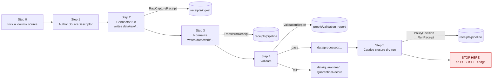

<!-- [KFM_META_BLOCK_V2]
doc_id: kfm://doc/runbooks/first-ingest
title: First Ingest — Contributor Runbook
type: standard
version: v1
status: draft
owners: <docs steward + ingest lane owner — NEEDS VERIFICATION>
created: 2026-05-12
updated: 2026-05-12
policy_label: public
related:
  - docs/doctrine/directory-rules.md
  - docs/doctrine/lifecycle-law.md
  - docs/doctrine/trust-membrane.md
  - docs/sources/SOURCE_DESCRIPTOR_STANDARD.md
  - docs/standards/RUN_RECEIPT.md
  - docs/runbooks/README.md
  - connectors/README.md
  - pipelines/ingest/README.md
  - tools/validators/connector_gate/README.md
  - tools/validators/promotion_gate/README.md
  - schemas/contracts/v1/source/source-descriptor.json
  - schemas/contracts/v1/receipts/run-receipt.json
  - policy/ingest/admission.rego
tags: [kfm, runbook, ingest, raw, work, processed, evidence, receipts, fail-closed]
notes:
  - First-time end-to-end ingest dry-run for a single source, one run, one domain.
  - Strictly non-publishing — terminates at PROCESSED (with optional CATALOG dry-run).
  - All concrete paths below the "Repo references" table are PROPOSED until verified against mounted repo evidence.
[/KFM_META_BLOCK_V2] -->

<a id="top"></a>

# First Ingest — Contributor Runbook

> Stand up your first source-to-`PROCESSED` ingest slice on KFM **without publishing**, **without bypassing gates**, and with every step leaving an inspectable receipt.

<p align="center">
  <em>Evidence first · Watcher-as-non-publisher · Fail-closed · Reversible</em>
</p>


<sub>**Status:** draft · **Owners:** docs steward + ingest lane owner *(NEEDS VERIFICATION)* · **Last updated:** 2026-05-12</sub>

---

## Quick jump

- [Who this is for](#who-this-is-for)
- [What this runbook does not do](#what-this-runbook-does-not-do)
- [Doctrinal posture](#doctrinal-posture)
- [Prerequisites](#prerequisites)
- [The first-ingest flow at a glance](#the-first-ingest-flow-at-a-glance)
- [Step 0 — Choose a low-risk first source](#step-0--choose-a-low-risk-first-source)
- [Step 1 — Author a SourceDescriptor](#step-1--author-a-sourcedescriptor)
- [Step 2 — Register the source and run the connector (RAW)](#step-2--register-the-source-and-run-the-connector-raw)
- [Step 3 — Normalize into WORK](#step-3--normalize-into-work)
- [Step 4 — Validate (WORK → PROCESSED)](#step-4--validate-work--processed)
- [Step 5 — Catalog closure dry-run (no PUBLISHED edge)](#step-5--catalog-closure-dry-run-no-published-edge)
- [Step 6 — Inspect your receipts](#step-6--inspect-your-receipts)
- [Definition of Done](#definition-of-done)
- [Rollback and cleanup](#rollback-and-cleanup)
- [Troubleshooting](#troubleshooting)
- [Repo references](#repo-references)
- [Related docs](#related-docs)
- [Appendices](#appendices)

---

## Who this is for

A first-time KFM contributor — connector author, domain editor, or steward apprentice — who needs to take a single, low-risk external source through one full governed loop on a developer machine and end with **receipts they can inspect**, not bytes they have shipped.

The point of this runbook is **not** to teach you how to publish. It is to teach you how publishing *is denied to you by default* and how to produce the evidence that a release manager would later use, if and only if every gate clears.

> [!IMPORTANT]
> This runbook stops at `PROCESSED`. The transitions `PROCESSED → CATALOG/TRIPLET` and `CATALOG/TRIPLET → PUBLISHED` are governed by separate runbooks, separate reviewers, and separate release authority. A first-ingest contributor MUST NOT promote past `PROCESSED` on their own.

---

## What this runbook does not do

- It does **not** publish anything to a public surface.
- It does **not** mutate `data/catalog/`, `data/triplets/`, `data/published/`, or `release/`.
- It does **not** authorize a connector to write outside `data/raw/<domain>/<source_id>/<run_id>/` or `data/quarantine/...`.
- It does **not** waive any policy gate, validation gate, sensitivity check, or rights check.
- It does **not** replace `docs/sources/SOURCE_DESCRIPTOR_STANDARD.md` for source-shape authority.
- It does **not** establish a parallel home for receipts, proofs, manifests, or release artifacts.

If any step below appears to bend an invariant, the step is wrong — not the invariant. Open a `docs/registers/DRIFT_REGISTER.md` entry instead of working around it.

---

## Doctrinal posture

KFM's lifecycle invariant (CONFIRMED doctrine, per `docs/doctrine/lifecycle-law.md` and `docs/doctrine/directory-rules.md`):

> **RAW → WORK / QUARANTINE → PROCESSED → CATALOG / TRIPLET → PUBLISHED**
>
> Promotion is a **governed state transition, not a file move.**

Three rules dominate every step you will perform:

1. **Watcher-as-non-publisher.** Connectors, watchers, and pipeline workers emit candidate records and receipts. They never publish. They never rewrite catalog truth.
2. **Cite-or-abstain.** Anything you cannot resolve to an `EvidenceBundle` via an `EvidenceRef` is not safely citable. First ingest produces the *raw materials* for evidence, not finished evidence.
3. **Deny-by-default for sensitive classes.** If your source touches any class in the [Sensitive class register](#a1--sensitive-class-quick-reference), this runbook is not the right entry point. Use the sensitive-lane intake runbook instead.

> [!CAUTION]
> A `data/raw/...` write is not a "preview" of publication. It is admitted source material under source identity, with no public surface and no AI context exposure. Treat it accordingly.

---

## Prerequisites

| Prerequisite | Where it lives *(PROPOSED until verified)* | Why you need it |
|---|---|---|
| Git clone of the KFM repo with write access to a feature branch | Local workstation | All artifacts of a first ingest land on a branch, never on `main`. |
| Python 3.11+ and Node toolchain matching the repo `.tool-versions` / `engines` | Local workstation | Validators and connector scaffolds rely on the pinned toolchain. *(NEEDS VERIFICATION: actual pinned versions.)* |
| `jq`, `uuidgen`, a JCS implementation (RFC 8785) for canonical JSON | Local workstation | `spec_hash` is **only** valid when JCS-canonicalized before SHA-256. |
| A SourceDescriptor schema reference | `schemas/contracts/v1/source/source-descriptor.json` *(PROPOSED per Directory Rules §7.4 and ADR-0001)* | The descriptor is the admission contract. |
| RunReceipt schema reference | `schemas/contracts/v1/receipts/run-receipt.json` *(PROPOSED)* | Every step you perform emits a RunReceipt. |
| Validator binaries / scripts | `tools/validators/connector_gate/`, `tools/validators/source_descriptor/`, `tools/validators/promotion_gate/` *(PROPOSED)* | Validators decide whether your run advances or quarantines. |
| Policy bundle for ingest admission | `policy/ingest/admission.rego` *(PROPOSED)* | Deny-by-default rules for license, rights, sensitivity. |
| Read access to `docs/sources/SOURCE_DESCRIPTOR_STANDARD.md` | Repo docs | Authoritative field-level shape for SourceDescriptor. |

> [!NOTE]
> All concrete paths in the "Where it lives" column are **PROPOSED** until inspected against mounted repository evidence. If your repo state differs, file a `DRIFT_REGISTER` entry and use the actual paths — do not force the doc's paths.

---

## The first-ingest flow at a glance



Five things to notice in the diagram:

- Every transition emits a **receipt** or **proof object** to `data/receipts/` or `data/proofs/`.
- A failed validation goes to `data/quarantine/`, not back to RAW. Quarantine is **not** a publishable staging area.
- Catalog closure is a *dry run* in this runbook — it produces a `PolicyDecision` and a `RunReceipt` but does not transition to `PUBLISHED`.
- The diagram is **PROPOSED** in its concrete file paths; the *shape* of the flow is CONFIRMED doctrine.
- The renderer (MapLibre, Cesium, Focus Mode) is intentionally absent — first ingest never touches a public surface.

---

## Step 0 — Choose a low-risk first source

A safe first source has **all** of these properties. If any is missing, pick a different source.

| Property | Why it matters |
|---|---|
| Public-domain or permissive open license with a clear SPDX identifier (e.g., `CC0-1.0`, `CC-BY-4.0`, `PDDL-1.0`) | Unknown rights fail closed at the policy gate; you will not get past Step 4. |
| Stable HTTP endpoint with `ETag` and `Last-Modified` headers | Required for deterministic source-head capture and conditional re-fetch. |
| Small payload (target ≤ tens of megabytes, single file or tiny manifest) | First ingests should be fast and reviewable; large payloads obscure failures. |
| No `living-person`, `DNA/genomic`, `rare-species exact location`, `archaeology`, `sacred place`, `critical infrastructure precise geometry`, or `private landowner` content | Every one of these is **deny-by-default**. See [Appendix A.1](#a1--sensitive-class-quick-reference). |
| Source role is one of: `observed`, `regulatory`, `aggregate`, `administrative` — **not** `modeled`, `candidate`, or `synthetic` for a first run | These three carry additional descriptor burden (model run ref, candidate disposition, reality boundary note). |
| Domain you already have read access to in `docs/domains/<domain>/` | The descriptor will live under that domain. |

Good first-source examples (illustrative, **NEEDS VERIFICATION** that each is currently approved in your repo's source registry):

- a single USGS public elevation tile metadata record
- a single FEMA flood-hazard polygon excerpt for one Kansas county
- a single NOAA daily-summary CSV for one station, one month
- a single NLCD land-cover excerpt for one HUC-12

> [!TIP]
> If you are unsure, ask in the docs-steward channel and link a candidate URL. A first ingest is not the place to negotiate ambiguous rights.

[Back to top](#top)

---

## Step 1 — Author a SourceDescriptor

The `SourceDescriptor` is the admission contract. It carries source identity, rights, source role, sensitivity, cadence, and retrieval plan. **It is the only artifact that authorizes a connector run.**

### 1.1 Draft the descriptor

Create a file (illustrative path; verify against your repo's chosen home):

```text
data/registry/source_descriptors/<domain>/<source_id>.json    # PROPOSED
```

Minimum fields (drawn from KFM doctrine; **NEEDS VERIFICATION** against the live schema):

```json
{
  "object_type": "SourceDescriptor",
  "schema_version": "v1",
  "source_id": "<stable id, e.g., usgs-3dep-tile-XXXX>",
  "source_role": "observed",
  "role_authority": "<issuing body>",
  "domain": "<hydrology|soil|hazards|...>",
  "rights": {
    "spdx_id": "CC0-1.0",
    "license_text_ref": "<uri to license>",
    "redistribution_allowed": true,
    "attribution_required": false
  },
  "sensitivity": "public",
  "retrieval": {
    "url": "<https endpoint>",
    "method": "GET",
    "expects_etag": true,
    "expects_last_modified": true,
    "cadence": "manual-first-ingest"
  },
  "fingerprint": {
    "expected_content_types": ["application/json"],
    "expected_max_bytes": 10485760
  },
  "stewardship": {
    "owner": "<your handle or team>",
    "intake_reason": "first-ingest dry-run"
  }
}
```

### 1.2 Compute the descriptor's `spec_hash`

`spec_hash` is **only** valid when computed via RFC 8785 JCS canonicalization followed by SHA-256, and recorded as `jcs:sha256:<hex>` (CONFIRMED doctrine; see `docs/standards/CANONICALIZATION.md` — **PROPOSED** path).

```bash
# illustrative; replace with the repo's pinned tool when available
python3 - <<'PY'
import json, hashlib
try:
    import rfc8785 as jcs
except ImportError:
    import jcs  # alternative library
with open("data/registry/source_descriptors/<domain>/<source_id>.json", "rb") as f:
    canonical = jcs.canonicalize(json.load(f))
print("jcs:sha256:" + hashlib.sha256(canonical).hexdigest())
PY
```

> [!WARNING]
> Do **not** hash the developer-formatted JSON. A trailing newline or a re-sorted key changes the hash and breaks every downstream gate. Always canonicalize first.

### 1.3 Validate the descriptor

```bash
# PROPOSED command; verify against tools/validators/source_descriptor/README.md
kfm-validate source-descriptor \
  data/registry/source_descriptors/<domain>/<source_id>.json
```

The validator MUST fail closed if any of: `source_role`, `rights.spdx_id`, `sensitivity`, `retrieval.url`, or `source_id` is missing or `unknown`. If it does not, you are looking at a drift candidate — file a `DRIFT_REGISTER` entry.

[Back to top](#top)

---

## Step 2 — Register the source and run the connector (RAW)

### 2.1 Where the connector lives

Connectors are source-specific fetch-and-admission code. They live under `connectors/<provider>/` (e.g., `connectors/usgs/`, `connectors/fema/`, `connectors/noaa/`, `connectors/nrcs/`, `connectors/kansas/` — per `directory-rules.md` §7.3, CONFIRMED). Connector output **MUST** land in:

```text
data/raw/<domain>/<source_id>/<run_id>/
```

Connectors **MUST NOT** write under `data/processed/`, `data/catalog/`, or `data/published/`.

### 2.2 Run the connector

```bash
# PROPOSED command surface; verify against connectors/<provider>/README.md
RUN_ID="$(uuidgen)"
kfm-connector run \
  --descriptor data/registry/source_descriptors/<domain>/<source_id>.json \
  --domain <domain> \
  --run-id "$RUN_ID" \
  --no-publish      # belt and suspenders; the connector cannot publish anyway
```

### 2.3 What the connector emits

A successful connector run produces, at minimum, a **`RawCaptureReceipt`** (CONFIRMED object family). Expected location (PROPOSED):

```text
data/receipts/ingest/<domain>/<source_id>/<run_id>/raw_capture_receipt.json
```

Required content (illustrative; **NEEDS VERIFICATION** against the live schema):

| Field | Purpose |
|---|---|
| `object_type: "RawCaptureReceipt"` | Family discrimination. |
| `schema_version` | Version of the receipt schema. |
| `source_descriptor_ref` (`EvidenceRef` → SourceDescriptor) | Pins admission contract. |
| `run_id` | Stable identity for this fetch. |
| `source_head` (`etag`, `last_modified`, `content_length`) | Captures exact source state. |
| `artifacts[]` with `{path, sha256, bytes}` | Per-file integrity, deterministic. |
| `spec_hash: "jcs:sha256:..."` | Receipt's own canonical identity. |
| `actor`, `runner_id`, `timestamp` | Audit reconstruction. |
| `evidence_refs[]` | Reverse-lookup hooks. |

> [!NOTE]
> If `source_head` is missing `etag` or `last_modified`, the receipt is still emitted but the connector marks the run **degraded**. Step 4 will refuse to promote a degraded raw to `PROCESSED` without a steward override.

### 2.4 What you should now see

```text
data/
├── raw/<domain>/<source_id>/<run_id>/
│     └── <files fetched, byte-for-byte from source>
└── receipts/ingest/<domain>/<source_id>/<run_id>/
      └── raw_capture_receipt.json
```

Confirm both exist. The `raw/...` contents are **not** for public viewing, AI context, or rendering. They are admitted source material under source identity.

[Back to top](#top)

---

## Step 3 — Normalize into WORK

Normalization transforms the raw source into a candidate domain record (or a candidate set). It lives under `pipelines/ingest/` and `pipelines/normalize/` per `directory-rules.md` §7.4 (CONFIRMED).

### 3.1 Run the normalizer

```bash
# PROPOSED command surface
kfm-pipeline normalize \
  --raw-run data/raw/<domain>/<source_id>/<run_id> \
  --domain <domain> \
  --run-id "$RUN_ID"
```

### 3.2 What normalization emits

Two artifacts (CONFIRMED object families):

| Artifact | Where | Purpose |
|---|---|---|
| Normalized candidate records | `data/work/<domain>/<run_id>/` *(PROPOSED)* | Candidate assertions, not canonical truth. |
| **`TransformReceipt`** | `data/receipts/pipeline/<domain>/<run_id>/transform_receipt.json` *(PROPOSED)* | Records transform identity, inputs, parameters, loss notes. |

> [!IMPORTANT]
> A `TransformReceipt` MUST record what the transform changed, including any field loss or interpretation. "Lossless rename" is still recorded. The receipt is the only place the transform is honestly described.

### 3.3 What you must NOT do

- Do **not** copy `work/` files to `processed/` by hand.
- Do **not** edit the normalized record after the receipt is written; if you change something, re-run normalization with a new `run_id`.
- Do **not** treat the normalized record as cite-able — it has no `EvidenceBundle` yet.

[Back to top](#top)

---

## Step 4 — Validate (WORK → PROCESSED)

Validation is the first transition that touches a **policy gate** and produces a **decision**. This is where most first ingests legitimately fail, and that is fine — quarantine is a normal outcome.

### 4.1 Run the validator stack

```bash
# PROPOSED command surface; verify against tools/validators/promotion_gate/README.md
kfm-validate promotion-gate \
  --work-run data/work/<domain>/<run_id> \
  --descriptor data/registry/source_descriptors/<domain>/<source_id>.json \
  --domain <domain> \
  --run-id "$RUN_ID"
```

### 4.2 What runs under the hood

| Check | What it verifies | Failure outcome |
|---|---|---|
| Schema validation | Records match the domain contract in `schemas/contracts/v1/domains/<domain>/` *(PROPOSED)* | `QUARANTINE` with `schema_drift` reason |
| Geometry validation | Geometries are well-formed; CRS recorded; not silently reprojected | `QUARANTINE` with `geometry_defect` reason |
| Temporal validation | `observed`, `valid`, `source`, `retrieval` times distinct where material | `QUARANTINE` with `temporal_scope_missing` reason |
| Rights validation | `spdx_id` known; redistribution flags consistent; `unknown` rights fail closed | `DENY` from policy gate |
| Sensitivity validation | No precision-creep above the descriptor's declared sensitivity tier | `DENY` or `RESTRICT` |
| Evidence closure | EvidenceRefs introduced by the transform resolve to candidate evidence | `ABSTAIN` until resolved |
| `spec_hash` parity | Recomputed `spec_hash` matches the descriptor's recorded hash | `DENY` (`spec_hash_mismatch`) |

### 4.3 What validation emits

| Artifact | Where | Purpose |
|---|---|---|
| **`ValidationReport`** | `data/proofs/validation_report/<domain>/<run_id>/validation_report.json` *(PROPOSED)* | Pass/fail per check, deterministic inputs, validator id. |
| **`PolicyDecision`** | `data/receipts/pipeline/<domain>/<run_id>/policy_decision.json` *(PROPOSED)* | Finite outcome: `ALLOW`, `RESTRICT`, `DENY`, `ABSTAIN`, or `ERROR`. |
| **`RunReceipt`** | `data/receipts/pipeline/<domain>/<run_id>/run_receipt.json` *(PROPOSED)* | Process memory binding all the above. |

### 4.4 Reading the outcome

| Outcome | Where the run lands | What you do next |
|---|---|---|
| `ALLOW` + all validations pass | `data/processed/<domain>/<dataset_id>/<version>/` | Continue to Step 5. |
| Any validation fail | `data/quarantine/<domain>/<reason>/<run_id>/` + `QuarantineRecord` | Read the report, fix the source/descriptor/transform, re-run from Step 1 or Step 3 with a **new** `run_id`. |
| `RESTRICT` | Stays in `work/` with restriction notes | Engage a steward; not a first-ingest path. |
| `DENY` | Run terminates; `QuarantineRecord` written | Read the report; if rights or sensitivity, pick a different source. |
| `ABSTAIN` | Stays in `work/`; evidence resolution pending | Provide missing evidence or pick a different source. |
| `ERROR` | Run terminates; no canonical promotion | File a bug. Do not retry until the underlying error is diagnosed. |

> [!CAUTION]
> Do **not** treat `QUARANTINE` as a temporary parking lot to be "fixed by promoting later." Quarantine is a governed terminal state for this `run_id`. A fix means a new descriptor or a new run, not an in-place mutation.

[Back to top](#top)

---

## Step 5 — Catalog closure dry-run (no PUBLISHED edge)

This step is a **dry run** in this runbook. It produces the artifacts a catalog closure would need, runs the policy gate in dry-run mode, and **stops short of writing to `data/catalog/` or `data/triplets/`** unless your reviewer explicitly approves.

### 5.1 Run the dry-run

```bash
# PROPOSED command surface; verify against pipelines/catalog/README.md
kfm-pipeline catalog-close \
  --processed-run data/processed/<domain>/<dataset_id>/<version> \
  --domain <domain> \
  --run-id "$RUN_ID" \
  --dry-run
```

### 5.2 What the dry-run produces

| Artifact | Where | Purpose |
|---|---|---|
| Candidate `CatalogRecord` | scratch path, **not** `data/catalog/` | Discovery metadata draft. |
| Candidate `EvidenceBundle` | scratch path, **not** `data/proofs/evidence_bundle/` | Source list, excerpts, provenance, policy posture. |
| `PolicyDecision` (dry-run) | `data/receipts/pipeline/<domain>/<run_id>/policy_decision.catalog.json` *(PROPOSED)* | Finite outcome at catalog gate. |
| `RunReceipt` (catalog dry-run) | `data/receipts/pipeline/<domain>/<run_id>/run_receipt.catalog.json` *(PROPOSED)* | Audit memory. |

### 5.3 What the dry-run does NOT do

- Does not write a `ReleaseManifest` (those live in `release/manifests/` and require release authority).
- Does not touch `data/published/`.
- Does not sign anything for release (DSSE / cosign signing of release artifacts is the release manager's job).
- Does not create an `EvidenceRef` that resolves on the public surface.

> [!IMPORTANT]
> A `data/published/` write or a `release/manifests/` write at this stage is a governance violation regardless of how clean the upstream looked. Stop and engage a steward.

[Back to top](#top)

---

## Step 6 — Inspect your receipts

A first ingest is "done" only when **you can read your own work back as evidence**. This is the part most contributors skip and it is the most important part.

For each of the receipts below, confirm:

- The file exists at the expected path.
- The `object_type` and `schema_version` are correct.
- The `spec_hash` is `jcs:sha256:<hex>` and recomputes to the same value.
- The receipt links **back** to the descriptor via an `EvidenceRef`, and **forward** to the run it describes.
- The `actor`, `runner_id`, and `timestamp` are populated.

| Receipt | Question it must answer |
|---|---|
| `RawCaptureReceipt` | What was fetched, from where, with which ETag, in what shape? |
| `TransformReceipt` | What did the transform change, and what did it lose? |
| `ValidationReport` | Which checks ran, which passed, which failed, and on which deterministic inputs? |
| `PolicyDecision` (work→processed) | What finite outcome did the promotion gate return, and why? |
| `RunReceipt` (work→processed) | Who ran this, with what tools, against what inputs, and when? |
| `PolicyDecision` (catalog dry-run) | Would catalog closure have passed? On what conditions? |
| `RunReceipt` (catalog dry-run) | Same audit trail at the catalog gate. |

> [!TIP]
> If a receipt is missing, do **not** synthesize it. A missing receipt is the system telling you a step did not run cleanly. Re-run the affected step with a new `run_id`.

<details>
<summary><strong>Optional: minimal jq inspection one-liner</strong></summary>

```bash
# Walk every receipt under this run and print object_type + spec_hash
find "data/receipts" "data/proofs" -path "*/${RUN_ID}/*" -name "*.json" -print \
  | while read -r f; do
      printf "%s\t" "$f"
      jq -r '[.object_type, .spec_hash] | @tsv' "$f"
    done
```

</details>

[Back to top](#top)

---

## Definition of Done

A first ingest is **done** when **all** of the following are true:

- [ ] A `SourceDescriptor` exists, validates, and has a recomputable `jcs:sha256` hash.
- [ ] A connector run produced exactly the expected files under `data/raw/<domain>/<source_id>/<run_id>/`.
- [ ] A `RawCaptureReceipt` exists, links to the descriptor, and records `etag` + `last_modified`.
- [ ] A `TransformReceipt` exists and honestly describes the normalization.
- [ ] A `ValidationReport` exists with every check accounted for.
- [ ] A `PolicyDecision` exists for the WORK → PROCESSED transition.
- [ ] If the outcome was `ALLOW`, the run landed under `data/processed/<domain>/<dataset_id>/<version>/`; if not, it landed under `data/quarantine/<domain>/<reason>/<run_id>/` with a `QuarantineRecord`.
- [ ] A catalog closure dry-run produced a `PolicyDecision.catalog.json` **without** writing to `data/catalog/`, `data/triplets/`, `data/published/`, or `release/`.
- [ ] No file outside the paths above was created, moved, or deleted by your run.
- [ ] You can read your receipts back and explain to a reviewer what happened.

> [!NOTE]
> Publishing — i.e., a `CATALOG/TRIPLET → PUBLISHED` transition — is **not** a Definition of Done condition for this runbook. It is intentionally out of scope.

---

## Rollback and cleanup

A first-ingest run is **reversible by construction** because nothing past `PROCESSED` ever happened. Cleanup is:

1. **Receipts** — never delete. They are append-only evidence. If the run was a mistake, you correct it forward with a new `run_id` and a `CorrectionNotice` (steward-authored), not by erasing the past.
2. **`data/raw/.../<run_id>/`** — may be safely deleted on a developer workstation. The `RawCaptureReceipt` still records what was fetched and can be re-fetched against the same `source_head` if needed.
3. **`data/work/.../<run_id>/`** — may be safely deleted. The `TransformReceipt` records what would be re-derivable.
4. **`data/processed/.../`** — do **not** delete on a shared environment. On a workstation, prefer a fresh branch over deletion. On any shared environment, request a steward-authored `RollbackCard`.
5. **`data/quarantine/.../<run_id>/`** — leave it. Quarantine is governance evidence, not garbage.

> [!WARNING]
> A workstation cleanup is **not** a system rollback. System-level rollback uses `RollbackCard`s in `release/rollback_cards/` and is the release manager's responsibility — never a contributor's.

---

## Troubleshooting

<details>
<summary><strong>Connector says <code>missing etag</code> / <code>missing last_modified</code></strong></summary>

The source did not expose validators. You have three options, in order of preference:
1. Pick a different first source.
2. Add a manifest checksum step (`sha256sum -c`) per `C3-02` doctrine and record it in `source_head.content_hash`. **NEEDS VERIFICATION** that your connector supports this.
3. Engage a steward to attach a stewarded-fingerprint exception. Do **not** disable the check.
</details>

<details>
<summary><strong>Validator reports <code>spec_hash_mismatch</code></strong></summary>

You almost certainly canonicalized differently between descriptor authoring and run time. Re-derive the descriptor's hash with the **same** JCS implementation that the validator uses (see `docs/standards/CANONICALIZATION.md` — **PROPOSED**), recommit, and re-run.
</details>

<details>
<summary><strong>Policy gate returns <code>DENY (unknown rights)</code></strong></summary>

The descriptor's `rights.spdx_id` was missing, ambiguous, or not in the approved SPDX list. Fix the descriptor, recompute its hash, and re-run from Step 1. Do **not** patch the policy.
</details>

<details>
<summary><strong>Policy gate returns <code>DENY (sensitivity)</code></strong></summary>

Your source touched a sensitive class. Stop. Read [Appendix A.1](#a1--sensitive-class-quick-reference). This is not a first-ingest source.
</details>

<details>
<summary><strong>Run lands in quarantine with <code>schema_drift</code></strong></summary>

Either the source shape changed upstream (file a `DRIFT_REGISTER` entry; the connector or domain schema needs an update via the proper change path), or the descriptor's `fingerprint.expected_content_types` was wrong. Fix the descriptor; do not edit the domain schema as a first-ingest contributor.
</details>

<details>
<summary><strong>I want to publish my first ingest</strong></summary>

You don't. Publication is a governed state transition that requires: a `ReleaseManifest`, a `ReviewRecord` (where required), a rollback target, a correction path, separation of duties from the original author, and (for materiality) a release authority. None of those are first-ingest contributor responsibilities. Hand off cleanly via the receipts you produced.
</details>

[Back to top](#top)

---

## Repo references

All paths in this table are **PROPOSED** per `directory-rules.md` and the project's doctrine documents. Each row is a place a first-ingest contributor will look but **NEEDS VERIFICATION** against actual mounted-repo state.

| Reference | Proposed path | Source basis |
|---|---|---|
| Directory Rules | `docs/doctrine/directory-rules.md` | CONFIRMED — supplied artifact |
| SourceDescriptor schema | `schemas/contracts/v1/source/source-descriptor.json` | PROPOSED — Directory Rules §7.4, ADR-0001 |
| RunReceipt schema | `schemas/contracts/v1/receipts/run-receipt.json` | PROPOSED — `C1-01` receipt doctrine |
| Canonicalization standard | `docs/standards/CANONICALIZATION.md` | PROPOSED — `C1-02` JCS doctrine |
| Source descriptor standard | `docs/sources/SOURCE_DESCRIPTOR_STANDARD.md` | PROPOSED — Whole-UI/Governed-AI expansion plan |
| Connector home | `connectors/<provider>/` | CONFIRMED — Directory Rules §7.3 |
| Ingest pipelines | `pipelines/ingest/`, `pipelines/normalize/`, `pipelines/validate/`, `pipelines/catalog/` | CONFIRMED — Directory Rules §7.4 |
| Validator binaries | `tools/validators/connector_gate/`, `tools/validators/promotion_gate/`, `tools/validators/source_descriptor/`, `tools/validators/evidence_bundle/` | CONFIRMED — Directory Rules §7.5 |
| Ingest admission policy | `policy/ingest/admission.rego` | PROPOSED — Directory Rules §6 (policy as canonical home) |
| Drift register | `docs/registers/DRIFT_REGISTER.md` | CONFIRMED — Directory Rules §2.5, §6.1 |
| Verification backlog | `docs/registers/VERIFICATION_BACKLOG.md` | CONFIRMED — Directory Rules §6.1 |

---

## Related docs

- [`docs/doctrine/directory-rules.md`](../doctrine/directory-rules.md) — placement authority.
- [`docs/doctrine/lifecycle-law.md`](../doctrine/lifecycle-law.md) — RAW → … → PUBLISHED invariant.
- [`docs/doctrine/trust-membrane.md`](../doctrine/trust-membrane.md) — why public clients never see `data/raw|work|quarantine`.
- [`docs/sources/SOURCE_DESCRIPTOR_STANDARD.md`](../sources/SOURCE_DESCRIPTOR_STANDARD.md) — *(PROPOSED)* descriptor field shape.
- [`docs/standards/RUN_RECEIPT.md`](../standards/RUN_RECEIPT.md) — *(PROPOSED)* receipt shape and required invariants.
- [`docs/standards/CANONICALIZATION.md`](../standards/CANONICALIZATION.md) — *(PROPOSED)* JCS vs URDNA2015 decision matrix.
- [`docs/runbooks/README.md`](./README.md) — *(PROPOSED)* runbooks index.
- [`docs/registers/DRIFT_REGISTER.md`](../registers/DRIFT_REGISTER.md) — file drift here rather than working around it.
- `connectors/README.md`, `pipelines/ingest/README.md`, `tools/validators/promotion_gate/README.md` — companion READMEs (*PROPOSED* until verified).

---

## Appendices

### A.1 — Sensitive class quick reference

If your candidate source touches **any** of the classes below, this is not a first-ingest source. Use the sensitive-lane intake path and engage a steward.

| Class | Default outcome | Source basis |
|---|---|---|
| Living persons (personal data, residences, identity assertions) | DENY public exact | CONFIRMED — sensitivity register |
| DNA / genomic / living-person relatives | DENY by default | CONFIRMED |
| Rare-species exact taxa locations (nest, den, roost, spawning) | DENY public exact location | CONFIRMED |
| Archaeology (site coordinates, burial, sacred/culturally sensitive) | DENY public exact location | CONFIRMED |
| Sacred / culturally sensitive places (oral history, cultural routes) | DENY until steward review | CONFIRMED |
| Critical infrastructure (exact facilities, dependencies, condition) | RESTRICT / DENY public precision | CONFIRMED |
| Private landowner-sensitive data (field boundaries, owner identity) | DENY exact / public if private | CONFIRMED |
| Exact sensitive locations (any point that increases harm risk) | DENY by default | CONFIRMED |
| Emergency-warning misuse (life-safety substitution) | DENY life-safety replacement | CONFIRMED |
| Source-rights-limited (licensed, restricted, no-redistribution, uncertain terms) | DENY public release until resolved | CONFIRMED |

### A.2 — Lifecycle phase quick reference

| Phase | Allowed | MUST NOT |
|---|---|---|
| `raw/` | Source-edge captures, immutable, with retrieval metadata and checksums | Public clients, AI context, UI layers, normalized records |
| `work/` | Normalized intermediates, candidate assertions | Public API/UI, release aliases |
| `quarantine/` | Failed validation, unresolved rights/sensitivity, schema drift, over-precise geometry | Promotion candidates without remediation |
| `processed/` | Validated canonical records | Assumption of public/release status |
| `catalog/` *(out of scope here)* | STAC/DCAT/PROV records, domain catalog | Uncited claims, unclosed identifiers |
| `triplets/` *(out of scope here)* | Relationship projections and graph-compatible triples | Canonical replacement semantics |
| `published/` *(out of scope here)* | Released public-safe artifacts | Raw, work, quarantine, exact restricted geometry |
| `receipts/` | Process memory: run, validation, AI, ingest, release | Proof of release by themselves |
| `proofs/` | EvidenceBundle, ProofPack, integrity bundle | Process-only receipts without release context |

### A.3 — Finite outcome vocabulary

KFM governed flows return a finite outcome from this set (CONFIRMED doctrine):

| Outcome | Meaning at the promotion gate |
|---|---|
| `ALLOW` (or `ANSWER`) | All gates clear; transition permitted. |
| `RESTRICT` | Conditionally permitted with obligations (e.g., redaction, generalization, staged access). |
| `DENY` | Failed; transition refused; QuarantineRecord written. |
| `ABSTAIN` | Insufficient evidence or unresolved policy state; no transition. |
| `ERROR` | Tooling or runtime failure; no transition; bug to file. |

### A.4 — Glossary (placement-relevant subset)

| Term | Short meaning relevant to first ingest |
|---|---|
| **SourceDescriptor** | The admission contract for a source. Lives in `data/registry/source_descriptors/`. |
| **RawCaptureReceipt** | The fetch receipt for a connector run. Lives in `data/receipts/ingest/`. |
| **TransformReceipt** | The normalization receipt. Lives in `data/receipts/pipeline/`. |
| **ValidationReport** | The pass/fail record for validators. Lives in `data/proofs/validation_report/`. |
| **PolicyDecision** | The finite-outcome verdict from a policy gate. Lives in `data/receipts/pipeline/`. |
| **RunReceipt** | Process memory for a run; binds inputs, tools, and outputs. Lives in `data/receipts/pipeline/`. |
| **EvidenceBundle** | Resolved support package for a claim. Lives in `data/proofs/evidence_bundle/`. Not produced in a first ingest. |
| **EvidenceRef** | A reference that MUST resolve to an `EvidenceBundle` before publication. |
| **spec_hash** | `jcs:sha256:<hex>` — RFC 8785 JCS canonicalization + SHA-256. |
| **Watcher-as-non-publisher** | Connectors and workers emit candidates and receipts; they do not publish. |
| **Promotion** | A governed state transition between lifecycle phases. Not a file move. |

---

<sub><strong>Related docs:</strong> <a href="../doctrine/directory-rules.md">Directory Rules</a> · <a href="../doctrine/lifecycle-law.md">Lifecycle Law</a> · <a href="../doctrine/trust-membrane.md">Trust Membrane</a> · <a href="../sources/SOURCE_DESCRIPTOR_STANDARD.md">Source Descriptor Standard</a> · <a href="../standards/RUN_RECEIPT.md">RunReceipt Standard</a> · <a href="../registers/DRIFT_REGISTER.md">Drift Register</a></sub>

<sub><strong>Last updated:</strong> 2026-05-12 · <strong>Status:</strong> draft · <a href="#top">Back to top</a></sub>
