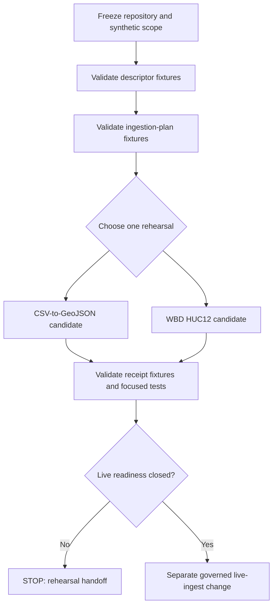

<!-- [KFM_META_BLOCK_V2]
doc_id: kfm://doc/runbooks/first-ingest
title: First Ingest — Contributor Rehearsal and Readiness Runbook
type: runbook
version: v2.0
status: draft; repository-grounded; FIXTURE_REHEARSAL_READY; LIVE_FIRST_INGEST_HELD; NON_PUBLISHING
owners:
  - docs steward — NEEDS VERIFICATION
  - ingest lane owner — NEEDS VERIFICATION
created: 2026-05-12
updated: 2026-09-01
owning_root: docs/
policy_label: repository-facing; contributor-runbook; fixture-first; non-publishing
responsibility: repository-grounded contributor rehearsal and live-ingest readiness guidance without source activation, lifecycle mutation, promotion, release, deployment, or publication authority
truth_posture: CONFIRMED bounded no-network rehearsal surfaces / PROPOSED future governed live ingest / NEEDS VERIFICATION source admission, owners, shared execution path, hosted checks, and any live activation
related:
  - docs/doctrine/directory-rules.md
  - docs/doctrine/lifecycle-law.md
  - docs/doctrine/trust-membrane.md
  - docs/runbooks/README.md
  - docs/sources/SOURCE_DESCRIPTOR_STANDARD.md
  - contracts/source/source_ingestion_plan.md
  - contracts/source/ingest_receipt.md
  - pipelines/ingest/README.md
  - tools/ingest/csv_geojson_preflight/README.md
  - pipelines/domains/hydrology/ingest_wbd_huc/README.md
notes:
  - "Evidence snapshot: bartytime4life/Kansas-Frontier-Matrix main at ed5b8cd5ebdab187684f216b296c5dde379b6ea9; previous target blob 92848fe3d575545262ecff0d0d72b4967942262c; the repository had zero open pull requests at final pre-branch inspection."
  - "Inspection covered the target, adopted directory and lifecycle doctrine, trust boundaries, source guidance, contracts, schemas, fixture-first producers, validators, tests, workflows, receipt guidance, and placeholder shared ingest and CLI entrypoints."
  - "Notion was coordination context and Google Drive was read-only design lineage; neither overrides current repository evidence."
  - "The repository supports bounded no-network ingest rehearsals; it does not expose one verified generic live first-ingest command."
  - "pipelines/ingest/main.py and apps/cli/src/kfm_cli/commands/ingest.py remain placeholders, so earlier kfm-connector, kfm-pipeline, and kfm-validate examples were removed."
  - "SourceDescriptor contract/schema paths remain a documented convergence boundary; this runbook validates existing fixture families without declaring a new canonical path."
  - "A rehearsal candidate, validator PASS, receipt, or green workflow does not activate a source, mutate lifecycle state, establish evidence closure, or authorize release or publication."
[/KFM_META_BLOCK_V2] -->

<a id="top"></a>

# First Ingest — Contributor Rehearsal and Readiness Runbook

Use this runbook to rehearse KFM's source-intake boundaries with deterministic,
public-safe fixtures and to assemble the evidence needed for a future governed
ingest. The verified procedure stops before live source access, source
activation, registry mutation, lifecycle writes, promotion, release,
deployment, or publication.

> [!IMPORTANT]
> **The current generic first-ingest path is a rehearsal, not a live ingest.**
> The shared `pipelines/ingest/` lane documents a boundary but does not establish
> a shared executable system, and the operator CLI ingest module is a
> placeholder. Use only the repository commands verified below.

> [!CAUTION]
> A fixture, plan candidate, normalized candidate, `RAW_CANDIDATE`, receipt,
> schema-valid record, test result, map, summary, or generated explanation is
> not source truth, an `EvidenceBundle`, a lifecycle transition, or public-use
> permission.

**Navigation:** [audience](#who-this-is-for) · [scope](#what-this-runbook-does-not-do) ·
[current capability](#current-repository-capability) · [prerequisites](#prerequisites) ·
[flow](#the-first-ingest-flow-at-a-glance) · [procedure](#step-0--choose-a-low-risk-first-source) ·
[completion](#definition-of-done) · [rollback](#rollback-and-cleanup) ·
[troubleshooting](#troubleshooting) · [references](#repo-references) ·
[readiness](#a1--live-ingest-readiness-gate)

<a id="who-this-is-for"></a>

## Who this is for

This runbook is for a contributor who needs to learn and verify the intake
contract before proposing a live connector or domain ingest change. It provides
two safe rehearsal tracks:

1. a generic synthetic CSV-to-GeoJSON normalization preflight; and
2. a Hydrology WBD HUC12 fixture-first ingest-candidate producer.

Choose one track for a first pass. Both are no-network, create review candidates
only, and deny lifecycle and publication effects.

For a real source, stop after the readiness assessment and hand off to the
source, domain, rights, sensitivity, validation, and lifecycle owners. A
contributor does not activate a source or select a RAW writer merely by
completing this document.

<a id="what-this-runbook-does-not-do"></a>

## What this runbook does not do

This runbook does not:

- run a live connector or fetch an external endpoint;
- create, approve, activate, supersede, or retire a `SourceDescriptor`;
- resolve the current SourceDescriptor schema-path convergence boundary;
- authorize a connector or shared pipeline to write RAW or QUARANTINE;
- write to `data/raw/`, `data/work/`, `data/quarantine/`,
  `data/processed/`, `data/catalog/`, `data/triplets/`, or
  `data/published/`;
- create an authoritative receipt, proof, policy decision, review record,
  release manifest, correction notice, or rollback card;
- promote anything to `PROCESSED`, `CATALOG`, `TRIPLET`, or `PUBLISHED`;
- expose internal or restricted material to an API, map, search index, report,
  export, or AI context; or
- establish that live source terms, endpoints, credentials, rate limits,
  payload shapes, or operational ownership are current.

Do not use the old illustrative commands `kfm-connector run`,
`kfm-pipeline normalize`, `kfm-pipeline catalog-close`, or
`kfm-validate promotion-gate`. No verified generic implementation for those
surfaces exists in the inspected repository state.

<a id="doctrinal-posture"></a>

## Doctrinal posture

The lifecycle remains:

```text
RAW -> WORK or QUARANTINE -> PROCESSED -> CATALOG or TRIPLET -> PUBLISHED
```

Promotion is a governed state transition, not a file move, successful command,
passing workflow, pull-request merge, deployment, or public-layer toggle.

Four boundaries govern every first-ingest proposal:

1. **Source metadata is not truth.** A `SourceDescriptor` constrains how KFM may
   treat material; it does not prove the source's claims.
2. **Receipts are process memory.** `IngestReceipt` records capture facts; it is
   not `RunReceipt`, `EvidenceBundle`, `PolicyDecision`, or `ReleaseManifest`.
3. **Unknown rights or sensitivity fail closed.** A digest or successful parser
   cannot clear terms, consent, sovereignty, privacy, sensitivity, or harmful
   precision.
4. **Public clients remain behind the trust membrane.** They consume governed
   interfaces or released public-safe artifacts, never RAW, WORK, QUARANTINE,
   internal receipts, or unreleased candidates.

The accepted [Directory Rules](../doctrine/directory-rules.md), through
[ADR-0029](../adr/ADR-0029-adopt-directory-governance-standard-v2.md), place
source-specific acquisition under `connectors/`, executable transformation
under `pipelines/`, machine shapes under `schemas/`, test inputs under
`fixtures/`, validation under `tools/validators/`, lifecycle instances under
`data/`, and release decisions under `release/`.

## Current repository capability

| Surface | Current evidence | Boundary |
|---|---|---|
| `pipelines/ingest/README.md` | Repository-grounded shared ingest boundary | No shared executable ingest system established |
| `pipelines/ingest/main.py` | Placeholder only | Not runnable ingest orchestration |
| `apps/cli/src/kfm_cli/commands/ingest.py` | Placeholder only | No verified generic `kfm ingest` command |
| `SourceDescriptor` contract, schemas, fixtures, validators | Proposed, fixture-validated family with multiple compatibility paths | Shape checks do not activate or admit a source |
| `SourceIngestionPlanCandidate` | Proposed fixture-only contract, schema, validator, and tests | Selects and checks a no-authority plan; performs no network or lifecycle write |
| CSV-to-GeoJSON preflight | Deterministic fixture-only helper and tests | Produces a review candidate from synthetic points only |
| WBD HUC12 ingest candidate | Implemented fixture-first producer, schemas, fixtures, tests, and inactive spec | Produces `RAW_CANDIDATE` or `NO_CHANGE_RECEIPT`; writes no lifecycle state |
| `IngestReceipt` validator | Deterministic no-network schema, time, digest, source-head, artifact, and byte-count checks | Does not prove a connector emitted or persisted a governed receipt |
| `data/receipts/ingest/` | Confirmed receipt-family lane | Exact universal per-domain persistence layout remains unresolved |

Use the narrowest truthful label. `IMPLEMENTED_FIXTURE_FIRST` is not
`LIVE`, `ACTIVE`, `PROCESSED`, `RELEASED`, or `PUBLISHED`.

<a id="prerequisites"></a>

## Prerequisites

### Repository and environment

- Work from an exact KFM commit on a feature branch or disposable local
  checkout. Do not write directly to `main`.
- Use Python 3.11 or later, matching the root `pyproject.toml` requirement.
- Install the repository and focused test dependencies in an isolated
  environment:

```bash
python -m pip install -e ".[test]"
```

- Run all commands from the repository root.
- Keep outputs in a newly created temporary directory. Do not point rehearsal
  tools at lifecycle, receipt, proof, registry, or release directories.

```bash
KFM_FIRST_INGEST_TMP="$(mktemp -d)"
test -d "$KFM_FIRST_INGEST_TMP"
```

### Source and handling preflight

For the fixture rehearsal, use only the tracked synthetic fixtures. For a
future live proposal, record the proposed source family, product, domain,
source role, source owner/steward, access method, rights, citation duties,
sensitivity, geographic precision, temporal scope, source-head strategy,
resource limits, correction path, and rollback owner.

Stop before any live access when one of those facts is unknown or when the
source contains living-person or DNA data, archaeology or culturally sensitive
material, rare-species locations, private-land details, protected
infrastructure, credentialed content, or other harmful precision.

<a id="the-first-ingest-flow-at-a-glance"></a>

## The first-ingest flow at a glance


```mermaid
flowchart TD
    A["Freeze repository and synthetic scope"] --> B["Validate descriptor fixtures"]
    B --> C["Validate ingestion-plan fixtures"]
    C --> D{"Choose one rehearsal"}
    D --> E["CSV-to-GeoJSON candidate"]
    D --> F["WBD HUC12 candidate"]
    E --> G["Validate receipt fixtures and focused tests"]
    F --> G
    G --> H{"Live readiness closed?"}
    H -- No --> I["STOP: rehearsal handoff"]
    H -- Yes --> J["Separate governed live-ingest change"]
```

This diagram is a contributor workflow, not a lifecycle-transition engine. The
current runbook normally ends at `STOP: rehearsal handoff`.

<a id="step-0--choose-a-low-risk-first-source"></a>

## Step 0 — Choose a low-risk first source

For the verified path, choose one of the tracked synthetic fixture families.
Do not substitute a real URL, downloaded payload, private file, or actual
coordinate set.

| Track | Input | Output | Verified non-effects |
|---|---|---|---|
| Generic CSV preflight | `fixtures/ingest/csv_geojson_preflight/` | Deterministic normalization candidate in temporary storage | No network, activation, lifecycle write, policy decision, release, or publication |
| Hydrology WBD HUC12 | `fixtures/domains/hydrology/wbd_huc12_ingest/` | `RAW_CANDIDATE` or `NO_CHANGE_RECEIPT` candidate | Fixture-only, inactive, no network, no lifecycle write, no promotion, no release, no publication |

Before proposing a real source, review the [Source Admission Process](../sources/ADMISSION_PROCESS.md)
and the applicable domain/source documentation. Those documents provide
governance and routing context; live source terms and behavior still require
current authoritative verification.

<a id="step-1--author-a-sourcedescriptor"></a>

## Step 1 — Validate the SourceDescriptor boundary

The verified first action is to validate the existing fixture family:

```bash
python tools/validators/validate_source_descriptor.py --fixtures
```

To check a public-safe candidate file without activating or registering it:

```bash
python tools/validators/validate_source_descriptor.py \
  path/to/source_descriptor_candidate.json
```

Interpretation:

- `OK` or exit `0` means the selected candidate satisfies the current singular
  schema entrypoint's bounded shape checks.
- It does not resolve the documented singular/plural schema-path convergence
  boundary.
- It does not verify live rights, sensitivity, source role, access, endpoint,
  review, registry, connector, release, or publication state.
- Do not copy a fixture into `data/registry/` or change `review_state`,
  `release_state`, or connector activation fields to make a live proposal look
  ready.

Use the current `sha256:<64 lowercase hexadecimal>` grammar where the governing
schema requires it. The proposed `jcs:sha256:` migration is not the active
generic wire grammar.

<a id="step-2--register-the-source-and-run-the-connector-raw"></a>

## Step 2 — Validate a fixture-only ingestion plan

The current planning family supports three proposed modes without executing
them: `HTTP_CONDITIONAL`, `EVENT_CDC`, and `SCHEDULED_ETL`.

```bash
python tools/validators/validate_source_ingestion_plan.py --fixtures
```

Optional candidate check:

```bash
python tools/validators/validate_source_ingestion_plan.py \
  path/to/source_ingestion_plan_candidate.json
```

Every valid v1 plan candidate fixes these non-authority fields:

```text
fixture_only = true
source_activation_allowed = false
network_execution_authorized = false
authority_created = false
promotion_authorized = false
release_state = HOLD
public_use_allowed = false
```

Do not treat the selected mode or schedule as activation. A future live change
must identify one source authority, producer, admission decision owner, RAW-or-
QUARANTINE writer, receipt emitter, correction owner, and rollback owner.

<a id="step-3--normalize-into-work"></a>

## Step 3 — Produce one deterministic review candidate

Choose exactly one track.

### Track A — CSV-to-GeoJSON preflight

```bash
PYTHONPATH=packages/hashing/src \
  python tools/ingest/csv_geojson_preflight/preflight.py \
  --profile fixtures/ingest/csv_geojson_preflight/profile.json \
  --csv fixtures/ingest/csv_geojson_preflight/valid.csv \
  --output "$KFM_FIRST_INGEST_TMP/csv-geojson-candidate.json"
```

Expected behavior:

- success exits `0` and emits a deterministic `NORMALIZED_CANDIDATE`;
- a bounded input defect exits `2`, emits a value-minimized
  `QUARANTINE_CANDIDATE`, and creates no partial output;
- an unexpected operational failure exits `1` with `ERROR`;
- an existing output is never overwritten; and
- the candidate's governance block denies authority, evidence, lifecycle,
  policy, activation, release, and publication effects.

The tracked coordinates are synthetic. This helper does not establish that
real coordinates are public-safe.

### Track B — Hydrology WBD HUC12 candidate

```bash
python \
  pipelines/domains/hydrology/ingest_wbd_huc/produce_wbd_huc12_candidate.py \
  fixtures/domains/hydrology/wbd_huc12_ingest/valid/no_change.json \
  --output "$KFM_FIRST_INGEST_TMP/wbd-huc12-candidate.json"
```

The producer returns a deterministic candidate. Depending on the fixture, its
disposition is `NO_CHANGE_RECEIPT` or `RAW_CANDIDATE`. Neither disposition
writes to a lifecycle lane. The bound pipeline declaration remains
`PROPOSED_INACTIVE` and `IMPLEMENTED_FIXTURE_FIRST`.

Do not replace the fixture with a live response. The producer performs no
source activation, network fetch, lifecycle write, policy decision, evidence
closure, promotion, release, or publication.

<a id="step-4--validate-work--processed"></a>

## Step 4 — Validate IngestReceipt behavior

Run the deterministic fixture polarity check:

```bash
python tools/validators/validate_ingest_receipt.py --fixtures
```

For a separately prepared public-safe local candidate, the validator can bind
the receipt to a SourceDescriptor source head and exact local artifact bytes:

```bash
python tools/validators/validate_ingest_receipt.py \
  path/to/ingest_receipt_candidate.json \
  --source-descriptor path/to/source_descriptor_candidate.json \
  --source-head-key source_head \
  --artifact source_head=path/to/source-head-carrier \
  --artifact document=path/to/captured-document \
  --require-success
```

Use that form only with approved local, public-safe or synthetic material. The
validator rejects unsafe file forms, duplicate JSON keys, non-finite numbers,
invalid schema shape, reversed time, all-zero digest placeholders, source-ID or
source-head mismatch, artifact digest mismatch, byte-count mismatch, and
non-`SUCCESS` outcomes when `--require-success` is selected.

`SUCCESS`, `PARTIAL`, and `FAIL` are ingest-record outcomes. They are not
policy decisions or lifecycle states. A valid `PARTIAL` or `FAIL` receipt must
remain visible; do not rewrite it as success.

<a id="step-5--catalog-closure-dry-run-no-published-edge"></a>

## Step 5 — Run focused no-network tests

Run the tests for the chosen rehearsal and the shared source/receipt validators.

### Track A test set

```bash
PYTHONPATH=packages/hashing/src \
  python -m pytest \
  tests/ingest/csv_geojson_preflight \
  tests/validators/test_validate_source_ingestion_plan.py \
  tests/validators/test_validate_ingest_receipt.py \
  -q --strict-config --strict-markers
```

### Track B test set

```bash
python -m pytest \
  tests/pipelines/domains/hydrology/test_wbd_huc12_ingest_candidate.py \
  tests/validators/domains/hydrology/wbd_huc12_material_change/test_validate_wbd_huc12_material_change.py \
  tests/validators/test_validate_source_ingestion_plan.py \
  tests/validators/test_validate_ingest_receipt.py \
  -q --strict-config --strict-markers
```

Record the exact commit, command, exit status, and output. A passing result
proves only the assertions reached by those tests at that revision. It does not
prove a live source, connector, scheduler, RAW writer, receipt persistence,
policy evaluator, release process, deployment, or public surface.

<a id="step-6--inspect-your-receipts"></a>

## Step 6 — Inspect the candidate and prepare the handoff

Read the candidate from the temporary directory and confirm:

- the output is deterministic when the same fixture is rerun in a new empty
  temporary path;
- `spec_hash` and content digests use the grammar required by their owning
  schemas;
- source role, fixture-only state, and non-authority flags remain visible;
- no output was written under `data/`, `release/`, or a public application;
- no real source values, credentials, private URLs, exact sensitive locations,
  or restricted payloads appear in logs or artifacts;
- failures preserve finite reason codes and create no partial candidate; and
- the handoff says explicitly that no source was activated and no lifecycle or
  public state changed.

For a future live proposal, add the unresolved items from
[Appendix A.1](#a1--live-ingest-readiness-gate). Do not manufacture a receipt
for a run that did not occur or copy the rehearsal candidate into RAW.

<a id="definition-of-done"></a>

## Definition of Done

### Fixture rehearsal

- [ ] Exact repository commit and chosen track are recorded.
- [ ] SourceDescriptor fixtures pass the current validator entrypoint.
- [ ] Source-ingestion-plan fixture polarity passes.
- [ ] One candidate is created only in a new temporary directory.
- [ ] The candidate's fixture-only and non-authority fields are preserved.
- [ ] IngestReceipt fixture polarity passes.
- [ ] The selected focused tests pass, or each unavailable/inherited failure is
      reported without being called passing.
- [ ] No external endpoint, credential, private payload, or sensitive real
      coordinate is used.
- [ ] No registry, lifecycle, receipt, proof, release, or public store is
      mutated.
- [ ] The handoff records remaining live-readiness blockers and explicit
      non-effects.

### Live ingest

A live first ingest is **not done under this runbook**. It requires a separate,
dependency-closed implementation and accountable decision after every
readiness item in Appendix A.1 is resolved for the exact source and domain.

<a id="rollback-and-cleanup"></a>

## Rollback and cleanup

The rehearsal creates only disposable local candidates. Review them, retain
the validation record required for the pull request or work item, and then
remove the exact temporary directory using your normal recoverable cleanup
process.

Do not delete or rewrite a tracked or governed receipt, RAW capture,
quarantine record, processed object, correction record, or release record using
this section. If a real governed run exists, follow its owning correction and
rollback procedures. A new run or correction supersedes history; it does not
erase it.

Reverting this documentation changes guidance only. It does not roll back a
source, lifecycle transition, release, deployment, or publication.

<a id="troubleshooting"></a>

## Troubleshooting

| Observation | Safe interpretation | Next action |
|---|---|---|
| `ModuleNotFoundError` for a root dependency | Environment is incomplete | Install the root test dependencies in an isolated environment; do not weaken the validator |
| SourceDescriptor fixture or candidate fails | Shape or compatibility requirement is unmet | Read the first deterministic error and correct the candidate; do not activate or register it |
| Ingestion-plan validator returns findings | Mode, replay, identity, or fixed governance posture is inconsistent | Correct the candidate or preserve `HOLD` |
| CSV preflight exits `2` | Candidate was quarantined safely or output already exists | Read the reason code; use a new output path only after fixing the input condition |
| WBD producer returns `OUTPUT_PATH_UNSAFE` | Output exists or its parent is invalid | Preserve the existing file and use a new empty temporary path |
| IngestReceipt fixture check fails | Receipt schema or fixture polarity regressed | Stop; diagnose contract/schema/validator/fixture agreement |
| Receipt returns `OUTCOME_NOT_SUCCESS` | Valid record did not meet the selected operational gate | Preserve `PARTIAL` or `FAIL`; do not reinterpret it |
| Artifact digest or byte count mismatches | Receipt does not bind the supplied bytes | Stop; correct inputs or create a new honest receipt for a real rerun |
| A documented path has multiple source/schema variants | Convergence is unresolved | Use the verified entrypoint for rehearsal and open bounded migration work separately |
| A live source is requested | Rehearsal authority ceiling reached | Complete Appendix A.1 and prepare a separate governed change |
| A public map or API output is requested | Publication boundary reached | Route through evidence, policy, review, release, correction, and rollback controls |

<a id="repo-references"></a>

## Repo references

| Concern | Current repository reference | Status relevant to this runbook |
|---|---|---|
| Placement | [Directory Rules](../doctrine/directory-rules.md) and [ADR-0029](../adr/ADR-0029-adopt-directory-governance-standard-v2.md) | Accepted placement basis; does not activate ingest |
| Lifecycle | [Lifecycle Law](../doctrine/lifecycle-law.md) | Governing lifecycle boundary |
| Public boundary | [Trust Membrane](../doctrine/trust-membrane.md) | Public clients do not read internal lifecycle stores |
| Source admission | [Admission Process](../sources/ADMISSION_PROCESS.md) | Governance guidance with documented open implementation questions |
| SourceDescriptor meaning | [`contracts/source/source_descriptor.md`](../../contracts/source/source_descriptor.md) | Draft/proposed semantic contract |
| SourceDescriptor shape | [`schemas/contracts/v1/source/source_descriptor.schema.json`](../../schemas/contracts/v1/source/source_descriptor.schema.json) | Current singular validator entrypoint; convergence boundary remains documented |
| SourceDescriptor validator | [`tools/validators/validate_source_descriptor.py`](../../tools/validators/validate_source_descriptor.py) | Executable local schema check |
| Ingestion-plan meaning | [`contracts/source/source_ingestion_plan.md`](../../contracts/source/source_ingestion_plan.md) | Proposed fixture-only plan candidate |
| Ingestion-plan validator | [`tools/validators/validate_source_ingestion_plan.py`](../../tools/validators/validate_source_ingestion_plan.py) | Executable no-network fixture/candidate check |
| CSV preflight | [`tools/ingest/csv_geojson_preflight/README.md`](../../tools/ingest/csv_geojson_preflight/README.md) | Fixture-only deterministic review candidate |
| WBD HUC12 declaration | [`pipeline_specs/hydrology/wbd_huc12_ingest.yaml`](../../pipeline_specs/hydrology/wbd_huc12_ingest.yaml) | `PROPOSED_INACTIVE`; fixture-first implementation |
| IngestReceipt meaning | [`contracts/source/ingest_receipt.md`](../../contracts/source/ingest_receipt.md) | Proposed source-ingest process-memory contract |
| IngestReceipt validator | [`tools/validators/validate_ingest_receipt.py`](../../tools/validators/validate_ingest_receipt.py) | Executable no-network bounded validator |
| Receipt storage boundary | [`data/receipts/ingest/README.md`](../../data/receipts/ingest/README.md) | Confirmed family lane; exact universal layout unresolved |
| Shared ingest lane | [`pipelines/ingest/README.md`](../../pipelines/ingest/README.md) | Documentation boundary; no shared executable system established |

<a id="related-docs"></a>

## Related docs

- [Runbooks index](./README.md)
- [Quarantine Handling](./QUARANTINE_HANDLING.md)
- [Promotion Runbook](./PROMOTION_RUNBOOK.md)
- [Source Descriptor Standard](../sources/SOURCE_DESCRIPTOR_STANDARD.md)
- [Canonicalization Guidance](../standards/CANONICALIZATION.md)
- [RunReceipt Standard](../standards/RUN_RECEIPT.md)
- [Connectors root](../../connectors/README.md)
- [Pipelines root](../../pipelines/README.md)
- [Source-intake examples](../../examples/source_intake/README.md)

<a id="appendices"></a>

## Appendices

<a id="a1--live-ingest-readiness-gate"></a>

### A.1 — Live ingest readiness gate

Every row must be closed for the exact source, product, domain, revision, and
intended use before a separate live-ingest change is eligible.

| Gate | Required evidence | Fail-closed result |
|---|---|---|
| Source identity | One reviewed SourceDescriptor identity and resolved schema/registry path | `HOLD` or `DENY` |
| Source activation | Accountable, current, scope-bound activation decision | `DENY` |
| Source role | Explicit role and prohibited-role checks | `QUARANTINE` or `DENY` |
| Rights and citation | Current terms, attribution, redistribution, retention, and intended-use review | `DENY` |
| Sensitivity and sovereignty | Reviewed classification, precision, access, consent/community duties, and safe transform | `HOLD`, `QUARANTINE`, or `DENY` |
| Access and security | Approved host or local input, secret reference, redirect/auth/rate-limit controls, and no credential logging | `DENY` or `ERROR` |
| Resource bounds | Byte, record, page, time, retry, memory, cancellation, and completeness limits | `HOLD` |
| Source-head strategy | ETag, Last-Modified, revision, manifest, or content-digest plan with no-op semantics | `HOLD` |
| Producer and writer | One connector/producer, admission owner, RAW-or-QUARANTINE writer, and idempotent handoff | `HOLD` |
| Contracts and schemas | Accepted or explicitly reviewed candidate shapes for source, receipt, handoff, and domain output | `HOLD` |
| Validation | Positive and negative no-network fixtures, source-role checks, integrity checks, and exact changed-area tests | `HOLD` |
| Receipt persistence | Governed IngestReceipt/RunReceipt emission, immutable storage route, correction, and replay binding | `HOLD` |
| Lifecycle transition | Authorized writer and state-transition record; no file-move shortcut | `DENY` |
| Evidence and policy | Resolvable support and active policy/review results for the intended downstream use | `ABSTAIN` or `DENY` |
| Correction and rollback | Prior safe state, affected-derivative inventory, correction path, and accountable rollback owner | `HOLD` |
| Public boundary | Separate release manifest, review, integrity, safe transformation, deployment, and publication authority | `DENY` |

No single green check closes this table.

<a id="a2--sensitive-class-quick-reference"></a>

### A.2 — Sensitive class quick reference

| Class | Default first-ingest posture |
|---|---|
| Living-person or DNA/genomic material | Deny ordinary public/exact use; specialist and policy review required |
| Archaeology, burial, sacred, or culturally sensitive material | Deny public exact location; sovereignty/steward review required |
| Rare-species or protected ecological locations | Deny public exact precision; governed generalization may be considered separately |
| Critical infrastructure or harmful dependency detail | Restrict or deny public precision |
| Private-land or owner-linked detail | Deny unsupported public exact joins |
| Rights-limited, credentialed, closed, or uncertain material | Deny release until rights and access are resolved |
| Emergency or life-safety use | Deny replacement of the verified issuing authority |

Path placement, redaction by omission, map styling, or generated prose does not
clear these classes.

<a id="a3--finite-outcome-vocabulary"></a>

### A.3 — Keep outcome vocabularies separate

| Surface | Current vocabulary | Meaning |
|---|---|---|
| IngestReceipt | `SUCCESS`, `PARTIAL`, `FAIL` | Capture/run result only |
| CSV preflight | `NORMALIZED_CANDIDATE`, `QUARANTINE_CANDIDATE`, `ERROR` | Fixture preflight result only |
| WBD HUC12 candidate | `RAW_CANDIDATE`, `NO_CHANGE_RECEIPT` plus reason codes | Candidate disposition only; no write |
| Source-ingestion plan | Validator success or findings; governance `HOLD` | Fixture planning consistency only |
| Runtime answer envelope | `ANSWER`, `ABSTAIN`, `DENY`, `ERROR` | Public/runtime response behavior, not ingest |
| Lifecycle | `RAW`, `WORK`, `QUARANTINE`, `PROCESSED`, `CATALOG`, `TRIPLET`, `PUBLISHED` | Governed state, not a tool exit code |

Do not convert one vocabulary into another by analogy.

[Back to top](#top)
