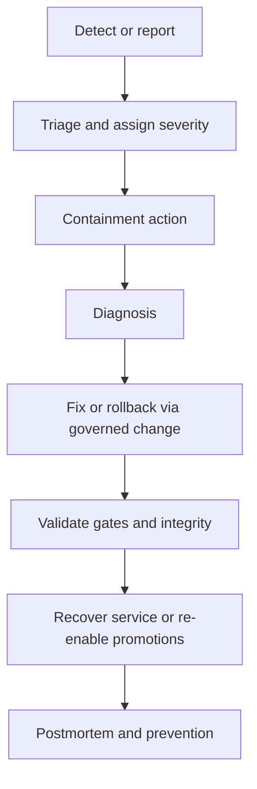

<!-- [KFM_META_BLOCK_V2]
doc_id: kfm://doc/9b642d64-0d5d-4c06-9279-2b99d8f4e8af
title: Incident Response Runbook
type: standard
version: v1
status: draft
owners: [kfm-ops, kfm-security, kfm-data-stewards]
created: 2026-03-04
updated: 2026-03-04
policy_label: restricted
related:
  - docs/governance/ROOT_GOVERNANCE_CHARTER.md
  - docs/runbooks/README.md
  - docs/runbooks/release/PROMOTION.md
  - docs/runbooks/security/SECURITY_RESPONSE.md
tags: [kfm, runbook, incident-response, oncall, governance]
notes:
  - This runbook is fail-closed and evidence-first by default.
  - Replace placeholders (channels, URLs, owners) during GOVERNED onboarding.
[/KFM_META_BLOCK_V2] -->

# Incident Response Runbook
One-line purpose: coordinate a **fast, safe, evidence-first** response to KFM incidents without breaking governance.

---

## Impact (required)
- **Status:** active (process) / draft (this doc)
- **Owners:** `kfm-ops` (primary), `kfm-security`, `kfm-data-stewards`
- **SLOs:** UNKNOWN (define per-service; see “Verification gaps”)
- **Quick links:** [Scope](#scope) · [Severities](#severity-levels) · [Golden checklist](#golden-checklist-first-10-minutes) · [Playbooks](#common-playbooks) · [Postmortem](#postmortem-template)
- **Badges (TODO):** CI · Policy-gate · Uptime · Security

---

## Scope

### Where this fits (repo)
- **Path:** `docs/runbooks/INCIDENT_RESPONSE.md`
- **Upstream:** monitoring/alerts, CI gates, policy engine signals, pipeline receipts
- **Downstream:** status updates, rollback/pause actions, postmortems, corrective PRs

### Acceptable inputs
- Alerts (SLO burn, error spikes, failing checks)
- User reports / support tickets
- CI failures (policy gates, catalog validation, reproducibility tests)
- Provenance anomalies (missing receipts, checksum mismatches, broken cross-links)

### Exclusions (must not go here)
- Security exploitation guidance or “how to attack” details (put only defensive mitigations, redacted as needed)
- Non-incident operational tasks (use standard runbooks)
- Unreviewed production changes (all changes go through governed PRs)

---

## Operating principles (KFM-specific)

These are **non-negotiable** behaviors during incidents:

1. **Trust membrane stays intact**: clients and UI must not bypass governed APIs, and core logic must not bypass repository interfaces to talk directly to storage.  
   - **Status:** CONFIRMED (invariants)
2. **Truth path stays auditable**: RAW→WORK→PROCESSED→CATALOG/LINEAGE→PUBLISHED is the promotion order; recovery must respect zones.  
   - **Status:** CONFIRMED (invariants)
3. **Default-deny / fail-closed**: if policy/rights/citations are unclear, block publishing and reduce scope rather than guessing.  
   - **Status:** CONFIRMED (posture)
4. **Evidence-first UX and Cite-or-abstain**: if you can’t produce resolvable evidence, you must abstain or downgrade the claim.  
   - **Status:** CONFIRMED (contract)
5. **Small, reversible, additive changes**: prefer feature flags, rollbacks, and narrow patches; avoid “big bang” refactors during an incident.  
   - **Status:** PROPOSED (runbook rule)

---

## Severity levels

> Use severity to size response, comms cadence, and required approvals.

| Severity | Label | Examples | Response target | Comms cadence |
|---|---|---|---|---|
| SEV-0 | Safety / Data exposure | Unauthorized access, sensitive leak, trust membrane break | Immediate | Every 30–60 min (or as agreed) |
| SEV-1 | Platform outage | Governed API down, policy engine denies all, PUBLISHED unavailable | Immediate | Hourly |
| SEV-2 | Major degradation | Latency/5xx high, tiles stale, ingestion blocked | < 2 hours | Every 2–4 hours |
| SEV-3 | Localized issue | One dataset pipeline broken, a single UI feature impacted | Same business day | Daily |
| SEV-4 | Minor / noise | Flaky check, non-prod only, docs issue | Planned | As needed |

**Status:** PROPOSED (adapt to org norms).  
**Verification gap:** UNKNOWN current SLO/SLA targets per service.

---

## Roles (ICS-lite)

- **Incident Commander (IC):** owns decisions and timeline; keeps the room small.
- **Comms Lead:** status updates, stakeholder coordination, “what we know” notes.
- **Scribe:** writes the incident log, evidence pointers, timestamps, decisions.
- **Primary Responder (Ops):** executes mitigations (flags, rollbacks, restarts).
- **SMEs:** policy, data pipelines, API, UI, infra—pulled in only when needed.
- **Data Steward / Governance:** required for policy_label changes, redaction decisions, publish/unpublish actions.

**Status:** PROPOSED.

---

## Golden checklist (first 10 minutes)

1. **Declare incident:** open an incident ticket and a single coordination channel.
2. **Assign roles:** IC + Scribe at minimum.
3. **Set severity:** SEV-0..SEV-4.
4. **Stabilize:** stop the bleeding:
   - enable **kill-switch / emergency deny** if policy integrity is in doubt
   - pause promotions/publishing if provenance or license is unclear
5. **Preserve evidence:** capture:
   - alert snapshot + dashboards
   - last good deploy/promotion identifiers
   - last known good receipts / checksums
6. **Establish scope:** who/what is impacted (API/UI/pipeline/dataset) and since when.
7. **Pick a containment plan:** rollback, feature flag, isolate dataset, or block publish.
8. **Communicate:** first status message (internal), include next update time.
9. **Start an incident log:** keep timestamps, decisions, and links.
10. **Do not bypass governance:** no direct DB “fixes” from ad-hoc clients; no manual object edits without receipts and review.

---

## Evidence & audit artifacts (required)

Every incident should produce (at minimum):

- **Incident log:** timeline, decisions, mitigations, and owners.
- **Evidence bundle pointers:** links to relevant receipts, CI runs, logs, dashboards.
- **Run receipt references:** for any recovery/publish actions taken.
- **Policy decisions:** allow/deny + obligation rationale for any exceptions.

**Status:** CONFIRMED intent; implementation details UNKNOWN.

### Minimal incident record (recommended schema)
Store incident records in a predictable place (PROPOSED):

```text
docs/incidents/
  YYYY/
    INC-<id>/
      incident.md
      evidence/
        screenshots/
        logs/
      prov/
        bundle.jsonld
      stac/
        incident.item.json
```

---

## Response flow (end-to-end)



**Status:** PROPOSED.

---

## Containment actions (preferred order)

1. **Feature flag / kill-switch** (fastest, reversible)
2. **Rollback** to last known good build/deploy
3. **Disable promotions/publishing** (block PUBLISHED updates)
4. **Quarantine a dataset** (keep system up; isolate harm)
5. **Scale/restart** (only after evidence capture)

**Status:** PROPOSED.

---

## Validation gates for recovery (do not skip)

Before re-enabling publishing/promotions:

- **Policy gate passes** (OPA/Rego, default-deny posture)
- **Catalog triplet validates** (DCAT/STAC/PROV cross-links intact)
- **Receipts exist** (run receipts + audit references for recovery actions)
- **Checksums match** (no silent mutation)
- **Client path intact** (trust membrane not bypassed)

**Status:** CONFIRMED intent; exact tooling UNKNOWN.

---

## Common playbooks

### 1) Policy engine failure / inconsistent allow-deny (SEV-0/SEV-1)
**Symptoms**
- Unexpected allows, unexpected denies, missing obligations, or policy checks failing open.

**Immediate actions**
- Activate **emergency deny / kill-switch** (fail closed).
- Freeze promotions to PUBLISHED.
- Announce “policy in safe mode” in incident channel.

**Diagnostics**
- Identify last policy change PR and last successful policy CI run.
- Compare policy bundle/manifest versions and hashes.

**Recovery**
- Roll back to last known-good policy bundle.
- Re-run policy tests and contract tests.
- Re-enable promotions only after gates pass.

**Notes**
- If trust membrane is suspected broken, treat as SEV-0 until disproven.

---

### 2) Citation / Evidence resolver failures (SEV-1/SEV-2)
**Symptoms**
- Focus Mode answers cannot cite evidence; evidence drawer links break; bundle resolution fails.

**Immediate actions**
- Degrade to **abstain mode**: return “insufficient evidence” instead of best-effort answers.
- Freeze new Story Node publishing if it depends on broken evidence links.

**Diagnostics**
- Check: missing dataset versions? broken STAC/DCAT/PROV links? receipt store unavailable?
- Confirm whether failure is isolated to one dataset or systemic.

**Recovery**
- Restore missing catalogs/links from last known good artifacts (do not “edit in place”).
- Re-run catalog validators and link checks.
- Backfill receipts if missing (via governed replay), then re-promote.

---

### 3) Pipeline corruption or checksum mismatches (SEV-1/SEV-2)
**Symptoms**
- Artifact digests don’t match recorded checksums; RAW snapshots unexpectedly change.

**Immediate actions**
- Stop the pipeline(s) producing mismatches.
- Quarantine affected outputs; block promotion.
- Preserve evidence: copy receipts, logs, and artifact digests.

**Diagnostics**
- Identify earliest mismatch time and impacted artifacts.
- Verify whether corruption is storage-layer, pipeline bug, or provenance bug.

**Recovery**
- Rebuild PROCESSED artifacts from immutable RAW using pinned specs.
- Re-emit catalogs/receipts; re-run QA thresholds.
- Promote only after validation passes.

---

### 4) Governed API outage (SEV-1)
**Symptoms**
- 5xx spike, timeouts, inability to retrieve PUBLISHED content.

**Immediate actions**
- Identify last deploy; rollback if recent and correlated.
- Scale/restart pods/services **after** evidence capture.
- If partial availability: degrade (read-only mode, disable expensive endpoints).

**Diagnostics**
- Health checks: policy engine reachable, DB projections healthy, caches OK.
- Verify no direct client-to-storage failover was introduced.

**Recovery**
- Restore service; validate key user journeys (map tiles, story load, focus ask).
- Ensure audit logging remains intact.

---

### 5) Suspected data exposure / sensitive output (SEV-0)
**Symptoms**
- Sensitive coordinates exposed, restricted data shown, policy_label ignored.

**Immediate actions**
- Activate emergency deny + take affected surfaces offline (PUBLISHED gate closed).
- Rotate secrets if any possibility of compromise (follow security runbook).
- Preserve logs and access records (least disclosure, preserve chain of custody).

**Diagnostics**
- Confirm what was exposed, to whom, when, and via which API path.
- Verify policy evaluation and redaction obligations.

**Recovery**
- Patch policy and/or redaction pipeline via governed PR.
- Verify with test fixtures that exposure is blocked.
- Document notification obligations (legal/compliance) as applicable.

---

## Communications

### First status update template (internal)
- **What happened:** (1–2 sentences)
- **Impact:** who is affected + what is broken
- **Severity:** SEV-x
- **Current mitigation:** (kill-switch/rollback/pause promotions)
- **Next update:** timestamp
- **Owner:** IC name/handle

### External comms
- **Status:** UNKNOWN (do we have a status page?)
- If applicable: publish minimal facts only; avoid speculation.

---

## Postmortem (required)

### Postmortem template
```markdown
# Postmortem: INC-<id> — <title>

## Summary
- Severity: SEV-x
- Start: <ts>
- End: <ts>
- Customer impact: <who/what>
- Root cause (1 sentence): <cause>

## What happened (timeline)
- <ts> detection
- <ts> containment
- <ts> recovery
- <ts> validation gates passed
- <ts> close

## Evidence
- Alerts/dashboards: <links>
- CI runs: <links>
- Receipts: <paths/ids>
- Catalogs: <paths/ids>
- Policy decisions: <paths/ids>

## Root cause analysis
- Primary cause:
- Contributing factors:
- What worked:
- What didn’t:

## Remediation
- Immediate fixes shipped:
- Follow-ups (PRs/issues) with owners and due dates:

## Prevention
- New/updated tests (policy, contract, reproducibility):
- New monitors/SLOs:
- Runbook improvements:

## Governance outcomes
- Any policy label changes:
- Any redaction obligations added:
- Any exception requests (and decision):
```

**Status:** PROPOSED (content); **Required:** YES.

---

## Verification gaps (make these CONFIRMED)

The following are **UNKNOWN** until you wire them:

- On-call rota and escalation policy
- Alert sources and dashboard URLs
- Where run receipts live and how they’re queried
- Exact “kill-switch” mechanism (file flag vs policy input vs config)
- Status page / external comms channel
- Service-specific SLOs and paging thresholds

**Smallest steps to confirm**
1. Add owners + escalation contact map in `docs/runbooks/ONCALL.md`.
2. Link dashboards in `docs/runbooks/observability/README.md`.
3. Document the kill-switch location and how it’s tested in CI.
4. Create a minimal incident drill and store the artifacts.

---

## Appendix: Emergency deny (kill-switch) contract

> This section is a placeholder to document the **actual** implementation once merged.

- **Status:** PROPOSED
- **Invariant:** When enabled, promotion/publishing must be blocked (fail closed).
- **Required tests:** unit + integration + UI smoke tests proving deny-by-default.

Back to top: [↑](#incident-response-runbook)
