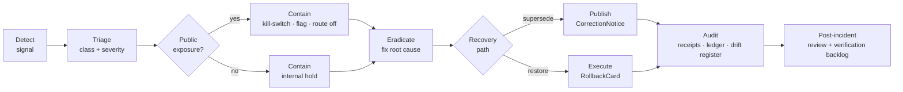

<!-- [KFM_META_BLOCK_V2]
doc_id: kfm://doc/runbook-incident-response
title: Incident Response Runbook
type: standard
version: v1
status: draft
owners: [docs-steward, security-steward, release-steward]
created: 2026-05-12
updated: 2026-05-12
policy_label: restricted
related:
  - docs/runbooks/README.md
  - docs/runbooks/governed_ai_ROLLBACK.md
  - docs/runbooks/ui_ROLLBACK.md
  - docs/security/README.md
  - docs/doctrine/trust-membrane.md
  - docs/doctrine/lifecycle-law.md
  - docs/registers/DRIFT_REGISTER.md
  - docs/registers/VERIFICATION_BACKLOG.md
  - release/rollback_cards/
  - release/correction_notices/
  - control_plane/policy_gate_register.yaml
tags: [kfm, runbook, incident-response, security, rollback, correction, governance]
notes:
  - PROPOSED placement under docs/runbooks/ per Directory Rules §6.1 and the §10.3 instruction that a leaked-secret event must produce "a runbook entry in docs/runbooks/".
  - Directory Rules §6.1 also lists docs/security/ as a home for "incident response"; relationship between the two homes is NEEDS VERIFICATION pending ADR.
  - No repository mounted in this session; specific paths, owners, branches, and tool versions are PROPOSED or NEEDS VERIFICATION.
[/KFM_META_BLOCK_V2] -->

<a id="top"></a>

# Incident Response Runbook

> Governed, fail-closed procedure for detecting, containing, correcting, and rolling back KFM incidents that threaten evidence integrity, sensitivity controls, the trust membrane, or release safety — without bypassing them.

<p>
  
  
  
  
  
  
</p>

| Field | Value |
|---|---|
| **Status** | `draft` — first publication of this runbook; no prior incident rehearsals attached. |
| **Owners** | `docs-steward`, `security-steward`, `release-steward` *(roles; named individuals NEEDS VERIFICATION)* |
| **Last updated** | 2026-05-12 |
| **Policy label** | `restricted` — operational; references to sensitive procedures are non-public. |
| **Authority class** | Operational runbook (`docs/` explains; it does not decide alone). |

> [!IMPORTANT]
> **KFM is never a life-safety authority.** This runbook handles incidents internal to the KFM trust path (data, evidence, publication, AI surfaces, infrastructure exposure). It does **not** instruct the public about hazards, emergencies, or real-world response. Emergency-alert authority lives with NWS, FEMA, state, and local agencies. KFM products that touch hazard or alert data must fail closed if they could be mistaken for life-safety instruction.

---

## Quick jump

- [1. Scope and boundary](#1-scope-and-boundary)
- [2. Roles and separation of duties](#2-roles-and-separation-of-duties)
- [3. Incident classes](#3-incident-classes)
- [4. Severity and SLO targets](#4-severity-and-slo-targets)
- [5. Incident lifecycle](#5-incident-lifecycle)
- [6. Detection signals](#6-detection-signals)
- [7. Triage](#7-triage)
- [8. Containment](#8-containment)
- [9. Eradication and recovery](#9-eradication-and-recovery)
- [10. Post-incident: correction, rollback, audit](#10-post-incident-correction-rollback-audit)
- [11. Specific playbooks](#11-specific-playbooks)
- [12. Communications](#12-communications)
- [13. Related docs](#13-related-docs)
- [Appendix A — Templates](#appendix-a--templates)
- [Appendix B — Verification backlog](#appendix-b--verification-backlog)

---

## 1. Scope and boundary

This runbook covers any event that violates, threatens, or weakens a KFM trust invariant — and any event whose **response** must itself stay inside the trust membrane rather than around it.

In scope:

- Trust-membrane violations (public surface reaching `RAW`, `WORK`, `QUARANTINE`, canonical/internal stores, model runtimes, unpublished candidates, source credentials).
- Sensitivity exposure (archaeology, fauna/flora occurrence, infrastructure, living-person/DNA, culturally sensitive geometry, precise location leaked via tile, vector, 3D, screenshot, popup label, or AI text).
- Evidence-chain failure (`EvidenceRef` fails to resolve at runtime while a public surface still renders content as authoritative).
- Source integrity (mislabeled source role; rights/sovereignty status changed without re-evaluation; stale source published as current).
- Release integrity (release lacks rollback target, manifest mismatch, mutable tag drift, unsigned artifact accepted, kill-switch bypassed, `spec_hash` drift).
- Governed AI failure (uncited or weakly-cited answer; synthetic content presented as observed reality; direct browser-to-model path).
- Operational security (real secret committed to `configs/` or any non-secret store; exposure beyond loopback; admin shortcut used as public path).
- Renderer/map governance (sensitive geometry hidden only by style; unreleased tile load; popup substituting for the Evidence Drawer; uncited export).

Out of scope:

- Real-world emergencies. KFM does not issue alerts; route those to the authoritative agency.
- Routine bug triage with no trust-membrane, evidence, sensitivity, or release implication — handle in normal engineering review.

> [!NOTE]
> **Trust-membrane invariants this runbook protects** (CONFIRMED doctrine across the project corpus):
> `RAW → WORK/QUARANTINE → PROCESSED → CATALOG/TRIPLET → PUBLISHED`; public clients and normal UI surfaces use governed interfaces only; cite-or-abstain; deny-by-default for sensitive classes; promotion is a governed state transition; release decisions carry rollback targets; corrections supersede rather than silently mutate.

[Back to top](#top)

---

## 2. Roles and separation of duties

Separation of policy-significant duties is required for material incidents (CONFIRMED doctrine). The **detector** of an incident should not be the **decider** who publishes the correction or the **releaser** who restores public state.

| Role *(PROPOSED titles; map to your actual on-call rotation)* | Responsibility |
|---|---|
| **Incident Commander (IC)** | Owns the timeline. Coordinates roles. Holds the kill-switch and feature-flag decisions. Writes the post-incident summary. |
| **Security steward** | Owns operational security: secret rotation, exposure, audit, infra posture. |
| **Release steward** | Owns the release path: `ReleaseManifest`, `RollbackCard`, `CorrectionNotice`, public state restoration. |
| **Policy steward** | Owns gate logic: `policy/` rules, `PolicyDecision` outcomes, deny/abstain enforcement. |
| **Subsystem owner(s)** | Owns the affected lane (UI, governed AI, map shell, domain pipeline, source connector, etc.). |
| **Docs steward** | Owns lineage, drift register, verification backlog, runbook updates. |
| **Reviewer (independent)** | Approves the correction/rollback prior to public re-emission when materiality applies. |

> [!IMPORTANT]
> **No single person should detect, decide, release, and audit a material incident.** Where the team is small, the Incident Commander **must not** simultaneously sign the corrected release; another reviewer signs. This is a hard rule, not a preference.

[Back to top](#top)

---

## 3. Incident classes

Defect class drives the correction posture and the rollback posture. The table below is the canonical mapping for KFM — every incident is given a class, and the class determines the recovery path. *(Defect classes CONFIRMED in project corpus; per-class procedures PROPOSED here.)*

| Defect class | Typical trigger | Correction posture | Rollback posture |
|---|---|---|---|
| **Evidence gap** | `EvidenceRef` does not resolve to `EvidenceBundle`; published claim has no support. | `ABSTAIN` on or withdraw the unsupported claim; emit `CorrectionNotice`. | Restore prior evidence-supported release. |
| **Source role** | Modeled output ingested as observation; authority source treated as observation; source-role upcast via paraphrase. | Re-label at `SourceDescriptor`; refuse upcast; re-promote through gates. | Restore prior correctly-labeled release. |
| **Rights** | Source license/sovereignty status changed; unknown rights published. | Withdraw or generalize; record rights re-evaluation in `ReviewRecord`. | Restore prior rights-cleared release. |
| **Sensitivity** | Exact archaeology / fauna / flora / infrastructure / living-person / DNA / culturally sensitive geometry exposed via tile, vector, 3D, screenshot, popup, label, export, or AI text. | Redact / generalize / restrict tier / deny; emit `RedactionReceipt`; supersede with public-safe release. | Restore prior public-safe release; invalidate caches, tiles, exports, screenshots, AI outputs that referenced exposed coordinates. |
| **Geometry** | Invalid GeoJSON; bad CRS; precision claim outside source basis. | Re-validate; correct geometry; supersede. | Restore prior valid-geometry release. |
| **Temporal** | Stale source published as current; valid-time / transaction-time confusion; expired operational context shown as current. | Add stale-state markers; re-promote; supersede with fresh release. | Restore prior fresh release. |
| **Policy** | Policy gate skipped, bypassed, or evaluated incorrectly. | Re-evaluate; record `PolicyDecision`; supersede. | Restore prior policy-cleared release. |
| **Validation** | Schema mismatch; contract drift; closure check passed in error. | Re-run validator; fix schema/contract; supersede. | Restore prior schema-valid release. |
| **Rendering** | Map shell loads unreleased tile, hides sensitive geometry only by style, or treats popup as Evidence Drawer substitute. | Block layer; fix descriptor; supersede. | Disable layer via feature flag; restore prior `LayerManifest`. |
| **API** | Public route reaches `RAW` / `WORK` / `QUARANTINE` / canonical stores; admin shortcut used as public path. | Close route; fix membrane; supersede. | Disable route via feature flag; restore prior route map. |
| **AI output** | Uncited claim emitted; restricted prompt/output leakage; synthetic content presented as observed. | Force `ABSTAIN` or `DENY`; force `RealityBoundaryNote`; revalidate citations; supersede `AIReceipt`. | Disable Focus Mode adapter via kill-switch; restore prior `MockAdapter` baseline. |
| **Operational security** | Real secret committed to `configs/` or repo; exposure beyond loopback; signing key custody loss. | Rotate; revoke; audit access; supersede infra config. | Restore prior secret-free state; rotate forward (no rollback of the rotation itself). |

> [!CAUTION]
> Defect class **operational security** has an asymmetric rollback rule. **You do not roll back a secret rotation.** A leaked secret is a one-way door: the new secret is the floor, and any artifact, log, or cache that contained the old secret is treated as compromised until proven otherwise.

[Back to top](#top)

---

## 4. Severity and SLO targets

Severity is qualitative and reviewer-assigned. Time targets below are **PROPOSED** placeholders — calibrate against actual on-call capacity and record the calibrated values in `control_plane/`.

| Severity | Definition | Acknowledge | Contain | Public correction or rollback |
|---|---|---|---|---|
| **SEV-1** | Public exposure of sensitive geometry or living-person/DNA data; trust-membrane breach with public traffic; signing-key compromise. | ≤ 15 min *(PROPOSED)* | ≤ 1 hr *(PROPOSED)* | ≤ 24 hr *(PROPOSED)* |
| **SEV-2** | Uncited or wrongly-attributed public claim; rights/source-role mislabel published; release missing rollback target. | ≤ 1 hr *(PROPOSED)* | ≤ 4 hr *(PROPOSED)* | ≤ 72 hr *(PROPOSED)* |
| **SEV-3** | Non-public drift, validator gap, policy fixture stale, internal exposure with no public traffic. | ≤ 1 business day *(PROPOSED)* | ≤ 5 business days *(PROPOSED)* | Next release *(PROPOSED)* |
| **SEV-4** | Near-miss; preventive note; documentation drift only. | ≤ 5 business days *(PROPOSED)* | n/a | Optional. |

> [!WARNING]
> If severity is **uncertain**, treat the incident as the **higher** severity. Fail-closed applies to severity assignment as it applies to publication.

[Back to top](#top)

---

## 5. Incident lifecycle

The lifecycle below mirrors KFM's lifecycle law: nothing exits a phase without the required artifacts and a recorded decision.



Every transition between phases must leave a receipt. A phase is closed only when (i) required artifacts exist, (ii) every required artifact **resolves** the artifacts it depends on (`EvidenceRef` → `EvidenceBundle`, `source_id` → `SourceDescriptor`, `model_id` → `ModelRunReceipt`), and (iii) the policy gate evaluated and recorded its decision. Missing any of these means the transition **fails closed** and the prior state is preserved.

[Back to top](#top)

---

## 6. Detection signals

Detection is a multi-source problem. No single channel is authoritative; treat any of the following as an admissible signal until ruled out.

- **Automated checks failing** — schema validation, OPA/Rego gates on `run_manifest.json`, Cosign/Rekor attestation lookups, `spec_hash` reproducibility checks, kill-switch fixture, STAC/DCAT/PROV acceptance harness.
- **Cite-or-abstain violations** — Focus Mode `AIReceipt` showing `ANSWER` outcome without resolved citations; `EvidenceDrawerPayload` rendered without a resolvable `EvidenceBundle`.
- **Policy denial bypassed** — `PolicyDecision` records absent for an action that should have hit a gate; admin route used in a public-facing flow.
- **Source-head drift** — ETag / Last-Modified change on a fetched source without a new `RunReceipt`; rights field changed upstream.
- **Renderer breach indicators** — `addSource` / `addLayer` against an asset lacking `LayerManifest`, `TileArtifactManifest`, valid release state, or rights field; sensitive geometry rendered without `RedactionReceipt`.
- **External report** — researcher, steward, community member, or downstream consumer flags an issue. Treat these with the same weight as automated checks.
- **Secret-scanning hit** — repo, CI logs, container image, or backup found to contain a real credential.
- **Audit-ledger anomaly** — append-only ledger shows missing or out-of-order events; rollback executed without `RollbackCard`; release without rollback target.

> [!TIP]
> Detection signals should be wired into the **same** check-rollup that gates promotion (PROPOSED: a Checks API rollup that blocks merge until receipts verify). The incident commander should never be the only listener.

[Back to top](#top)

---

## 7. Triage

Triage assigns four things and nothing else:

1. **Class** — pick from §3.
2. **Severity** — pick from §4 (fail-closed: pick higher when uncertain).
3. **Affected surfaces** — public clients, normal UI, governed API, AI surface, exports, screenshots, downstream derivatives (graphs, vector indexes, scenes, story snapshots, tiles, caches).
4. **Containment plan** — feature flag off, route disable, layer block, kill-switch file, secret rotation, or "internal hold; no public action needed."

<details>
<summary><strong>Triage worksheet (copy and fill)</strong></summary>

```text
incident_id:             # short slug, e.g. inc-2026-05-12-001
detected_at:             # ISO 8601 UTC
detected_by:             # role or person
detection_signal:        # which check, who reported, what tipped it
class:                   # one of §3
severity:                # one of §4 (escalate on uncertainty)
public_exposure:         # yes | no | unknown
affected_surfaces:       # list
affected_releases:       # release_id(s) implicated
affected_downstream:     # graphs / tiles / scenes / exports / AI outputs
known_evidence_refs:     # EvidenceBundle ids in play
known_source_refs:       # SourceDescriptor ids in play
proposed_containment:    # flag off / route off / layer block / kill-switch / rotation
ic:                      # incident commander
witnesses:               # who else has eyes on it
notes:                   # free text, signed and timed
```
</details>

[Back to top](#top)

---

## 8. Containment

Containment is **deny-by-default, fail-closed**. The right move is the one that stops the exposure or claim from being treated as authoritative, even if it stops legitimate traffic along with it. Restoring legitimate function is the next phase, not this one.

### 8.1 Containment levers

| Lever | When to use | Reversibility |
|---|---|---|
| **Kill-switch file** *(PROPOSED mechanism per ML-063-005)* | SEV-1; release or promotion path must fail closed across the board. | Reversible by removing the file after the underlying defect is fixed. |
| **Feature flag off** | UI route, panel, Focus Mode, Story Mode, Export, or a layer should disappear from public clients without changing API contracts. | Fully reversible. |
| **Layer block / `LayerManifest` deny** | A specific layer or tile artifact must stop loading. | Reversible via layer registry; emits a `LayerManifest` revision. |
| **Route disable** | A governed API route is breaching the membrane. | Reversible via route map revision; old client builds may show `ERROR`. |
| **AI adapter swap to `MockAdapter`** | Live provider is emitting uncited or restricted content. | Reversible after citation validation and policy gate review pass. |
| **Cache / CDN purge** | Sensitive tile, PMTiles, COG, vector tile, or 3D asset has been served. | Forward-only for the purged copy; new release supersedes. |
| **Secret rotation** | Real credential exposed. | **One-way** — never roll back the rotation. |
| **Public surface withdrawal** | Released claim is unsupported and supersede is not yet ready. | Reversible by emitting a superseding release. |

### 8.2 Containment rules

> [!IMPORTANT]
> Containment **must not** open a new untrusted path. Disabling the governed API route in favor of a "temporary direct read" against canonical stores is **not** containment — it is a second incident on top of the first. The trust membrane forbids any public client, any normal UI surface, and any released AI surface from reaching `RAW`, `WORK`, `QUARANTINE`, canonical/internal stores, graph internals, vector indexes, source APIs, or direct model runtimes during an incident.

> [!CAUTION]
> Style-only hiding is **not** containment for sensitive geometry. If sensitive coordinates were exposed via vector tile, COG, or 3D asset, the tile/COG/asset itself must be withdrawn or replaced with a public-safe derivative. Hiding a layer with a style filter leaves the geometry in the artifact.

[Back to top](#top)

---

## 9. Eradication and recovery

Eradication is fixing the root cause. Recovery is restoring a safe public state through the **same governed release path** the original publication used — never a hidden file copy, never a direct write to `data/published/`, never a hand-edit of a canonical record.

### 9.1 Recovery decision

Two paths, picked by defect class:

- **Supersede (forward-fix correction).** Publish a new release that supersedes the defective one. Required when the right answer differs from the old answer (e.g., evidence updated, source role corrected, rights re-evaluated, sensitivity generalized).
- **Rollback (restore prior).** Restore the most recent prior safe release. Required when the new release introduced the defect and the prior release was safe (e.g., release missing rollback target, broken `LayerManifest`, adapter regression).

Both paths emit auditable artifacts; both paths must invalidate downstream derivatives.

### 9.2 Closure rules

The transition from "fixed" to "publicly safe" is closed only when:

1. The defect's root cause is removed from `RAW` / `WORK` / `PROCESSED` / `CATALOG` as far upstream as the class requires.
2. A `ValidationReport` records the re-run of every gate the defect bypassed or failed.
3. A `PolicyDecision` records the explicit re-evaluation outcome.
4. A `ReviewRecord` is attached when materiality applies and is signed by a reviewer **distinct from the author** of the corrected content.
5. A `ReleaseManifest` is emitted (forward correction) or restored (rollback) — never silently swapped.
6. A `CorrectionNotice` lists invalidated derivatives (graphs, vector indexes, scenes, story snapshots, exports, AI outputs, downstream tiles).
7. A `RollbackCard` is recorded when rollback is the path, including the targeted prior release and the reason.
8. Caches, CDN copies, OCI tags, and signed manifests pointing to the defective release are purged or redirected.
9. Re-publication uses immutable digests, not mutable tags.
10. The audit ledger has a coherent record across the full lifecycle of the incident.

> [!NOTE]
> Operational thresholds in any quarantine rules used during containment must be labeled explicitly (`policy_basis = operational_threshold` vs `scientific_basis = source-derived observation`) to prevent accidental regulatory interpretation or scientific overclaim.

[Back to top](#top)

---

## 10. Post-incident: correction, rollback, audit

The post-incident step is where the incident becomes legible to KFM's governance plane. Three artifacts are mandatory; a fourth is conditional.

| Artifact | When | What it records |
|---|---|---|
| **`CorrectionNotice`** | Public claim was wrong, has been corrected, or has been withdrawn. | `claim_ref`, `prior_release_ref`, `change_summary`, `invalidates[]`, `review_ref`, `time`. |
| **`RollbackCard`** | Rollback path was chosen. | `release_id`, `rollback_to`, `reason`, `invalidates[]`, `review_ref`, `time`. |
| **Audit-ledger entry** | Always. | Detect → triage → contain → eradicate → recover → close, with timestamps and signatures. |
| **`RealityBoundaryNote`** | AI surface, synthetic carrier, or reconstructed scene was implicated. | `scope`, `method_summary`, `evidence_refs[]`, `visibility`. |

Register updates after every material incident:

- `docs/registers/DRIFT_REGISTER.md` — defect class, surface, defect type, fix reference.
- `docs/registers/VERIFICATION_BACKLOG.md` — anything left as NEEDS VERIFICATION, including gate coverage gaps.
- `control_plane/contradiction_register.yaml` — if the incident revealed a doctrine/implementation conflict.
- `control_plane/deprecation_register.yaml` — if a sunset was required.

> [!IMPORTANT]
> A correction is **not** complete until downstream derivatives are invalidated. Graphs, vector indexes, embeddings, scene caches, story snapshots, exports, screenshots, and AI summaries that referenced the defective content are all derivatives. Re-publishing the correction without listing the invalidations is a documented anti-pattern.

[Back to top](#top)

---

## 11. Specific playbooks

Each playbook below is a short, runnable procedure for one common defect class. They are deliberately compact. All paths inside them are PROPOSED until a mounted repository confirms them.

<details>
<summary><strong>11.1 Leaked secret in <code>configs/</code> or repo</strong></summary>

**Trigger.** Secret-scanning hit, accidental commit, screenshot leak, log-leak, or a real secret found under `configs/dev/`, `configs/test/`, or any non-secret store. Directory Rules §10.3 names this case explicitly.

**Class.** Operational security. **Severity.** SEV-1 if production; SEV-2 if local-only; assume SEV-1 until proven local.

1. **Rotate the secret at the issuing system first** — before touching the repo, before opening a PR. The new secret is the floor.
2. **Revoke the old secret.** Confirm revocation; verify the old credential no longer authenticates.
3. **Audit access logs** for the window between secret creation and revocation. Record any access in the incident timeline.
4. **Purge from repo history** if committed. `git filter-repo` or equivalent; force-push the rewritten history; coordinate with anyone with local clones.
5. **Purge from caches** — CI artifact stores, container layers, backup snapshots, logs, build caches.
6. **Open a `CorrectionNotice`** if any artifact derived from the leak was published.
7. **Update `docs/registers/DRIFT_REGISTER.md`** with the leak class and fix.
8. **Add a runbook update** if the leak class is new.
9. **Verify**: secret scanning re-run is clean; new secret in environment store; audit logs preserved.

> [!CAUTION]
> Do not roll back the rotation. Do not "temporarily" restore the old secret to avoid disruption. The window of exposure is the window where the old secret existed; reducing that window is the priority that overrides convenience.
</details>

<details>
<summary><strong>11.2 Sensitive geometry exposed via public tile, export, or AI text</strong></summary>

**Trigger.** Exact archaeology / fauna / flora / infrastructure / living-person / DNA / culturally sensitive geometry served via PMTiles, COG, MVT, MLT, 3D Tiles, screenshot, story export, popup label, or AI answer.

**Class.** Sensitivity. **Severity.** SEV-1.

1. **Withdraw the asset** at the layer level — kill-switch / feature flag / `LayerManifest` deny. Do not rely on style hiding.
2. **Purge caches** — CDN, OCI tags pointing to the defective digest, browser-side cached tiles where reachable.
3. **Invalidate AI outputs and exports** that referenced the coordinates. List them in the `CorrectionNotice`.
4. **Generate a public-safe derivative** — generalization (H3, geohash bucket, county/HUC aggregation), redaction, or restricted-tier reassignment. Emit a `RedactionReceipt`.
5. **Re-validate the new artifact** — schema, geometry, sensitivity, rights, release state.
6. **Publish the superseding release** with the public-safe derivative and an attached `RealityBoundaryNote` if any synthetic representation was used in mitigation.
7. **Record review** — independent reviewer (cultural review for archaeology and culturally sensitive content; species/locality review for fauna/flora).
8. **Update `docs/registers/DRIFT_REGISTER.md`** with the surface that leaked (tile / vector / 3D / screenshot / export / AI text).

> [!WARNING]
> Style-only hiding is not redaction. If the geometry was in the artifact, the artifact must be replaced.
</details>

<details>
<summary><strong>11.3 Uncited or weakly-cited AI answer reached a public surface</strong></summary>

**Trigger.** Focus Mode emitted `ANSWER` without resolved citations; `AIReceipt` shows missing citation validation; synthetic content presented as observed reality.

**Class.** AI output. **Severity.** SEV-2 (escalate to SEV-1 if the answer touched sensitivity, rights, or life-safety-adjacent content).

1. **Disable the live adapter via kill-switch.** Swap to `MockAdapter` if Focus Mode must remain on for non-public testing; otherwise feature-flag the Focus route off.
2. **Force `ABSTAIN` or `DENY`** for any retry of the affected question class until citation validation is verified.
3. **Audit the `AIReceipt` window** — sample answers from the period the defect was active; identify any that should also be withdrawn or corrected.
4. **Attach a `RealityBoundaryNote`** if synthetic content was presented as observed.
5. **Publish a `CorrectionNotice`** for each material answer that reached a public surface.
6. **Re-validate citation validation** — fixtures pass; negative fixtures (uncited / weakly-cited / unsupported) still `DENY` or `ABSTAIN`.
7. **Restore the live adapter** only after the policy precheck/postcheck contract is re-verified end-to-end.

> [!IMPORTANT]
> AI is interpretive, not the root truth source. Restoration of the AI surface comes **after** evidence, policy, citation validation, and finite response envelopes pass — never before.
</details>

<details>
<summary><strong>11.4 Release published without a rollback target, or with a mutable tag</strong></summary>

**Trigger.** OPA/Rego policy on `release_manifest` denied missing `rollback`, but a release got through; release references a moving symbolic tag instead of an immutable digest; `spec_hash` mismatch between manifest and run receipt.

**Class.** Release integrity. **Severity.** SEV-2.

1. **Hold further promotions** via kill-switch.
2. **Locate the prior safe release** — verify digests, manifests, signatures, `EvidenceBundle` resolution, policy state.
3. **Execute `RollbackCard`** referencing the prior safe release as the rollback target.
4. **Emit rollback attestation** — every map/release rollback emits its own attestation.
5. **Re-emit the corrected release** with an immutable digest reference, a complete `ReleaseManifest`, and a rollback target.
6. **Verify** `spec_hash` reproducibility, signature presence, STAC/DCAT/PROV validation, and check-rollup blocking until receipts verify.
7. **Update `docs/registers/DRIFT_REGISTER.md`** with the release integrity failure mode and fix.
</details>

<details>
<summary><strong>11.5 Public client reached <code>RAW</code> / <code>WORK</code> / <code>QUARANTINE</code> or a canonical store</strong></summary>

**Trigger.** Route audit reveals an `apps/explorer-web/`-equivalent fetch that bypassed `apps/governed-api/` (or the actual governed-API path); admin route used as the normal public path; direct model endpoint reachable from the browser.

**Class.** API / trust-membrane breach. **Severity.** SEV-1.

1. **Disable the offending route via feature flag.** If the route is unauthenticated and reachable from the public internet, also block at the reverse proxy.
2. **Audit logs** for the exposure window — count requests, identify whether sensitive content was actually returned.
3. **Patch the membrane** — route through the governed API, restore the policy gate, restore the `EvidenceBundle` resolution step.
4. **Re-validate** with no-public-raw-path and no-unreleased-tile fixture tests.
5. **Emit a `CorrectionNotice`** if sensitive content was returned.
6. **ADR** if the route's existence implied a doctrine gap; record in `docs/adr/`.
</details>

<details>
<summary><strong>11.6 Source rights or sovereignty changed upstream</strong></summary>

**Trigger.** Source publisher changed license, withdrew permission, or updated sovereignty/CARE terms after KFM had published derived content.

**Class.** Rights. **Severity.** SEV-2.

1. **Hold further releases derived from the source.**
2. **Withdraw or generalize** existing derived public artifacts. Sensitivity-class derivations may require full withdrawal.
3. **Update `SourceDescriptor`** with the new rights state.
4. **Re-run the `ValidationReport`** and `PolicyDecision` against the new rights.
5. **Emit a `CorrectionNotice`** listing invalidated derivatives.
6. **Document** in `docs/sources/` and `control_plane/source_authority_register.yaml`.
</details>

<details>
<summary><strong>11.7 Source role collapse (modeled treated as observed)</strong></summary>

**Trigger.** A modeled or analytical product was ingested or paraphrased into an observation-class claim. Often surfaced by source-role anti-collapse validators.

**Class.** Source role. **Severity.** SEV-2.

1. **Restore correct source role** at `SourceDescriptor`. Source role is fixed at admission; never upgraded by promotion.
2. **Withdraw any claim** that treats the modeled product as observed.
3. **AI surface check** — ban list of upcasting phrases; sample `AIReceipt` records for paraphrase-based upcasts.
4. **Re-publish** with correct role labeling and an explicit caveat in the Evidence Drawer.
5. **Emit `CorrectionNotice`** for material public claims.
</details>

[Back to top](#top)

---

## 12. Communications

Communication is part of the trust posture. The principle is: **the public correction must be as visible as the original claim, and no more.**

| Audience | Channel *(PROPOSED)* | What to share | What to withhold |
|---|---|---|---|
| Public consumers of the affected surface | Public-facing `CorrectionNotice`, status page, or in-product banner. | What changed, when, and why; how to find the corrected version; how to report related concerns. | Restricted geometry, secret material, exact source paths to sensitive content, internal route names. |
| Affected source publishers and stewards | Direct contact via established channel. | What was misused; what has been withdrawn; what review is in progress. | Internal stack details unless required. |
| Downstream consumers (data partners, AI surfaces, exports) | Machine-readable `CorrectionNotice` referenced in their feed. | Invalidated derivative list; rollback/correction release IDs; new digest references. | n/a. |
| Internal team | Incident timeline + post-incident review. | Everything material to learning. | Avoid blame language; focus on system change. |
| Regulators or rights-holders | Only when required by class (e.g., living-person/DNA exposure, cultural sensitivity breach). | Material facts, mitigation, timeline. | Speculation; uncertain attribution. |

> [!NOTE]
> KFM does not act as an emergency-alert channel. Hazard or alert content that prompted the incident must be referred back to its authoritative source (NWS, FEMA, state/local agency). KFM's communication describes its **own** correction, not the underlying real-world event.

[Back to top](#top)

---

## 13. Related docs

*(Targets are PROPOSED until the repository is mounted and verified.)*

- `docs/runbooks/README.md` — runbook index. *(TODO link target)*
- `docs/runbooks/governed_ai_ROLLBACK.md` — AI adapter rollback and kill switch. *(TODO link target)*
- `docs/runbooks/ui_ROLLBACK.md` — UI feature-flag and schema deprecation steps. *(TODO link target)*
- `docs/security/README.md` — threat model and exposure posture. *(TODO link target)*
- `docs/doctrine/trust-membrane.md` — invariants this runbook protects. *(TODO link target)*
- `docs/doctrine/lifecycle-law.md` — phase-by-phase governance. *(TODO link target)*
- `docs/registers/DRIFT_REGISTER.md` — running record of drift entries. *(TODO link target)*
- `docs/registers/VERIFICATION_BACKLOG.md` — open verification items. *(TODO link target)*
- `release/rollback_cards/` — `RollbackCard` instances. *(TODO link target)*
- `release/correction_notices/` — `CorrectionNotice` instances. *(TODO link target)*
- `control_plane/policy_gate_register.yaml` — gate inventory and outcomes. *(TODO link target)*

[Back to top](#top)

---

## Appendix A — Templates

<details>
<summary><strong>A.1 <code>CorrectionNotice</code> field skeleton (PROPOSED)</strong></summary>

```text
object_type:        CorrectionNotice
claim_ref:          # reference to the corrected claim
prior_release_ref:  # release_id that contained the defect
change_summary:     # what changed and why (public-safe text)
invalidates:        # list of derivative artifact refs (graphs, exports, scenes, AI outputs)
review_ref:         # ReviewRecord id; reviewer distinct from author when material
time:               # ISO 8601 UTC
notice_visibility:  # public | restricted
```
</details>

<details>
<summary><strong>A.2 <code>RollbackCard</code> field skeleton (PROPOSED)</strong></summary>

```text
object_type:    RollbackCard
release_id:     # the defective release being rolled back
rollback_to:    # the prior safe release_id
reason:         # short text; class + brief cause
invalidates:    # derivative artifact refs affected
review_ref:     # ReviewRecord id
time:           # ISO 8601 UTC
```
</details>

<details>
<summary><strong>A.3 Post-incident review skeleton (PROPOSED)</strong></summary>

```text
incident_id:
summary:                  # one paragraph, public-safe where possible
class:                    # §3
severity:                 # §4
timeline:                 # detect → contain → eradicate → recover → close, with timestamps
artifacts:                # CorrectionNotice / RollbackCard / RedactionReceipt / RealityBoundaryNote ids
detection_assessment:     # what worked, what missed
containment_assessment:   # what worked, what missed
recovery_assessment:      # what worked, what missed
gate_gaps:                # validator / policy / receipt gaps revealed
register_updates:         # DRIFT_REGISTER / VERIFICATION_BACKLOG entries opened
followups:                # owned, dated
```
</details>

<details>
<summary><strong>A.4 Incident timeline format (PROPOSED)</strong></summary>

```text
HH:MM UTC  ROLE  event
HH:MM UTC  IC    Triage: class=<...>, severity=<...>, exposure=<yes|no>
HH:MM UTC  ...   Containment lever engaged: <flag|route|layer|kill-switch|rotation>
HH:MM UTC  ...   ValidationReport re-run: PASS|FAIL on <gate>
HH:MM UTC  ...   ReviewRecord signed by <role>
HH:MM UTC  ...   ReleaseManifest <id> superseded by <id>  OR  RollbackCard <id> executed
HH:MM UTC  IC    Close: registers updated, public state verified
```
</details>

[Back to top](#top)

---

## Appendix B — Verification backlog

Items below are NEEDS VERIFICATION and should be resolved as the repository is inspected and as the runbook is exercised.

- Confirm whether the runbook home is `docs/runbooks/INCIDENT_RESPONSE.md` (this file) **and** a peer page lives at `docs/security/incident-response.md`, or whether `docs/security/` redirects here. Directory Rules §6.1 lists both candidate homes.
- Confirm severity time targets in §4 against actual on-call capacity; record in `control_plane/`.
- Confirm the exact kill-switch mechanism for KFM's release pipeline (PROPOSED to mirror ML-063-005 kill-switch file).
- Confirm whether `release/rollback_cards/` and `release/correction_notices/` exist as the canonical homes (PROPOSED).
- Confirm the named individuals behind each role; placeholders used here.
- Confirm the public correction surface (status page, in-product banner, public `CorrectionNotice` feed).
- Confirm rights-change detection cadence across third-party sources (CONFIRMED gap in the v1.0 risk register).
- Confirm AI surface paraphrase-detection coverage and ban-list maintenance.
- Confirm cross-surface lint coverage for sensitivity leaks via popup labels, exports, screenshots, and AI text (CONFIRMED gap in the v1.0 risk register).

[Back to top](#top)

---

**Related:** [Runbooks index](#13-related-docs) · [Trust membrane doctrine](#13-related-docs) · [Lifecycle law](#13-related-docs) · [Drift register](#13-related-docs)

**Last updated:** 2026-05-12 · **[Back to top](#top)**
