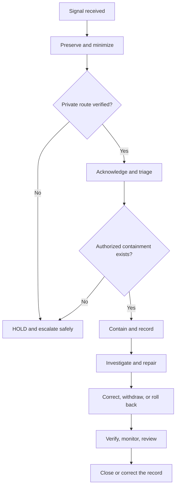

<!-- [KFM_META_BLOCK_V2]
doc_id: kfm://doc/runbook-incident-response
title: Incident Response — Restricted Operational Readiness Runbook
type: runbook
version: v2.0
status: draft; repository-grounded; RESTRICTED_OPERATIONAL_LANE; LIVE_RESPONSE_HELD; NON_RELEASE; NON_PUBLICATION
owners:
  - docs steward — NEEDS VERIFICATION
  - security steward — NEEDS VERIFICATION
  - release steward — NEEDS VERIFICATION
created: 2026-05-12
updated: 2026-09-01
owning_root: docs/
policy_label: restricted; incident-operations; fail-closed; non-publishing
responsibility: restricted human procedure for classifying, preserving, containing, correcting, withdrawing, rolling back, reviewing, and rehearsing KFM trust incidents without creating operational authority, public disclosure authority, or release authority
truth_posture: CONFIRMED repository paths and bounded validators / PROPOSED public-to-restricted handoff and accountable role split / NEEDS VERIFICATION private intake, named responders, live containment mechanisms, custody system, response objectives, disclosure route, and operational exercise
related:
  - docs/runbooks/README.md
  - docs/security/README.md
  - docs/security/INCIDENT_RESPONSE.md
  - docs/security/incident-response-handoff-decision.md
  - docs/doctrine/trust-membrane.md
  - docs/doctrine/lifecycle-law.md
  - docs/governance/ESCALATION.md
  - docs/governance/SEPARATION_OF_DUTIES.md
  - release/correction_notices/README.md
  - release/rollback_cards/README.md
  - release/withdrawal_notices/README.md
notes:
  - "Evidence snapshot: bartytime4life/Kansas-Frontier-Matrix main at 0ec8a69e2a35ef8b52d696bdc553ea17b2f35be8; previous target blob 33d364c98f88f94b78e401298a0970e7dec2cbb9; zero open pull requests at initial inspection; final overlap review found only PR #4018 on seven path-disjoint archaeology files."
  - "The repository tracks two incident-response documents. Current indexes describe this file as the restricted operational lane and docs/security/INCIDENT_RESPONSE.md as public security guidance, but the handoff decision remains proposed and accountable acceptance is unverified."
  - "This file contains no private contact, on-call roster, credential, endpoint, exploit detail, harmful coordinate, real incident evidence, or live containment command."
  - "A validator pass, synthetic exercise, correction candidate, withdrawal candidate, rollback candidate, workflow result, pull-request state, or documentation merge does not prove containment, approval, recovery, release, deployment, or publication."
[/KFM_META_BLOCK_V2] -->

<a id="top"></a>

# Incident Response — Restricted Operational Readiness Runbook

Use this runbook to coordinate a KFM trust incident without improvising around
the trust membrane, destroying evidence, exposing restricted details, or
mistaking a documentation procedure for operational authority.

> [!IMPORTANT]
> **Current capability is readiness and rehearsal, not a verified live-response
> system.** The repository does not establish a current private intake route,
> named on-call roster, production disablement command, evidence-custody store,
> response-time commitment, or operational exercise. Apply only an independently
> authorized containment control. Otherwise preserve evidence, reduce further
> mutation, return `HOLD`, and escalate through the verified review route.

> [!CAUTION]
> Never put a credential, token, private endpoint, exploit detail, unredacted
> log, living-person record, protected community material, exact harmful
> coordinate, or restricted incident payload in a public issue, pull request,
> commit, workflow log, chat, Notion page, or this runbook.

**Quick navigation:** [scope](#1-scope-and-boundary) ·
[roles](#2-roles-and-separation-of-duties) ·
[classes](#3-incident-classes) · [severity](#4-severity-and-slo-targets) ·
[lifecycle](#5-incident-lifecycle) · [signals](#6-detection-signals) ·
[triage](#7-triage) · [containment](#8-containment) ·
[recovery](#9-eradication-and-recovery) ·
[post-incident](#10-post-incident-correction-rollback-audit) ·
[playbooks](#11-specific-playbooks) · [communications](#12-communications) ·
[references](#13-related-docs) · [templates](#appendix-a--templates) ·
[readiness](#appendix-b--verification-backlog)

<a id="1-scope-and-boundary"></a>

## 1. Scope and boundary

This runbook covers incidents that threaten KFM's evidence integrity,
sensitivity controls, source or rights posture, repository controls, release
integrity, correction lineage, or public trust membrane. It is a human
coordination and readiness document. It does not declare that an incident
occurred, grant access, authorize containment, or operate infrastructure.

### The two incident-response surfaces

| Surface | Current repository description | Boundary |
|---|---|---|
| [`docs/security/INCIDENT_RESPONSE.md`](../security/INCIDENT_RESPONSE.md) | Public security guidance and doctrine-facing expectations | Must not expose private routing, tactical procedure, credentials, endpoints, or restricted evidence |
| This runbook | Restricted human-operational lane | Must not invent private capability, disclose restricted material through Git history, or replace accepted contracts, policy, review, or release authority |
| [Handoff decision packet](../security/incident-response-handoff-decision.md) | Proposed `ACCEPT_SPLIT` decision | Still `PROPOSED`; merging or linking it does not accept the split or assign accountable owners |

Use the conservative applicable requirements from both tracked documents while
the handoff remains unaccepted. Do not rename, consolidate, retire, or declare
either file canonical through this runbook.

### In scope

- suspected public access to non-public lifecycle material;
- sensitive or harmful-precision exposure in data, tiles, exports, screenshots,
  logs, reports, search, or generated text;
- unsupported, wrongly attributed, rights-uncertain, or stale public claims;
- source-role, validation, policy, review, manifest, signature, or rollback
  failures that could affect governed state;
- leaked or suspected credentials, tokens, signing material, or private routes;
- unauthorized repository-state transitions, branch or pull-request mutation,
  settings drift, workflow bypass, or provenance loss;
- correction, withdrawal, rollback, or invalidation gaps; and
- near misses or synthetic exercises that reveal a control gap.

### Out of scope

- public emergency instructions or life-safety interpretation;
- vulnerability disclosure through a public issue or pull request;
- real credential rotation, host isolation, route changes, cache purge,
  deployment, withdrawal, rollback, or public notice without separate authority;
- destructive evidence cleanup or unilateral history rewrite; and
- routine defects with no trust, sensitivity, security, evidence, or public
  consequence.

KFM is not an emergency-alerting authority. Refer the public to the appropriate
official authority where a KFM surface could be mistaken for current safety
guidance.

<a id="2-roles-and-separation-of-duties"></a>

## 2. Roles and separation of duties

The role names below describe required functions, not verified staffing. Record
the accountable person or authorized system privately for each incident. A
CODEOWNERS route, commit author, repository owner, bot, passing workflow, or PR
review is not by itself an incident assignment or operational approval.

| Function | Minimum responsibility | Must not assume |
|---|---|---|
| Reporter or detector | Preserve the signal and use the approved private route | Incident status, severity, containment authority, or public disclosure authority |
| Incident lead | Maintain scope, timeline, decisions, owners, and finite state | Release, evidence-custody, or independent-review authority unless separately assigned |
| Security responder | Coordinate access, credential, forensic, and infrastructure handling | Permission to publish restricted evidence or silently rewrite history |
| Evidence custodian | Preserve originals, hashes, access history, and references | That a repository or coordination page is an approved restricted evidence store |
| Affected-surface owner | Explain the system and prepare a bounded repair | Authority to approve their own material correction or restoration |
| Privacy, rights, sensitivity, or sovereignty reviewer | Decide handling obligations within accepted scope | Technical containment or release authority |
| Correction or release authority | Decide correction, withdrawal, rollback, invalidation, and safe restoration | That a valid candidate or green check authorizes execution |
| Independent reviewer | Review material decisions and closure evidence | Responsibility already held as author, responder, or releaser without recorded exception |
| Communications owner | Approve public-safe status and correction language | Permission to expose restricted facts or claim unverified impact |

Emergency action is limited to an already authorized control that only reduces
exposure. Record the actor, exact action, scope, time, expiry or reversal
condition, and independent review requirement. Do not improvise a new public or
administrative path during an incident.

<a id="3-incident-classes"></a>

## 3. Incident classes

Classification chooses the next review route; it does not prove impact.

| Class | Examples | Fail-closed direction |
|---|---|---|
| Trust-membrane | Public path reaches RAW, WORK, QUARANTINE, internal receipts, private source, or direct model/runtime surface | Stop further exposure through an authorized control; preserve request and route evidence |
| Sensitive disclosure | Exact protected location, living-person or DNA detail, private-land linkage, sacred or culturally sensitive material, harmful infrastructure detail | Restrict evidence; stop the affected carrier; do not repeat the detail in coordination systems |
| Evidence or claim integrity | Missing support, broken evidence reference, unsupported claim, synthetic material presented as observed | `ABSTAIN`, withdraw, or hold the affected claim pending evidence and correction review |
| Source, rights, or sovereignty | Wrong source role, changed terms, unknown redistribution, community or consent duty unresolved | Hold use and downstream release; obtain accountable review |
| Validation or policy | Schema, validator, policy, review, or closure gate bypassed or mis-evaluated | Hold affected transitions; reproduce safely; do not weaken the gate |
| Release or public-state | Manifest, proof, signature, alias, rollback target, cache, or public carrier inconsistent | Preserve current safe state or request authorized containment; prepare correction, withdrawal, or rollback candidate |
| Credential or access | Secret, token, key, protected endpoint, unauthorized access, or custody uncertainty | Use the approved private route; rotate or revoke only through the issuing authority |
| Repository control | Unauthorized ready, merge, branch, ruleset, workflow, release, deployment, or identity transition | Stop further task mutations; preserve event chronology and exact SHAs; contain the controlling client through an authorized account/security path |
| Availability or integrity loss | Corruption, deletion, unavailability, dependency compromise, or unexplained output drift | Preserve state and evidence; hold promotion or restoration until target and authority are verified |
| Near miss or exercise | Synthetic scenario or safely contained event revealing a gap | Record limited result and corrective work; do not claim live readiness |

One event may have several classes. Record each without collapsing technical,
policy, lifecycle, privacy, and communications outcomes into one status.

<a id="4-severity-and-slo-targets"></a>

## 4. Severity and response priorities

The repository does not establish accepted incident SLAs or SLOs. Do not copy
fictional acknowledgement or containment times into an incident record. Until
accountable targets are accepted, use priority without a clock promise:

| Priority | Condition | Immediate posture |
|---|---|---|
| Critical | Active or plausibly active public sensitive disclosure, credential/key compromise, uncontrolled trust-membrane access, or unauthorized production/repository transition | Escalate immediately through the approved private route; apply only authorized exposure-reducing containment |
| High | Material public claim, rights, evidence, policy, release, or integrity failure with bounded or uncertain active exposure | Hold affected public use and assemble accountable containment/correction review |
| Moderate | Non-public control failure, reproducible validator gap, or integrity uncertainty with no evidence of public exposure | Preserve evidence, prevent promotion, and prioritize bounded repair |
| Low | Near miss, documentation drift, or synthetic exercise finding | Track corrective action and verify closure proportionally |

When impact or exposure is unknown, use the more protective priority and label
the uncertainty. Replace these priorities only through an accountable decision
that also defines staffing, intake, escalation, and measurement.

<a id="5-incident-lifecycle"></a>

## 5. Incident lifecycle


```mermaid
flowchart TD
    A["Signal received"] --> B["Preserve and minimize"]
    B --> C{"Private route verified?"}
    C -- "No" --> D["HOLD and escalate safely"]
    C -- "Yes" --> E["Acknowledge and triage"]
    E --> F{"Authorized containment exists?"}
    F -- "No" --> D
    F -- "Yes" --> G["Contain and record"]
    G --> H["Investigate and repair"]
    H --> I["Correct, withdraw, or roll back"]
    I --> J["Verify, monitor, review"]
    J --> K["Close or correct the record"]
```

Suggested coordination states follow the proposed handoff packet:
`REPORTED`, `ACKNOWLEDGED`, `TRIAGED`, `TRANSFERRED`, `ACTIVE`,
`MONITORING`, `CLOSED`, `CORRECTED`, `ABSTAIN`, `ACCESS_DENIED`, and
`STALE_RUNBOOK`. They are human coordination labels only. They do not authorize
containment, disclosure, lifecycle transition, release, deployment, or
publication.

Closure requires a traceable record of the original signal, impact and
uncertainty, authorized containment, investigation, correction or rollback,
downstream invalidation, validation, independent review, monitoring, and any
remaining work. A silent edit is not closure.

<a id="6-detection-signals"></a>

## 6. Detection signals

Treat a credible report as an admissible signal, not as proof or noise. Signals
may include:

- a security, secret, dependency, policy, schema, topology, or release check;
- a public response, layer, export, screenshot, report, or generated answer
  containing unsupported or restricted material;
- missing or inconsistent source head, evidence, receipt, manifest, signature,
  review, rollback, correction, or withdrawal references;
- unexpected GitHub events, actor identity, draft/ready/merge state, workflow
  execution, settings, deployment, or branch movement;
- a source, rights, consent, privacy, sensitivity, or community-steward report;
- unexplained digest, byte, timestamp, alias, cache, or public-state drift; or
- an external researcher or user report.

Do not paste the raw signal into a public coordination surface. Record a
minimized description and a restricted evidence reference. If the private route
is unverified, preserve the original locally under approved handling and record
`ACCESS_DENIED` or `STALE_RUNBOOK` without spreading the payload.

<a id="7-triage"></a>

## 7. Triage

### Step 1 — Freeze the evidence boundary

Record the exact time, observing actor or system, repository commit or release
identity, affected carrier, current public state, and how the signal was
received. Preserve originals read-only where the approved custody system
permits. Hash files before analysis. Do not normalize, redact, crop, or rename
the only copy.

### Step 2 — Minimize coordination data

Across the public/restricted seam, share only a report ID, receipt time,
public-safe affected-surface label, unconfirmed priority, evidence-reference
identifier, handling label, and accountable role identifiers. Keep payloads,
logs, credentials, personal data, exact coordinates, screenshots, exploit
detail, vendor material, and tactical steps restricted.

### Step 3 — State facts and unknowns separately

Record:

- observed facts and their evidence references;
- inference or hypothesis;
- public exposure as `YES`, `NO`, or `UNKNOWN`;
- affected source, data, code, workflow, release, and derivative identities;
- incident classes and response priority;
- owners and authority still missing; and
- the next action that reduces risk without destroying evidence.

### Step 4 — Choose a finite disposition

| Disposition | Meaning |
|---|---|
| `HOLD` | Evidence, authority, custody, target, rights, sensitivity, review, or operational mechanism is incomplete |
| `ESCALATE` | Competent authority or restricted handling is required |
| `ABSTAIN` | Evidence is insufficient to classify or communicate further |
| `DENY` | Requested exposure, release, access, or transition is forbidden |
| `ERROR` | Tooling or operational failure prevents a trustworthy result |
| `READY_FOR_AUTHORIZED_CONTAINMENT_REVIEW` | Scope, evidence references, owner, action, rollback/expiry, and review route are assembled; execution is still separate |

<a id="8-containment"></a>

## 8. Containment

Containment is an authorized action that reduces exposure while preserving
evidence and correction paths. This runbook may identify the need; it does not
create the control or authority.

### 8.1 Containment decision matrix

| Signal | Safe request | Do not do |
|---|---|---|
| Sensitive carrier exposed | Disable or withdraw the entire affected carrier through its authorized owner; request cache and derivative invalidation | Hide only by CSS, style, popup filtering, or AI disclaimer |
| Unsupported public claim | Hold or withdraw the affected claim and its derivatives | Quietly edit history or replace evidence after the fact |
| Credential or key suspected | Rotate/revoke through the issuing authority; preserve access/audit evidence | Test the credential in chat, issue, PR, or unapproved environment; roll back a completed rotation |
| Public route crosses membrane | Disable the affected route through an approved mechanism | Add a temporary direct read from internal stores |
| Repository-control transition | Stop further task mutations; capture timeline, actor, SHAs, events, reviews, checks, and settings evidence | Open duplicate repair PRs, merge, revert, delete branches, or change rulesets without separate authority |
| Corrupt or unavailable artifact | Hold promotion and identify the last verified safe target | Copy a file into `PUBLISHED` or rewrite receipts |
| AI or generated-output leak | Disable the affected public adapter or surface through an authorized control; invalidate outputs | Treat a prompt note as containment or rewrite the only receipt |

### 8.2 Evidence-preserving rules

1. Do not delete the original evidence or the only affected artifact.
2. Do not force-push, rewrite shared history, purge logs, rotate away audit
   access, or delete public evidence without an approved preservation and
   notification plan.
3. For a committed secret, rotate and revoke first. Treat repository-history
   cleanup as a separate authorized security operation coordinated with clone,
   cache, artifact, and backup owners.
4. Record exact actions, actors, timestamps, targets, observed results, and
   non-effects. Preserve failed attempts.
5. Keep emergency containment narrow, reversible where possible, time-bounded,
   and subject to independent review before permanence or re-expansion.
6. Do not restore service through a path that bypasses evidence, policy,
   sensitivity, review, or the trust membrane.

<a id="9-eradication-and-recovery"></a>

## 9. Eradication and recovery

Root-cause repair and public recovery are separate decisions. A code fix does
not restore a public surface. Choose the public-state path using evidence and
accountable authority:

| Path | Use when | Required review evidence |
|---|---|---|
| Forward correction | A safe replacement can supersede the defective claim or artifact | Correction scope, impact assessment, propagation/invalidation plan, validation, review, release target |
| Withdrawal | The affected public material must be removed and no safe replacement is ready | Withdrawal scope, reason, affected derivatives, public-safe notice, review, monitoring |
| Rollback | A known prior release is proven safer and can be restored coherently | Exact prior target, compatibility, invalidations, rollback candidate, validation, review, read-back |
| Continue containment | No safe recovery target or authority is established | Current containment, remaining exposure, owner, next review, monitoring |

Never move a file backward through lifecycle directories and call it rollback.
Never edit RAW or a historical receipt to make the incident disappear. A new
correction, withdrawal, or rollback record supersedes the prior state while
preserving lineage.

### Bounded repository validation

The repository provides no-network validators for candidate record families.
They validate shapes and semantic checks only; they do not execute recovery:

```bash
python tools/validators/correction/validate_correction_notice.py --fixtures
python tools/validators/correction/validate_correction_propagation_plan.py --fixtures
python tools/validators/release/validate_withdrawal_notice.py --fixtures
python tools/validators/release/validate_rollback_card.py --fixtures
```

Focused regression tests:

```bash
python -m pytest \
  tests/validators/test_validate_correction_notice.py \
  tests/validators/test_validate_correction_propagation_plan.py \
  tests/validators/test_validate_withdrawal_notice.py \
  tests/validators/test_validate_rollback_card.py \
  -q --strict-config --strict-markers
```

Run from an exact commit in an isolated Python environment with the root test
dependencies installed. Record the command, revision, environment, exit code,
and output. A pass proves only the assertions reached by that command.

<a id="10-post-incident-correction-rollback-audit"></a>

## 10. Post-incident: correction, rollback, audit

Before closure, reconcile the applicable record families without claiming that
one substitutes for another:

| Record | Purpose | Repository surface |
|---|---|---|
| Incident chronology | What was observed, decided, attempted, and verified | Approved restricted custody system — **NEEDS VERIFICATION** |
| Correction notice candidate | Describe a forward correction without executing it | [`contracts/correction/correction_notice.md`](../../contracts/correction/correction_notice.md) and [`release/correction_notices/`](../../release/correction_notices/README.md) |
| Correction impact assessment | Bound affected carriers, claims, releases, and derivatives | [`contracts/correction/correction_impact_assessment.md`](../../contracts/correction/correction_impact_assessment.md) |
| Propagation plan | Track invalidation and rebuild obligations | [`contracts/correction/correction_propagation_plan.md`](../../contracts/correction/correction_propagation_plan.md) |
| Withdrawal notice candidate | Describe public withdrawal and affected scope | [`contracts/release/withdrawal_notice.md`](../../contracts/release/withdrawal_notice.md) |
| Rollback card candidate | Bind exact target and rollback assertions | [`contracts/release/rollback_card.md`](../../contracts/release/rollback_card.md) and [`release/rollback_cards/`](../../release/rollback_cards/README.md) |
| Review and release evidence | Separate approval, execution, read-back, and public status | Owning review and release surfaces; operational binding **NEEDS VERIFICATION** |

Update the drift or verification registers only with public-safe facts. Do not
use a docs register as the restricted evidence store. When a prior public status
or incident statement was wrong, append a correction with the original and
superseding evidence; do not silently overwrite it.

Closure must state which downstream carriers were searched: catalog records,
graphs, indexes, embeddings, tiles, COGs, scenes, caches, reports, exports,
screenshots, story snapshots, generated answers, logs, mirrors, packages, and
dependent releases. Unknown coverage remains open work.

<a id="11-specific-playbooks"></a>

## 11. Specific playbooks

### 11.1 Suspected credential or signing-key exposure

1. Stop repeating or testing the value.
2. Use the approved private security route; if unverified, record
   `ACCESS_DENIED` and escalate without copying the value.
3. Through the issuing authority, rotate or revoke the affected credential.
4. Preserve creation, access, use, rotation, and revocation evidence.
5. Inventory repository history, forks, clones, CI logs, artifacts, caches,
   images, backups, screenshots, and vendor systems that may contain it.
6. Plan any history rewrite or deletion separately with evidence preservation,
   consumer coordination, public disclosure review, and rollback.
7. Add a safe regression check without encoding the real value.

Never roll back a completed secret rotation.

### 11.2 Sensitive geometry or protected detail exposed

1. Do not quote, screenshot, or map the detail in public coordination.
2. Identify every carrier, derivative, cache, export, generated answer, and
   downstream consumer.
3. Request authorized carrier-level containment. Style-only hiding is not
   containment when the bytes still contain the detail.
4. Route to the competent privacy, cultural, community, species, land, or
   infrastructure reviewer.
5. Prepare withdrawal or a public-safe generalized/redacted correction.
6. Verify that the original is no longer public and the restricted evidence is
   retained only under approved handling.

### 11.3 Unsupported or misleading public claim

1. Bind the exact claim, release, evidence reference, and public carriers.
2. Hold or withdraw the claim; do not replace the support silently.
3. Identify source-role, evidence, temporal, rights, or generated-language
   cause.
4. Prepare correction impact and propagation candidates.
5. Revalidate the replacement and obtain independent review before restoration.

### 11.4 Unauthorized repository ready, merge, deployment, or settings change

1. Stop new branch, PR, review, merge, revert, release, or settings mutations
   from the affected task.
2. Capture current default-branch SHA, target branch/head, event timeline,
   actor identity as reported by GitHub, reviews, checks, deployments, rulesets,
   and affected files.
3. Distinguish direct tool actions from external integration or
   owner-credentialed events; do not guess the client or session.
4. Preserve the landed state. Decide forward repair, revert, or no change only
   after introduced-versus-inherited validation and accountable review.
5. Contain or revoke the responsible client/session through an independently
   authorized account-security path.
6. Correct GitHub and Notion status records with timestamps and exact SHAs.

### 11.5 Public route, layer, export, or generated surface crosses the membrane

1. Identify the exact route and carrier without querying restricted content
   through the public path.
2. Request the narrowest authorized control that stops exposure.
3. Preserve request, response, configuration, release, and provenance evidence.
4. Repair the boundary through the governed interface; do not install a
   temporary internal-store shortcut.
5. Validate denial and no-leak behavior with synthetic public-safe fixtures.
6. Restore only through separately reviewed release and read-back evidence.

<a id="12-communications"></a>

## 12. Communications

No private reporting route or status channel is verified by this document.
Communications must use the route approved for the affected system and data
class.

| Audience | Public-safe content | Withhold unless explicitly approved |
|---|---|---|
| Responders | Report ID, role assignment, minimized scope, evidence references, handling labels, decisions, timestamps | Payloads outside the restricted custody system |
| Repository contributors | Affected path or workflow, safe stop, review owner, next action | Credentials, exploit detail, private endpoints, sensitive evidence |
| Data or community stewards | Applicable source, rights, consent, sovereignty, sensitivity, or harmful-precision question | Unnecessary personal, cultural, or location detail |
| Public users | Confirmed affected service or claim, safe action, correction/withdrawal status, authoritative alternatives | Speculation, internal topology, exploit detail, identities, restricted evidence |
| Vendors or authorities | Minimum necessary scope through the approved route | Unrelated KFM or third-party material |

Every external statement must distinguish observed fact, inference, unknown,
current containment, and next update. Do not claim `RESOLVED`, `SAFE`,
`CONTAINED`, or `NO IMPACT` without evidence and accountable approval.

<a id="13-related-docs"></a>

## 13. Related docs

- [Runbooks index](./README.md)
- [Security root](../security/README.md)
- [Public security incident guidance](../security/INCIDENT_RESPONSE.md)
- [Proposed public/restricted handoff decision](../security/incident-response-handoff-decision.md)
- [Threat model](../security/THREAT_MODEL.md)
- [Exposure plan](../security/EXPOSURE_PLAN.md)
- [Secrets guidance](../security/SECRETS.md)
- [Escalation guide](../governance/ESCALATION.md)
- [Separation of duties](../governance/SEPARATION_OF_DUTIES.md)
- [Trust membrane](../doctrine/trust-membrane.md)
- [Lifecycle law](../doctrine/lifecycle-law.md)
- [UI rollback](./ui_ROLLBACK.md)
- [Correction notices](../../release/correction_notices/README.md)
- [Withdrawal notices](../../release/withdrawal_notices/README.md)
- [Rollback cards](../../release/rollback_cards/README.md)

<a id="appendix-a--templates"></a>

## Appendix A — Templates

### A.1 Public-safe handoff record

```yaml
report_id: "incident-candidate-YYYYMMDD-NNN"
recorded_at: "YYYY-MM-DDTHH:MM:SSZ"
state: "REPORTED"
priority: "UNKNOWN"
public_exposure: "UNKNOWN"
affected_surface: "public-safe label only"
evidence_refs:
  - "restricted-ref:identifier"
handling_label: "RESTRICTED"
accountable_roles:
  incident_lead: "OWNER_TBD"
  evidence_custodian: "OWNER_TBD"
next_action: "verify private route and assign triage"
non_effects:
  - "no containment or public-state change claimed"
```

Do not add a real payload, credential, private endpoint, personal identifier,
exact coordinate, or exploit detail to this projection.

### A.2 Decision log entry

```text
time_utc:
actor_role:
observed_fact:
evidence_ref:
decision:
authority_basis:
action_requested_or_taken:
observed_result:
unknowns:
next_review:
```

### A.3 Closure review

- [ ] Original signal and immutable references are preserved.
- [ ] Public exposure and affected scope are evidenced, not assumed.
- [ ] Every response action has actor, authority, target, time, and result.
- [ ] Failed attempts and external side effects remain visible.
- [ ] Root cause and control gap are separated from symptoms.
- [ ] Correction, withdrawal, rollback, and invalidation decisions are explicit.
- [ ] Downstream carriers and consumers were searched or remain listed unknown.
- [ ] Independent review and public communications approval are recorded.
- [ ] Regression validation covers the failure without using restricted data.
- [ ] Remaining risks, monitoring, owners, and dates are open and honest.
- [ ] Closure did not delete or silently rewrite incident history.

<a id="appendix-b--verification-backlog"></a>

## Appendix B — Verification backlog

A live operational runbook is not ready until all applicable items are closed:

- [ ] Accept or supersede the proposed public/restricted handoff decision.
- [ ] Name accountable owners for public guidance, restricted operations,
      private intake, incident lead, evidence custody, communications,
      privacy/rights/sensitivity, vendors, correction, withdrawal, and rollback.
- [ ] Verify the private intake route and access-denied fallback without placing
      private details in public Git history.
- [ ] Define accepted priority and response objectives with staffing and
      measurement evidence.
- [ ] Register authorized containment mechanisms for each deployed carrier,
      including expiry, rollback, and independent review.
- [ ] Establish an approved restricted evidence-custody, retention, redaction,
      access, legal-hold, and disposal procedure.
- [ ] Bind correction, withdrawal, rollback, invalidation, release, and public
      read-back to accountable roles and executable evidence.
- [ ] Test denial, no-leak, cache, tile/export, generated-output, repository-
      control, secret, and unavailable-runbook scenarios with synthetic data.
- [ ] Perform a public-to-restricted handoff exercise and a recovery exercise;
      record exact scope, failures, and non-effects.
- [ ] Verify public communications, correction, and vulnerability-disclosure
      routes and their review requirements.
- [ ] Add staleness review after owner, route, platform, policy, source,
      sensitivity, release, or incident changes.

Until then, this runbook supports classification, evidence-preserving
readiness, bounded candidate validation, and synthetic tabletop work only. It
does not prove operational containment or safe public recovery.

[Back to top](#top)
