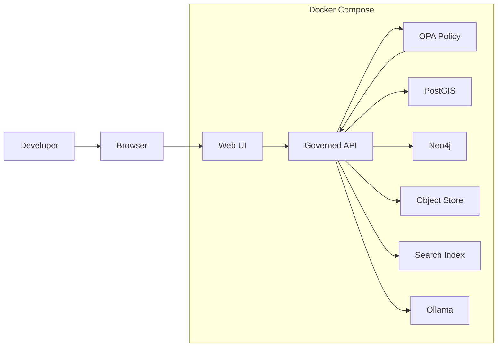

<!-- [KFM_META_BLOCK_V2]
doc_id: kfm://doc/9d0a8d7e-2d2d-4c04-9e21-3c2a74aa9e7b
title: Local Stack Runbook
type: standard
version: v1
status: draft
owners: [TODO: add GitHub team]
created: 2026-03-04
updated: 2026-03-04
policy_label: public
related: [../../README.md, ../architecture/system_overview.md, ../../apps/api, ../../apps/web, ../../infra, ../../policy]
tags: [kfm, runbook, local-stack, docker, compose, fastapi, react, postgis, neo4j, opa, ollama]
notes: ["Local developer stack orchestration, verification, and troubleshooting."]
[/KFM_META_BLOCK_V2] -->

# Local Stack Runbook
Run KFM locally (datastores + governed API + web UI + policy engine + optional Ollama) using Docker Compose, and verify the “API-only” governance boundary.

> **Status:** experimental  
> **Owners:** TODO  
> **Badges:**     
> **Quick links:** [Scope](#scope) • [Quickstart](#quickstart) • [Service matrix](#service-matrix) • [Verification](#verification) • [Troubleshooting](#troubleshooting) • [Reset](#resetting-the-stack) • [DoD](#definition-of-done)

> **Evidence tags used in this runbook**
> - **CONFIRMED** = explicitly supported by current KFM design docs.
> - **PROPOSED** = recommended default; validate in your checkout.
> - **UNKNOWN** = repo-specific detail not verified here; follow the “How to confirm” note.

---

## Scope
**CONFIRMED:** KFM is designed as a pipeline → catalog/provenance → databases → governed API → UI system, and the UI must not connect directly to databases.  
This runbook covers running that architecture **locally** (single machine) and checking the boundary holds.

### Where it fits in the repo
- **Path:** `docs/runbooks/LOCAL_STACK.md`
- **Upstream:** `infra/` (compose + container wiring), `policy/` (OPA/Rego), `apps/api/` (FastAPI), `apps/web/` (React UI)
- **Downstream:** local development and smoke testing; NOT production deployment.

### Acceptable inputs
- Local development machine (Docker + Compose).
- Local `.env` file containing *non-secret* dev configuration.
- **Public or synthetic** sample data for local testing.

### Exclusions
- Production deployment (Kubernetes/Helm/etc.).
- Committing secrets into the repo.
- Bypassing governance: **no direct UI→DB connections**, no “quick inserts” into DB without catalog/provenance gates.

---

## Local architecture overview



> **CAUTION (invariant): API boundary**
> - The **UI must never directly touch databases**. All reads/writes must go through the governed API (which enforces validation + policy).  
> - If you find the UI configured with a direct DB connection string, treat it as a bug.

---

## Prerequisites
- **CONFIRMED:** Docker + Docker Compose installed.
- **PROPOSED:** `make` (optional), Node.js (for UI dev), Python (for API dev), enough Docker RAM for DB containers.

---

## Service matrix

> **How to read this table**
> - Ports are “**typical defaults**.” If your compose file maps different ports, follow the compose file as truth.

| Component | Purpose | Typical host ports | Data persistence | Health/UX check |
|---|---|---:|---|---|
| PostGIS | Spatial relational store | **CONFIRMED:** `5432` | Docker volume | `psql` connect / migrations |
| Neo4j | Graph store | **CONFIRMED:** `7474` (UI), `7687` (bolt) | Docker volume | Open Neo4j Browser |
| Governed API (FastAPI) | Only supported entrypoint for UI and tools | **CONFIRMED:** `8000` | N/A | Swagger at `/docs` |
| Web UI (React) | Map/Story UI | **CONFIRMED:** `3000` | N/A | Browser loads UI |
| OPA (policy) | Runtime policy decisions (allow/deny + obligations) | **PROPOSED:** `8181` | N/A | Policy query endpoint |
| Object store (e.g., MinIO) | Raw/processed artifact storage | **PROPOSED:** `9000` / `9001` | Docker volume | Console / bucket listing |
| Search index (e.g., OpenSearch/Elastic) | Text/vector search acceleration | **PROPOSED:** `9200` | Docker volume | Cluster health endpoint |
| Ollama | Local LLM service for Focus Mode | **CONFIRMED:** `11434` | Model cache volume | `ollama list` / API ping |

---

## Quickstart

### 1) Find the compose entrypoint (repo-specific)
**UNKNOWN:** The exact compose path varies by repo layout.

Run this from repo root:

```bash
# Find candidate compose files
find . -maxdepth 5 -type f \( -iname "docker-compose.yml" -o -iname "docker-compose.yaml" -o -iname "*compose*.yml" -o -iname "*compose*.yaml" \)

# Quick peek for likely entrypoints
grep -R --line-number "services:" -n ./infra ./ops . 2>/dev/null | head
```

> If you find multiple compose files (e.g., `infra/local/...` vs `ops/executors/...`), choose the one that includes **PostGIS + Neo4j + API + Web** for the full app stack.

### 2) Create your local environment file
**CONFIRMED:** KFM local dev expects a `.env`-style configuration for containers.  
**PROPOSED/UNKNOWN:** the repo provides `.env.example` or similar template.

```bash
# If a template exists, copy it
cp .env.example .env 2>/dev/null || true
cp .env.template .env 2>/dev/null || true

# Otherwise, create .env manually
test -f .env || printf "" > .env
```

Minimum variables you may see (names can vary):

```env
# Database
POSTGRES_USER=postgres
POSTGRES_PASSWORD=postgres
POSTGRES_DB=kfm

# Neo4j
NEO4J_AUTH=neo4j/password

# API -> Ollama
OLLAMA_API_URL=http://localhost:11434
OLLAMA_MODEL=llama3
```

> **IMPORTANT:** Do not commit `.env`. Keep secrets out of git.

### 3) Start the stack
**UNKNOWN:** replace `<compose-file>` with the compose file you found.

```bash
docker compose -f <compose-file> up -d --build
docker compose -f <compose-file> ps
```

### 4) Open the local UIs
- API docs: `http://localhost:8000/docs`
- Web UI: `http://localhost:3000`
- Neo4j Browser: `http://localhost:7474`

### 5) (Optional) Enable Focus Mode with Ollama

#### Option A — Run Ollama on host (outside Docker)
```bash
# Install ollama per your OS, then:
ollama pull llama3
ollama serve
```

Confirm it is listening:
```bash
curl -sS http://localhost:11434/api/tags | head
```

#### Option B — Run Ollama in Compose
If your compose includes an `ollama` service, your API may need:

```env
OLLAMA_API_URL=http://ollama:11434
```

---

## Verification

### Container health
```bash
docker compose -f <compose-file> ps
docker compose -f <compose-file> logs --tail=100 api
docker compose -f <compose-file> logs --tail=100 web
```

### API smoke checks
```bash
# Swagger should load in browser
# or test a basic endpoint if present:
curl -sS http://localhost:8000/ | head
```

> **PROPOSED:** If the API exposes `/health`, use it:
> ```bash
> curl -sS http://localhost:8000/health
> ```

### Governance boundary check
**CONFIRMED invariant:** the UI should only talk to the API, not directly to DBs.

Practical check:
- In browser devtools → Network tab, confirm calls are going to `http://localhost:8000/...` (or your API port), not `5432`, `7474`, `7687`, etc.
- If you see DB ports in the browser, treat as a defect.

---

## Common workflows

### Run a management/pipeline command inside the API container
**CONFIRMED pattern:** use `docker compose exec` for one-off tasks.

```bash
docker compose -f <compose-file> exec api bash
# then run your command (examples only):
python -m pytest -q
python -m your_pipeline_module --help
```

### View Neo4j contents
```bash
# Neo4j Browser UI
open http://localhost:7474
```

---

## Troubleshooting

### Port conflicts (Postgres, Neo4j, API, Web)
**CONFIRMED:** If something is already bound to `5432`, `7474`, `8000`, or `3000`, Compose will fail to start or containers will crash-loop.

Fix:
1. Stop the conflicting local service, **or**
2. Change compose port mappings (e.g., map container `5432` → host `15432`), **then**
3. Restart:

```bash
docker compose -f <compose-file> down
docker compose -f <compose-file> up -d --build
```

### Dependency readiness / race conditions
**CONFIRMED:** Sometimes starting again after initial bring-up helps (or ensure `depends_on` is correctly configured).

```bash
docker compose -f <compose-file> up -d
docker compose -f <compose-file> logs --tail=200
```

### Docker resource limits
**CONFIRMED:** Large datasets can exhaust Docker memory; increase Docker Desktop resources if containers are slow or killed.

### File permissions on mounted volumes (macOS/Windows)
**CONFIRMED:** Mounted volume permissions can break writes to `data/` or other bind mounts. Ensure mapped directories are writable.

### Frontend hot reload not working
**CONFIRMED:** If the `web/src` mount is misconfigured (common path issues), the container won’t see changes. Verify the compose bind mount.

---

## Resetting the stack

### Stop without deleting data
```bash
docker compose -f <compose-file> down
```

### Stop and delete volumes (DANGEROUS: deletes local DB data)
```bash
docker compose -f <compose-file> down -v
```

### Clean up dangling images (optional)
```bash
docker image prune -f
```

---

## Security and governance notes
- **CONFIRMED:** KFM is designed to be policy-governed and evidence-first.
- **CONFIRMED (AI):** Focus Mode should be sandboxed, with input filtering upstream and output checks downstream (e.g., via OPA), and should “cite or abstain.”

> **WARNING:** Don’t test with restricted/private datasets unless you’ve confirmed your policy configuration and redaction behavior locally.

---

## Definition of Done
- [ ] `docker compose ps` shows core services running (PostGIS, Neo4j, API, Web).
- [ ] Swagger loads at `http://localhost:8000/docs`.
- [ ] Web UI loads at `http://localhost:3000`.
- [ ] Neo4j UI loads at `http://localhost:7474`.
- [ ] **API boundary holds:** browser traffic goes to API only (no UI→DB connections).
- [ ] (Optional) Ollama reachable on `http://localhost:11434` and Focus Mode requests succeed.
- [ ] (Optional) Policy checks deny disallowed requests (fail-closed).

---

## Appendix

<details>
<summary>Sample (pseudocode) docker-compose skeleton</summary>

```yaml
# PSEUDOCODE ONLY — adapt to your repo and images
services:
  postgis:
    image: postgis/postgis:16-3.4
    ports: ["5432:5432"]
    environment:
      POSTGRES_USER: ${POSTGRES_USER}
      POSTGRES_PASSWORD: ${POSTGRES_PASSWORD}
      POSTGRES_DB: ${POSTGRES_DB}

  neo4j:
    image: neo4j:5
    ports: ["7474:7474", "7687:7687"]
    environment:
      NEO4J_AUTH: ${NEO4J_AUTH}

  opa:
    image: openpolicyagent/opa:latest
    ports: ["8181:8181"]
    command: ["run", "--server", "/policies"]

  ollama:
    image: ollama/ollama:latest
    ports: ["11434:11434"]

  api:
    build: ./apps/api
    ports: ["8000:8000"]
    depends_on: [postgis, neo4j, opa, ollama]
    environment:
      OLLAMA_API_URL: ${OLLAMA_API_URL}

  web:
    build: ./apps/web
    ports: ["3000:3000"]
    depends_on: [api]
```
</details>

<details>
<summary>Sample local .env (safe defaults)</summary>

```env
POSTGRES_USER=postgres
POSTGRES_PASSWORD=postgres
POSTGRES_DB=kfm

NEO4J_AUTH=neo4j/password

OLLAMA_API_URL=http://localhost:11434
OLLAMA_MODEL=llama3
```
</details>

---

_Back to top:_ [Local Stack Runbook](#local-stack-runbook)
