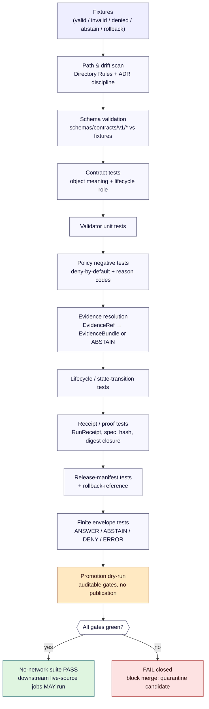

<!-- [KFM_META_BLOCK_V2]
doc_id: kfm://doc/runbook-no-network-test
title: No-Network Test Runbook
type: standard
version: v1
status: draft
owners: <Docs steward + Validation subsystem owner — NEEDS VERIFICATION>
created: 2026-05-12
updated: 2026-05-12
policy_label: public
related:
  - docs/runbooks/README.md
  - docs/runbooks/ui_VALIDATION.md
  - docs/runbooks/governed_ai_VALIDATION.md
  - docs/adr/ADR-0001-schema-home.md
  - directory-rules.md
  - contracts/OBJECT_MAP.md
  - schemas/contracts/v1/
  - tests/runtime_proof/
  - fixtures/
tags: [kfm, runbook, testing, ci, no-network, fail-closed, fixtures, governance]
notes:
  - "Defines the no-network test discipline that is the FIRST KFM CI pipeline."
  - "Repo-shape claims (commands, paths, workflow names) are PROPOSED until repo mount verifies."
  - "Sensitive-lane fixtures MUST be public-safe transforms — never real coordinates, DNA, or living-person records."
[/KFM_META_BLOCK_V2] -->

# 🌐 No-Network Test Runbook

> The deterministic, fixture-only, fail-closed test discipline that proves the KFM trust spine **before** any live source, network endpoint, or runtime is touched.

<!-- Badges: placeholder targets until CI workflow names and dashboards are verified -->


| | |
|---|---|
| **Status** | Draft (under review) |
| **Owners** | `<Docs steward + Validation subsystem owner — NEEDS VERIFICATION>` |
| **Last updated** | 2026-05-12 |
| **Authority of doctrine in this doc** | **CONFIRMED** — supported by BLD-GREEN, BLD-COMP, IMPL-PIPE, ENCY, WUI/GAI, and ML-063-057 |
| **Authority of any concrete path / command / workflow name** | **PROPOSED** until mounted-repo evidence confirms |
| **Companion docs** | [`docs/runbooks/ui_VALIDATION.md`](./ui_VALIDATION.md) · [`docs/runbooks/governed_ai_VALIDATION.md`](./governed_ai_VALIDATION.md) · [`directory-rules.md`](../../directory-rules.md) |

---

## 🧭 Quick jump

- [1 · Purpose & scope](#1--purpose--scope)
- [2 · What "no-network" means in KFM](#2--what-no-network-means-in-kfm)
- [3 · Doctrinal basis](#3--doctrinal-basis)
- [4 · Pre-requisites](#4--pre-requisites)
- [5 · Run flow (diagram)](#5--run-flow-diagram)
- [6 · Test classes](#6--test-classes)
- [7 · Fixture taxonomy](#7--fixture-taxonomy)
- [8 · The run sequence](#8--the-run-sequence)
- [9 · Network egress posture](#9--network-egress-posture)
- [10 · Sensitive-lane handling](#10--sensitive-lane-handling)
- [11 · Anti-patterns](#11--anti-patterns)
- [12 · Failure triage](#12--failure-triage)
- [13 · Verification backlog](#13--verification-backlog)
- [14 · Related docs](#14--related-docs)
- [Appendix A · Illustrative commands and stubs](#appendix-a--illustrative-commands-and-stubs)
- [Appendix B · KFM terminology used in this doc](#appendix-b--kfm-terminology-used-in-this-doc)

---

## 1 · Purpose & scope

KFM's first CI pipeline is **no-network by default**. This runbook tells contributors and reviewers how to design, execute, and audit that pipeline so that the trust spine — source admission, lifecycle state, validation, evidence resolution, policy decision, catalog/proof closure, release decision, governed API envelope, correction, and rollback — is provable **without any live source, network endpoint, model runtime, or runtime store**.

**In scope**

- The minimum no-network test discipline that every KFM PR must satisfy before any live-source or runtime test is permitted to run.
- The fixture taxonomy that proves both positive and negative outcomes.
- How a watcher / connector / promotion gate proves itself via **dry-run receipts** rather than live fetches.
- How sensitive-lane fixtures are transformed before they enter `tests/` or `fixtures/`.

**Out of scope**

- Live-source connector exercises, external endpoint smoke tests, package-version checks, runtime smoke tests, and any deployment surface. These belong in **separate, opt-in, source-activated jobs**, *after* this no-network suite is green. **CONFIRMED doctrine** (see §3); concrete job names are PROPOSED.
- UI accessibility, e2e, and visual-trust runs — covered by [`docs/runbooks/ui_VALIDATION.md`](./ui_VALIDATION.md) (PROPOSED CREATE).
- Governed AI / Focus Mode adapter validation — covered by [`docs/runbooks/governed_ai_VALIDATION.md`](./governed_ai_VALIDATION.md) (PROPOSED CREATE).
- Rollback drills against a real release — covered by the rollback runbook (PROPOSED CREATE).

> [!IMPORTANT]
> **The doctrine in this runbook is CONFIRMED. The exact CI workflow file names, runner labels, test commands, package managers, and per-lane fixture paths are PROPOSED** until verified against a mounted repository. Do not treat any specific command or path in this file as proof of implementation maturity.

---

## 2 · What "no-network" means in KFM

A test run is "no-network" when **every** statement below is true:

1. **No outbound network calls** are made by tests, fixtures, validators, policy bundles, or harness code. Watchers, connectors, and resolvers run in **dry-run** mode against fixed local inputs.
2. **No live source fetch** occurs. HTTP validators (ETag, Last-Modified), `spec_hash`, and `RunReceipt` fields are produced from **canned fixture values**, not live `curl`/`HEAD` probes.
3. **No model runtime** is invoked. Governed-AI surfaces exercise the **MockAdapter** only; live `Ollama`, OpenAI, or other provider adapters are not loaded.
4. **No internal stores** (database, graph store, vector index, object store) are read or written. Tests bind against fixture inputs and emit fixture outputs.
5. **No release publication** occurs. Promotion runs as a **dry-run**: it produces auditable gate outputs (`PolicyDecision`, `ValidationReport`, `RunReceipt`, dry-run `ReleaseManifest`) without flipping any artifact to `data/published/`.
6. **No secrets** are required to make the suite pass. The suite is reproducible on a developer laptop and on a clean CI runner with the same code.

The first implementation **MAY** be entirely no-network and deterministic; this is explicitly endorsed as the starting posture for watchers and source-driven pipelines (see ML-063-057 in [`Master_MapLibre_Components-Functions-Features.pdf`](../../Master_MapLibre_Components-Functions-Features_compressed.pdf), §U).

---

## 3 · Doctrinal basis

| Source (attached project doc) | What it establishes | Label |
|---|---|---|
| **BLD-GREEN §§17, 24** (Unified Build Manual) | The first pipeline **should be no-network by default** and run path-role checks, schema validation, fixture validation, validator tests, policy tests, evidence-resolution tests, finite-envelope tests, promotion dry-run, release-deny tests, catalog-closure tests, and rollback-reference tests. | **CONFIRMED doctrine** |
| **BLD-COMP §§5.3, 20, 30** | Fixture rule: every major object family has at least one **valid**, one **invalid**, one **denied**, one **abstention**, and one **rollback/correction** fixture. | **CONFIRMED doctrine** |
| **IMPL-PIPE §§22, 23** | Live-source, endpoint, and runtime tests must be **separate, opt-in, source-activated** jobs until rights, rate limits, secrets, and terms are verified. | **CONFIRMED doctrine** |
| **ML-063-057** (Master MapLibre, §U) | Watcher dry-run receipts emit `RunReceipt` shapes and validate structure **without live ports or network side effects**. First implementation can be no-network and deterministic. | **CONFIRMED evidence** |
| **KFM Encyclopedia §14, PR-00** | Reversible PR plan opens with a `no-network fixture` PR creating fixtures for `SourceDescriptor`, `EvidenceBundle`, `LayerManifest`, `ReleaseManifest`, plus one hydrology object; **acceptance is "Fixture validation passes; no network access."** | **CONFIRMED doctrine / PROPOSED implementation** |
| **WUI/GAI Report §20** | Mock and fixture layer: every mock payload must be **schema-valid**, must include an **obvious mock marker**, must not be confused with released evidence, and must exercise **both positive and negative states**. Fixtures are not publication artifacts. | **CONFIRMED doctrine** |
| **New Ideas pack — Suggested CI Gates** | Includes `PR-INGEST-007 no-network dry-run` as a named CI gate alongside schema validation, deterministic hash verification, invalid fixture rejection, quarantine enforcement, provenance completeness, signature verification, and public-safe manifest validation. | **CONFIRMED doctrine** |
| **`directory-rules.md` §6.1** | `docs/runbooks/` is the canonical home for **ops procedures, rollback drills, validation runs** — including this one. | **CONFIRMED** |

> [!NOTE]
> Anywhere this runbook references a specific path under `tests/`, `fixtures/`, `tools/`, `pipelines/`, `policy/`, `schemas/`, or `.github/workflows/`, treat the path as **PROPOSED** until the mounted repo confirms it. The doctrine — *that such a path must exist and what it must enforce* — remains CONFIRMED.

---

## 4 · Pre-requisites

Before running the no-network suite, the following objects MUST exist (with truth labels):

| Object | Canonical home (per Directory Rules) | Status |
|---|---|---|
| `SourceDescriptor` semantic doc | `contracts/source/` | **PROPOSED** — create per PR-00 |
| `SourceDescriptor` schema | `schemas/contracts/v1/source/` | **PROPOSED** — per ADR-0001 (schema-home rule) |
| `EvidenceRef`, `EvidenceBundle` schemas | `schemas/contracts/v1/evidence/` | **PROPOSED** |
| `RunReceipt`, `AIReceipt`, decision envelopes | `schemas/contracts/v1/runtime/` | **PROPOSED** |
| `ReleaseManifest`, `RollbackCard` | `schemas/contracts/v1/release/` | **PROPOSED** |
| Valid + invalid fixtures per family | `fixtures/valid/`, `fixtures/invalid/` *or* `tests/fixtures/<family>/` | **PROPOSED** — must not split into two competing fixture homes (Directory Rules §6.6) |
| Policy bundle + negative fixtures | `policy/<lane>/`, `policy/fixtures/` | **PROPOSED** |
| One domain proof slice (e.g., hydrology) | `tests/domains/hydrology/`, `fixtures/domains/hydrology/` | **PROPOSED** |
| Path-and-drift check tooling | `tools/validators/`, `scripts/` | **PROPOSED** |

> [!TIP]
> Mock payloads MUST carry an **obvious mock marker** (e.g., a `_kfm_mock: true` field, a `mock://` URI prefix, or a fixture-only `policy_label`). This guarantees a mock can never be mistaken for a released `EvidenceBundle` if it accidentally escapes the fixture tree.

---

## 5 · Run flow (diagram)

The diagram below reflects the **CONFIRMED doctrine** sequence from BLD-GREEN §17 and the BLD-COMP test pyramid. Concrete tool/job names are PROPOSED.



> [!NOTE]
> The diagram is **structural** — it shows responsibility boundaries and ordering, not specific binaries. The arrow into "live-source jobs MAY run" is gated by green status on this whole suite. A red square anywhere upstream is a hard merge block.

[⬆ Back to top](#-no-network-test-runbook)

---

## 6 · Test classes

Adapted directly from **BLD-COMP §5.3** (Unified Manual, Phase 5 Assembly). Default status is **PROPOSED** per the source.

| # | Test class | Example assertion | Required in no-network suite? |
|---|---|---|---|
| 1 | **Path & drift** | Every changed file lives under a responsibility root per `directory-rules.md`. No new parallel schema/policy/release home appears without an ADR. | **MUST** |
| 2 | **Schema test** | Required fields and `schema_version` present; invalid fixtures fail. | **MUST** |
| 3 | **Contract test** | Object meaning matches vocabulary and lifecycle role (e.g., `EvidenceBundle` cannot live in `data/raw/`). | **MUST** |
| 4 | **Source-role test** | A `SourceDescriptor` is not used outside its declared authority (e.g., NFHL is not allowed to assert observed flood). | **MUST** |
| 5 | **Validator unit test** | Schema, evidence, rights, sensitivity, temporal, geometry validators fail on the negative fixtures and pass on the positive ones. | **MUST** |
| 6 | **Policy test (negative)** | Unknown rights, unknown sensitivity, missing release state, or missing review state all DENY with explicit `reason_code`. | **MUST** |
| 7 | **Evidence-resolution test** | `EvidenceRef` resolves to an `EvidenceBundle`, or the surface ABSTAINS. Missing-bundle case is exercised explicitly. | **MUST** |
| 8 | **Lifecycle / state-transition test** | RAW → WORK/QUARANTINE → PROCESSED → CATALOG/TRIPLET → PUBLISHED transitions are only permitted via the governed promotion path. File-move-as-promotion is rejected. | **MUST** |
| 9 | **Receipt / proof test** | `RunReceipt`, `spec_hash` (e.g., `jcs:sha256:<hex>`), digest closure, and Merkle-style integrity patterns verify against canned inputs. | **MUST** |
| 10 | **Release / rollback test** | A dry-run `ReleaseManifest` carries proof, correction path, and rollback target. A `RollbackCard` resolves back to the candidate it would replace. | **MUST** |
| 11 | **Finite-envelope test** | Governed API surfaces return only `ANSWER` / `ABSTAIN` / `DENY` / `ERROR` (with `HOLD` / `PASS` / `FAIL` for validator-class outcomes). No silent fallthrough. | **MUST** |
| 12 | **UI trust test** | Evidence Drawer renders ABSTAIN/DENY/ERROR/stale/restricted states distinctly and without revealing internal store handles. | SHOULD (UI-bearing PRs) |
| 13 | **AI boundary test** | MockAdapter cannot return an `ANSWER` without an admissible `EvidenceBundle`. Missing citation → ABSTAIN; restricted → DENY. | SHOULD (AI-bearing PRs) |

> [!IMPORTANT]
> Tests 1–11 are **the no-network spine**. Tests 12–13 are layered on top when a PR touches UI or governed-AI code. Live-source, runtime smoke, accessibility e2e, and deployment checks are explicitly **out** of this suite.

---

## 7 · Fixture taxonomy

Every major object family ships at minimum the following fixture set (BLD-COMP §§20, 30; WUI/GAI §20):

| Fixture role | Purpose | Expected outcome | Notes |
|---|---|---|---|
| **valid** | Confirms the happy path. | `ANSWER` / `PASS` / `allow` | Includes `obvious mock marker` and a non-publishable `policy_label`. |
| **invalid** | Triggers a structural / schema rejection. | `FAIL` (validator) | Schema-shape errors only — distinct from policy denial. |
| **denied** | Triggers a policy denial (unknown rights, restricted sensitivity, unapproved provider, missing `spec_hash`, missing release state). | `DENY` with explicit `reason_code` | Per ML-063-055: missing provider or missing `spec_hash` denies promotion. |
| **abstain** | Triggers an evidence-resolution failure (missing or stale bundle, no citation available). | `ABSTAIN` with reason | Per Master Decision Outcome Envelope (`KFM_Domains_Culmination_Atlas_v1_1.pdf` §24.3). |
| **error** | Triggers a contract / infrastructure failure (malformed input, contract violation). | `ERROR` with diagnostic code | No claim leakage; no silent fallthrough to a different lane. |
| **rollback / correction** | Exercises a `RollbackCard` against a prior dry-run candidate, or a `CorrectionNotice` against a corrected claim. | `ANSWER` with rollback/correction lineage | Required even on first PR per the encyclopedia roadmap. |

> [!CAUTION]
> **Sensitive-lane fixtures MUST be public-safe transforms.** Do not put real exact locations, living-person records, DNA/genomic material, rare-species coordinates, archaeological site geometry, or critical-infrastructure detail into `fixtures/` or `tests/fixtures/`. Use generalized, synthetic, or jittered values. Record the transform reason in the fixture's accompanying README. See §10.

---

## 8 · The run sequence

### 8.1 Local developer loop (PROPOSED)

1. Identify the lane the change touches (e.g., `domains/hydrology`, `runtime`, `release`).
2. Run the **path & drift** check first — it's the cheapest signal a PR is misplaced.
3. Run **schema** + **contract** tests for the affected families.
4. Run **validator unit tests** for the affected validators.
5. Run **policy negative tests** for the affected policy lane.
6. Run **evidence resolution** + **lifecycle** + **receipt/proof** + **release/rollback** tests if any DTO touched is in the trust spine.
7. Run **finite-envelope tests** if a governed-API contract changed.
8. Run **promotion dry-run** for the lane.
9. If, and only if, all of the above are green: **OPTIONALLY** invoke any opt-in live-source job.

> [!TIP]
> Step 1 ("which lane?") is not a formality — picking the wrong lane is the most common reason a fixture or schema lands in the wrong responsibility root and trips the path-and-drift gate later.

### 8.2 CI loop (PROPOSED)

The CI sequence mirrors §8.1, with a fail-closed posture:

- A red square in **any** of test classes 1–11 is a hard merge block.
- Live-source / external endpoint / runtime smoke jobs **MUST NOT** be permitted to run if any class 1–11 job is red, missing, skipped, or untrusted.
- Promotion gates **MUST** fail closed on: unresolved evidence, unknown rights, unknown sensitivity, missing `SourceActivationDecision`, missing proof pack, invalid catalog closure, stale source state, missing rollback target, missing correction path, public RAW/WORK/QUARANTINE access, or direct model-client access (BLD-GREEN §§17, 19, 24; BLD-COMP §§20–23; IMPL-PIPE §§21, 23–24).

[⬆ Back to top](#-no-network-test-runbook)

---

## 9 · Network egress posture

The runner posture for a no-network job is **deny-by-default outbound**, audit-able, and reproducible.

| Requirement | What it means in practice | Status |
|---|---|---|
| Outbound network is denied by default for no-network jobs | Runner-level firewall / job-level network policy blocks egress except to package mirrors (if any are required) and the workspace itself. | **PROPOSED** — concrete mechanism (e.g., GitHub Actions runner config, container netns, OPA-gated proxy) is **NEEDS VERIFICATION**. |
| If any outbound dependency is required (e.g., package install), it MUST be pinned, attested, and verifiable | Tool-pinning per the C13-01 / `tool-versions.yaml` pattern; SBOM (`sbom.yaml`) present; verification reproducible offline. | **NEEDS VERIFICATION** |
| The job MUST NOT require any secret to pass | Suite is reproducible on a clean runner. | **MUST** |
| Watcher / connector / resolver code paths invoked by tests run in **dry-run mode** | `RunReceipt` shape is asserted from canned `(URL, ETag, Last-Modified, spec_hash)` fixtures; no live `HEAD`/`GET` issued. | **CONFIRMED doctrine** (ML-063-057) / **PROPOSED implementation** |
| Egress attempts during a no-network run MUST be logged and treated as test failures | A spurious DNS lookup or socket connect is a fail signal, not a warning. | **PROPOSED** |

> [!WARNING]
> Do not assume the absence of an explicit "online" flag means the suite is offline. **Prove** offline-ness by inspecting the runner's network posture or by asserting it in-process (e.g., a guard that fails the test if any socket / DNS attempt is observed). Status: **NEEDS VERIFICATION** in the current repo.

---

## 10 · Sensitive-lane handling

KFM domains carry asymmetric publication risk. The no-network suite **MUST** exercise these without ever staging real sensitive content:

| Lane | Public-safe fixture rule | Default outcome on real-data leak |
|---|---|---|
| `domains/people-dna-land/` | Living-person, DNA, and land-tie data → synthetic personas + generalized geometry; no real DNA bytes. | **DENY** (policy); rights/sensitivity validators fail closed. |
| `domains/fauna/` and `domains/flora/` | Rare-species / SINC / sensitive-occurrence localities → coarse polygons or fully synthetic; nest / den / hibernacula / spawning / roost coordinates **never** in fixtures. | **DENY** (policy) per `DOM-FAUNA`, `DOM-FLORA`, `DOM-HF`. |
| `domains/archaeology/` | Site geometry → generalized or absent; cultural sensitivity field set. | **DENY** by default unless steward-reviewed. |
| `domains/settlements-infrastructure/` | Critical-infrastructure precise geometry → generalized; no detailed asset attributes. | **DENY** unless cleared. |
| `domains/hazards/` | Living-person and private-property implications → generalized; no individual-resolution data. | **DENY** unless cleared. |

> [!CAUTION]
> The no-network suite is precisely the place to **prove** these denials work. If a fixture in the sensitive lane returns `ANSWER` instead of `DENY`, that is a test failure on the **policy** side, not a license to relax the fixture. CARE/locality restriction transform rules — **NEEDS VERIFICATION** against any specific deployment.

---

## 11 · Anti-patterns

Reject these in review even when they appear convenient:

- ❌ **Live `curl` / `HEAD` calls in the test suite.** Use canned `RunReceipt` inputs; the network shape is doctrine, not a runtime dependency for the suite.
- ❌ **Tests that pass without exercising the negative fixture.** A passing valid-only suite proves nothing about fail-closed behavior.
- ❌ **Fixtures without an obvious mock marker.** A mock that looks like real released evidence is a near-miss for trust-membrane bypass.
- ❌ **Two competing fixture homes** (e.g., `fixtures/` *and* `tests/fixtures/` with overlapping content and no README distinguishing scope). Directory Rules §6.6 explicitly forbids this.
- ❌ **Live model adapter** loaded for governed-AI tests. MockAdapter only.
- ❌ **Schema or policy duplicated** in `contracts/` and `schemas/`, or in `policy/` and `policies/`. Per ADR-0001, machine schema home is `schemas/contracts/v1/...`.
- ❌ **Promotion via file move.** Promotion is a governed state transition. A test that "promotes" by writing into `data/published/` is wrong by construction.
- ❌ **Suite that silently skips a class** (e.g., policy tests not run because no policy bundle was found). Missing tests fail the suite; they do not pass it.
- ❌ **Real sensitive coordinates** in `fixtures/domains/<lane>/`. See §10.
- ❌ **Generated AI output treated as evidence.** A fluent answer with no `EvidenceBundle` is an ABSTAIN, not an ANSWER.

---

## 12 · Failure triage

| Symptom | First inspection | Likely class | Resolution direction |
|---|---|---|---|
| Path & drift gate red | Diff vs `directory-rules.md` §3–§6; check for new root-level domain folders | **Path** | Move the file under the proper responsibility root; if doctrine bends, open an ADR per §2.4. |
| Schema test fails on a valid fixture | Inspect schema version in fixture; check `schemas/contracts/v1/<…>` path per ADR-0001 | **Schema** | Bump the fixture's `schema_version` or migrate the schema; do not weaken the schema. |
| Policy negative test passes (i.e., a DENY case was allowed) | Inspect `reason_code` emission and bundle digest pinning | **Policy** | The bundle is misconfigured or stale. Re-pin the bundle and re-run. |
| Evidence-resolution test passes when bundle is missing | Inspect resolver: does it return `ANSWER` or `ABSTAIN`? | **Evidence** | Resolver must ABSTAIN; this is the trust-spine invariant. |
| Receipt test reproducibility fails (hash mismatch on identical input) | Inspect canonicalization (RFC 8785 JCS) and serializer | **Receipt** | Pin a JCS implementation; canonicalize before hashing. See C1-02 / C8-05. |
| Lifecycle test allows file-move promotion | Inspect promotion path; reject `data/raw/` → `data/published/` writes by code path | **Lifecycle** | Promotion is a governed state transition. Wire through the promotion gate, not the filesystem. |
| Egress attempt observed in no-network job | Inspect connectors and validators for live calls | **Network posture** | Refactor to use canned fixtures; add an in-process egress guard. |
| Sensitive-lane fixture contains real coordinates | Inspect fixture provenance | **Sensitivity** | Replace with public-safe transform; record reason in fixture README. |

[⬆ Back to top](#-no-network-test-runbook)

---

## 13 · Verification backlog

Items that this runbook cannot resolve without mounted-repo evidence:

- **NEEDS VERIFICATION** — Exact CI workflow file name(s) for the no-network suite (`.github/workflows/<name>.yml`).
- **NEEDS VERIFICATION** — Whether `tests/fixtures/` or root `fixtures/` is the chosen authority; whether a single READMEd convention exists today.
- **NEEDS VERIFICATION** — Concrete egress-deny mechanism on the runner (firewall, netns, proxy, etc.).
- **NEEDS VERIFICATION** — Pinned JCS implementation per language (Python, TypeScript, Go), and which library is canonical.
- **NEEDS VERIFICATION** — Existence and naming of `tools/validators/`, `tools/attest/`, and `tools/spec_hash/` per the encyclopedia roadmap.
- **NEEDS VERIFICATION** — Whether `policy/` vs `policies/` is resolved (ADR pending per Directory Rules §0).
- **NEEDS VERIFICATION** — Names and authority status of the path-and-drift checker, the schema runner (`jsonschema`, `ajv`, or other), and the policy runner (`conftest`, `opa`, or other).
- **NEEDS VERIFICATION** — Owner team for this runbook (placeholder currently).
- **OPEN** — How no-network signal is composed into branch protection (Checks API rollup vs single workflow status). ML-063-004 documents the doctrine; the exact wiring is unverified.
- **OPEN** — Whether the no-network suite is a single workflow or a matrix of lane-scoped workflows.

> [!NOTE]
> File a verification item in [`docs/registers/VERIFICATION_BACKLOG.md`](../registers/VERIFICATION_BACKLOG.md) (PROPOSED CREATE) when any of the above is resolved, with a forward link to the resolving ADR or commit.

---

## 14 · Related docs

- [`directory-rules.md`](../../directory-rules.md) — Authority for `docs/runbooks/` and the test/fixture homes.
- [`docs/adr/ADR-0001-schema-home.md`](../adr/ADR-0001-schema-home.md) — Schema-home rule referenced throughout (**PROPOSED** path).
- [`docs/runbooks/ui_VALIDATION.md`](./ui_VALIDATION.md) — UI validation, accessibility, contract, e2e smoke (**PROPOSED CREATE**).
- [`docs/runbooks/ui_LOCAL_DEV.md`](./ui_LOCAL_DEV.md) — Local UI setup and mock fixture runbook (**PROPOSED CREATE**).
- [`docs/runbooks/ui_ROLLBACK.md`](./ui_ROLLBACK.md) — UI rollback, feature flag, schema deprecation (**PROPOSED CREATE**).
- [`docs/runbooks/governed_ai_LOCAL_DEV.md`](./governed_ai_LOCAL_DEV.md) — MockAdapter + provider-adapter local dev (**PROPOSED CREATE**).
- [`docs/runbooks/governed_ai_VALIDATION.md`](./governed_ai_VALIDATION.md) — Focus Mode evidence / citation / policy validation (**PROPOSED CREATE**).
- [`docs/runbooks/governed_ai_ROLLBACK.md`](./governed_ai_ROLLBACK.md) — AI adapter rollback and kill switch (**PROPOSED CREATE**).
- [`contracts/OBJECT_MAP.md`](../../contracts/OBJECT_MAP.md) — DTO ↔ schema ↔ fixture crosswalk (**PROPOSED CREATE**).
- [`docs/standards/CANONICALIZATION.md`](../standards/CANONICALIZATION.md) — JCS vs URDNA2015 decision matrix (**PROPOSED CREATE**, per C1-02 / C8-05).
- [`docs/standards/RUN_RECEIPT.md`](../standards/RUN_RECEIPT.md) — Canonical receipt fields and validation (**PROPOSED CREATE**, per C1-01).
- [`docs/registers/DRIFT_REGISTER.md`](../registers/DRIFT_REGISTER.md) — Where to file conflicts found while running this suite (**PROPOSED CREATE**).

---

## Appendix A · Illustrative commands and stubs

> [!NOTE]
> The blocks below are **illustrative**. Tool names (`jsonschema`, `ajv`, `conftest`, `opa`, `npm` / `pnpm` / `yarn`) and workflow names are PROPOSED until mounted-repo evidence confirms what is actually wired. Commands are shown to make the doctrine concrete, not to assert that exactly these commands exist today.

<details>
<summary><strong>A.1 · Illustrative local invocation (PROPOSED — pseudocode)</strong></summary>

```text
# 1. Path & drift
<repo-path-drift-checker> --rules directory-rules.md

# 2. Schema validation
<schema-runner> schemas/contracts/v1/ fixtures/valid/ fixtures/invalid/

# 3. Contract + validator tests
<test-runner> tests/contracts/ tests/validators/

# 4. Policy negative tests
<policy-runner> -p policy/ -i fixtures/invalid/ -i fixtures/denied/

# 5. Evidence resolution + lifecycle + receipt/proof + release/rollback
<test-runner> tests/runtime_proof/

# 6. Finite-envelope tests
<test-runner> tests/api/ tests/runtime_proof/

# 7. Promotion dry-run
<promotion-runner> --dry-run --lane <domain>
```

</details>

<details>
<summary><strong>A.2 · Illustrative GitHub Actions skeleton (PROPOSED — workflow name and runner labels NEEDS VERIFICATION)</strong></summary>

```yaml
# .github/workflows/no-network.yml   # PROPOSED filename
name: no-network
on:
  pull_request:
  push:
    branches: [main]

jobs:
  no-network-suite:
    runs-on: ubuntu-latest        # PROPOSED — runner label NEEDS VERIFICATION
    permissions:
      contents: read
    env:
      KFM_NETWORK_MODE: "deny"    # PROPOSED — egress-guard env contract
    steps:
      - uses: actions/checkout@v4

      - name: Path & drift
        run: <path-and-drift-checker>           # PROPOSED

      - name: Schema validation
        run: <schema-runner> schemas/contracts/v1/ fixtures/

      - name: Contract + validator + policy + envelope tests
        run: <test-runner> tests/

      - name: Promotion dry-run
        run: <promotion-runner> --dry-run --lane all

      - name: Assert no outbound network occurred
        run: <egress-guard-asserter>            # PROPOSED — fails closed on any observed egress
```

</details>

<details>
<summary><strong>A.3 · Illustrative fixture skeleton (PROPOSED)</strong></summary>

```json
{
  "_kfm_mock": true,
  "object_type": "EvidenceBundle",
  "schema_version": "v1",
  "bundle_id": "eb-<deterministic-id>",
  "spec_hash": "jcs:sha256:<hex>",
  "policy_label": "mock-only",
  "rights_status": "mock-only",
  "sensitivity": "public",
  "evidence_refs": [],
  "source_refs": [],
  "release_review": "n/a-mock",
  "notes": "Public-safe synthetic fixture; not a published evidence bundle."
}
```

Pair every `fixtures/valid/<name>.json` with a sibling `fixtures/invalid/<name>.bad-<reason>.json` that flips exactly one required invariant, so the failure is attributable.

</details>

<details>
<summary><strong>A.4 · Expected outcome matrix per family (PROPOSED minima)</strong></summary>

| Family | valid | invalid | denied | abstain | error | rollback |
|---|---|---|---|---|---|---|
| `SourceDescriptor` | PASS | FAIL | DENY (unknown rights / unapproved provider) | — | ERROR (malformed) | — |
| `EvidenceRef` / `EvidenceBundle` | ANSWER | FAIL | DENY (restricted) | ABSTAIN (missing bundle) | ERROR (bad ref) | — |
| `RunReceipt` | PASS | FAIL | DENY (missing `spec_hash`) | — | ERROR (canonicalization fail) | — |
| `ReleaseManifest` | ANSWER | FAIL | DENY (missing proof / rollback target) | — | ERROR | RollbackCard resolves |
| Governed API envelope | ANSWER | FAIL | DENY | ABSTAIN | ERROR | — |
| Focus Mode (MockAdapter) | ANSWER | — | DENY (no citation / restricted) | ABSTAIN (no evidence) | ERROR | — |

</details>

[⬆ Back to top](#-no-network-test-runbook)

---

## Appendix B · KFM terminology used in this doc

| Term | Short definition (per project doctrine) |
|---|---|
| **No-network** | A run that makes no outbound network calls, no live source fetch, no model invocation, no internal-store access, no release publication, and requires no secrets. |
| **Dry-run** | A governed promotion run that produces auditable gate outputs (`PolicyDecision`, `RunReceipt`, dry-run `ReleaseManifest`) without flipping any artifact to public release. |
| **EvidenceBundle / EvidenceRef** | Resolved support package for claims, and the reference to it. Lives in `data/proofs/`. |
| **RunReceipt** | One-line provenance object: `dataset_id`, `dataset_version`, `fetch_time`, `source_url`, `http_validators` (ETag, Last-Modified), `spec_hash`, `run_id`, `orchestrator`, `transform_git_sha`, `artifacts`, `rights_spdx`, `attestations`. |
| **spec_hash** | `jcs:sha256:<hex>` — SHA-256 over the RFC 8785 JCS canonical form of the spec. |
| **MockAdapter** | The no-network AI adapter used to prove citation, finite-envelope, and abstention behavior without a live model. |
| **Promotion** | A governed state transition between lifecycle phases. **Not a file move.** |
| **Trust membrane** | The boundary that prevents raw / unreviewed / model-generated / internal state from becoming public truth. Operational form: `apps/governed-api/`. |
| **Finite outcomes** | `ANSWER` / `ABSTAIN` / `DENY` / `ERROR` (plus `HOLD` / `PASS` / `FAIL` for validator-class results). |

---

<sub>**Doctrine sources (attached):** `KFM_Unified_Implementation_Architecture_Build_Manual.pdf` (BLD-GREEN, BLD-COMP, IMPL-PIPE §§16–24); `KFM_Whole_UI_Governed_AI_Expansion_Report.pdf` §20; `Master_MapLibre_Components-Functions-Features_compressed.pdf` (ML-063-052 through ML-063-057); `kfm_encyclopedia.pdf` §14 (PR-00); `KFM_Domains_Culmination_Atlas_v1_1.pdf` §24.3 (Master Decision Outcome Envelope); `New_Ideas_5-8-26.pdf` (Suggested CI Gates, PR-INGEST-007); `KFM_Components_Pass_10_Idea_Index_Category_Atlas_and_Expansion_Dossier.pdf` (C1-01, C1-02, C3-01, C5-02, C8-05, C14-01); `directory-rules.md` (§§3, 6.1, 6.6). Repo-shape claims are **PROPOSED** until mounted-repo evidence verifies.</sub>

---

**Related runbooks:** [`ui_VALIDATION.md`](./ui_VALIDATION.md) · [`ui_LOCAL_DEV.md`](./ui_LOCAL_DEV.md) · [`ui_ROLLBACK.md`](./ui_ROLLBACK.md) · [`governed_ai_VALIDATION.md`](./governed_ai_VALIDATION.md) · [`governed_ai_LOCAL_DEV.md`](./governed_ai_LOCAL_DEV.md) · [`governed_ai_ROLLBACK.md`](./governed_ai_ROLLBACK.md)

**Last updated:** 2026-05-12 · [⬆ Back to top](#-no-network-test-runbook)
