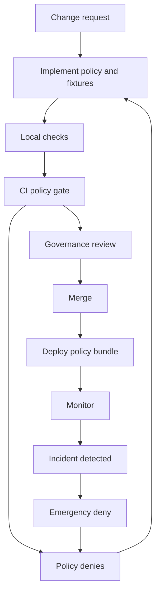

<!-- [KFM_META_BLOCK_V2]
doc_id: kfm://doc/86339c07-0f6c-422f-9f50-75aa71dc8a01
title: Policy Change Runbook
type: standard
version: v1
status: draft
owners: [Data Governance, Platform Security, Operators]
created: 2026-03-04
updated: 2026-03-04
policy_label: restricted
related: [docs/runbooks/, policy/, .github/workflows/, contracts/, tests/]
tags: [kfm, runbook, policy, opa, rego, governance]
notes: ["Fail-closed governance; keep CI and runtime policy semantics aligned."]
[/KFM_META_BLOCK_V2] -->

> **Impact**  
> **Status:** draft (intended to become active)  
> **Owners:** Data Governance (accountable), Platform Security (consulted), Operators (consulted)  
> **Last updated:** 2026-03-04  
> **Badges:**     
> **Quick links:** [Scope](#scope) · [Change types](#change-types-and-risk-levels) · [Procedure](#procedure) · [Rollback](#rollback) · [Definition of Done](#definition-of-done)

# Policy Change Runbook
Change-control steps for KFM **policy-as-code** (OPA/Rego or equivalent) so that governance remains **fail-closed**, auditable, and consistent across CI and runtime.

---

## Scope
- ✅ **CONFIRMED:** This runbook covers changes to **policy logic** and its **fixtures/tests** that gate KFM merges, promotions, evidence resolution, and runtime data access.  
- ✅ **CONFIRMED:** Policy changes must preserve **shared semantics** between CI and runtime; otherwise CI guarantees become meaningless.  
- 💡 **PROPOSED:** Treat any policy change as a *governed change* (PR-based, reviewed, tested, rollbackable).  
- ❓ **UNKNOWN:** Exact repo wiring (paths, workflows, PDP/PEP implementation language) varies by implementation—verify before executing commands.

[Back to top](#policy-change-runbook)

## Where this fits in the repo
- ✅ **CONFIRMED:** KFM governance includes a **policy bundle repository** and **test fixtures** for policy decisions (allow/deny + obligations).  
- ✅ **CONFIRMED:** Recommended architecture uses:
  - **PDP** (Policy Decision Point): OPA running in-process or as a sidecar.
  - **PEPs** (Policy Enforcement Points): CI gates, runtime API checks, evidence resolver checks; **UI only displays badges/notices** and does not decide.  
- 💡 **PROPOSED:** Keep policy code + fixtures under a single root (commonly `policy/`) and make both CI and runtime consume the same bundle.
- ❓ **UNKNOWN:** Your exact paths may be `policy/`, `policies/`, or `docs/security/.../policies/`. Confirm with `git ls-tree HEAD`.

[Back to top](#policy-change-runbook)

## Acceptable inputs
- ✅ **CONFIRMED:** A policy change must include **tests/fixtures** that demonstrate expected outcomes (allow/deny + obligations).  
- 💡 **PROPOSED:** Each change request includes:
  - A short **risk classification** (tightening vs loosening vs refactor).
  - A **before/after** decision sample (fixture pair).
  - A **rollback plan**.
  - Any **downstream migration notes** (APIs, catalogs, UI messaging).
- ❓ **UNKNOWN:** Whether your org requires an ADR for policy changes (recommended for high-risk).

## Exclusions
- ✅ **CONFIRMED:** This runbook does **not** cover:
  - Dataset onboarding/promotion procedures (see dataset runbooks).
  - Schema evolution (see schema/contract runbooks).
  - Infrastructure changes (deployment runbooks).
- 💡 **PROPOSED:** If a policy change *requires* a schema change (policy inputs change), run both runbooks and merge together (single PR if feasible).

---

## Claim labels used in this runbook
- ✅ **CONFIRMED:** Backed by KFM design docs and/or existing documented patterns.
- 💡 **PROPOSED:** Recommended implementation pattern; adopt if it matches your repo.
- ❓ **UNKNOWN:** Needs verification in your repo/environment before treating as fact.

---

## Definitions
- ✅ **CONFIRMED:** **Policy bundle**: versioned set of rules + data files evaluated by the PDP/PEPs.  
- ✅ **CONFIRMED:** **Decision outcome**: allow/deny plus **obligations** (e.g., redaction required, attribution required).  
- ✅ **CONFIRMED:** **Fail-closed**: on uncertainty or policy error, deny/block promotion or access.  
- 💡 **PROPOSED:** **Policy receipt**: a machine-readable record included in CI artifacts (and ideally runtime logs) capturing policy version + decisions.

---

## Invariants
- ✅ **CONFIRMED:** CI and runtime should share the **same policy semantics** (or at minimum the same fixtures and expected outcomes).  
- ✅ **CONFIRMED:** UI must **not** be a policy decision-maker; it only displays policy status.  
- ✅ **CONFIRMED:** Policy gates in CI should **block merges** when policy denies.  
- 💡 **PROPOSED:** A tested “**emergency deny**” invariant exists that can be flipped to ensure the entire stack fails closed (CI + API + UI).  
- 💡 **PROPOSED:** Never leak restricted metadata in error responses (treat as a policy requirement and test it).

---

## Change types and risk levels

| Change type | Examples | Risk | Minimum required approvals | Minimum tests |
|---|---|---:|---|---|
| **Refactor / no semantic change** | Renames, formatting, reorganizing packages | Low | 1 policy reviewer | Unit tests + fixture snapshot |
| **Tightening** (more denies / more obligations) | Add license allowlist, stronger redaction rules | Medium | Policy reviewer + governance steward | Unit + fixture + at least 1 integration smoke |
| **Loosening** (more allows / fewer obligations) | Broaden access, reduce redaction requirements | High | Governance steward + security + (if applicable) community council | Unit + fixture + integration + staged rollout plan |
| **Input contract change** | New required fields in receipts/manifests | High | Policy + platform owners | Unit + fixture + contract tests + migration notes |
| **Emergency policy** | Global deny switch, rapid mitigation | Critical | On-call operator + governance steward (post-hoc review) | Emergency deny invariant test |

💡 **PROPOSED:** Any change that increases access should be treated as **High** by default.

### Policy change flow (overview)



[Back to top](#policy-change-runbook)

---

## Procedure

### 0) Emergency stop
- ✅ **CONFIRMED:** If an incident requires immediate risk reduction, **deny first** and preserve evidence.  
- 💡 **PROPOSED:** If implemented, activate an “emergency deny” switch (e.g., a policy input flag) and verify CI + API + UI are blocked by tests.  
- 💡 **PROPOSED:** Open a hotfix PR that:
  1. Enables emergency deny
  2. Adds/updates the invariant test
  3. Links the incident ticket

> **CAUTION**  
> Emergency deny is a *temporary* safety posture. Follow-up PRs must restore intended behavior with proper review.

### 1) Start a policy change request
- 💡 **PROPOSED:** Create an issue (or PR description) containing:
  - **Intent** (what problem the policy solves)
  - **Scope** (which PEPs are affected: CI gate, API, evidence resolver)
  - **Risk level** (use the table above)
  - **Expected decision diffs** (what becomes allow/deny; obligations changes)
  - **Rollback plan**
- ❓ **UNKNOWN:** If you have a policy change template, use it (recommended: `.github/PULL_REQUEST_TEMPLATE/policy_change.md`).

### 2) Identify the impacted enforcement points
- ✅ **CONFIRMED:** Policy is enforced in multiple places:
  - CI (blocks merges)
  - Runtime API (checks before serving data)
  - Evidence resolver (checks before resolving evidence and rendering)
  - UI (badges/notices only)
- 💡 **PROPOSED:** For each PEP, capture:
  - the **input shape** it provides to policy (JSON payload)
  - the **decision query** it calls (package/rule)
  - error handling (must fail closed)

### 3) Implement the policy change (code + fixtures)
- ✅ **CONFIRMED:** Maintain **fixtures** that encode expected allow/deny outcomes and any obligations.  
- 💡 **PROPOSED:** Keep policy changes small and reversible:
  - One logical concern per file (“micro-policies”)
  - An aggregator rule that turns violations into a single allow/deny decision
- ❓ **UNKNOWN:** Policy layout varies; a common pattern:

```text
policy/
  data/                  # approved lists, rubrics (licenses, sensitivity labels, etc.)
  gates/                 # promotion gates, release gates
  access/                # runtime access decisions
  evidence/              # evidence resolution obligations
  pack.rego              # aggregator entrypoint
tests/
  policy/
    fixtures/
    *_test.rego
```

### 4) Update tests (unit + fixtures + contracts)
- ✅ **CONFIRMED:** CI must block merges when policy denies.  
- 💡 **PROPOSED:** Minimum tests to add/update:
  - **Rego unit tests** (OPA test runner)
  - **Conftest tests** against representative fixtures (run receipts, story nodes, catalog artifacts)
  - **Contract tests** for runtime API behavior (e.g., 403/404 shaping, obligation headers)
  - **UI smoke** that asserts restricted content remains hidden (if applicable)
- 💡 **PROPOSED:** When policy affects story publishing, test that missing evidence causes “abstain” / denial.

### 5) Run locally (example commands)
- ❓ **UNKNOWN:** Your repo may wrap these in `make` targets; prefer those if they exist.
- 💡 **PROPOSED:** Typical local workflow:

```bash
# Format and typecheck policy (OPA CLI)
opa fmt -w policy/
opa check policy/

# Run Rego unit tests
opa test policy/ -v

# Run fixture-based tests (Conftest)
conftest test tests/policy/fixtures -p policy/ -o table

# Optional: evaluate a single decision interactively
opa eval -i tests/policy/fixtures/example.json -d policy/ "data.kfm.allow"
```

### 6) Rego v1 / OPA 1.0 compatibility (when applicable)
- 💡 **PROPOSED:** If your org is migrating to Rego v1 / OPA 1.0, gate it explicitly:
  - `opa fmt --write --v0-v1`
  - `opa check --v0-v1 --strict`
  - Add `import rego.v1` during transition
  - Set `rego_version: 1` in bundle manifest  
- ❓ **UNKNOWN:** Whether your downstream tooling (Conftest/Gatekeeper) is fully v1-ready; pin versions and test.

### 7) Wire CI gating (fail closed)
- ✅ **CONFIRMED:** CI policy tests should be merge-blocking.  
- 💡 **PROPOSED:** CI should:
  - run Conftest/OPA against a canonical input (receipt/manifest)
  - upload the policy results as artifacts
  - fail the job when denied (no “soft fail”)

Example (sketch; adjust to your repo):

```yaml
name: policy-gate
on:
  pull_request:
    paths: ["policy/**", "contracts/**", "tests/**"]
jobs:
  conftest:
    runs-on: ubuntu-latest
    steps:
      - uses: actions/checkout@v4
      - name: Install OPA + Conftest
        uses: open-policy-agent/setup-opa@v2
      - name: Policy gate
        run: conftest test tests/policy/fixtures -p policy/
```

### 8) Review and approvals
- ✅ **CONFIRMED:** Policy changes have a defined governance responsibility model (steward + policy engineer; council/owner accountable).  
- 💡 **PROPOSED:** Require:
  - at least one **policy reviewer**
  - one **governance steward** for medium/high-risk
  - **security** for loosening changes
  - **community council** when culturally sensitive materials are implicated
- 💡 **PROPOSED:** Require reviewers to validate:
  - fixtures demonstrate the intended diff
  - policy is deny-by-default where appropriate
  - no sensitive metadata leaks in failure messages

### 9) Merge and deploy
- ✅ **CONFIRMED:** CI guarantees are only meaningful if runtime uses the same semantics.  
- 💡 **PROPOSED:** Deployment steps depend on your PDP packaging:
  - If runtime loads policy from the repo at build time, a standard deploy pipeline is sufficient.
  - If runtime pulls bundles dynamically, bump bundle version and publish bundle immutably.
- ❓ **UNKNOWN:** Your runtime deployment mechanism; verify which services load policy and how often.

### 10) Post-merge validation and monitoring
- 💡 **PROPOSED:** Verify:
  - A known-allowed request still succeeds (baseline path)
  - A known-denied request still denies without leaking sensitive metadata
  - Any obligations are honored (e.g., redaction receipts attached, attribution present)
- 💡 **PROPOSED:** Watch metrics:
  - deny rates by endpoint
  - policy evaluation errors (should be near-zero; errors must deny)
  - latency overhead of policy checks

[Back to top](#policy-change-runbook)

---

## Rollback
- ✅ **CONFIRMED:** Rollback must exist for governed changes (policy affects gating and access).  
- 💡 **PROPOSED:** Rollback options (prefer in this order):
  1. **Revert PR** (fastest, auditable)
  2. **Pin runtime to prior policy bundle digest** (if bundles are published immutably)
  3. **Enable emergency deny** (only if you must stop access while investigating)
- 💡 **PROPOSED:** Rollback procedure:
  1. Create a revert PR and label it `governance:rollback`
  2. Attach an audit note (incident/ticket + rationale)
  3. Re-run CI gates and ensure the prior fixtures pass
  4. Deploy/publish the reverted policy
  5. Post-mortem: add a regression fixture so it won’t recur

---

## Audit and communication
- ✅ **CONFIRMED:** Policy governance requires an audit trail and retention policy.  
- 💡 **PROPOSED:** For each policy change PR, include:
  - Policy bundle version/digest
  - Decision diff summary (what changed and why)
  - Links to fixtures and CI artifacts
  - Any “override” rationale (if your process allows overrides at all)

---

## Definition of Done
- [ ] ✅ **CONFIRMED:** Policy semantics are consistent between CI and runtime (or fixtures prove equivalence).  
- [ ] ✅ **CONFIRMED:** CI policy tests are merge-blocking and fail closed.  
- [ ] ✅ **CONFIRMED:** Fixtures include allow/deny + obligations coverage.  
- [ ] 💡 **PROPOSED:** At least one regression fixture reproduces the motivating bug.  
- [ ] 💡 **PROPOSED:** Rollback plan is documented and tested (revert succeeds).  
- [ ] 💡 **PROPOSED:** If loosening access, a staged rollout plan exists and security has approved.  
- [ ] 💡 **PROPOSED:** Documentation updates landed (developer docs, UI notices, contributor guidance).  

---

## FAQ

### Why do we require “same semantics” in CI and runtime?
- ✅ **CONFIRMED:** If CI and runtime differ, CI’s “green” status does not guarantee correct enforcement in production.

### What if policy denies due to missing evidence?
- ✅ **CONFIRMED:** Fail closed.  
- 💡 **PROPOSED:** Mark affected outputs as “abstain” / non-publishable until evidence is attached and verified.

### Can operators override policy gates?
- ✅ **CONFIRMED:** Operators should not override policy gates as a default posture.  
- 💡 **PROPOSED:** If an override mechanism exists, require recorded reason + governance review and treat as exceptional.

---

## Appendix

<details>
<summary>Appendix A — “Emergency deny” invariant (example pattern)</summary>

💡 **PROPOSED:** Maintain a synthetic policy flag that, when enabled, denies promotions/access. Then test **end-to-end** that CI + API + UI fail closed.

Suggested layout:

```text
policy/rego/kfm/promotion/emergency_deny.rego
tests/policy/emergency_deny_test.rego
tests/integration/api/emergency_deny_contract.spec.yaml
tests/integration/ui/emergency_deny_smoke.spec.ts
.github/workflows/emergency-deny-invariant.yml
```

</details>

<details>
<summary>Appendix B — Rego v1 migration checklist (OPA 1.0 helpers)</summary>

💡 **PROPOSED:** Use OPA’s migration helpers to format and strictly check policy:

```bash
opa fmt --write --v0-v1 ./policy
opa check --v0-v1 --strict ./policy
```

💡 **PROPOSED:** During transition, add `import rego.v1` to active packages and set `rego_version: 1` in the bundle manifest.

</details>

<details>
<summary>Appendix C — Reference sources</summary>

- KFM — Definitive Design &amp; Governance Guide (vNext): Policy-as-code architecture and governance artifacts.  
- New Ideas 2-26-26: Example PR gate workflow and fail-closed OPA sketch.  
- New Ideas 2-17-26: Rego v1 / OPA 1.0 migration steps and CI guard idea.  
- New Ideas 2-17-26-1: Emergency deny invariant sketch and suggested repo layout.  

</details>
