<!-- [KFM_META_BLOCK_V2]
doc_id: kfm://doc/runbook/promotion
title: KFM Promotion Runbook — Governed Transitions RAW → PUBLISHED
type: standard
version: v1
status: draft
owners: [TODO docs-steward, TODO release-authority]
created: 2026-05-12
updated: 2026-05-12
policy_label: public
related:
  - docs/doctrine/directory-rules.md
  - docs/doctrine/lifecycle-law.md
  - docs/doctrine/trust-membrane.md
  - docs/architecture/governed-api.md
  - docs/runbooks/ROLLBACK_DRILL.md
  - policy/promotion/
  - policy/release/
  - schemas/contracts/v1/
tags: [kfm, runbook, promotion, lifecycle, governance, release, rollback]
notes:
  - Operating procedure for promotion as a governed state transition.
  - Promotion is never a file move; bytes alone do not earn a phase.
  - All paths PROPOSED until verified against mounted-repo evidence.
[/KFM_META_BLOCK_V2] -->

<a id="top"></a>

# KFM Promotion Runbook

> Operating procedure for moving objects through KFM's governed lifecycle — **RAW → WORK / QUARANTINE → PROCESSED → CATALOG / TRIPLET → PUBLISHED** — without bypassing evidence, policy, review, or rollback.

<p align="center">
  <b>Evidence-first • Policy-aware • Fail-closed • Reversible</b>
</p>

---

## Badges


| Field | Value |
|---|---|
| **Status** | Draft (PROPOSED implementation; CONFIRMED doctrine) |
| **Owners** | `TODO` docs steward · `TODO` release authority |
| **Last updated** | `TODO` |
| **Authority** | Lifecycle Law, Directory Rules §6.1, §6.5, §9 |
| **Applies to** | All KFM domain lanes; all PUBLISHED-bound artifacts |
| **Companion runbooks** | `docs/runbooks/ROLLBACK_DRILL.md`, `docs/runbooks/CORRECTION.md` (both `TODO`) |

---

## Quick Jump

- [1. Scope](#1-scope)
- [2. Doctrine recap](#2-doctrine-recap)
- [3. When to use this runbook](#3-when-to-use-this-runbook)
- [4. Prerequisites](#4-prerequisites)
- [5. Promotion flow at a glance](#5-promotion-flow-at-a-glance)
- [6. Gate-by-gate procedure](#6-gate-by-gate-procedure)
- [7. Promotion dry-run](#7-promotion-dry-run)
- [8. Rollback drill](#8-rollback-drill)
- [9. Correction path](#9-correction-path)
- [10. Roles and separation of duties](#10-roles-and-separation-of-duties)
- [11. Decision outcomes](#11-decision-outcomes)
- [12. Failure codes and fail-closed reference](#12-failure-codes-and-fail-closed-reference)
- [13. Anti-patterns](#13-anti-patterns)
- [14. Receipt and artifact reference](#14-receipt-and-artifact-reference)
- [15. Related docs](#15-related-docs)
- [16. Open questions](#16-open-questions)

---

## 1. Scope

This runbook is the **operating procedure** for KFM promotion. It tells a steward, reviewer, or release authority *what to do, in what order, with which receipts, and what to do when something fails closed.*

It is **not** the doctrine itself. Doctrine lives in:

- `docs/doctrine/lifecycle-law.md` — the invariant and what it means.
- `docs/doctrine/directory-rules.md` — where things live and why a path move is not a promotion.
- `docs/doctrine/trust-membrane.md` — why public clients never read RAW/WORK/QUARANTINE.

This runbook **operationalizes** those documents. Where the two disagree, **doctrine wins**, and the discrepancy is filed in `docs/registers/DRIFT_REGISTER.md`.

> [!IMPORTANT]
> **Promotion is a governed state transition, not a file move.** A path-level move that bypasses validators, policy gates, evidence-bundle creation, catalog closure, or release-decision recording is a violation of the lifecycle invariant — regardless of which directory the bytes end up in. — *Directory Rules §9.1; Lifecycle Law (CONFIRMED doctrine).*

---

## 2. Doctrine recap

KFM's lifecycle invariant — preserved verbatim:

> **RAW → WORK / QUARANTINE → PROCESSED → CATALOG / TRIPLET → PUBLISHED**

Five governed transitions, five sets of admissible artifacts, five fail-closed outcomes. No phase is earned by being in the right directory; each is earned by producing the receipts and decisions that the next phase's gate requires.

The cite-or-abstain rule is in force throughout: every consequential claim resolves `EvidenceRef → EvidenceBundle`. When evidence cannot be resolved, the system **abstains**; it does not invent support.

| Pillar | Behavior |
|---|---|
| **Evidence first** | `EvidenceBundle` outranks generated language, tiles, maps, graphs, AI text. |
| **Trust membrane** | Public clients read only through `apps/governed-api/`. RAW/WORK/QUARANTINE are never public. |
| **Cite-or-abstain** | If support cannot be resolved, return `ABSTAIN`, never invent. |
| **Fail-closed** | Unknown rights, unresolved sensitivity, missing review state → `DENY` / `HOLD`. |
| **Reversibility** | Every PUBLISHED claim carries a correction path and rollback target. |
| **Separation of duties** | Where materiality applies, the release authority is not the author. |

---

## 3. When to use this runbook

Run this procedure when any of the following is happening:

- A domain steward wants to advance a candidate object from one lifecycle phase to the next.
- A release authority is preparing a `ReleaseManifest` for one or more layers, catalog records, or domain claims.
- A correction reviewer is staging a `CorrectionNotice` against a PUBLISHED claim.
- A reviewer is exercising a **rollback drill** (PR-10–class exercise, PROPOSED) against a dry-run release.
- CI is gating a merge that touches `data/`, `release/`, `policy/promotion/`, or `policy/release/`.

> [!TIP]
> If you are tempted to "just move the files," stop. Use [§7 — Promotion dry-run](#7-promotion-dry-run) first. Dry-run is cheap; bypassing the gate is not reversible without a correction and rollback.

---

## 4. Prerequisites

Before running any gate, confirm the following supports are present **for the object you are promoting**. Missing supports are not blockers to running this runbook — they are blockers to passing the gate. The point of the runbook is to surface them before they cause a fail-closed denial in CI or at release time.

| Prerequisite | Where it lives (PROPOSED) | Why |
|---|---|---|
| `SourceDescriptor` for every contributing source | `data/registry/source_descriptors/` | Source role, rights, sensitivity, cadence must be known. |
| Rights status resolved | `control_plane/source_authority_register.yaml` | `RIGHTS_UNKNOWN` is a hard `DENY`. |
| Sensitivity tag set | `control_plane/source_authority_register.yaml`, `policy/sensitivity/` | Sensitive lanes default to `DENY`. |
| Schema target identified | `schemas/contracts/v1/<domain>/` | Validators need a target. |
| Policy bundle compiled | `policy/promotion/`, `policy/release/` | The Rego/OPA gates evaluate this bundle. |
| Identity strategy chosen | `contracts/` per object family | Deterministic identity preferred where practical. |

> [!NOTE]
> **CONFIRMED doctrine / PROPOSED implementation:** the exact filenames and paths above follow Directory Rules and the Domains Atlas. They are PROPOSED until verified against current mounted-repo evidence.

[⬆ Back to top](#top)

---

## 5. Promotion flow at a glance

```mermaid
flowchart LR
    A["— (not admitted)"]:::ext
    R["RAW"]:::raw
    W["WORK"]:::work
    Q["QUARANTINE"]:::quar
    P["PROCESSED"]:::proc
    C["CATALOG / TRIPLET"]:::cat
    PUB["PUBLISHED"]:::pub

    A -- "Admission: SourceDescriptor + payload hash" --> R
    R -- "Normalization: TransformReceipt + ValidationReport" --> W
    R -- "FAIL → QUARANTINE (reason recorded)" --> Q
    W -- "Validation: ValidationReport pass<br/>RedactionReceipt if sensitive" --> P
    Q -. "remediation + steward review" .-> W
    P -- "Catalog closure: EvidenceBundle resolved<br/>catalog matrix + digest closure" --> C
    C -- "Release: ReleaseManifest + rollback target<br/>+ ReviewRecord (if required)" --> PUB
    PUB -. "CorrectionNotice / RollbackCard" .-> PUB

    classDef ext fill:#eee,stroke:#666,color:#333
    classDef raw fill:#fff3e0,stroke:#e65100,color:#000
    classDef work fill:#e3f2fd,stroke:#0d47a1,color:#000
    classDef quar fill:#ffebee,stroke:#b71c1c,color:#000
    classDef proc fill:#e8f5e9,stroke:#1b5e20,color:#000
    classDef cat fill:#f3e5f5,stroke:#4a148c,color:#000
    classDef pub fill:#e0f7fa,stroke:#006064,color:#000
```



The diagram shows the five governed transitions and the receipt requirement for each. The dashed line from PUBLISHED back to itself is *not* a no-op — it is the post-publication correction loop, governed by `CorrectionNotice` and `RollbackCard` (see [§9](#9-correction-path)).

---

## 6. Gate-by-gate procedure

Each gate has the same shape: **pre-condition → required artifacts → run → outcome.** A gate that cannot prove its required artifacts emits a `FAIL` / `DENY` and the object stays in its prior phase. No silent advancement.

### 6.1 Gate A — Admission ( — → RAW )

**Pre-condition.** Source identity and rights are minimally established at discovery; source-role intent is set.

**Required artifacts (PROPOSED minimum).**

- `SourceDescriptor` — role (`observed | modeled | aggregate | regulatory | administrative`), authority, rights, sensitivity, cadence.
- Payload hash or stable reference (`spec_hash` over canonical bytes).

**Procedure.**

1. Resolve the source against `control_plane/source_authority_register.yaml`. If unknown → `HOLD` for steward review.
2. Emit `SourceDescriptor` under `data/raw/<domain>/<source_id>/<run_id>/`.
3. Capture the immutable payload (or pointer + content hash) in the same `run_id` directory.
4. Append an ingest receipt under `data/receipts/ingest/`.

**Fail-closed outcomes.** Unknown rights → not admitted. Source-role collapse risk → not admitted. Logged as candidate awaiting steward.

### 6.2 Gate B — Normalization ( RAW → WORK / QUARANTINE )

**Pre-condition.** Schema, geometry, time, identity, evidence, rights, and policy rules are runnable for this lane.

**Required artifacts (PROPOSED minimum).**

- `TransformReceipt` — what normalization ran, on what bytes, with what tool versions.
- `ValidationReport` (working set) — validator outcome from `{ANSWER, ABSTAIN, DENY, ERROR}`.
- `PolicyDecision` — initial admissibility check.
- For sensitive lanes: a tentative `RedactionReceipt` if any redaction occurred during normalization.

**Procedure.**

1. Run the normalization pipeline. Output lands in `data/work/<domain>/<run_id>/`.
2. On any validator failure, route the object to `data/quarantine/<domain>/<reason>/<run_id>/` with a `quarantine_reason` field. **Do not silently promote.**
3. Emit `TransformReceipt` and the working-set `ValidationReport` under `data/receipts/validation/`.

> [!CAUTION]
> Source role is **fixed at admission**. Normalization MUST NOT upcast a modeled source to observed, an aggregate to per-place, or an administrative reference to a regulatory authority. Source-role collapse is a fail-closed condition (`ROLE_COLLAPSE`, `ROLE_DOWNCAST_FORBIDDEN`). — *Domains Atlas §24.6, §24.9.*

### 6.3 Gate C — Validation ( WORK → PROCESSED )

**Pre-condition.** Validators are deterministic and tied to fixtures; required receipts present.

**Required artifacts.**

- `ValidationReport` with `outcome == "ANSWER"` (pass).
- `RedactionReceipt` if sensitivity applies.
- `AggregationReceipt` if the object is a derived aggregate.

**Procedure.**

1. Run the full validator suite for the domain (`tests/validators/<domain>/` — PROPOSED).
2. Confirm fixtures-vs-validator parity (the validator must also fail closed against negative fixtures).
3. Promote the normalized object to `data/processed/<domain>/<dataset_id>/<version>/`.
4. Cross-link receipts via `EvidenceRef`.

**Fail-closed outcomes.** Any validator returning `DENY` / `ERROR` / `FAIL` → stay in WORK. Structured `FAIL` outcome recorded.

### 6.4 Gate D — Catalog closure ( PROCESSED → CATALOG / TRIPLET )

**Pre-condition.** `EvidenceRef` values resolve; catalog matrix and digests close.

**Required artifacts.**

- `CatalogMatrix` entry (STAC + DCAT + PROV projection, PROPOSED v1 profile).
- `EvidenceBundle` — content-addressed JSON-LD package binding claim, receipts, and authority crosswalks.
- Graph / triplet projection (if applicable to the lane).

**Procedure.**

1. Resolve every `EvidenceRef` for the candidate against `data/proofs/evidence_bundle/`. Any unresolved reference → `ABSTAIN` and `HOLD` at PROCESSED.
2. Emit the catalog record under `data/catalog/<stac|dcat|prov|domain>/`.
3. Emit the `EvidenceBundle` under `data/proofs/evidence_bundle/<bundle_id>/` with a `spec_hash` computed via JCS + SHA-256 (PROPOSED canonicalization).
4. If a triplet/graph projection applies, emit under `data/triplets/` — **never** as canonical truth, always as derived projection.

> [!WARNING]
> `EvidenceBundle` is **content-addressed**. Republishing the same logical bundle under a different hash silently invalidates every receipt that points at it. If the bundle must change, emit a new bundle with a new hash and supersede the old one through a `CorrectionNotice`.

### 6.5 Gate E — Release ( CATALOG / TRIPLET → PUBLISHED )

**Pre-condition.** Review state where required; release authority distinct from the original author when materiality applies.

**Required artifacts.**

- `ReleaseManifest` — release contents, version, digests, evidence refs, **rollback target**.
- `ReviewRecord` (when required by the domain's sensitivity / materiality posture).
- A signed attestation (DSSE / cosign — PROPOSED) binding the manifest to its inputs.
- Confirmed correction path.

**Procedure.**

1. Stage the release candidate under `release/candidates/<domain>/`.
2. Run `policy/release/*` against the candidate envelope. On `DENY` for any reason listed in [§12](#12-failure-codes-and-fail-closed-reference), stop here.
3. Run the required review:
   - **Routine, non-sensitive lane:** domain steward review.
   - **Sensitive lane:** domain steward + sensitivity reviewer + release authority + rights-holder representative (where applicable). The author **MUST NOT** also be the release authority. — *Atlas §24.7.2 (PROPOSED).*
4. Emit `ReleaseManifest` under `release/manifests/<release_id>/`.
5. Sign the manifest (DSSE / cosign — PROPOSED).
6. Activate the release: publish artifacts to `data/published/<api_payloads|layers|pmtiles|geoparquet|reports|stories>/` and update the layer registry / catalog pointers.
7. Confirm the public surface via the governed API smoke check (`apps/governed-api/` — PROPOSED).

**Fail-closed outcomes.** Missing manifest → `RELEASE_MANIFEST_INVALID`. Missing rollback target → `ROLLBACK_TARGET_MISSING`. Review insufficient → `REVIEW_INSUFFICIENT`. Any of these → `HOLD` at CATALOG, no public surface change.

[⬆ Back to top](#top)

---

## 7. Promotion dry-run

The dry-run is the **PR-09 pattern** from the Encyclopedia roadmap (PROPOSED): validate a release candidate end-to-end without publishing it to a public surface. It is the safe way to discover that something is missing.

```text
# Conceptual command shape — PROPOSED; verify against tools/ before running.
kfm release dry-run \
  --candidate release/candidates/<domain>/<candidate_id>/ \
  --policy policy/release/ \
  --no-public-write
```

The dry-run MUST:

1. Run every gate in [§6](#6-gate-by-gate-procedure) against the candidate.
2. Build the `ReleaseManifest` but **not** activate any public surface.
3. Emit a `PromotionReceipt` (PROPOSED object) recording gate IDs, inputs, proofs, release target, and rollback target.
4. Confirm that `no-public-write` is enforced — the dry-run's own test suite includes a negative case that fails CI if a public write occurred.

> [!TIP]
> Treat dry-run failures as **structural information**, not noise. A repeated dry-run failure for the same reason is a signal that a doctrine document, a fixture, or a validator is wrong — not that the gate is too strict.

---

## 8. Rollback drill

The rollback drill (PR-10 pattern, PROPOSED) is how KFM proves that a release is reversible *before* it has to be reversed in anger. Run a drill at least once per release, ideally during dry-run.

**Required artifacts (drill).**

- A target `ReleaseManifest` to roll back from.
- A prior `ReleaseManifest` (the `rollback_target`) to roll back to.
- A `RollbackCard` recording the decision, the reason, the invalidated derivatives, and the review reference.

**Procedure (drill — non-public).**

1. Pick a recent dry-run release.
2. Author a `RollbackCard` under `release/rollback_cards/<rollback_id>/` referencing the dry-run's `release_id` and the prior `release_id`.
3. Run the rollback tool (PROPOSED `tools/release/rollback`) against the manifest pair.
4. Confirm:
   - Public-surface payloads return to the prior release's digests.
   - Catalog records point at the prior `EvidenceBundle` versions.
   - Any derivative layers, tiles, or graph projections are invalidated and rebuilt or withdrawn.
5. Emit a drill receipt under `data/receipts/release/` and link it from the `RollbackCard`.

> [!IMPORTANT]
> **A release is not safe until a rollback drill has succeeded against it.** Directory Rules §6.5 places rollback policy in `policy/release/` and rollback decisions in `release/rollback_cards/`. The Encyclopedia identifies "Release without `ReleaseManifest` or rollback target" as an anti-pattern that breaks the trust membrane. — *Atlas §24.9.2.*

See `docs/runbooks/ROLLBACK_DRILL.md` (`TODO`) for the full drill checklist and rehearsal cadence.

---

## 9. Correction path

A correction is the **only** way to amend a PUBLISHED claim. Edits in place are forbidden — the durable public unit is the inspectable claim, and silent edits break every receipt that points at the prior version.

| Trigger | Required artifacts | Outcome |
|---|---|---|
| Detected error in PUBLISHED claim | `CorrectionNotice` + `ReviewRecord` | New release supersedes prior; prior remains inspectable |
| New evidence invalidates a claim | `CorrectionNotice` + `ReviewRecord` + revised `EvidenceBundle` | Same as above; supersession entry recorded |
| Failed release detected post-publish | `RollbackCard` + `ReviewRecord` | Rollback to prior `rollback_target` |
| Rights / sensitivity escalation | `RedactionReceipt` + `ReviewRecord` (Steward + rights-holder where applicable) | Demote to a more restricted tier; prior release withdrawn |

A `CorrectionNotice` MUST enumerate the derivatives it invalidates (tiles, layers, graph edges, AI summaries, story exports). Re-publishing a corrected claim without invalidating derivatives is a fail-closed anti-pattern. — *Atlas §24.9.2.*

---

## 10. Roles and separation of duties

CONFIRMED doctrine (operating-law invariant 9): KFM separates policy-significant release duties when maturity justifies it. — *Domains Atlas §24.7.*

| Role | What they own |
|---|---|
| **Source steward** | Admission, rights confirmation, sensitivity tag for a source family. |
| **Domain steward** | Object-family meaning, contracts, validators for a domain. |
| **Sensitivity reviewer** | Redaction, generalization, withholding, tier decisions. |
| **Rights-holder representative** | Sovereignty / consent decisions for archaeology, people-DNA-land, fauna/flora geoprivacy. |
| **Release authority** | Issues `ReleaseManifest`s and authorizes PUBLISHED transitions. |
| **Correction reviewer** | Reviews `CorrectionNotice` / `RollbackCard` before amendment. |
| **AI surface steward** | Reviews Focus Mode templates and AI policy bindings. |
| **Docs steward** | Governance docs, ADR index, drift register, Atlas integrity. |

**Separation-of-duties matrix (PROPOSED, from Atlas §24.7.2):**

| Action | Author may also approve? | Required separation |
|---|---|---|
| Source admission | Routine: yes; sovereign / unresolved rights: no | Source steward + rights-holder rep (if applicable) |
| Normalization receipts | Routine: yes; sensitivity-relevant: no | Domain steward; sensitivity reviewer if applicable |
| Validator authorship and run | Yes (deterministic) | Domain steward; periodic audit by docs steward |
| Promotion to PROCESSED / CATALOG | Non-sensitive: yes; sensitive: no | Domain steward + sensitivity reviewer (sensitive) |
| **Release to PUBLISHED** | **No when materiality applies** | **Author ≠ release authority; rights-holder rep where applicable** |
| Sensitive-lane release | **No** | Author + sensitivity reviewer + release authority + rights-holder rep |
| Correction / rollback | No when steward-significant | Author / detector + correction reviewer + release authority |

> [!NOTE]
> Maturity note (CONFIRMED doctrine): early-stage doctrine work MAY be authored and approved by the same actor when materiality is low. As public trust surface expands, separation MUST be enforced through tooling, not custom. — *Directory Rules §2; Atlas §24.7.2.*

[⬆ Back to top](#top)

---

## 11. Decision outcomes

Every governed API surface, validator, policy gate, and Focus Mode answer returns one of a finite set of outcomes. The promotion flow uses the same vocabulary, so a CI failure speaks the same language as a runtime answer.

| Outcome | When | Promotion effect |
|---|---|---|
| **ANSWER** | Evidence sufficient, policy permits, release state allows, review recorded. | Gate passes. |
| **ABSTAIN** | Evidence insufficient or unresolvable; AI surface cannot cite; stale with no released alternative. | Gate holds; object stays in prior phase. |
| **DENY** | Policy, rights, sensitivity, or release state forbids. | Gate fails closed; object stays or is quarantined. |
| **ERROR** | Governed API / validator cannot evaluate (schema, contract, infrastructure). | Gate fails closed with diagnostic; no silent fall-through. |
| **HOLD** | Pending steward / rights-holder / policy review. | Surface stays in prior state; no silent replacement. |
| **PASS** | Validator-class: input acceptable. | Internal; permits next-gate evaluation. |
| **FAIL** | Validator-class: input unacceptable. | Promotion blocked; quarantine where appropriate. |

`PromotionDecision` and `RuntimeResponseEnvelope` are the two contract objects that carry these outcomes across the trust membrane. — *Master MapLibre §11; Atlas §24.3.*

---

## 12. Failure codes and fail-closed reference

Codes are drawn from the Master Failure / Outcome Code Reference (Atlas §24.6, PROPOSED). They are the canonical reason vocabulary; do not invent new ones inline.

<details>
<summary><b>Click to expand the full fail-closed code table</b></summary>

| Code | Phase | Resolution |
|---|---|---|
| `RIGHTS_UNKNOWN` | Admission / Validation / Catalog / Release | Steward review; rights resolution; tier reassignment. |
| `SENSITIVITY_UNRESOLVED` | Admission / Validation / Catalog / Release | Steward review; rights resolution; tier reassignment. |
| `ROLE_COLLAPSE` | Validation / Catalog / Release | Restore source role; refuse upcast. |
| `ROLE_DOWNCAST_FORBIDDEN` | Validation / Catalog / Release | Restore source role; refuse upcast. |
| `REVIEW_NEEDED` | Catalog / Release | Run required review; supply `ReviewRecord`. |
| `REVIEW_INSUFFICIENT` | Catalog / Release | Run required review; supply `ReviewRecord`. |
| `REVIEW_REJECTED` | Catalog / Release | Address review reasons; resubmit. |
| `RELEASE_MANIFEST_INVALID` | Release | Repair manifest; resubmit. |
| `ROLLBACK_TARGET_MISSING` | Release | Supply rollback target; resubmit. |
| `CORRECTION_DERIVATIVES_UNRESOLVED` | Correction | Resolve derivatives; supersession entry. |
| `CORRECTION_PRIOR_RELEASE_MISSING` | Correction | Locate prior release; restore lineage. |

</details>

A gate that produces any of these codes **MUST** record them in the receipt trail. Silent fall-through is forbidden.

---

## 13. Anti-patterns

The Encyclopedia and the Atlas name these explicitly. They appear here so a reviewer can call them out at PR time, not after publication.

> [!CAUTION]
> **Trust-membrane anti-patterns** (Atlas §24.9.2):
> - Public client reads RAW / WORK / QUARANTINE.
> - Map shell consumes canonical / internal store directly.
> - AI returns uncited language.
> - AI answers from RAW / WORK rather than `EvidenceBundle`.
> - Sensitive content released without redaction.
> - Aggregate cited as per-place observation.
> - Synthetic surface presented without `RealityBoundaryNote`.
> - KFM used as alert / instruction authority.
> - **Release without `ReleaseManifest` or rollback target.**
> - AI generation routed through an admin shortcut.

> [!CAUTION]
> **Governance-process anti-patterns** (Atlas §24.9.3):
> - Documenting a change instead of validating it.
> - Approving one's own release on a sensitive lane.
> - Treating an Atlas summary or matrix as evidence.
> - Silent migrations between schema or policy homes.
> - Promotion that "upgrades" a source role (e.g., modeled → observed).
> - Re-publishing a corrected claim without invalidating derivatives.

---

## 14. Receipt and artifact reference

<details>
<summary><b>Receipt × lifecycle-phase matrix (Atlas §24.2.2; CONFIRMED doctrine)</b></summary>

A `•` means the receipt is normally emitted, amended, or referenced at that phase. Receipts created earlier remain referenced (not duplicated) at later phases via `EvidenceRef`.

| Receipt | RAW | WORK / QUAR. | PROCESSED | CATALOG / TRIPLET | PUBLISHED |
|---|:-:|:-:|:-:|:-:|:-:|
| `SourceDescriptor` | • | • | • | • | • |
| `TransformReceipt` |  | • | • | • |  |
| `RedactionReceipt` |  | • | • | • | • |
| `AggregationReceipt` |  | • | • | • | • |
| `ModelRunReceipt` |  | • | • | • | • |
| `RepresentationReceipt` |  |  | • | • | • |
| `AIReceipt` |  |  | • | • | • (Focus Mode only) |
| `ReviewRecord` |  | • | • | • | • |
| `PolicyDecision` | • | • | • | • | • |
| `ValidationReport` |  | • | • | • |  |
| `ReleaseManifest` |  |  |  |  | • |
| `CorrectionNotice` |  |  |  |  | • |
| `RollbackCard` |  |  |  |  | • |
| `RealityBoundaryNote` |  |  | • | • | • |
| `MatrixCellReceipt` |  |  | • | • | • |
| `StorySnapshot` |  |  |  |  | • |

</details>

<details>
<summary><b>Where each artifact lives (PROPOSED, per Directory Rules)</b></summary>

| Artifact | Proposed home |
|---|---|
| `SourceDescriptor` | `data/registry/source_descriptors/` |
| `TransformReceipt`, `ValidationReport` | `data/receipts/validation/`, `data/receipts/pipeline/` |
| `EvidenceBundle` | `data/proofs/evidence_bundle/<bundle_id>/` |
| `CatalogMatrix` / catalog records | `data/catalog/<stac\|dcat\|prov\|domain>/` |
| `ReleaseManifest` | `release/manifests/<release_id>/` |
| `RollbackCard` | `release/rollback_cards/<rollback_id>/` |
| `CorrectionNotice` | `release/correction_notices/<notice_id>/` |
| `PromotionReceipt`, gate decision logs | `data/receipts/release/` (PROPOSED) |
| `ReviewRecord` | `release/review_records/` (PROPOSED) |

All paths PROPOSED until verified against mounted-repo evidence. NEEDS VERIFICATION: whether `data/manifests/` exists as a separate home, or whether all manifests live under `release/manifests/`. — *Directory Rules §18.*

</details>

[⬆ Back to top](#top)

---

## 15. Related docs

- [`docs/doctrine/lifecycle-law.md`](../doctrine/lifecycle-law.md) — the invariant and what counts as a violation.
- [`docs/doctrine/directory-rules.md`](../doctrine/directory-rules.md) — where things live; why a path move is not a promotion.
- [`docs/doctrine/trust-membrane.md`](../doctrine/trust-membrane.md) — the public-surface boundary the runbook protects.
- [`docs/architecture/governed-api.md`](../architecture/governed-api.md) — the trust-membrane interface.
- [`docs/runbooks/ROLLBACK_DRILL.md`](./ROLLBACK_DRILL.md) — `TODO` — drill cadence and full checklist.
- [`docs/runbooks/CORRECTION.md`](./CORRECTION.md) — `TODO` — post-publication correction procedure.
- [`docs/adr/`](../adr/) — accepted ADRs that may amend this runbook.
- [`policy/promotion/`](../../policy/promotion/) — promotion-gate policy.
- [`policy/release/`](../../policy/release/) — release-gate policy.
- [`control_plane/release_state_register.yaml`](../../control_plane/release_state_register.yaml) — the machine-readable release-state index.

---

## 16. Open questions

These are the verification items that block parts of this runbook from being upgraded from PROPOSED to CONFIRMED implementation. They are not blockers to running the procedure as documented — they are blockers to claiming the procedure is wired up.

- **NEEDS VERIFICATION** — Does `apps/governed-api/` exist in the current repo, and what is its release-state surface?
- **NEEDS VERIFICATION** — Is the policy engine OPA / Conftest, or something else? — *Build Manual §3, Reconciliation Note.*
- **NEEDS VERIFICATION** — Does `release/manifests/` exist as a canonical home, or is `data/manifests/` also present? — *Directory Rules §18.*
- **NEEDS VERIFICATION** — Is `JCS + SHA-256` or `URDNA2015` the canonicalization for `EvidenceBundle` hashes? — *Components Pass 10 §11.2.*
- **UNKNOWN** — Are dry-run and rollback drill tools (PR-09 / PR-10 pattern) implemented or only proposed?
- **UNKNOWN** — Is the `PromotionReceipt` schema present under `schemas/contracts/v1/`, or is it still PROPOSED?
- **OPEN** — Is `policy/release/` the canonical home, or is release policy split across `policy/promotion/` and `policy/release/`? An ADR may be needed.

Entries here are migrated to `docs/registers/VERIFICATION_BACKLOG.md` (PROPOSED) when accepted as the canonical backlog.

---

<hr/>

**Last updated:** `TODO`  ·  **Doc id:** `kfm://doc/runbook/promotion`  ·  **Status:** draft (PROPOSED implementation; CONFIRMED doctrine)

**See also:** [Lifecycle Law](../doctrine/lifecycle-law.md) · [Directory Rules](../doctrine/directory-rules.md) · [Trust Membrane](../doctrine/trust-membrane.md) · [Rollback Drill](./ROLLBACK_DRILL.md)

[⬆ Back to top](#top)
