<!-- [KFM_META_BLOCK_V2]
doc_id: kfm://doc/runbook-quarantine-handling
title: Quarantine Handling Runbook
type: standard
version: v1
status: draft
owners: TODO — Docs steward + Source steward + Domain stewards (per affected lane)
created: TODO-YYYY-MM-DD
updated: TODO-YYYY-MM-DD
policy_label: public
related:
  - docs/doctrine/directory-rules.md
  - docs/doctrine/lifecycle-law.md
  - docs/doctrine/truth-posture.md
  - docs/doctrine/trust-membrane.md
  - docs/architecture/governed-api.md
  - docs/runbooks/governed_ai_VALIDATION.md
  - contracts/governance/  # ReviewRecord, decision/correction families
  - schemas/contracts/v1/  # QuarantineRecord home — PROPOSED, ADR pending
tags: [kfm, runbook, lifecycle, governance, quarantine]
notes:
  - "All concrete repo paths and schema home claims are PROPOSED until verified against the mounted repository."
  - "Quarantine is governance state, not a storage convention."
[/KFM_META_BLOCK_V2] -->

# Quarantine Handling Runbook

> Operational guide for routing material into `QUARANTINE`, recording defects, clearing or retiring quarantined records, and never letting a quarantined object reach a public surface by accident.


**Status:** draft — content doctrine-anchored, implementation references PROPOSED
**Owners:** *TODO* — Docs steward + Source steward + per-domain stewards
**Last reviewed:** *TODO-YYYY-MM-DD*

---

## Quick jump

- [1. Scope](#1-scope)
- [2. When to use this runbook](#2-when-to-use-this-runbook)
- [3. Lifecycle context](#3-lifecycle-context)
- [4. Quarantine entry — automatic conditions](#4-quarantine-entry--automatic-conditions)
- [5. Quarantine entry — review-driven conditions](#5-quarantine-entry--review-driven-conditions)
- [6. Reason codes and defect classes](#6-reason-codes-and-defect-classes)
- [7. What a `QuarantineRecord` MUST carry](#7-what-a-quarantinerecord-must-carry)
- [8. Path placement](#8-path-placement)
- [9. Clearance procedures](#9-clearance-procedures)
- [10. Promotion gates after clearance](#10-promotion-gates-after-clearance)
- [11. Roles and separation of duties](#11-roles-and-separation-of-duties)
- [12. Health indicators](#12-health-indicators)
- [13. Anti-patterns](#13-anti-patterns)
- [14. Related docs](#14-related-docs)
- [15. Appendix](#15-appendix)

---

## 1. Scope

This runbook governs how Kansas Frontier Matrix (KFM) handles material that enters the `QUARANTINE` state during the canonical data lifecycle:

> **RAW → WORK / QUARANTINE → PROCESSED → CATALOG / TRIPLET → PUBLISHED** *(CONFIRMED doctrine)*

`QUARANTINE` is a **governed holding state** for inputs that exhibit defects in rights, sensitivity, validation, source-role, evidence, temporal logic, or policy posture. It is **not** a staging area, not a publication candidate, and not visible to public clients.

> [!IMPORTANT]
> **Quarantine is not a publishable staging area.** The encyclopedia is explicit: `QuarantineRecord` holds *failed, sensitive, rights-unknown or malformed inputs*, and quarantine MUST NOT become a back door into public surfaces. Promotion out of quarantine is a **governed state transition, not a file move.**

**In scope:**

- Entry conditions (automatic + review-driven) that route material into `QUARANTINE`.
- Required `QuarantineRecord` content and path placement under `data/quarantine/`.
- Clearance, re-evaluation, retirement, and supersession procedures.
- Promotion gates that quarantined material MUST pass to re-enter `WORK` or progress further.
- Role responsibilities and separation-of-duties expectations.

**Out of scope:**

- Object **meaning** (lives in `contracts/`) and **shape** (lives in `schemas/`) — this runbook references them but does not define them.
- The full policy authoring guide (lives under `policy/`).
- Release-side rollback and correction mechanics — see the dedicated runbooks under `docs/runbooks/` *(PROPOSED neighbors: `governed_ai_ROLLBACK.md`, future `RELEASE_ROLLBACK.md`)*.
- Source admission before `RAW` — see `docs/sources/SOURCE_DESCRIPTOR_STANDARD.md` *(PROPOSED path)*.

---

## 2. When to use this runbook

Reach for this document whenever:

| Trigger | What you’re doing here |
|---|---|
| A validator emitted `FAIL` for a record | Decide whether the failure routes to `WORK` retry or `QUARANTINE` hold; record the reason. |
| A policy gate returned `deny`, `quarantine`, `escalate`, or `unknown` | Open a `QuarantineRecord`; do not silently retry. |
| Rights, license, sensitivity, or source-role are unresolved at admission or normalization | Quarantine with the corresponding reason code; do not promote past `WORK`. |
| A signature, DSSE envelope, evidence ref, or spec hash failed verification | Fail closed into `QUARANTINE`; treat as a release-gate violation. |
| A previously-published claim was corrected and its source/evidence must be re-held | Demote to `QUARANTINE` per the correction posture in the manual’s defect-class table. |
| A steward review marked a candidate `REVIEW_REJECTED` or `REVIEW_INSUFFICIENT` | Route to quarantine until the review record is resolved. |

> [!NOTE]
> If you are looking at material that is **stale but not defective**, you usually do **not** use this runbook. Stale-state markers and supersession have their own path — see the master stale-state reference in the Domains Culmination Atlas (Chapter 24).

[Back to top](#quick-jump)

---

## 3. Lifecycle context

`QUARANTINE` is a peer of `WORK`, not a phase between `RAW` and `PROCESSED`. The arrows below show governed transitions; **no edge in this diagram is a file move.** Each transition requires the artifacts named in §4–§10.

```mermaid
flowchart LR
  classDef governed fill:#eef,stroke:#225,stroke-width:1px,color:#112;
  classDef quarantine fill:#fee,stroke:#822,stroke-width:1px,color:#411;
  classDef public fill:#efe,stroke:#272,stroke-width:1px,color:#141;

  ADM([Admission gate]):::governed
  RAW[RAW<br/>admitted source]:::governed
  WORK[WORK<br/>candidates]:::governed
  Q[QUARANTINE<br/>defect hold]:::quarantine
  PROC[PROCESSED<br/>validated]:::governed
  CAT[CATALOG / TRIPLET<br/>discovery & proof closure]:::governed
  PUB[PUBLISHED<br/>public-safe]:::public
  RET[Retire / Supersede]:::quarantine

  ADM -->|SourceDescriptor| RAW
  RAW -->|Normalization gate| WORK
  RAW -->|defect at normalization| Q
  WORK -->|Validation pass| PROC
  WORK -->|Validation fail / policy block| Q
  Q -->|Remediated + re-validated| WORK
  Q -->|Unrecoverable / rights denied| RET
  PROC -->|Catalog closure| CAT
  CAT -->|ReleaseManifest + ReviewRecord| PUB
  PUB -.->|CorrectionNotice / withdrawal| Q
```



> [!CAUTION]
> The dashed `PUBLISHED → QUARANTINE` edge is a **correction posture**, not a normal flow. A previously-released claim that is defective in rights, sensitivity, geometry, temporal logic, or policy can be demoted under a `CorrectionNotice`, with derivatives invalidated. See `docs/runbooks/` correction/rollback neighbors *(PROPOSED)* for the full procedure.

[Back to top](#quick-jump)

---

## 4. Quarantine entry — automatic conditions

The following conditions MUST route material to `QUARANTINE` with the indicated reason. These are detected by validators and policy gates and require no human judgment to *enter* quarantine (they always require human judgment to *leave* it).

| Condition | Reason code (PROPOSED) | Detected at | Citation |
|---|---|---|---|
| Missing signature on a release receipt or attestation | `MISSING_SIGNATURE` | Attestation gate | New Ideas (governed change intake), Unified Manual §7 |
| Invalid DSSE envelope (payload / payloadType / signature shape) | `INVALID_DSSE` | Attestation gate | New Ideas (validator expectations) |
| Unknown or non-allowlisted SPDX license | `UNKNOWN_LICENSE` | License gate | New Ideas (license posture verification) |
| Missing or unresolvable `EvidenceRef` | `MISSING_EVIDENCE` | Evidence resolution gate | Encyclopedia §K; Atlas §24.6.1 |
| Policy mismatch (decision ≠ allow) | `POLICY_MISMATCH` | Policy evaluation gate | New Ideas (promotion preconditions) |
| `spec_hash` mismatch between recomputed and signed payload | `HASH_MISMATCH` | Spec-hash verification | New Ideas (verification step 1) |
| Operational / temporal context expired | `EXPIRED_CONTEXT` | Freshness / temporal validator | New Ideas; Atlas §24.6.1 |
| Schema validation failure on a required object family | `SCHEMA_INVALID` | Schema validator | Atlas §24.6.1 (normalization gate) |
| Geometry invalid or over-precise for sensitivity class | `GEOMETRY_INVALID` / `GEOMETRY_OVERPRECISE` | Geometry validator + sensitivity gate | Directory Rules §9.1; Atlas §24.6.1 |

> [!WARNING]
> **Fail closed is mandatory.** A gate that cannot evaluate its inputs MUST emit `ERROR` (or route to `QUARANTINE` for review-shaped ambiguity) — never silent allow, never silent retry until the result changes. The watcher / pipeline pattern in the project notes is explicit: *"Deny by default: missing signatures, unclear provenance, or policy mismatch → fail-closed."*

[Back to top](#quick-jump)

---

## 5. Quarantine entry — review-driven conditions

These conditions reflect human judgment by a steward, reviewer, or rights-holder representative. They produce a `ReviewRecord` (or an equivalent recorded decision) that drives the quarantine action.

| Condition | Reason code (PROPOSED) | Who decides |
|---|---|---|
| Rights status unresolved or contested | `RIGHTS_UNKNOWN` | Source steward + rights-holder rep (where applicable) |
| Sensitivity class unresolved or escalated | `SENSITIVITY_UNRESOLVED` | Sensitivity reviewer |
| Source-role collapse risk (e.g., modeled cited as observed) | `ROLE_COLLAPSE` | Domain steward |
| Source-role downcast attempted (post-admission upgrade forbidden) | `ROLE_DOWNCAST_FORBIDDEN` | Domain steward |
| Review required but not yet performed | `REVIEW_NEEDED` | Domain steward |
| Review performed but insufficient | `REVIEW_INSUFFICIENT` | Reviewer (escalation to release authority) |
| Review explicitly rejected the candidate | `REVIEW_REJECTED` | Reviewer |
| Release manifest invalid or rollback target missing | `RELEASE_MANIFEST_INVALID` / `ROLLBACK_TARGET_MISSING` | Release authority |
| Correction-time derivatives unresolved | `CORRECTION_DERIVATIVES_UNRESOLVED` | Correction reviewer |
| Prior release missing for a correction lineage | `CORRECTION_PRIOR_RELEASE_MISSING` | Correction reviewer |

> [!NOTE]
> Reason codes above are normalized from the Atlas’s master gate-failure reference (§24.6.x) and the New Ideas governed-change-intake notes. Exact enum spelling, casing, and namespace MUST be fixed by an ADR before any contract/schema treats them as canonical (see Atlas §24.12 ADR-S-12: "Connector cadence and quarantine recovery policy").

[Back to top](#quick-jump)

---

## 6. Reason codes and defect classes

Reason codes (above) are the **operational vocabulary**. Defect classes are the **correction / rollback posture** — they tell you what to do next, and they map cleanly to the manual’s defect table.

| Defect class | Correction posture *(CONFIRMED, from Unified Manual)* | Rollback posture |
|---|---|---|
| Rights defect | DENY public use; quarantine source/artifact | Withdraw affected artifacts |
| Sensitivity leak | Redact / generalize and notify stewards | Immediate public disablement |
| Geometry defect | Rebuild derivative layer and evidence payload | Restore previous digest-pinned artifact |
| Temporal defect | Correct valid / source / retrieval / release time | Mark stale until rebuilt |
| Policy defect | Re-run policy and decision envelope | Disable route / layer if gate failed |
| Validation defect | Re-run validators against fixtures; fix inputs | Hold at `WORK`; do not promote |
| AI answer defect | Invalidate `AIReceipt` and response envelope | Remove answer; preserve `EvidenceBundle` |
| Catalog defect | Re-emit catalog closure after proof repair | Restore previous catalog state |
| Evidence gap | `ABSTAIN` or withdraw unsupported claim | Restore prior evidence-supported release |

The mapping from a single reason code to a defect class is **not always 1:1.** A `POLICY_MISMATCH` might be caused by a rights defect, a sensitivity defect, or a stale evidence gap. The reviewer is responsible for classifying — the runbook does not pre-decide.

[Back to top](#quick-jump)

---

## 7. What a `QuarantineRecord` MUST carry

`QuarantineRecord` is named as a KFM object family in the encyclopedia. The exact schema is **PROPOSED** until an ADR confirms its home under `schemas/contracts/v1/...`. The following content is the **doctrine-derived minimum** any concrete schema MUST satisfy.

```jsonc
// PROPOSED minimum content — not the final schema.
// Field names and casing MUST be fixed by ADR before treating this as canonical.
{
  "object_type": "QuarantineRecord",
  "schema_version": "v1",
  "quarantine_id": "<deterministic id: source + role + scope + digest>",
  "decision_id": "<join key to PolicyDecision / RunReceipt>",
  "spec_hash": "<sha256 over canonicalized payload (e.g., JCS)>",
  "source_refs": ["<SourceDescriptor refs>"],
  "ingest_lane": "RAW->WORK | WORK->PROCESSED | CATALOG->PUBLISHED | PUBLISHED'",
  "reason_code": "RIGHTS_UNKNOWN | POLICY_MISMATCH | ...",
  "defect_class": "rights | sensitivity | geometry | temporal | policy | validation | evidence | catalog | ai_answer",
  "evidence_refs": ["<EvidenceRef uris — MUST resolve to EvidenceBundle>"],
  "validation_report_ref": "<ValidationReport id, if applicable>",
  "policy_decision_ref": "<PolicyDecision id, if applicable>",
  "review_record_ref":  "<ReviewRecord id, if applicable>",
  "actor": "<watcher | validator | policy_gate | steward | release_authority>",
  "created": "<ISO-8601>",
  "expected_remediation": "<clearance | retire | supersede | abstain | escalate>",
  "rollback_target_ref": "<release id, when demoted from PUBLISHED>"
}
```

> [!TIP]
> The `decision_id` field is the **join key** across `PolicyDecision`, `RunReceipt`, attestation, and any `published_manifest` — it is how an auditor follows a quarantined record from cause to disposition. Preserve it.

[Back to top](#quick-jump)

---

## 8. Path placement

Per Directory Rules §9.1 *(CONFIRMED)*, quarantined payloads and their records live under:

```text
data/quarantine/<domain>/<reason>/<run_id>/
```

The Directory Rules summary makes the constraints explicit:

| Phase | Allowed | MUST NOT |
|---|---|---|
| `quarantine/` | Failed validation, unresolved rights/sensitivity, schema drift, over-precise geometry | Promotion candidates without remediation |

Adjacent emitted-artifact homes (also CONFIRMED in Directory Rules §9.1):

| Artifact | Home |
|---|---|
| Run, validation, ingest, AI, release receipts | `data/receipts/...` |
| `EvidenceBundle`, proof packs, validation reports, citation validations | `data/proofs/...` |
| Release decisions and rollback cards | `release/` |

> [!IMPORTANT]
> **No quarantined payload appears under `data/processed/`, `data/catalog/`, `data/triplets/`, or `data/published/`.** That is not a styling rule — it is the trust membrane. Public clients consume **governed APIs and released artifacts only**; there is no admin shortcut from `data/quarantine/` to a public surface.

If a quarantined record is being **demoted from `PUBLISHED`** under a `CorrectionNotice`, the original release record is preserved (it is **not** deleted); the `QuarantineRecord` carries the `rollback_target_ref` linking back to the now-invalidated release.

[Back to top](#quick-jump)

---

## 9. Clearance procedures

Clearance is the **only legitimate way out** of `QUARANTINE` other than retirement. It is **always** a governed state transition — never a file move.

### 9.1 Standard clearance (quarantine → WORK)

1. **Read the `QuarantineRecord`.** Identify `reason_code`, `defect_class`, `evidence_refs`, and `expected_remediation`.
2. **Resolve the defect at its source.**
   - Rights defect → confirm license / source terms / rights-holder consent.
   - Sensitivity defect → produce a `RedactionReceipt` *(or `AggregationReceipt` if generalization applies)*.
   - Validation / schema / geometry / temporal defect → fix inputs and re-run validators against fixtures.
   - Policy defect → re-run the policy bundle and capture a fresh `PolicyDecision`.
   - Evidence gap → resolve `EvidenceRef`s to a closed `EvidenceBundle`, or downgrade the claim to `ABSTAIN`.
3. **Re-run the gate that originally failed.** Do not skip; do not substitute a different gate.
4. **Record a `ReviewRecord`** with the reviewer’s decision (`APPROVE` / `REJECT` / `ESCALATE` / `ABSTAIN`).
5. **If approved,** transition the record into `WORK` with a fresh `RunReceipt` (status: `cleared`), referencing the original `quarantine_id` for lineage.
6. **If rejected or unresolved,** keep the record in `QUARANTINE`; either retire it (§9.3) or escalate (§9.4).

> [!CAUTION]
> Clearance MUST emit a `RunReceipt` regardless of outcome. The doctrine: *"each outcome (APPROVE / QUARANTINE / ABSTAIN / DENY / ERROR) emits a `RunReceipt`."* No silent clearances.

### 9.2 Sensitive-lane clearance

Sensitive lanes — archaeology, fauna sensitive sites, flora sensitive sites, people / DNA / land — add separation-of-duties: **author ≠ sensitivity reviewer ≠ release authority**, plus rights-holder representative where applicable. See §11.

### 9.3 Retirement / supersession

When clearance is not possible (rights denied, source withdrawn, defect irrecoverable):

- Emit a final `RunReceipt` with status `retired` and reason.
- If the quarantined record had any downstream derivatives or prior public releases, list them and propagate invalidation per the manual’s correction-lineage rules.
- Preserve the `QuarantineRecord` *append-only* — do not delete; retirement is also a public-trust act.

### 9.4 Escalation

Escalation routes are by reason:

- Rights / sovereignty → rights-holder representative + source steward.
- Sensitivity → sensitivity reviewer + (for sensitive lanes) release authority.
- Policy bundle ambiguity → docs steward + policy owner; consider an ADR if a vocabulary or rule needs to change.
- Release-side defects (`RELEASE_MANIFEST_INVALID`, `ROLLBACK_TARGET_MISSING`) → release authority + correction reviewer.

[Back to top](#quick-jump)

---

## 10. Promotion gates after clearance

A cleared record re-enters the lifecycle at `WORK`. To progress further, it MUST pass the lifecycle gates per Atlas §24.6.1 *(CONFIRMED doctrine)*. Promotion preconditions for `CATALOG → TRIPLET → PUBLISHED` per the governed-change-intake notes:

- Receipt schema validation
- DSSE / attestation validation
- Signature verification
- Policy decision = `allow`
- Evidence resolution (every `EvidenceRef` resolves to an `EvidenceBundle`)
- Rights verification
- `spec_hash` parity
- Promotion authorization (separation of duties where materiality applies)

Each transition has its own failure-closed outcome:

| Transition | Failure-closed outcome |
|---|---|
| `RAW → WORK / QUARANTINE` | Quarantine with reason; never silently promotes. |
| `WORK → PROCESSED` | Stay in `WORK`; structured `FAIL`. |
| `PROCESSED → CATALOG / TRIPLET` | HOLD at `PROCESSED`; no public edge. |
| `CATALOG / TRIPLET → PUBLISHED` | HOLD at `CATALOG`; no public surface change. |

> [!NOTE]
> A cleared `QuarantineRecord` does **not** entitle the record to skip downstream gates. Clearance gets you back to `WORK`; everything after still runs.

[Back to top](#quick-jump)

---

## 11. Roles and separation of duties

Per Atlas §24.7 *(PROPOSED reference for ADR discussion; doctrine CONFIRMED for separation principle)*:

| Role | Quarantine-relevant scope |
|---|---|
| **Source steward** | Owns admission, rights confirmation, sensitivity tag for a named source family. First reviewer for `RIGHTS_UNKNOWN`, `SENSITIVITY_UNRESOLVED` at admission. |
| **Domain steward** | Owns domain object families, contracts, validators. Reviewer for validation, source-role, schema, geometry, temporal defects. |
| **Sensitivity reviewer** | Reviews redaction, generalization, withholding, and tier decisions. Required separation for sensitive-lane clearance. |
| **Rights-holder representative** | Confirms sovereignty / cultural-heritage / consent-based release decisions. Required for archaeology, sovereign data, living-person data, DNA data. |
| **Release authority** | Issues `ReleaseManifest`s; authorizes `PUBLISHED` transitions; distinct from the original author when materiality applies. Reviewer for release-side quarantines. |
| **Correction reviewer** | Reviews `CorrectionNotice` / `RollbackCard` before they amend a `PUBLISHED` claim. Reviewer for correction-class quarantines. |
| **AI surface steward** | Reviews Focus Mode templates, `AIReceipt`s, and policy bindings. Reviewer for AI-answer-defect quarantines. |
| **Docs steward** | Owns governance docs, ADR index, drift register. Periodic audit role for vocabulary drift in reason codes. |

**Separation-of-duties expectations** (PROPOSED, maturity-dependent):

| Quarantine action | Author ≠ Approver? |
|---|---|
| Routine validation / schema / temporal clearance | Author MAY approve. |
| Sensitivity-class clearance | Author MUST NOT approve; sensitivity reviewer required. |
| Release-side quarantine clearance | Author MUST NOT approve; release authority required. |
| Correction-class clearance | Author / detector MUST NOT approve; correction reviewer required. |
| Sensitive lanes (archaeology, fauna sensitive sites, people / DNA / land) | Author + sensitivity reviewer + release authority + rights-holder rep where applicable. |

[Back to top](#quick-jump)

---

## 12. Health indicators

`QUARANTINE` health is a leading indicator of governance maturity. The Atlas §24.11 PROPOSED indicators relevant to this runbook:

| Indicator | What it measures | Healthy posture *(PROPOSED)* |
|---|---|---|
| Quarantine throughput | % of admitted records that quarantine and rate of clearance | Visible, with cause distribution; sustained high backlog is a defect. |
| Sensitive-lane fail-closed rate | % of unauthorized sensitive-lane requests that `DENY` at the first gate | 100% at the first gate. |
| `RedactionReceipt` coverage | % of public-safe transformations that emit a `RedactionReceipt` | 100% for sensitive lanes. |
| Rights-change response time | Median time from rights-change detection to tier reassignment | Within tolerance per source family. |
| `EvidenceRef` resolution rate | % of public-surface `EvidenceRef`s that resolve to an `EvidenceBundle` | > 99.9% over trailing release window. |

> [!TIP]
> Indicators are **reported, not enforced.** Enforcement is the validator’s job. A dashboard that shows quarantine cause distribution and clearance lead time will tell you more about KFM’s health than any single doctrinal statement.

[Back to top](#quick-jump)

---

## 13. Anti-patterns

| Anti-pattern | Why it’s wrong | Counter-rule |
|---|---|---|
| Using `data/quarantine/` as a soft staging area before publication | Quarantine is a defect-hold state; promotion is a governed transition, not a directory move. | Clear into `WORK` with receipts; never copy bytes upward. |
| Public client reads `data/quarantine/` | Trust membrane bypassed; quarantine is not a public surface. | Public clients use the governed API only. |
| Watcher or connector writes directly to `data/processed/` or `data/published/` to "skip" quarantine | Watcher-as-non-publisher invariant; lifecycle skip. | Connectors emit to `data/raw/` or `data/quarantine/`; pipelines promote. |
| Silent retry of a failed policy gate until it returns `allow` | Fail-closed posture broken; receipts misleading. | Each gate run emits a receipt; clearance MUST resolve the defect, not loop until lucky. |
| Deleting a `QuarantineRecord` after clearance | Audit lineage broken. | Records are append-only; clearance adds a receipt, never removes the record. |
| Approving one’s own sensitive-lane clearance | Separation-of-duties broken. | Author ≠ reviewer ≠ release authority on sensitive lanes. |
| Promoting a record upgraded from `modeled` source role to `observed` to clear quarantine | Source role is fixed at admission; never upgraded by promotion. | Quarantine and either correct the source descriptor or retire the record. |
| Treating `RIGHTS_UNKNOWN` as a temporary parking state | Unknown rights fail closed; "unknown" is not a green-lit posture. | Resolve rights or retire. |

[Back to top](#quick-jump)

---

## 14. Related docs

- [`docs/doctrine/directory-rules.md`](../doctrine/directory-rules.md) — canonical placement rules, §9.1 lifecycle invariant, §9.1 phase table. *CONFIRMED.*
- [`docs/doctrine/lifecycle-law.md`](../doctrine/lifecycle-law.md) — lifecycle invariant detail. *PROPOSED path.*
- [`docs/doctrine/truth-posture.md`](../doctrine/truth-posture.md) — cite-or-abstain, fail-closed posture. *PROPOSED path.*
- [`docs/doctrine/trust-membrane.md`](../doctrine/trust-membrane.md) — why quarantine is never public. *PROPOSED path.*
- [`docs/architecture/governed-api.md`](../architecture/governed-api.md) — the only legitimate public surface. *PROPOSED path.*
- [`docs/sources/SOURCE_DESCRIPTOR_STANDARD.md`](../sources/SOURCE_DESCRIPTOR_STANDARD.md) — admission and source identity. *PROPOSED path.*
- [`docs/registers/DRIFT_REGISTER.md`](../registers/DRIFT_REGISTER.md) — file here when this runbook conflicts with mounted repo state. *PROPOSED path.*
- [`docs/runbooks/governed_ai_VALIDATION.md`](./governed_ai_VALIDATION.md) — Focus Mode evidence/citation/policy validation. *PROPOSED (named in Whole-UI report).*
- *Related future neighbors:* `RELEASE_ROLLBACK.md`, `CORRECTION_LIFECYCLE.md` *(PROPOSED, not yet present).*
- *Schema home for `QuarantineRecord`:* `schemas/contracts/v1/...` — exact subdirectory **PROPOSED**, ADR-S-12 recommended.

[Back to top](#quick-jump)

---

## 15. Appendix

<details>
<summary><strong>A. Reason code → defect class quick map (PROPOSED)</strong></summary>

| Reason code | Most common defect class | Most common clearance path |
|---|---|---|
| `MISSING_SIGNATURE` | policy / release | Sign and re-attest; re-run release gate. |
| `INVALID_DSSE` | policy / release | Rebuild envelope to spec; re-run attestation gate. |
| `UNKNOWN_LICENSE` | rights | Resolve SPDX; update `SourceDescriptor`; re-run license gate. |
| `MISSING_EVIDENCE` | evidence | Resolve `EvidenceRef` to closed `EvidenceBundle`, or downgrade to `ABSTAIN`. |
| `POLICY_MISMATCH` | policy (root cause varies) | Re-run policy bundle after upstream cause is fixed. |
| `HASH_MISMATCH` | validation / integrity | Recompute against canonical (e.g., JCS) payload; investigate tamper. |
| `EXPIRED_CONTEXT` | temporal | Refresh source or mark stale + retire. |
| `SCHEMA_INVALID` | validation | Repair input or schema; re-run validator. |
| `GEOMETRY_INVALID` | geometry | Repair geometry; rebuild derivative layer. |
| `GEOMETRY_OVERPRECISE` | sensitivity | Generalize via `AggregationReceipt` or redact via `RedactionReceipt`. |
| `RIGHTS_UNKNOWN` | rights | Resolve with rights-holder rep, or retire. |
| `SENSITIVITY_UNRESOLVED` | sensitivity | Sensitivity reviewer assigns tier; emit `RedactionReceipt` if applicable. |
| `ROLE_COLLAPSE` / `ROLE_DOWNCAST_FORBIDDEN` | source-role | Restore source role; refuse upcast; retire if irreconcilable. |
| `REVIEW_NEEDED` / `REVIEW_INSUFFICIENT` / `REVIEW_REJECTED` | governance | Run required review; supply `ReviewRecord`. |
| `RELEASE_MANIFEST_INVALID` / `ROLLBACK_TARGET_MISSING` | release | Manifest fix; supply rollback target. |
| `CORRECTION_DERIVATIVES_UNRESOLVED` / `CORRECTION_PRIOR_RELEASE_MISSING` | correction | Resolve derivatives; emit supersession entry. |

> Illustrative mapping. Exact enums and recommended clearance paths MUST be fixed by ADR before being treated as canonical.

</details>

<details>
<summary><strong>B. Skeleton clearance flow (pseudocode, illustrative)</strong></summary>

```python
# Illustrative, not production. Field names PROPOSED.
def attempt_clearance(quarantine_id: str, actor: str) -> str:
    qr = read_quarantine(quarantine_id)               # append-only read
    if qr["expected_remediation"] == "retire":
        return retire(quarantine_id, actor=actor)     # emits RunReceipt(status="retired")

    fixed = remediate(qr)                             # rights | redaction | schema | etc.
    if not fixed:
        return escalate(quarantine_id, actor=actor)   # emits RunReceipt(status="escalated")

    # Re-run the original gate, NOT a different gate.
    gate_outcome = rerun_gate(qr["ingest_lane"], fixed)
    if gate_outcome != "PASS":
        return hold(quarantine_id, reason=gate_outcome, actor=actor)

    review = require_review_if_material(qr)            # sensitive-lane / release-side
    if review and review["decision"] != "APPROVE":
        return hold(quarantine_id, reason="REVIEW_REJECTED", actor=actor)

    return clear_to_work(
        quarantine_id=quarantine_id,
        run_receipt={"status": "cleared", "actor": actor},
        review_record_ref=review["id"] if review else None,
    )
```

</details>

<details>
<summary><strong>C. Verification backlog for this runbook</strong></summary>

- **NEEDS VERIFICATION:** Whether `QuarantineRecord` schema lives under `schemas/contracts/v1/lifecycle/` or `schemas/contracts/v1/governance/` — ADR required (Directory Rules §2.4(5)).
- **NEEDS VERIFICATION:** Exact reason-code enum vocabulary, casing, and namespace.
- **NEEDS VERIFICATION:** Whether `data/quarantine/<domain>/<reason>/<run_id>/` is the form actually used in the mounted repo (Directory Rules §9.1 specifies the shape; mounted-repo conformance has not been checked in this session).
- **NEEDS VERIFICATION:** Whether a separate `release/quarantine/` lane exists for release-side defects, or whether `data/quarantine/` carries them under a release-side `<reason>`.
- **NEEDS VERIFICATION:** Whether retired `QuarantineRecord`s are archived under `docs/archive/` lineage or remain in place append-only.
- **NEEDS VERIFICATION:** Owners — file `CODEOWNERS` entry for `docs/runbooks/` should be confirmed.
- **OPEN ADR:** ADR-S-12 (Atlas §24.12) — "Connector cadence and quarantine recovery policy."

</details>

---

**Related docs:** see [§14](#14-related-docs).
**Last updated:** *TODO-YYYY-MM-DD*

[Back to top](#quick-jump)
