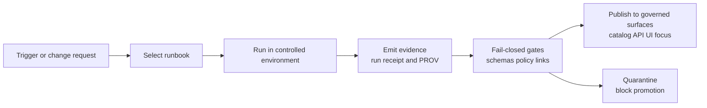

[KFM_META_BLOCK_V2]
doc_id: kfm://doc/0c9a6bbd-9c5b-4f5f-a6a4-54c3a7d5c1a2
title: KFM Runbooks
type: guide
version: v1
status: draft
owners: TBD
created: 2026-02-22
updated: 2026-02-22
policy_label: public
related:
  - kfm://doc/kfm-definitive-design-and-governance-guide-vnext
tags:
  - kfm
  - runbooks
  - operations
notes:
  - Runbooks are operational playbooks and must not bypass governance controls.
  - Do not use YAML frontmatter in this repository’s docs.
[/KFM_META_BLOCK_V2]

# Runbooks
Operational playbooks for running, troubleshooting, and safely governing KFM pipelines, services, and artifacts.

**Status:** Draft · **Owners:** _TBD (assign CODEOWNERS)_ · **Default policy label:** `public` (override per runbook)


**Quick navigation**
- [Scope](#scope)
- [How to find the right runbook](#how-to-find-the-right-runbook)
- [Directory layout](#directory-layout)
- [Runbook index](#runbook-index)
- [Runbook format](#runbook-format)
- [Run receipts and promotion](#run-receipts-and-promotion)
- [Safety and governance](#safety-and-governance)
- [Contributing](#contributing)
- [Appendix: templates](#appendix-templates)

> [!WARNING]
> **Do not commit secrets.** Runbooks must not contain tokens, passwords, private keys, or raw logs that can contain PII.
> Use placeholders and link to *governed* evidence (receipts, PROV, catalog records) instead.

---

## Scope

Runbooks are **step-by-step operational playbooks** for:
- Incident response (service outages, policy enforcement failures, broken ingestion, bad releases).
- Routine operations (promotion, re-indexing, cache warmups, rotating credentials via approved mechanisms).
- Governance-heavy workflows (handling sensitivity restrictions, redaction/generalization runs, rights changes).

Runbooks are **not**:
- Architecture decision records (use `docs/adr/` if present).
- Product or narrative documentation (use Story Nodes / guides).
- A substitute for policy-as-code. If the runbook “fix” is “turn policy off”, stop and escalate.

[Back to top](#runbooks)

---

## How to find the right runbook

1. **Identify the trigger**
   - Incident? Use `INC-*` runbooks.
   - Planned operation? Use `OPS-*` or `DATA-*`.
   - Policy/sensitivity issue? Use `GOV-*` or `SEC-*`.

2. **Search by area**
   - Evidence / catalog / API / UI / pipelines / policy / storage.

3. **Match by symptom**
   - Example: “evidence resolver returns 403 unexpectedly” → look for `INC-EVIDENCE-*`.

4. **Prefer the most recently verified**
   - Runbooks must include a `Last verified` date and be re-validated after meaningful system changes.

[Back to top](#runbooks)

---

## Directory layout

This repository’s broader structure should separate docs, data, policy, contracts, and code (verify against the current repo). This runbooks directory is a **docs-only operational layer**.

**Recommended layout for this folder (create missing directories as needed):**
```text
docs/runbooks/
  README.md                    # This file (runbooks entry point + index + templates)
  incidents/                   # INC-* (triage + restore + comms)
  operations/                  # OPS-* (routine ops: deploy, reindex, backups)
  data/                        # DATA-* (ingest/publish/promotion workflows)
  governance/                  # GOV-* (policy labels, redaction, rights, review queues)
  security/                    # SEC-* (threat-model checklists, audit handling, access issues)
  _templates/                  # Optional: extracted templates for easy copying
  _archive/                    # Deprecated runbooks (keep for audit trail; mark “do not use”)
```

> [!TIP]
> Keep runbooks **task-oriented**. If a runbook grows beyond ~3 pages, consider splitting it into:
> - a “triage” runbook (fast, minimal steps), and
> - a “deep dive / restoration” runbook (detailed, slower).

[Back to top](#runbooks)

---

## Runbook index

Maintain this table as the system grows. Each runbook should be linkable, owned, and time-verified.

| ID | Title | Area | Severity | Owner | Last verified | Policy label | Notes |
|---|---|---:|:---:|---|---|---|---|
| _TBD_ | _Add your first runbook_ | _TBD_ | P? | _TBD_ | YYYY-MM-DD | public/internal/restricted | Keep this index current |

**Severity legend (suggested)**
- **P0**: system down or major safety breach
- **P1**: key workflow broken, significant user impact
- **P2**: degraded performance / partial failure
- **P3**: minor bug / documentation-only fix

[Back to top](#runbooks)

---

## Runbook format

### ID and filename conventions

- **Runbook ID (in title and MetaBlock notes)**
  - `INC-<AREA>-<SYMPTOM>` — incidents
  - `OPS-<AREA>-<TASK>` — operations
  - `DATA-<DATASET_OR_PIPELINE>-<TASK>` — pipelines and publishing
  - `GOV-<TOPIC>-<TASK>` — governance workflows
  - `SEC-<TOPIC>-<TASK>` — security workflows

- **Filename**
  - Lowercase with hyphens, e.g. `inc-evidence-resolver-403.md`

### Required sections (minimum)

Every runbook must include:

1. **Summary**
   - What this runbook is for, and what it is *not* for.

2. **Triggers and symptoms**
   - Observable signals (errors, dashboards, user reports).

3. **Safety and policy checks**
   - Data sensitivity, rights/license checks, and any “stop conditions”.

4. **Prerequisites**
   - Access required (roles), tooling, and where the run is allowed to happen.

5. **Procedure**
   - Step-by-step actions.

6. **Verification**
   - How to confirm the system is correct after the procedure.

7. **Rollback / fail-closed path**
   - If verification fails, how to return to a safe state (or quarantine).

8. **Evidence**
   - Links/refs to run receipts, PROV bundles, promotion manifests, and audit entries (as applicable).

> [!NOTE]
> If a procedure **modifies `data/`**, you must plan for **run receipts + checksums + promotion gates** (see below).

[Back to top](#runbooks)

---

## Run receipts and promotion

Runbooks that touch datasets, catalogs, or published artifacts must align to the **data lifecycle** and the **Promotion Contract** posture:

- Do not treat “it worked on my machine” as a release.
- Prefer PR-based workflows where CI enforces schemas, policy tests, and deterministic identities.

### Promotion gates (fail closed)

Treat these as the minimum checks to move anything into “published runtime surfaces”:

- **Identity & versioning**: deterministic IDs; stable hashing; promotion manifest exists.
- **Artifacts**: artifacts exist and have digests; predictable paths and media types.
- **Catalogs**: DCAT / STAC / PROV validate under the project profile.
- **Cross-links**: links resolve; EvidenceRefs resolve.
- **Policy**: policy label assigned; obligations applied; deny-by-default tests pass.
- **QA**: validation reports present; failures go to quarantine.
- **Audit**: run receipt emitted; approvals recorded where required.

### When a run receipt is required

A run receipt is required when you:
- Ingest or transform source data.
- Generate processed artifacts (GeoParquet, PMTiles, COG, etc.).
- Change catalogs (DCAT/STAC/PROV) for a dataset version.
- Publish (or rollback) a dataset version.

[Back to top](#runbooks)

---

## Safety and governance

### Trust membrane (operational reminder)

- Frontends/clients must not bypass policy enforcement.
- Policy enforcement must be consistent in CI and runtime.
- Errors must not leak restricted dataset existence or sensitive metadata.

### Sensitivity defaults (operational reminder)

- Default to **deny** for sensitive-location / restricted datasets.
- If public display is allowed, create a **separately derived** generalized dataset version.
- Do not embed precise coordinates in narratives or outputs unless policy explicitly allows.
- Treat redaction/generalization as a first-class transform recorded in provenance.

### Rights and licensing (operational reminder)

- “Online availability” is not permission.
- Promotion should block when rights are unknown or forbidden.
- “Metadata-only reference” is acceptable when mirroring is not.

> [!WARNING]
> **Location-sensitive content:** If a runbook touches culturally restricted sites, vulnerable infrastructure,
> private individuals, or sensitive archeological locations, avoid exact coordinates and use policy-approved
> generalization. Escalate to governance review when in doubt.

[Back to top](#runbooks)

---

## Contributing

### Add a new runbook (checklist)

- [ ] Pick an ID and filename using the conventions above.
- [ ] Add a **KFM MetaBlock v2** (no YAML frontmatter).
- [ ] Set **Status** (`draft|review|published`) and assign **Owners**.
- [ ] Add “Last verified: YYYY-MM-DD” and a re-verification trigger.
- [ ] Include a rollback or quarantine path.
- [ ] If the runbook changes data/catalogs/published behavior, include:
  - [ ] run receipt references
  - [ ] promotion manifest references
  - [ ] policy decision reference(s)
- [ ] Update the [Runbook index](#runbook-index) table.

### Update an existing runbook

- [ ] Keep the doc_id stable (do not regenerate).
- [ ] Update the `updated:` field in MetaBlock on meaningful edits.
- [ ] Update “Last verified” only after a real run or confirmed simulation.
- [ ] Add a short “What changed” note.

[Back to top](#runbooks)

---

## Appendix: templates

<details>
<summary><strong>Runbook template (copy/paste)</strong></summary>

```markdown
[KFM_META_BLOCK_V2]
doc_id: kfm://doc/<uuid>
title: <RUNBOOK_ID> — <Runbook title>
type: guide
version: v1
status: draft
owners: <team or names>
created: YYYY-MM-DD
updated: YYYY-MM-DD
policy_label: internal
related:
  - kfm://dataset/<slug>@<version>         # optional
  - kfm://run/<run_id>                     # optional
tags:
  - runbook
  - <area>
notes:
  - Last verified: YYYY-MM-DD (TZ)
  - Re-verify after: <service change / policy change / schema change>
[/KFM_META_BLOCK_V2]

# <RUNBOOK_ID> — <Runbook title>

## Summary
What this runbook fixes, and what it does not cover.

## Triggers and symptoms
- Symptom A:
- Symptom B:

## Safety and policy checks
- Stop condition(s):
- Policy label expectations:
- Rights/license constraints:

## Prerequisites
- Required role(s):
- Required tools:
- Approved environments:

## Procedure
1. Step…
2. Step…

## Verification
- Checks:
- Expected outputs:

## Rollback / quarantine
- If verification fails:
- How to restore the previous safe state:

## Evidence
- Run receipt: prov://...
- Promotion manifest: ...
- Policy decision: kfm://policy_decision/...
- Audit entry: kfm://audit/...
```
</details>

<details>
<summary><strong>Run receipt sketch (for reference)</strong></summary>

```json
{
  "run_id": "kfm://run/<timestamp>.<id>",
  "actor": { "principal": "svc:<name>", "role": "<role>" },
  "operation": "<ingest|transform|publish|rollback>",
  "dataset_version_id": "<dataset_version_id>",
  "inputs": [{ "uri": "<path-or-uri>", "digest": "sha256:<...>" }],
  "outputs": [{ "uri": "<path-or-uri>", "digest": "sha256:<...>" }],
  "environment": { "container_digest": "sha256:<...>", "git_commit": "<sha>", "params_digest": "sha256:<...>" },
  "validation": { "status": "pass|fail", "report_digest": "sha256:<...>" },
  "policy": { "decision_id": "kfm://policy_decision/<id>" },
  "created_at": "<ISO-8601>"
}
```
</details>

<details>
<summary><strong>Promotion manifest sketch (for reference)</strong></summary>

```json
{
  "kfm_promotion_manifest_version": "v1",
  "dataset_slug": "<dataset_slug>",
  "dataset_version_id": "<dataset_version_id>",
  "spec_hash": "sha256:<...>",
  "released_at": "<ISO-8601>",
  "artifacts": [{ "path": "<artifact>", "digest": "sha256:<...>", "media_type": "<mime>" }],
  "catalogs": [{ "path": "<catalog>", "digest": "sha256:<...>" }],
  "qa": { "status": "pass|fail", "report_digest": "sha256:<...>" },
  "policy": { "policy_label": "<label>", "decision_id": "kfm://policy_decision/<id>" },
  "approvals": [{ "role": "<role>", "principal": "<id>", "approved_at": "<ISO-8601>" }]
}
```
</details>

---

### Runbooks in the larger KFM “truth path” (conceptual)



[Back to top](#runbooks)
